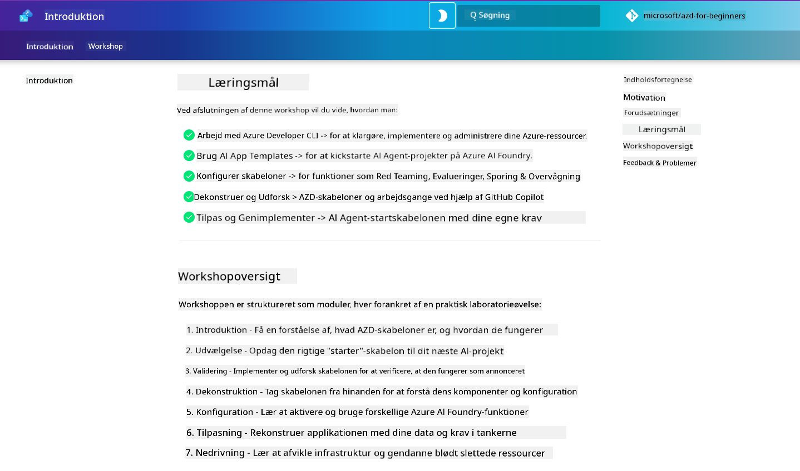

<!--
CO_OP_TRANSLATOR_METADATA:
{
  "original_hash": "9cc966416ab431c38b2ab863884b196c",
  "translation_date": "2025-09-24T21:26:44+00:00",
  "source_file": "workshop/README.md",
  "language_code": "da"
}
-->
# AZD for AI-udviklere Workshop

Velkommen til den praktiske workshop, hvor du lærer Azure Developer CLI (AZD) med fokus på udrulning af AI-applikationer. Denne workshop hjælper dig med at få en praktisk forståelse af AZD-skabeloner i 3 trin:

1. **Opdagelse** - find den skabelon, der passer til dig.
1. **Udrulning** - udrul og valider, at det fungerer.
1. **Tilpasning** - modificer og iterer for at gøre det til dit eget!

I løbet af workshoppen vil du også blive introduceret til centrale udviklerværktøjer og arbejdsgange, der kan hjælpe dig med at optimere din end-to-end udviklingsrejse.

<br/>

## Browser-baseret guide

Workshop-lektionerne er i Markdown. Du kan navigere direkte i GitHub - eller starte en browser-baseret forhåndsvisning som vist på skærmbilledet nedenfor.



For at bruge denne mulighed - fork repository til din profil og start GitHub Codespaces. Når VS Code-terminalen er aktiv, skal du skrive denne kommando:

```bash title="" linenums="0"
mkdocs serve > /dev/null 2>&1 &
```

Efter få sekunder vil du se en pop-up dialog. Vælg muligheden `Open in browser`. Den webbaserede guide åbnes nu i en ny browserfane. Nogle fordele ved denne forhåndsvisning:

1. **Indbygget søgning** - find nøgleord eller lektioner hurtigt.
1. **Kopier-ikon** - hold musen over kodeblokke for at se denne mulighed.
1. **Tema-skift** - skift mellem mørke og lyse temaer.
1. **Få hjælp** - klik på Discord-ikonet i footeren for at deltage!

<br/>

## Workshopoversigt

**Varighed:** 3-4 timer  
**Niveau:** Begynder til mellemniveau  
**Forudsætninger:** Kendskab til Azure, AI-koncepter, VS Code og kommandolinjeværktøjer.

Dette er en praktisk workshop, hvor du lærer ved at gøre. Når du har gennemført øvelserne, anbefaler vi at gennemgå AZD For Beginners-kurset for at fortsætte din læringsrejse inden for sikkerhed og produktivitetsbedste praksis.

| Tid | Modul  | Mål |
|:---|:---|:---|
| 15 min | [Introduktion](docs/instructions/0-Introduction.md) | Sæt scenen, forstå målene |
| 30 min | [Vælg AI-skabelon](docs/instructions/1-Select-AI-Template.md) | Udforsk muligheder og vælg en startskabelon | 
| 30 min | [Valider AI-skabelon](docs/instructions/2-Validate-AI-Template.md) | Udrul standardløsning til Azure |
| 30 min | [Dekonstruer AI-skabelon](docs/instructions/3-Deconstruct-AI-Template.md) | Udforsk struktur og konfiguration |
| 30 min | [Konfigurer AI-skabelon](docs/instructions/4-Configure-AI-Template.md) | Aktivér og prøv tilgængelige funktioner |
| 30 min | [Tilpas AI-skabelon](docs/instructions/5-Customize-AI-Template.md) | Tilpas skabelonen til dine behov |
| 30 min | [Nedtag infrastruktur](docs/instructions/6-Teardown-Infrastructure.md) | Ryd op og frigiv ressourcer |
| 15 min | [Afslutning & næste skridt](docs/instructions/7-Wrap-up.md) | Læringsressourcer, workshopudfordring |

<br/>

## Hvad du vil lære

Tænk på AZD-skabelonen som en læringssandkasse til at udforske forskellige funktioner og værktøjer til end-to-end udvikling på Azure AI Foundry. Ved slutningen af workshoppen bør du have en intuitiv forståelse af forskellige værktøjer og koncepter i denne kontekst.

| Koncept  | Mål |
|:---|:---|
| **Azure Developer CLI** | Forstå værktøjets kommandoer og arbejdsgange |
| **AZD-skabeloner**| Forstå projektstruktur og konfiguration |
| **Azure AI Agent**| Klargør og udrul Azure AI Foundry-projekt |
| **Azure AI Search**| Aktiver kontekstengineering med agenter |
| **Observabilitet**| Udforsk tracing, overvågning og evalueringer |
| **Red Teaming**| Udforsk modstandstest og afhjælpninger |

<br/>

## Workshopstruktur

Workshoppen er struktureret til at tage dig på en rejse fra skabelonopdagelse til udrulning, dekonstruering og tilpasning - med den officielle [Getting Started with AI Agents](https://github.com/Azure-Samples/get-started-with-ai-agents) startskabelon som grundlag.

### [Modul 1: Vælg AI-skabelon](docs/instructions/1-Select-AI-Template.md) (30 min)

- Hvad er AI-skabeloner?
- Hvor kan jeg finde AI-skabeloner?
- Hvordan kan jeg komme i gang med at bygge AI-agenter?
- **Lab**: Hurtigstart med GitHub Codespaces

### [Modul 2: Valider AI-skabelon](docs/instructions/2-Validate-AI-Template.md) (30 min)

- Hvad er AI-skabelonens arkitektur?
- Hvad er AZD-udviklingsarbejdsgangen?
- Hvordan kan jeg få hjælp til AZD-udvikling?
- **Lab**: Udrul & valider AI-agentskabelon

### [Modul 3: Dekonstruer AI-skabelon](docs/instructions/3-Deconstruct-AI-Template.md) (30 min)

- Udforsk dit miljø i `.azure/` 
- Udforsk din ressourceopsætning i `infra/` 
- Udforsk din AZD-konfiguration i `azure.yaml`s
- **Lab**: Modificer miljøvariabler & udrul igen

### [Modul 4: Konfigurer AI-skabelon](docs/instructions/4-Configure-AI-Template.md) (30 min)
- Udforsk: Retrieval Augmented Generation
- Udforsk: Agent-evaluering & Red Teaming
- Udforsk: Tracing & overvågning
- **Lab**: Udforsk AI-agent + observabilitet 

### [Modul 5: Tilpas AI-skabelon](docs/instructions/5-Customize-AI-Template.md) (30 min)
- Definer: PRD med scenariekrav
- Konfigurer: Miljøvariabler for AZD
- Implementer: Lifecycle Hooks for ekstra opgaver
- **Lab**: Tilpas skabelon til mit scenarie

### [Modul 6: Nedtag infrastruktur](docs/instructions/6-Teardown-Infrastructure.md) (30 min)
- Opsummering: Hvad er AZD-skabeloner?
- Opsummering: Hvorfor bruge Azure Developer CLI?
- Næste skridt: Prøv en anden skabelon!
- **Lab**: Afvikl infrastruktur & ryd op

<br/>

## Workshopudfordring

Vil du udfordre dig selv til at gøre mere? Her er nogle projektforslag - eller del dine idéer med os!!

| Projekt | Beskrivelse |
|:---|:---|
|1. **Dekonstruer en kompleks AI-skabelon** | Brug den arbejdsgang og de værktøjer, vi har skitseret, og se, om du kan udrulle, validere og tilpasse en anden AI-løsningsskabelon. _Hvad lærte du?_|
|2. **Tilpas med dit scenarie**  | Prøv at skrive en PRD (Product Requirements Document) for et andet scenarie. Brug derefter GitHub Copilot i din skabelonrepo i Agent Model - og bed det om at generere en tilpasningsarbejdsgang for dig. _Hvad lærte du? Hvordan kunne du forbedre disse forslag?_|
| | |

## Har du feedback?

1. Opret en issue på dette repo - tag den med `Workshop` for nemheds skyld.
1. Deltag i Azure AI Foundry Discord - forbind med dine kolleger!


| | | 
|:---|:---|
| **📚 Kursushjem**| [AZD For Beginners](../README.md)|
| **📖 Dokumentation** | [Kom i gang med AI-skabeloner](https://learn.microsoft.com/en-us/azure/ai-foundry/how-to/develop/ai-template-get-started)|
| **🛠️AI-skabeloner** | [Azure AI Foundry Templates](https://ai.azure.com/templates) |
|**🚀 Næste skridt** | [Tag udfordringen](../../../workshop) |
| | |

<br/>

---

**Forrige:** [AI Fejlfindingsguide](../docs/troubleshooting/ai-troubleshooting.md) | **Næste:** Begynd med [Lab 1: AZD Basics](../../../workshop/lab-1-azd-basics)

**Klar til at begynde at bygge AI-applikationer med AZD?**

[Start Lab 1: AZD Foundations →](./lab-1-azd-basics/README.md)

---

