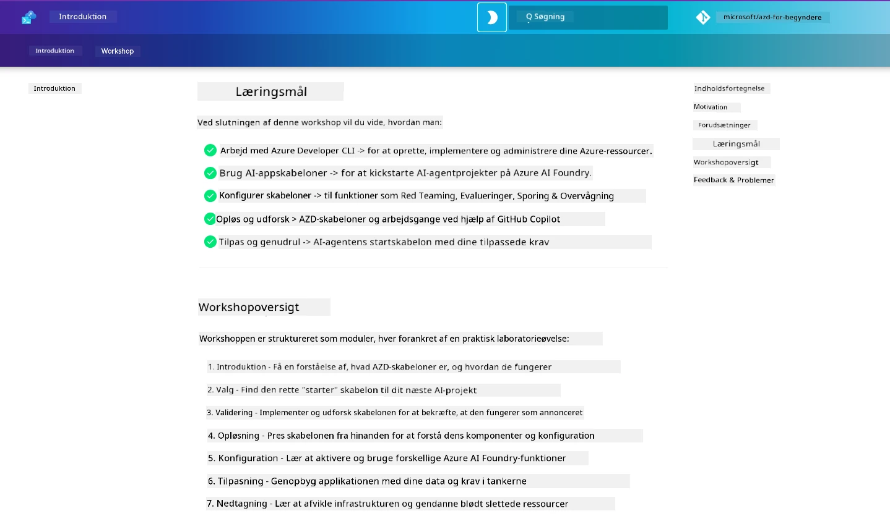

<div align="center">
  <div style="background: linear-gradient(135deg, #0078d4, #106ebe); border-radius: 10px; padding: 20px; margin: 20px 0; box-shadow: 0 4px 15px rgba(0, 120, 212, 0.3); border: 2px solid #005a9e;">
    <h2 style="color: white; margin: 0; font-size: 24px; text-shadow: 1px 1px 2px rgba(0,0,0,0.3);">
      🎯 AZD for AI-udviklere Workshop
    </h2>
    <p style="color: white; margin: 10px 0 0 0; font-size: 16px; text-shadow: 1px 1px 2px rgba(0,0,0,0.3);">
      <strong>En hands-on workshop til opbygning af AI-applikationer med Azure Developer CLI.</strong><br>
      Gennemfør 7 moduler for at mestre AZD-skabeloner og AI-udrulningsarbejdsgange.
    </p>
    <div style="margin-top: 15px;">
      <span style="background: rgba(255,255,255,0.2); padding: 5px 10px; border-radius: 15px; color: white; font-size: 14px;">
        📅 Senest opdateret: februar 2026
      </span>
    </div>
  </div>
</div>

# AZD for AI-udviklere Workshop

Velkommen til den hands-on workshop for at lære Azure Developer CLI (AZD) med fokus på udrulning af AI-applikationer. Denne workshop hjælper dig med at få en anvendt forståelse af AZD-skabeloner i 3 trin:

1. **Discovery** - find den skabelon, der passer til dig.
1. **Deployment** - udrul og verificer, at det virker
1. **Customization** - modificer og iterer for at gøre det til dit!

I løbet af denne workshop bliver du også introduceret til kerneværktøjer og arbejdsprocesser for udviklere, så du kan strømline din ende-til-ende udviklingsrejse.

<br/>

## Browser-baseret vejledning

Workshop-lektionerne er i Markdown. Du kan navigere dem direkte i GitHub - eller starte en browserbaseret forhåndsvisning som vist i skærmbilledet nedenfor.



For at bruge denne mulighed - fork repositoryet til din profil, og start GitHub Codespaces. Når VS Code-terminalen er aktiv, skriv denne kommando:

```bash title="" linenums="0"
mkdocs serve > /dev/null 2>&1 &
```

Om få sekunder vil du se en pop-up dialog. Vælg indstillingen `Open in browser`. Den web-baserede vejledning åbner nu i en ny browserfane. Nogle fordele ved denne forhåndsvisning:

1. **Indbygget søgning** - find nøgleord eller lektioner hurtigt.
1. **Kopier-ikon** - hold musen over kodeblokke for at se denne mulighed
1. **Tema-skift** - skift mellem mørkt og lyst tema
1. **Få hjælp** - klik på Discord-ikonet i footeren for at være med!

<br/>

## Workshopoversigt

**Varighed:** 3-4 timer  
**Niveau:** Begynder til mellemniveau  
**Forudsætninger:** Kendskab til Azure, AI-koncepter, VS Code & kommandolinjeværktøjer.

Dette er en hands-on workshop, hvor du lærer ved at gøre. Når du har gennemført øvelserne, anbefaler vi, at du gennemgår AZD For Beginners pensum for at fortsætte din læringsrejse inden for sikkerhed og produktivitets bedste praksis.

| Time| Module  | Objective |
|:---|:---|:---|
| 15 mins | [Introduktion](docs/instructions/0-Introduction.md) | Sæt scenen, forstå målene |
| 30 mins | [Vælg AI-skabelon](docs/instructions/1-Select-AI-Template.md) | Udforsk muligheder og vælg starter | 
| 30 mins | [Valider AI-skabelon](docs/instructions/2-Validate-AI-Template.md) | Udrul standardsolution til Azure |
| 30 mins | [Dekonstruer AI-skabelon](docs/instructions/3-Deconstruct-AI-Template.md) | Udforsk struktur og konfiguration |
| 30 mins | [Konfigurer AI-skabelon](docs/instructions/4-Configure-AI-Template.md) | Aktiver og prøv tilgængelige funktioner |
| 30 mins | [Tilpas AI-skabelon](docs/instructions/5-Customize-AI-Template.md) | Tilpas skabelonen til dine behov |
| 30 mins | [Nedtagning af infrastruktur](docs/instructions/6-Teardown-Infrastructure.md) | Ryd op og frigiv ressourcer |
| 15 mins | [Opsummering og næste skridt](docs/instructions/7-Wrap-up.md) | Læringsressourcer, Workshop-udfordring |

<br/>

## Hvad du vil lære

Tænk på AZD-skabelonen som en læringssandkasse til at udforske forskellige kapabiliteter og værktøjer til ende-til-ende udvikling på Microsoft Foundry. Når du er færdig med denne workshop, bør du have en intuitiv fornemmelse for forskellige værktøjer og koncepter i denne kontekst.

| Concept  | Objective |
|:---|:---|
| **Azure Developer CLI** | Forstå værktøjskommandoer og arbejdsgange|
| **AZD Templates**| Forstå projektstruktur og konfiguration|
| **Azure AI Agent**| Provisionér & udrul Microsoft Foundry-projektet  |
| **Azure AI Search**| Muliggør kontekst-engineering med agenter |
| **Observability**| Undersøg sporing, overvågning og evalueringer |
| **Red Teaming**| Undersøg adversarial testning og afbødninger |

<br/>

## Workshopstruktur

Workshoppen er struktureret til at føre dig på en rejse fra skabelonopdagelse til udrulning, dekonstruering og tilpasning - ved hjælp af den officielle [Getting Started with AI Agents](https://github.com/Azure-Samples/get-started-with-ai-agents) starter-skabelon som basis.

### [Modul 1: Vælg AI-skabelon](docs/instructions/1-Select-AI-Template.md) (30 min)

- Hvad er AI-skabeloner?
- Hvor kan jeg finde AI-skabeloner?
- Hvordan kommer jeg i gang med at bygge AI-agenter?
- **Lab**: Quickstart med GitHub Codespaces

### [Modul 2: Valider AI-skabelon](docs/instructions/2-Validate-AI-Template.md) (30 min)

- Hvad er AI-skabelonens arkitektur?
- Hvad er AZD-udviklingsworkflowet?
- Hvordan kan jeg få hjælp til AZD-udvikling?
- **Lab**: Udrul & valider AI Agents-skabelon

### [Modul 3: Dekonstruer AI-skabelon](docs/instructions/3-Deconstruct-AI-Template.md) (30 min)

- Udforsk dit miljø i `.azure/` 
- Udforsk din ressourceopsætning i `infra/` 
- Udforsk din AZD-konfiguration i `azure.yaml`-filerne
- **Lab**: Ændr miljøvariabler & genudrul

### [Modul 4: Konfigurer AI-skabelon](docs/instructions/4-Configure-AI-Template.md) (30 min)
- Udforsk: Retrieval Augmented Generation
- Udforsk: Agent-evaluering & Red Teaming
- Udforsk: Sporing & overvågning
- **Lab**: Udforsk AI Agent + Observability 

### [Modul 5: Tilpas AI-skabelon](docs/instructions/5-Customize-AI-Template.md) (30 min)
- Definér: PRD med scenariekrav
- Konfigurer: Miljøvariabler for AZD
- Implementér: Lifecycle Hooks for tilføjede opgaver
- **Lab**: Tilpas skabelon til mit scenarie

### [Modul 6: Nedtagning af infrastruktur](docs/instructions/6-Teardown-Infrastructure.md) (30 min)
- Opsummering: Hvad er AZD-skabeloner?
- Opsummering: Hvorfor bruge Azure Developer CLI?
- Næste skridt: Prøv en anden skabelon!
- **Lab**: Deprovisionér infrastruktur & ryd op

<br/>

## Workshopudfordring

Vil du udfordre dig selv yderligere? Her er nogle projektforslag - eller del dine ideer med os!!

| Project | Description |
|:---|:---|
|1. **Dekonstruer en kompleks AI-skabelon** | Brug workflowet og værktøjerne, vi skitserede, og se om du kan udrulle, validere og tilpasse en anden AI-løsningsskabelon. _Hvad lærte du?_|
|2. **Tilpas til dit scenarie**  | Prøv at skrive en PRD (Product Requirements Document) for et andet scenarie. Brug derefter GitHub Copilot i dit skabelonrepo i Agent Model - og bed det om at generere en tilpasningsworkflow for dig. _Hvad lærte du? Hvordan kunne du forbedre disse forslag?_|
| | |

## Har du feedback?

1. Opret en issue i dette repo - mærk den `Workshop` for nemheds skyld.
1. Deltag i Microsoft Foundry Discord - forbind dig med dine kolleger!


| | | 
|:---|:---|
| **📚 Kursusforside**| [AZD For Beginners](../README.md)|
| **📖 Dokumentation** | [Get started with AI templates](https://learn.microsoft.com/en-us/azure/ai-foundry/how-to/develop/ai-template-get-started)|
| **🛠️AI Templates** | [Microsoft Foundry Templates](https://ai.azure.com/templates) |
|**🚀 Næste skridt** | [Begynd Workshop](../../../workshop) |
| | |

<br/>

---

**Navigation:** [Hovedkursus](../README.md) | [Introduktion](docs/instructions/0-Introduction.md) | [Modul 1: Vælg AI-skabelon](docs/instructions/1-Select-AI-Template.md)

**Klar til at begynde at bygge AI-applikationer med AZD?**

[Begynd Workshop: Introduktion →](docs/instructions/0-Introduction.md)

---

<!-- CO-OP TRANSLATOR DISCLAIMER START -->
Ansvarsfraskrivelse:
Dette dokument er blevet oversat ved hjælp af AI-oversættelsestjenesten Co-op Translator (https://github.com/Azure/co-op-translator). Selvom vi bestræber os på nøjagtighed, bedes du være opmærksom på, at automatiske oversættelser kan indeholde fejl eller unøjagtigheder. Det oprindelige dokument på originalsproget bør betragtes som den autoritative kilde. For kritisk information anbefales en professionel, menneskelig oversættelse. Vi er ikke ansvarlige for eventuelle misforståelser eller fejltolkninger som følge af brugen af denne oversættelse.
<!-- CO-OP TRANSLATOR DISCLAIMER END -->