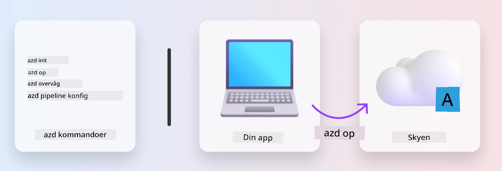
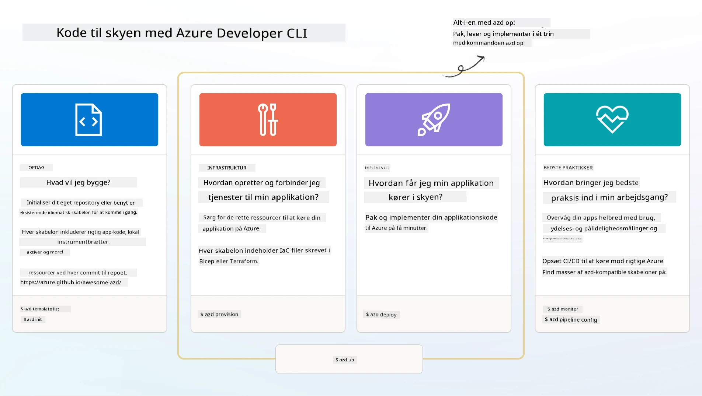

# 1. Vælg en skabelon

!!! tip "BY THE END OF THIS MODULE YOU WILL BE ABLE TO"

    - [ ] Beskriv hvad AZD-skabeloner er
    - [ ] Opdag og brug AZD-skabeloner til AI
    - [ ] Kom i gang med AI Agents-skabelonen
    - [ ] **Lab 1:** AZD Quickstart med GitHub Codespaces

---

## 1. En bygherre-analogi

At bygge en moderne, virksomhedsklar AI-applikation _fra bunden_ kan være skræmmende. Det er lidt som at bygge dit nye hjem selv, mursten for mursten. Ja, det kan lade sig gøre! Men det er ikke den mest effektive måde at opnå det ønskede slutresultat på! 

I stedet starter vi ofte med en eksisterende _designtegning_, og arbejder sammen med en arkitekt for at tilpasse den til vores personlige krav. Og det er præcis den fremgangsmåde, man bør bruge, når man bygger intelligente applikationer. Find først en god designarkitektur, der passer til dit problemområde. Arbejd derefter sammen med en løsningsarkitekt for at tilpasse og udvikle løsningen til dit specifikke scenarie.

Men hvor kan vi finde disse designtegninger? Og hvordan finder vi en arkitekt, der er villig til at lære os, hvordan vi tilpasser og udruller disse tegninger selv? I denne workshop besvarer vi disse spørgsmål ved at introducere dig for tre teknologier:

1. [Azure Developer CLI](https://aka.ms/azd) - et open source-værktøj, der accelererer udviklerens vej fra lokal udvikling (build) til cloud-udrulning (ship).
1. [Microsoft Foundry Templates](https://ai.azure.com/templates) - standardiserede open-source repositories, der indeholder eksempelkode, infrastruktur- og konfigurationsfiler til udrulning af en AI-løsningsarkitektur.
1. [GitHub Copilot Agent Mode](https://code.visualstudio.com/docs/copilot/chat/chat-agent-mode) - en kodeassistent baseret på Azure-viden, som kan guide os i at navigere i kodebasen og foretage ændringer - ved hjælp af naturligt sprog.

Med disse værktøjer i hånden kan vi nu _opdage_ den rigtige skabelon, _udrulle_ den for at validere, at den virker, og _tilpasse_ den til vores specifikke scenarier. Lad os dykke ned og lære, hvordan de fungerer.


---

## 2. Azure Developer CLI

The [Azure Developer CLI](https://learn.microsoft.com/en-us/azure/developer/azure-developer-cli/) (or `azd`) is an open-source commandline tool that can speed up your code-to-cloud journey with a set of developer-friendly commands that work consistently across your IDE (development) and CI/CD (devops) environments.

With `azd`, your deployment journey can be as simple as:

- `azd init` - Initialiserer et nyt AI-projekt fra en eksisterende AZD-skabelon.
- `azd up` - Provisionerer infrastruktur og udruller din applikation i ét trin.
- `azd monitor` - Få realtidsmonitorering og diagnostik for din udrullede applikation.
- `azd pipeline config` - Opsæt CI/CD-pipelines for at automatisere udrulning til Azure.

**🎯 | EXERCISE**: <br/> Udforsk `azd` kommandolinjeværktøjet i dit GitHub Codespaces-miljø nu. Start med at skrive denne kommando for at se, hvad værktøjet kan gøre:

```bash title="" linenums="0"
azd help
```



---

## 3. AZD-skabelonen

For at `azd` kan gøre dette, skal det kende den infrastruktur, der skal provisioneres, konfigurationsindstillingerne, der skal håndhæves, og applikationen, der skal udrulles. Det er her, [AZD-skabeloner](https://learn.microsoft.com/en-us/azure/developer/azure-developer-cli/azd-templates?tabs=csharp) kommer ind.

AZD-skabeloner er open-source repositories, der kombinerer eksempelkode med infrastruktur- og konfigurationsfiler, der kræves for at udrulle løsningsarkitekturen.
Ved at bruge en _Infrastructure-as-Code_ (IaC)-tilgang giver de mulighed for, at skabelonens ressource-definitioner og konfigurationsindstillinger kan være versionsstyrede (lige som appens kildekode) - hvilket skaber genbrugelige og konsistente arbejdsprocesser på tværs af brugere af projektet.

Når du opretter eller genbruger en AZD-skabelon til _dit_ scenarie, så overvej disse spørgsmål:

1. Hvad bygger du? → Findes der en skabelon, der har startkode til det scenarie?
1. Hvordan er din løsning arkitektureret? → Findes der en skabelon, der har de nødvendige ressourcer?
1. Hvordan bliver din løsning udrullet? → Tænk `azd deploy` med pre/post-processing hooks!
1. Hvordan kan du optimere det yderligere? → Tænk indbygget overvågning og automatiserings-pipelines!

**🎯 | EXERCISE**: <br/> 
Besøg [Awesome AZD](https://azure.github.io/awesome-azd/) galleriet og brug filtrene til at udforske de 250+ skabeloner, der i øjeblikket er tilgængelige. Se om du kan finde en, der matcher _dine_ scenariekrav.



---

## 4. AI-appskabeloner

For AI-drevne applikationer tilbyder Microsoft specialiserede skabeloner med **Microsoft Foundry** og **Foundry Agents**. Disse skabeloner fremskynder din vej til at bygge intelligente, produktionsklare applikationer.

### Microsoft Foundry & Foundry Agents Templates

Select a template below to deploy. Each template is available on [Awesome AZD](https://azure.github.io/awesome-azd/) and can be initialized with a single command.

| Skabelon | Beskrivelse | Udrulningskommando |
|----------|-------------|--------------------|
| **[AI Chat with RAG](https://azure.github.io/awesome-azd/?tags=ai&tags=rag)** | Chat-applikation med Retrieval Augmented Generation ved hjælp af Microsoft Foundry | `azd init -t azure-samples/azure-search-openai-demo` |
| **[Foundry Agent Service Starter](https://azure.github.io/awesome-azd/?tags=ai&tags=agents)** | Byg AI-agenter med Foundry Agents til autonom opgaveudførelse | `azd init -t azure-samples/foundry-agent-service-starter` |
| **[Multi-Agent Orchestration](https://azure.github.io/awesome-azd/?tags=ai&tags=agents)** | Koordiner flere Foundry Agents for komplekse arbejdsgange | `azd init -t azure-samples/multi-agent-orchestration` |
| **[AI Document Intelligence](https://azure.github.io/awesome-azd/?tags=ai&tags=document)** | Ekstraher og analyser dokumenter med Microsoft Foundry-modeller | `azd init -t azure-samples/ai-document-processing` |
| **[Conversational AI Bot](https://azure.github.io/awesome-azd/?tags=ai&tags=bot)** | Byg intelligente chatbots med Microsoft Foundry-integration | `azd init -t azure-samples/ai-chat-protocol` |
| **[AI Image Generation](https://azure.github.io/awesome-azd/?tags=ai&tags=dalle)** | Generer billeder ved hjælp af DALL-E via Microsoft Foundry | `azd init -t azure-samples/ai-image-generation` |
| **[Semantic Kernel Agent](https://azure.github.io/awesome-azd/?tags=ai&tags=semantic-kernel)** | AI-agenter, der bruger Semantic Kernel med Foundry Agents | `azd init -t azure-samples/semantic-kernel-agent` |
| **[AutoGen Multi-Agent](https://azure.github.io/awesome-azd/?tags=ai&tags=autogen)** | Multi-agent-systemer ved hjælp af AutoGen-rammeværket | `azd init -t azure-samples/autogen-multi-agent` |

### Hurtig start

1. **Gennemse skabeloner**: Besøg [https://azure.github.io/awesome-azd/](https://azure.github.io/awesome-azd/) og filtrér efter `AI`, `Agents` eller `Microsoft Foundry`
2. **Vælg din skabelon**: Vælg en, der matcher dit brugstilfælde
3. **Initialiser**: Kør `azd init`-kommandoen for din valgte skabelon
4. **Udrul**: Kør `azd up` for at provisionere og udrulle

**🎯 | EXERCISE**: <br/>
Vælg en af skabelonerne ovenfor baseret på dit scenarie:

- **Bygger du en chatbot?** → Start med **AI Chat with RAG** eller **Conversational AI Bot**
- **Har du brug for autonome agenter?** → Prøv **Foundry Agent Service Starter** eller **Multi-Agent Orchestration**
- **Behandler du dokumenter?** → Brug **AI Document Intelligence**
- **Vil du have AI-kodningsassistance?** → Undersøg **Semantic Kernel Agent** eller **AutoGen Multi-Agent**

```bash title="Example: Deploy the AI Chat with RAG template" linenums="0"
azd init -t azure-samples/azure-search-openai-demo
azd up
```

!!! info "Explore More Templates"
    [Awesome AZD-galleriet](https://azure.github.io/awesome-azd/) indeholder 250+ skabeloner. Brug filtrene til at finde skabeloner, der matcher dine specifikke krav til sprog, framework og Azure-tjenester.

---

<!-- CO-OP TRANSLATOR DISCLAIMER START -->
**Ansvarsfraskrivelse**:
Dette dokument er blevet oversat ved hjælp af AI-oversættelsestjenesten [Co-op Translator](https://github.com/Azure/co-op-translator). Selvom vi bestræber os på nøjagtighed, bedes du være opmærksom på, at automatiske oversættelser kan indeholde fejl eller unøjagtigheder. Det oprindelige dokument på originalsproget bør betragtes som den autoritative kilde. For kritisk information anbefales en professionel menneskelig oversættelse. Vi påtager os intet ansvar for misforståelser eller fejltolkninger, som opstår som følge af brugen af denne oversættelse.
<!-- CO-OP TRANSLATOR DISCLAIMER END -->