<!--
CO_OP_TRANSLATOR_METADATA:
{
  "original_hash": "7816c6ec50c694c331e7c6092371be4d",
  "translation_date": "2025-09-24T21:37:25+00:00",
  "source_file": "workshop/docs/instructions/2-Validate-AI-Template.md",
  "language_code": "da"
}
-->
# 2. Valider en skabelon

!!! tip "VED SLUTNINGEN AF DETTE MODUL VIL DU KUNNE"

    - [ ] Analysere AI-løsningsarkitekturen
    - [ ] Forstå AZD-implementeringsworkflowet
    - [ ] Bruge GitHub Copilot til at få hjælp med AZD
    - [ ] **Lab 2:** Implementere og validere AI Agents-skabelonen

---

## 1. Introduktion

[Azure Developer CLI](https://learn.microsoft.com/en-us/azure/developer/azure-developer-cli/) eller `azd` er et open-source kommandolinjeværktøj, der forenkler udviklerens workflow, når der bygges og implementeres applikationer til Azure.

[AZD-skabeloner](https://learn.microsoft.com/azure/developer/azure-developer-cli/azd-templates) er standardiserede repositories, der inkluderer eksempelapplikationskode, _infrastruktur som kode_-ressourcer og `azd`-konfigurationsfiler for en sammenhængende løsningsarkitektur. At klargøre infrastrukturen bliver så simpelt som en `azd provision`-kommando - mens brugen af `azd up` giver dig mulighed for at klargøre infrastrukturen **og** implementere din applikation på én gang!

Som resultat kan opstarten af din applikationsudviklingsproces være så enkel som at finde den rette _AZD Starter-skabelon_, der kommer tættest på dine applikations- og infrastrukturbehov - og derefter tilpasse repositoryet til dine scenariekrav.

Før vi begynder, lad os sikre, at du har Azure Developer CLI installeret.

1. Åbn en VS Code-terminal og skriv denne kommando:

      ```bash title="" linenums="0"
      azd version
      ```

1. Du bør se noget som dette!

      ```bash title="" linenums="0"
      azd version 1.19.0 (commit b3d68cea969b2bfbaa7b7fa289424428edb93e97)
      ```

**Du er nu klar til at vælge og implementere en skabelon med azd**

---

## 2. Skabelonvalg

Azure AI Foundry-platformen kommer med et [sæt anbefalede AZD-skabeloner](https://learn.microsoft.com/en-us/azure/ai-foundry/how-to/develop/ai-template-get-started), der dækker populære løsningsscenarier som _multi-agent workflow-automatisering_ og _multi-modal indholdsbehandling_. Du kan også finde disse skabeloner ved at besøge Azure AI Foundry-portalen.

1. Besøg [https://ai.azure.com/templates](https://ai.azure.com/templates)
1. Log ind på Azure AI Foundry-portalen, når du bliver bedt om det - du vil se noget som dette.

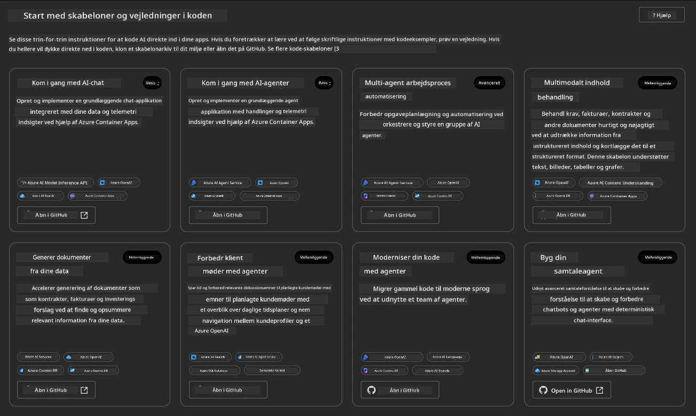

**Basic**-mulighederne er dine startskabeloner:

1. [ ] [Kom i gang med AI Chat](https://github.com/Azure-Samples/get-started-with-ai-chat), der implementerer en grundlæggende chatapplikation _med dine data_ til Azure Container Apps. Brug denne til at udforske et grundlæggende AI-chatbot-scenarie.
1. [X] [Kom i gang med AI Agents](https://github.com/Azure-Samples/get-started-with-ai-agents), der også implementerer en standard AI-agent (med Azure AI Agent Service). Brug denne til at blive fortrolig med agentbaserede AI-løsninger, der involverer værktøjer og modeller.

Besøg det andet link i en ny browserfane (eller klik på `Open in GitHub` for det relaterede kort). Du bør se repositoryet for denne AZD-skabelon. Tag et øjeblik til at udforske README. Applikationsarkitekturen ser sådan ud:


---

## 3. Skabelonaktivering

Lad os prøve at implementere denne skabelon og sikre, at den er gyldig. Vi følger retningslinjerne i [Kom i gang](https://github.com/Azure-Samples/get-started-with-ai-agents?tab=readme-ov-file#getting-started)-sektionen.

1. Klik på [dette link](https://github.com/codespaces/new/Azure-Samples/get-started-with-ai-agents) - bekræft standardhandlingen til `Create codespace`
1. Dette åbner en ny browserfane - vent på, at GitHub Codespaces-sessionen er færdig med at indlæse
1. Åbn VS Code-terminalen i Codespaces - skriv følgende kommando:

   ```bash title="" linenums="0"
   azd up
   ```

Færdiggør de workflow-trin, som dette vil udløse:

1. Du bliver bedt om at logge ind på Azure - følg instruktionerne for at autentificere
1. Indtast et unikt miljønavn for dig - f.eks. brugte jeg `nitya-mshack-azd`
1. Dette vil oprette en `.azure/`-mappe - du vil se en undermappe med miljønavnet
1. Du bliver bedt om at vælge et abonnementsnavn - vælg standarden
1. Du bliver bedt om en placering - brug `East US 2`

Nu venter du på, at klargøringen er færdig. **Dette tager 10-15 minutter**

1. Når det er færdigt, vil din konsol vise en SUCCESS-besked som denne:
      ```bash title="" linenums="0"
      SUCCESS: Your up workflow to provision and deploy to Azure completed in 10 minutes 17 seconds.
      ```
1. Din Azure Portal vil nu have en klargjort ressourcegruppe med det miljønavn:

      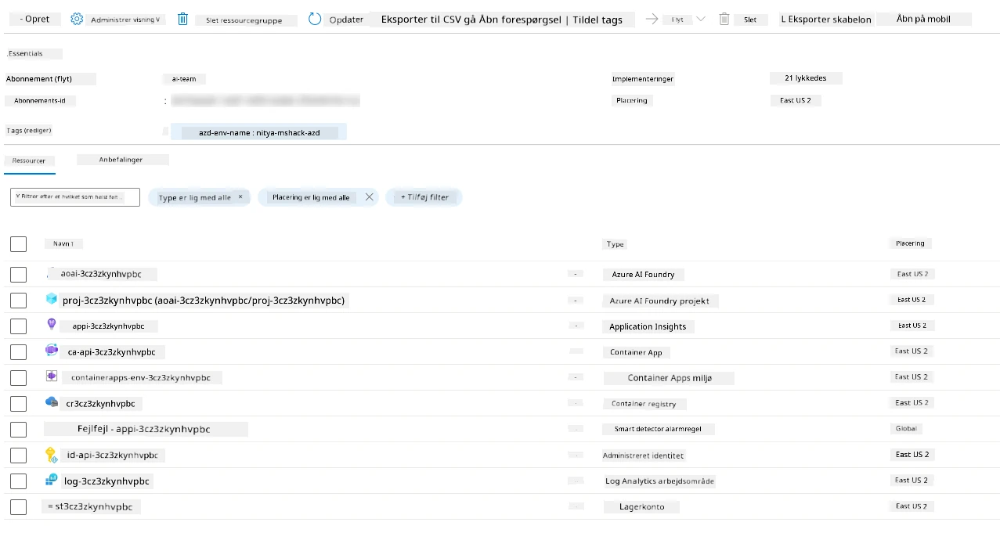

1. **Du er nu klar til at validere den implementerede infrastruktur og applikation**.

---

## 4. Skabelonvalidering

1. Besøg Azure Portal [Resource Groups](https://portal.azure.com/#browse/resourcegroups)-siden - log ind, når du bliver bedt om det
1. Klik på RG for dit miljønavn - du ser siden ovenfor

      - klik på Azure Container Apps-ressourcen
      - klik på applikations-URL'en i _Essentials_-sektionen (øverst til højre)

1. Du bør se en hostet applikationsfrontend-UI som denne:

   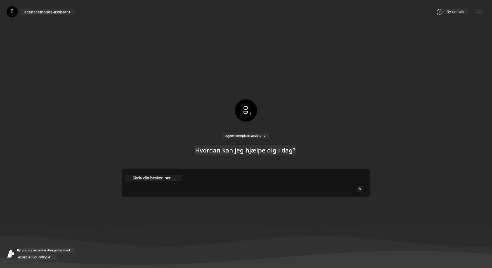

1. Prøv at stille et par [eksempelspørgsmål](https://github.com/Azure-Samples/get-started-with-ai-agents/blob/main/docs/sample_questions.md)

      1. Spørg: ```Hvad er hovedstaden i Frankrig?``` 
      1. Spørg: ```Hvad er det bedste telt under $200 til to personer, og hvilke funktioner har det?```

1. Du bør få svar, der ligner det, der vises nedenfor. _Men hvordan fungerer dette?_ 

      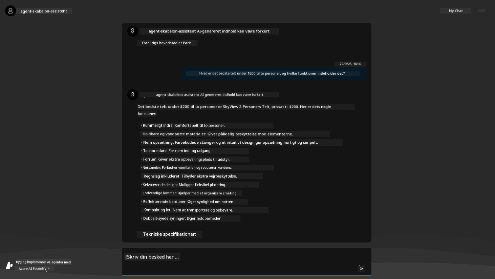

---

## 5. Agentvalidering

Azure Container App implementerer en endpoint, der forbinder til AI-agenten, der er klargjort i Azure AI Foundry-projektet for denne skabelon. Lad os tage et kig på, hvad det betyder.

1. Gå tilbage til Azure Portal _Overview_-siden for din ressourcegruppe

1. Klik på `Azure AI Foundry`-ressourcen i listen

1. Du bør se dette. Klik på knappen `Go to Azure AI Foundry Portal`. 
   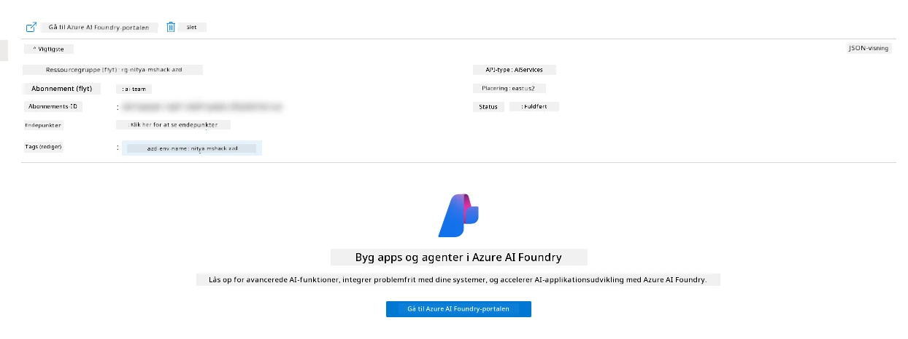

1. Du bør se Foundry Project-siden for din AI-applikation
   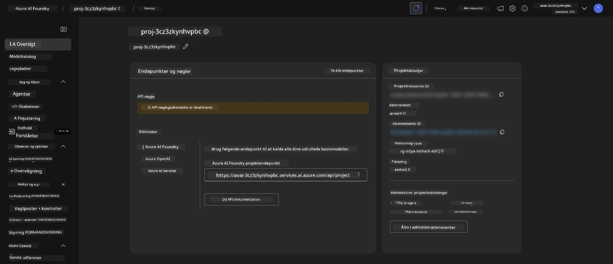

1. Klik på `Agents` - du ser den standardagent, der er klargjort i dit projekt
   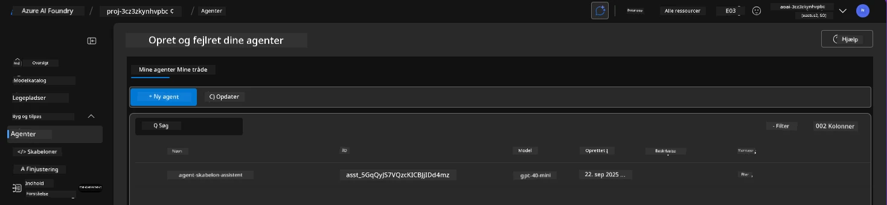

1. Vælg den - og du ser agentens detaljer. Bemærk følgende:

      - Agenten bruger File Search som standard (altid)
      - Agentens `Knowledge` indikerer, at den har 32 filer uploadet (til filsøgning)
      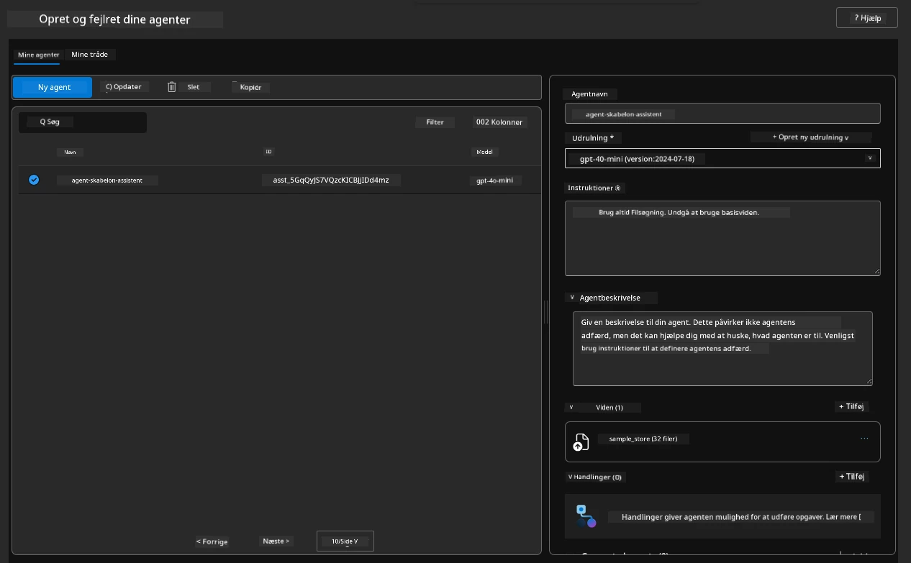

1. Kig efter `Data+indexes`-muligheden i venstre menu og klik for detaljer. 

      - Du bør se de 32 datafiler, der er uploadet til viden.
      - Disse vil svare til de 12 kundefiler og 20 produktfiler under `src/files` 
      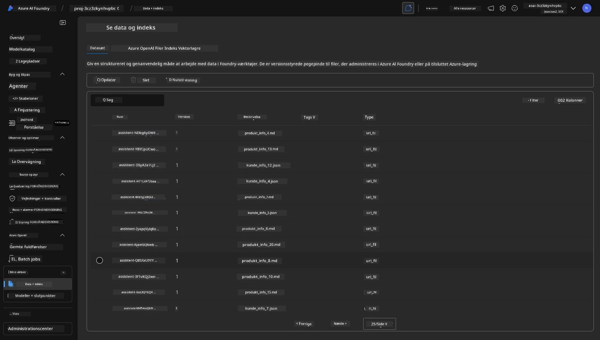

**Du har valideret agentens funktion!** 

1. Agentens svar er baseret på den viden, der findes i disse filer. 
1. Du kan nu stille spørgsmål relateret til disse data og få relevante svar.
1. Eksempel: `customer_info_10.json` beskriver de 3 køb, som "Amanda Perez" har foretaget.

Gå tilbage til browserfanen med Container App-endpointet og spørg: `Hvilke produkter ejer Amanda Perez?`. Du bør se noget som dette:

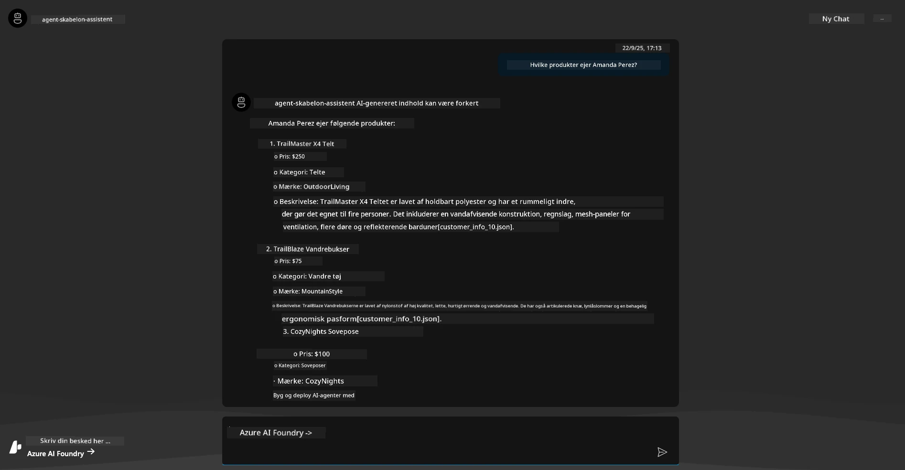

---

## 6. Agent Playground

Lad os opbygge lidt mere intuition for kapabiliteterne i Azure AI Foundry ved at tage agenten en tur i Agents Playground. 

1. Gå tilbage til `Agents`-siden i Azure AI Foundry - vælg standardagenten
1. Klik på `Try in Playground`-muligheden - du bør få en Playground-UI som denne
1. Stil det samme spørgsmål: `Hvilke produkter ejer Amanda Perez?`

    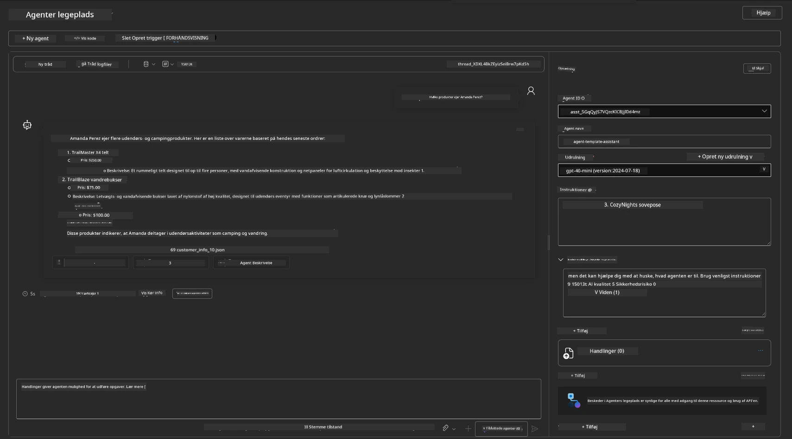

Du får det samme (eller lignende) svar - men du får også yderligere information, som du kan bruge til at forstå kvaliteten, omkostningerne og ydeevnen af din agentbaserede app. For eksempel:

1. Bemærk, at svaret citerer datafiler, der blev brugt til at "underbygge" svaret
1. Hold musen over en af disse filetiketter - matcher dataene din forespørgsel og det viste svar?

Du ser også en _stats_-række under svaret. 

1. Hold musen over en metrik - f.eks. Safety. Du ser noget som dette
1. Matcher den vurderede rating din intuition for svarenes sikkerhedsniveau?

      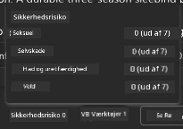

---x

## 7. Indbygget observabilitet

Observabilitet handler om at instrumentere din applikation til at generere data, der kan bruges til at forstå, fejlfinde og optimere dens operationer. For at få en fornemmelse af dette:

1. Klik på knappen `View Run Info` - du bør se denne visning. Dette er et eksempel på [Agent tracing](https://learn.microsoft.com/en-us/azure/ai-foundry/how-to/develop/trace-agents-sdk#view-trace-results-in-the-azure-ai-foundry-agents-playground) i aktion. _Du kan også få denne visning ved at klikke på Thread Logs i topmenuen_.

   - Få en fornemmelse af kørselsstadierne og værktøjerne, der blev brugt af agenten
   - Forstå det samlede antal tokens (vs. output tokens brugt) for svaret
   - Forstå latensen og hvor tiden bruges i udførelsen

      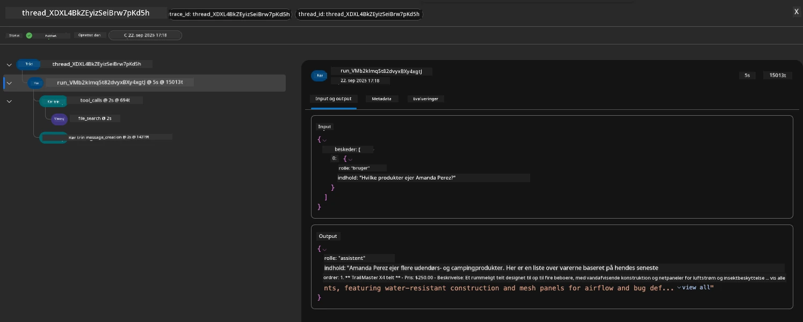

1. Klik på fanen `Metadata` for at se yderligere attributter for kørslen, der kan give nyttig kontekst til fejlfinding senere.   

      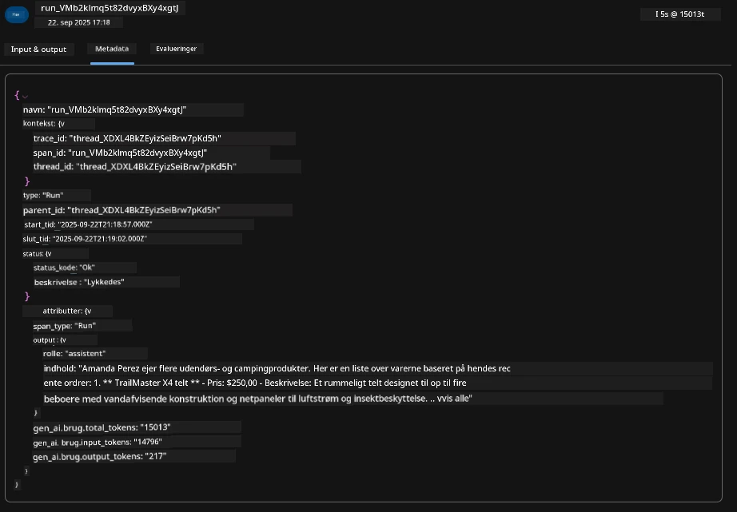

1. Klik på fanen `Evaluations` for at se auto-vurderinger af agentens svar. Disse inkluderer sikkerhedsvurderinger (f.eks. Selvskade) og agent-specifikke vurderinger (f.eks. Intent resolution, Task adherence).

      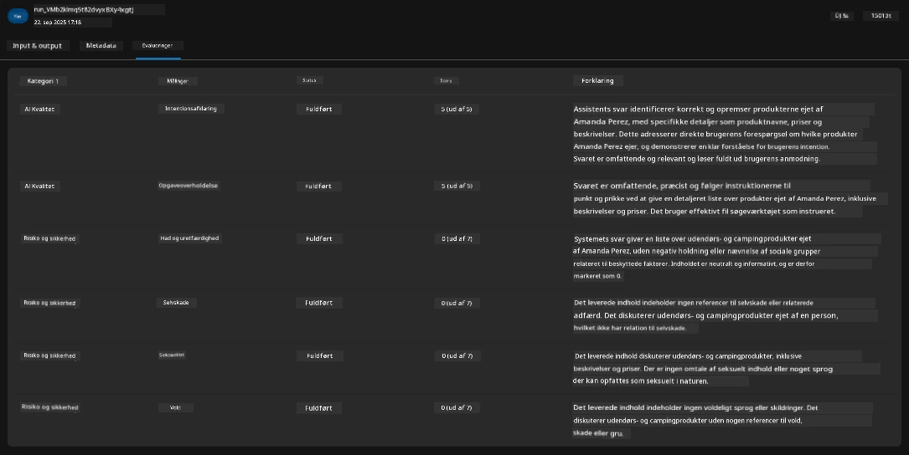

1. Sidst men ikke mindst, klik på fanen `Monitoring` i sidemenuen.

      - Vælg fanen `Resource usage` på den viste side - og se metrics.
      - Spor applikationsbrug i forhold til omkostninger (tokens) og belastning (forespørgsler).
      - Spor applikationens latens til første byte (inputbehandling) og sidste byte (output).

      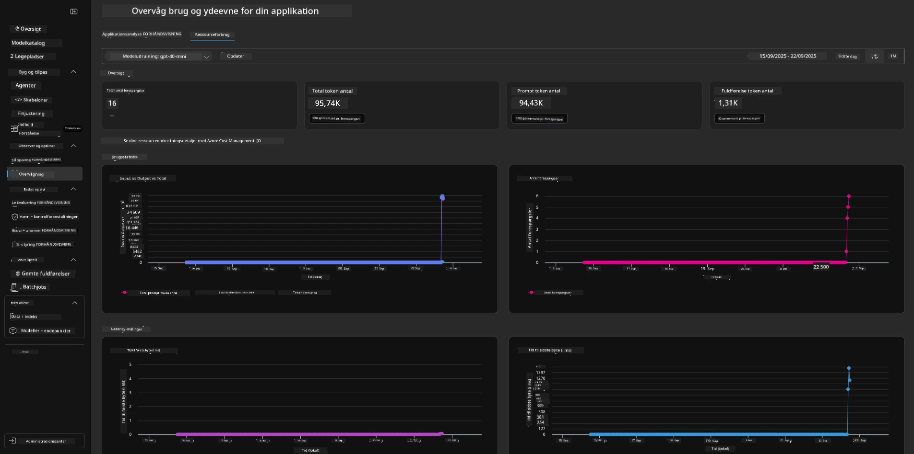

---

## 8. Miljøvariabler

Indtil videre har vi gennemgået implementeringen i browseren - og valideret, at vores infrastruktur er klargjort, og applikationen fungerer. Men for at arbejde med applikationen _kode-først_, skal vi konfigurere vores lokale udviklingsmiljø med de relevante variabler, der kræves for at arbejde med disse ressourcer. Brug af `azd` gør det nemt.

1. Azure Developer CLI [bruger miljøvariabler](https://learn.microsoft.com/en-us/azure/developer/azure-developer-cli/manage-environment-variables?tabs=bash) til at gemme og administrere konfigurationsindstillinger for applikationsimplementeringer.

1. Miljøvariabler gemmes i `.azure/<env-name>/.env` - dette afgrænser dem til det `env-name`-miljø, der blev brugt under implementeringen, og hjælper dig med at isolere miljøer mellem forskellige implementeringsmål i samme repo.

1. Miljøvariabler indlæses automatisk af `azd`-kommandoen, når den udfører en specifik kommando (f.eks. `azd up`). Bemærk, at `azd` ikke automatisk læser _OS-niveau_-miljøvariabler (f.eks. sat i shellen) - brug i stedet `azd set env` og `azd get env` til at overføre information inden for scripts.

Lad os prøve et par kommandoer:

1. Få alle miljøvariabler, der er sat for `azd` i dette miljø:

      ```bash title="" linenums="0"
      azd env get-values
      ```
      
      Du ser noget som:

      ```bash title="" linenums="0"
      AZURE_AI_AGENT_DEPLOYMENT_NAME="gpt-4o-mini"
      AZURE_AI_AGENT_NAME="agent-template-assistant"
      AZURE_AI_EMBED_DEPLOYMENT_NAME="text-embedding-3-small"
      AZURE_AI_EMBED_DIMENSIONS=100
      ...
      ```

1. Få en specifik værdi - f.eks. vil jeg vide, om vi har sat værdien `AZURE_AI_AGENT_MODEL_NAME`

      ```bash title="" linenums="0"
      azd env get-value AZURE_AI_AGENT_MODEL_NAME 
      ```
      
      Du ser noget som dette - det blev ikke sat som standard!

      ```bash title="" linenums="0"
      ERROR: key 'AZURE_AI_AGENT_MODEL_NAME' not found in the environment values
      ```

1. Sæt en ny miljøvariabel for `azd`. Her opdaterer vi agentens modelnavn. _Bemærk: eventuelle ændringer vil straks blive afspejlet i `.azure/<env-name>/.env`-filen.

      ```bash title="" linenums="0"
      azd env set AZURE_AI_AGENT_MODEL_NAME gpt-4.1
      azd env set AZURE_AI_AGENT_MODEL_VERSION 2025-04-14
      azd env set AZURE_AI_AGENT_DEPLOYMENT_CAPACITY 150
      ```

      Nu bør vi finde værdien sat:

      ```bash title="" linenums="0"
      azd env get-value AZURE_AI_AGENT_MODEL_NAME 
      ```

1. Bemærk, at nogle ressourcer er vedvarende (f.eks. modelimplementeringer) og vil kræve mere end blot en `azd up` for at tvinge genimplementeringen. Lad os prøve at nedbryde den oprindelige implementering og genimplementere med ændrede miljøvariabler.

1. **Opdater** Hvis du tidligere har implementeret infrastruktur ved hjælp af en azd-skabelon - kan du _opdatere_ tilstanden for dine lokale miljøvariabler baseret på den aktuelle tilstand af din Azure-implementering ved hjælp af denne kommando:
      ```bash title="" linenums="0"
      azd env refresh
      ```

      Dette er en effektiv måde at _synkronisere_ miljøvariabler på tværs af to eller flere lokale udviklingsmiljøer (f.eks. et team med flere udviklere) - hvilket gør det muligt for den implementerede infrastruktur at fungere som den ultimative kilde til miljøvariablernes tilstand. Teammedlemmer kan blot _opdatere_ variablerne for at komme tilbage i synkronisering.

---

## 9. Tillykke 🏆

Du har netop gennemført en komplet arbejdsgang, hvor du:

- [X] Valgte den AZD-skabelon, du ønskede at bruge
- [X] Startede skabelonen med GitHub Codespaces
- [X] Implementerede skabelonen og validerede, at den fungerer

---

