# 2. Valider en skabelon

!!! tip "VED SLUTNINGEN AF DETTE MODUL VIL DU VÆRE I STAND TIL AT"

    - [ ] Analysere AI-løsningens arkitektur
    - [ ] Forstå AZD-udrulningsarbejdsgangen
    - [ ] Bruge GitHub Copilot til hjælp med AZD-brug
    - [ ] **Lab 2:** Udrul & valider AI Agents-skabelonen

---


## 1. Introduktion

The [Azure Developer CLI](https://learn.microsoft.com/en-us/azure/developer/azure-developer-cli/) or `azd` er et open source-kommandolinjeværktøj, der strømliner udviklerarbejdsgangen, når du bygger og udruller applikationer til Azure. 

[AZD Templates](https://learn.microsoft.com/azure/developer/azure-developer-cli/azd-templates) er standardiserede repositories, der inkluderer eksempelapplikationskode, _infrastruktur-som-kode_ aktiver og `azd`-konfigurationsfiler for en sammenhængende løsningsarkitektur. Provisionering af infrastrukturen bliver så simpelt som en `azd provision`-kommando - mens brug af `azd up` lader dig provisionere infrastruktur **og** udrulle din applikation i ét hug!

Som følge heraf kan det at kickstarte din applikationsudviklingsproces være så enkelt som at finde den rigtige _AZD Starter template_, der ligger tættest på dine applikations- og infrastrukturbes behov - og derefter tilpasse repositoryet til dine scenariekrav.

Før vi begynder, lad os sikre os, at du har Azure Developer CLI installeret.

1. Åbn en VS Code-terminal og skriv denne kommando:

      ```bash title="" linenums="0"
      azd version
      ```

1. Du bør se noget lignende dette!

      ```bash title="" linenums="0"
      azd version 1.19.0 (commit b3d68cea969b2bfbaa7b7fa289424428edb93e97)
      ```

**Du er nu klar til at vælge og udrulle en skabelon med azd**

---

## 2. Valg af skabelon

Microsoft Foundry-platformen leveres med et [sæt anbefalede AZD-skabeloner](https://learn.microsoft.com/en-us/azure/ai-foundry/how-to/develop/ai-template-get-started), der dækker populære løsningsscenarier som _multi-agent workflow automation_ og _multi-modal content processing_. Du kan også finde disse skabeloner ved at besøge Microsoft Foundry-portalen.

1. Besøg [https://ai.azure.com/templates](https://ai.azure.com/templates)
1. Log ind på Microsoft Foundry-portalen, når du bliver bedt om det - du vil se noget lignende dette.

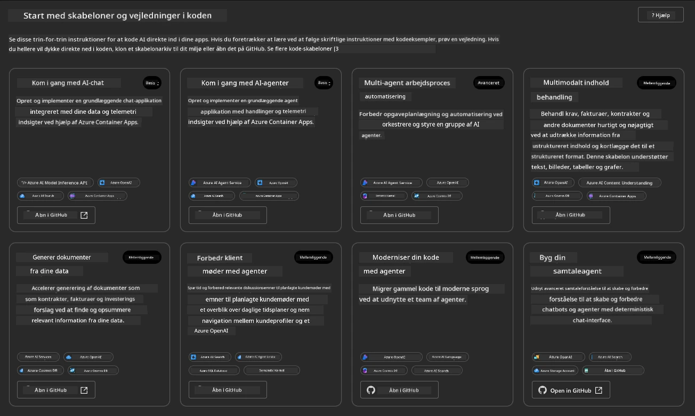


De **Basic**-indstillinger er dine startskabeloner:

1. [ ] [Get Started with AI Chat](https://github.com/Azure-Samples/get-started-with-ai-chat) som implementerer en grundlæggende chatapplikation _med dine data_ til Azure Container Apps. Brug denne til at udforske et grundlæggende AI-chatbotscenarie.
1. [X] [Get Started with AI Agents](https://github.com/Azure-Samples/get-started-with-ai-agents) som også udruller en standard AI Agent (med Foundry Agents). Brug denne til at blive fortrolig med agentiske AI-løsninger, der involverer værktøjer og modeller.

Åbn det andet link i en ny browserfane (eller klik `Open in GitHub` for det tilknyttede kort). Du bør se repository'et for denne AZD-skabelon. Tag et minut til at gennemse README'en. Applikationsarkitekturen ser sådan ud:

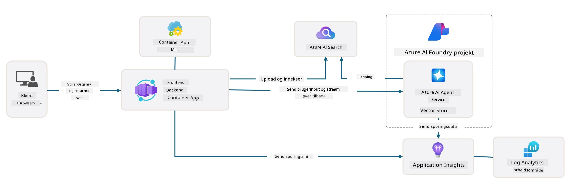

---

## 3. Aktivering af skabelon

Lad os prøve at udrulle denne skabelon og sikre os, at den er gyldig. Vi følger retningslinjerne i [Getting Started](https://github.com/Azure-Samples/get-started-with-ai-agents?tab=readme-ov-file#getting-started)-sektionen.

1. Klik på [dette link](https://github.com/codespaces/new/Azure-Samples/get-started-with-ai-agents) - bekræft standardhandlingen `Create codespace`
1. Dette åbner en ny browserfane - vent på, at GitHub Codespaces-sessionen er færdig med at indlæse
1. Åbn VS Code-terminalen i Codespaces - skriv følgende kommando:

   ```bash title="" linenums="0"
   azd up
   ```

Fuldfør de arbejdsflowtrin, som dette vil udløse:

1. Du vil blive bedt om at logge på Azure - følg instruktionerne for at autentificere
1. Indtast et unikt miljønavn for dig - f.eks. jeg brugte `nitya-mshack-azd`
1. Dette vil oprette en `.azure/`-mappe - du vil se en undermappe med miljønavnet
1. Du vil blive bedt om at vælge et abonnement - vælg standard
1. Du vil blive bedt om at vælge en lokation - brug `East US 2`

Nu venter du på, at provisioning færdiggøres. **Dette tager 10-15 minutter**

1. Når det er færdigt, vil din konsol vise en SUCCESS-meddelelse som denne:
      ```bash title="" linenums="0"
      SUCCESS: Your up workflow to provision and deploy to Azure completed in 10 minutes 17 seconds.
      ```
1. Your Azure Portal will now have a provisioned resource group with that env name:

      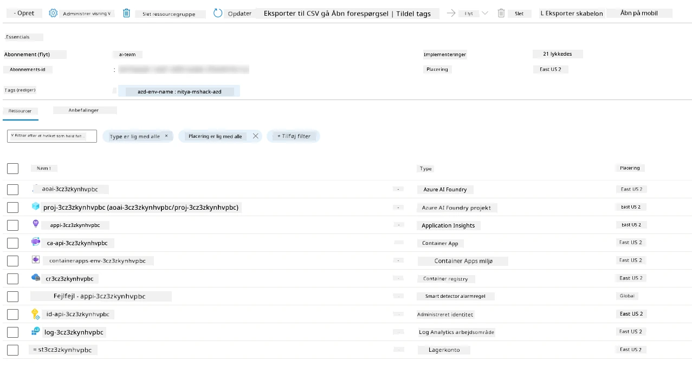

1. **Du er nu klar til at validere den udrullede infrastruktur og applikation**.

---

## 4. Validering af skabelon

1. Besøg Azure Portalens [Resource Groups](https://portal.azure.com/#browse/resourcegroups)-side - log ind, når du bliver bedt om det
1. Klik på RG for dit miljønavn - du ser siden ovenfor

      - klik på Azure Container Apps-ressourcen
      - klik på Application Url i _Essentials_-sektionen (øverst til højre)

1. Du bør se et hostet applikationsfrontend-UI som dette:

   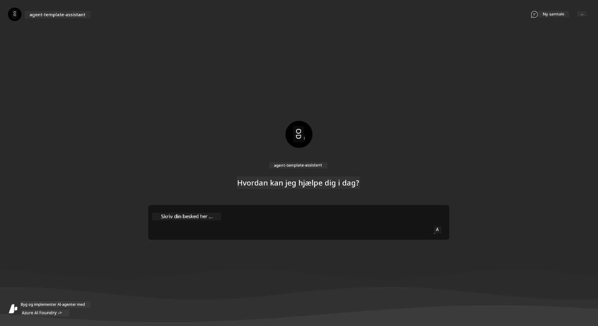

1. Prøv at stille et par [sample questions](https://github.com/Azure-Samples/get-started-with-ai-agents/blob/main/docs/sample_questions.md)

      1. Spørg: ```Hvad er Frankrigs hovedstad?``` 
      1. Spørg: ```Hvad er det bedste telt til under $200 til to personer, og hvilke funktioner har det?```

1. Du bør få svar, der ligner det viste nedenfor. _Men hvordan fungerer det?_ 

      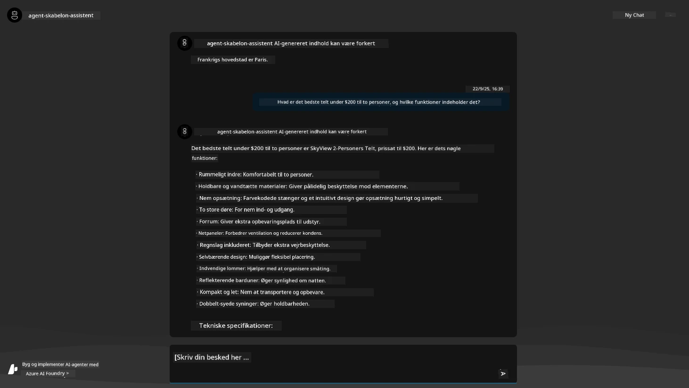

---

## 5.  Agent-validering

Azure Container App udruller et endpoint, der forbinder til AI Agent'en provisioneret i Microsoft Foundry-projektet for denne skabelon. Lad os se nærmere på, hvad det betyder.

1. Gå tilbage til Azure Portalens _Overview_ side for din resourcegruppe

1. Klik på `Microsoft Foundry`-ressourcen i den liste

1. Du bør se dette. Klik på knappen `Go to Microsoft Foundry Portal`. 
   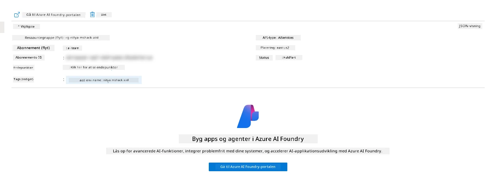

1. Du bør se Foundry-projektets side for din AI-applikation
   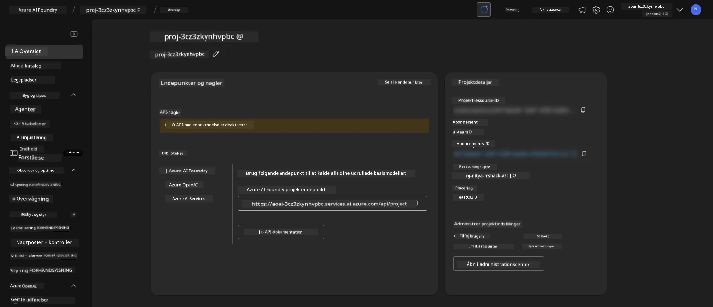

1. Klik på `Agents` - du ser den standardagent, der er provisioneret i dit projekt
   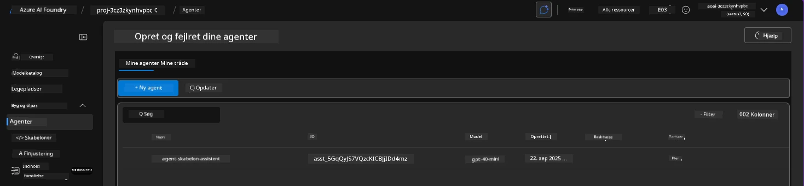

1. Vælg den - og du ser Agent-detaljerne. Bemærk følgende:

      - Agenten bruger File Search som standard (altid)
      - Agentens `Knowledge` angiver, at den har 32 filer uploadet (til fil-søgning)
      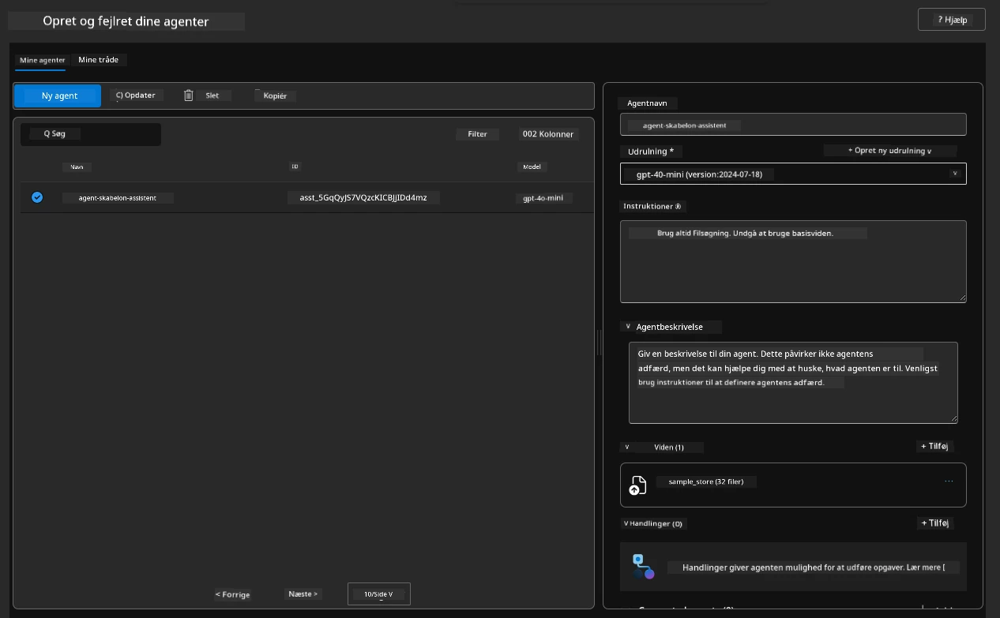

1. Find `Data+indexes`-muligheden i venstre menu og klik for detaljer. 

      - Du bør se de 32 datafiler, der er uploadet til knowledge.
      - Disse svarer til de 12 kundefiler og 20 produktfiler under `src/files` 
      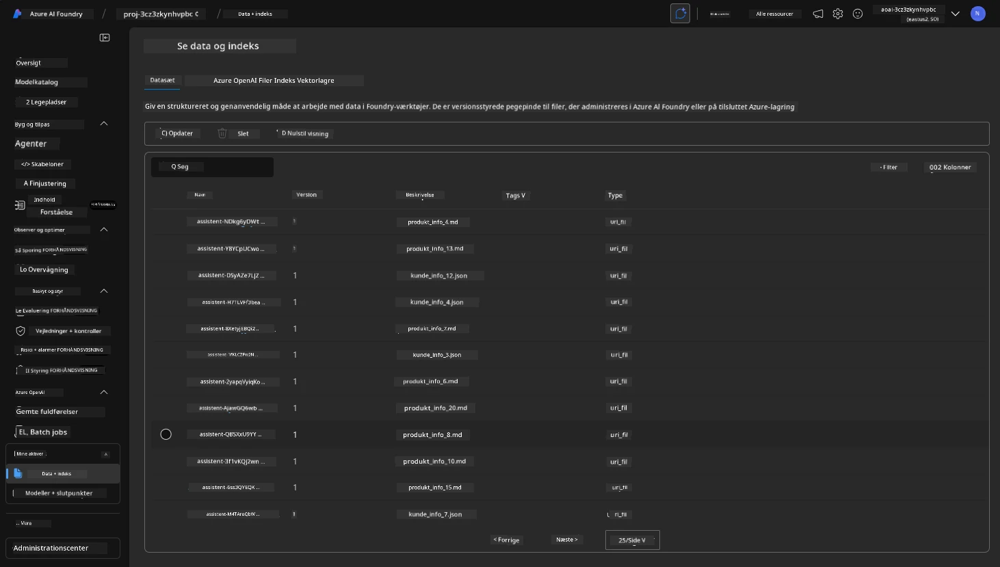

**Du har valideret Agentens funktion!** 

1. Agentens svar er forankret i viden fra disse filer. 
1. Du kan nu stille spørgsmål relateret til disse data og få forankrede svar.
1. Eksempel: `customer_info_10.json` beskriver de 3 køb foretaget af "Amanda Perez"

Gå tilbage til browsertabben med Container App-endpointet og spørg: `Hvilke produkter ejer Amanda Perez?`. Du bør se noget i retning af dette:

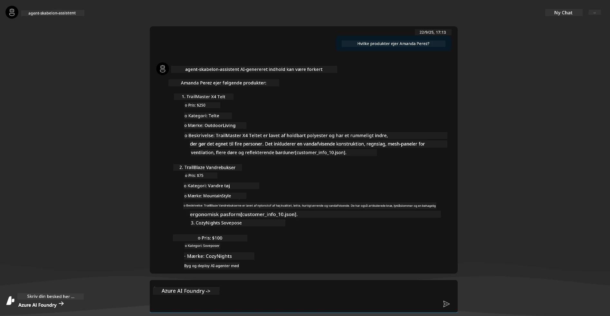

---

## 6. Agent-playground

Lad os opbygge lidt mere intuition for Microsoft Foundrys kapabiliteter ved at give Agenten en tur i Agents Playground. 

1. Gå tilbage til `Agents`-siden i Microsoft Foundry - vælg standardagenten
1. Klik på `Try in Playground`-muligheden - du bør få et Playground-UI som dette
1. Stil det samme spørgsmål: `Hvilke produkter ejer Amanda Perez?`

    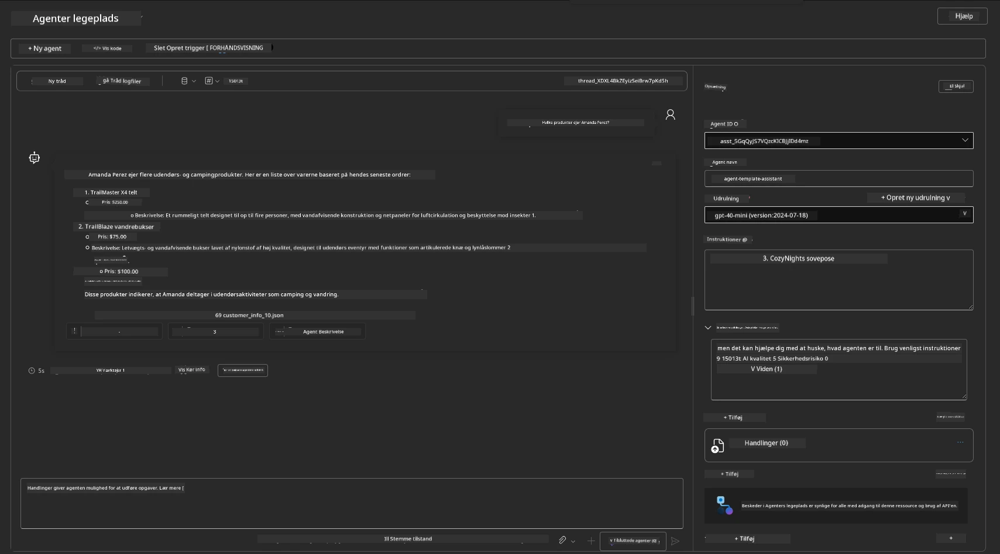

Du får det samme (eller lignende) svar - men du får også yderligere information, som du kan bruge til at forstå kvaliteten, omkostningerne og ydelsen af din agentiske app. For eksempel:

1. Bemærk, at svaret henviser til datafiler, der blev brugt til at "forankre" svaret
1. Hold musen over nogen af disse filmærkater - matcher dataene din forespørgsel og det viste svar?

Du ser også en _stats_-række under svaret. 

1. Hold musen over en hvilken som helst måling - f.eks. Safety. Du ser noget i stil med dette
1. Matcher den vurderede bedømmelse din intuition for svarenes sikkerhedsniveau?

      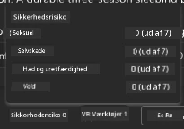

---

## 7. Indbygget observabilitet

Observabilitet handler om at instrumentere din applikation til at generere data, som kan bruges til at forstå, debugge og optimere dens drift. For at få en fornemmelse af dette:

1. Klik på knappen `View Run Info` - du bør se denne visning. Dette er et eksempel på [Agent tracing](https://learn.microsoft.com/en-us/azure/ai-foundry/how-to/develop/trace-agents-sdk#view-trace-results-in-the-azure-ai-foundry-agents-playground) i aktion. _Du kan også få denne visning ved at klikke på Thread Logs i topmenuen_.

   - Få en fornemmelse af kørselstrinnene og værktøjerne, som agenten engagerer
   - Forstå samlet antal tokens (vs. output-tokenforbrug) for svaret
   - Forstå latensen og hvor tiden bruges i udførelsen

      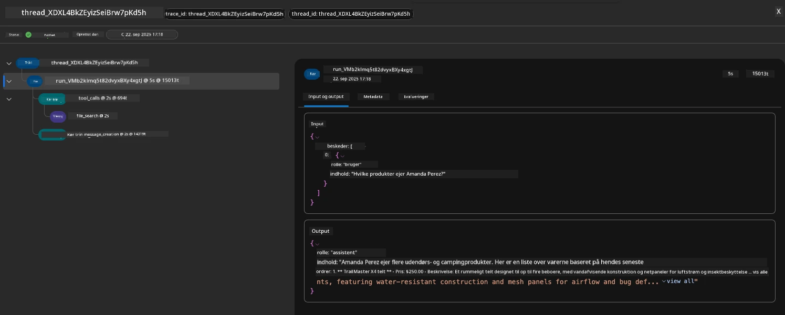

1. Klik på fanen `Metadata` for at se yderligere attributter for kørslen, som kan give nyttig kontekst til fejlfinding senere.   

      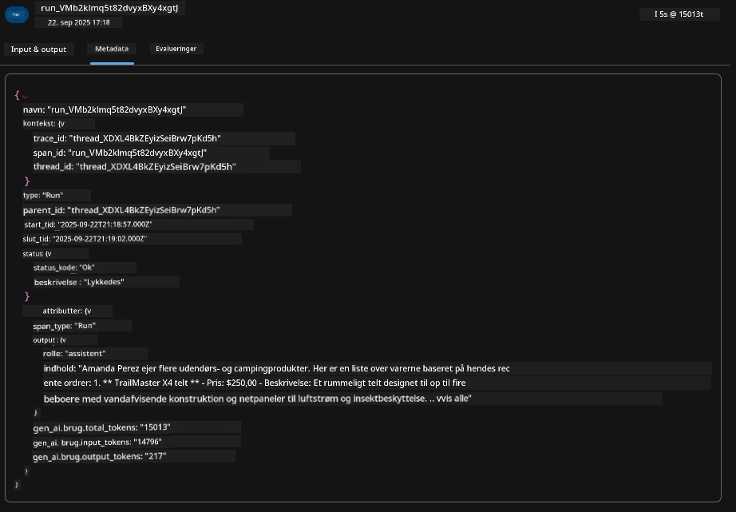


1. Klik på fanen `Evaluations` for at se automatiske vurderinger foretaget af agentens svar. Disse inkluderer sikkerhedsvurderinger (f.eks. Self-harm) og agent-specifikke vurderinger (f.eks. Intent resolution, Task adherence).

      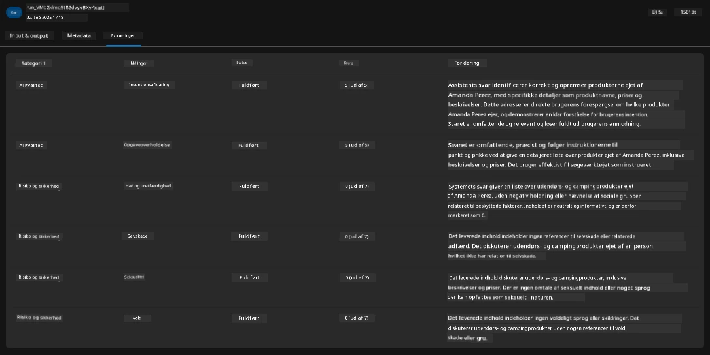

1. Sidst men ikke mindst, klik på fanen `Monitoring` i sidebjælkemenuen.

      - Vælg fanen `Resource usage` på den viste side - og se metrikkerne.
      - Spor applikationsbrug i form af omkostninger (tokens) og belastning (requests).
      - Spor applikationslatens til første byte (inputbehandling) og sidste byte (output).

      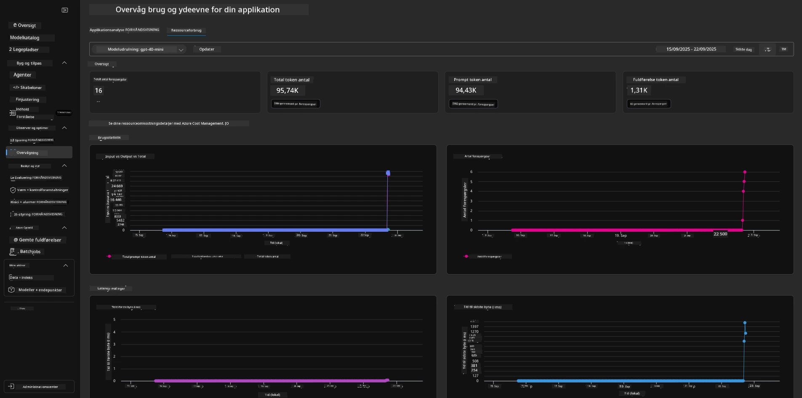

---

## 8. Miljøvariabler

Indtil nu har vi gennemgået udrulningen i browseren - og valideret, at vores infrastruktur er provisioneret, og applikationen er operationel. Men for at arbejde med applikationen _code-first_ skal vi konfigurere vores lokale udviklingsmiljø med de relevante variabler, der kræves for at arbejde med disse ressourcer. Brug af `azd` gør det nemt.

1. Azure Developer CLI [bruger miljøvariabler](https://learn.microsoft.com/en-us/azure/developer/azure-developer-cli/manage-environment-variables?tabs=bash) til at gemme og administrere konfigurationsindstillinger for applikationsudrulninger.

1. Miljøvariabler gemmes i `.azure/<env-name>/.env` - dette afgrænser dem til det `env-name`-miljø, der blev brugt under udrulning, og hjælper dig med at isolere miljøer mellem forskellige udrulningsmål i samme repo.

1. Miljøvariabler indlæses automatisk af `azd`-kommandoen, når den udfører en specifik kommando (f.eks. `azd up`). Bemærk, at `azd` ikke automatisk læser _OS-niveau_ miljøvariabler (f.eks. sat i shell'en) - brug i stedet `azd set env` og `azd get env` til at overføre oplysninger inden for scripts.


Lad os prøve et par kommandoer:

1. Hent alle miljøvariabler, der er sat for `azd` i dette miljø:

      ```bash title="" linenums="0"
      azd env get-values
      ```
      
      Du ser noget lignende:

      ```bash title="" linenums="0"
      AZURE_AI_AGENT_DEPLOYMENT_NAME="gpt-4o-mini"
      AZURE_AI_AGENT_NAME="agent-template-assistant"
      AZURE_AI_EMBED_DEPLOYMENT_NAME="text-embedding-3-small"
      AZURE_AI_EMBED_DIMENSIONS=100
      ...
      ```

1. Hent en specifik værdi - f.eks. jeg vil vide, om vi satte værdien `AZURE_AI_AGENT_MODEL_NAME`

      ```bash title="" linenums="0"
      azd env get-value AZURE_AI_AGENT_MODEL_NAME 
      ```
      
      Du ser noget i denne retning - den blev ikke sat som standard!

      ```bash title="" linenums="0"
      ERROR: key 'AZURE_AI_AGENT_MODEL_NAME' not found in the environment values
      ```

1. Sæt en ny miljøvariabel for `azd`. Her opdaterer vi agent-modelnavnet. _Bemærk: eventuelle ændringer vil blive umiddelbart afspejlet i `.azure/<env-name>/.env`-filen.

      ```bash title="" linenums="0"
      azd env set AZURE_AI_AGENT_MODEL_NAME gpt-4.1
      azd env set AZURE_AI_AGENT_MODEL_VERSION 2025-04-14
      azd env set AZURE_AI_AGENT_DEPLOYMENT_CAPACITY 150
      ```

      Nu bør vi finde, at værdien er sat:

      ```bash title="" linenums="0"
      azd env get-value AZURE_AI_AGENT_MODEL_NAME 
      ```

1. Bemærk, at nogle ressourcer er vedvarende (f.eks. modeludrulninger) og vil kræve mere end blot en `azd up` for at tvinge genudrulning. Lad os prøve at tage den oprindelige udrulning ned og genudrulle med ændrede env-vars.

1. **Refresh** Hvis du tidligere har udrullet infrastruktur ved hjælp af en azd-skabelon - kan du _opfriske_ tilstanden af dine lokale miljøvariabler baseret på den aktuelle tilstand af din Azure-udrulning ved at bruge denne kommando:

      ```bash title="" linenums="0"
      azd env refresh
      ```

      Dette er en effektiv måde at _synkronisere_ miljøvariabler på tværs af to eller flere lokale udviklingsmiljøer (f.eks. et team med flere udviklere) - hvilket gør den udrullede infrastruktur til den autoritative kilde til miljøvariablernes tilstand. Teammedlemmer skal blot _opdatere_ variablerne for at blive synkroniseret igen.

---

## 9. Tillykke 🏆

Du har netop gennemført en end-to-end arbejdsgang, hvor du:

- [X] Valgte den AZD-skabelon, du vil bruge
- [X] Startede skabelonen med GitHub Codespaces 
- [X] Udrullede skabelonen og bekræftede, at den virker

---

<!-- CO-OP TRANSLATOR DISCLAIMER START -->
Ansvarsfraskrivelse:
Dette dokument er blevet oversat ved hjælp af AI-oversættelsestjenesten Co-op Translator (https://github.com/Azure/co-op-translator). Selvom vi bestræber os på nøjagtighed, bedes du være opmærksom på, at automatiske oversættelser kan indeholde fejl eller unøjagtigheder. Det oprindelige dokument på dets oprindelige sprog bør betragtes som den autoritative kilde. For kritiske oplysninger anbefales professionel menneskelig oversættelse. Vi er ikke ansvarlige for eventuelle misforståelser eller fejltolkninger som følge af brugen af denne oversættelse.
<!-- CO-OP TRANSLATOR DISCLAIMER END -->