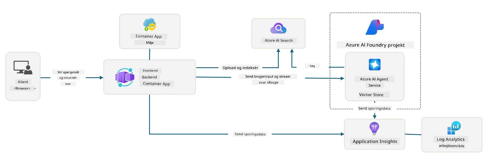

<!--
CO_OP_TRANSLATOR_METADATA:
{
  "original_hash": "4e403f041411361140d6beb88ab2a181",
  "translation_date": "2025-09-24T21:33:11+00:00",
  "source_file": "workshop/docs/instructions/3-Deconstruct-AI-Template.md",
  "language_code": "da"
}
-->
# 3. Dekonstruer en skabelon

!!! tip "VED SLUTNINGEN AF DETTE MODUL VIL DU KUNNE"

    - [ ] Punkt
    - [ ] Punkt
    - [ ] Punkt
    - [ ] **Lab 3:** 

---

Med AZD-skabeloner og Azure Developer CLI (`azd`) kan vi hurtigt kickstarte vores AI-udviklingsrejse med standardiserede repositories, der indeholder eksempelkode, infrastruktur og konfigurationsfiler - i form af et klar-til-udrulning _starterprojekt_.

**Men nu skal vi forstå projektstrukturen og kodebasen - og kunne tilpasse AZD-skabelonen - uden nogen forudgående erfaring eller forståelse af AZD!**

---

## 1. Aktivér GitHub Copilot

### 1.1 Installer GitHub Copilot Chat

Det er tid til at udforske [GitHub Copilot med Agent Mode](https://code.visualstudio.com/docs/copilot/chat/chat-agent-mode). Nu kan vi bruge naturligt sprog til at beskrive vores opgave på et højt niveau og få hjælp til udførelsen. Til dette lab vil vi bruge [Copilot Free-planen](https://github.com/github-copilot/signup), som har en månedlig grænse for fuldførelser og chatinteraktioner.

Udvidelsen kan installeres fra marketplace, men bør allerede være tilgængelig i dit Codespaces-miljø. _Klik på `Open Chat` fra Copilot-ikonets dropdown-menu - og skriv en prompt som `What can you do?`_ - du kan blive bedt om at logge ind. **GitHub Copilot Chat er klar**.

### 1.2. Installer MCP-servere

For at Agent Mode kan være effektiv, skal den have adgang til de rigtige værktøjer til at hjælpe med at hente viden eller udføre handlinger. Her kan MCP-servere hjælpe. Vi konfigurerer følgende servere:

1. [Azure MCP Server](../../../../../workshop/docs/instructions)
1. [Microsoft Docs MCP Server](../../../../../workshop/docs/instructions)

For at aktivere disse:

1. Opret en fil kaldet `.vscode/mcp.json`, hvis den ikke allerede findes
1. Kopiér følgende ind i filen - og start serverne!
   ```json title=".vscode/mcp.json"
   {
      "servers": {
         "Azure MCP Server": {
            "command": "npx",
            "args": [
            "-y",
            "@azure/mcp@latest",
            "server",
            "start"
            ]
         },
         "microsoft.docs.mcp": {
            "type": "http",
            "url": "https://learn.microsoft.com/api/mcp"
         }
      }
   }
   ```

??? warning "Du kan få en fejl om, at `npx` ikke er installeret (klik for at udvide med løsning)"

      For at løse dette skal du åbne filen `.devcontainer/devcontainer.json` og tilføje denne linje til features-sektionen. Genopbyg derefter containeren. Nu skulle `npx` være installeret.

      ```title="" linenums="0"
         "features": {
            "ghcr.io/devcontainers/features/node:1": {},
            ...
         },
      ```

---

### 1.3. Test GitHub Copilot Chat

**Brug først `az login` til at autentificere med Azure fra VS Code-kommandolinjen.**

Du skulle nu kunne forespørge status for dit Azure-abonnement og stille spørgsmål om udrullede ressourcer eller konfiguration. Prøv disse prompts:

1. `List my Azure resource groups`
1. `#foundry list my current deployments`

Du kan også stille spørgsmål om Azure-dokumentation og få svar baseret på Microsoft Docs MCP-serveren. Prøv disse prompts:

1. `#microsoft_docs_search What is Azure Developer CLI?`
1. `#microsoft_docs_search Show me a Python tutorial to chat with deployed model`

Eller du kan bede om kodeeksempler til at udføre en opgave. Prøv denne prompt:

1. `Give me a Python code example that uses AAD for an interactive chat client`

I `Ask`-mode vil dette give kode, som du kan kopiere og prøve. I `Agent`-mode kan det gå et skridt videre og oprette de relevante ressourcer for dig - inklusive opsætningsscripts og dokumentation - for at hjælpe dig med at udføre opgaven.

**Du er nu klar til at begynde at udforske skabelon-repositoriet**

---

## 2. Dekonstruer arkitektur

??? prompt "SPØRG: Forklar applikationsarkitekturen i docs/images/architecture.png i 1 afsnit"

      Denne applikation er en AI-drevet chatapplikation bygget på Azure, der demonstrerer en moderne agentbaseret arkitektur. Løsningen er centreret omkring en Azure Container App, der hoster hovedapplikationskoden, som behandler brugerinput og genererer intelligente svar via en AI-agent. 
      
      Arkitekturen udnytter Azure AI Foundry Project som fundament for AI-funktioner og forbinder til Azure AI Services, der leverer de underliggende sprogmodeller (såsom GPT-4o-mini) og agentfunktionalitet. Brugerinteraktioner flyder gennem en React-baseret frontend til en FastAPI-backend, der kommunikerer med AI-agenttjenesten for at generere kontekstuelle svar. 
      
      Systemet inkluderer videnshentningsfunktioner via enten filsøgning eller Azure AI Search-tjenesten, hvilket gør det muligt for agenten at få adgang til og citere information fra uploadede dokumenter. For operationel ekspertise inkluderer arkitekturen omfattende overvågning via Application Insights og Log Analytics Workspace til sporing, logning og optimering af ydeevne. 
      
      Azure Storage leverer blob-lagring til applikationsdata og filuploads, mens Managed Identity sikrer sikker adgang mellem Azure-ressourcer uden at gemme legitimationsoplysninger. Hele løsningen er designet til skalerbarhed og vedligeholdelse, med den containeriserede applikation, der automatisk skalerer baseret på efterspørgsel, samtidig med at den tilbyder indbygget sikkerhed, overvågning og CI/CD-funktioner gennem Azures administrerede tjenester.



---

## 3. Repositoriets struktur

!!! prompt "SPØRG: Forklar skabelonens mappestruktur. Start med et visuelt hierarkisk diagram."

??? info "SVAR: Visuelt hierarkisk diagram"

      ```bash title="" 
      get-started-with-ai-agents/
      ├── 📋 Konfiguration & Opsætning
      │   ├── azure.yaml                    # Azure Developer CLI-konfiguration
      │   ├── docker-compose.yaml           # Lokale udviklingscontainere
      │   ├── pyproject.toml                # Python-projektkonfiguration
      │   ├── requirements-dev.txt          # Udviklingsafhængigheder
      │   └── .devcontainer/                # VS Code dev container-opsætning
      │
      ├── 🏗️ Infrastruktur (infra/)
      │   ├── main.bicep                    # Hovedinfrastruktur-skabelon
      │   ├── api.bicep                     # API-specifikke ressourcer
      │   ├── main.parameters.json          # Infrastrukturparametre
      │   └── core/                         # Modulare infrastrukturkomponenter
      │       ├── ai/                       # AI-tjenestekonfigurationer
      │       ├── host/                     # Hosting-infrastruktur
      │       ├── monitor/                  # Overvågning og logning
      │       ├── search/                   # Azure AI Search-opsætning
      │       ├── security/                 # Sikkerhed og identitet
      │       └── storage/                  # Lagringskonto-konfigurationer
      │
      ├── 💻 Applikationskilde (src/)
      │   ├── api/                          # Backend-API
      │   │   ├── main.py                   # FastAPI-applikationsindgang
      │   │   ├── routes.py                 # API-rutedefinitioner
      │   │   ├── search_index_manager.py   # Søgefunktionalitet
      │   │   ├── data/                     # API-datahåndtering
      │   │   ├── static/                   # Statiske webressourcer
      │   │   └── templates/                # HTML-skabeloner
      │   ├── frontend/                     # React/TypeScript-frontend
      │   │   ├── package.json              # Node.js-afhængigheder
      │   │   ├── vite.config.ts            # Vite-byggekonfiguration
      │   │   └── src/                      # Frontend-kildekode
      │   ├── data/                         # Eksempelfiler med data
      │   │   └── embeddings.csv            # Forudberegnede embeddings
      │   ├── files/                        # Vidensbasefiler
      │   │   ├── customer_info_*.json      # Eksempler på kundedata
      │   │   └── product_info_*.md         # Produktdokumentation
      │   ├── Dockerfile                    # Containerkonfiguration
      │   └── requirements.txt              # Python-afhængigheder
      │
      ├── 🔧 Automatisering & Scripts (scripts/)
      │   ├── postdeploy.sh/.ps1           # Opsætning efter udrulning
      │   ├── setup_credential.sh/.ps1     # Konfiguration af legitimationsoplysninger
      │   ├── validate_env_vars.sh/.ps1    # Validering af miljøvariabler
      │   └── resolve_model_quota.sh/.ps1  # Håndtering af modelkvoter
      │
      ├── 🧪 Test & Evaluering
      │   ├── tests/                        # Enheds- og integrationstests
      │   │   └── test_search_index_manager.py
      │   ├── evals/                        # Evaluering af agentrammeværk
      │   │   ├── evaluate.py               # Evaluering af kørsel
      │   │   ├── eval-queries.json         # Testforespørgsler
      │   │   └── eval-action-data-path.json
      │   ├── sandbox/                      # Udviklingslegeplads
      │   │   ├── 1-quickstart.py           # Kom godt i gang-eksempler
      │   │   └── aad-interactive-chat.py   # Autentificeringseksempler
      │   └── airedteaming/                 # Evaluering af AI-sikkerhed
      │       └── ai_redteaming.py          # Red team-test
      │
      ├── 📚 Dokumentation (docs/)
      │   ├── deployment.md                 # Udrulningsvejledning
      │   ├── local_development.md          # Lokale opsætningsinstruktioner
      │   ├── troubleshooting.md            # Almindelige problemer & løsninger
      │   ├── azure_account_setup.md        # Azure-forudsætninger
      │   └── images/                       # Dokumentationsressourcer
      │
      └── 📄 Projektmetadata
         ├── README.md                     # Projektoversigt
         ├── CODE_OF_CONDUCT.md           # Retningslinjer for fællesskabet
         ├── CONTRIBUTING.md              # Bidragsvejledning
         ├── LICENSE                      # Licensbetingelser
         └── next-steps.md                # Vejledning efter udrulning
      ```

### 3.1. Kerneapp-arkitektur

Denne skabelon følger et **full-stack webapplikationsmønster** med:

- **Backend**: Python FastAPI med Azure AI-integration
- **Frontend**: TypeScript/React med Vite-byggesystem
- **Infrastruktur**: Azure Bicep-skabeloner til cloud-ressourcer
- **Containerisering**: Docker til konsistent udrulning

### 3.2 Infrastruktur som kode (bicep)

Infrastrukturlaget bruger **Azure Bicep**-skabeloner organiseret modulært:

   - **`main.bicep`**: Orkestrerer alle Azure-ressourcer
   - **`core/` moduler**: Genanvendelige komponenter til forskellige tjenester
      - AI-tjenester (Azure OpenAI, AI Search)
      - Container-hosting (Azure Container Apps)
      - Overvågning (Application Insights, Log Analytics)
      - Sikkerhed (Key Vault, Managed Identity)

### 3.3 Applikationskilde (`src/`)

**Backend API (`src/api/`)**:

- FastAPI-baseret REST API
- Integration med Azure AI Agent-tjeneste
- Håndtering af søgeindeks til videnshentning
- Filupload og behandlingsfunktioner

**Frontend (`src/frontend/`)**:

- Moderne React/TypeScript SPA
- Vite til hurtig udvikling og optimerede builds
- Chatgrænseflade til agentinteraktioner

**Vidensbase (`src/files/`)**:

- Eksempler på kunde- og produktdata
- Demonstrerer filbaseret videnshentning
- JSON- og Markdown-formateksempler

### 3.4 DevOps & Automatisering

**Scripts (`scripts/`)**:

- Platformuafhængige PowerShell- og Bash-scripts
- Validering og opsætning af miljø
- Konfiguration efter udrulning
- Håndtering af modelkvoter

**Azure Developer CLI-integration**:

- `azure.yaml`-konfiguration til `azd`-arbejdsgange
- Automatiseret provisionering og udrulning
- Håndtering af miljøvariabler

### 3.5 Test & Kvalitetssikring

**Evaluering af rammeværk (`evals/`)**:

- Evaluering af agentens ydeevne
- Test af forespørgsel-svar-kvalitet
- Automatiseret vurderingspipeline

**AI-sikkerhed (`airedteaming/`)**:

- Red team-test for AI-sikkerhed
- Sikkerhedssårbarhedsscanning
- Ansvarlige AI-praksisser

---

## 4. Tillykke 🏆

Du har med succes brugt GitHub Copilot Chat med MCP-servere til at udforske repositoriet.

- [X] Aktiveret GitHub Copilot for Azure
- [X] Forstået applikationsarkitekturen
- [X] Udforsket AZD-skabelonstrukturen

Dette giver dig en forståelse af _infrastruktur som kode_-aktiverne for denne skabelon. Næste trin er at kigge på konfigurationsfilen for AZD.

---

