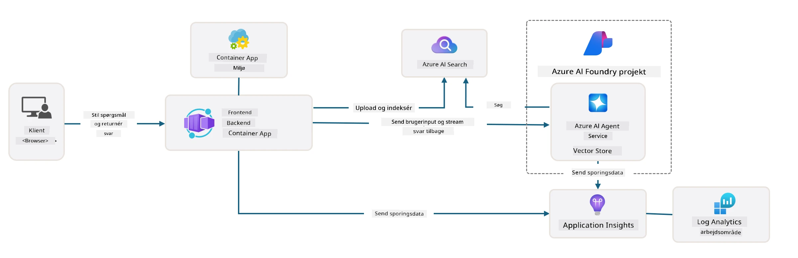

# 3. Nedbryd en skabelon

!!! tip "VED SLUTNINGEN AF DETTE MODUL VIL DU KUNNE"

    - [ ] Aktivere GitHub Copilot med MCP-servere til Azure-assistance
    - [ ] Forstå AZD-skabelonens mappeopsætning og komponenter
    - [ ] Udforske infrastruktur-som-kode (Bicep) organiseringsmønstre
    - [ ] **Lab 3:** Brug GitHub Copilot til at udforske og forstå repository-arkitektur 

---


Med AZD-skabeloner og Azure Developer CLI (`azd`) kan vi hurtigt kickstarte vores AI-udviklingsrejse med standardiserede repositories, der leverer eksempelcode, infrastruktur- og konfigurationsfiler - i form af et klar-til-distribution _starter_-projekt.

**Men nu skal vi forstå projektstrukturen og kodebasen - og være i stand til at tilpasse AZD-skabelonen - uden nogen forudgående erfaring eller forståelse af AZD!**

---

## 1. Aktivér GitHub Copilot

### 1.1 Installér GitHub Copilot Chat

Det er tid til at udforske [GitHub Copilot med Agent Mode](https://code.visualstudio.com/docs/copilot/chat/chat-agent-mode). Nu kan vi bruge naturligt sprog til at beskrive vores opgave på højere niveau og få hjælp til udførelsen. Til dette lab bruger vi [Copilot Free plan](https://github.com/github-copilot/signup), som har en månedlig grænse for completioner og chatinteraktioner.

Udvidelsen kan installeres fra marketplace, og den er ofte allerede tilgængelig i Codespaces eller dev container-miljøer. _Klik `Open Chat` fra Copilot-ikonets drop-down - og skriv et prompt som `What can you do?`_ - du kan blive bedt om at logge ind. **GitHub Copilot Chat er klar**.

### 1.2. Installér MCP-servere

For at Agent mode er effektiv, skal den have adgang til de rigtige værktøjer for at hjælpe med at hente viden eller udføre handlinger. Her kan MCP-servere hjælpe. Vi konfigurerer følgende servere:

1. [Azure MCP Server](../../../../../workshop/docs/instructions)
1. [Microsoft Docs MCP Server](../../../../../workshop/docs/instructions)

For at aktivere disse:

1. Opret en fil kaldet `.vscode/mcp.json` hvis den ikke eksisterer
1. Kopiér følgende ind i den fil - og start serverne!
   ```json title=".vscode/mcp.json"
   {
      "servers": {
         "Azure MCP Server": {
            "command": "npx",
            "args": [
            "-y",
            "@azure/mcp@latest",
            "server",
            "start"
            ]
         },
         "microsoft.docs.mcp": {
            "type": "http",
            "url": "https://learn.microsoft.com/api/mcp"
         }
      }
   }
   ```

??? warning "Du kan få en fejl om, at `npx` ikke er installeret (klik for at udvide for løsning)"

      For at rette dette, åbn `.devcontainer/devcontainer.json` filen og tilføj denne linje til features-sektionen. Byg derefter containeren igen. Du bør nu have `npx` installeret.

      ```title="" linenums="0"
         "features": {
            "ghcr.io/devcontainers/features/node:1": {},
            ...
         },
      ```

---

### 1.3. Test GitHub Copilot Chat

**Brug først `azd auth login` for at godkende over for Azure fra VS Code-kommando-linjen. Brug også `az login` kun hvis du planlægger at køre Azure CLI-kommandoer direkte.**

Du bør nu kunne forespørge din Azure-abonnementsstatus og stille spørgsmål om udrullede ressourcer eller konfiguration. Prøv disse prompts:

1. `List my Azure resource groups`
1. `#foundry list my current deployments`

Du kan også stille spørgsmål om Azure-dokumentation og få svar funderet i Microsoft Docs MCP-serveren. Prøv disse prompts:

1. `#microsoft_docs_search What is Azure Developer CLI?`
1. `#microsoft_docs_search Show me a Python tutorial to chat with deployed model`

Eller du kan bede om kodeudsnit til at fuldføre en opgave. Prøv dette prompt.

1. `Give me a Python code example that uses AAD for an interactive chat client`

I `Ask`-tilstand vil dette give kode, som du kan copy-paste og prøve. I `Agent`-tilstand kan dette gå et skridt videre og oprette relevante ressourcer for dig - inklusive opsætningsscripts og dokumentation - for at hjælpe dig med at udføre den opgave.

**Du er nu rustet til at begynde at udforske template-repositoriet**

---

## 2. Nedbryd arkitekturen

??? prompt "SPØRGSMÅL: Forklar applikationsarkitekturen i docs/images/architecture.png på 1 afsnit"

      Denne applikation er en AI-drevet chatapplikation bygget på Azure, der demonstrerer en moderne agent-baseret arkitektur. Løsningen centrerer sig omkring en Azure Container App, som hoster hovedapplikationskoden, der behandler brugerinput og genererer intelligente svar gennem en AI-agent. 
      
      Arkitekturen bygger på Microsoft Foundry Project som fundament for AI-kapabiliteter og kobler til Azure AI Services, som leverer de underliggende sprogmodeller (såsom gpt-4.1-mini) og agentfunktionalitet. Brugerinteraktioner flyder gennem en React-baseret frontend til en FastAPI-backend, som kommunikerer med AI-agenttjenesten for at generere kontekstuelle svar. 
      
      Systemet indarbejder videnhentningsmuligheder gennem enten filsøgning eller Azure AI Search-tjenesten, hvilket gør det muligt for agenten at få adgang til og citere information fra uploadede dokumenter. For driftssikkerhed inkluderer arkitekturen omfattende overvågning via Application Insights og Log Analytics Workspace til sporing, logging og performance-optimering. 
      
      Azure Storage leverer blob-lagring til applikationsdata og filuploads, mens Managed Identity sikrer sikker adgang mellem Azure-ressourcer uden at gemme legitimationsoplysninger. Hele løsningen er designet til skalerbarhed og vedligeholdelse, med containeriserede applikationer der automatisk skalerer baseret på efterspørgsel samtidig med indbygget sikkerhed, overvågning og CI/CD-kapaciteter gennem Azures administrerede tjenesteøkosystem.



---

## 3. Repository-struktur

!!! prompt "ASK: Explain the template folder structure. Start with a visual hierarchical diagram."

??? info "SVAR: Visuelt hierarkisk diagram"

      ```bash title="" 
      get-started-with-ai-agents/
      ├── 📋 Konfiguration & Opsætning
      │   ├── azure.yaml                    # Azure Developer CLI-konfiguration
      │   ├── docker-compose.yaml           # Lokale udviklingscontainere
      │   ├── pyproject.toml                # Python-projektkonfiguration
      │   ├── requirements-dev.txt          # Udviklingsafhængigheder
      │   └── .devcontainer/                # VS Code dev container-opsætning
      │
      ├── 🏗️ Infrastruktur (infra/)
      │   ├── main.bicep                    # Hovedinfrastruktur-skabelon
      │   ├── api.bicep                     # API-specifikke ressourcer
      │   ├── main.parameters.json          # Infrastrukturparametre
      │   └── core/                         # Modulare infrastrukturkomponenter
      │       ├── ai/                       # AI-tjenestekonfigurationer
      │       ├── host/                     # Hosting-infrastruktur
      │       ├── monitor/                  # Overvågning og logging
      │       ├── search/                   # Azure AI Search-opsætning
      │       ├── security/                 # Sikkerhed og identitet
      │       └── storage/                  # Storage account-konfigurationer
      │
      ├── 💻 Applikationskilde (src/)
      │   ├── api/                          # Backend API
      │   │   ├── main.py                   # FastAPI applikationsentry
      │   │   ├── routes.py                 # API-rute-definitioner
      │   │   ├── search_index_manager.py   # Søgefunktionalitet
      │   │   ├── data/                     # API datahåndtering
      │   │   ├── static/                   # Statisk web-assetter
      │   │   └── templates/                # HTML-skabeloner
      │   ├── frontend/                     # React/TypeScript frontend
      │   │   ├── package.json              # Node.js-afhængigheder
      │   │   ├── vite.config.ts            # Vite build-konfiguration
      │   │   └── src/                      # Frontend-kildekode
      │   ├── data/                         # Eksempelfiler
      │   │   └── embeddings.csv            # Forudberegnede embeddings
      │   ├── files/                        # Videnbasefiler
      │   │   ├── customer_info_*.json      # Kundedata-eksempler
      │   │   └── product_info_*.md         # Produktdokumentation
      │   ├── Dockerfile                    # Containerkonfiguration
      │   └── requirements.txt              # Python-afhængigheder
      │
      ├── 🔧 Automatisering & Scripts (scripts/)
      │   ├── postdeploy.sh/.ps1           # Post-deploy opsætning
      │   ├── setup_credential.sh/.ps1     # Konfiguration af legitimationsoplysninger
      │   ├── validate_env_vars.sh/.ps1    # Validering af miljøvariabler
      │   └── resolve_model_quota.sh/.ps1  # Modelkvote-administration
      │
      ├── 🧪 Test & Evaluering
      │   ├── tests/                        # Unit- og integrationstests
      │   │   └── test_search_index_manager.py
      │   ├── evals/                        # Agent-evalueringsframework
      │   │   ├── evaluate.py               # Evaluerings-runner
      │   │   ├── eval-queries.json         # Testforespørgsler
      │   │   └── eval-action-data-path.json
      │   ├── sandbox/                      # Udviklingslegeplads
      │   │   ├── 1-quickstart.py           # Kom godt i gang-eksempler
      │   │   └── aad-interactive-chat.py   # Autentifikationseksempler
      │   └── airedteaming/                 # AI-sikkerhedsevaluering
      │       └── ai_redteaming.py          # Red team-testning
      │
      ├── 📚 Dokumentation (docs/)
      │   ├── deployment.md                 # Udrulningsvejledning
      │   ├── local_development.md          # Lokal opsætningsinstruktion
      │   ├── troubleshooting.md            # Almindelige problemer & løsninger
      │   ├── azure_account_setup.md        # Azure-forudsætninger
      │   └── images/                       # Dokumentationsassets
      │
      └── 📄 Projektmetadata
         ├── README.md                     # Projektoversigt
         ├── CODE_OF_CONDUCT.md           # Fællesskabsretningslinjer
         ├── CONTRIBUTING.md              # Bidragsvejledning
         ├── LICENSE                      # Licensbetingelser
         └── next-steps.md                # Vejledning efter udrulning
      ```

### 3.1. Kerneapplikationsarkitektur

Denne skabelon følger et **full-stack webapplikations** mønster med:

- **Backend**: Python FastAPI med Azure AI-integration
- **Frontend**: TypeScript/React med Vite build-system
- **Infrastruktur**: Azure Bicep-skabeloner til cloud-ressourcer
- **Containerisering**: Docker til konsistent deployment

### 3.2 Infra som kode (bicep)

Infrastrukturlaget bruger **Azure Bicep**-skabeloner organiseret modulært:

   - **`main.bicep`**: Orkestrerer alle Azure-ressourcer
   - **`core/` moduler**: Genanvendelige komponenter til forskellige services
      - AI-tjenester (Microsoft Foundry Models, AI Search)
      - Container-hosting (Azure Container Apps)
      - Overvågning (Application Insights, Log Analytics)
      - Sikkerhed (Key Vault, Managed Identity)

### 3.3 Applikationskilde (`src/`)

**Backend API (`src/api/`)**:

- FastAPI-baseret REST API
- Foundry Agents-integration
- Administrering af søgeindeks til videnhentning
- Filupload og behandlingsmuligheder

**Frontend (`src/frontend/`)**:

- Moderne React/TypeScript SPA
- Vite til hurtig udvikling og optimerede builds
- Chatgrænseflade til agentinteraktioner

**Videnbase (`src/files/`)**:

- Eksempeldata for kunder og produkter
- Demonstrerer filbaseret videnhentning
- JSON- og Markdown-eksempelformater


### 3.4 DevOps & automatisering

**Scripts (`scripts/`)**:

- Tværplatform PowerShell- og Bash-scripts
- Validering og opsætning af miljø
- Post-deployment konfiguration
- Modelkvote-administration

**Azure Developer CLI-integration**:

- `azure.yaml` konfiguration til `azd` workflows
- Automatiseret provisioning og deployment
- Håndtering af miljøvariabler

### 3.5 Test & Kvalitetssikring

**Evalueringsframework (`evals/`)**:

- Agentens præstationsvurdering
- Test af forespørgsel-svar kvalitet
- Automatiseret vurderingspipeline

**AI-sikkerhed (`airedteaming/`)**:

- Red team-testning for AI-sikkerhed
- Sikkerhedssårbarhedsscanning
- Ansvarlige AI-praksisser

---

## 4. Tillykke 🏆

Du brugte succesfuldt GitHub Copilot Chat med MCP-servere til at udforske repositoryet.

- [X] Aktiverede GitHub Copilot for Azure
- [X] Forstod applikationsarkitekturen
- [X] Udforskede AZD-skabelonstrukturen

Dette giver dig en fornemmelse af _infrastruktur som kode_ aktiverne for denne skabelon. Næste trin ser vi på konfigurationsfilen for AZD.

---

<!-- CO-OP TRANSLATOR DISCLAIMER START -->
**Disclaimer**:  
Dette dokument er blevet oversat ved hjælp af AI-oversættelsestjenesten [Co-op Translator](https://github.com/Azure/co-op-translator). Selvom vi bestræber os på nøjagtighed, bedes du være opmærksom på, at automatiske oversættelser kan indeholde fejl eller unøjagtigheder. Det oprindelige dokument på originalsproget bør betragtes som den autoritative kilde. For kritisk information anbefales professionel menneskelig oversættelse. Vi er ikke ansvarlige for eventuelle misforståelser eller fejltolkninger, der opstår som følge af brugen af denne oversættelse.
<!-- CO-OP TRANSLATOR DISCLAIMER END -->