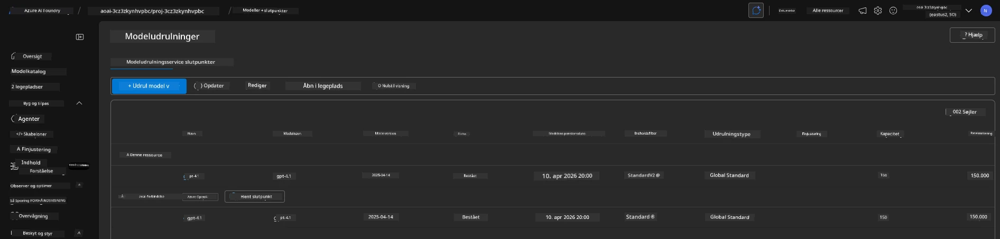

# 6. Nedtagning af Infrastruktur

!!! tip "VED SLUTNINGEN AF DETTE MODUL VIL DU KUNNE"

    - [ ] Punkt
    - [ ] Punkt
    - [ ] Punkt

---

## Ekstra Øvelser

Før vi nedtager projektet, brug et par minutter på at udforske frit og åbent.

!!! fare "NITYA-TODO: Skitser nogle forslag til udforskning"

---

## Nedtagning af Infrastruktur

1. Nedtagning af infrastruktur er så enkelt som:
      
      ```bash title="" linenums="0"
      azd down --purge
      ```
1. Flaget `--purge` sikrer, at det også fjerner blødt-slettede Cognitive Service-ressourcer, hvilket frigiver den kvote, der holdes af disse ressourcer. Når processen er færdig, vil du se noget som dette:
      
      ```bash title="" linenums="0"
      ? Total resources to delete: 11, are you sure you want to continue? Yes
      Deleting your resources can take some time.
      (✓) Done: Deleted resource group rg-nitya-mshack-azd
      (✓) Done: Purging Cognitive Account: aoai-3cz3zkynhvpbc

      SUCCESS: Your application was removed from Azure in 11 minutes 4 seconds.
      ```

1. (Valgfrit) Hvis du nu kører `azd up` igen, vil du bemærke, at gpt-4.1-modellen bliver implementeret, da miljøvariablen blev ændret (og gemt) i den lokale `.azure`-mappe. 

      Her er modelimplementeringerne **før**:

      

      Og her er de **efter**:
      

---

