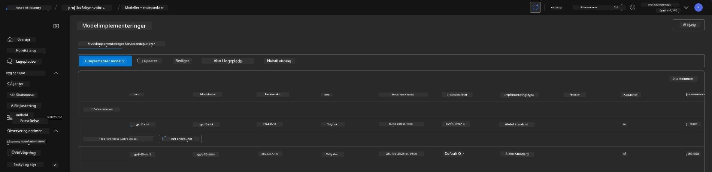
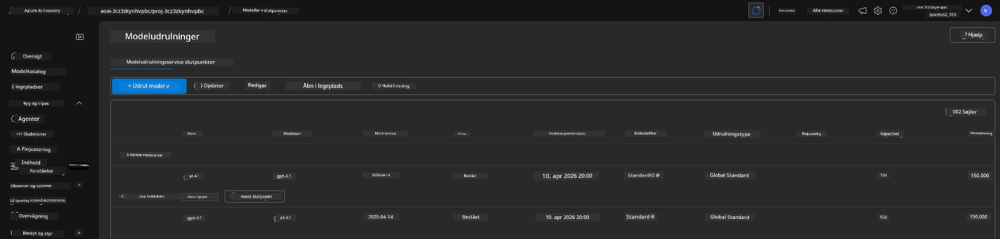

# 6. Nedtagning af infrastruktur

!!! tip "I slutningen af dette modul vil du kunne"

    - [ ] Forstå vigtigheden af oprydning af ressourcer og omkostningsstyring
    - [ ] Brug `azd down` til sikkert at afprovisionere infrastrukturen
    - [ ] Gendan blødslettede Cognitive Service-ressourcer om nødvendigt
    - [ ] **Lab 6:** Ryd op i Azure-ressourcer og verificér fjernelse

---

## Bonusøvelser

Før vi nedtager projektet, brug et par minutter på åben udforskning.

!!! info "Prøv disse udforskningsforslag"

    **Eksperimenter med GitHub Copilot:**
    
    1. Spørg: `Hvilke andre AZD-skabeloner kunne jeg prøve til multi-agent-scenarier?`
    2. Spørg: `Hvordan kan jeg tilpasse agentinstruktionerne til et sundhedsscenarie?`
    3. Spørg: `Hvilke miljøvariabler styrer omkostningsoptimering?`
    
    **Udforsk Azure-portalen:**
    
    1. Gennemgå Application Insights-metrikker for din udrulning
    2. Tjek omkostningsanalysen for de provisionerede ressourcer
    3. Udforsk Microsoft Foundry-portals agent-playground endnu en gang

---

## Afprovisionering af infrastruktur

1. At nedtage infrastrukturen er så nemt som:
      
      ```bash title="" linenums="0"
      azd down --purge
      ```
1. Flaget `--purge` sikrer, at det også rydder op i blødslettede Cognitive Service-ressourcer, og dermed frigiver kvoter, som holdes af disse ressourcer. Når det er fuldført vil du se noget lignende dette:
      
      ```bash title="" linenums="0"
      ? Total resources to delete: 11, are you sure you want to continue? Yes
      Deleting your resources can take some time.
      (✓) Done: Deleted resource group rg-nitya-mshack-azd
      (✓) Done: Purging Cognitive Account: aoai-3cz3zkynhvpbc

      SUCCESS: Your application was removed from Azure in 11 minutes 4 seconds.
      ```

1. (Valgfrit) Hvis du nu kører `azd up` igen, vil du bemærke, at gpt-4.1-modellen bliver udrullet, da miljøvariablen blev ændret (og gemt) i den lokale `.azure`-mappe. 

      Her er modeludrulningerne **før**:

      

      Og her er det **efter**:
      

---

<!-- CO-OP TRANSLATOR DISCLAIMER START -->
Ansvarsfraskrivelse:
Dette dokument er blevet oversat ved hjælp af AI-oversættelsestjenesten Co-op Translator (https://github.com/Azure/co-op-translator). Selvom vi bestræber os på nøjagtighed, skal du være opmærksom på, at automatiske oversættelser kan indeholde fejl eller unøjagtigheder. Det oprindelige dokument på originalsproget bør betragtes som den autoritative kilde. For kritiske oplysninger anbefales professionel, menneskelig oversættelse. Vi er ikke ansvarlige for eventuelle misforståelser eller fejltolkninger, der opstår som følge af brugen af denne oversættelse.
<!-- CO-OP TRANSLATOR DISCLAIMER END -->