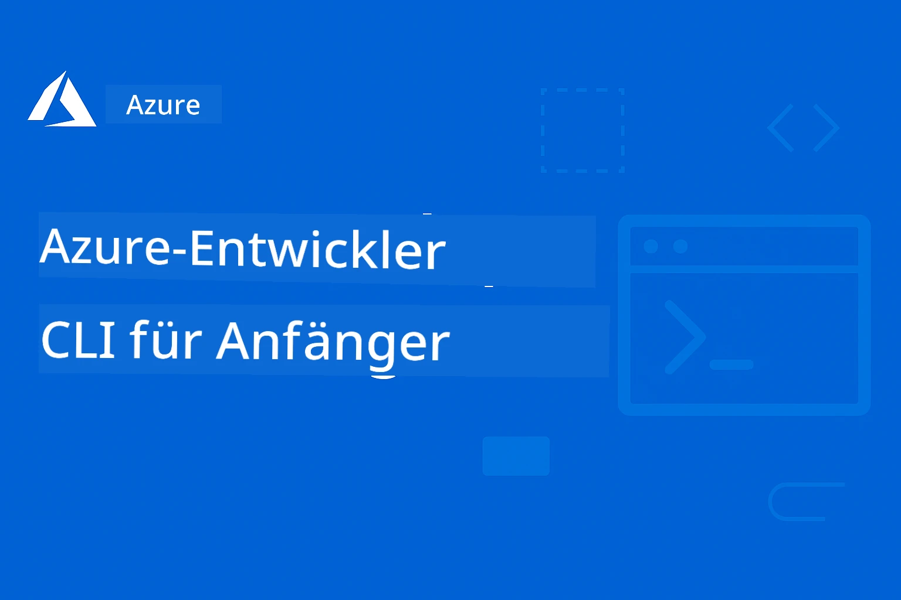

# AZD für Einsteiger: Eine strukturierte Lernreise

 

[](https://GitHub.com/microsoft/azd-for-beginners/watchers/)
[](https://GitHub.com/microsoft/azd-for-beginners/network/)
[](https://GitHub.com/microsoft/azd-for-beginners/stargazers/)

[](https://discord.gg/microsoft-azure)
[](https://discord.gg/nTYy5BXMWG)

---

### Automatisierte Übersetzungen (immer aktuell)

<!-- CO-OP TRANSLATOR LANGUAGES TABLE START -->
[Arabisch](../ar/README.md) | [Bengalisch](../bn/README.md) | [Bulgarisch](../bg/README.md) | [Birmanisch (Myanmar)](../my/README.md) | [Chinesisch (vereinfacht)](../zh-CN/README.md) | [Chinesisch (traditionell, Hongkong)](../zh-HK/README.md) | [Chinesisch (traditionell, Macau)](../zh-MO/README.md) | [Chinesisch (traditionell, Taiwan)](../zh-TW/README.md) | [Kroatisch](../hr/README.md) | [Tschechisch](../cs/README.md) | [Dänisch](../da/README.md) | [Niederländisch](../nl/README.md) | [Estnisch](../et/README.md) | [Finnisch](../fi/README.md) | [Französisch](../fr/README.md) | [Deutsch](./README.md) | [Griechisch](../el/README.md) | [Hebräisch](../he/README.md) | [Hindi](../hi/README.md) | [Ungarisch](../hu/README.md) | [Indonesisch](../id/README.md) | [Italienisch](../it/README.md) | [Japanisch](../ja/README.md) | [Kannada](../kn/README.md) | [Koreanisch](../ko/README.md) | [Litauisch](../lt/README.md) | [Malaiisch](../ms/README.md) | [Malayalam](../ml/README.md) | [Marathi](../mr/README.md) | [Nepalesisch](../ne/README.md) | [Nigerianisches Pidgin](../pcm/README.md) | [Norwegisch](../no/README.md) | [Persisch (Farsi)](../fa/README.md) | [Polnisch](../pl/README.md) | [Portugiesisch (Brasilien)](../pt-BR/README.md) | [Portugiesisch (Portugal)](../pt-PT/README.md) | [Punjabi (Gurmukhi)](../pa/README.md) | [Rumänisch](../ro/README.md) | [Russisch](../ru/README.md) | [Serbisch (Kyrillisch)](../sr/README.md) | [Slowakisch](../sk/README.md) | [Slowenisch](../sl/README.md) | [Spanisch](../es/README.md) | [Suaheli](../sw/README.md) | [Schwedisch](../sv/README.md) | [Tagalog (Filipino)](../tl/README.md) | [Tamil](../ta/README.md) | [Telugu](../te/README.md) | [Thailändisch](../th/README.md) | [Türkisch](../tr/README.md) | [Ukrainisch](../uk/README.md) | [Urdu](../ur/README.md) | [Vietnamesisch](../vi/README.md)

> **Bevorzugen Sie das lokale Klonen?**

> Dieses Repository enthält über 50 Sprachübersetzungen, die die Download-Größe deutlich erhöhen. Um ohne Übersetzungen zu klonen, verwenden Sie Sparse Checkout:
> ```bash
> git clone --filter=blob:none --sparse https://github.com/microsoft/AZD-for-beginners.git
> cd AZD-for-beginners
> git sparse-checkout set --no-cone '/*' '!translations' '!translated_images'
> ```
> Dies gibt Ihnen alles, was Sie benötigen, um den Kurs mit einem deutlich schnelleren Download abzuschließen.
<!-- CO-OP TRANSLATOR LANGUAGES TABLE END -->

## 🚀 Was ist die Azure Developer CLI (azd)?

**Azure Developer CLI (azd)** ist ein entwicklerfreundliches Kommandozeilenwerkzeug, das das Bereitstellen von Anwendungen in Azure vereinfacht. Anstatt Dutzende von Azure-Ressourcen manuell zu erstellen und zu verbinden, können Sie ganze Anwendungen mit einem einzigen Befehl bereitstellen.

### Die Magie von `azd up`

```bash
# Dieser einzelne Befehl erledigt alles:
# ✅ Erstellt alle Azure-Ressourcen
# ✅ Konfiguriert Netzwerk und Sicherheit
# ✅ Baut Ihren Anwendungscode
# ✅ Stellt in Azure bereit
# ✅ Gibt Ihnen eine funktionierende URL
azd up
```

**Das war's!** Kein Klicken im Azure-Portal, keine komplexen ARM-Vorlagen, die Sie zuerst lernen müssen, keine manuelle Konfiguration – einfach funktionierende Anwendungen in Azure.

---

## ❓ Azure Developer CLI vs Azure CLI: Was ist der Unterschied?

Das ist die am häufigsten gestellte Frage von Anfängern. Hier ist die einfache Antwort:

| Funktion | **Azure CLI (`az`)** | **Azure Developer CLI (`azd`)** |
|---------|---------------------|--------------------------------|
| **Zweck** | Einzelne Azure-Ressourcen verwalten | Komplette Anwendungen bereitstellen |
| **Denkweise** | Infrastruktur-orientiert | Anwendungs-orientiert |
| **Beispiel** | `az webapp create --name myapp...` | `azd up` |
| **Lernkurve** | Kenntnisse der Azure-Dienste erforderlich | Nur Ihre Anwendung kennen |
| **Am besten für** | DevOps, Infrastruktur | Entwickler, Prototyping |

### Einfache Analogie

- **Azure CLI** ist wie alle Werkzeuge zu haben, um ein Haus zu bauen - Hammer, Sägen, Nägel. Sie können alles bauen, aber Sie müssen Bauwissen haben.
- **Azure Developer CLI** ist wie einen Bauunternehmer zu engagieren - Sie beschreiben, was Sie möchten, und er kümmert sich um den Bau.

### Wann welches verwenden

| Szenario | Verwenden |
|----------|----------|
| "I want to deploy my web app quickly" | `azd up` |
| "I need to create just a storage account" | `az storage account create` |
| "I'm building a full AI application" | `azd init --template azure-search-openai-demo` |
| "I need to debug a specific Azure resource" | `az resource show` |
| "I want production-ready deployment in minutes" | `azd up --environment production` |

### Sie arbeiten zusammen!

AZD verwendet unter der Haube die Azure CLI. Sie können beide verwenden:
```bash
# Stellen Sie Ihre App mit AZD bereit
azd up

# Feinabstimmung spezifischer Ressourcen mit Azure CLI dann
az webapp config set --name myapp --always-on true
```

---

## 🌟 Vorlagen in Awesome AZD finden

Fangen Sie nicht bei Null an! **Awesome AZD** ist die Community-Sammlung einsatzbereiter Vorlagen:

| Ressource | Beschreibung |
|----------|-------------|
| 🔗 [**Awesome AZD Gallery**](https://azure.github.io/awesome-azd/) | Durchsuchen Sie 200+ Vorlagen mit Ein-Klick-Bereitstellung |
| 🔗 [**Eine Vorlage einreichen**](https://github.com/Azure/awesome-azd/issues) | Tragen Sie Ihre eigene Vorlage zur Community bei |
| 🔗 [**GitHub Repository**](https://github.com/Azure/awesome-azd) | Mit einem Stern versehen und das Repository erkunden |

### Beliebte KI-Vorlagen aus Awesome AZD

```bash
# RAG-Chat mit Azure OpenAI + AI Search
azd init --template azure-search-openai-demo

# Schnelle KI-Chat-Anwendung
azd init --template openai-chat-app-quickstart

# KI-Agenten mit Foundry Agents
azd init --template get-started-with-ai-agents
```

---

## 🎯 Erste Schritte in 3 Schritten

### Schritt 1: AZD installieren (2 Minuten)

**Windows:**
```powershell
winget install microsoft.azd
```

**macOS:**
```bash
brew tap azure/azd && brew install azd
```

**Linux:**
```bash
curl -fsSL https://aka.ms/install-azd.sh | bash
```

### Schritt 2: Bei Azure anmelden

```bash
azd auth login
```

### Schritt 3: Ihre erste App bereitstellen

```bash
# Von einer Vorlage initialisieren
azd init --template todo-nodejs-mongo

# Bereitstellen in Azure (erstellt alles!)
azd up
```

**🎉 Das war's!** Ihre App ist jetzt auf Azure online.

### Aufräumen (Nicht vergessen!)

```bash
# Remove all resources when done experimenting
azd down --force --purge
```

---

## 📚 Wie Sie diesen Kurs verwenden

Dieser Kurs ist für **progressives Lernen** konzipiert – beginnen Sie dort, wo Sie sich wohlfühlen, und arbeiten Sie sich nach oben:

| Ihre Erfahrung | Hier anfangen |
|-----------------|------------|
| **Neu bei Azure** | [Kapitel 1: Grundlagen](../..) |
| **Kennt Azure, neu bei AZD** | [Kapitel 1: Grundlagen](../..) |
| **Möchten KI-Apps bereitstellen** | [Kapitel 2: KI-Entwicklung](../..) |
| **Möchten praktische Übungen** | [🎓 Interaktiver Workshop](workshop/README.md) - 3–4-stündiges geführtes Labor |
| **Brauchen Produktionsmuster** | [Kapitel 8: Produktion & Enterprise](../..) |

### Schnelle Einrichtung

1. **Dieses Repository forken**: [](https://GitHub.com/microsoft/azd-for-beginners/fork)
2. **Klonen**: `git clone https://github.com/YOUR-USERNAME/azd-for-beginners.git`
3. **Hilfe erhalten**: [Azure Discord Community](https://discord.com/invite/ByRwuEEgH4)

> **Bevorzugen Sie das lokale Klonen?**

> Dieses Repository enthält über 50 Sprachübersetzungen, die die Download-Größe deutlich erhöhen. Um ohne Übersetzungen zu klonen, verwenden Sie Sparse Checkout:
> ```bash
> git clone --filter=blob:none --sparse https://github.com/microsoft/AZD-for-beginners.git
> cd AZD-for-beginners
> git sparse-checkout set --no-cone '/*' '!translations' '!translated_images'
> ```
> Dies gibt Ihnen alles, was Sie benötigen, um den Kurs mit einem deutlich schnelleren Download abzuschließen.


## Kursüberblick

Meistern Sie die Azure Developer CLI (azd) durch strukturierte Kapitel, die für progressives Lernen konzipiert sind. **Besonderer Fokus auf die Bereitstellung von KI-Anwendungen mit Microsoft Foundry-Integration.**

### Warum dieser Kurs für moderne Entwickler unerlässlich ist

Basierend auf Erkenntnissen aus der Microsoft Foundry Discord-Community möchten **45 % der Entwickler AZD für KI-Workloads verwenden**, stoßen jedoch auf Herausforderungen mit:
- Komplexen Multi-Service-KI-Architekturen
- Best Practices für KI-Bereitstellungen in der Produktion  
- Integration und Konfiguration von Azure AI-Diensten
- Kostenoptimierung für KI-Workloads
- Fehlerbehebung bei KI-spezifischen Bereitstellungsproblemen

### Lernziele

Durch den Abschluss dieses strukturierten Kurses werden Sie:
- **AZD-Grundlagen meistern**: Kernkonzepte, Installation und Konfiguration
- **KI-Anwendungen bereitstellen**: Verwenden Sie AZD mit Microsoft Foundry-Diensten
- **Infrastructure as Code implementieren**: Verwalten Sie Azure-Ressourcen mit Bicep-Vorlagen
- **Bereitstellungen debuggen**: Häufige Probleme beheben und Fehler analysieren
- **Für die Produktion optimieren**: Sicherheit, Skalierung, Überwachung und Kostenmanagement
- **Multi-Agenten-Lösungen bauen**: Komplexe KI-Architekturen bereitstellen

## 🗺️ Kurskarte: Schnelle Navigation nach Kapitel

Jedes Kapitel hat ein eigenes README mit Lernzielen, Schnellstartanleitungen und Übungen:

| Kapitel | Thema | Lektionen | Dauer | Komplexität |
|---------|-------|---------|----------|------------|
| **[Kap. 1: Grundlagen](docs/chapter-01-foundation/README.md)** | Erste Schritte | [AZD-Grundlagen](docs/chapter-01-foundation/azd-basics.md) &#124; [Installation](docs/chapter-01-foundation/installation.md) &#124; [Erstes Projekt](docs/chapter-01-foundation/first-project.md) | 30-45 min | ⭐ |
| **[Kap. 2: KI-Entwicklung](docs/chapter-02-ai-development/README.md)** | KI-fokussierte Apps | [Foundry-Integration](docs/chapter-02-ai-development/microsoft-foundry-integration.md) &#124; [KI-Agenten](docs/chapter-02-ai-development/agents.md) &#124; [Modellbereitstellung](docs/chapter-02-ai-development/ai-model-deployment.md) &#124; [Workshop](docs/chapter-02-ai-development/ai-workshop-lab.md) | 1-2 hrs | ⭐⭐ |
| **[Kap. 3: Konfiguration](docs/chapter-03-configuration/README.md)** | Authentifizierung & Sicherheit | [Konfiguration](docs/chapter-03-configuration/configuration.md) &#124; [Authentifizierung & Sicherheit](docs/chapter-03-configuration/authsecurity.md) | 45-60 min | ⭐⭐ |
| **[Kap. 4: Infrastruktur](docs/chapter-04-infrastructure/README.md)** | IaC & Bereitstellung | [Bereitstellungsleitfaden](docs/chapter-04-infrastructure/deployment-guide.md) &#124; [Provisionierung](docs/chapter-04-infrastructure/provisioning.md) | 1-1.5 hrs | ⭐⭐⭐ |
| **[Kap. 5: Multi-Agent](docs/chapter-05-multi-agent/README.md)** | KI-Agenten-Lösungen | [Einzelhandelsszenario](examples/retail-scenario.md) &#124; [Koordinationsmuster](docs/chapter-06-pre-deployment/coordination-patterns.md) | 2-3 Std. | ⭐⭐⭐⭐ |
| **[Kap. 6: Vorbereitende Maßnahmen](docs/chapter-06-pre-deployment/README.md)** | Planung & Validierung | [Preflight-Prüfungen](docs/chapter-06-pre-deployment/preflight-checks.md) &#124; [Kapazitätsplanung](docs/chapter-06-pre-deployment/capacity-planning.md) &#124; [SKU-Auswahl](docs/chapter-06-pre-deployment/sku-selection.md) &#124; [Application Insights](docs/chapter-06-pre-deployment/application-insights.md) | 1 Std. | ⭐⭐ |
| **[Kap. 7: Fehlerbehebung](docs/chapter-07-troubleshooting/README.md)** | Fehlerdiagnose & Behebung | [Häufige Probleme](docs/chapter-07-troubleshooting/common-issues.md) &#124; [Fehlersuche](docs/chapter-07-troubleshooting/debugging.md) &#124; [KI-spezifische Probleme](docs/chapter-07-troubleshooting/ai-troubleshooting.md) | 1-1,5 Std. | ⭐⭐ |
| **[Kap. 8: Produktion](docs/chapter-08-production/README.md)** | Unternehmensmuster | [Produktionspraktiken](docs/chapter-08-production/production-ai-practices.md) | 2-3 Std. | ⭐⭐⭐⭐ |
| **[🎓 Workshop](workshop/README.md)** | Praktische Übung | [Einführung](workshop/docs/instructions/0-Introduction.md) &#124; [Auswahl](workshop/docs/instructions/1-Select-AI-Template.md) &#124; [Validierung](workshop/docs/instructions/2-Validate-AI-Template.md) &#124; [Dekonstruktion](workshop/docs/instructions/3-Deconstruct-AI-Template.md) &#124; [Konfiguration](workshop/docs/instructions/4-Configure-AI-Template.md) &#124; [Anpassung](workshop/docs/instructions/5-Customize-AI-Template.md) &#124; [Infrastrukturabbau](workshop/docs/instructions/6-Teardown-Infrastructure.md) &#124; [Abschluss](workshop/docs/instructions/7-Wrap-up.md) | 3-4 Std. | ⭐⭐ |

**Gesamtdauer des Kurses:** ~10-14 Stunden | **Fertigkeitsentwicklung:** Anfänger → Produktionsreif

---

## 📚 Lernkapitel

*Wähle deinen Lernpfad basierend auf Erfahrungsniveau und Zielen*

### 🚀 Kapitel 1: Grundlagen & Schnellstart
**Voraussetzungen**: Azure-Abonnement, grundlegende Kenntnisse der Befehlszeile  
**Dauer**: 30-45 Minuten  
**Komplexität**: ⭐

#### Was du lernen wirst
- Grundlagen der Azure Developer CLI verstehen
- AZD auf deiner Plattform installieren
- Deine erste erfolgreiche Bereitstellung

#### Lernressourcen
- **🎯 Hier starten**: [Was ist die Azure Developer CLI?](../..)
- **📖 Theorie**: [AZD-Grundlagen](docs/chapter-01-foundation/azd-basics.md) - Kernkonzepte und Terminologie
- **⚙️ Einrichtung**: [Installation & Einrichtung](docs/chapter-01-foundation/installation.md) - Plattformspezifische Anleitungen
- **🛠️ Praxis**: [Dein erstes Projekt](docs/chapter-01-foundation/first-project.md) - Schritt-für-Schritt-Anleitung
- **📋 Schnellreferenz**: [Befehls-Übersicht](resources/cheat-sheet.md)

#### Praktische Übungen
```bash
# Schnelle Installationsprüfung
azd version

# Bereitstellung Ihrer ersten Anwendung
azd init --template todo-nodejs-mongo
azd up
```

**💡 Kapitel-Ergebnis**: Erfolgreiche Bereitstellung einer einfachen Webanwendung auf Azure mit AZD

**✅ Erfolgskontrolle:**
```bash
# Nach Abschluss von Kapitel 1 sollten Sie in der Lage sein:
azd version              # Zeigt die installierte Version an
azd init --template todo-nodejs-mongo  # Initialisiert das Projekt
azd up                  # Stellt in Azure bereit
azd show                # Zeigt die URL der laufenden Anwendung an
# Die Anwendung öffnet sich im Browser und funktioniert
azd down --force --purge  # Bereinigt Ressourcen
```

**📊 Zeitaufwand:** 30-45 Minuten  
**📈 Fähigkeitsniveau danach:** Kann grundlegende Anwendungen eigenständig bereitstellen

**✅ Erfolgskontrolle:**
```bash
# Nach Abschluss von Kapitel 1 sollten Sie Folgendes können:
azd version              # Zeigt die installierte Version an
azd init --template todo-nodejs-mongo  # Initialisiert das Projekt
azd up                  # Stellt in Azure bereit
azd show                # Zeigt die URL der laufenden App an
# Die Anwendung öffnet sich im Browser und funktioniert
azd down --force --purge  # Bereinigt Ressourcen
```

**📊 Zeitaufwand:** 30-45 Minuten  
**📈 Fähigkeitsniveau danach:** Kann grundlegende Anwendungen eigenständig bereitstellen

---

### 🤖 Kapitel 2: KI-zentrierte Entwicklung (Empfohlen für KI-Entwickler)
**Voraussetzungen**: Kapitel 1 abgeschlossen  
**Dauer**: 1-2 Std.  
**Komplexität**: ⭐⭐

#### Was du lernen wirst
- Microsoft Foundry-Integration mit AZD
- Bereitstellung KI-gestützter Anwendungen
- Verständnis von KI-Dienstkonfigurationen

#### Lernressourcen
- **🎯 Hier starten**: [Microsoft Foundry-Integration](docs/chapter-02-ai-development/microsoft-foundry-integration.md)
- **🤖 KI-Agenten**: [Leitfaden zu KI-Agenten](docs/chapter-02-ai-development/agents.md) - Intelligente Agenten mit AZD bereitstellen
- **📖 Muster**: [Bereitstellung von KI-Modellen](docs/chapter-02-ai-development/ai-model-deployment.md) - KI-Modelle bereitstellen und verwalten
- **🛠️ Workshop**: [KI-Workshop-Labor](docs/chapter-02-ai-development/ai-workshop-lab.md) - Mache deine KI-Lösungen AZD-bereit
- **🎥 Interaktiver Leitfaden**: [Workshop-Materialien](workshop/README.md) - Browserbasierte Lernumgebung mit MkDocs * DevContainer Environment
- **📋 Vorlagen**: [Microsoft Foundry-Vorlagen](../..)
- **📝 Beispiele**: [AZD-Bereitstellungsbeispiele](examples/README.md)

#### Praktische Übungen
```bash
# Stellen Sie Ihre erste KI-Anwendung bereit
azd init --template azure-search-openai-demo
azd up

# Probieren Sie zusätzliche KI-Vorlagen aus
azd init --template openai-chat-app-quickstart
azd init --template agent-openai-python-prompty
```

**💡 Kapitel-Ergebnis**: Bereitstellen und Konfigurieren einer KI-gestützten Chat-Anwendung mit RAG-Funktionen

**✅ Erfolgskontrolle:**
```bash
# Nach Kapitel 2 sollten Sie in der Lage sein:
azd init --template azure-search-openai-demo
azd up
# Die KI-Chat-Oberfläche testen
# Fragen stellen und KI-gestützte Antworten mit Quellen erhalten
# Überprüfen, ob die Suchintegration funktioniert
azd monitor  # Überprüfen, ob Application Insights Telemetriedaten anzeigt
azd down --force --purge
```

**📊 Zeitaufwand:** 1-2 Std.  
**📈 Fähigkeitsniveau danach:** Kann produktionsreife KI-Anwendungen bereitstellen und konfigurieren  
**💰 Kostenbewusstsein:** Verstehe Entwicklungskosten von $80-150/Monat, Produktionskosten von $300-3500/Monat

#### 💰 Kostenüberlegungen für KI-Bereitstellungen

**Entwicklungsumgebung (geschätzt $80-150/Monat):**
- Azure OpenAI (Pay-as-you-go): $0-50/Monat (abhängig vom Tokenverbrauch)
- AI Search (Basic-Tarif): $75/Monat
- Container Apps (Consumption): $0-20/Monat
- Speicher (Standard): $1-5/Monat

**Produktionsumgebung (geschätzt $300-3.500+/Monat):**
- Azure OpenAI (PTU für konstante Leistung): $3.000+/Monat ODER Pay-as-you-go bei hohem Volumen
- AI Search (Standard-Tarif): $250/Monat
- Container Apps (Dedicated): $50-100/Monat
- Application Insights: $5-50/Monat
- Speicher (Premium): $10-50/Monat

**💡 Tipps zur Kostenoptimierung:**
- Nutze die Free-Tier von Azure OpenAI zum Lernen (50.000 Tokens/Monat enthalten)
- Führe `azd down` aus, um Ressourcen zu deallozieren, wenn nicht aktiv entwickelt wird
- Beginne mit verbrauchsabhängiger Abrechnung, auf PTU nur für Produktion upgraden
- Verwende `azd provision --preview`, um Kosten vor der Bereitstellung zu schätzen
- Auto-Scaling aktivieren: zahle nur für tatsächliche Nutzung

**Kostenüberwachung:**
```bash
# Geschätzte monatliche Kosten prüfen
azd provision --preview

# Tatsächliche Kosten im Azure-Portal überwachen
az consumption budget list --resource-group <your-rg>
```

---

### ⚙️ Kapitel 3: Konfiguration & Authentifizierung
**Voraussetzungen**: Kapitel 1 abgeschlossen  
**Dauer**: 45-60 Minuten  
**Komplexität**: ⭐⭐

#### Was du lernen wirst
- Konfiguration und Verwaltung von Umgebungen
- Best Practices für Authentifizierung und Sicherheit
- Ressourcenbenennung und -organisation

#### Lernressourcen
- **📖 Konfiguration**: [Konfigurationsanleitung](docs/chapter-03-configuration/configuration.md) - Umgebungssetup
- **🔐 Sicherheit**: [Authentifizierungsmuster und Managed Identity](docs/chapter-03-configuration/authsecurity.md) - Authentifizierungsmuster
- **📝 Beispiele**: [Beispiel einer Datenbank-App](examples/database-app/README.md) - AZD Datenbank-Beispiele

#### Praktische Übungen
- Konfiguriere mehrere Umgebungen (dev, staging, prod)
- Richte Managed Identity Authentifizierung ein
- Implementiere umgebungsspezifische Konfigurationen

**💡 Kapitel-Ergebnis**: Mehrere Umgebungen mit geeigneter Authentifizierung und Sicherheit verwalten

---

### 🏗️ Kapitel 4: Infrastructure as Code & Bereitstellung
**Voraussetzungen**: Kapitel 1–3 abgeschlossen  
**Dauer**: 1-1,5 Std.  
**Komplexität**: ⭐⭐⭐

#### Was du lernen wirst
- Erweiterte Bereitstellungsmuster
- Infrastructure as Code mit Bicep
- Strategien zur Ressourcenbereitstellung

#### Lernressourcen
- **📖 Bereitstellung**: [Bereitstellungsanleitung](docs/chapter-04-infrastructure/deployment-guide.md) - Komplette Workflows
- **🏗️ Provisioning**: [Ressourcenbereitstellung](docs/chapter-04-infrastructure/provisioning.md) - Azure Ressourcenmanagement
- **📝 Beispiele**: [Container-App-Beispiel](../../examples/container-app) - Containerisierte Bereitstellungen

#### Praktische Übungen
- Erstelle benutzerdefinierte Bicep-Vorlagen
- Bereitstelle Multi-Service-Anwendungen
- Implementiere Blue-Green-Deployment-Strategien

**💡 Kapitel-Ergebnis**: Komplexe Multi-Service-Anwendungen mit benutzerdefinierten Infrastrukturvorlagen bereitstellen

---

### 🎯 Kapitel 5: Multi-Agent KI-Lösungen (Fortgeschritten)
**Voraussetzungen**: Kapitel 1–2 abgeschlossen  
**Dauer**: 2-3 Std.  
**Komplexität**: ⭐⭐⭐⭐

#### Was du lernen wirst
- Architektur-Muster für Multi-Agenten
- Agenten-Orchestrierung und Koordination
- Produktionsreife KI-Bereitstellungen

#### Lernressourcen
- **🤖 Featured Project**: [Einzelhandels-Multi-Agenten-Lösung](examples/retail-scenario.md) - Vollständige Implementierung
- **🛠️ ARM Templates**: [ARM Template Package](../../examples/retail-multiagent-arm-template) - One-Click-Bereitstellung
- **📖 Architektur**: [Koordinationsmuster für Multi-Agenten](docs/chapter-06-pre-deployment/coordination-patterns.md) - Muster

#### Praktische Übungen
```bash
# Die vollständige Multi-Agenten-Lösung für den Einzelhandel bereitstellen
cd examples/retail-multiagent-arm-template
./deploy.sh

# Agentenkonfigurationen erkunden
az deployment group show --resource-group <rg-name> --name <deployment-name>
```

**💡 Kapitel-Ergebnis**: Eine produktionsreife Multi-Agenten-KI-Lösung mit Kunden- und Bestandsagenten bereitstellen und verwalten

---

### 🔍 Kapitel 6: Validierung & Planung vor der Bereitstellung
**Voraussetzungen**: Kapitel 4 abgeschlossen  
**Dauer**: 1 Std.  
**Komplexität**: ⭐⭐

#### Was du lernen wirst
- Kapazitätsplanung und Ressourcenvalidierung
- Strategien zur SKU-Auswahl
- Preflight-Checks und Automatisierung

#### Lernressourcen
- **📊 Planung**: [Kapazitätsplanung](docs/chapter-06-pre-deployment/capacity-planning.md) - Ressourcenvalidierung
- **💰 Auswahl**: [SKU-Auswahl](docs/chapter-06-pre-deployment/sku-selection.md) - Kostenbewusste Entscheidungen
- **✅ Validierung**: [Preflight-Prüfungen](docs/chapter-06-pre-deployment/preflight-checks.md) - Automatisierte Skripte

#### Praktische Übungen
- Führe Kapazitätsvalidierungsskripte aus
- Optimiere SKU-Auswahlen für Kosten
- Implementiere automatisierte Pre-Deployment-Checks

**💡 Kapitel-Ergebnis**: Bereitstellungen vor der Ausführung validieren und optimieren

---

### 🚨 Kapitel 7: Fehlerbehebung & Debugging
**Voraussetzungen**: Beliebiges Deployment-Kapitel abgeschlossen  
**Dauer**: 1-1,5 Std.  
**Komplexität**: ⭐⭐

#### Was du lernen wirst
- Systematische Ansätze zur Fehlersuche
- Häufige Probleme und Lösungen
- KI-spezifische Fehlerbehebung

#### Lernressourcen
- **🔧 Häufige Probleme**: [Häufige Probleme](docs/chapter-07-troubleshooting/common-issues.md) - FAQ und Lösungen
- **🕵️ Fehlersuche**: [Debugging-Anleitung](docs/chapter-07-troubleshooting/debugging.md) - Schritt-für-Schritt-Strategien
- **🤖 KI-Probleme**: [KI-spezifische Fehlerbehebung](docs/chapter-07-troubleshooting/ai-troubleshooting.md) - Probleme mit KI-Diensten

#### Praktische Übungen
- Diagnostiziere Bereitstellungsfehler
- Behebe Authentifizierungsprobleme
- Debugge die Konnektivität von KI-Diensten

**💡 Kapitel-Ergebnis**: Häufige Bereitstellungsprobleme eigenständig diagnostizieren und beheben

---

### 🏢 Kapitel 8: Produktion & Unternehmensmuster
**Voraussetzungen**: Kapitel 1–4 abgeschlossen  
**Dauer**: 2-3 Std.  
**Komplexität**: ⭐⭐⭐⭐

#### Was du lernen wirst
- Strategien für Produktionsbereitstellungen
- Unternehmenssicherheitsmuster
- Monitoring und Kostenoptimierung

#### Lernressourcen
- **🏭 Produktion**: [Best Practices für Produktions-KI](docs/chapter-08-production/production-ai-practices.md) - Unternehmensmuster
- **📝 Beispiele**: [Microservices-Beispiel](../../examples/microservices) - Komplexe Architekturen
- **📊 Monitoring**: [Application Insights-Integration](docs/chapter-06-pre-deployment/application-insights.md) - Monitoring

#### Praktische Übungen
- Implementiere Unternehmenssicherheitsmuster
- Richte umfassendes Monitoring ein
- Bereitstelle in Produktion mit angemessener Governance

**💡 Kapitel-Ergebnis**: Unternehmensbereite Anwendungen mit vollständigen Produktionsfunktionen bereitstellen

---

## 🎓 Workshop-Übersicht: Praxisorientiertes Lernen

> **⚠️ WORKSHOP STATUS: In aktiver Entwicklung**  
> Die Workshop-Materialien werden derzeit entwickelt und verfeinert. Kernmodule sind funktionsfähig, aber einige fortgeschrittene Abschnitte sind unvollständig. Wir arbeiten aktiv daran, alle Inhalte zu vervollständigen. [Fortschritt verfolgen →](workshop/README.md)

### Interaktive Workshop-Materialien
**Umfassendes praxisorientiertes Lernen mit browserbasierten Tools und geführten Übungen**
Unsere Workshop-Materialien bieten ein strukturiertes, interaktives Lernerlebnis, das den oben stehenden kapitelbasierten Lehrplan ergänzt. Der Workshop ist sowohl für selbstgesteuertes Lernen als auch für instruktorgeführte Sitzungen konzipiert.

#### 🛠️ Workshop-Features
- **Browser-Based Interface**: Vollständiger MkDocs-basierter Workshop mit Suche, Kopier- und Theme-Funktionen
- **GitHub Codespaces Integration**: Ein-Klick-Einrichtung der Entwicklungsumgebung
- **Structured Learning Path**: Geführte 8-Module-Übungen (insgesamt 3–4 Stunden)
- **Progressive Methodology**: Einführung → Auswahl → Validierung → Dekonstruktion → Konfiguration → Anpassung → Aufräumen → Abschluss
- **Interactive DevContainer Environment**: Vorkonfigurierte Tools und Abhängigkeiten

#### 📚 Aufbau der Workshop-Module
Der Workshop folgt einer **8-moduligen progressiven Methodik**, die Sie von der Entdeckung bis zur Bereitstellungsbeherrschung führt:

| Module | Topic | What You'll Do | Duration |
|--------|-------|----------------|----------|
| **0. Introduction** | Workshop Overview | Understand learning objectives, prerequisites, and workshop structure | 15 min |
| **1. Selection** | Template Discovery | Explore AZD templates and select the right AI template for your scenario | 20 min |
| **2. Validation** | Deploy & Verify | Deploy the template with `azd up` and validate infrastructure works | 30 min |
| **3. Deconstruction** | Understand Structure | Use GitHub Copilot to explore template architecture, Bicep files, and code organization | 30 min |
| **4. Configuration** | azure.yaml Deep Dive | Master `azure.yaml` configuration, lifecycle hooks, and environment variables | 30 min |
| **5. Customization** | Make It Yours | Enable AI Search, tracing, evaluation, and customize for your scenario | 45 min |
| **6. Teardown** | Clean Up | Safely deprovision resources with `azd down --purge` | 15 min |
| **7. Wrap-up** | Next Steps | Review accomplishments, key concepts, and continue your learning journey | 15 min |

**Workshop Flow:**
```
Introduction → Selection → Validation → Deconstruction → Configuration → Customization → Teardown → Wrap-up
     ↓            ↓           ↓              ↓               ↓              ↓            ↓           ↓
  Overview    Find the     Deploy &      Explore        Master         Customize     Clean up    Review &
             right        verify        code &        azure.yaml      for your      resources   next steps
             template                   structure                     scenario
```

#### 🚀 Einstieg in den Workshop
```bash
# Option 1: GitHub Codespaces (Empfohlen)
# Klicken Sie im Repository auf "Code" → "Codespace auf main erstellen"

# Option 2: Lokale Entwicklung
git clone https://github.com/microsoft/azd-for-beginners.git
cd azd-for-beginners/workshop
# Befolgen Sie die Einrichtungsanweisungen in workshop/README.md
```

#### 🎯 Lernziele des Workshops
Durch den Abschluss des Workshops werden die Teilnehmenden:
- **Produktive AI-Anwendungen bereitstellen**: Verwenden Sie AZD mit Microsoft Foundry-Diensten
- **Multi-Agent-Architekturen beherrschen**: Implementieren Sie koordinierte AI-Agenten-Lösungen
- **Sicherheitsbest Practices umsetzen**: Konfigurieren Sie Authentifizierung und Zugriffskontrolle
- **Für Skalierung optimieren**: Entwerfen Sie kosteneffiziente, leistungsfähige Bereitstellungen
- **Bereitstellungen beheben**: Lösen Sie häufige Probleme eigenständig

#### 📖 Workshop-Ressourcen
- **🎥 Interaktiver Leitfaden**: [Workshop Materials](workshop/README.md) - Browserbasiertes Lernumfeld
- **📋 Modul-für-Modul-Anleitungen**:
  - [0. Introduction](workshop/docs/instructions/0-Introduction.md) - Workshop-Überblick und Ziele
  - [1. Selection](workshop/docs/instructions/1-Select-AI-Template.md) - Finden und Auswählen von AI-Vorlagen
  - [2. Validation](workshop/docs/instructions/2-Validate-AI-Template.md) - Vorlagen bereitstellen und überprüfen
  - [3. Deconstruction](workshop/docs/instructions/3-Deconstruct-AI-Template.md) - Vorlagearchitektur erkunden
  - [4. Configuration](workshop/docs/instructions/4-Configure-AI-Template.md) - azure.yaml meistern
  - [5. Customization](workshop/docs/instructions/5-Customize-AI-Template.md) - Für Ihr Szenario anpassen
  - [6. Teardown](workshop/docs/instructions/6-Teardown-Infrastructure.md) - Ressourcen aufräumen
  - [7. Wrap-up](workshop/docs/instructions/7-Wrap-up.md) - Rückblick und nächste Schritte
- **🛠️ AI Workshop-Labor**: [AI Workshop Lab](docs/chapter-02-ai-development/ai-workshop-lab.md) - AI-orientierte Übungen
- **💡 Schnellstart**: [Workshop Setup Guide](workshop/README.md#quick-start) - Umgebungskonfiguration

**Perfekt für**: Firmen-Schulungen, Universitätskurse, Selbstlernende und Entwickler-Bootcamps.

---

## 📖 Detaillierte Betrachtung: AZD-Funktionen

Über die Grundlagen hinaus bietet AZD leistungsstarke Funktionen für Produktionsbereitstellungen:

- **Vorlagenbasierte Bereitstellungen** - Verwenden Sie vorgefertigte Vorlagen für gängige Anwendungsarchitekturen
- **Infrastruktur als Code** - Verwalten Sie Azure-Ressourcen mit Bicep oder Terraform  
- **Integrierte Workflows** - Provisionieren, bereitstellen und überwachen Sie Anwendungen nahtlos
- **Entwicklerfreundlich** - Optimiert für Entwicklerproduktivität und -erlebnis

### **AZD + Microsoft Foundry: Ideal für AI-Bereitstellungen**

**Warum AZD für AI-Lösungen?** AZD adressiert die wichtigsten Herausforderungen, denen AI-Entwickler gegenüberstehen:

- **AI-fertige Vorlagen** - Vorkonfigurierte Vorlagen für Azure OpenAI, Cognitive Services und ML-Workloads
- **Sichere AI-Bereitstellungen** - Eingebaute Sicherheitsmuster für AI-Dienste, API-Schlüssel und Modellendpunkte  
- **Produktionsreife AI-Muster** - Best Practices für skalierbare, kosteneffiziente AI-Anwendungsbereitstellungen
- **End-to-End AI-Workflows** - Vom Modellentwicklung bis zur Produktionsbereitstellung mit geeigneter Überwachung
- **Kostenoptimierung** - Intelligente Ressourcenallokation und Skalierungsstrategien für AI-Workloads
- **Microsoft Foundry-Integration** - Nahtlose Anbindung an den Microsoft Foundry Modellkatalog und Endpunkte

---

## 🎯 Vorlagen- & Beispielbibliothek

### Vorgestellt: Microsoft Foundry-Vorlagen
**Beginnen Sie hier, wenn Sie AI-Anwendungen bereitstellen!**

> **Hinweis:** Diese Vorlagen demonstrieren verschiedene AI-Muster. Einige sind externe Azure Samples, andere sind lokale Implementierungen.

| Template | Chapter | Complexity | Services | Type |
|----------|---------|------------|----------|------|
| [**Get started with AI chat**](https://github.com/Azure-Samples/get-started-with-ai-chat) | Kapitel 2 | ⭐⭐ | AzureOpenAI + Azure AI Model Inference API + Azure AI Search + Azure Container Apps + Application Insights | Extern |
| [**Get started with AI agents**](https://github.com/Azure-Samples/get-started-with-ai-agents) | Kapitel 2 | ⭐⭐ | Foundry Agents + AzureOpenAI + Azure AI Search + Azure Container Apps + Application Insights| Extern |
| [**Azure Search + OpenAI Demo**](https://github.com/Azure-Samples/azure-search-openai-demo) | Kapitel 2 | ⭐⭐ | AzureOpenAI + Azure AI Search + App Service + Storage | Extern |
| [**OpenAI Chat App Quickstart**](https://github.com/Azure-Samples/openai-chat-app-quickstart) | Kapitel 2 | ⭐ | AzureOpenAI + Container Apps + Application Insights | Extern |
| [**Agent OpenAI Python Prompty**](https://github.com/Azure-Samples/agent-openai-python-prompty) | Kapitel 5 | ⭐⭐⭐ | AzureOpenAI + Azure Functions + Prompty | Extern |
| [**Contoso Chat RAG**](https://github.com/Azure-Samples/contoso-chat) | Kapitel 8 | ⭐⭐⭐⭐ | AzureOpenAI + AI Search + Cosmos DB + Container Apps | Extern |
| [**Retail Multi-Agent Solution**](examples/retail-scenario.md) | Kapitel 5 | ⭐⭐⭐⭐ | AzureOpenAI + AI Search + Storage + Container Apps + Cosmos DB | **Lokal** |

### Vorgestellt: Komplette Lernszenarien
**Produktionsreife Anwendungsvorlagen zugeordnet zu den Lernkapiteln**

| Template | Learning Chapter | Complexity | Key Learning |
|----------|------------------|------------|--------------|
| [**openai-chat-app-quickstart**](https://github.com/Azure-Samples/openai-chat-app-quickstart) | Kapitel 2 | ⭐ | Basic AI deployment patterns |
| [**azure-search-openai-demo**](https://github.com/Azure-Samples/azure-search-openai-demo) | Kapitel 2 | ⭐⭐ | RAG implementation with Azure AI Search |
| [**ai-document-processing**](https://github.com/Azure-Samples/ai-document-processing) | Kapitel 4 | ⭐⭐ | Document Intelligence integration |
| [**agent-openai-python-prompty**](https://github.com/Azure-Samples/agent-openai-python-prompty) | Kapitel 5 | ⭐⭐⭐ | Agent framework and function calling |
| [**contoso-chat**](https://github.com/Azure-Samples/contoso-chat) | Kapitel 8 | ⭐⭐⭐ | Enterprise AI orchestration |
| [**retail-multi-agent-solution**](examples/retail-scenario.md) | Kapitel 5 | ⭐⭐⭐⭐ | Multi-agent architecture with Customer and Inventory agents |

### Lernen nach Beispieltyp

> **📌 Lokale vs. Externe Beispiele:**  
> **Lokale Beispiele** (in diesem Repo) = Sofort einsatzbereit  
> **Externe Beispiele** (Azure Samples) = Aus den verlinkten Repositories klonen

#### Lokale Beispiele (Sofort einsatzbereit)
- [**Retail Multi-Agent Solution**](examples/retail-scenario.md) - Vollständige produktionsreife Implementierung mit ARM-Vorlagen
  - Multi-Agent-Architektur (Customer + Inventory Agents)
  - Umfassendes Monitoring und Evaluation
  - Ein-Klick-Bereitstellung über ARM-Vorlage

#### Lokale Beispiele - Containeranwendungen (Kapitel 2-5)
**Umfassende Beispiele für Container-Bereitstellungen in diesem Repository:**
- [**Container App Examples**](examples/container-app/README.md) - Vollständige Anleitung zu containerisierten Bereitstellungen
  - [Simple Flask API](../../examples/container-app/simple-flask-api) - Einfaches REST-API mit Scale-to-Zero
  - [Microservices Architecture](../../examples/container-app/microservices) - Produktionsreife Multi-Service-Bereitstellung
  - Quick Start, Production und Advanced Bereitstellungsmuster
  - Monitoring, Sicherheit und Kostenoptimierungsrichtlinien

#### Externe Beispiele - Einfache Anwendungen (Kapitel 1-2)
**Klonen Sie diese Azure Samples Repositories, um zu starten:**
- [Simple Web App - Node.js + MongoDB](https://github.com/Azure-Samples/todo-nodejs-mongo) - Grundlegende Bereitstellungsmuster
- [Static Website - React SPA](https://github.com/Azure-Samples/todo-csharp-sql-swa-func) - Statische Inhaltsbereitstellung
- [Container App - Python Flask](https://github.com/Azure-Samples/container-apps-store-api-microservice) - REST-API-Bereitstellung

#### Externe Beispiele - Datenbankintegration (Kapitel 3-4)  
- [Database App - C# + SQL](https://github.com/Azure-Samples/todo-csharp-sql) - Muster für Datenbankkonnektivität
- [Functions + Cosmos DB](https://github.com/Azure-Samples/todo-python-mongo-swa-func) - Serverless-Datenworkflow

#### Externe Beispiele - Erweiterte Muster (Kapitel 4-8)
- [Java Microservices](https://github.com/Azure-Samples/java-microservices-aca-lab) - Multi-Service-Architekturen
- [Container Apps Jobs](https://github.com/Azure-Samples/container-apps-jobs) - Hintergrundverarbeitung  
- [Enterprise ML Pipeline](https://github.com/Azure-Samples/mlops-v2) - Produktionsreife ML-Muster

### Externe Vorlagen-Sammlungen
- [**Official AZD Template Gallery**](https://azure.github.io/awesome-azd/) - Kuratierte Sammlung offizieller und Community-Vorlagen
- [**Azure Developer CLI Templates**](https://learn.microsoft.com/en-us/azure/developer/azure-developer-cli/azd-templates) - Microsoft Learn Vorlagen-Dokumentation
- [**Examples Directory**](examples/README.md) - Lokale Lernbeispiele mit ausführlichen Erklärungen

---

## 📚 Lernressourcen & Referenzen

### Kurze Referenzen
- [**Command Cheat Sheet**](resources/cheat-sheet.md) - Wichtige azd-Befehle, geordnet nach Kapitel
- [**Glossary**](resources/glossary.md) - Azure- und azd-Terminologie  
- [**FAQ**](resources/faq.md) - Häufige Fragen, geordnet nach Lernkapitel
- [**Study Guide**](resources/study-guide.md) - Umfassende Übungsaufgaben

### Praxis-Workshops
- [**AI Workshop Lab**](docs/chapter-02-ai-development/ai-workshop-lab.md) - Machen Sie Ihre AI-Lösungen AZD-bereit (2–3 Stunden)
- [**Interactive Workshop**](workshop/README.md) - 8-modulige geführte Übungen mit MkDocs und GitHub Codespaces
  - Folge: Einführung → Auswahl → Validierung → Dekonstruktion → Konfiguration → Anpassung → Aufräumen → Abschluss

### Externe Lernressourcen
- [Azure Developer CLI Documentation](https://learn.microsoft.com/en-us/azure/developer/azure-developer-cli/)
- [Azure Architecture Center](https://learn.microsoft.com/en-us/azure/architecture/)
- [Azure Pricing Calculator](https://azure.microsoft.com/pricing/calculator/)
- [Azure Status](https://status.azure.com/)

---

## 🔧 Schnelle Fehlerbehebung

**Häufige Probleme, auf die Einsteiger stoßen, und sofortige Lösungen:**

<details>
<summary><strong>❌ "azd: command not found"</strong></summary>

```bash
# Installiere zuerst AZD
# Windows (PowerShell):
winget install microsoft.azd

# macOS:
brew tap azure/azd && brew install azd

# Linux:
curl -fsSL https://aka.ms/install-azd.sh | bash

# Installation überprüfen
azd version
```
</details>

<details>
<summary><strong>❌ "No subscription found" or "Subscription not set"</strong></summary>

```bash
# Verfügbare Abonnements auflisten
az account list --output table

# Standardabonnement festlegen
az account set --subscription "<subscription-id-or-name>"

# Für die AZD-Umgebung festlegen
azd env set AZURE_SUBSCRIPTION_ID "<subscription-id>"

# Überprüfen
az account show
```
</details>

<details>
<summary><strong>❌ "InsufficientQuota" or "Quota exceeded"</strong></summary>

```bash
# Versuchen Sie eine andere Azure-Region
azd env set AZURE_LOCATION "westus2"
azd up

# Oder verwenden Sie in der Entwicklung kleinere SKUs
# Bearbeiten Sie infra/main.parameters.json:
{
  "sku": "B1"  // Instead of "P1V2"
}
```
</details>

<details>
<summary><strong>❌ "azd up" fails halfway through</strong></summary>
```bash
# Option 1: Bereinigen und erneut versuchen
azd down --force --purge
azd up

# Option 2: Nur die Infrastruktur reparieren
azd provision

# Option 3: Detaillierten Status prüfen
azd show

# Option 4: Protokolle im Azure Monitor prüfen
azd monitor --logs
```
</details>

<details>
<summary><strong>❌ "Authentifizierung fehlgeschlagen" oder "Token abgelaufen"</strong></summary>

```bash
# Erneut authentifizieren
az logout
az login

azd auth logout
azd auth login

# Authentifizierung überprüfen
az account show
```
</details>

<details>
<summary><strong>❌ "Ressource existiert bereits" oder Namenskonflikte</strong></summary>

```bash
# AZD erzeugt eindeutige Namen, aber falls ein Konflikt auftritt:
azd down --force --purge

# Dann mit einer frischen Umgebung erneut versuchen
azd env new dev-v2
azd up
```
</details>

<details>
<summary><strong>❌ Template-Bereitstellung dauert zu lange</strong></summary>

**Normale Wartezeiten:**
- Einfache Webanwendung: 5-10 Minuten
- App mit Datenbank: 10-15 Minuten
- KI-Anwendungen: 15-25 Minuten (Die Bereitstellung durch OpenAI ist langsam)

```bash
# Fortschritt prüfen
azd show

# Bei Stillstand >30 Minuten, überprüfe das Azure-Portal:
azd monitor
# Suche nach fehlgeschlagenen Bereitstellungen
```
</details>

<details>
<summary><strong>❌ "Berechtigung verweigert" oder "Verboten"</strong></summary>

```bash
# Überprüfen Sie Ihre Azure-Rolle
az role assignment list --assignee $(az account show --query user.name -o tsv)

# Sie benötigen mindestens die Rolle „Contributor“
# Bitten Sie Ihren Azure-Administrator, Folgendes zu gewähren:
# - Contributor (für Ressourcen)
# - User Access Administrator (für Rollenzuweisungen)
```
</details>

<details>
<summary><strong>❌ Konnte die URL der bereitgestellten Anwendung nicht finden</strong></summary>

```bash
# Alle Service-Endpunkte anzeigen
azd show

# Oder Azure-Portal öffnen
azd monitor

# Bestimmten Service prüfen
azd env get-values
# Nach *_URL-Variablen suchen
```
</details>

### 📚 Vollständige Fehlerbehebungsressourcen

- **Leitfaden für häufige Probleme:** [Detaillierte Lösungen](docs/chapter-07-troubleshooting/common-issues.md)
- **KI-spezifische Probleme:** [KI-Fehlerbehebung](docs/chapter-07-troubleshooting/ai-troubleshooting.md)
- **Debugging-Leitfaden:** [Schritt-für-Schritt-Debugging](docs/chapter-07-troubleshooting/debugging.md)
- **Hilfe erhalten:** [Azure Discord](https://discord.gg/microsoft-azure) #azure-developer-cli

---

## 🎓 Kursabschluss & Zertifizierung

### Fortschrittsverfolgung
Verfolge deinen Lernfortschritt in jedem Kapitel:

- [ ] **Kapitel 1**: Grundlagen & Schnellstart ✅
- [ ] **Kapitel 2**: KI-zentrierte Entwicklung ✅  
- [ ] **Kapitel 3**: Konfiguration & Authentifizierung ✅
- [ ] **Kapitel 4**: Infrastruktur als Code & Bereitstellung ✅
- [ ] **Kapitel 5**: Multi-Agenten-KI-Lösungen ✅
- [ ] **Kapitel 6**: Validierung & Planung vor der Bereitstellung ✅
- [ ] **Kapitel 7**: Fehlerbehebung & Debugging ✅
- [ ] **Kapitel 8**: Produktions- & Unternehmensmuster ✅

### Lernüberprüfung
Überprüfe nach Abschluss jedes Kapitels dein Wissen durch:
1. **Praktische Übung**: Führe die praktische Bereitstellung des Kapitels durch
2. **Wissensüberprüfung**: Überprüfe den FAQ-Bereich zu deinem Kapitel
3. **Community-Diskussion**: Teile deine Erfahrungen im Azure Discord
4. **Nächstes Kapitel**: Gehe zum nächsten Komplexitätsniveau

### Vorteile beim Kursabschluss
Nach Abschluss aller Kapitel wirst du:
- **Praxis in der Produktion**: Echte KI-Anwendungen auf Azure bereitgestellt
- **Professionelle Fähigkeiten**: Einsatzbereite Bereitstellungsfähigkeiten für Unternehmen  
- **Anerkennung in der Community**: Aktives Mitglied der Azure-Entwickler-Community
- **Karrierefortschritt**: Gefragte AZD- und KI-Bereitstellungs-Expertise

---

## 🤝 Community & Unterstützung

### Hilfe & Support
- **Technische Probleme**: [Fehler melden und Features anfordern](https://github.com/microsoft/azd-for-beginners/issues)
- **Lernfragen**: [Microsoft Azure Discord Community](https://discord.gg/microsoft-azure) und [](https://discord.gg/nTYy5BXMWG)
- **KI-spezifische Hilfe**: Trete dem [](https://discord.gg/nTYy5BXMWG) bei
- **Dokumentation**: [Offizielle Azure Developer CLI-Dokumentation](https://learn.microsoft.com/en-us/azure/developer/azure-developer-cli/)

### Community-Einblicke vom Microsoft Foundry Discord

**Aktuelle Umfrageergebnisse aus dem #Azure-Kanal:**
- **45 %** der Entwickler möchten AZD für KI-Workloads verwenden
- **Top-Herausforderungen**: Bereitstellungen mit mehreren Diensten, Verwaltung von Anmeldeinformationen, Produktionsbereitschaft  
- **Am häufigsten gewünscht**: KI-spezifische Vorlagen, Fehlerbehebungsleitfäden, Best Practices

**Tritt unserer Community bei, um:**
- Teile deine AZD- + KI-Erfahrungen und erhalte Hilfe
- Erhalte frühzeitigen Zugriff auf neue KI-Vorlagen
- Trage zu Best Practices für KI-Bereitstellungen bei
- Beeinflusse die zukünftige Entwicklung von KI- + AZD-Funktionen

### Mitarbeit am Kurs
Beiträge sind willkommen! Bitte lies unseren [Leitfaden für Beiträge](CONTRIBUTING.md) für Details zu:
- **Inhaltsverbesserungen**: Verbessere vorhandene Kapitel und Beispiele
- **Neue Beispiele**: Füge reale Szenarien und Vorlagen hinzu  
- **Übersetzung**: Hilf bei der Pflege der Mehrsprachunterstützung
- **Fehlerberichte**: Verbessere Genauigkeit und Klarheit
- **Community-Standards**: Befolge unsere inklusiven Community-Richtlinien

---

## 📄 Kursinformationen

### Lizenz
Dieses Projekt steht unter der MIT-Lizenz - siehe die [LICENSE](../../LICENSE) Datei für Details.

### Verwandte Microsoft-Lernressourcen

Unser Team erstellt weitere umfassende Lernkurse:

<!-- CO-OP TRANSLATOR OTHER COURSES START -->
### LangChain
[](https://aka.ms/langchain4j-for-beginners)
[](https://aka.ms/langchainjs-for-beginners?WT.mc_id=m365-94501-dwahlin)
[](https://github.com/microsoft/langchain-for-beginners?WT.mc_id=m365-94501-dwahlin)
---

### Azure / Edge / MCP / Agents
[](https://github.com/microsoft/AZD-for-beginners?WT.mc_id=academic-105485-koreyst)
[](https://github.com/microsoft/edgeai-for-beginners?WT.mc_id=academic-105485-koreyst)
[](https://github.com/microsoft/mcp-for-beginners?WT.mc_id=academic-105485-koreyst)
[](https://github.com/microsoft/ai-agents-for-beginners?WT.mc_id=academic-105485-koreyst)

---
 
### Generative AI-Serie
[](https://github.com/microsoft/generative-ai-for-beginners?WT.mc_id=academic-105485-koreyst)
[-9333EA?style=for-the-badge&labelColor=E5E7EB&color=9333EA)](https://github.com/microsoft/Generative-AI-for-beginners-dotnet?WT.mc_id=academic-105485-koreyst)
[-C084FC?style=for-the-badge&labelColor=E5E7EB&color=C084FC)](https://github.com/microsoft/generative-ai-for-beginners-java?WT.mc_id=academic-105485-koreyst)
[-E879F9?style=for-the-badge&labelColor=E5E7EB&color=E879F9)](https://github.com/microsoft/generative-ai-with-javascript?WT.mc_id=academic-105485-koreyst)

---
 
### Kerninhalte
[](https://aka.ms/ml-beginners?WT.mc_id=academic-105485-koreyst)
[](https://aka.ms/datascience-beginners?WT.mc_id=academic-105485-koreyst)
[](https://aka.ms/ai-beginners?WT.mc_id=academic-105485-koreyst)
[](https://github.com/microsoft/Security-101?WT.mc_id=academic-96948-sayoung)
[](https://aka.ms/webdev-beginners?WT.mc_id=academic-105485-koreyst)
[](https://aka.ms/iot-beginners?WT.mc_id=academic-105485-koreyst)
[](https://github.com/microsoft/xr-development-for-beginners?WT.mc_id=academic-105485-koreyst)

---
 
### Copilot-Serie
[](https://aka.ms/GitHubCopilotAI?WT.mc_id=academic-105485-koreyst)
[](https://github.com/microsoft/mastering-github-copilot-for-dotnet-csharp-developers?WT.mc_id=academic-105485-koreyst)
[](https://github.com/microsoft/CopilotAdventures?WT.mc_id=academic-105485-koreyst)
<!-- CO-OP TRANSLATOR OTHER COURSES END -->

---

## 🗺️ Kursnavigation

**🚀 Bereit zu lernen?**

**Anfänger**: Beginne mit [Kapitel 1: Grundlagen & Schnellstart](../..)
**KI-Entwickler**: Springen Sie zu [Kapitel 2: AI-First-Entwicklung](../..)  
**Erfahrene Entwickler**: Beginnen Sie mit [Kapitel 3: Konfiguration & Authentifizierung](../..)

**Nächste Schritte**: [Beginnen Sie Kapitel 1 - AZD-Grundlagen](docs/chapter-01-foundation/azd-basics.md) →

---

<!-- CO-OP TRANSLATOR DISCLAIMER START -->
Haftungsausschluss:
Dieses Dokument wurde mit dem KI-Übersetzungsdienst [Co-op Translator](https://github.com/Azure/co-op-translator) übersetzt. Obwohl wir uns um Genauigkeit bemühen, beachten Sie bitte, dass automatisierte Übersetzungen Fehler oder Ungenauigkeiten enthalten können. Das Originaldokument in seiner ursprünglichen Sprache ist als maßgebliche Quelle zu betrachten. Für kritische Informationen wird eine professionelle menschliche Übersetzung empfohlen. Wir übernehmen keine Haftung für Missverständnisse oder Fehlinterpretationen, die aus der Nutzung dieser Übersetzung entstehen.
<!-- CO-OP TRANSLATOR DISCLAIMER END -->