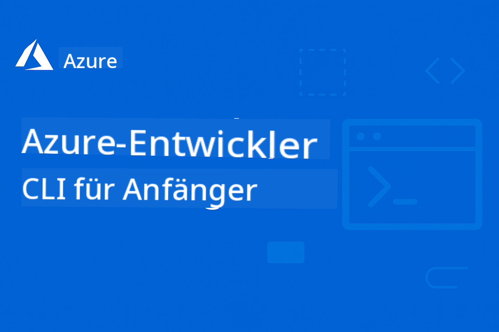

<!--
CO_OP_TRANSLATOR_METADATA:
{
  "original_hash": "9d6a833ed38e4fb2c726d3955fc8a726",
  "translation_date": "2025-12-19T10:02:59+00:00",
  "source_file": "README.md",
  "language_code": "de"
}
-->
# AZD für Einsteiger: Eine strukturierte Lernreise

 

[](https://GitHub.com/microsoft/azd-for-beginners/watchers/)
[](https://GitHub.com/microsoft/azd-for-beginners/network/)
[](https://GitHub.com/microsoft/azd-for-beginners/stargazers/)

[](https://discord.gg/microsoft-azure)
[](https://discord.gg/nTYy5BXMWG)

## Erste Schritte mit diesem Kurs

Folgen Sie diesen Schritten, um Ihre AZD-Lernreise zu beginnen:

1. **Forken Sie das Repository**: Klicken Sie auf [](https://GitHub.com/microsoft/azd-for-beginners/fork)
2. **Klonen Sie das Repository**: `git clone https://github.com/microsoft/azd-for-beginners.git`
3. **Treten Sie der Community bei**: [Azure Discord Communities](https://discord.com/invite/ByRwuEEgH4) für Expertenunterstützung
4. **Wählen Sie Ihren Lernpfad**: Wählen Sie unten ein Kapitel, das Ihrem Erfahrungslevel entspricht

### Mehrsprachige Unterstützung

#### Automatisierte Übersetzungen (immer aktuell)

<!-- CO-OP TRANSLATOR LANGUAGES TABLE START -->
[Arabisch](../ar/README.md) | [Bengalisch](../bn/README.md) | [Bulgarisch](../bg/README.md) | [Birmanisch (Myanmar)](../my/README.md) | [Chinesisch (vereinfacht)](../zh/README.md) | [Chinesisch (traditionell, Hongkong)](../hk/README.md) | [Chinesisch (traditionell, Macau)](../mo/README.md) | [Chinesisch (traditionell, Taiwan)](../tw/README.md) | [Kroatisch](../hr/README.md) | [Tschechisch](../cs/README.md) | [Dänisch](../da/README.md) | [Niederländisch](../nl/README.md) | [Estnisch](../et/README.md) | [Finnisch](../fi/README.md) | [Französisch](../fr/README.md) | [Deutsch](./README.md) | [Griechisch](../el/README.md) | [Hebräisch](../he/README.md) | [Hindi](../hi/README.md) | [Ungarisch](../hu/README.md) | [Indonesisch](../id/README.md) | [Italienisch](../it/README.md) | [Japanisch](../ja/README.md) | [Kannada](../kn/README.md) | [Koreanisch](../ko/README.md) | [Litauisch](../lt/README.md) | [Malaiisch](../ms/README.md) | [Malayalam](../ml/README.md) | [Marathi](../mr/README.md) | [Nepalesisch](../ne/README.md) | [Nigerianisches Pidgin](../pcm/README.md) | [Norwegisch](../no/README.md) | [Persisch (Farsi)](../fa/README.md) | [Polnisch](../pl/README.md) | [Portugiesisch (Brasilien)](../br/README.md) | [Portugiesisch (Portugal)](../pt/README.md) | [Punjabi (Gurmukhi)](../pa/README.md) | [Rumänisch](../ro/README.md) | [Russisch](../ru/README.md) | [Serbisch (Kyrillisch)](../sr/README.md) | [Slowakisch](../sk/README.md) | [Slowenisch](../sl/README.md) | [Spanisch](../es/README.md) | [Swahili](../sw/README.md) | [Schwedisch](../sv/README.md) | [Tagalog (Filipino)](../tl/README.md) | [Tamil](../ta/README.md) | [Telugu](../te/README.md) | [Thailändisch](../th/README.md) | [Türkisch](../tr/README.md) | [Ukrainisch](../uk/README.md) | [Urdu](../ur/README.md) | [Vietnamesisch](../vi/README.md)
<!-- CO-OP TRANSLATOR LANGUAGES TABLE END -->

## Kursübersicht

Meistern Sie die Azure Developer CLI (azd) durch strukturierte Kapitel, die für progressives Lernen konzipiert sind. **Besonderer Fokus auf die Bereitstellung von KI-Anwendungen mit Microsoft Foundry-Integration.**

### Warum dieser Kurs für moderne Entwickler unverzichtbar ist

Basierend auf Erkenntnissen der Microsoft Foundry Discord-Community möchten **45 % der Entwickler AZD für KI-Workloads nutzen**, stoßen jedoch auf Herausforderungen bei:
- Komplexen Multi-Service-KI-Architekturen
- Best Practices für die Produktion von KI-Bereitstellungen  
- Integration und Konfiguration von Azure KI-Diensten
- Kostenoptimierung für KI-Workloads
- Fehlerbehebung bei KI-spezifischen Bereitstellungsproblemen

### Lernziele

Nach Abschluss dieses strukturierten Kurses werden Sie:
- **AZD-Grundlagen beherrschen**: Kernkonzepte, Installation und Konfiguration
- **KI-Anwendungen bereitstellen**: AZD mit Microsoft Foundry-Diensten nutzen
- **Infrastructure as Code umsetzen**: Azure-Ressourcen mit Bicep-Vorlagen verwalten
- **Bereitstellungen debuggen**: Häufige Probleme lösen und Fehler beheben
- **Für die Produktion optimieren**: Sicherheit, Skalierung, Überwachung und Kostenmanagement
- **Multi-Agenten-Lösungen bauen**: Komplexe KI-Architekturen bereitstellen

## 📚 Lernkapitel

*Wählen Sie Ihren Lernpfad basierend auf Erfahrung und Zielen*

### 🚀 Kapitel 1: Grundlagen & Schnellstart
**Voraussetzungen**: Azure-Abonnement, Grundkenntnisse in der Kommandozeile  
**Dauer**: 30-45 Minuten  
**Komplexität**: ⭐

#### Was Sie lernen werden
- Verständnis der Azure Developer CLI-Grundlagen
- Installation von AZD auf Ihrer Plattform
- Ihre erste erfolgreiche Bereitstellung

#### Lernressourcen
- **🎯 Start hier**: [Was ist Azure Developer CLI?](../..)
- **📖 Theorie**: [AZD Grundlagen](docs/getting-started/azd-basics.md) – Kernkonzepte und Terminologie
- **⚙️ Einrichtung**: [Installation & Setup](docs/getting-started/installation.md) – Plattform-spezifische Anleitungen
- **🛠️ Praxis**: [Ihr erstes Projekt](docs/getting-started/first-project.md) – Schritt-für-Schritt-Tutorial
- **📋 Schnellreferenz**: [Befehlsübersicht](resources/cheat-sheet.md)

#### Praktische Übungen
```bash
# Schnelle Installationsprüfung
azd version

# Stellen Sie Ihre erste Anwendung bereit
azd init --template todo-nodejs-mongo
azd up
```

**💡 Kapitel-Ergebnis**: Erfolgreiche Bereitstellung einer einfachen Webanwendung auf Azure mit AZD

**✅ Erfolgskontrolle:**
```bash
# Nach Abschluss von Kapitel 1 sollten Sie in der Lage sein:
azd version              # Zeigt installierte Version an
azd init --template todo-nodejs-mongo  # Initialisiert Projekt
azd up                  # Stellt auf Azure bereit
azd show                # Zeigt URL der laufenden App an
# Anwendung öffnet sich im Browser und funktioniert
azd down --force --purge  # Bereinigt Ressourcen
```

**📊 Zeitaufwand:** 30-45 Minuten  
**📈 Fähigkeitsniveau danach:** Kann grundlegende Anwendungen eigenständig bereitstellen

**✅ Erfolgskontrolle:**
```bash
# Nach Abschluss von Kapitel 1 sollten Sie in der Lage sein:
azd version              # Zeigt installierte Version an
azd init --template todo-nodejs-mongo  # Initialisiert Projekt
azd up                  # Stellt auf Azure bereit
azd show                # Zeigt URL der laufenden App an
# Anwendung öffnet sich im Browser und funktioniert
azd down --force --purge  # Bereinigt Ressourcen
```

**📊 Zeitaufwand:** 30-45 Minuten  
**📈 Fähigkeitsniveau danach:** Kann grundlegende Anwendungen eigenständig bereitstellen

---

### 🤖 Kapitel 2: KI-zentrierte Entwicklung (Empfohlen für KI-Entwickler)
**Voraussetzungen**: Kapitel 1 abgeschlossen  
**Dauer**: 1-2 Stunden  
**Komplexität**: ⭐⭐

#### Was Sie lernen werden
- Microsoft Foundry-Integration mit AZD
- Bereitstellung KI-gestützter Anwendungen
- Verständnis von KI-Dienstkonfigurationen

#### Lernressourcen
- **🎯 Start hier**: [Microsoft Foundry Integration](docs/microsoft-foundry/microsoft-foundry-integration.md)
- **📖 Muster**: [KI-Modell-Bereitstellung](docs/microsoft-foundry/ai-model-deployment.md) – KI-Modelle bereitstellen und verwalten
- **🛠️ Workshop**: [KI-Workshop-Labor](docs/microsoft-foundry/ai-workshop-lab.md) – Machen Sie Ihre KI-Lösungen AZD-bereit
- **🎥 Interaktiver Leitfaden**: [Workshop-Materialien](workshop/README.md) – Browserbasiertes Lernen mit MkDocs * DevContainer-Umgebung
- **📋 Vorlagen**: [Microsoft Foundry Vorlagen](../..)
- **📝 Beispiele**: [AZD-Bereitstellungsbeispiele](examples/README.md)

#### Praktische Übungen
```bash
# Stellen Sie Ihre erste KI-Anwendung bereit
azd init --template azure-search-openai-demo
azd up

# Probieren Sie weitere KI-Vorlagen aus
azd init --template openai-chat-app-quickstart
azd init --template agent-openai-python-prompty
```

**💡 Kapitel-Ergebnis**: Bereitstellung und Konfiguration einer KI-gestützten Chat-Anwendung mit RAG-Funktionalität

**✅ Erfolgskontrolle:**
```bash
# Nach Kapitel 2 sollten Sie in der Lage sein:
azd init --template azure-search-openai-demo
azd up
# Die KI-Chat-Schnittstelle zu testen
# Fragen zu stellen und KI-gestützte Antworten mit Quellen zu erhalten
# Zu überprüfen, ob die Suchintegration funktioniert
azd monitor  # Zu prüfen, ob Application Insights Telemetriedaten anzeigt
azd down --force --purge
```

**📊 Zeitaufwand:** 1-2 Stunden  
**📈 Fähigkeitsniveau danach:** Kann produktionsreife KI-Anwendungen bereitstellen und konfigurieren  
**💰 Kostenbewusstsein:** Verstehen von $80-150/Monat Entwicklungskosten, $300-3500/Monat Produktionskosten

#### 💰 Kostenüberlegungen für KI-Bereitstellungen

**Entwicklungsumgebung (geschätzt $80-150/Monat):**
- Azure OpenAI (Pay-as-you-go): $0-50/Monat (abhängig von Token-Nutzung)
- KI-Suche (Basisstufe): $75/Monat
- Container Apps (Consumption): $0-20/Monat
- Speicher (Standard): $1-5/Monat

**Produktionsumgebung (geschätzt $300-3.500+/Monat):**
- Azure OpenAI (PTU für konsistente Leistung): $3.000+/Monat ODER Pay-as-you-go mit hohem Volumen
- KI-Suche (Standardstufe): $250/Monat
- Container Apps (Dediziert): $50-100/Monat
- Application Insights: $5-50/Monat
- Speicher (Premium): $10-50/Monat

**💡 Tipps zur Kostenoptimierung:**
- Nutzen Sie die **kostenlose Stufe** von Azure OpenAI zum Lernen (50.000 Tokens/Monat inklusive)
- Führen Sie `azd down` aus, um Ressourcen bei Nichtentwicklung freizugeben
- Beginnen Sie mit verbrauchsabhängiger Abrechnung, PTU nur für Produktion upgraden
- Verwenden Sie `azd provision --preview`, um Kosten vor der Bereitstellung zu schätzen
- Aktivieren Sie Auto-Skalierung: zahlen Sie nur für tatsächliche Nutzung

**Kostenüberwachung:**
```bash
# Geschätzte monatliche Kosten überprüfen
azd provision --preview

# Tatsächliche Kosten im Azure-Portal überwachen
az consumption budget list --resource-group <your-rg>
```

---

### ⚙️ Kapitel 3: Konfiguration & Authentifizierung
**Voraussetzungen**: Kapitel 1 abgeschlossen  
**Dauer**: 45-60 Minuten  
**Komplexität**: ⭐⭐

#### Was Sie lernen werden
- Konfiguration und Verwaltung von Umgebungen
- Authentifizierungs- und Sicherheitsbest Practices
- Benennung und Organisation von Ressourcen

#### Lernressourcen
- **📖 Konfiguration**: [Konfigurationsanleitung](docs/getting-started/configuration.md) – Einrichtung der Umgebung
- **🔐 Sicherheit**: [Authentifizierungsmuster und Managed Identity](docs/getting-started/authsecurity.md) – Authentifizierungsmuster
- **📝 Beispiele**: [Datenbank-App-Beispiel](examples/database-app/README.md) – AZD-Datenbankbeispiele

#### Praktische Übungen
- Konfigurieren mehrerer Umgebungen (dev, staging, prod)
- Einrichten von Managed Identity-Authentifizierung
- Implementieren umgebungsspezifischer Konfigurationen

**💡 Kapitel-Ergebnis**: Verwaltung mehrerer Umgebungen mit korrekter Authentifizierung und Sicherheit

---

### 🏗️ Kapitel 4: Infrastructure as Code & Bereitstellung
**Voraussetzungen**: Kapitel 1-3 abgeschlossen  
**Dauer**: 1-1,5 Stunden  
**Komplexität**: ⭐⭐⭐

#### Was Sie lernen werden
- Fortgeschrittene Bereitstellungsmuster
- Infrastructure as Code mit Bicep
- Strategien zur Ressourcenbereitstellung

#### Lernressourcen
- **📖 Bereitstellung**: [Bereitstellungsanleitung](docs/deployment/deployment-guide.md) – Komplette Workflows
- **🏗️ Provisionierung**: [Ressourcen bereitstellen](docs/deployment/provisioning.md) – Azure-Ressourcenverwaltung
- **📝 Beispiele**: [Container-App-Beispiel](../../examples/container-app) – Containerisierte Bereitstellungen

#### Praktische Übungen
- Eigene Bicep-Vorlagen erstellen
- Multi-Service-Anwendungen bereitstellen
- Blue-Green-Bereitstellungsstrategien implementieren

**💡 Kapitel-Ergebnis**: Komplexe Multi-Service-Anwendungen mit benutzerdefinierten Infrastrukturvorlagen bereitstellen

---

### 🎯 Kapitel 5: Multi-Agenten-KI-Lösungen (Fortgeschritten)
**Voraussetzungen**: Kapitel 1-2 abgeschlossen  
**Dauer**: 2-3 Stunden  
**Komplexität**: ⭐⭐⭐⭐

#### Was Sie lernen werden
- Multi-Agenten-Architektur-Muster
- Agenten-Orchestrierung und Koordination
- Produktionsreife KI-Bereitstellungen

#### Lernressourcen
- **🤖 Featured Projekt**: [Retail Multi-Agent Lösung](examples/retail-scenario.md) – Komplette Implementierung
- **🛠️ ARM-Vorlagen**: [ARM Template Package](../../examples/retail-multiagent-arm-template) - Ein-Klick-Bereitstellung
- **📖 Architektur**: [Multi-Agenten-Koordinationsmuster](/docs/pre-deployment/coordination-patterns.md) - Muster

#### Praktische Übungen
```bash
# Implementieren Sie die vollständige Multi-Agenten-Lösung für den Einzelhandel
cd examples/retail-multiagent-arm-template
./deploy.sh

# Erkunden Sie Agentenkonfigurationen
az deployment group show --resource-group <rg-name> --name <deployment-name>
```

**💡 Kapitel-Ergebnis**: Bereitstellung und Verwaltung einer produktionsreifen Multi-Agent-KI-Lösung mit Kunden- und Inventaragenten

---

### 🔍 Kapitel 6: Validierung & Planung vor der Bereitstellung
**Voraussetzungen**: Kapitel 4 abgeschlossen  
**Dauer**: 1 Stunde  
**Komplexität**: ⭐⭐

#### Was Sie lernen werden
- Kapazitätsplanung und Ressourcenvalidierung
- Strategien zur SKU-Auswahl
- Pre-Flight-Checks und Automatisierung

#### Lernressourcen
- **📊 Planung**: [Kapazitätsplanung](docs/pre-deployment/capacity-planning.md) - Ressourcenvalidierung
- **💰 Auswahl**: [SKU-Auswahl](docs/pre-deployment/sku-selection.md) - Kostenoptimierte Entscheidungen
- **✅ Validierung**: [Pre-Flight-Checks](docs/pre-deployment/preflight-checks.md) - Automatisierte Skripte

#### Praktische Übungen
- Ausführen von Kapazitätsvalidierungsskripten
- Optimierung der SKU-Auswahl für Kosten
- Implementierung automatisierter Pre-Deployment-Checks

**💡 Kapitel-Ergebnis**: Validieren und optimieren Sie Bereitstellungen vor der Ausführung

---

### 🚨 Kapitel 7: Fehlerbehebung & Debugging
**Voraussetzungen**: Beliebiges Bereitstellungskapitel abgeschlossen  
**Dauer**: 1-1,5 Stunden  
**Komplexität**: ⭐⭐

#### Was Sie lernen werden
- Systematische Debugging-Ansätze
- Häufige Probleme und Lösungen
- KI-spezifische Fehlerbehebung

#### Lernressourcen
- **🔧 Häufige Probleme**: [Häufige Probleme](docs/troubleshooting/common-issues.md) - FAQ und Lösungen
- **🕵️ Debugging**: [Debugging-Anleitung](docs/troubleshooting/debugging.md) - Schritt-für-Schritt-Strategien
- **🤖 KI-Probleme**: [KI-spezifische Fehlerbehebung](docs/troubleshooting/ai-troubleshooting.md) - Probleme mit KI-Diensten

#### Praktische Übungen
- Diagnose von Bereitstellungsfehlern
- Behebung von Authentifizierungsproblemen
- Debugging der KI-Dienst-Konnektivität

**💡 Kapitel-Ergebnis**: Diagnostizieren und beheben Sie häufige Bereitstellungsprobleme eigenständig

---

### 🏢 Kapitel 8: Produktions- & Unternehmensmuster
**Voraussetzungen**: Kapitel 1-4 abgeschlossen  
**Dauer**: 2-3 Stunden  
**Komplexität**: ⭐⭐⭐⭐

#### Was Sie lernen werden
- Strategien für Produktionsbereitstellungen
- Sicherheitsmuster für Unternehmen
- Überwachung und Kostenoptimierung

#### Lernressourcen
- **🏭 Produktion**: [Best Practices für Produktions-KI](docs/microsoft-foundry/production-ai-practices.md) - Unternehmensmuster
- **📝 Beispiele**: [Microservices-Beispiel](../../examples/microservices) - Komplexe Architekturen
- **📊 Überwachung**: [Application Insights Integration](docs/pre-deployment/application-insights.md) - Monitoring

#### Praktische Übungen
- Implementierung von Sicherheitsmustern für Unternehmen
- Einrichtung umfassender Überwachung
- Produktionsbereitstellung mit ordnungsgemäßer Governance

**💡 Kapitel-Ergebnis**: Bereitstellung unternehmensreifer Anwendungen mit vollständigen Produktionsfunktionen

---

## 🎓 Workshop-Übersicht: Praxisorientiertes Lernerlebnis

> **⚠️ WORKSHOP-STATUS: Aktive Entwicklung**  
> Die Workshop-Materialien werden derzeit entwickelt und verfeinert. Kernmodule sind funktionsfähig, einige fortgeschrittene Abschnitte sind noch unvollständig. Wir arbeiten aktiv daran, alle Inhalte abzuschließen. [Fortschritt verfolgen →](workshop/README.md)

### Interaktive Workshop-Materialien
**Umfassendes praxisorientiertes Lernen mit browserbasierten Tools und geführten Übungen**

Unsere Workshop-Materialien bieten ein strukturiertes, interaktives Lernerlebnis, das das obenstehende kapitelbasierte Curriculum ergänzt. Der Workshop ist sowohl für selbstgesteuertes Lernen als auch für von Lehrkräften geführte Sitzungen konzipiert.

#### 🛠️ Workshop-Funktionen
- **Browserbasierte Oberfläche**: Vollständiger MkDocs-basierter Workshop mit Suche, Kopier- und Designfunktionen
- **GitHub Codespaces Integration**: Ein-Klick-Entwicklungsumgebung
- **Strukturierter Lernpfad**: 7-stufige geführte Übungen (insgesamt 3,5 Stunden)
- **Discovery → Deployment → Customization**: Fortschreitende Methodik
- **Interaktive DevContainer-Umgebung**: Vorgefertigte Tools und Abhängigkeiten

#### 📚 Workshop-Struktur
Der Workshop folgt der Methodik **Discovery → Deployment → Customization**:

1. **Discovery-Phase** (45 Minuten)
   - Erkundung von Microsoft Foundry-Vorlagen und -Diensten
   - Verständnis von Multi-Agenten-Architekturmustern
   - Überprüfung von Bereitstellungsanforderungen und Voraussetzungen

2. **Deployment-Phase** (2 Stunden)
   - Praktische Bereitstellung von KI-Anwendungen mit AZD
   - Konfiguration von Azure KI-Diensten und Endpunkten
   - Implementierung von Sicherheits- und Authentifizierungsmustern

3. **Customization-Phase** (45 Minuten)
   - Anpassung von Anwendungen für spezifische Anwendungsfälle
   - Optimierung für Produktionsbereitstellung
   - Implementierung von Überwachung und Kostenmanagement

#### 🚀 Einstieg in den Workshop
```bash
# Option 1: GitHub Codespaces (Empfohlen)
# Klicken Sie im Repository auf "Code" → "Codespace auf main erstellen"

# Option 2: Lokale Entwicklung
git clone https://github.com/microsoft/azd-for-beginners.git
cd azd-for-beginners/workshop
# Folgen Sie den Einrichtungshinweisen in workshop/README.md
```

#### 🎯 Workshop-Lernergebnisse
Nach Abschluss des Workshops werden die Teilnehmer:
- **Produktionsreife KI-Anwendungen bereitstellen**: Nutzung von AZD mit Microsoft Foundry-Diensten
- **Multi-Agenten-Architekturen beherrschen**: Implementierung koordinierter KI-Agentenlösungen
- **Sicherheits-Best-Practices umsetzen**: Konfiguration von Authentifizierung und Zugriffskontrolle
- **Für Skalierung optimieren**: Gestaltung kosteneffizienter, leistungsfähiger Bereitstellungen
- **Bereitstellungen debuggen**: Eigenständige Lösung häufiger Probleme

#### 📖 Workshop-Ressourcen
- **🎥 Interaktiver Leitfaden**: [Workshop-Materialien](workshop/README.md) - Browserbasiertes Lernumfeld
- **📋 Schritt-für-Schritt-Anleitungen**: [Geführte Übungen](../../workshop/docs/instructions) - Detaillierte Durchgänge
- **🛠️ KI-Workshop-Labor**: [AI Workshop Lab](docs/microsoft-foundry/ai-workshop-lab.md) - KI-fokussierte Übungen
- **💡 Schnellstart**: [Workshop-Setup-Anleitung](workshop/README.md#quick-start) - Umgebungskonfiguration

**Ideal für**: Unternehmensschulungen, Universitätskurse, selbstgesteuertes Lernen und Entwickler-Bootcamps.

---

## 📖 Was ist Azure Developer CLI?

Azure Developer CLI (azd) ist eine entwicklerzentrierte Befehlszeilenschnittstelle, die den Prozess des Erstellens und Bereitstellens von Anwendungen in Azure beschleunigt. Sie bietet:

- **Vorlagenbasierte Bereitstellungen** – Verwendung vorgefertigter Vorlagen für gängige Anwendungsmuster
- **Infrastructure as Code** – Verwaltung von Azure-Ressourcen mit Bicep oder Terraform  
- **Integrierte Workflows** – Nahtlose Bereitstellung, Überwachung und Verwaltung von Anwendungen
- **Entwicklerfreundlich** – Optimiert für Produktivität und Benutzererfahrung von Entwicklern

### **AZD + Microsoft Foundry: Perfekt für KI-Bereitstellungen**

**Warum AZD für KI-Lösungen?** AZD adressiert die wichtigsten Herausforderungen, denen KI-Entwickler gegenüberstehen:

- **KI-fertige Vorlagen** – Vorgefertigte Vorlagen für Azure OpenAI, Cognitive Services und ML-Workloads
- **Sichere KI-Bereitstellungen** – Eingebaute Sicherheitsmuster für KI-Dienste, API-Schlüssel und Modellendpunkte  
- **Produktions-KI-Muster** – Best Practices für skalierbare, kosteneffiziente KI-Anwendungsbereitstellungen
- **End-to-End-KI-Workflows** – Vom Modellentwicklung bis zur Produktionsbereitstellung mit ordnungsgemäßem Monitoring
- **Kostenoptimierung** – Intelligente Ressourcenallokation und Skalierungsstrategien für KI-Workloads
- **Microsoft Foundry Integration** – Nahtlose Verbindung zum Microsoft Foundry Modellkatalog und Endpunkten

---

## 🎯 Vorlagen- & Beispielbibliothek

### Empfohlen: Microsoft Foundry Vorlagen
**Starten Sie hier, wenn Sie KI-Anwendungen bereitstellen!**

> **Hinweis:** Diese Vorlagen demonstrieren verschiedene KI-Muster. Einige sind externe Azure Samples, andere lokale Implementierungen.

| Vorlage | Kapitel | Komplexität | Dienste | Typ |
|----------|---------|------------|----------|------|
| [**Erste Schritte mit AI Chat**](https://github.com/Azure-Samples/get-started-with-ai-chat) | Kapitel 2 | ⭐⭐ | AzureOpenAI + Azure AI Model Inference API + Azure AI Search + Azure Container Apps + Application Insights | Extern |
| [**Erste Schritte mit AI Agents**](https://github.com/Azure-Samples/get-started-with-ai-agents) | Kapitel 2 | ⭐⭐ | Azure AI Agent Service + AzureOpenAI + Azure AI Search + Azure Container Apps + Application Insights| Extern |
| [**Azure Search + OpenAI Demo**](https://github.com/Azure-Samples/azure-search-openai-demo) | Kapitel 2 | ⭐⭐ | AzureOpenAI + Azure AI Search + App Service + Storage | Extern |
| [**OpenAI Chat App Quickstart**](https://github.com/Azure-Samples/openai-chat-app-quickstart) | Kapitel 2 | ⭐ | AzureOpenAI + Container Apps + Application Insights | Extern |
| [**Agent OpenAI Python Prompty**](https://github.com/Azure-Samples/agent-openai-python-prompty) | Kapitel 5 | ⭐⭐⭐ | AzureOpenAI + Azure Functions + Prompty | Extern |
| [**Contoso Chat RAG**](https://github.com/Azure-Samples/contoso-chat) | Kapitel 8 | ⭐⭐⭐⭐ | AzureOpenAI + AI Search + Cosmos DB + Container Apps | Extern |
| [**Retail Multi-Agent Solution**](examples/retail-scenario.md) | Kapitel 5 | ⭐⭐⭐⭐ | AzureOpenAI + AI Search + Storage + Container Apps + Cosmos DB | **Lokal** |

### Empfohlen: Komplette Lernszenarien
**Produktionsreife Anwendungsvorlagen, zugeordnet zu Lernkapiteln**

| Vorlage | Lernkapitel | Komplexität | Wichtigste Lerninhalte |
|----------|------------------|------------|--------------|
| [**openai-chat-app-quickstart**](https://github.com/Azure-Samples/openai-chat-app-quickstart) | Kapitel 2 | ⭐ | Grundlegende KI-Bereitstellungsmuster |
| [**azure-search-openai-demo**](https://github.com/Azure-Samples/azure-search-openai-demo) | Kapitel 2 | ⭐⭐ | RAG-Implementierung mit Azure AI Search |
| [**ai-document-processing**](https://github.com/Azure-Samples/ai-document-processing) | Kapitel 4 | ⭐⭐ | Integration von Dokumentenintelligenz |
| [**agent-openai-python-prompty**](https://github.com/Azure-Samples/agent-openai-python-prompty) | Kapitel 5 | ⭐⭐⭐ | Agenten-Framework und Funktionsaufrufe |
| [**contoso-chat**](https://github.com/Azure-Samples/contoso-chat) | Kapitel 8 | ⭐⭐⭐ | Unternehmens-KI-Orchestrierung |
| [**retail-multi-agent-solution**](examples/retail-scenario.md) | Kapitel 5 | ⭐⭐⭐⭐ | Multi-Agenten-Architektur mit Kunden- und Inventaragenten |

### Lernen nach Beispieltyp

> **📌 Lokale vs. Externe Beispiele:**  
> **Lokale Beispiele** (in diesem Repo) = Sofort einsatzbereit  
> **Externe Beispiele** (Azure Samples) = Klonen aus verlinkten Repositories

#### Lokale Beispiele (Sofort einsatzbereit)
- [**Retail Multi-Agent Solution**](examples/retail-scenario.md) - Vollständige produktionsreife Implementierung mit ARM-Vorlagen
  - Multi-Agenten-Architektur (Kunden- + Inventaragenten)
  - Umfassendes Monitoring und Auswertung
  - Ein-Klick-Bereitstellung via ARM-Vorlage

#### Lokale Beispiele - Container-Anwendungen (Kapitel 2-5)
**Umfassende Container-Bereitstellungsbeispiele in diesem Repository:**
- [**Container App Beispiele**](examples/container-app/README.md) - Vollständige Anleitung zu containerisierten Bereitstellungen
  - [Einfache Flask-API](../../examples/container-app/simple-flask-api) - Basis-REST-API mit Scale-to-Zero
  - [Microservices-Architektur](../../examples/container-app/microservices) - Produktionsreife Multi-Service-Bereitstellung
  - Schnellstart-, Produktions- und erweiterte Bereitstellungsmuster
  - Anleitung zu Monitoring, Sicherheit und Kostenoptimierung

#### Externe Beispiele - Einfache Anwendungen (Kapitel 1-2)
**Klonen Sie diese Azure Samples Repositories, um zu starten:**
- [Einfache Web-App - Node.js + MongoDB](https://github.com/Azure-Samples/todo-nodejs-mongo) - Grundlegende Bereitstellungsmuster
- [Statische Website - React SPA](https://github.com/Azure-Samples/todo-csharp-sql-swa-func) - Statische Inhaltsbereitstellung
- [Container App - Python Flask](https://github.com/Azure-Samples/container-apps-store-api-microservice) - REST-API-Bereitstellung

#### Externe Beispiele - Datenbankintegration (Kapitel 3-4)  
- [Datenbank-App - C# + SQL](https://github.com/Azure-Samples/todo-csharp-sql) - Datenbank-Konnektivitätsmuster
- [Functions + Cosmos DB](https://github.com/Azure-Samples/todo-python-mongo-swa-func) - Serverless-Datenworkflow

#### Externe Beispiele - Fortgeschrittene Muster (Kapitel 4-8)
- [Java Microservices](https://github.com/Azure-Samples/java-microservices-aca-lab) - Multi-Service-Architekturen
- [Container Apps Jobs](https://github.com/Azure-Samples/container-apps-jobs) - Hintergrundverarbeitung  
- [Enterprise ML Pipeline](https://github.com/Azure-Samples/mlops-v2) - Produktionsreife ML-Muster

### Externe Vorlagensammlungen
- [**Offizielle AZD Template Gallery**](https://azure.github.io/awesome-azd/) - Kuratierte Sammlung offizieller und Community-Vorlagen
- [**Azure Developer CLI Templates**](https://learn.microsoft.com/en-us/azure/developer/azure-developer-cli/azd-templates) - Microsoft Learn Vorlagendokumentation
- [**Examples Directory**](examples/README.md) - Lokale Lernbeispiele mit detaillierten Erklärungen

---

## 📚 Lernressourcen & Referenzen

### Schnellreferenzen
- [**Befehlsübersicht**](resources/cheat-sheet.md) - Wichtige azd-Befehle nach Kapiteln geordnet  
- [**Glossar**](resources/glossary.md) - Azure- und azd-Terminologie  
- [**FAQ**](resources/faq.md) - Häufige Fragen nach Lernkapiteln geordnet  
- [**Studienführer**](resources/study-guide.md) - Umfassende Übungsaufgaben  

### Praktische Workshops
- [**KI-Workshop-Labor**](docs/microsoft-foundry/ai-workshop-lab.md) - Machen Sie Ihre KI-Lösungen AZD-bereit (2-3 Stunden)  
- [**Interaktiver Workshop-Leitfaden**](workshop/README.md) - Browserbasierter Workshop mit MkDocs und DevContainer-Umgebung  
- [**Strukturierter Lernpfad**](../../workshop/docs/instructions) - 7-stufige geführte Übungen (Entdeckung → Bereitstellung → Anpassung)  
- [**AZD für Anfänger Workshop**](workshop/README.md) - Vollständige praktische Workshop-Materialien mit GitHub Codespaces-Integration  

### Externe Lernressourcen
- [Azure Developer CLI Dokumentation](https://learn.microsoft.com/en-us/azure/developer/azure-developer-cli/)  
- [Azure Architekturzentrum](https://learn.microsoft.com/en-us/azure/architecture/)  
- [Azure Preisrechner](https://azure.microsoft.com/pricing/calculator/)  
- [Azure Status](https://status.azure.com/)  

---

## 🔧 Schnelle Fehlerbehebung

**Häufige Probleme bei Anfängern und sofortige Lösungen:**

### ❌ "azd: Befehl nicht gefunden"

```bash
# Installieren Sie zuerst AZD
# Windows (PowerShell):
winget install microsoft.azd

# macOS:
brew tap azure/azd && brew install azd

# Linux:
curl -fsSL https://aka.ms/install-azd.sh | bash

# Installation überprüfen
azd version
```
  
### ❌ "Kein Abonnement gefunden" oder "Abonnement nicht gesetzt"

```bash
# Verfügbare Abonnements auflisten
az account list --output table

# Standardabonnement festlegen
az account set --subscription "<subscription-id-or-name>"

# Für AZD-Umgebung festlegen
azd env set AZURE_SUBSCRIPTION_ID "<subscription-id>"

# Überprüfen
az account show
```
  
### ❌ "Unzureichendes Kontingent" oder "Kontingent überschritten"

```bash
# Versuchen Sie eine andere Azure-Region
azd env set AZURE_LOCATION "westus2"
azd up

# Oder verwenden Sie kleinere SKUs in der Entwicklung
# Bearbeiten Sie infra/main.parameters.json:
{
  "sku": "B1"  // Instead of "P1V2"
}
```
  
### ❌ "azd up" schlägt mitten im Prozess fehl

```bash
# Option 1: Bereinigen und erneut versuchen
azd down --force --purge
azd up

# Option 2: Nur Infrastruktur reparieren
azd provision

# Option 3: Detaillierte Protokolle überprüfen
azd show
azd logs
```
  
### ❌ "Authentifizierung fehlgeschlagen" oder "Token abgelaufen"

```bash
# Erneut authentifizieren
az logout
az login

azd auth logout
azd auth login

# Authentifizierung überprüfen
az account show
```
  
### ❌ "Ressource existiert bereits" oder Namenskonflikte

```bash
# AZD generiert eindeutige Namen, aber bei Konflikten:
azd down --force --purge

# Dann erneut mit frischer Umgebung versuchen
azd env new dev-v2
azd up
```
  
### ❌ Vorlage-Bereitstellung dauert zu lange

**Normale Wartezeiten:**  
- Einfache Webanwendung: 5-10 Minuten  
- Anwendung mit Datenbank: 10-15 Minuten  
- KI-Anwendungen: 15-25 Minuten (OpenAI-Bereitstellung ist langsam)  

```bash
# Fortschritt überprüfen
azd show

# Wenn länger als 30 Minuten festgefahren, Azure-Portal überprüfen:
azd monitor
# Nach fehlgeschlagenen Bereitstellungen suchen
```
  
### ❌ "Zugriff verweigert" oder "Verboten"

```bash
# Überprüfen Sie Ihre Azure-Rolle
az role assignment list --assignee $(az account show --query user.name -o tsv)

# Sie benötigen mindestens die Rolle "Mitwirkender"
# Bitten Sie Ihren Azure-Administrator, zu gewähren:
# - Mitwirkender (für Ressourcen)
# - Benutzerzugriffsadministrator (für Rollenzuweisungen)
```
  
### ❌ Bereitgestellte Anwendungs-URL nicht gefunden

```bash
# Alle Service-Endpunkte anzeigen
azd show

# Oder Azure-Portal öffnen
azd monitor

# Spezifischen Service überprüfen
azd env get-values
# Nach *_URL-Variablen suchen
```
  
### 📚 Vollständige Fehlerbehebungsressourcen

- **Leitfaden zu häufigen Problemen:** [Detaillierte Lösungen](docs/troubleshooting/common-issues.md)  
- **KI-spezifische Probleme:** [KI-Fehlerbehebung](docs/troubleshooting/ai-troubleshooting.md)  
- **Debugging-Leitfaden:** [Schritt-für-Schritt-Debugging](docs/troubleshooting/debugging.md)  
- **Hilfe erhalten:** [Azure Discord](https://discord.gg/microsoft-azure) #azure-developer-cli  

---

## 🔧 Schnelle Fehlerbehebung

**Häufige Probleme bei Anfängern und sofortige Lösungen:**

<details>
<summary><strong>❌ "azd: Befehl nicht gefunden"</strong></summary>

```bash
# Installieren Sie zuerst AZD
# Windows (PowerShell):
winget install microsoft.azd

# macOS:
brew tap azure/azd && brew install azd

# Linux:
curl -fsSL https://aka.ms/install-azd.sh | bash

# Installation überprüfen
azd version
```
</details>

<details>
<summary><strong>❌ "Kein Abonnement gefunden" oder "Abonnement nicht gesetzt"</strong></summary>

```bash
# Verfügbare Abonnements auflisten
az account list --output table

# Standardabonnement festlegen
az account set --subscription "<subscription-id-or-name>"

# Für AZD-Umgebung festlegen
azd env set AZURE_SUBSCRIPTION_ID "<subscription-id>"

# Überprüfen
az account show
```
</details>

<details>
<summary><strong>❌ "Unzureichendes Kontingent" oder "Kontingent überschritten"</strong></summary>

```bash
# Versuchen Sie eine andere Azure-Region
azd env set AZURE_LOCATION "westus2"
azd up

# Oder verwenden Sie kleinere SKUs in der Entwicklung
# Bearbeiten Sie infra/main.parameters.json:
{
  "sku": "B1"  // Instead of "P1V2"
}
```
</details>

<details>
<summary><strong>❌ "azd up" schlägt mitten im Prozess fehl</strong></summary>

```bash
# Option 1: Bereinigen und erneut versuchen
azd down --force --purge
azd up

# Option 2: Nur Infrastruktur reparieren
azd provision

# Option 3: Detaillierte Protokolle überprüfen
azd show
azd logs
```
</details>

<details>
<summary><strong>❌ "Authentifizierung fehlgeschlagen" oder "Token abgelaufen"</strong></summary>

```bash
# Erneut authentifizieren
az logout
az login

azd auth logout
azd auth login

# Authentifizierung überprüfen
az account show
```
</details>

<details>
<summary><strong>❌ "Ressource existiert bereits" oder Namenskonflikte</strong></summary>

```bash
# AZD generiert eindeutige Namen, aber bei Konflikt:
azd down --force --purge

# Dann erneut mit frischer Umgebung versuchen
azd env new dev-v2
azd up
```
</details>

<details>
<summary><strong>❌ Vorlage-Bereitstellung dauert zu lange</strong></summary>

**Normale Wartezeiten:**  
- Einfache Webanwendung: 5-10 Minuten  
- Anwendung mit Datenbank: 10-15 Minuten  
- KI-Anwendungen: 15-25 Minuten (OpenAI-Bereitstellung ist langsam)  

```bash
# Fortschritt überprüfen
azd show

# Wenn länger als 30 Minuten festgefahren, Azure-Portal überprüfen:
azd monitor
# Nach fehlgeschlagenen Bereitstellungen suchen
```
</details>

<details>
<summary><strong>❌ "Zugriff verweigert" oder "Verboten"</strong></summary>

```bash
# Überprüfen Sie Ihre Azure-Rolle
az role assignment list --assignee $(az account show --query user.name -o tsv)

# Sie benötigen mindestens die Rolle "Mitwirkender"
# Bitten Sie Ihren Azure-Administrator, zu gewähren:
# - Mitwirkender (für Ressourcen)
# - Benutzerzugriffsadministrator (für Rollenzuweisungen)
```
</details>

<details>
<summary><strong>❌ Bereitgestellte Anwendungs-URL nicht gefunden</strong></summary>

```bash
# Alle Service-Endpunkte anzeigen
azd show

# Oder Azure-Portal öffnen
azd monitor

# Spezifischen Dienst überprüfen
azd env get-values
# Nach *_URL-Variablen suchen
```
</details>

### 📚 Vollständige Fehlerbehebungsressourcen

- **Leitfaden zu häufigen Problemen:** [Detaillierte Lösungen](docs/troubleshooting/common-issues.md)  
- **KI-spezifische Probleme:** [KI-Fehlerbehebung](docs/troubleshooting/ai-troubleshooting.md)  
- **Debugging-Leitfaden:** [Schritt-für-Schritt-Debugging](docs/troubleshooting/debugging.md)  
- **Hilfe erhalten:** [Azure Discord](https://discord.gg/microsoft-azure) #azure-developer-cli  

---

## 🎓 Kursabschluss & Zertifizierung

### Fortschrittsverfolgung  
Verfolgen Sie Ihren Lernfortschritt in jedem Kapitel:

- [ ] **Kapitel 1**: Grundlagen & Schnellstart ✅  
- [ ] **Kapitel 2**: KI-zentrierte Entwicklung ✅  
- [ ] **Kapitel 3**: Konfiguration & Authentifizierung ✅  
- [ ] **Kapitel 4**: Infrastruktur als Code & Bereitstellung ✅  
- [ ] **Kapitel 5**: Multi-Agent-KI-Lösungen ✅  
- [ ] **Kapitel 6**: Vorbereitende Validierung & Planung ✅  
- [ ] **Kapitel 7**: Fehlerbehebung & Debugging ✅  
- [ ] **Kapitel 8**: Produktion & Enterprise-Muster ✅  

### Lernüberprüfung  
Nach Abschluss jedes Kapitels überprüfen Sie Ihr Wissen durch:  
1. **Praktische Übung**: Führen Sie die praktische Bereitstellung des Kapitels durch  
2. **Wissenscheck**: Überprüfen Sie den FAQ-Bereich Ihres Kapitels  
3. **Community-Diskussion**: Teilen Sie Ihre Erfahrungen im Azure Discord  
4. **Nächstes Kapitel**: Wechseln Sie zum nächsten Komplexitätsgrad  

### Vorteile des Kursabschlusses  
Nach Abschluss aller Kapitel haben Sie:  
- **Produktionserfahrung**: Echte KI-Anwendungen in Azure bereitgestellt  
- **Professionelle Fähigkeiten**: Enterprise-fähige Bereitstellungsfähigkeiten  
- **Community-Anerkennung**: Aktives Mitglied der Azure-Entwickler-Community  
- **Karriereförderung**: Gefragte AZD- und KI-Bereitstellungskompetenz  

---

## 🤝 Community & Support

### Hilfe & Support erhalten  
- **Technische Probleme:** [Fehler melden und Funktionen anfragen](https://github.com/microsoft/azd-for-beginners/issues)  
- **Lernfragen:** [Microsoft Azure Discord Community](https://discord.gg/microsoft-azure) und [](https://discord.gg/nTYy5BXMWG)  
- **KI-spezifische Hilfe:** Treten Sie dem [](https://discord.gg/nTYy5BXMWG) bei  
- **Dokumentation:** [Offizielle Azure Developer CLI Dokumentation](https://learn.microsoft.com/en-us/azure/developer/azure-developer-cli/)  

### Community-Einblicke vom Microsoft Foundry Discord

**Aktuelle Umfrageergebnisse aus dem #Azure-Kanal:**  
- **45 %** der Entwickler möchten AZD für KI-Workloads nutzen  
- **Top-Herausforderungen:** Multi-Service-Bereitstellungen, Anmeldeinformationen-Verwaltung, Produktionsreife  
- **Meistgewünscht:** KI-spezifische Vorlagen, Fehlerbehebungsleitfäden, Best Practices  

**Treten Sie unserer Community bei, um:**  
- Ihre AZD + KI-Erfahrungen zu teilen und Hilfe zu erhalten  
- Frühe Vorschauen neuer KI-Vorlagen zu erhalten  
- Zu Best Practices für KI-Bereitstellungen beizutragen  
- Die zukünftige Entwicklung von KI + AZD-Funktionen zu beeinflussen  

### Beitrag zum Kurs  
Beiträge sind willkommen! Bitte lesen Sie unseren [Beitragsleitfaden](CONTRIBUTING.md) für Details zu:  
- **Inhaltsverbesserungen:** Bestehende Kapitel und Beispiele verbessern  
- **Neue Beispiele:** Realistische Szenarien und Vorlagen hinzufügen  
- **Übersetzung:** Unterstützung bei der Pflege der Mehrsprachigkeit  
- **Fehlerberichte:** Genauigkeit und Klarheit verbessern  
- **Community-Standards:** Unsere inklusiven Community-Richtlinien befolgen  

---

## 📄 Kursinformationen

### Lizenz  
Dieses Projekt ist unter der MIT-Lizenz lizenziert – siehe die [LICENSE](../../LICENSE)-Datei für Details.  

### Verwandte Microsoft-Lernressourcen

Unser Team erstellt weitere umfassende Lernkurse:

<!-- CO-OP TRANSLATOR OTHER COURSES START -->
### LangChain  
[](https://aka.ms/langchain4j-for-beginners)  
[](https://aka.ms/langchainjs-for-beginners?WT.mc_id=m365-94501-dwahlin)  

---

### Azure / Edge / MCP / Agents  
[](https://github.com/microsoft/AZD-for-beginners?WT.mc_id=academic-105485-koreyst)  
[](https://github.com/microsoft/edgeai-for-beginners?WT.mc_id=academic-105485-koreyst)  
[](https://github.com/microsoft/mcp-for-beginners?WT.mc_id=academic-105485-koreyst)  
[](https://github.com/microsoft/ai-agents-for-beginners?WT.mc_id=academic-105485-koreyst)  

---

### Generative KI-Serie  
[](https://github.com/microsoft/generative-ai-for-beginners?WT.mc_id=academic-105485-koreyst)  
[-9333EA?style=for-the-badge&labelColor=E5E7EB&color=9333EA)](https://github.com/microsoft/Generative-AI-for-beginners-dotnet?WT.mc_id=academic-105485-koreyst)  
[-C084FC?style=for-the-badge&labelColor=E5E7EB&color=C084FC)](https://github.com/microsoft/generative-ai-for-beginners-java?WT.mc_id=academic-105485-koreyst)  
[-E879F9?style=for-the-badge&labelColor=E5E7EB&color=E879F9)](https://github.com/microsoft/generative-ai-with-javascript?WT.mc_id=academic-105485-koreyst)  

---

### Kernlernen  
[](https://aka.ms/ml-beginners?WT.mc_id=academic-105485-koreyst)  
[](https://aka.ms/datascience-beginners?WT.mc_id=academic-105485-koreyst)
[](https://aka.ms/ai-beginners?WT.mc_id=academic-105485-koreyst)
[](https://github.com/microsoft/Security-101?WT.mc_id=academic-96948-sayoung)
[](https://aka.ms/webdev-beginners?WT.mc_id=academic-105485-koreyst)
[](https://aka.ms/iot-beginners?WT.mc_id=academic-105485-koreyst)
[](https://github.com/microsoft/xr-development-for-beginners?WT.mc_id=academic-105485-koreyst)

---
 
### Copilot-Serie
[](https://aka.ms/GitHubCopilotAI?WT.mc_id=academic-105485-koreyst)
[](https://github.com/microsoft/mastering-github-copilot-for-dotnet-csharp-developers?WT.mc_id=academic-105485-koreyst)
[](https://github.com/microsoft/CopilotAdventures?WT.mc_id=academic-105485-koreyst)
<!-- CO-OP TRANSLATOR OTHER COURSES END -->

---

## 🗺️ Kursnavigation

**🚀 Bereit zum Lernen?**

**Anfänger**: Beginnen Sie mit [Kapitel 1: Grundlagen & Schnellstart](../..)  
**KI-Entwickler**: Springen Sie zu [Kapitel 2: KI-zentrierte Entwicklung](../..)  
**Erfahrene Entwickler**: Starten Sie mit [Kapitel 3: Konfiguration & Authentifizierung](../..)

**Nächste Schritte**: [Beginnen Sie Kapitel 1 - AZD Grundlagen](docs/getting-started/azd-basics.md) →

---

<!-- CO-OP TRANSLATOR DISCLAIMER START -->
**Haftungsausschluss**:  
Dieses Dokument wurde mit dem KI-Übersetzungsdienst [Co-op Translator](https://github.com/Azure/co-op-translator) übersetzt. Obwohl wir uns um Genauigkeit bemühen, beachten Sie bitte, dass automatisierte Übersetzungen Fehler oder Ungenauigkeiten enthalten können. Das Originaldokument in seiner Ursprungssprache ist als maßgebliche Quelle zu betrachten. Für wichtige Informationen wird eine professionelle menschliche Übersetzung empfohlen. Wir übernehmen keine Haftung für Missverständnisse oder Fehlinterpretationen, die aus der Nutzung dieser Übersetzung entstehen.
<!-- CO-OP TRANSLATOR DISCLAIMER END -->