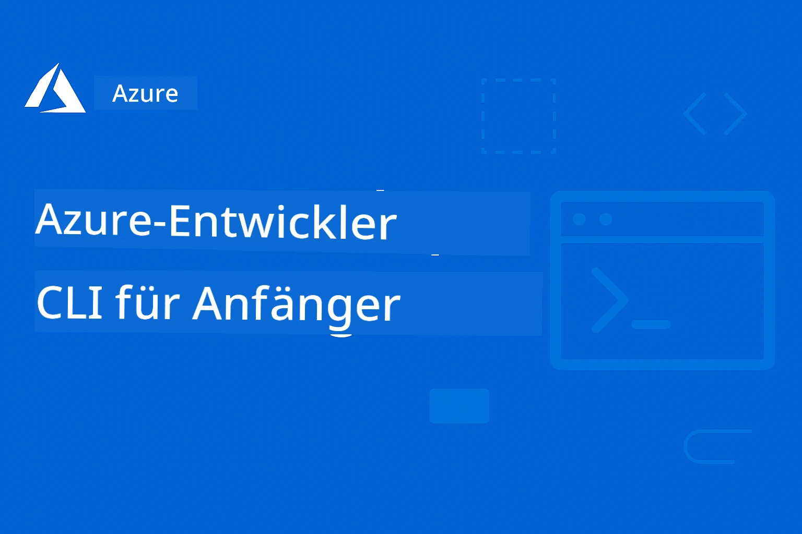

# AZD For Beginners: A Structured Learning Journey

 

[](https://GitHub.com/microsoft/azd-for-beginners/watchers/)
[](https://GitHub.com/microsoft/azd-for-beginners/network/)
[](https://GitHub.com/microsoft/azd-for-beginners/stargazers/)

[](https://discord.com/invite/nkVh3dp)
[](https://discord.gg/nTYy5BXMWG)

---

### Automatisierte Übersetzungen (immer aktuell)

<!-- CO-OP TRANSLATOR LANGUAGES TABLE START -->
[Arabisch](../ar/README.md) | [Bengalisch](../bn/README.md) | [Bulgarisch](../bg/README.md) | [Burmesisch (Myanmar)](../my/README.md) | [Chinesisch (Vereinfacht)](../zh-CN/README.md) | [Chinesisch (Traditionell, Hongkong)](../zh-HK/README.md) | [Chinesisch (Traditionell, Macau)](../zh-MO/README.md) | [Chinesisch (Traditionell, Taiwan)](../zh-TW/README.md) | [Kroatisch](../hr/README.md) | [Tschechisch](../cs/README.md) | [Dänisch](../da/README.md) | [Niederländisch](../nl/README.md) | [Estnisch](../et/README.md) | [Finnisch](../fi/README.md) | [Französisch](../fr/README.md) | [Deutsch](./README.md) | [Griechisch](../el/README.md) | [Hebräisch](../he/README.md) | [Hindi](../hi/README.md) | [Ungarisch](../hu/README.md) | [Indonesisch](../id/README.md) | [Italienisch](../it/README.md) | [Japanisch](../ja/README.md) | [Kannada](../kn/README.md) | [Koreanisch](../ko/README.md) | [Litauisch](../lt/README.md) | [Malaiisch](../ms/README.md) | [Malayalam](../ml/README.md) | [Marathi](../mr/README.md) | [Nepali](../ne/README.md) | [Nigerianisches Pidgin](../pcm/README.md) | [Norwegisch](../no/README.md) | [Persisch (Farsi)](../fa/README.md) | [Polnisch](../pl/README.md) | [Portugiesisch (Brasilien)](../pt-BR/README.md) | [Portugiesisch (Portugal)](../pt-PT/README.md) | [Punjabi (Gurmukhi)](../pa/README.md) | [Rumänisch](../ro/README.md) | [Russisch](../ru/README.md) | [Serbisch (Kyrillisch)](../sr/README.md) | [Slowakisch](../sk/README.md) | [Slowenisch](../sl/README.md) | [Spanisch](../es/README.md) | [Suaheli](../sw/README.md) | [Schwedisch](../sv/README.md) | [Tagalog (Filipino)](../tl/README.md) | [Tamil](../ta/README.md) | [Telugu](../te/README.md) | [Thailändisch](../th/README.md) | [Türkisch](../tr/README.md) | [Ukrainisch](../uk/README.md) | [Urdu](../ur/README.md) | [Vietnamesisch](../vi/README.md)

> **Lieber lokal klonen?**
>
> Dieses Repository enthält 50+ Sprachübersetzungen, die die Downloadgröße erheblich vergrößern. Um ohne Übersetzungen zu klonen, verwenden Sie Sparse Checkout:
>
> **Bash / macOS / Linux:**
> ```bash
> git clone --filter=blob:none --sparse https://github.com/microsoft/AZD-for-beginners.git
> cd AZD-for-beginners
> git sparse-checkout set --no-cone '/*' '!translations' '!translated_images'
> ```
>
> **CMD (Windows):**
> ```cmd
> git clone --filter=blob:none --sparse https://github.com/microsoft/AZD-for-beginners.git
> cd AZD-for-beginners
> git sparse-checkout set --no-cone "/*" "!translations" "!translated_images"
> ```
>
> Das gibt Ihnen alles, was Sie benötigen, um den Kurs mit einem deutlich schnelleren Download abzuschließen.
<!-- CO-OP TRANSLATOR LANGUAGES TABLE END -->

## 🆕 Neuigkeiten in azd heute

Azure Developer CLI ist über traditionelle Web-Apps und APIs hinausgewachsen. Heute ist azd das einzige Tool, um jede Anwendung in Azure bereitzustellen — einschließlich KI-gestützter Anwendungen und intelligenter Agenten.

Das bedeutet für Sie:

- **KI-Agenten sind jetzt erstklassige azd-Workloads.** Sie können KI-Agentenprojekte mit demselben `azd init` → `azd up` Workflow initialisieren, bereitstellen und verwalten, den Sie bereits kennen.
- **Die Microsoft Foundry-Integration** bringt Modellbereitstellung, Agenten-Hosting und KI-Dienstkonfiguration direkt in das azd-Template-Ökosystem.
- **Der Kern-Workflow hat sich nicht geändert.** Egal, ob Sie eine To-Do-App, einen Microservice oder eine Multi-Agent-KI-Lösung bereitstellen — die Befehle sind die gleichen.

Wenn Sie azd bereits verwendet haben, ist die KI-Unterstützung eine natürliche Erweiterung — kein separates Tool oder ein fortgeschrittener Pfad. Wenn Sie neu anfangen, lernen Sie einen Workflow, der für alles funktioniert.

---

## 🚀 Was ist die Azure Developer CLI (azd)?

**Azure Developer CLI (azd)** ist ein entwicklerfreundliches Kommandozeilenwerkzeug, das das Bereitstellen von Anwendungen in Azure vereinfacht. Anstatt Dutzende von Azure-Ressourcen manuell zu erstellen und zu verbinden, können Sie ganze Anwendungen mit einem einzigen Befehl bereitstellen.

### Die Magie von `azd up`

```bash
# Dieser einzelne Befehl erledigt alles:
# ✅ Erstellt alle Azure-Ressourcen
# ✅ Konfiguriert Netzwerk und Sicherheit
# ✅ Baut Ihren Anwendungs-Code
# ✅ Stellt in Azure bereit
# ✅ Gibt Ihnen eine funktionierende URL
azd up
```

**Das war's!** Kein Klicken im Azure-Portal, keine komplexen ARM-Vorlagen, die Sie zuerst lernen müssen, keine manuelle Konfiguration – nur funktionierende Anwendungen in Azure.

---

## ❓ Azure Developer CLI vs Azure CLI: Was ist der Unterschied?

Das ist die häufigste Frage, die Anfänger stellen. Hier ist die einfache Antwort:

| Funktion | **Azure CLI (`az`)** | **Azure Developer CLI (`azd`)** |
|---------|---------------------|--------------------------------|
| **Zweck** | Einzelne Azure-Ressourcen verwalten | Komplette Anwendungen bereitstellen |
| **Denkweise** | Infrastrukturorientiert | Anwendungsorientiert |
| **Beispiel** | `az webapp create --name myapp...` | `azd up` |
| **Lernkurve** | Kenntnisse der Azure-Dienste erforderlich | Sie müssen nur Ihre App kennen |
| **Am besten geeignet für** | DevOps, Infrastruktur | Entwickler, Prototyping |

### Einfache Analogie

- **Azure CLI** ist wie alle Werkzeuge zu haben, um ein Haus zu bauen – Hämmer, Sägen, Nägel. Sie können alles bauen, aber Sie müssen sich mit dem Bau auskennen.
- **Azure Developer CLI** ist wie einen Bauunternehmer zu engagieren – Sie beschreiben, was Sie wollen, und er übernimmt das Bauen.

### Wann welches Tool verwenden

| Szenario | Verwenden Sie dies |
|----------|--------------------|
| "Ich möchte meine Web-App schnell bereitstellen" | `azd up` |
| "Ich muss nur ein Storage-Konto erstellen" | `az storage account create` |
| "Ich baue eine vollständige KI-Anwendung" | `azd init --template azure-search-openai-demo` |
| "Ich muss eine bestimmte Azure-Ressource debuggen" | `az resource show` |
| "Ich möchte in Minuten produktionsreife Bereitstellung" | `azd up --environment production` |

### Sie arbeiten zusammen!

AZD verwendet unter der Haube die Azure CLI. Sie können beide verwenden:
```bash
# Deployen Sie Ihre App mit AZD
azd up

# Verfeinern Sie dann bestimmte Ressourcen mit Azure CLI
az webapp config set --name myapp --always-on true
```

---

## 🌟 Vorlagen in Awesome AZD finden

Fangen Sie nicht bei Null an! **Awesome AZD** ist die Community-Sammlung einsatzbereiter Vorlagen:

| Ressource | Beschreibung |
|----------|-------------|
| 🔗 [**Awesome AZD Gallery**](https://azure.github.io/awesome-azd/) | Durchsuchen Sie über 200 Vorlagen mit Ein-Klick-Bereitstellung |
| 🔗 [**Eine Vorlage einreichen**](https://github.com/Azure/awesome-azd/issues) | Tragen Sie Ihre eigene Vorlage zur Community bei |
| 🔗 [**GitHub-Repository**](https://github.com/Azure/awesome-azd) | Sternen und Quellcode erkunden |

### Beliebte KI-Vorlagen aus Awesome AZD

```bash
# RAG-Chat mit Microsoft Foundry-Modellen + KI-Suche
azd init --template azure-search-openai-demo

# Schnelle KI-Chat-Anwendung
azd init --template openai-chat-app-quickstart

# KI-Agenten mit Foundry-Agenten
azd init --template get-started-with-ai-agents
```

---

## 🎯 Erste Schritte in 3 Schritten

### Schritt 1: AZD installieren (2 Minuten)

**Windows:**
```powershell
winget install microsoft.azd
```

**macOS:**
```bash
brew tap azure/azd && brew install azd
```

**Linux:**
```bash
curl -fsSL https://aka.ms/install-azd.sh | bash
```

### Schritt 2: Bei Azure anmelden

```bash
azd auth login
```

### Schritt 3: Ihre erste App bereitstellen

```bash
# Aus einer Vorlage initialisieren
azd init --template todo-nodejs-mongo

# In Azure bereitstellen (erstellt alles!)
azd up
```

**🎉 Das war's!** Ihre App ist jetzt in Azure live.

### Aufräumen (Nicht vergessen!)

```bash
# Remove all resources when done experimenting
azd down --force --purge
```

---

## 📚 Wie Sie diesen Kurs verwenden

Dieser Kurs ist für **progressives Lernen** konzipiert – beginnen Sie dort, wo Sie sich wohlfühlen, und arbeiten Sie sich nach oben:

| Ihre Erfahrung | Starten Sie hier |
|-----------------|------------|
| **Ganz neu bei Azure** | [Kapitel 1: Grundlagen](#-chapter-1-foundation--quick-start) |
| **Azure kennen, neu bei AZD** | [Kapitel 1: Grundlagen](#-chapter-1-foundation--quick-start) |
| **Möchten KI-Anwendungen bereitstellen** | [Kapitel 2: KI-zentrierte Entwicklung](#-chapter-2-ai-first-development-recommended-for-ai-developers) |
| **Möchten praktische Übungen** | [🎓 Interaktiver Workshop](workshop/README.md) - 3-4 stündiges geführtes Labor |
| **Benötigen Produktionsmuster** | [Kapitel 8: Produktion & Unternehmensmuster](#-chapter-8-production--enterprise-patterns) |

### Schnelleinrichtung

1. **Dieses Repository forken**: [](https://GitHub.com/microsoft/azd-for-beginners/fork)
2. **Klonen:** `git clone https://github.com/YOUR-USERNAME/azd-for-beginners.git`
3. **Hilfe erhalten:** [Azure Discord-Community](https://discord.com/invite/ByRwuEEgH4)

> **Lieber lokal klonen?**

> Dieses Repository enthält 50+ Sprachübersetzungen, die die Downloadgröße erheblich vergrößern. Um ohne Übersetzungen zu klonen, verwenden Sie Sparse Checkout:
> ```bash
> git clone --filter=blob:none --sparse https://github.com/microsoft/AZD-for-beginners.git
> cd AZD-for-beginners
> git sparse-checkout set --no-cone '/*' '!translations' '!translated_images'
> ```
> Das gibt Ihnen alles, was Sie benötigen, um den Kurs mit einem deutlich schnelleren Download abzuschließen.


## Kursübersicht

Meistern Sie die Azure Developer CLI (azd) durch strukturierte Kapitel, die für progressives Lernen ausgelegt sind. **Besonderer Fokus auf die Bereitstellung von KI-Anwendungen mit Microsoft Foundry-Integration.**

### Warum dieser Kurs für moderne Entwickler unerlässlich ist

Basierend auf Erkenntnissen aus der Microsoft Foundry Discord-Community möchten **45% der Entwickler AZD für KI-Workloads nutzen**, stoßen jedoch auf Herausforderungen bei:
- Komplexen Multi-Service-KI-Architekturen
- Produktionsreife Bereitstellungspraktiken für KI  
- Integration und Konfiguration von Azure-KI-Diensten
- Kostenoptimierung für KI-Workloads
- Fehlerbehebung bei KI-spezifischen Bereitstellungsproblemen

### Lernziele

Durch den Abschluss dieses strukturierten Kurses werden Sie:
- **AZD-Grundlagen meistern**: Kernkonzepte, Installation und Konfiguration
- **KI-Anwendungen bereitstellen**: Verwenden Sie AZD mit Microsoft Foundry-Services
- **Infrastructure as Code implementieren**: Verwalten Sie Azure-Ressourcen mit Bicep-Vorlagen
- **Bereitstellungen debuggen**: Häufige Probleme lösen und Fehler beheben
- **Für die Produktion optimieren**: Sicherheit, Skalierung, Monitoring und Kostenmanagement
- **Multi-Agent-Lösungen bauen**: Komplexe KI-Architekturen bereitstellen

## 🗺️ Kursübersicht: Schnelle Navigation nach Kapiteln

Jedes Kapitel hat ein eigenes README mit Lernzielen, Schnellstarts und Übungen:

| Kapitel | Thema | Lektionen | Dauer | Komplexität |
|---------|-------|---------|----------|------------|
| **[Kapitel 1: Grundlagen](docs/chapter-01-foundation/README.md)** | Erste Schritte | [AZD-Grundlagen](docs/chapter-01-foundation/azd-basics.md) &#124; [Installation](docs/chapter-01-foundation/installation.md) &#124; [Erstes Projekt](docs/chapter-01-foundation/first-project.md) | 30-45 Min. | ⭐ |
| **[Kap. 2: KI-Entwicklung](docs/chapter-02-ai-development/README.md)** | KI-orientierte Apps | [Microsoft Foundry-Integration](docs/chapter-02-ai-development/microsoft-foundry-integration.md) &#124; [KI-Agenten](docs/chapter-02-ai-development/agents.md) &#124; [Modellbereitstellung](docs/chapter-02-ai-development/ai-model-deployment.md) &#124; [Workshop](docs/chapter-02-ai-development/ai-workshop-lab.md) | 1-2 Std. | ⭐⭐ |
| **[Kap. 3: Konfiguration](docs/chapter-03-configuration/README.md)** | Auth & Sicherheit | [Konfiguration](docs/chapter-03-configuration/configuration.md) &#124; [Auth & Sicherheit](docs/chapter-03-configuration/authsecurity.md) | 45-60 Min. | ⭐⭐ |
| **[Kap. 4: Infrastruktur](docs/chapter-04-infrastructure/README.md)** | IaC & Bereitstellung | [Bereitstellungsleitfaden](docs/chapter-04-infrastructure/deployment-guide.md) &#124; [Provisioning](docs/chapter-04-infrastructure/provisioning.md) | 1-1.5 Std. | ⭐⭐⭐ |
| **[Kap. 5: Multi-Agent](docs/chapter-05-multi-agent/README.md)** | KI-Agenten-Lösungen | [Retail-Szenario](examples/retail-scenario.md) &#124; [Koordinationsmuster](docs/chapter-06-pre-deployment/coordination-patterns.md) | 2-3 Std. | ⭐⭐⭐⭐ |
| **[Kap. 6: Vorbereitungen vor der Bereitstellung](docs/chapter-06-pre-deployment/README.md)** | Planung & Validierung | [Preflight-Checks](docs/chapter-06-pre-deployment/preflight-checks.md) &#124; [Kapazitätsplanung](docs/chapter-06-pre-deployment/capacity-planning.md) &#124; [SKU-Auswahl](docs/chapter-06-pre-deployment/sku-selection.md) &#124; [App Insights](docs/chapter-06-pre-deployment/application-insights.md) | 1 Std. | ⭐⭐ |
| **[Kap. 7: Fehlerbehebung](docs/chapter-07-troubleshooting/README.md)** | Debug & Fix | [Häufige Probleme](docs/chapter-07-troubleshooting/common-issues.md) &#124; [Debugging](docs/chapter-07-troubleshooting/debugging.md) &#124; [KI-Probleme](docs/chapter-07-troubleshooting/ai-troubleshooting.md) | 1-1.5 Std. | ⭐⭐ |
| **[Kap. 8: Produktion](docs/chapter-08-production/README.md)** | Enterprise-Muster | [Produktionspraktiken](docs/chapter-08-production/production-ai-practices.md) | 2-3 Std. | ⭐⭐⭐⭐ |
| **[🎓 Workshop](workshop/README.md)** | Hands-On-Lab | [Einführung](workshop/docs/instructions/0-Introduction.md) &#124; [Auswahl](workshop/docs/instructions/1-Select-AI-Template.md) &#124; [Validierung](workshop/docs/instructions/2-Validate-AI-Template.md) &#124; [Zerlegung](workshop/docs/instructions/3-Deconstruct-AI-Template.md) &#124; [Konfiguration](workshop/docs/instructions/4-Configure-AI-Template.md) &#124; [Anpassung](workshop/docs/instructions/5-Customize-AI-Template.md) &#124; [Abbau](workshop/docs/instructions/6-Teardown-Infrastructure.md) &#124; [Abschluss](workshop/docs/instructions/7-Wrap-up.md) | 3-4 Std. | ⭐⭐ |

**Gesamtdauer des Kurses:** ~10-14 Stunden | **Kompetenzentwicklung:** Anfänger → Produktionsbereit

---

## 📚 Lernkapitel

*Wählen Sie Ihren Lernpfad basierend auf Erfahrungslevel und Zielen*

### 🚀 Kapitel 1: Grundlagen & Schnellstart
**Voraussetzungen**: Azure-Abonnement, grundlegende Kenntnisse der Kommandozeile  
**Dauer**: 30-45 Minuten  
**Komplexität**: ⭐

#### Was Sie lernen werden
- Grundlagen der Azure Developer CLI verstehen
- AZD auf Ihrer Plattform installieren
- Ihre erste erfolgreiche Bereitstellung

#### Lernressourcen
- **🎯 Starten Sie hier**: [Was ist die Azure Developer CLI?](#what-is-azure-developer-cli)
- **📖 Theorie**: [AZD-Grundlagen](docs/chapter-01-foundation/azd-basics.md) - Kernkonzepte und Terminologie
- **⚙️ Einrichtung**: [Installation & Einrichtung](docs/chapter-01-foundation/installation.md) - Plattform-spezifische Anleitungen
- **🛠️ Praxis**: [Ihr erstes Projekt](docs/chapter-01-foundation/first-project.md) - Schritt-für-Schritt-Anleitung
- **📋 Schnellreferenz**: [Befehls-Spickzettel](resources/cheat-sheet.md)

#### Praktische Übungen
```bash
# Schnelle Überprüfung der Installation
azd version

# Stellen Sie Ihre erste Anwendung bereit
azd init --template todo-nodejs-mongo
azd up
```

**💡 Ziel des Kapitels**: Eine einfache Webanwendung erfolgreich mit AZD in Azure bereitstellen

**✅ Erfolgsvalidierung:**
```bash
# Nach Abschluss von Kapitel 1 sollten Sie in der Lage sein:
azd version              # Zeigt die installierte Version an
azd init --template todo-nodejs-mongo  # Initialisiert das Projekt
azd up                  # Stellt in Azure bereit
azd show                # Zeigt die URL der laufenden App an
# Die Anwendung öffnet sich im Browser und funktioniert
azd down --force --purge  # Bereinigt Ressourcen
```

**📊 Zeitaufwand:** 30-45 Minuten  
**📈 Kompetenzniveau danach:** Kann grundlegende Anwendungen eigenständig bereitstellen  
**📈 Kompetenzniveau danach:** Kann grundlegende Anwendungen eigenständig bereitstellen

---

### 🤖 Kapitel 2: KI-orientierte Entwicklung (Empfohlen für KI-Entwickler)
**Voraussetzungen**: Kapitel 1 abgeschlossen  
**Dauer**: 1-2 Stunden  
**Komplexität**: ⭐⭐

#### Was Sie lernen werden
- Microsoft Foundry-Integration mit AZD
- Bereitstellung KI-gestützter Anwendungen
- Verständnis von KI-Dienstkonfigurationen

#### Lernressourcen
- **🎯 Starten Sie hier**: [Microsoft Foundry-Integration](docs/chapter-02-ai-development/microsoft-foundry-integration.md)
- **🤖 KI-Agenten**: [Leitfaden zu KI-Agenten](docs/chapter-02-ai-development/agents.md) - Intelligente Agenten mit AZD bereitstellen
- **📖 Patterns**: [Modellbereitstellung](docs/chapter-02-ai-development/ai-model-deployment.md) - KI-Modelle bereitstellen und verwalten
- **🛠️ Workshop**: [AI Workshop Lab](docs/chapter-02-ai-development/ai-workshop-lab.md) - Machen Sie Ihre KI-Lösungen AZD-ready
- **🎥 Interaktiver Leitfaden**: [Workshop-Materialien](workshop/README.md) - Browserbasiertes Lernen mit MkDocs * DevContainer-Umgebung
- **📋 Vorlagen**: [Microsoft Foundry-Vorlagen](#workshop-ressourcen)
- **📝 Beispiele**: [AZD-Bereitstellungsbeispiele](examples/README.md)

#### Praktische Übungen
```bash
# Stellen Sie Ihre erste KI-Anwendung bereit
azd init --template azure-search-openai-demo
azd up

# Probieren Sie zusätzliche KI-Vorlagen aus
azd init --template openai-chat-app-quickstart
azd init --template agent-openai-python-prompty
```

**💡 Ziel des Kapitels**: Eine KI-gestützte Chat-Anwendung mit RAG-Funktionen bereitstellen und konfigurieren

**✅ Erfolgsvalidierung:**
```bash
# Nach Kapitel 2 sollten Sie in der Lage sein:
azd init --template azure-search-openai-demo
azd up
# Die KI-Chat-Oberfläche testen
# Fragen stellen und KI-gestützte Antworten mit Quellen erhalten
# Überprüfen, ob die Suchintegration funktioniert
azd monitor  # Überprüfen, ob Application Insights Telemetriedaten anzeigt
azd down --force --purge
```

**📊 Zeitaufwand:** 1-2 Stunden  
**📈 Kompetenzniveau danach:** Kann produktionsreife KI-Anwendungen bereitstellen und konfigurieren  
**💰 Kostenbewusstsein:** Verstehen von $80-150/Monat Entwicklungskosten, $300-3500/Monat Produktionskosten

#### 💰 Kostenüberlegungen für KI-Bereitstellungen

**Entwicklungsumgebung (geschätzt $80-150/Monat):**
- Microsoft Foundry-Modelle (Pay-as-you-go): $0-50/Monat (basierend auf Token-Nutzung)
- KI-Suche (Basic-Tarif): $75/Monat
- Container-Apps (Consumption): $0-20/Monat
- Speicher (Standard): $1-5/Monat

**Produktionsumgebung (geschätzt $300-3,500+/Monat):**
- Microsoft Foundry-Modelle (PTU für konsistente Leistung): $3,000+/Monat ODER Pay-as-you-go bei hohem Volumen
- KI-Suche (Standard-Tarif): $250/Monat
- Container-Apps (Dediziert): $50-100/Monat
- Application Insights: $5-50/Monat
- Speicher (Premium): $10-50/Monat

**💡 Tipps zur Kostenoptimierung:**
- Verwenden Sie **Free Tier** Microsoft Foundry-Modelle zum Lernen (Azure OpenAI 50.000 Tokens/Monat enthalten)
- Führen Sie `azd down` aus, um Ressourcen zu deallokieren, wenn Sie nicht aktiv entwickeln
- Beginnen Sie mit verbrauchsbasierter Abrechnung, wechseln Sie zu PTU nur für die Produktion
- Verwenden Sie `azd provision --preview`, um Kosten vor der Bereitstellung abzuschätzen
- Aktivieren Sie Auto-Scaling: zahlen Sie nur für tatsächliche Nutzung

**Kostenüberwachung:**
```bash
# Geschätzte monatliche Kosten überprüfen
azd provision --preview

# Tatsächliche Kosten im Azure-Portal überwachen
az consumption budget list --resource-group <your-rg>
```

---

### ⚙️ Kapitel 3: Konfiguration & Authentifizierung
**Voraussetzungen**: Kapitel 1 abgeschlossen  
**Dauer**: 45-60 Minuten  
**Komplexität**: ⭐⭐

#### Was Sie lernen werden
- Konfiguration und Verwaltung von Umgebungen
- Authentifizierungs- und Sicherheitsbest Practices
- Ressourcenbenennung und -organisation

#### Lernressourcen
- **📖 Konfiguration**: [Konfigurationsleitfaden](docs/chapter-03-configuration/configuration.md) - Umgebungseinrichtung
- **🔐 Sicherheit**: [Authentifizierungsmuster und Managed Identity](docs/chapter-03-configuration/authsecurity.md) - Authentifizierungsmuster
- **📝 Beispiele**: [Datenbank-App-Beispiel](examples/database-app/README.md) - AZD Datenbank-Beispiele

#### Praktische Übungen
- Konfigurieren mehrerer Umgebungen (dev, staging, prod)
- Managed Identity-Authentifizierung einrichten
- Implementieren umgebungsspezifischer Konfigurationen

**💡 Ziel des Kapitels**: Mehrere Umgebungen mit korrekter Authentifizierung und Sicherheit verwalten

---

### 🏗️ Kapitel 4: Infrastructure as Code & Bereitstellung
**Voraussetzungen**: Kapitel 1-3 abgeschlossen  
**Dauer**: 1-1.5 Stunden  
**Komplexität**: ⭐⭐⭐

#### Was Sie lernen werden
- Fortgeschrittene Bereitstellungsmuster
- Infrastructure as Code mit Bicep
- Strategien zur Ressourcen-Provisionierung

#### Lernressourcen
- **📖 Bereitstellung**: [Bereitstellungsleitfaden](docs/chapter-04-infrastructure/deployment-guide.md) - Vollständige Workflows
- **🏗️ Provisioning**: [Ressourcen-Provisioning](docs/chapter-04-infrastructure/provisioning.md) - Azure-Ressourcenverwaltung
- **📝 Beispiele**: [Container-App-Beispiel](../../examples/container-app) - Containerisierte Bereitstellungen

#### Praktische Übungen
- Eigene Bicep-Vorlagen erstellen
- Multi-Service-Anwendungen bereitstellen
- Blue-Green-Deployment-Strategien implementieren

**💡 Ziel des Kapitels**: Komplexe Multi-Service-Anwendungen mithilfe benutzerdefinierter Infrastrukturvorlagen bereitstellen

---

### 🎯 Kapitel 5: Multi-Agent KI-Lösungen (Fortgeschritten)
**Voraussetzungen**: Kapitel 1-2 abgeschlossen  
**Dauer**: 2-3 Stunden  
**Komplexität**: ⭐⭐⭐⭐

#### Was Sie lernen werden
- Architekturmuster für Multi-Agenten
- Orchestrierung und Koordination von Agenten
- Produktionsreife KI-Bereitstellungen

#### Lernressourcen
- **🤖 Featured Project**: [Retail Multi-Agent Lösung](examples/retail-scenario.md) - Vollständige Implementierung
- **🛠️ ARM-Vorlagen**: [ARM-Template-Paket](../../examples/retail-multiagent-arm-template) - One-Click-Bereitstellung
- **📖 Architektur**: [Koordinationsmuster für Multi-Agenten](docs/chapter-06-pre-deployment/coordination-patterns.md) - Muster

#### Praktische Übungen
```bash
# Die komplette Multi-Agenten-Lösung für den Einzelhandel bereitstellen
cd examples/retail-multiagent-arm-template
./deploy.sh

# Agentenkonfigurationen erkunden
az deployment group show --resource-group <rg-name> --name <deployment-name>
```

**💡 Ziel des Kapitels**: Eine produktionsreife Multi-Agent KI-Lösung mit Kunden- und Inventar-Agenten bereitstellen und verwalten

---

### 🔍 Kapitel 6: Validierung & Planung vor der Bereitstellung
**Voraussetzungen**: Kapitel 4 abgeschlossen  
**Dauer**: 1 Stunde  
**Komplexität**: ⭐⭐

#### Was Sie lernen werden
- Kapazitätsplanung und Ressourcenvalidierung
- Strategien zur SKU-Auswahl
- Preflight-Checks und Automatisierung

#### Lernressourcen
- **📊 Planung**: [Kapazitätsplanung](docs/chapter-06-pre-deployment/capacity-planning.md) - Ressourcenvalidierung
- **💰 Auswahl**: [SKU-Auswahl](docs/chapter-06-pre-deployment/sku-selection.md) - Kostenoptimierte Entscheidungen
- **✅ Validierung**: [Preflight-Checks](docs/chapter-06-pre-deployment/preflight-checks.md) - Automatisierte Skripte

#### Praktische Übungen
- Kapazitätsvalidierungsskripte ausführen
- SKU-Auswahl für Kosten optimieren
- Automatisierte Pre-Deployment-Checks implementieren

**💡 Ziel des Kapitels**: Bereitstellungen vor der Ausführung validieren und optimieren

---

### 🚨 Kapitel 7: Fehlerbehebung & Debugging
**Voraussetzungen**: Beliebiges Bereitstellungskapitel abgeschlossen  
**Dauer**: 1-1.5 Stunden  
**Komplexität**: ⭐⭐

#### Was Sie lernen werden
- Systematische Debugging-Ansätze
- Häufige Probleme und Lösungen
- KI-spezifische Fehlerbehebung

#### Lernressourcen
- **🔧 Häufige Probleme**: [Häufige Probleme](docs/chapter-07-troubleshooting/common-issues.md) - FAQ und Lösungen
- **🕵️ Debugging**: [Debugging-Leitfaden](docs/chapter-07-troubleshooting/debugging.md) - Schritt-für-Schritt-Strategien
- **🤖 KI-Probleme**: [KI-spezifische Fehlerbehebung](docs/chapter-07-troubleshooting/ai-troubleshooting.md) - Probleme mit KI-Diensten

#### Praktische Übungen
- Bereitstellungsfehler diagnostizieren
- Authentifizierungsprobleme lösen
- KI-Dienst-Konnektivität debuggen

**💡 Ziel des Kapitels**: Häufige Bereitstellungsprobleme eigenständig diagnostizieren und beheben

---

### 🏢 Kapitel 8: Produktion & Enterprise-Muster
**Voraussetzungen**: Kapitel 1-4 abgeschlossen  
**Dauer**: 2-3 Stunden  
**Komplexität**: ⭐⭐⭐⭐

#### Was Sie lernen werden
- Strategien für Produktionsbereitstellungen
- Enterprise-Sicherheitsmuster
- Überwachung und Kostenoptimierung

#### Lernressourcen
- **🏭 Produktion**: [Production AI Best Practices](docs/chapter-08-production/production-ai-practices.md) - Unternehmensmuster
- **📝 Beispiele**: [Microservices Example](../../examples/microservices) - Komplexe Architekturen
- **📊 Überwachung**: [Application Insights integration](docs/chapter-06-pre-deployment/application-insights.md) - Überwachung

#### Praktische Übungen
- Implementieren Sie unternehmensweite Sicherheitsmuster
- Richten Sie umfassende Überwachung ein
- Deployen Sie in die Produktion mit geeigneter Governance

**💡 Kapitelziel**: Bereitstellung von unternehmensreifen Anwendungen mit vollständigen Produktionsfunktionen

---

## 🎓 Workshop-Übersicht: Praxisorientierte Lernerfahrung

> **⚠️ WORKSHOP-STATUS: Aktive Entwicklung**  
> Die Workshop-Materialien werden derzeit entwickelt und verfeinert. Kernmodule sind funktionsfähig, aber einige fortgeschrittene Abschnitte sind unvollständig. Wir arbeiten aktiv daran, alle Inhalte fertigzustellen. [Fortschritt verfolgen →](workshop/README.md)

### Interaktive Workshop-Materialien
**Umfassendes praxisorientiertes Lernen mit browserbasierten Tools und geführten Übungen**

Unsere Workshop-Materialien bieten eine strukturierte, interaktive Lernerfahrung, die das kapitelbasierte Curriculum oben ergänzt. Der Workshop ist sowohl für selbstgesteuertes Lernen als auch für von Dozenten geleitete Sitzungen konzipiert.

#### 🛠️ Workshop-Funktionen
- **Browserbasierte Oberfläche**: Vollständiger, MkDocs-gestützter Workshop mit Suche, Kopier- und Theme-Funktionen
- **GitHub Codespaces-Integration**: Ein-Klick-Einrichtung der Entwicklungsumgebung
- **Strukturierter Lernpfad**: 8 Module mit geführten Übungen (3–4 Stunden insgesamt)
- **Progressive Methodik**: Einführung → Auswahl → Validierung → Zerlegung → Konfiguration → Anpassung → Abbau → Abschluss
- **Interaktive DevContainer-Umgebung**: Vorgefertigte Tools und Abhängigkeiten

#### 📚 Aufbau der Workshop-Module
Der Workshop folgt einer **8-moduligen, progressiven Methodik**, die Sie von der Entdeckung bis zur Beherrschung der Bereitstellung führt:

| Module | Thema | Was Sie tun werden | Dauer |
|--------|-------|--------------------|----------|
| **0. Einführung** | Workshop-Übersicht | Verstehen Sie Lernziele, Voraussetzungen und Workshop-Struktur | 15 min |
| **1. Auswahl** | Vorlagenauswahl | Durchsuchen Sie AZD-Vorlagen und wählen Sie die passende AI-Vorlage für Ihr Szenario | 20 min |
| **2. Validierung** | Deploy & Verify | Deployen Sie die Vorlage mit `azd up` und validieren Sie, dass die Infrastruktur funktioniert | 30 min |
| **3. Zerlegung** | Struktur verstehen | Verwenden Sie GitHub Copilot, um die Vorlagenarchitektur, Bicep-Dateien und die Codeorganisation zu erkunden | 30 min |
| **4. Konfiguration** | azure.yaml im Detail | Beherrschen Sie die `azure.yaml`-Konfiguration, Lifecycle-Hooks und Umgebungsvariablen | 30 min |
| **5. Anpassung** | Passen Sie es an | Aktivieren Sie AI Search, Tracing, Evaluierung und passen Sie die Vorlage an Ihr Szenario an | 45 min |
| **6. Abbau** | Bereinigen | Bereinigen Sie Ressourcen sicher mit `azd down --purge` | 15 min |
| **7. Abschluss** | Nächste Schritte | Überprüfen Sie Erfolge, Schlüsselkonzepte und setzen Sie Ihre Lernreise fort | 15 min |

**Ablauf des Workshops:**
```
Introduction → Selection → Validation → Deconstruction → Configuration → Customization → Teardown → Wrap-up
     ↓            ↓           ↓              ↓               ↓              ↓            ↓           ↓
  Overview    Find the     Deploy &      Explore        Master         Customize     Clean up    Review &
             right        verify        code &        azure.yaml      for your      resources   next steps
             template                   structure                     scenario
```

#### 🚀 Erste Schritte mit dem Workshop
```bash
# Option 1: GitHub Codespaces (Empfohlen)
# Klicke im Repository auf "Code" → "Codespace auf main erstellen"

# Option 2: Lokale Entwicklung
git clone https://github.com/microsoft/azd-for-beginners.git
cd azd-for-beginners/workshop
# Befolge die Einrichtungsanweisungen in workshop/README.md
```

#### 🎯 Lernziele des Workshops
Durch die Teilnahme am Workshop werden die Teilnehmenden:
- **Produktionsreife KI-Anwendungen bereitstellen**: Verwenden Sie AZD mit Microsoft Foundry-Diensten
- **Multi-Agenten-Architekturen meistern**: Implementieren Sie koordinierte KI-Agentenlösungen
- **Beste Sicherheitspraktiken implementieren**: Konfigurieren Sie Authentifizierung und Zugriffskontrolle
- **Für Skalierung optimieren**: Entwerfen Sie kosteneffiziente, leistungsfähige Deployments
- **Fehler bei Bereitstellungen beheben**: Lösen Sie gängige Probleme eigenständig

#### 📖 Workshop-Ressourcen
- **🎥 Interaktiver Leitfaden**: [Workshop Materials](workshop/README.md) - Browserbasierte Lernumgebung
- **📋 Modul-für-Modul-Anleitungen**:
  - [0. Einführung](workshop/docs/instructions/0-Introduction.md) - Workshop-Übersicht und Ziele
  - [1. Auswahl](workshop/docs/instructions/1-Select-AI-Template.md) - Finden und Auswählen von AI-Vorlagen
  - [2. Validierung](workshop/docs/instructions/2-Validate-AI-Template.md) - Deployen und Validieren von Vorlagen
  - [3. Zerlegung](workshop/docs/instructions/3-Deconstruct-AI-Template.md) - Vorlagenarchitektur erkunden
  - [4. Konfiguration](workshop/docs/instructions/4-Configure-AI-Template.md) - Beherrschen von azure.yaml
  - [5. Anpassung](workshop/docs/instructions/5-Customize-AI-Template.md) - Anpassen an Ihr Szenario
  - [6. Abbau](workshop/docs/instructions/6-Teardown-Infrastructure.md) - Ressourcen bereinigen
  - [7. Abschluss](workshop/docs/instructions/7-Wrap-up.md) - Rückblick und nächste Schritte
- **🛠️ AI Workshop Lab**: [AI Workshop Lab](docs/chapter-02-ai-development/ai-workshop-lab.md) - KI-fokussierte Übungen
- **💡 Quick Start**: [Workshop Setup Guide](workshop/README.md#quick-start) - Umgebungskonfiguration

**Perfekt für**: Firmenschulungen, Universitätskurse, selbstgesteuertes Lernen und Entwickler-Bootcamps.

---

## 📖 Tiefgehender Einblick: AZD-Funktionen

Über die Grundlagen hinaus bietet AZD leistungsstarke Funktionen für Produktionsbereitstellungen:

- **Vorlagenbasierte Deployments** - Verwenden Sie vorgefertigte Vorlagen für gängige Anwendungsarchitekturen
- **Infrastructure as Code** - Verwalten Sie Azure-Ressourcen mit Bicep oder Terraform  
- **Integrierte Workflows** - Provisionieren, deployen und überwachen Sie Anwendungen nahtlos
- **Entwicklerfreundlich** - Optimiert für Entwicklerproduktivität und -erfahrung

### **AZD + Microsoft Foundry: Perfekt für KI-Bereitstellungen**

**Warum AZD für KI-Lösungen?** AZD adressiert die wichtigsten Herausforderungen, denen KI-Entwickler gegenüberstehen:

- **KI-bereite Vorlagen** - Vorgefertigte Vorlagen für Microsoft Foundry Models, Cognitive Services und ML-Workloads
- **Sichere KI-Bereitstellungen** - Integrierte Sicherheitsmuster für KI-Dienste, API-Schlüssel und Modellendpunkte  
- **Produktionsreife KI-Muster** - Best Practices für skalierbare, kosteneffiziente KI-Anwendungs-Deployments
- **End-to-End KI-Workflows** - Von der Modellentwicklung bis zur Produktionsbereitstellung mit geeigneter Überwachung
- **Kostenoptimierung** - Intelligente Ressourcenzuweisung und Skalierungsstrategien für KI-Workloads
- **Microsoft Foundry-Integration** - Nahtlose Verbindung zum Microsoft Foundry-Modulkatalog und Endpunkten

---

## 🎯 Vorlagen- & Beispielbibliothek

### Empfohlen: Microsoft Foundry-Vorlagen
**Beginnen Sie hier, wenn Sie KI-Anwendungen bereitstellen!**

> **Hinweis:** Diese Vorlagen demonstrieren verschiedene KI-Muster. Einige sind externe Azure Samples, andere lokale Implementierungen.

| Template | Kapitel | Komplexität | Dienste | Typ |
|----------|---------|------------|----------|------|
| [**Get started with AI chat**](https://github.com/Azure-Samples/get-started-with-ai-chat) | Kapitel 2 | ⭐⭐ | AzureOpenAI + Azure AI Model Inference API + Azure AI Search + Azure Container Apps + Application Insights | Extern |
| [**Get started with AI agents**](https://github.com/Azure-Samples/get-started-with-ai-agents) | Kapitel 2 | ⭐⭐ | Foundry Agents + AzureOpenAI + Azure AI Search + Azure Container Apps + Application Insights| Extern |
| [**Azure Search + OpenAI Demo**](https://github.com/Azure-Samples/azure-search-openai-demo) | Kapitel 2 | ⭐⭐ | AzureOpenAI + Azure AI Search + App Service + Storage | Extern |
| [**OpenAI Chat App Quickstart**](https://github.com/Azure-Samples/openai-chat-app-quickstart) | Kapitel 2 | ⭐ | AzureOpenAI + Container Apps + Application Insights | Extern |
| [**Agent OpenAI Python Prompty**](https://github.com/Azure-Samples/agent-openai-python-prompty) | Kapitel 5 | ⭐⭐⭐ | AzureOpenAI + Azure Functions + Prompty | Extern |
| [**Contoso Chat RAG**](https://github.com/Azure-Samples/contoso-chat) | Kapitel 8 | ⭐⭐⭐⭐ | AzureOpenAI + AI Search + Cosmos DB + Container Apps | Extern |
| [**Retail Multi-Agent Solution**](examples/retail-scenario.md) | Kapitel 5 | ⭐⭐⭐⭐ | AzureOpenAI + AI Search + Storage + Container Apps + Cosmos DB | **Lokal** |

### Empfohlen: Komplette Lernszenarien
**Produktionsreife Anwendungsvorlagen, zugeordnet zu Lernkapiteln**

| Template | Lernkapitel | Komplexität | Zentrales Lernziel |
|----------|------------------|------------|--------------|
| [**openai-chat-app-quickstart**](https://github.com/Azure-Samples/openai-chat-app-quickstart) | Kapitel 2 | ⭐ | Grundlegende KI-Deployments |
| [**azure-search-openai-demo**](https://github.com/Azure-Samples/azure-search-openai-demo) | Kapitel 2 | ⭐⭐ | RAG-Implementierung mit Azure AI Search |
| [**ai-document-processing**](https://github.com/Azure-Samples/ai-document-processing) | Kapitel 4 | ⭐⭐ | Integration von Document Intelligence |
| [**agent-openai-python-prompty**](https://github.com/Azure-Samples/agent-openai-python-prompty) | Kapitel 5 | ⭐⭐⭐ | Agent-Framework und Function Calling |
| [**contoso-chat**](https://github.com/Azure-Samples/contoso-chat) | Kapitel 8 | ⭐⭐⭐ | Enterprise-KI-Orchestrierung |
| [**retail-multi-agent-solution**](examples/retail-scenario.md) | Kapitel 5 | ⭐⭐⭐⭐ | Multi-Agenten-Architektur mit Customer- und Inventory-Agenten |

### Lernen nach Beispieltyp

> **📌 Lokale vs. Externe Beispiele:**  
> **Lokale Beispiele** (in diesem Repo) = Sofort einsatzbereit  
> **Externe Beispiele** (Azure Samples) = Klonen Sie die verlinkten Repositories

#### Lokale Beispiele (Sofort verwendbar)
- [**Retail Multi-Agent Solution**](examples/retail-scenario.md) - Vollständige produktionsreife Implementierung mit ARM-Vorlagen
  - Multi-Agenten-Architektur (Customer + Inventory Agents)
  - Umfassende Überwachung und Evaluierung
  - Ein-Klick-Bereitstellung über ARM-Vorlage

#### Lokale Beispiele - Container-Anwendungen (Kapitel 2-5)
**Umfassende Beispiele für Container-Bereitstellungen in diesem Repository:**
- [**Container App Examples**](examples/container-app/README.md) - Vollständige Anleitung für containerisierte Deployments
  - [Simple Flask API](../../examples/container-app/simple-flask-api) - Einfache REST-API mit Scale-to-Zero
  - [Microservices Architecture](../../examples/container-app/microservices) - Produktionsreifes Multi-Service-Deployment
  - Quick Start-, Produktions- und Fortgeschrittene Bereitstellungsmuster
  - Überwachung, Sicherheit und Kostenoptimierungsleitfäden

#### Externe Beispiele - Einfache Anwendungen (Kapitel 1-2)
**Klonen Sie diese Azure Samples Repositories, um zu starten:**
- [Simple Web App - Node.js + MongoDB](https://github.com/Azure-Samples/todo-nodejs-mongo) - Grundlegende Deployment-Muster
- [Static Website - React SPA](https://github.com/Azure-Samples/todo-csharp-sql-swa-func) - Bereitstellung statischer Inhalte
- [Container App - Python Flask](https://github.com/Azure-Samples/container-apps-store-api-microservice) - REST-API-Bereitstellung

#### Externe Beispiele - Datenbankintegration (Kapitel 3-4)  
- [Database App - C# + SQL](https://github.com/Azure-Samples/todo-csharp-sql) - Muster zur Datenbankanbindung
- [Functions + Cosmos DB](https://github.com/Azure-Samples/todo-python-mongo-swa-func) - Serverless-Datenworkflows

#### Externe Beispiele - Fortgeschrittene Muster (Kapitel 4-8)
- [Java Microservices](https://github.com/Azure-Samples/java-microservices-aca-lab) - Multi-Service-Architekturen
- [Container Apps Jobs](https://github.com/Azure-Samples/container-apps-jobs) - Hintergrundverarbeitung  
- [Enterprise ML Pipeline](https://github.com/Azure-Samples/mlops-v2) - Produktionsreife ML-Muster

### Externe Vorlage-Sammlungen
- [**Official AZD Template Gallery**](https://azure.github.io/awesome-azd/) - Kuratierte Sammlung offizieller und Community-Vorlagen
- [**Azure Developer CLI Templates**](https://learn.microsoft.com/en-us/azure/developer/azure-developer-cli/azd-templates) - Microsoft Learn Template-Dokumentation
- [**Examples Directory**](examples/README.md) - Lokale Lernbeispiele mit ausführlichen Erklärungen

---

## 📚 Lernressourcen & Referenzen

### Schnellreferenzen
- [**Command Cheat Sheet**](resources/cheat-sheet.md) - Wichtige azd-Befehle, geordnet nach Kapitel
- [**Glossar**](resources/glossary.md) - Azure- und azd-Terminologie  
- [**FAQ**](resources/faq.md) - Häufige Fragen, geordnet nach Lernkapitel
- [**Study Guide**](resources/study-guide.md) - Umfassende Übungsaufgaben

### Praxis-Workshops
- [**AI Workshop Lab**](docs/chapter-02-ai-development/ai-workshop-lab.md) - Machen Sie Ihre KI-Lösungen AZD-deployable (2–3 Stunden)
- [**Interactive Workshop**](workshop/README.md) - 8 Module geführte Übungen mit MkDocs und GitHub Codespaces
  - Folgt: Einführung → Auswahl → Validierung → Zerlegung → Konfiguration → Anpassung → Abbau → Abschluss

### Externe Lernressourcen
- [Azure Developer CLI Dokumentation](https://learn.microsoft.com/en-us/azure/developer/azure-developer-cli/)
- [Azure Architecture Center](https://learn.microsoft.com/en-us/azure/architecture/)
- [Azure Pricing Calculator](https://azure.microsoft.com/pricing/calculator/)
- [Azure Status](https://status.azure.com/)

### KI-Agenten-Fähigkeiten für Ihren Editor
- [**Microsoft Azure-Fähigkeiten auf skills.sh**](https://skills.sh/microsoft/github-copilot-for-azure) - 37 offene Agenten-Fähigkeiten für Azure AI, Foundry, Bereitstellung, Diagnostik, Kostenoptimierung und mehr. Installieren Sie sie in GitHub Copilot, Cursor, Claude Code oder einem beliebigen unterstützten Agenten:
  ```bash
  npx skills add microsoft/github-copilot-for-azure
  ```

---

## 🔧 Schnelle Fehlerbehebungsanleitung

**Häufige Probleme von Einsteigern und sofortige Lösungen:**

<details>
<summary><strong>❌ "azd: command not found"</strong></summary>

```bash
# Installiere zuerst AZD
# Windows (PowerShell):
winget install microsoft.azd

# macOS:
brew tap azure/azd && brew install azd

# Linux:
curl -fsSL https://aka.ms/install-azd.sh | bash

# Überprüfe die Installation
azd version
```
</details>

<details>
<summary><strong>❌ "No subscription found" or "Subscription not set"</strong></summary>

```bash
# Verfügbare Abonnements auflisten
az account list --output table

# Standardabonnement festlegen
az account set --subscription "<subscription-id-or-name>"

# Für AZD-Umgebung festlegen
azd env set AZURE_SUBSCRIPTION_ID "<subscription-id>"

# Überprüfen
az account show
```
</details>

<details>
<summary><strong>❌ "InsufficientQuota" or "Quota exceeded"</strong></summary>

```bash
# Versuchen Sie eine andere Azure-Region
azd env set AZURE_LOCATION "westus2"
azd up

# Oder verwenden Sie in der Entwicklung kleinere SKUs
# Bearbeiten Sie infra/main.parameters.json:
{
  "sku": "B1"  // Instead of "P1V2"
}
```
</details>

<details>
<summary><strong>❌ "azd up" fails halfway through</strong></summary>

```bash
# Option 1: Bereinigen und erneut versuchen
azd down --force --purge
azd up

# Option 2: Nur die Infrastruktur reparieren
azd provision

# Option 3: Detaillierten Status prüfen
azd show

# Option 4: Protokolle in Azure Monitor prüfen
azd monitor --logs
```
</details>

<details>
<summary><strong>❌ "Authentication failed" or "Token expired"</strong></summary>

```bash
# Erneut authentifizieren
az logout
az login

azd auth logout
azd auth login

# Authentifizierung überprüfen
az account show
```
</details>

<details>
<summary><strong>❌ "Resource already exists" or naming conflicts</strong></summary>

```bash
# AZD erzeugt eindeutige Namen, aber falls ein Konflikt auftritt:
azd down --force --purge

# Dann mit einer frischen Umgebung erneut versuchen
azd env new dev-v2
azd up
```
</details>

<details>
<summary><strong>❌ Vorlage-Bereitstellung dauert zu lange</strong></summary>

**Normale Wartezeiten:**
- Einfache Webanwendung: 5-10 Minuten
- App mit Datenbank: 10-15 Minuten
- KI-Anwendungen: 15-25 Minuten (OpenAI-Bereitstellung ist langsam)

```bash
# Fortschritt prüfen
azd show

# Wenn länger als 30 Minuten feststeckt, überprüfen Sie das Azure-Portal:
azd monitor
# Nach fehlgeschlagenen Bereitstellungen suchen
```
</details>

<details>
<summary><strong>❌ "Permission denied" or "Forbidden"</strong></summary>

```bash
# Überprüfen Sie Ihre Azure-Rolle
az role assignment list --assignee $(az account show --query user.name -o tsv)

# Sie benötigen mindestens die Rolle "Contributor"
# Bitten Sie Ihren Azure-Administrator, Folgendes zu gewähren:
# - Contributor (für Ressourcen)
# - User Access Administrator (für Rollenzuweisungen)
```
</details>

<details>
<summary><strong>❌ Can't find deployed application URL</strong></summary>

```bash
# Alle Service-Endpunkte anzeigen
azd show

# Oder Azure-Portal öffnen
azd monitor

# Bestimmten Service prüfen
azd env get-values
# Nach *_URL-Variablen suchen
```
</details>

### 📚 Vollständige Fehlerbehebungsressourcen

- **Leitfaden zu häufigen Problemen:** [Detaillierte Lösungen](docs/chapter-07-troubleshooting/common-issues.md)
- **KI-spezifische Probleme:** [KI-Fehlerbehebung](docs/chapter-07-troubleshooting/ai-troubleshooting.md)
- **Debugging-Leitfaden:** [Schritt-für-Schritt-Debugging](docs/chapter-07-troubleshooting/debugging.md)
- **Hilfe erhalten:** [Azure Discord](https://discord.gg/microsoft-azure) #azure-developer-cli

---

## 🎓 Kursabschluss & Zertifizierung

### Fortschrittsverfolgung
Verfolgen Sie Ihren Lernfortschritt in jedem Kapitel:

- [ ] **Chapter 1**: Grundlagen & Schnellstart ✅
- [ ] **Chapter 2**: KI-fokussierte Entwicklung ✅  
- [ ] **Chapter 3**: Konfiguration & Authentifizierung ✅
- [ ] **Chapter 4**: Infrastruktur als Code & Bereitstellung ✅
- [ ] **Chapter 5**: Mehragentige KI-Lösungen ✅
- [ ] **Chapter 6**: Validierung & Planung vor der Bereitstellung ✅
- [ ] **Chapter 7**: Fehlerbehebung & Debugging ✅
- [ ] **Chapter 8**: Produktions- & Unternehmensmuster ✅

### Lernüberprüfung
Überprüfen Sie nach Abschluss jedes Kapitels Ihr Wissen durch:
1. **Praktische Übung**: Schließen Sie die praktische Bereitstellung des Kapitels ab
2. **Wissenscheck**: Überprüfen Sie den FAQ-Bereich für Ihr Kapitel
3. **Community-Diskussion**: Teilen Sie Ihre Erfahrung im Azure Discord
4. **Nächstes Kapitel**: Wechseln Sie zur nächsten Komplexitätsstufe

### Vorteile nach Kursabschluss
Nach Abschluss aller Kapitel werden Sie folgende Kenntnisse/Erfahrungen haben:
- **Produktions­erfahrung**: Echte KI-Anwendungen in Azure bereitgestellt
- **Professionelle Fähigkeiten**: Unternehmensgerechte Bereitstellungsfähigkeiten  
- **Anerkennung in der Community**: Aktives Mitglied der Azure-Entwickler-Community
- **Berufliche Weiterentwicklung**: Gefragte AZD- und KI-Bereitstellungsexpertise

---

## 🤝 Community & Unterstützung

### Hilfe & Unterstützung
- **Technische Probleme**: [Fehler melden und Funktionswünsche anfordern](https://github.com/microsoft/azd-for-beginners/issues)
- **Lernfragen**: [Microsoft Azure Discord Community](https://discord.gg/microsoft-azure) und [](https://discord.gg/nTYy5BXMWG)
- **KI-spezifische Hilfe**: Treten Sie dem [](https://discord.gg/nTYy5BXMWG) bei
- **Dokumentation**: [Offizielle Azure Developer CLI Dokumentation](https://learn.microsoft.com/en-us/azure/developer/azure-developer-cli/)

### Community-Einblicke aus dem Microsoft Foundry Discord

**Aktuelle Umfrageergebnisse aus dem #Azure-Kanal:**
- **45%** der Entwickler wollen AZD für KI-Workloads verwenden
- **Hauptprobleme**: Mehrservice-Bereitstellungen, Verwaltung von Zugangsdaten, Produktionsreife  
- **Am häufigsten angefragt**: KI-spezifische Vorlagen, Fehlerbehebungsanleitungen, Best Practices

Treten Sie unserer Community bei, um:
- Teilen Sie Ihre AZD- + KI-Erfahrungen und erhalten Sie Hilfe
- Zugriff auf frühe Previews neuer KI-Vorlagen
- Beitragen zu Best Practices für KI-Bereitstellungen
- Beeinflussen Sie die zukünftige Entwicklung von KI + AZD-Funktionen

### Beitrag zum Kurs
Beiträge sind willkommen! Bitte lesen Sie unseren [Beitragsleitfaden](CONTRIBUTING.md) für Details zu:
- **Inhaltsverbesserungen**: Bestehende Kapitel und Beispiele verbessern
- **Neue Beispiele**: Fügen Sie praxisnahe Szenarien und Vorlagen hinzu  
- **Übersetzungen**: Helfen Sie, die mehrsprachige Unterstützung zu pflegen
- **Fehlerberichte**: Verbesserung von Genauigkeit und Klarheit
- **Community-Standards**: Befolgen Sie unsere inklusiven Community-Richtlinien

---

## 📄 Kursinformationen

### Lizenz
Dieses Projekt ist unter der MIT-Lizenz lizenziert - siehe die [LICENSE](../../LICENSE) Datei für Details.

### Verwandte Microsoft-Lernressourcen

Unser Team erstellt weitere umfassende Lernkurse:

<!-- CO-OP TRANSLATOR OTHER COURSES START -->
### LangChain
[](https://aka.ms/langchain4j-for-beginners)
[](https://aka.ms/langchainjs-for-beginners?WT.mc_id=m365-94501-dwahlin)
[](https://github.com/microsoft/langchain-for-beginners?WT.mc_id=m365-94501-dwahlin)
---

### Azure / Edge / MCP / Agenten
[](https://github.com/microsoft/AZD-for-beginners?WT.mc_id=academic-105485-koreyst)
[](https://github.com/microsoft/edgeai-for-beginners?WT.mc_id=academic-105485-koreyst)
[](https://github.com/microsoft/mcp-for-beginners?WT.mc_id=academic-105485-koreyst)
[](https://github.com/microsoft/ai-agents-for-beginners?WT.mc_id=academic-105485-koreyst)

---
 
### Generative KI-Serie
[](https://github.com/microsoft/generative-ai-for-beginners?WT.mc_id=academic-105485-koreyst)
[-9333EA?style=for-the-badge&labelColor=E5E7EB&color=9333EA)](https://github.com/microsoft/Generative-AI-for-beginners-dotnet?WT.mc_id=academic-105485-koreyst)
[-C084FC?style=for-the-badge&labelColor=E5E7EB&color=C084FC)](https://github.com/microsoft/generative-ai-for-beginners-java?WT.mc_id=academic-105485-koreyst)
[-E879F9?style=for-the-badge&labelColor=E5E7EB&color=E879F9)](https://github.com/microsoft/generative-ai-with-javascript?WT.mc_id=academic-105485-koreyst)

---
 
### Kernlernangebote
[](https://aka.ms/ml-beginners?WT.mc_id=academic-105485-koreyst)
[](https://aka.ms/datascience-beginners?WT.mc_id=academic-105485-koreyst)
[](https://aka.ms/ai-beginners?WT.mc_id=academic-105485-koreyst)
[](https://github.com/microsoft/Security-101?WT.mc_id=academic-96948-sayoung)
[](https://aka.ms/webdev-beginners?WT.mc_id=academic-105485-koreyst)
[](https://aka.ms/iot-beginners?WT.mc_id=academic-105485-koreyst)
[](https://github.com/microsoft/xr-development-for-beginners?WT.mc_id=academic-105485-koreyst)

---
 
### Copilot-Serie
[](https://aka.ms/GitHubCopilotAI?WT.mc_id=academic-105485-koreyst)
[](https://github.com/microsoft/mastering-github-copilot-for-dotnet-csharp-developers?WT.mc_id=academic-105485-koreyst)
[](https://github.com/microsoft/CopilotAdventures?WT.mc_id=academic-105485-koreyst)
<!-- CO-OP TRANSLATOR OTHER COURSES END -->

---

## 🗺️ Kursnavigation

**🚀 Bereit mit dem Lernen zu beginnen?**

**Einsteiger**: Beginne mit [Kapitel 1: Grundlagen & Schnellstart](#-chapter-1-foundation--quick-start)  
**KI-Entwickler**: Springe zu [Kapitel 2: KI-zentrierte Entwicklung](#-chapter-2-ai-first-development-recommended-for-ai-developers)  
**Erfahrene Entwickler**: Beginne mit [Kapitel 3: Konfiguration & Authentifizierung](#️-chapter-3-configuration--authentication)

**Nächste Schritte**: [Beginne Kapitel 1 - AZD-Grundlagen](docs/chapter-01-foundation/azd-basics.md) →

---

<!-- CO-OP TRANSLATOR DISCLAIMER START -->
**Disclaimer**:
Dieses Dokument wurde mithilfe des KI-Übersetzungsdienstes [Co-op Translator](https://github.com/Azure/co-op-translator) übersetzt. Obwohl wir uns um Genauigkeit bemühen, beachten Sie bitte, dass automatisierte Übersetzungen Fehler oder Ungenauigkeiten enthalten können. Das Originaldokument in seiner Ausgangssprache ist als maßgebliche Quelle zu betrachten. Für kritische Informationen wird eine professionelle menschliche Übersetzung empfohlen. Wir haften nicht für Missverständnisse oder Fehlinterpretationen, die aus der Verwendung dieser Übersetzung entstehen.
<!-- CO-OP TRANSLATOR DISCLAIMER END -->