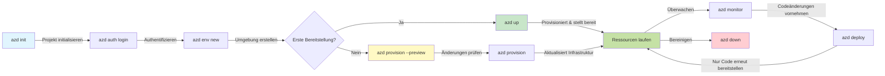
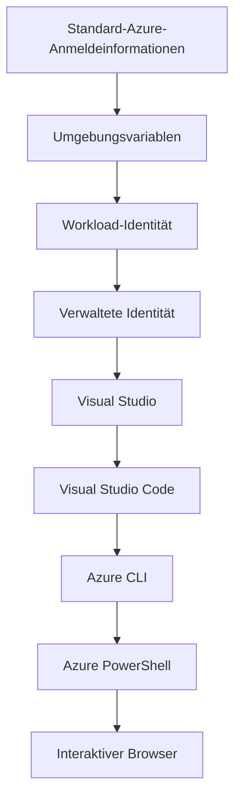

# AZD Grundlagen - Die Azure Developer CLI verstehen

# AZD Grundlagen - Kernkonzepte und Grundlagen

**Kapitel-Navigation:**
- **📚 Kursstart**: [AZD für Anfänger](../../README.md)
- **📖 Aktuelles Kapitel**: Kapitel 1 - Grundlagen & Schnellstart
- **⬅️ Vorheriges**: [Kursübersicht](../../README.md#-chapter-1-foundation--quick-start)
- **➡️ Nächstes**: [Installation & Einrichtung](installation.md)
- **🚀 Nächstes Kapitel**: [Kapitel 2: KI-zentrierte Entwicklung](../chapter-02-ai-development/microsoft-foundry-integration.md)

## Einführung

Diese Lektion führt Sie in die Azure Developer CLI (azd) ein, ein leistungsstarkes Befehlszeilentool, das Ihre Reise von der lokalen Entwicklung zur Bereitstellung in Azure beschleunigt. Sie lernen die grundlegenden Konzepte, Kernfunktionen kennen und verstehen, wie azd die Bereitstellung cloud-nativer Anwendungen vereinfacht.

## Lernziele

Am Ende dieser Lektion werden Sie:
- Verstehen, was die Azure Developer CLI ist und wozu sie primär dient
- Die Kernkonzepte von Vorlagen, Umgebungen und Diensten kennenlernen
- Wichtige Funktionen wie vorlagengetriebene Entwicklung und Infrastruktur als Code erkunden
- Die azd-Projektstruktur und den Workflow verstehen
- Bereit sein, azd für Ihre Entwicklungsumgebung zu installieren und zu konfigurieren

## Lernergebnisse

Nach Abschluss dieser Lektion können Sie:
- Die Rolle von azd in modernen Cloud-Entwicklungs-Workflows erklären
- Die Komponenten einer azd-Projektstruktur identifizieren
- Beschreiben, wie Vorlagen, Umgebungen und Dienste zusammenarbeiten
- Die Vorteile von Infrastructure as Code mit azd verstehen
- Verschiedene azd-Befehle und ihre Zwecke erkennen

## Was ist die Azure Developer CLI (azd)?

Azure Developer CLI (azd) ist ein Befehlszeilentool, das entwickelt wurde, um Ihre Reise von der lokalen Entwicklung zur Bereitstellung in Azure zu beschleunigen. Es vereinfacht den Prozess des Erstellens, Bereitstellens und Verwalten cloud-nativer Anwendungen in Azure.

### 🎯 Warum AZD verwenden? Ein Vergleich aus der Praxis

Vergleichen wir die Bereitstellung einer einfachen Webanwendung mit Datenbank:

#### ❌ OHNE AZD: Manuelle Azure-Bereitstellung (30+ Minuten)

```bash
# Schritt 1: Ressourcengruppe erstellen
az group create --name myapp-rg --location eastus

# Schritt 2: App Service-Plan erstellen
az appservice plan create --name myapp-plan \
  --resource-group myapp-rg \
  --sku B1 --is-linux

# Schritt 3: Web-App erstellen
az webapp create --name myapp-web-unique123 \
  --resource-group myapp-rg \
  --plan myapp-plan \
  --runtime "NODE:18-lts"

# Schritt 4: Cosmos DB-Konto erstellen (10–15 Minuten)
az cosmosdb create --name myapp-cosmos-unique123 \
  --resource-group myapp-rg \
  --kind MongoDB

# Schritt 5: Datenbank erstellen
az cosmosdb mongodb database create \
  --account-name myapp-cosmos-unique123 \
  --resource-group myapp-rg \
  --name tododb

# Schritt 6: Sammlung erstellen
az cosmosdb mongodb collection create \
  --account-name myapp-cosmos-unique123 \
  --resource-group myapp-rg \
  --database-name tododb \
  --name todos

# Schritt 7: Verbindungszeichenfolge abrufen
CONN_STR=$(az cosmosdb keys list \
  --name myapp-cosmos-unique123 \
  --resource-group myapp-rg \
  --type connection-strings \
  --query "connectionStrings[0].connectionString" -o tsv)

# Schritt 8: App-Einstellungen konfigurieren
az webapp config appsettings set \
  --name myapp-web-unique123 \
  --resource-group myapp-rg \
  --settings MONGODB_URI="$CONN_STR"

# Schritt 9: Protokollierung aktivieren
az webapp log config --name myapp-web-unique123 \
  --resource-group myapp-rg \
  --application-logging filesystem \
  --detailed-error-messages true

# Schritt 10: Application Insights einrichten
az monitor app-insights component create \
  --app myapp-insights \
  --location eastus \
  --resource-group myapp-rg

# Schritt 11: App Insights mit der Web-App verknüpfen
INSTRUMENTATION_KEY=$(az monitor app-insights component show \
  --app myapp-insights \
  --resource-group myapp-rg \
  --query "instrumentationKey" -o tsv)

az webapp config appsettings set \
  --name myapp-web-unique123 \
  --resource-group myapp-rg \
  --settings APPINSIGHTS_INSTRUMENTATIONKEY="$INSTRUMENTATION_KEY"

# Schritt 12: Anwendung lokal erstellen
npm install
npm run build

# Schritt 13: Bereitstellungspaket erstellen
zip -r app.zip . -x "*.git*" "node_modules/*"

# Schritt 14: Anwendung bereitstellen
az webapp deployment source config-zip \
  --resource-group myapp-rg \
  --name myapp-web-unique123 \
  --src app.zip

# Schritt 15: Warten und beten, dass es funktioniert 🙏
# (Keine automatische Validierung, manuelle Tests erforderlich)
```

**Probleme:**
- ❌ 15+ Befehle, die man sich merken und in der richtigen Reihenfolge ausführen muss
- ❌ 30–45 Minuten manueller Arbeit
- ❌ Leicht Fehler zu machen (Tippfehler, falsche Parameter)
- ❌ Verbindungszeichenfolgen im Terminalverlauf sichtbar
- ❌ Kein automatischer Rollback bei Fehlern
- ❌ Schwer für Teammitglieder zu reproduzieren
- ❌ Jedes Mal anders (nicht reproduzierbar)

#### ✅ MIT AZD: Automatisierte Bereitstellung (5 Befehle, 10-15 Minuten)

```bash
# Schritt 1: Aus Vorlage initialisieren
azd init --template todo-nodejs-mongo

# Schritt 2: Authentifizieren
azd auth login

# Schritt 3: Umgebung erstellen
azd env new dev

# Schritt 4: Vorschau der Änderungen (optional, aber empfohlen)
azd provision --preview

# Schritt 5: Alles bereitstellen
azd up

# ✨ Fertig! Alles ist bereitgestellt, konfiguriert und überwacht.
```

**Vorteile:**
- ✅ **5 Befehle** vs. 15+ manuelle Schritte
- ✅ **10–15 Minuten** Gesamtzeit (meistens Wartzeiten für Azure)
- ✅ **Keine Fehler** - automatisiert und getestet
- ✅ **Geheimnisse sicher** über Key Vault verwaltet
- ✅ **Automatischer Rollback** bei Fehlern
- ✅ **Vollständig reproduzierbar** - jedes Mal dasselbe Ergebnis
- ✅ **Teamfähig** - jeder kann mit denselben Befehlen bereitstellen
- ✅ **Infrastructure as Code** - versionierte Bicep-Vorlagen
- ✅ **Integrierte Überwachung** - Application Insights wird automatisch konfiguriert

### 📊 Zeit- und Fehlerreduktion

| Metrik | Manuelle Bereitstellung | AZD-Bereitstellung | Verbesserung |
|:-------|:------------------|:---------------|:------------|
| **Befehle** | 15+ | 5 | 67% weniger |
| **Zeit** | 30-45 min | 10-15 min | 60% schneller |
| **Fehlerquote** | ~40% | <5% | 88% Reduktion |
| **Konsistenz** | Niedrig (manuell) | 100% (automatisiert) | Perfekt |
| **Team-Onboarding** | 2-4 Stunden | 30 Minuten | 75% schneller |
| **Rollback-Zeit** | 30+ min (manuell) | 2 min (automatisiert) | 93% schneller |

## Kernkonzepte

### Vorlagen
Vorlagen sind die Grundlage von azd. Sie enthalten:
- **Anwendungscode** - Ihr Quellcode und Abhängigkeiten
- **Infrastrukturdefinitionen** - Azure-Ressourcen, definiert in Bicep oder Terraform
- **Konfigurationsdateien** - Einstellungen und Umgebungsvariablen
- **Bereitstellungsskripte** - Automatisierte Bereitstellungsabläufe

### Umgebungen
Umgebungen repräsentieren verschiedene Bereitstellungsziele:
- **Entwicklung** - Für Tests und Entwicklung
- **Staging** - Vorproduktionsumgebung
- **Produktion** - Live-Produktionsumgebung

Jede Umgebung verwaltet ihre eigene:
- Azure-Ressourcengruppe
- Konfigurationseinstellungen
- Bereitstellungsstatus

### Dienste
Dienste sind die Bausteine Ihrer Anwendung:
- **Frontend** - Webanwendungen, SPAs
- **Backend** - APIs, Microservices
- **Datenbank** - Datenspeicherlösungen
- **Speicher** - Datei- und Blob-Speicher

## Hauptmerkmale

### 1. Vorlagenbasierte Entwicklung
```bash
# Verfügbare Vorlagen durchsuchen
azd template list

# Aus einer Vorlage initialisieren
azd init --template <template-name>
```

### 2. Infrastruktur als Code
- **Bicep** - Azures domänenspezifische Sprache
- **Terraform** - Multi-Cloud-Infrastruktur-Tool
- **ARM Templates** - Azure Resource Manager-Vorlagen

### 3. Integrierte Workflows
```bash
# Vollständiger Bereitstellungs-Workflow
azd up            # Provisionierung + Bereitstellung – dies ist für die Erstkonfiguration vollständig automatisiert

# 🧪 NEU: Vorschau von Infrastrukturänderungen vor der Bereitstellung (SICHER)
azd provision --preview    # Infrastruktur-Bereitstellung simulieren, ohne Änderungen vorzunehmen

azd provision     # Azure-Ressourcen erstellen – verwenden Sie dies, wenn Sie die Infrastruktur aktualisieren
azd deploy        # Anwendungs-Code bereitstellen oder nach einem Update erneut bereitstellen
azd down          # Ressourcen bereinigen
```

#### 🛡️ Sichere Infrastrukturplanung mit Preview
Der Befehl `azd provision --preview` ist ein Wendepunkt für sichere Bereitstellungen:
- **Trockenlaufanalyse** - Zeigt, was erstellt, geändert oder gelöscht wird
- **Kein Risiko** - Es werden keine tatsächlichen Änderungen an Ihrer Azure-Umgebung vorgenommen
- **Teamzusammenarbeit** - Vorschauergebnisse vor der Bereitstellung teilen
- **Kostenschätzung** - Verstehen der Ressourcenkosten vor der Verpflichtung

```bash
# Beispiel-Vorschau-Workflow
azd provision --preview           # Sehen Sie, was sich ändern wird
# Überprüfen Sie die Ausgabe, besprechen Sie sie mit dem Team
azd provision                     # Wenden Sie Änderungen mit Zuversicht an
```

### 📊 Visualisierung: AZD-Entwicklungs-Workflow


**Ablaufbeschreibung:**
1. **Init** - Mit Vorlage oder neuem Projekt starten
2. **Auth** - Bei Azure authentifizieren
3. **Environment** - Isolierte Bereitstellungsumgebung erstellen
4. **Preview** - 🆕 Infrastrukturänderungen zuerst immer in der Vorschau anzeigen (sichere Praxis)
5. **Provision** - Azure-Ressourcen erstellen/aktualisieren
6. **Deploy** - Ihren Anwendungscode bereitstellen
7. **Monitor** - Anwendungsleistung überwachen
8. **Iterate** - Änderungen vornehmen und Code erneut bereitstellen
9. **Cleanup** - Ressourcen nach Abschluss entfernen

### 4. Umgebungsverwaltung
```bash
# Erstellen und Verwalten von Umgebungen
azd env new <environment-name>
azd env select <environment-name>
azd env list
```

## 📁 Projektstruktur

Eine typische azd-Projektstruktur:
```
my-app/
├── .azd/                    # azd configuration
│   └── config.json
├── .azure/                  # Azure deployment artifacts
├── .devcontainer/          # Development container config
├── .github/workflows/      # GitHub Actions
├── .vscode/               # VS Code settings
├── infra/                 # Infrastructure code
│   ├── main.bicep        # Main infrastructure template
│   ├── main.parameters.json
│   └── modules/          # Reusable modules
├── src/                  # Application source code
│   ├── api/             # Backend services
│   └── web/             # Frontend application
├── azure.yaml           # azd project configuration
└── README.md
```

## 🔧 Konfigurationsdateien

### azure.yaml
Die Hauptprojektkonfigurationsdatei:
```yaml
name: my-awesome-app
metadata:
  template: my-template@1.0.0

services:
  web:
    project: ./src/web
    language: js
    host: appservice
  api:
    project: ./src/api
    language: js
    host: appservice

hooks:
  preprovision:
    shell: pwsh
    run: echo "Preparing to provision..."
```

### .azure/config.json
Umgebungsspezifische Konfiguration:
```json
{
  "version": 1,
  "defaultEnvironment": "dev",
  "environments": {
    "dev": {
      "subscriptionId": "your-subscription-id",
      "location": "eastus"
    }
  }
}
```

## 🎪 Häufige Workflows mit praktischen Übungen

> **💡 Lerntipp:** Folgen Sie diesen Übungen der Reihe nach, um Ihre AZD-Fähigkeiten schrittweise aufzubauen.

### 🎯 Übung 1: Initialisieren Sie Ihr erstes Projekt

**Ziel:** Erstellen Sie ein AZD-Projekt und erkunden Sie dessen Struktur

**Schritte:**
```bash
# Verwenden Sie eine erprobte Vorlage
azd init --template todo-nodejs-mongo

# Untersuchen Sie die generierten Dateien
ls -la  # Zeigen Sie alle Dateien an, einschließlich versteckter Dateien

# Wichtige erstellte Dateien:
# - azure.yaml (Hauptkonfiguration)
# - infra/ (Infrastrukturcode)
# - src/ (Anwendungscode)
```

**✅ Erfolg:** Sie haben die Datei azure.yaml sowie die Verzeichnisse infra/ und src/

---

### 🎯 Übung 2: In Azure bereitstellen

**Ziel:** End-to-End-Bereitstellung abschließen

**Schritte:**
```bash
# 1. Authentifizieren
az login && azd auth login

# 2. Umgebung erstellen
azd env new dev
azd env set AZURE_LOCATION eastus

# 3. Änderungen in der Vorschau anzeigen (EMPFOHLEN)
azd provision --preview

# 4. Alles bereitstellen
azd up

# 5. Bereitstellung überprüfen
azd show    # Zeige die URL deiner App an
```

**Erwartete Zeit:** 10–15 Minuten  
**✅ Erfolg:** Die Anwendungs-URL öffnet sich im Browser

---

### 🎯 Übung 3: Mehrere Umgebungen

**Ziel:** In dev und staging bereitstellen

**Schritte:**
```bash
# dev ist bereits vorhanden, staging erstellen
azd env new staging
azd env set AZURE_LOCATION westus2
azd up

# Zwischen ihnen wechseln
azd env list
azd env select dev
```

**✅ Erfolg:** Zwei separate Ressourcengruppen im Azure-Portal

---

### 🛡️ Sauberer Neuanfang: `azd down --force --purge`

Wenn Sie vollständig zurücksetzen müssen:

```bash
azd down --force --purge
```

**Was es bewirkt:**
- `--force`: Keine Bestätigungsaufforderungen
- `--purge`: Löscht gesamten lokalen Zustand und Azure-Ressourcen

**Verwenden, wenn:**
- Die Bereitstellung teilweise fehlgeschlagen ist
- Projekte gewechselt werden
- Ein frischer Start erforderlich ist

---

## 🎪 Ursprüngliche Workflow-Referenz

### Start eines neuen Projekts
```bash
# Methode 1: Bestehende Vorlage verwenden
azd init --template todo-nodejs-mongo

# Methode 2: Von Grund auf neu beginnen
azd init

# Methode 3: Aktuelles Verzeichnis verwenden
azd init .
```

### Entwicklungszyklus
```bash
# Entwicklungsumgebung einrichten
azd auth login
azd env new dev
azd env select dev

# Alles bereitstellen
azd up

# Änderungen vornehmen und neu bereitstellen
azd deploy

# Nach Abschluss aufräumen
azd down --force --purge # Der Befehl in der Azure Developer CLI ist ein **harter Reset** für Ihre Umgebung—besonders nützlich, wenn Sie fehlgeschlagene Bereitstellungen beheben, verwaiste Ressourcen bereinigen oder eine frische Neu-Bereitstellung vorbereiten.
```

## Verständnis von `azd down --force --purge`
Der Befehl `azd down --force --purge` ist eine leistungsstarke Möglichkeit, Ihre azd-Umgebung und alle zugehörigen Ressourcen vollständig abzubauen. Hier ist eine Aufschlüsselung dessen, was jedes Flag bewirkt:
```
--force
```
- Überspringt Bestätigungsaufforderungen.
- Nützlich für Automatisierung oder Skripting, wenn manuelle Eingaben nicht möglich sind.
- Stellt sicher, dass der Abbau ohne Unterbrechung fortgesetzt wird, selbst wenn die CLI Inkonsistenzen erkennt.

```
--purge
```
Löscht **alle zugehörigen Metadaten**, einschließlich:
Umgebungszustand
Lokaler `.azure`-Ordner
Zwischengespeicherte Bereitstellungsinformationen
Verhindert, dass azd sich an vorherige Bereitstellungen "erinnert", was zu Problemen wie nicht übereinstimmenden Ressourcengruppen oder veralteten Registrierungsreferenzen führen kann.


### Warum beide verwenden?
Wenn Sie bei `azd up` aufgrund von verbleibendem Zustand oder partiellen Bereitstellungen auf Hindernisse stoßen, sorgt diese Kombination für einen **sauberen Neuanfang**.

Sie ist besonders hilfreich nach manuellen Ressourcenlöschungen im Azure-Portal oder beim Wechsel von Vorlagen, Umgebungen oder Namenskonventionen für Ressourcengruppen.


### Verwaltung mehrerer Umgebungen
```bash
# Staging-Umgebung erstellen
azd env new staging
azd env select staging
azd up

# Zurück zu dev wechseln
azd env select dev

# Umgebungen vergleichen
azd env list
```

## 🔐 Authentifizierung und Anmeldeinformationen

Das Verständnis der Authentifizierung ist entscheidend für erfolgreiche azd-Bereitstellungen. Azure verwendet mehrere Authentifizierungsmethoden, und azd nutzt dieselbe Anmeldekette wie andere Azure-Tools.

### Azure CLI-Authentifizierung (`az login`)

Bevor Sie azd verwenden, müssen Sie sich bei Azure authentifizieren. Die gebräuchlichste Methode ist die Verwendung der Azure CLI:

```bash
# Interaktive Anmeldung (öffnet den Browser)
az login

# Anmeldung mit bestimmtem Mandanten
az login --tenant <tenant-id>

# Anmeldung mit Dienstprinzipal
az login --service-principal -u <app-id> -p <password> --tenant <tenant-id>

# Aktuellen Anmeldestatus prüfen
az account show

# Verfügbare Abonnements auflisten
az account list --output table

# Standardabonnement festlegen
az account set --subscription <subscription-id>
```

### Authentifizierungsablauf
1. **Interaktive Anmeldung**: Öffnet Ihren Standardbrowser zur Authentifizierung
2. **Device-Code-Flow**: Für Umgebungen ohne Browserzugang
3. **Service Principal**: Für Automatisierungs- und CI/CD-Szenarien
4. **Managed Identity**: Für in Azure gehostete Anwendungen

### DefaultAzureCredential-Kette

`DefaultAzureCredential` ist ein Anmeldeinformationstyp, der ein vereinfachtes Authentifizierungserlebnis bietet, indem er automatisch mehrere Anmeldequellen in einer bestimmten Reihenfolge ausprobiert:

#### Reihenfolge der Anmeldequellen

#### 1. Umgebungsvariablen
```bash
# Umgebungsvariablen für den Service Principal setzen
export AZURE_CLIENT_ID="<app-id>"
export AZURE_CLIENT_SECRET="<password>"
export AZURE_TENANT_ID="<tenant-id>"
```

#### 2. Workload Identity (Kubernetes/GitHub Actions)
Wird automatisch verwendet in:
- Azure Kubernetes Service (AKS) mit Workload Identity
- GitHub Actions mit OIDC-Föderation
- Anderen föderierten Identitätsszenarien

#### 3. Managed Identity
Für Azure-Ressourcen wie:
- Virtuelle Maschinen
- App Service
- Azure Functions
- Container Instances

```bash
# Prüfen, ob es auf einer Azure-Ressource mit verwalteter Identität ausgeführt wird
az account show --query "user.type" --output tsv
# Gibt zurück: "servicePrincipal", wenn eine verwaltete Identität verwendet wird
```

#### 4. Integration von Entwickler-Tools
- **Visual Studio**: Verwendet automatisch das angemeldete Konto
- **VS Code**: Verwendet Anmeldeinformationen der Azure Account-Erweiterung
- **Azure CLI**: Verwendet `az login`-Anmeldeinformationen (am häufigsten für lokale Entwicklung)

### AZD-Authentifizierung einrichten

```bash
# Methode 1: Azure CLI verwenden (empfohlen für die Entwicklung)
az login
azd auth login  # Verwendet vorhandene Azure CLI-Anmeldeinformationen

# Methode 2: Direkte azd-Authentifizierung
azd auth login --use-device-code  # Für Headless-Umgebungen

# Methode 3: Authentifizierungsstatus prüfen
azd auth login --check-status

# Methode 4: Abmelden und erneut authentifizieren
azd auth logout
azd auth login
```

### Best Practices zur Authentifizierung

#### Für lokale Entwicklung
```bash
# 1. Mit Azure CLI anmelden
az login

# 2. Richtiges Abonnement überprüfen
az account show
az account set --subscription "Your Subscription Name"

# 3. azd mit vorhandenen Anmeldeinformationen verwenden
azd auth login
```

#### Für CI/CD-Pipelines
```yaml
# GitHub Actions example
- name: Azure Login
  uses: azure/login@v1
  with:
    creds: ${{ secrets.AZURE_CREDENTIALS }}

- name: Deploy with azd
  run: |
    azd auth login --client-id ${{ secrets.AZURE_CLIENT_ID }} \
                    --client-secret ${{ secrets.AZURE_CLIENT_SECRET }} \
                    --tenant-id ${{ secrets.AZURE_TENANT_ID }}
    azd up --no-prompt
```

#### Für Produktionsumgebungen
- Verwenden Sie **Managed Identity**, wenn auf Azure-Ressourcen ausgeführt
- Verwenden Sie **Service Principal** für Automatisierungsszenarien
- Vermeiden Sie das Speichern von Anmeldeinformationen im Code oder in Konfigurationsdateien
- Verwenden Sie **Azure Key Vault** für sensible Konfigurationen

### Häufige Authentifizierungsprobleme und Lösungen

#### Problem: "No subscription found"
```bash
# Lösung: Standardabonnement festlegen
az account list --output table
az account set --subscription "<subscription-id>"
azd env set AZURE_SUBSCRIPTION_ID "<subscription-id>"
```

#### Problem: "Insufficient permissions"
```bash
# Lösung: Erforderliche Rollen prüfen und zuweisen
az role assignment list --assignee $(az account show --query user.name --output tsv)

# Häufig benötigte Rollen:
# - Mitwirkender (für die Ressourcenverwaltung)
# - Benutzerzugriffsadministrator (für Rollenzuweisungen)
```

#### Problem: "Token expired"
```bash
# Lösung: Erneut authentifizieren
az logout
az login
azd auth logout
azd auth login
```

### Authentifizierung in verschiedenen Szenarien

#### Lokale Entwicklung
```bash
# Konto für persönliche Entwicklung
az login
azd auth login
```

#### Team-Entwicklung
```bash
# Verwende einen bestimmten Mandanten für die Organisation
az login --tenant contoso.onmicrosoft.com
azd auth login
```

#### Multi-Tenant-Szenarien
```bash
# Zwischen Mandanten wechseln
az login --tenant tenant1.onmicrosoft.com
# An Mandant 1 bereitstellen
azd up

az login --tenant tenant2.onmicrosoft.com  
# An Mandant 2 bereitstellen
azd up
```

### Sicherheitsaspekte

1. **Speicherung von Anmeldeinformationen**: Speichern Sie niemals Anmeldeinformationen im Quellcode
2. **Einschränkung des Umfangs**: Verwenden Sie das Prinzip der minimalen Rechte für Service Principals
3. **Token-Rotation**: Drehen Sie Service Principal-Geheimnisse regelmäßig
4. **Audit-Trail**: Überwachen Sie Authentifizierungs- und Bereitstellungsaktivitäten
5. **Netzwerksicherheit**: Verwenden Sie nach Möglichkeit private Endpunkte

### Fehlerbehebung bei der Authentifizierung

```bash
# Authentifizierungsprobleme untersuchen
azd auth login --check-status
az account show
az account get-access-token

# Gängige Diagnosebefehle
whoami                          # Aktueller Benutzerkontext
az ad signed-in-user show      # Azure AD-Benutzerdetails
az group list                  # Ressourcenzugriff testen
```

## Verständnis von `azd down --force --purge`

### Erkennung
```bash
azd template list              # Vorlagen durchsuchen
azd template show <template>   # Details zur Vorlage
azd init --help               # Initialisierungsoptionen
```

### Projektverwaltung
```bash
azd show                     # Projektübersicht
azd env show                 # Aktuelle Umgebung
azd config list             # Konfigurationseinstellungen
```

### Überwachung
```bash
azd monitor                  # Azure-Portal-Überwachung öffnen
azd monitor --logs           # Anwendungsprotokolle anzeigen
azd monitor --live           # Live-Metriken anzeigen
azd pipeline config          # CI/CD einrichten
```

## Best Practices

### 1. Verwenden Sie aussagekräftige Namen
```bash
# Gut
azd env new production-east
azd init --template web-app-secure

# Vermeiden
azd env new env1
azd init --template template1
```

### 2. Vorlagen nutzen
- Beginnen Sie mit vorhandenen Vorlagen
- Passen Sie sie an Ihre Bedürfnisse an
- Erstellen Sie wiederverwendbare Vorlagen für Ihre Organisation

### 3. Isolierung von Umgebungen
- Verwenden Sie separate Umgebungen für Entwicklung/Staging/Produktion
- Bereitstellen Sie niemals direkt in Produktion von einer lokalen Maschine
- Verwenden Sie CI/CD-Pipelines für Produktionsbereitstellungen

### 4. Konfigurationsverwaltung
- Verwenden Sie Umgebungsvariablen für sensible Daten
- Bewahren Sie Konfiguration in der Versionskontrolle auf
- Dokumentieren Sie umgebungsspezifische Einstellungen

## Lernfortschritt

### Anfänger (Woche 1-2)
1. Installieren Sie azd und authentifizieren Sie sich
2. Stellen Sie eine einfache Vorlage bereit
3. Verstehen Sie die Projektstruktur
4. Lernen Sie grundlegende Befehle (up, down, deploy)

### Fortgeschritten (Woche 3-4)
1. Vorlagen anpassen
2. Mehrere Umgebungen verwalten
3. Infrastruktur-Code verstehen
4. CI/CD-Pipelines einrichten

### Experte (Woche 5+)
1. Eigene Vorlagen erstellen
2. Fortgeschrittene Infrastrukturpatterns
3. Multi-Region-Bereitstellungen
4. Unternehmensfähige Konfigurationen

## Nächste Schritte

**📖 Kapitel 1 fortsetzen:**
- [Installation & Einrichtung](installation.md) - AZD installieren und konfigurieren
- [Dein erstes Projekt](first-project.md) - Komplettes praktisches Tutorial
- [Konfigurationshandbuch](configuration.md) - Erweiterte Konfigurationsoptionen

**🎯 Bereit für das nächste Kapitel?**
- [Kapitel 2: KI-Zentrierte Entwicklung](../chapter-02-ai-development/microsoft-foundry-integration.md) - Beginne mit dem Erstellen von KI-Anwendungen

## Zusätzliche Ressourcen

- [Azure Developer CLI Übersicht](https://learn.microsoft.com/en-us/azure/developer/azure-developer-cli/)
- [Vorlagengalerie](https://azure.github.io/awesome-azd/)
- [Community-Beispiele](https://github.com/Azure-Samples)

---

## 🙋 Häufig gestellte Fragen

### Allgemeine Fragen

**Q: What's the difference between AZD and Azure CLI?**

A: Azure CLI (`az`) ist zum Verwalten einzelner Azure-Ressourcen gedacht. AZD (`azd`) dient zur Verwaltung kompletter Anwendungen:

```bash
# Azure CLI - Ressourcenverwaltung auf niedriger Ebene
az webapp create --name myapp --resource-group rg
az sql server create --name myserver --resource-group rg
# ...viele weitere Befehle erforderlich

# AZD - Verwaltung auf Anwendungsebene
azd up  # Stellt die gesamte Anwendung mit allen Ressourcen bereit
```

**Stell dir das so vor:**
- `az` = Arbeiten an einzelnen Lego-Steinen
- `azd` = Arbeiten mit kompletten Lego-Sets

---

**Q: Do I need to know Bicep or Terraform to use AZD?**

A: Nein! Beginne mit Vorlagen:
```bash
# Bestehende Vorlage verwenden - keine IaC-Kenntnisse erforderlich
azd init --template todo-nodejs-mongo
azd up
```

Du kannst Bicep später lernen, um die Infrastruktur anzupassen. Vorlagen liefern funktionierende Beispiele, von denen du lernen kannst.

---

**Q: How much does it cost to run AZD templates?**

A: Die Kosten variieren je nach Vorlage. Die meisten Entwicklungsvorlagen kosten 50-150 $/Monat:

```bash
# Vorschau der Kosten vor der Bereitstellung
azd provision --preview

# Bei Nichtgebrauch immer bereinigen
azd down --force --purge  # Entfernt alle Ressourcen
```

**Pro-Tipp:** Nutze nach Möglichkeit kostenlose Tarife:
- App Service: F1 (Free)-Tarif
- Azure OpenAI: 50.000 Tokens/Monat kostenlos
- Cosmos DB: 1000 RU/s kostenloser Tarif

---

**Q: Can I use AZD with existing Azure resources?**

A: Ja, aber es ist einfacher, neu zu beginnen. AZD funktioniert am besten, wenn es den vollständigen Lebenszyklus verwaltet. Für bestehende Ressourcen:

```bash
# Option 1: Vorhandene Ressourcen importieren (fortgeschritten)
azd init
# Dann infra/ so ändern, dass auf vorhandene Ressourcen verwiesen wird

# Option 2: Neu beginnen (empfohlen)
azd init --template matching-your-stack
azd up  # Erstellt eine neue Umgebung
```

---

**Q: How do I share my project with teammates?**

A: Committe das AZD-Projekt in Git (aber NICHT den .azure-Ordner):

```bash
# Bereits standardmäßig in .gitignore
.azure/        # Enthält Geheimnisse und Umgebungsdaten
*.env          # Umgebungsvariablen

# Teammitglieder damals:
git clone <your-repo>
azd auth login
azd env new <their-name>-dev
azd up
```

Alle erhalten identische Infrastruktur aus denselben Vorlagen.

---

### Fragen zur Fehlerbehebung

**Q: "azd up" failed halfway. What do I do?**

A: Überprüfe den Fehler, behebe ihn und versuche es erneut:

```bash
# Detaillierte Protokolle anzeigen
azd show

# Häufige Lösungen:

# 1. Wenn Kontingent überschritten:
azd env set AZURE_LOCATION "westus2"  # Andere Region ausprobieren

# 2. Bei Namenskonflikt der Ressource:
azd down --force --purge  # Neu anfangen
azd up  # Erneut versuchen

# 3. Wenn die Authentifizierung abgelaufen ist:
az login
azd auth login
azd up
```

**Häufigstes Problem:** Falsches Azure-Abonnement ausgewählt
```bash
az account list --output table
az account set --subscription "<correct-subscription>"
```

---

**Q: How do I deploy just code changes without reprovisioning?**

A: Verwende `azd deploy` anstelle von `azd up`:

```bash
azd up          # Beim ersten Mal: Provisionierung + Bereitstellung (langsam)

# Änderungen am Code vornehmen...

azd deploy      # Bei weiteren Malen: nur Bereitstellung (schnell)
```

Geschwindigkeitsvergleich:
- `azd up`: 10-15 Minuten (provisioniert Infrastruktur)
- `azd deploy`: 2-5 Minuten (nur Code)

---

**Q: Can I customize the infrastructure templates?**

A: Ja! Bearbeite die Bicep-Dateien in `infra/`:

```bash
# Nach azd init
cd infra/
code main.bicep  # In VS Code bearbeiten

# Änderungen anzeigen
azd provision --preview

# Änderungen anwenden
azd provision
```

**Tipp:** Fang klein an – ändere zuerst SKUs:
```bicep
// infra/main.bicep
sku: {
  name: 'B1'  // Change to 'P1V2' for production
}
```

---

**Q: How do I delete everything AZD created?**

A: Ein Befehl entfernt alle Ressourcen:

```bash
azd down --force --purge

# Dies löscht:
# - Alle Azure-Ressourcen
# - Ressourcengruppe
# - Lokaler Zustand der Umgebung
# - Zwischengespeicherte Bereitstellungsdaten
```

**Führe dies immer aus, wenn:**
- Testen einer Vorlage abgeschlossen
- Auf ein anderes Projekt wechselst
- Neu anfangen möchtest

**Einsparungen:** Das Löschen ungenutzter Ressourcen = $0 Kosten

---

**Q: What if I accidentally deleted resources in Azure Portal?**

A: Der AZD-Status kann aus dem Tritt geraten. Vorgehen für einen sauberen Neuanfang:

```bash
# 1. Lokalen Zustand entfernen
azd down --force --purge

# 2. Neu anfangen
azd up

# Alternative: AZD erkennen und beheben lassen
azd provision  # Wird fehlende Ressourcen erstellen
```

---

### Erweiterte Fragen

**Q: Can I use AZD in CI/CD pipelines?**

A: Ja! Beispiel für GitHub Actions:

```yaml
# .github/workflows/deploy.yml
name: Deploy with AZD

on:
  push:
    branches: [main]

jobs:
  deploy:
    runs-on: ubuntu-latest
    steps:
      - uses: actions/checkout@v2
      
      - name: Install azd
        run: curl -fsSL https://aka.ms/install-azd.sh | bash
      
      - name: Azure Login
        run: |
          azd auth login \
            --client-id ${{ secrets.AZURE_CLIENT_ID }} \
            --client-secret ${{ secrets.AZURE_CLIENT_SECRET }} \
            --tenant-id ${{ secrets.AZURE_TENANT_ID }}
      
      - name: Deploy
        run: azd up --no-prompt
```

---

**Q: How do I handle secrets and sensitive data?**

A: AZD integriert sich automatisch mit Azure Key Vault:

```bash
# Geheimnisse werden im Key Vault gespeichert, nicht im Code
azd env set DATABASE_PASSWORD "$(openssl rand -base64 32)"

# AZD führt automatisch aus:
# 1. Erstellt einen Key Vault
# 2. Speichert das Geheimnis
# 3. Gewährt der App Zugriff über eine Managed Identity
# 4. Fügt es zur Laufzeit ein
```

**Niemals einchecken:**
- `.azure/` Ordner (enthält Umgebungsdaten)
- `.env` Dateien (lokale Geheimnisse)
- Verbindungszeichenfolgen

---

**Q: Can I deploy to multiple regions?**

A: Ja, erstelle pro Region eine Umgebung:

```bash
# Ost-US-Umgebung
azd env new prod-eastus
azd env set AZURE_LOCATION eastus
azd up

# Westeuropa-Umgebung
azd env new prod-westeurope
azd env set AZURE_LOCATION westeurope
azd up

# Jede Umgebung ist unabhängig
azd env list
```

Für echte Multi-Region-Anwendungen passe die Bicep-Vorlagen an, um gleichzeitig in mehreren Regionen bereitzustellen.

---

**Q: Where can I get help if I'm stuck?**

1. **AZD-Dokumentation:** https://learn.microsoft.com/azure/developer/azure-developer-cli/
2. **GitHub Issues:** https://github.com/Azure/azure-dev/issues
3. **Discord:** [Azure Discord](https://discord.gg/microsoft-azure) - Kanal #azure-developer-cli
4. **Stack Overflow:** Tag `azure-developer-cli`
5. **Dieser Kurs:** [Fehlerbehebungsleitfaden](../chapter-07-troubleshooting/common-issues.md)

**Pro-Tipp:** Bevor du fragst, führe aus:
```bash
azd show       # Zeigt den aktuellen Status
azd version    # Zeigt Ihre Version
```
Füge diese Informationen deiner Frage bei, um schneller Hilfe zu erhalten.

---

## 🎓 Was kommt als Nächstes?

Du verstehst jetzt die AZD-Grundlagen. Wähle deinen Weg:

### 🎯 Für Anfänger:
1. **Weiter:** [Installation & Einrichtung](installation.md) - Installiere AZD auf deinem Rechner
2. **Dann:** [Dein erstes Projekt](first-project.md) - Stelle deine erste App bereit
3. **Übe:** Schließe alle 3 Übungen in dieser Lektion ab

### 🚀 Für KI-Entwickler:
1. **Springe zu:** [Kapitel 2: KI-Zentrierte Entwicklung](../chapter-02-ai-development/microsoft-foundry-integration.md)
2. **Bereitstellen:** Starte mit `azd init --template get-started-with-ai-chat`
3. **Lernen:** Baue, während du bereitstellst

### 🏗️ Für erfahrene Entwickler:
1. **Überprüfen:** [Konfigurationshandbuch](configuration.md) - Erweiterte Einstellungen
2. **Erkunden:** [Infrastructure as Code](../chapter-04-infrastructure/provisioning.md) - Detaillierter Einblick in Bicep
3. **Bauen:** Erstelle benutzerdefinierte Vorlagen für deinen Stack

---

**Chapter Navigation:**
- **📚 Kursstart**: [AZD für Anfänger](../../README.md)
- **📖 Aktuelles Kapitel**: Kapitel 1 - Grundlagen & Schnellstart  
- **⬅️ Vorheriges**: [Kursübersicht](../../README.md#-chapter-1-foundation--quick-start)
- **➡️ Weiter**: [Installation & Einrichtung](installation.md)
- **🚀 Nächstes Kapitel**: [Kapitel 2: KI-Zentrierte Entwicklung](../chapter-02-ai-development/microsoft-foundry-integration.md)

---

<!-- CO-OP TRANSLATOR DISCLAIMER START -->
Haftungsausschluss:
Dieses Dokument wurde mithilfe des KI-Übersetzungsdienstes Co-op Translator (https://github.com/Azure/co-op-translator) übersetzt. Obwohl wir uns um Genauigkeit bemühen, beachten Sie bitte, dass automatisierte Übersetzungen Fehler oder Ungenauigkeiten enthalten können. Das Originaldokument in seiner Ursprungssprache sollte als maßgebliche Quelle gelten. Für wichtige Informationen wird eine professionelle menschliche Übersetzung empfohlen. Wir haften nicht für Missverständnisse oder Fehlinterpretationen, die sich aus der Verwendung dieser Übersetzung ergeben.
<!-- CO-OP TRANSLATOR DISCLAIMER END -->