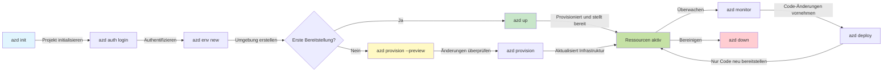
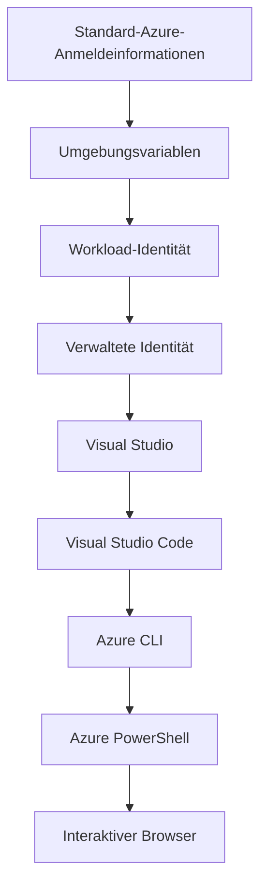

# AZD Basics - Verständnis der Azure Developer CLI

# AZD Basics - Kernkonzepte und Grundlagen

**Chapter Navigation:**
- **📚 Course Home**: [AZD für Einsteiger](../../README.md)
- **📖 Current Chapter**: Kapitel 1 - Grundlagen & Schnellstart
- **⬅️ Previous**: [Kursübersicht](../../README.md#-chapter-1-foundation--quick-start)
- **➡️ Next**: [Installation & Einrichtung](installation.md)
- **🚀 Next Chapter**: [Kapitel 2: KI-fokussierte Entwicklung](../chapter-02-ai-development/microsoft-foundry-integration.md)

## Einführung

Diese Lektion führt Sie in die Azure Developer CLI (azd) ein, ein leistungsfähiges Kommandozeilenwerkzeug, das Ihre Reise von der lokalen Entwicklung zur Bereitstellung in Azure beschleunigt. Sie lernen die grundlegenden Konzepte, Kernfunktionen kennen und verstehen, wie azd die Bereitstellung cloud-nativer Anwendungen vereinfacht.

## Lernziele

Am Ende dieser Lektion werden Sie:
- Verstehen, was die Azure Developer CLI ist und wozu sie primär dient
- Die Kernkonzepte von Vorlagen, Umgebungen und Diensten kennenlernen
- Wichtige Funktionen wie vorlagengetriebene Entwicklung und Infrastructure as Code erkunden
- Die azd-Projektstruktur und den Workflow verstehen
- Bereit sein, azd für Ihre Entwicklungsumgebung zu installieren und zu konfigurieren

## Lernergebnisse

Nach Abschluss dieser Lektion werden Sie in der Lage sein:
- Die Rolle von azd in modernen Cloud-Entwicklungs-Workflows zu erklären
- Die Komponenten einer azd-Projektstruktur zu identifizieren
- Zu beschreiben, wie Vorlagen, Umgebungen und Dienste zusammenarbeiten
- Die Vorteile von Infrastructure as Code mit azd zu verstehen
- Verschiedene azd-Befehle und deren Zweck zu erkennen

## Was ist die Azure Developer CLI (azd)?

Azure Developer CLI (azd) ist ein Kommandozeilenwerkzeug, das entwickelt wurde, um Ihre Reise von der lokalen Entwicklung zur Bereitstellung in Azure zu beschleunigen. Es vereinfacht den Prozess des Erstellens, Bereitstellens und Verwaltens cloud-nativer Anwendungen auf Azure.

### Was können Sie mit azd bereitstellen?

azd unterstützt eine breite Palette von Workloads — und die Liste wächst ständig. Heute können Sie azd verwenden, um Folgendes bereitzustellen:

| Workload Type | Examples | Same Workflow? |
|---------------|----------|----------------|
| **Traditionelle Anwendungen** | Web-Apps, REST-APIs, statische Websites | ✅ `azd up` |
| **Dienste und Microservices** | Container Apps, Function Apps, mehrteilige Backends | ✅ `azd up` |
| **KI-gestützte Anwendungen** | Chat-Anwendungen mit Microsoft Foundry-Modellen, RAG-Lösungen mit AI Search | ✅ `azd up` |
| **Intelligente Agenten** | In Foundry gehostete Agenten, Multi-Agent-Orchestrierungen | ✅ `azd up` |

Die zentrale Erkenntnis ist, dass **der azd-Lifecycle gleich bleibt, unabhängig davon, was Sie bereitstellen**. Sie initialisieren ein Projekt, provisionieren Infrastruktur, deployen Ihren Code, überwachen Ihre App und räumen auf — egal ob es sich um eine einfache Website oder einen komplexen KI-Agenten handelt.

Diese Kontinuität ist beabsichtigt. azd behandelt KI-Funktionen als eine weitere Art von Dienst, die Ihre Anwendung nutzen kann, nicht als etwas grundlegend anderes. Ein Chat-Endpunkt, der von Microsoft Foundry-Modellen unterstützt wird, ist aus azd-Sicht einfach ein weiterer Dienst, der konfiguriert und bereitgestellt werden muss.

### 🎯 Warum AZD verwenden? Ein Vergleich aus der Praxis

Vergleichen wir die Bereitstellung einer einfachen Web-App mit Datenbank:

#### ❌ OHNE AZD: Manuelle Azure-Bereitstellung (30+ Minuten)

```bash
# Schritt 1: Ressourcengruppe erstellen
az group create --name myapp-rg --location eastus

# Schritt 2: App Service-Plan erstellen
az appservice plan create --name myapp-plan \
  --resource-group myapp-rg \
  --sku B1 --is-linux

# Schritt 3: Web‑App erstellen
az webapp create --name myapp-web-unique123 \
  --resource-group myapp-rg \
  --plan myapp-plan \
  --runtime "NODE:18-lts"

# Schritt 4: Cosmos DB‑Konto erstellen (10–15 Minuten)
az cosmosdb create --name myapp-cosmos-unique123 \
  --resource-group myapp-rg \
  --kind MongoDB

# Schritt 5: Datenbank erstellen
az cosmosdb mongodb database create \
  --account-name myapp-cosmos-unique123 \
  --resource-group myapp-rg \
  --name tododb

# Schritt 6: Sammlung erstellen
az cosmosdb mongodb collection create \
  --account-name myapp-cosmos-unique123 \
  --resource-group myapp-rg \
  --database-name tododb \
  --name todos

# Schritt 7: Verbindungszeichenfolge abrufen
CONN_STR=$(az cosmosdb keys list \
  --name myapp-cosmos-unique123 \
  --resource-group myapp-rg \
  --type connection-strings \
  --query "connectionStrings[0].connectionString" -o tsv)

# Schritt 8: App‑Einstellungen konfigurieren
az webapp config appsettings set \
  --name myapp-web-unique123 \
  --resource-group myapp-rg \
  --settings MONGODB_URI="$CONN_STR"

# Schritt 9: Protokollierung aktivieren
az webapp log config --name myapp-web-unique123 \
  --resource-group myapp-rg \
  --application-logging filesystem \
  --detailed-error-messages true

# Schritt 10: Application Insights einrichten
az monitor app-insights component create \
  --app myapp-insights \
  --location eastus \
  --resource-group myapp-rg

# Schritt 11: App Insights mit der Web‑App verknüpfen
INSTRUMENTATION_KEY=$(az monitor app-insights component show \
  --app myapp-insights \
  --resource-group myapp-rg \
  --query "instrumentationKey" -o tsv)

az webapp config appsettings set \
  --name myapp-web-unique123 \
  --resource-group myapp-rg \
  --settings APPINSIGHTS_INSTRUMENTATIONKEY="$INSTRUMENTATION_KEY"

# Schritt 12: Anwendung lokal erstellen
npm install
npm run build

# Schritt 13: Bereitstellungspaket erstellen
zip -r app.zip . -x "*.git*" "node_modules/*"

# Schritt 14: Anwendung bereitstellen
az webapp deployment source config-zip \
  --resource-group myapp-rg \
  --name myapp-web-unique123 \
  --src app.zip

# Schritt 15: Abwarten und hoffen, dass es funktioniert 🙏
# (Keine automatische Validierung, manuelle Tests erforderlich)
```

**Probleme:**
- ❌ 15+ Befehle, die man sich merken und in der richtigen Reihenfolge ausführen muss
- ❌ 30–45 Minuten manueller Aufwand
- ❌ Leicht Fehler zu machen (Tippfehler, falsche Parameter)
- ❌ Verbindungszeichenfolgen in der Terminal-Historie sichtbar
- ❌ Keine automatische Rücksetzung bei Fehlern
- ❌ Schwer für Teammitglieder reproduzierbar
- ❌ Jeder Durchlauf anders (nicht reproduzierbar)

#### ✅ MIT AZD: Automatisierte Bereitstellung (5 Befehle, 10-15 Minuten)

```bash
# Schritt 1: Aus einer Vorlage initialisieren
azd init --template todo-nodejs-mongo

# Schritt 2: Authentifizieren
azd auth login

# Schritt 3: Umgebung erstellen
azd env new dev

# Schritt 4: Änderungen anzeigen (optional, aber empfohlen)
azd provision --preview

# Schritt 5: Alles bereitstellen
azd up

# ✨ Fertig! Alles wurde bereitgestellt, konfiguriert und wird überwacht
```

**Vorteile:**
- ✅ **5 Befehle** vs. 15+ manuelle Schritte
- ✅ **10–15 Minuten** Gesamtzeit (meistens Wartzeit für Azure)
- ✅ **Weniger manuelle Fehler** - konsistenter, vorlagengetriebener Workflow
- ✅ **Sichere Geheimnisverwaltung** - viele Vorlagen nutzen Azure-verwalteten Geheimnisspeicher
- ✅ **Wiederholbare Bereitstellungen** - gleicher Ablauf bei jedem Durchlauf
- ✅ **Voll reproduzierbar** - jedes Mal dasselbe Ergebnis
- ✅ **Teamtauglich** - jeder kann mit denselben Befehlen bereitstellen
- ✅ **Infrastructure as Code** - versionierte Bicep-Vorlagen
- ✅ **Eingebaute Überwachung** - Application Insights automatisch konfiguriert

### 📊 Zeit- & Fehlerreduktion

| Metric | Manual Deployment | AZD Deployment | Improvement |
|:-------|:------------------|:---------------|:------------|
| **Befehle** | 15+ | 5 | 67% weniger |
| **Zeit** | 30-45 min | 10-15 min | 60% schneller |
| **Fehlerquote** | ~40% | <5% | 88% Reduktion |
| **Konsistenz** | Gering (manuell) | 100% (automatisiert) | Perfekt |
| **Team-Einarbeitung** | 2-4 Stunden | 30 Minuten | 75% schneller |
| **Wiederherstellungszeit** | 30+ min (manuell) | 2 min (automatisiert) | 93% schneller |

## Kernkonzepte

### Vorlagen
Vorlagen sind die Grundlage von azd. Sie enthalten:
- **Anwendungscode** - Ihr Quellcode und Abhängigkeiten
- **Infrastrukturdefinitionen** - Azure-Ressourcen definiert in Bicep oder Terraform
- **Konfigurationsdateien** - Einstellungen und Umgebungsvariablen
- **Bereitstellungsskripte** - Automatisierte Bereitstellungsworkflows

### Umgebungen
Umgebungen repräsentieren unterschiedliche Bereitstellungsziele:
- **Development** - Für Tests und Entwicklung
- **Staging** - Pre-Production-Umgebung
- **Production** - Live-Produktionsumgebung

Jede Umgebung pflegt ihre eigenen:
- Azure-Ressourcengruppe
- Konfigurationseinstellungen
- Bereitstellungszustand

### Dienste
Dienste sind die Bausteine Ihrer Anwendung:
- **Frontend** - Webanwendungen, SPAs
- **Backend** - APIs, Microservices
- **Datenbank** - Datenspeicherlösungen
- **Storage** - Datei- und Blob-Speicher

## Wichtige Funktionen

### 1. Vorlagengetriebene Entwicklung
```bash
# Verfügbare Vorlagen durchsuchen
azd template list

# Von einer Vorlage initialisieren
azd init --template <template-name>
```

### 2. Infrastructure as Code
- **Bicep** - Azures domänenspezifische Sprache
- **Terraform** - Multi-Cloud-Infrastrukturtool
- **ARM Templates** - Azure Resource Manager-Vorlagen

### 3. Integrierte Workflows
```bash
# Vollständiger Bereitstellungsablauf
azd up            # Provisionierung + Bereitstellung – dies läuft bei der Ersteinrichtung automatisch ab

# 🧪 NEU: Vorschau von Infrastrukturänderungen vor der Bereitstellung (SICHER)
azd provision --preview    # Infrastrukturbereitstellung simulieren, ohne Änderungen vorzunehmen

azd provision     # Azure-Ressourcen erstellen – wenn Sie die Infrastruktur aktualisieren, verwenden Sie dies
azd deploy        # Anwendungscode bereitstellen oder nach einer Aktualisierung neu bereitstellen
azd down          # Ressourcen bereinigen
```

#### 🛡️ Sichere Infrastrukturplanung mit Preview
Der Befehl `azd provision --preview` ist ein Game-Changer für sichere Bereitstellungen:
- **Trockenlauf-Analyse** - Zeigt, was erstellt, geändert oder gelöscht wird
- **Kein Risiko** - Es werden keine tatsächlichen Änderungen an Ihrer Azure-Umgebung vorgenommen
- **Teamzusammenarbeit** - Preview-Ergebnisse vor der Bereitstellung teilen
- **Kostenschätzung** - Verstehen Sie die Ressourcenkosten vor einer Verpflichtung

```bash
# Beispiel-Vorschau-Workflow
azd provision --preview           # Sehen, was sich ändern wird
# Ausgabe überprüfen, mit dem Team besprechen
azd provision                     # Änderungen mit Zuversicht anwenden
```

### 📊 Visual: AZD-Entwicklungsworkflow


```mermaid
graph LR
    A[azd init] -->|Projekt initialisieren| B[azd auth login]
    B -->|Authentifizieren| C[azd env new]
    C -->|Umgebung erstellen| D{Erste Bereitstellung?}
    D -->|Ja| E[azd up]
    D -->|Nein| F[azd provision --preview]
    F -->|Änderungen überprüfen| G[azd provision]
    E -->|Provisioniert und stellt bereit| H[Ressourcen aktiv]
    G -->|Aktualisiert Infrastruktur| H
    H -->|Überwachen| I[azd monitor]
    I -->|Code-Änderungen vornehmen| J[azd deploy]
    J -->|Nur Code neu bereitstellen| H
    H -->|Bereinigen| K[azd down]
    
    style A fill:#e1f5fe
    style E fill:#c8e6c9
    style F fill:#fff9c4
    style H fill:#c5e1a5
    style K fill:#ffcdd2
```

**Workflow-Erklärung:**
1. **Init** - Mit einer Vorlage oder einem neuen Projekt starten
2. **Auth** - Authentifizieren bei Azure
3. **Environment** - Isolierte Bereitstellungsumgebung erstellen
4. **Preview** - 🆕 Änderungen an der Infrastruktur immer zuerst prüfen (sichere Praxis)
5. **Provision** - Azure-Ressourcen erstellen/aktualisieren
6. **Deploy** - Ihre Anwendungscode bereitstellen
7. **Monitor** - Anwendungsleistung beobachten
8. **Iterate** - Änderungen vornehmen und Code erneut bereitstellen
9. **Cleanup** - Ressourcen entfernen, wenn sie nicht mehr benötigt werden

### 4. Verwaltung von Umgebungen
```bash
# Umgebungen erstellen und verwalten
azd env new <environment-name>
azd env select <environment-name>
azd env list
```

### 5. Erweiterungen und KI-Befehle

azd verwendet ein Erweiterungssystem, um Fähigkeiten über die Kern-CLI hinaus hinzuzufügen. Dies ist besonders nützlich für KI-Workloads:

```bash
# Verfügbare Erweiterungen auflisten
azd extension list

# Die Foundry Agents-Erweiterung installieren
azd extension install azure.ai.agents

# Ein KI-Agentenprojekt aus einem Manifest initialisieren
azd ai agent init -m agent-manifest.yaml

# Einen bereitgestellten Agenten testen (zeigt Latenz und Zeit bis zum ersten Byte)
azd ai agent invoke

# Den MCP-Server für KI-unterstützte Entwicklung starten (Alpha)
azd mcp start
```

**Der Agenten-Lifecycle, von Anfang bis Ende.** Sobald Sie `azure.ai.agents` installiert haben, führt ein einzelner Workflow von der Idee zu einem laufenden, überwachten Agenten. Sie müssen nicht alle diese Schritte am ersten Tag kennen — wissen Sie einfach, dass sie existieren:

| Stage | Command | What it does |
|-------|---------|--------------|
| **Scaffold** | `azd ai agent init -m <manifest>` | Ein Agentenprojekt aus einem Manifest generieren |
| **Test** | `azd ai agent invoke` | Den Agenten aufrufen und Antwortzeiten anzeigen |
| **Measure** | `azd ai agent eval generate` | Einen Evaluierungsdatensatz für den Agenten erstellen |
| **Improve** | `azd ai agent optimize` | Agentenanweisungen anhand Ihrer Daten optimieren |
| **Inspect** | `azd ai agent endpoint show` | Die Konfiguration des Live-Endpunkts anzeigen |
| **Clean up** | `azd ai agent delete` | Einen gehosteten Agenten und alle seine Versionen löschen |

> Erweiterungen werden ausführlich behandelt in [Kapitel 2: KI-fokussierte Entwicklung](../chapter-02-ai-development/agents.md) und im Nachschlagewerk [AZD AI CLI-Befehle](../chapter-08-production/production-ai-practices.md#azd-ai-cli-commands-and-extensions).

## 📁 Projektstruktur

Eine typische azd-Projektstruktur:
```
my-app/
├── .azd/                    # azd configuration
│   └── config.json
├── .azure/                  # Azure deployment artifacts
├── .devcontainer/          # Development container config
├── .github/workflows/      # GitHub Actions
├── .vscode/               # VS Code settings
├── infra/                 # Infrastructure code
│   ├── main.bicep        # Main infrastructure template
│   ├── main.parameters.json
│   └── modules/          # Reusable modules
├── src/                  # Application source code
│   ├── api/             # Backend services
│   └── web/             # Frontend application
├── azure.yaml           # azd project configuration
└── README.md
```

## 🔧 Konfigurationsdateien

### azure.yaml
Die Hauptprojektkonfigurationsdatei:
```yaml
name: my-awesome-app
metadata:
  template: my-template@1.0.0

services:
  web:
    project: ./src/web
    language: js
    host: appservice
  api:
    project: ./src/api
    language: js
    host: appservice

hooks:
  preprovision:
    shell: pwsh
    run: echo "Preparing to provision..."
```

### .azure/config.json
Umgebungsspezifische Konfiguration:
```json
{
  "version": 1,
  "defaultEnvironment": "dev",
  "environments": {
    "dev": {
      "subscriptionId": "your-subscription-id",
      "location": "eastus"
    }
  }
}
```

## 🎪 Übliche Workflows mit praxisnahen Übungen

> **💡 Lerntipp:** Führen Sie diese Übungen der Reihe nach aus, um Ihre AZD-Fähigkeiten schrittweise aufzubauen.

### 🎯 Übung 1: Ihr erstes Projekt initialisieren

**Ziel:** Ein AZD-Projekt erstellen und dessen Struktur erkunden

**Schritte:**
```bash
# Verwenden Sie eine bewährte Vorlage
azd init --template todo-nodejs-mongo

# Untersuchen Sie die generierten Dateien
ls -la  # Alle Dateien anzeigen, einschließlich versteckter Dateien

# Wichtige erstellte Dateien:
# - azure.yaml (Hauptkonfiguration)
# - infra/ (Infrastrukturcode)
# - src/ (Anwendungscode)
```

**✅ Erfolg:** Sie haben azure.yaml, infra/ und src/ Verzeichnisse

---

### 🎯 Übung 2: In Azure bereitstellen

**Ziel:** Ende-zu-Ende-Bereitstellung abschließen

**Schritte:**
```bash
# 1. Authentifizieren
az login && azd auth login

# 2. Umgebung erstellen
azd env new dev
azd env set AZURE_LOCATION eastus

# 3. Änderungen vorschauen (EMPFOHLEN)
azd provision --preview

# 4. Alles bereitstellen
azd up

# 5. Bereitstellung überprüfen
azd show    # App-URL anzeigen
```

**Erwartete Zeit:** 10-15 Minuten  
**✅ Erfolg:** Die Anwendungs-URL öffnet sich im Browser

---

### 🎯 Übung 3: Mehrere Umgebungen

**Ziel:** In dev und staging bereitstellen

**Schritte:**
```bash
# Wenn dev bereits vorhanden ist, erstelle staging
azd env new staging
azd env set AZURE_LOCATION westus2
azd up

# Zwischen ihnen wechseln
azd env list
azd env select dev
```

**✅ Erfolg:** Zwei separate Ressourcengruppen im Azure-Portal

---

### 🛡️ Sauberer Neustart: `azd down --force --purge`

Wenn Sie einen kompletten Reset benötigen:

```bash
azd down --force --purge
```

**Was es macht:**
- `--force`: Keine Bestätigungsaufforderungen
- `--purge`: Löscht alle lokalen Zustände und Azure-Ressourcen

**Verwenden, wenn:**
- Die Bereitstellung mitten im Prozess fehlgeschlagen ist
- Projekte gewechselt werden
- Ein frischer Start benötigt wird

---

## 🎪 Ursprüngliche Workflow-Referenz

### Ein neues Projekt starten
```bash
# Methode 1: Vorhandene Vorlage verwenden
azd init --template todo-nodejs-mongo

# Methode 2: Von Grund auf neu beginnen
azd init

# Methode 3: Aktuelles Verzeichnis verwenden
azd init .
```

### Entwicklungszyklus
```bash
# Entwicklungsumgebung einrichten
azd auth login
azd env new dev
azd env select dev

# Alles bereitstellen
azd up

# Änderungen vornehmen und erneut bereitstellen
azd deploy

# Aufräumen, wenn fertig
azd down --force --purge # Der Befehl in der Azure Developer CLI ist ein **vollständiger Reset** für Ihre Umgebung—besonders nützlich, wenn Sie fehlgeschlagene Bereitstellungen beheben, verwaiste Ressourcen bereinigen oder sich auf eine neue Bereitstellung vorbereiten.
```

## Das Kommando `azd down --force --purge` verstehen
Der Befehl `azd down --force --purge` ist ein mächtiges Mittel, um Ihre azd-Umgebung und alle zugehörigen Ressourcen vollständig abzubauen. Hier ist eine Aufschlüsselung dessen, was jeder Schalter bewirkt:
```
--force
```
- Überspringt Bestätigungsaufforderungen.
- Nützlich für Automatisierung oder Skripting, wenn manuelle Eingaben nicht möglich sind.
- Stellt sicher, dass die Bereinigung ohne Unterbrechung fortgesetzt wird, auch wenn die CLI Inkonsistenzen erkennt.

```
--purge
```
Löscht **alle zugehörigen Metadaten**, einschließlich:
Umgebungszustand
Lokaler `.azure`-Ordner
Zwischengespeicherte Bereitstellungsinformationen
Verhindert, dass azd frühere Bereitstellungen "beibehält", was Probleme wie nicht übereinstimmende Ressourcengruppen oder veraltete Registry-Verweise verursachen kann.


### Warum beide verwenden?
Wenn Sie bei `azd up` wegen verbleibendem Zustand oder partiellen Bereitstellungen auf ein Problem stoßen, sorgt diese Kombination für eine **saubere Ausgangsbasis**.

Es ist besonders hilfreich nach manuellen Ressourcengelöschten im Azure-Portal oder beim Wechseln von Vorlagen, Umgebungen oder Namenskonventionen für Ressourcengruppen.


### Verwaltung mehrerer Umgebungen
```bash
# Staging-Umgebung erstellen
azd env new staging
azd env select staging
azd up

# Zurück zur Entwicklungsumgebung wechseln
azd env select dev

# Umgebungen vergleichen
azd env list
```

## 🔐 Authentifizierung und Anmeldeinformationen

Das Verständnis der Authentifizierung ist entscheidend für erfolgreiche azd-Bereitstellungen. Azure verwendet mehrere Authentifizierungsmethoden, und azd nutzt dieselbe Anmeldekette wie andere Azure-Tools.

### Azure CLI-Authentifizierung (`az login`)

Bevor Sie azd verwenden, müssen Sie sich bei Azure authentifizieren. Die gebräuchlichste Methode ist die Verwendung der Azure CLI:

```bash
# Interaktive Anmeldung (öffnet den Browser)
az login

# Anmeldung mit spezifischem Mandanten
az login --tenant <tenant-id>

# Anmeldung mit Dienstprinzipal
az login --service-principal -u <app-id> -p <password> --tenant <tenant-id>

# Aktuellen Anmeldestatus prüfen
az account show

# Verfügbare Abonnements auflisten
az account list --output table

# Standardabonnement festlegen
az account set --subscription <subscription-id>
```

### Authentifizierungsfluss
1. **Interaktive Anmeldung**: Öffnet Ihren Standardbrowser zur Authentifizierung
2. **Device-Code-Fluss**: Für Umgebungen ohne Browserzugriff
3. **Service Principal**: Für Automatisierungs- und CI/CD-Szenarien
4. **Managed Identity**: Für in Azure gehostete Anwendungen

### DefaultAzureCredential-Kette

`DefaultAzureCredential` ist ein Credential-Typ, der ein vereinfachtes Authentifizierungserlebnis bietet, indem er automatisch mehrere Anmeldequellen in einer bestimmten Reihenfolge ausprobiert:

#### Reihenfolge der Anmeldeinformationen

```mermaid
graph TD
    A[Standard-Azure-Anmeldeinformationen] --> B[Umgebungsvariablen]
    B --> C[Workload-Identität]
    C --> D[Verwaltete Identität]
    D --> E[Visual Studio]
    E --> F[Visual Studio Code]
    F --> G[Azure CLI]
    G --> H[Azure PowerShell]
    H --> I[Interaktiver Browser]
```

#### 1. Umgebungsvariablen
```bash
# Umgebungsvariablen für den Dienstprinzipal setzen
export AZURE_CLIENT_ID="<app-id>"
export AZURE_CLIENT_SECRET="<password>"
export AZURE_TENANT_ID="<tenant-id>"
```

#### 2. Workload Identity (Kubernetes/GitHub Actions)
Wird automatisch verwendet in:
- Azure Kubernetes Service (AKS) mit Workload Identity
- GitHub Actions mit OIDC-Föderation
- Anderen föderierten Identitätsszenarien

#### 3. Managed Identity
Für Azure-Ressourcen wie:
- Virtuelle Maschinen
- App Service
- Azure Functions
- Container Instances

```bash
# Prüfen, ob auf einer Azure-Ressource mit verwalteter Identität ausgeführt wird
az account show --query "user.type" --output tsv
# Gibt zurück: "servicePrincipal", wenn eine verwaltete Identität verwendet wird
```

#### 4. Integration von Entwickler-Tools
- **Visual Studio**: Verwendet automatisch das angemeldete Konto
- **VS Code**: Verwendet Anmeldeinformationen der Azure Account-Erweiterung
- **Azure CLI**: Verwendet `az login`-Anmeldeinformationen (am häufigsten für lokale Entwicklung)

### AZD-Authentifizierungseinrichtung

```bash
# Methode 1: Azure CLI verwenden (Empfohlen für die Entwicklung)
az login
azd auth login  # Verwendet vorhandene Azure CLI-Anmeldeinformationen

# Methode 2: Direkte azd-Authentifizierung
azd auth login --use-device-code  # Für Headless-Umgebungen

# Methode 3: Authentifizierungsstatus prüfen
azd auth login --check-status

# Methode 4: Abmelden und erneut authentifizieren
azd auth logout
azd auth login
```

### Best Practices für Authentifizierung

#### Für lokale Entwicklung
```bash
# 1. Mit der Azure CLI anmelden
az login

# 2. Richtiges Abonnement überprüfen
az account show
az account set --subscription "Your Subscription Name"

# 3. azd mit vorhandenen Anmeldeinformationen verwenden
azd auth login
```

#### Für CI/CD-Pipelines
```yaml
# GitHub Actions example
- name: Azure Login
  uses: azure/login@v1
  with:
    creds: ${{ secrets.AZURE_CREDENTIALS }}

- name: Deploy with azd
  run: |
    azd auth login --client-id ${{ secrets.AZURE_CLIENT_ID }} \
                    --client-secret ${{ secrets.AZURE_CLIENT_SECRET }} \
                    --tenant-id ${{ secrets.AZURE_TENANT_ID }}
    azd up --no-prompt
```

#### Für Produktionsumgebungen
- Verwenden Sie **Managed Identity**, wenn auf Azure-Ressourcen ausgeführt
- Verwenden Sie **Service Principal** für Automatisierungsszenarien
- Vermeiden Sie, Anmeldeinformationen im Code oder in Konfigurationsdateien zu speichern
- Verwenden Sie **Azure Key Vault** für sensible Konfiguration

### Häufige Authentifizierungsprobleme und Lösungen

#### Problem: "No subscription found"
```bash
# Lösung: Standardabonnement festlegen
az account list --output table
az account set --subscription "<subscription-id>"
azd env set AZURE_SUBSCRIPTION_ID "<subscription-id>"
```

#### Problem: "Insufficient permissions"
```bash
# Lösung: Erforderliche Rollen prüfen und zuweisen
az role assignment list --assignee $(az account show --query user.name --output tsv)

# Häufig benötigte Rollen:
# - Mitwirkender (für Ressourcenverwaltung)
# - Benutzerzugriffsadministrator (für Rollenzuweisungen)
```

#### Problem: "Token expired"
```bash
# Lösung: Erneut authentifizieren
az logout
az login
azd auth logout
azd auth login
```

### Authentifizierung in verschiedenen Szenarien

#### Lokale Entwicklung
```bash
# Konto für persönliche Weiterentwicklung
az login
azd auth login
```

#### Entwicklung im Team
```bash
# Verwenden Sie einen bestimmten Mandanten für die Organisation
az login --tenant contoso.onmicrosoft.com
azd auth login
```

#### Szenarien mit mehreren Mandanten
```bash
# Zwischen Mandanten wechseln
az login --tenant tenant1.onmicrosoft.com
# An Mandant 1 bereitstellen
azd up

az login --tenant tenant2.onmicrosoft.com  
# An Mandant 2 bereitstellen
azd up
```

### Sicherheitsüberlegungen

1. **Speicherung von Anmeldeinformationen**: Speichern Sie Anmeldeinformationen niemals im Quellcode
2. **Einschränkung des Umfangs**: Verwenden Sie das Prinzip der geringsten Berechtigung für Service Principals
3. **Token-Rotation**: Rotieren Sie regelmäßig die Secrets von Service Principals
4. **Prüfprotokoll**: Überwachen Sie Authentifizierungs- und Bereitstellungsaktivitäten
5. **Netzwerksicherheit**: Verwenden Sie, wenn möglich, private Endpunkte

### Fehlerbehebung bei der Authentifizierung

```bash
# Authentifizierungsprobleme beheben
azd auth login --check-status
az account show
az account get-access-token

# Gängige Diagnosebefehle
whoami                          # Aktueller Benutzerkontext
az ad signed-in-user show      # Microsoft Entra ID-Benutzerdetails
az group list                  # Ressourcenzugriff testen
```

## Verständnis von `azd down --force --purge`

### Erkennung
```bash
azd template list              # Vorlagen durchsuchen
azd template show <template>   # Vorlagendetails
azd init --help               # Initialisierungsoptionen
```

### Projektverwaltung
```bash
azd show                     # Projektübersicht
azd env list                # Verfügbare Umgebungen und ausgewählter Standard
azd config show            # Konfigurationseinstellungen
```

### Überwachung
```bash
azd monitor                  # Azure-Portal-Überwachung öffnen
azd monitor --logs           # Anwendungsprotokolle anzeigen
azd monitor --live           # Live-Metriken anzeigen
azd pipeline config          # CI/CD einrichten
```

## Beste Vorgehensweisen

### 1. Verwenden Sie aussagekräftige Namen
```bash
# Gut
azd env new production-east
azd init --template web-app-secure

# Vermeiden
azd env new env1
azd init --template template1
```

### 2. Vorlagen nutzen
- Beginnen Sie mit vorhandenen Vorlagen
- Passen Sie sie an Ihre Bedürfnisse an
- Erstellen Sie wiederverwendbare Vorlagen für Ihre Organisation

### 3. Isolation der Umgebungen
- Use separate environments for dev/staging/prod
- Niemals direkt von der lokalen Maschine in Produktion bereitstellen
- Verwenden Sie CI/CD-Pipelines für Produktionsbereitstellungen

### 4. Konfigurationsmanagement
- Verwenden Sie Umgebungsvariablen für sensible Daten
- Halten Sie Konfigurationen in der Versionsverwaltung
- Dokumentieren Sie umgebungsspezifische Einstellungen

## Lernfortschritt

### Anfänger (Woche 1-2)
1. Installieren Sie azd und authentifizieren Sie sich
2. Stellen Sie eine einfache Vorlage bereit
3. Verstehen Sie die Projektstruktur
4. Lernen Sie grundlegende Befehle (up, down, deploy)

### Fortgeschrittene (Woche 3-4)
1. Passen Sie Vorlagen an
2. Verwalten Sie mehrere Umgebungen
3. Verstehen Sie Infrastruktur-Code
4. Richten Sie CI/CD-Pipelines ein

### Experten (Woche 5+)
1. Erstellen Sie benutzerdefinierte Vorlagen
2. Erweiterte Infrastruktur-Patterns
3. Bereitstellungen in mehreren Regionen
4. Unternehmensgerechte Konfigurationen

## Nächste Schritte

**📖 Weiter mit Kapitel 1:**
- [Installation & Einrichtung](installation.md) - Installieren und konfigurieren Sie azd
- [Ihr erstes Projekt](first-project.md) - Schließen Sie das praktische Tutorial ab
- [Konfigurationsanleitung](configuration.md) - Erweiterte Konfigurationsoptionen

**🎯 Bereit für das nächste Kapitel?**
- [Kapitel 2: KI-zentrierte Entwicklung](../chapter-02-ai-development/microsoft-foundry-integration.md) - Beginnen Sie mit dem Erstellen von KI-Anwendungen

## Zusätzliche Ressourcen

- [Azure Developer CLI Übersicht](https://learn.microsoft.com/en-us/azure/developer/azure-developer-cli/)
- [Vorlagengalerie](https://azure.github.io/awesome-azd/)
- [Community-Beispiele](https://github.com/Azure-Samples)

---

## 🙋 Häufig gestellte Fragen

### Allgemeine Fragen

**Q: What's the difference between AZD and Azure CLI?**

A: Azure CLI (`az`) dient zur Verwaltung einzelner Azure-Ressourcen. AZD (`azd`) dient zur Verwaltung ganzer Anwendungen:

```bash
# Azure CLI - Ressourcenverwaltung auf niedriger Ebene
az webapp create --name myapp --resource-group rg
az sql server create --name myserver --resource-group rg
# ...viele weitere Befehle erforderlich

# AZD - Verwaltung auf Anwendungsebene
azd up  # Stellt die gesamte Anwendung mit allen Ressourcen bereit
```

**Stellen Sie sich das so vor:**
- `az` = Arbeit an einzelnen Lego-Steinen
- `azd` = Arbeit mit kompletten Lego-Sets

---

**Q: Do I need to know Bicep or Terraform to use AZD?**

A: Nein! Beginnen Sie mit Vorlagen:
```bash
# Vorhandene Vorlage verwenden - keine IaC-Kenntnisse erforderlich
azd init --template todo-nodejs-mongo
azd up
```

Sie können Bicep später lernen, um Infrastruktur anzupassen. Vorlagen liefern funktionierende Beispiele zum Lernen.

---

**Q: How much does it cost to run AZD templates?**

A: Die Kosten variieren je nach Vorlage. Die meisten Entwicklungs-Vorlagen kosten $50-150/Monat:

```bash
# Kosten vor dem Bereitstellen anzeigen
azd provision --preview

# Bei Nichtbenutzung stets bereinigen
azd down --force --purge  # Entfernt alle Ressourcen
```

**Tipp:** Nutzen Sie kostenlose Kontingente, wo verfügbar:
- App Service: F1 (Free) Tarif
- Microsoft Foundry Models: Azure OpenAI 50.000 Tokens/Monat kostenlos
- Cosmos DB: 1000 RU/s kostenloser Tarif

---

**Q: Can I use AZD with existing Azure resources?**

A: Ja, aber es ist einfacher, neu zu starten. AZD funktioniert am besten, wenn es den gesamten Lebenszyklus verwaltet. Für bestehende Ressourcen:

```bash
# Option 1: Vorhandene Ressourcen importieren (für Fortgeschrittene)
azd init
# Dann infra/ anpassen, um auf vorhandene Ressourcen zu verweisen

# Option 2: Neu anfangen (empfohlen)
azd init --template matching-your-stack
azd up  # Erstellt eine neue Umgebung
```

---

**Q: How do I share my project with teammates?**

A: Committen Sie das AZD-Projekt in Git (aber NICHT den .azure-Ordner):

```bash
# Bereits standardmäßig in .gitignore
.azure/        # Enthält Geheimnisse und Umgebungsdaten
*.env          # Umgebungsvariablen

# Teammitglieder dann:
git clone <your-repo>
azd auth login
azd env new <their-name>-dev
azd up
```

Jeder erhält identische Infrastruktur aus denselben Vorlagen.

---

### Fehlerbehebungsfragen

**Q: "azd up" failed halfway. What do I do?**

A: Prüfen Sie den Fehler, beheben Sie ihn und versuchen Sie es erneut:

```bash
# Detaillierte Protokolle anzeigen
azd show

# Häufige Lösungen:

# 1. Wenn das Kontingent überschritten ist:
azd env set AZURE_LOCATION "westus2"  # Versuchen Sie eine andere Region

# 2. Wenn ein Konflikt mit dem Ressourcennamen besteht:
azd down --force --purge  # Zurücksetzen
azd up  # Erneut versuchen

# 3. Wenn die Authentifizierung abgelaufen ist:
az login
azd auth login
azd up
```

**Häufigstes Problem:** Falsches Azure-Abonnement ausgewählt
```bash
az account list --output table
az account set --subscription "<correct-subscription>"
```

---

**Q: How do I deploy just code changes without reprovisioning?**

A: Verwenden Sie `azd deploy` statt `azd up`:

```bash
azd up          # Beim ersten Mal: Provisionierung und Bereitstellung (langsam)

# Code-Änderungen vornehmen...

azd deploy      # Bei späteren Durchläufen: nur Bereitstellung (schnell)
```

Geschwindigkeitsvergleich:
- `azd up`: 10–15 Minuten (provisioniert Infrastruktur)
- `azd deploy`: 2–5 Minuten (nur Code)

---

**Q: Can I customize the infrastructure templates?**

A: Ja! Bearbeiten Sie die Bicep-Dateien in `infra/`:

```bash
# Nach azd init
cd infra/
code main.bicep  # In VS Code bearbeiten

# Änderungen anzeigen
azd provision --preview

# Änderungen anwenden
azd provision
```

**Tipp:** Beginnen Sie klein – ändern Sie zuerst SKUs:
```bicep
// infra/main.bicep
sku: {
  name: 'B1'  // Change to 'P1V2' for production
}
```

---

**Q: How do I delete everything AZD created?**

A: Ein Befehl entfernt alle Ressourcen:

```bash
azd down --force --purge

# Dies löscht:
# - Alle Azure-Ressourcen
# - Ressourcengruppe
# - Lokaler Umgebungszustand
# - Zwischengespeicherte Bereitstellungsdaten
```

**Führen Sie dies immer aus, wenn:**
- Testen einer Vorlage abgeschlossen
- Wechsel zu einem anderen Projekt
- Neu anfangen möchten

**Kosteneinsparung:** Das Löschen ungenutzter Ressourcen = $0 Gebühren

---

**Q: What if I accidentally deleted resources in Azure Portal?**

A: Der AZD-Zustand kann inkonsistent werden. Vorgehen für einen sauberen Neuanfang:

```bash
# 1. Lokalen Zustand entfernen
azd down --force --purge

# 2. Neu anfangen
azd up

# Alternative: AZD erkennen und beheben lassen
azd provision  # Wird fehlende Ressourcen erstellen
```

---

### Fortgeschrittene Fragen

**Q: Can I use AZD in CI/CD pipelines?**

A: Ja! Beispiel für GitHub Actions:

```yaml
# .github/workflows/deploy.yml
name: Deploy with AZD

on:
  push:
    branches: [main]

jobs:
  deploy:
    runs-on: ubuntu-latest
    steps:
      - uses: actions/checkout@v2
      
      - name: Install azd
        run: curl -fsSL https://aka.ms/install-azd.sh | bash
      
      - name: Azure Login
        run: |
          azd auth login \
            --client-id ${{ secrets.AZURE_CLIENT_ID }} \
            --client-secret ${{ secrets.AZURE_CLIENT_SECRET }} \
            --tenant-id ${{ secrets.AZURE_TENANT_ID }}
      
      - name: Deploy
        run: azd up --no-prompt
```

---

**Q: How do I handle secrets and sensitive data?**

A: AZD integriert sich automatisch mit Azure Key Vault:

```bash
# Geheimnisse werden im Key Vault gespeichert, nicht im Code
azd env set DATABASE_PASSWORD "$(openssl rand -base64 32)"

# AZD automatisch:
# 1. Erstellt einen Key Vault
# 2. Speichert ein Geheimnis
# 3. Gewährt der App Zugriff über eine verwaltete Identität
# 4. Injiziert zur Laufzeit
```

**Niemals committen:**
- `.azure/` Ordner (enthält Umgebungsdaten)
- `.env` Dateien (lokale Secrets)
- Verbindungszeichenfolgen

---

**Q: Can I deploy to multiple regions?**

A: Ja, erstellen Sie pro Region eine Umgebung:

```bash
# Umgebung in den östlichen USA
azd env new prod-eastus
azd env set AZURE_LOCATION eastus
azd up

# Umgebung in Westeuropa
azd env new prod-westeurope
azd env set AZURE_LOCATION westeurope
azd up

# Jede Umgebung ist unabhängig
azd env list
```

Für echte Multi-Region-Anwendungen passen Sie die Bicep-Vorlagen an, um gleichzeitig in mehrere Regionen bereitzustellen.

---

**Q: Where can I get help if I'm stuck?**

1. **AZD-Dokumentation:** https://learn.microsoft.com/azure/developer/azure-developer-cli/
2. **GitHub Issues:** https://github.com/Azure/azure-dev/issues
3. **Discord:** [Azure Discord](https://discord.gg/microsoft-azure) - #azure-developer-cli Kanal
4. **Stack Overflow:** Tag `azure-developer-cli`
5. **Dieser Kurs:** [Fehlerbehebungsleitfaden](../chapter-07-troubleshooting/common-issues.md)

**Tipp:** Bevor Sie fragen, führen Sie aus:
```bash
azd show       # Zeigt den aktuellen Zustand
azd version    # Zeigt Ihre Version
```
Fügen Sie diese Informationen Ihrer Frage bei, um schneller Hilfe zu erhalten.

---

## 🎓 Was kommt als Nächstes?

Sie verstehen jetzt die AZD-Grundlagen. Wählen Sie Ihren Weg:

### 🎯 Für Anfänger:
1. **Nächster Schritt:** [Installation & Einrichtung](installation.md) - Installieren Sie AZD auf Ihrem Rechner
2. **Dann:** [Ihr erstes Projekt](first-project.md) - Stellen Sie Ihre erste App bereit
3. **Übung:** Schließen Sie alle 3 Übungen in dieser Lektion ab

### 🚀 Für KI-Entwickler:
1. **Weiter zu:** [Kapitel 2: KI-zentrierte Entwicklung](../chapter-02-ai-development/microsoft-foundry-integration.md)
2. **Bereitstellen:** Beginnen Sie mit `azd init --template get-started-with-ai-chat`
3. **Lernen:** Bauen Sie, während Sie bereitstellen

### 🏗️ Für erfahrene Entwickler:
1. **Überprüfen:** [Konfigurationsanleitung](configuration.md) - Erweiterte Einstellungen
2. **Erkunden:** [Infrastructure as Code](../chapter-04-infrastructure/provisioning.md) - Bicep-Vertiefung
3. **Bauen:** Erstellen Sie benutzerdefinierte Vorlagen für Ihren Stack

---

**Chapter Navigation:**
- **📚 Kursstart**: [AZD für Anfänger](../../README.md)
- **📖 Aktuelles Kapitel**: Kapitel 1 - Grundlagen & Schnellstart  
- **⬅️ Vorherige**: [Kursübersicht](../../README.md#-chapter-1-foundation--quick-start)
- **➡️ Nächste**: [Installation & Einrichtung](installation.md)
- **🚀 Nächstes Kapitel**: [Kapitel 2: KI-zentrierte Entwicklung](../chapter-02-ai-development/microsoft-foundry-integration.md)

---

<!-- CO-OP TRANSLATOR DISCLAIMER START -->
**Haftungsausschluss**:
Dieses Dokument wurde mit dem KI-Übersetzungsdienst [Co-op Translator](https://github.com/Azure/co-op-translator) übersetzt. Obwohl wir uns um Genauigkeit bemühen, beachten Sie bitte, dass automatisierte Übersetzungen Fehler oder Ungenauigkeiten enthalten können. Das Originaldokument in seiner Ursprungssprache gilt als maßgebliche Quelle. Bei kritischen Informationen wird eine professionelle menschliche Übersetzung empfohlen. Wir übernehmen keine Haftung für Missverständnisse oder Fehlinterpretationen, die aus der Verwendung dieser Übersetzung entstehen.
<!-- CO-OP TRANSLATOR DISCLAIMER END -->