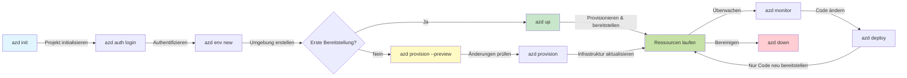
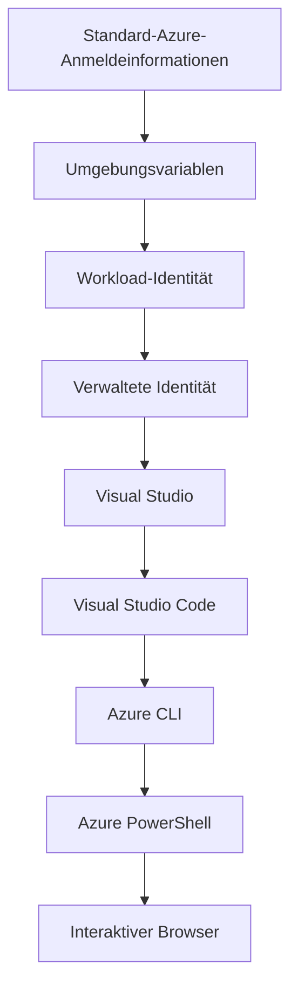

# AZD Basics - Verständnis der Azure Developer CLI

# AZD Basics - Kernkonzepte und Grundlagen

**Chapter Navigation:**
- **📚 Course Home**: [AZD For Beginners](../../README.md)
- **📖 Current Chapter**: Kapitel 1 - Grundlagen & Schnellstart
- **⬅️ Previous**: [Course Overview](../../README.md#-chapter-1-foundation--quick-start)
- **➡️ Next**: [Installation & Einrichtung](installation.md)
- **🚀 Next Chapter**: [Kapitel 2: KI-First-Entwicklung](../chapter-02-ai-development/microsoft-foundry-integration.md)

## Einführung

Diese Lektion führt dich in die Azure Developer CLI (azd) ein, ein leistungsfähiges Befehlszeilentool, das deinen Weg von der lokalen Entwicklung zur Azure-Bereitstellung beschleunigt. Du lernst die grundlegenden Konzepte, Kernfunktionen und verstehst, wie azd die Bereitstellung cloud-nativer Anwendungen vereinfacht.

## Lernziele

Am Ende dieser Lektion wirst du:
- Verstehen, was die Azure Developer CLI ist und welchen Hauptzweck sie erfüllt
- Die Kernkonzepte von Templates, Umgebungen und Services kennenlernen
- Wichtige Funktionen wie template-gesteuerte Entwicklung und Infrastruktur als Code erkunden
- Die azd-Projektstruktur und den Workflow verstehen
- Bereit sein, azd für deine Entwicklungsumgebung zu installieren und zu konfigurieren

## Lernergebnisse

Nach Abschluss dieser Lektion wirst du in der Lage sein:
- Die Rolle von azd in modernen Cloud-Entwicklungs-Workflows zu erklären
- Die Komponenten einer azd-Projektstruktur zu identifizieren
- Zu beschreiben, wie Templates, Umgebungen und Services zusammenarbeiten
- Die Vorteile von Infrastruktur als Code mit azd zu verstehen
- Verschiedene azd-Befehle und ihre Zwecke zu erkennen

## Was ist die Azure Developer CLI (azd)?

Die Azure Developer CLI (azd) ist ein Befehlszeilentool, das entwickelt wurde, um deinen Weg von der lokalen Entwicklung zur Azure-Bereitstellung zu beschleunigen. Es vereinfacht den Prozess des Erstellens, Bereitstellens und Verwaltens cloud-nativer Anwendungen auf Azure.

### Was kannst du mit azd bereitstellen?

azd unterstützt eine breite Palette von Workloads — und die Liste wächst ständig. Heute kannst du azd verwenden, um Folgendes bereitzustellen:

| Workload Type | Examples | Same Workflow? |
|---------------|----------|----------------|
| **Traditional applications** | Web-Apps, REST-APIs, statische Websites | ✅ `azd up` |
| **Services and microservices** | Container Apps, Function Apps, mehrteilige Backends | ✅ `azd up` |
| **AI-powered applications** | Chat-Apps mit Microsoft Foundry-Modellen, RAG-Lösungen mit AI Search | ✅ `azd up` |
| **Intelligent agents** | In Foundry gehostete Agents, Multi-Agent-Orchestrierungen | ✅ `azd up` |

Die zentrale Erkenntnis ist, dass **der azd-Lifecycle gleich bleibt, unabhängig davon, was du bereitstellst**. Du initialisierst ein Projekt, provisionierst Infrastruktur, stellst deinen Code bereit, überwachst deine App und räumst auf — ob es sich um eine einfache Website oder einen komplexen KI-Agenten handelt.

Diese Kontinuität ist Absicht. azd behandelt KI-Funktionen als eine weitere Art von Service, den deine Anwendung nutzen kann, und nicht als etwas grundlegend anderes. Ein Chat-Endpunkt, der von Microsoft Foundry-Modellen unterstützt wird, ist aus Sicht von azd einfach ein weiterer Service, der konfiguriert und bereitgestellt werden muss.

### 🎯 Warum AZD verwenden? Ein praxisnaher Vergleich

Vergleichen wir die Bereitstellung einer einfachen Web-App mit Datenbank:

#### ❌ OHNE AZD: Manuelle Azure-Bereitstellung (30+ Minuten)

```bash
# Schritt 1: Ressourcengruppe erstellen
az group create --name myapp-rg --location eastus

# Schritt 2: App Service-Plan erstellen
az appservice plan create --name myapp-plan \
  --resource-group myapp-rg \
  --sku B1 --is-linux

# Schritt 3: Web-App erstellen
az webapp create --name myapp-web-unique123 \
  --resource-group myapp-rg \
  --plan myapp-plan \
  --runtime "NODE:18-lts"

# Schritt 4: Cosmos DB-Konto erstellen (10-15 Minuten)
az cosmosdb create --name myapp-cosmos-unique123 \
  --resource-group myapp-rg \
  --kind MongoDB

# Schritt 5: Datenbank erstellen
az cosmosdb mongodb database create \
  --account-name myapp-cosmos-unique123 \
  --resource-group myapp-rg \
  --name tododb

# Schritt 6: Sammlung erstellen
az cosmosdb mongodb collection create \
  --account-name myapp-cosmos-unique123 \
  --resource-group myapp-rg \
  --database-name tododb \
  --name todos

# Schritt 7: Verbindungszeichenfolge abrufen
CONN_STR=$(az cosmosdb keys list \
  --name myapp-cosmos-unique123 \
  --resource-group myapp-rg \
  --type connection-strings \
  --query "connectionStrings[0].connectionString" -o tsv)

# Schritt 8: Anwendungseinstellungen konfigurieren
az webapp config appsettings set \
  --name myapp-web-unique123 \
  --resource-group myapp-rg \
  --settings MONGODB_URI="$CONN_STR"

# Schritt 9: Protokollierung aktivieren
az webapp log config --name myapp-web-unique123 \
  --resource-group myapp-rg \
  --application-logging filesystem \
  --detailed-error-messages true

# Schritt 10: Application Insights einrichten
az monitor app-insights component create \
  --app myapp-insights \
  --location eastus \
  --resource-group myapp-rg

# Schritt 11: App Insights mit der Web-App verknüpfen
INSTRUMENTATION_KEY=$(az monitor app-insights component show \
  --app myapp-insights \
  --resource-group myapp-rg \
  --query "instrumentationKey" -o tsv)

az webapp config appsettings set \
  --name myapp-web-unique123 \
  --resource-group myapp-rg \
  --settings APPINSIGHTS_INSTRUMENTATIONKEY="$INSTRUMENTATION_KEY"

# Schritt 12: Anwendung lokal erstellen
npm install
npm run build

# Schritt 13: Bereitstellungspaket erstellen
zip -r app.zip . -x "*.git*" "node_modules/*"

# Schritt 14: Anwendung bereitstellen
az webapp deployment source config-zip \
  --resource-group myapp-rg \
  --name myapp-web-unique123 \
  --src app.zip

# Schritt 15: Abwarten und beten, dass es funktioniert 🙏
# (Keine automatisierte Validierung, manuelle Tests erforderlich)
```

**Probleme:**
- ❌ 15+ Befehle, die man sich merken und in der richtigen Reihenfolge ausführen muss
- ❌ 30–45 Minuten manueller Arbeit
- ❌ Leicht Fehler zu machen (Tippfehler, falsche Parameter)
- ❌ Verbindungszeichenfolgen sind in der Terminal-Historie sichtbar
- ❌ Keine automatische Rücknahme, wenn etwas fehlschlägt
- ❌ Schwer für Teammitglieder zu reproduzieren
- ❌ Jedes Mal anders (nicht reproduzierbar)

#### ✅ MIT AZD: Automatisierte Bereitstellung (5 Befehle, 10–15 Minuten)

```bash
# Schritt 1: Aus Vorlage initialisieren
azd init --template todo-nodejs-mongo

# Schritt 2: Authentifizieren
azd auth login

# Schritt 3: Umgebung erstellen
azd env new dev

# Schritt 4: Änderungen vorschauen (optional, aber empfohlen)
azd provision --preview

# Schritt 5: Alles bereitstellen
azd up

# ✨ Fertig! Alles ist bereitgestellt, konfiguriert und überwacht.
```

**Vorteile:**
- ✅ **5 Befehle** vs. 15+ manuelle Schritte
- ✅ **10–15 Minuten** Gesamtzeit (meistens Wartezeit auf Azure)
- ✅ **Weniger manuelle Fehler** - konsistenter, template-gesteuerter Workflow
- ✅ **Sichere Geheimnisverwaltung** - viele Templates nutzen Azure-verwalteten Secretspeicher
- ✅ **Wiederholbare Bereitstellungen** - derselbe Ablauf jedes Mal
- ✅ **Vollständig reproduzierbar** - dasselbe Ergebnis jedes Mal
- ✅ **Teamfähig** - jeder kann mit denselben Befehlen bereitstellen
- ✅ **Infrastruktur als Code** - versionierte Bicep-Templates
- ✅ **Eingebaute Überwachung** - Application Insights automatisch konfiguriert

### 📊 Zeit- & Fehlerreduktion

| Metric | Manual Deployment | AZD Deployment | Improvement |
|:-------|:------------------|:---------------|:------------|
| **Commands** | 15+ | 5 | 67% weniger |
| **Time** | 30-45 min | 10-15 min | 60% schneller |
| **Error Rate** | ~40% | <5% | 88% Reduktion |
| **Consistency** | Niedrig (manuell) | 100% (automatisiert) | Perfekt |
| **Team Onboarding** | 2-4 Stunden | 30 Minuten | 75% schneller |
| **Rollback Time** | 30+ min (manuell) | 2 min (automatisiert) | 93% schneller |

## Kernkonzepte

### Templates
Templates sind die Grundlage von azd. Sie enthalten:
- **Anwendungscode** - Dein Quellcode und Abhängigkeiten
- **Infrastrukturdefinitionen** - Azure-Ressourcen, definiert in Bicep oder Terraform
- **Konfigurationsdateien** - Einstellungen und Umgebungsvariablen
- **Bereitstellungsskripte** - Automatisierte Bereitstellungs-Workflows

### Umgebungen
Umgebungen repräsentieren verschiedene Bereitstellungsziele:
- **Development** - Für Tests und Entwicklung
- **Staging** - Vorproduktionsumgebung
- **Production** - Live-Produktionsumgebung

Jede Umgebung verwaltet ihre eigene:
- Azure Resource Group
- Konfigurationseinstellungen
- Bereitstellungszustand

### Services
Services sind die Bausteine deiner Anwendung:
- **Frontend** - Webanwendungen, SPAs
- **Backend** - APIs, Microservices
- **Datenbank** - Datenspeicherlösungen
- **Storage** - Datei- und Blob-Speicher

## Hauptfunktionen

### 1. Template-gesteuerte Entwicklung
```bash
# Verfügbare Vorlagen durchsuchen
azd template list

# Aus einer Vorlage initialisieren
azd init --template <template-name>
```

### 2. Infrastruktur als Code
- **Bicep** - Azures domänenspezifische Sprache
- **Terraform** - Multi-Cloud-Infrastruktur-Tool
- **ARM Templates** - Azure Resource Manager-Templates

### 3. Integrierte Workflows
```bash
# Vollständiger Bereitstellungs-Workflow
azd up            # Provisionierung + Bereitstellung – dies ist für die erstmalige Einrichtung ohne manuelles Eingreifen

# 🧪 NEU: Vorschau auf Infrastrukturänderungen vor der Bereitstellung (SICHER)
azd provision --preview    # Infrastruktur-Bereitstellung simulieren, ohne Änderungen vorzunehmen

azd provision     # Azure-Ressourcen erstellen; verwenden Sie dies, wenn Sie die Infrastruktur aktualisieren
azd deploy        # Anwendungscode bereitstellen oder nach einer Aktualisierung erneut bereitstellen
azd down          # Ressourcen bereinigen
```

#### 🛡️ Sichere Infrastrukturplanung mit Preview
Der Befehl `azd provision --preview` ist ein Game-Changer für sichere Bereitstellungen:
- **Dry-Run-Analyse** - Zeigt, was erstellt, geändert oder gelöscht wird
- **Kein Risiko** - Es werden keine tatsächlichen Änderungen an deiner Azure-Umgebung vorgenommen
- **Teamzusammenarbeit** - Vorschauergebnisse vor der Bereitstellung teilen
- **Kostenabschätzung** - Verstehe Ressourcenkosten vor der Verpflichtung

```bash
# Beispiel-Vorschau-Workflow
azd provision --preview           # Sehen, was sich ändern wird
# Ausgabe prüfen, mit dem Team besprechen
azd provision                     # Änderungen mit Zuversicht anwenden
```

### 📊 Visual: AZD-Entwicklungsworkflow


```mermaid
graph LR
    A[azd init] -->|Projekt initialisieren| B[azd auth login]
    B -->|Authentifizieren| C[azd env new]
    C -->|Umgebung erstellen| D{Erste Bereitstellung?}
    D -->|Ja| E[azd up]
    D -->|Nein| F[azd provision --preview]
    F -->|Änderungen prüfen| G[azd provision]
    E -->|Provisionieren & bereitstellen| H[Ressourcen laufen]
    G -->|Infrastruktur aktualisieren| H
    H -->|Überwachen| I[azd monitor]
    I -->|Code ändern| J[azd deploy]
    J -->|Nur Code neu bereitstellen| H
    H -->|Bereinigen| K[azd down]
    
    style A fill:#e1f5fe
    style E fill:#c8e6c9
    style F fill:#fff9c4
    style H fill:#c5e1a5
    style K fill:#ffcdd2
```
**Workflow-Erklärung:**
1. **Init** - Mit Template oder neuem Projekt starten
2. **Auth** - Mit Azure authentifizieren
3. **Environment** - Isolierte Bereitstellungsumgebung erstellen
4. **Preview** - 🆕 Immer zuerst Infrastrukturänderungen ansehen (sichere Praxis)
5. **Provision** - Azure-Ressourcen erstellen/aktualisieren
6. **Deploy** - Deinen Anwendungscode pushen
7. **Monitor** - Anwendungsleistung beobachten
8. **Iterate** - Änderungen vornehmen und Code erneut bereitstellen
9. **Cleanup** - Ressourcen entfernen, wenn sie nicht mehr benötigt werden

### 4. Umweltverwaltung
```bash
# Umgebungen erstellen und verwalten
azd env new <environment-name>
azd env select <environment-name>
azd env list
```

### 5. Erweiterungen und KI-Befehle

azd verwendet ein Erweiterungssystem, um Fähigkeiten über die Kern-CLI hinaus hinzuzufügen. Das ist besonders nützlich für KI-Workloads:

```bash
# Verfügbare Erweiterungen auflisten
azd extension list

# Foundry Agents-Erweiterung installieren
azd extension install azure.ai.agents

# Ein KI-Agentenprojekt aus einem Manifest initialisieren
azd ai agent init -m agent-manifest.yaml

# MCP-Server für KI-gestützte Entwicklung (Alpha) starten
azd mcp start
```

> Erweiterungen werden ausführlich in [Kapitel 2: KI-First-Entwicklung](../chapter-02-ai-development/agents.md) und in der Referenz [AZD AI CLI Commands](../chapter-08-production/production-ai-practices.md#azd-ai-cli-commands-and-extensions) behandelt.

## 📁 Projektstruktur

Eine typische azd-Projektstruktur:
```
my-app/
├── .azd/                    # azd configuration
│   └── config.json
├── .azure/                  # Azure deployment artifacts
├── .devcontainer/          # Development container config
├── .github/workflows/      # GitHub Actions
├── .vscode/               # VS Code settings
├── infra/                 # Infrastructure code
│   ├── main.bicep        # Main infrastructure template
│   ├── main.parameters.json
│   └── modules/          # Reusable modules
├── src/                  # Application source code
│   ├── api/             # Backend services
│   └── web/             # Frontend application
├── azure.yaml           # azd project configuration
└── README.md
```

## 🔧 Konfigurationsdateien

### azure.yaml
Die Hauptprojektkonfigurationsdatei:
```yaml
name: my-awesome-app
metadata:
  template: my-template@1.0.0

services:
  web:
    project: ./src/web
    language: js
    host: appservice
  api:
    project: ./src/api
    language: js
    host: appservice

hooks:
  preprovision:
    shell: pwsh
    run: echo "Preparing to provision..."
```

### .azure/config.json
Umgebungsspezifische Konfiguration:
```json
{
  "version": 1,
  "defaultEnvironment": "dev",
  "environments": {
    "dev": {
      "subscriptionId": "your-subscription-id",
      "location": "eastus"
    }
  }
}
```

## 🎪 Häufige Workflows mit praktischen Übungen

> **💡 Lerntipp:** Folge diesen Übungen der Reihe nach, um deine AZD-Fähigkeiten schrittweise aufzubauen.

### 🎯 Übung 1: Initialisiere dein erstes Projekt

**Ziel:** Ein AZD-Projekt erstellen und seine Struktur erkunden

**Schritte:**
```bash
# Verwenden Sie eine bewährte Vorlage
azd init --template todo-nodejs-mongo

# Erkunden Sie die generierten Dateien
ls -la  # Zeigen Sie alle Dateien, einschließlich versteckter

# Wichtige erstellte Dateien:
# - azure.yaml (Hauptkonfiguration)
# - infra/ (Infrastruktur-Code)
# - src/ (Anwendungscode)
```

**✅ Erfolg:** Du hast azure.yaml, infra/ und src/ Verzeichnisse

---

### 🎯 Übung 2: Bereitstellung in Azure

**Ziel:** Vollständige End-to-End-Bereitstellung abschließen

**Schritte:**
```bash
# 1. Authentifizieren
az login && azd auth login

# 2. Umgebung erstellen
azd env new dev
azd env set AZURE_LOCATION eastus

# 3. Änderungen in der Vorschau anzeigen (EMPFOHLEN)
azd provision --preview

# 4. Alles bereitstellen
azd up

# 5. Bereitstellung überprüfen
azd show    # Zeige die URL deiner App an
```

**Erwartete Zeit:** 10-15 Minuten  
**✅ Erfolg:** Die Anwendungs-URL öffnet sich im Browser

---

### 🎯 Übung 3: Mehrere Umgebungen

**Ziel:** Deployment in dev und staging

**Schritte:**
```bash
# dev ist bereits vorhanden, erstelle staging
azd env new staging
azd env set AZURE_LOCATION westus2
azd up

# Zwischen ihnen wechseln
azd env list
azd env select dev
```

**✅ Erfolg:** Zwei separate Resource Groups im Azure-Portal

---

### 🛡️ Sauberer Neustart: `azd down --force --purge`

Wenn du vollständig zurücksetzen musst:

```bash
azd down --force --purge
```

**Was es tut:**
- `--force`: Keine Bestätigungsaufforderungen
- `--purge`: Löscht alle lokalen Zustände und Azure-Ressourcen

**Wann verwenden:**
- Bereitstellung ist während der Ausführung fehlgeschlagen
- Projektwechsel
- Frischer Start erforderlich

---

## 🎪 Ursprüngliche Workflow-Referenz

### Ein neues Projekt starten
```bash
# Methode 1: Vorhandene Vorlage verwenden
azd init --template todo-nodejs-mongo

# Methode 2: Ganz von vorn beginnen
azd init

# Methode 3: Aktuelles Verzeichnis verwenden
azd init .
```

### Entwicklungszyklus
```bash
# Entwicklungsumgebung einrichten
azd auth login
azd env new dev
azd env select dev

# Alles bereitstellen
azd up

# Änderungen vornehmen und neu bereitstellen
azd deploy

# Nach Abschluss aufräumen
azd down --force --purge # Der Befehl in der Azure Developer CLI ist ein **Hard-Reset** für Ihre Umgebung—besonders nützlich, wenn Sie fehlgeschlagene Bereitstellungen beheben, verwaiste Ressourcen bereinigen oder eine frische Neu-Bereitstellung vorbereiten.
```

## Verständnis von `azd down --force --purge`
Der Befehl `azd down --force --purge` ist eine mächtige Möglichkeit, deine azd-Umgebung und alle zugehörigen Ressourcen vollständig abzubauen. Hier ist eine Aufschlüsselung, was jede Option bewirkt:
```
--force
```
- Überspringt Bestätigungsaufforderungen.
- Nützlich für Automatisierung oder Skripte, in denen manuelle Eingaben nicht möglich sind.
- Stellt sicher, dass der Abbau ohne Unterbrechung fortgesetzt wird, selbst wenn die CLI Inkonsistenzen erkennt.

```
--purge
```
Löscht **alle zugehörigen Metadaten**, einschließlich:
Environment state
Lokaler `.azure` Ordner
Zwischengespeicherte Bereitstellungsinformationen
Verhindert, dass azd sich an vorherige Bereitstellungen "erinnert", was Probleme wie nicht übereinstimmende Resource Groups oder veraltete Registry-Referenzen verursachen kann.


### Warum beide verwenden?
Wenn du mit `azd up` auf Blockaden aufgrund verbleibender Zustände oder partieller Bereitstellungen stößt, sorgt diese Kombination für eine **saubere Ausgangslage**.

Es ist besonders hilfreich nach manuellen Ressourcenlöschungen im Azure-Portal oder beim Wechsel von Templates, Umgebungen oder Namenskonventionen für Resource Groups.


### Verwaltung mehrerer Umgebungen
```bash
# Staging-Umgebung erstellen
azd env new staging
azd env select staging
azd up

# Zurück zu dev wechseln
azd env select dev

# Umgebungen vergleichen
azd env list
```

## 🔐 Authentifizierung und Anmeldeinformationen

Das Verständnis der Authentifizierung ist entscheidend für erfolgreiche azd-Bereitstellungen. Azure verwendet mehrere Authentifizierungsverfahren, und azd nutzt dieselbe Credential-Chain wie andere Azure-Tools.

### Azure CLI-Authentifizierung (`az login`)

Bevor du azd verwendest, musst du dich bei Azure authentifizieren. Die gebräuchlichste Methode ist die Verwendung der Azure CLI:

```bash
# Interaktive Anmeldung (öffnet den Browser)
az login

# Anmeldung mit bestimmtem Mandanten
az login --tenant <tenant-id>

# Anmeldung mit Service-Principal
az login --service-principal -u <app-id> -p <password> --tenant <tenant-id>

# Aktuellen Anmeldestatus prüfen
az account show

# Verfügbare Abonnements auflisten
az account list --output table

# Standardabonnement festlegen
az account set --subscription <subscription-id>
```

### Authentifizierungsablauf
1. **Interaktive Anmeldung**: Öffnet deinen Standardbrowser zur Authentifizierung
2. **Device Code Flow**: Für Umgebungen ohne Browserzugang
3. **Service Principal**: Für Automatisierungs- und CI/CD-Szenarien
4. **Managed Identity**: Für auf Azure gehostete Anwendungen

### DefaultAzureCredential Chain

`DefaultAzureCredential` ist ein Credential-Typ, der ein vereinfachtes Authentifizierungserlebnis bietet, indem er automatisch mehrere Credential-Quellen in einer bestimmten Reihenfolge versucht:

#### Reihenfolge der Credential-Quellen

```mermaid
graph TD
    A[Standard-Azure-Anmeldeinformationen] --> B[Umgebungsvariablen]
    B --> C[Workload-Identität]
    C --> D[Verwaltete Identität]
    D --> E[Visual Studio]
    E --> F[Visual Studio Code]
    F --> G[Azure CLI]
    G --> H[Azure PowerShell]
    H --> I[Interaktiver Browser]
```
#### 1. Umgebungsvariablen
```bash
# Umgebungsvariablen für den Service Principal setzen
export AZURE_CLIENT_ID="<app-id>"
export AZURE_CLIENT_SECRET="<password>"
export AZURE_TENANT_ID="<tenant-id>"
```

#### 2. Workload Identity (Kubernetes/GitHub Actions)
Wird automatisch in folgenden Szenarien verwendet:
- Azure Kubernetes Service (AKS) mit Workload Identity
- GitHub Actions mit OIDC-Föderation
- Andere föderierte Identitätsszenarien

#### 3. Managed Identity
Für Azure-Ressourcen wie:
- Virtuelle Maschinen
- App Service
- Azure Functions
- Container Instances

```bash
# Überprüfen, ob auf einer Azure-Ressource mit verwalteter Identität ausgeführt wird
az account show --query "user.type" --output tsv
# Gibt "servicePrincipal" zurück, wenn eine verwaltete Identität verwendet wird
```

#### 4. Integration mit Entwickler-Tools
- **Visual Studio**: Verwendet automatisch das angemeldete Konto
- **VS Code**: Nutzt die Anmeldeinformationen der Azure Account-Erweiterung
- **Azure CLI**: Verwendet die `az login` Anmeldeinformationen (am häufigsten für lokale Entwicklung)

### AZD-Authentifizierungseinrichtung

```bash
# Methode 1: Azure CLI verwenden (empfohlen für die Entwicklung)
az login
azd auth login  # Verwendet vorhandene Azure CLI-Anmeldeinformationen

# Methode 2: Direkte azd-Authentifizierung
azd auth login --use-device-code  # Für nicht-interaktive Umgebungen

# Methode 3: Authentifizierungsstatus prüfen
azd auth login --check-status

# Methode 4: Abmelden und erneut authentifizieren
azd auth logout
azd auth login
```

### Beste Praktiken für Authentifizierung

#### Für lokale Entwicklung
```bash
# 1. Mit der Azure CLI anmelden
az login

# 2. Richtiges Abonnement überprüfen
az account show
az account set --subscription "Your Subscription Name"

# 3. azd mit vorhandenen Anmeldeinformationen verwenden
azd auth login
```

#### Für CI/CD-Pipelines
```yaml
# GitHub Actions example
- name: Azure Login
  uses: azure/login@v1
  with:
    creds: ${{ secrets.AZURE_CREDENTIALS }}

- name: Deploy with azd
  run: |
    azd auth login --client-id ${{ secrets.AZURE_CLIENT_ID }} \
                    --client-secret ${{ secrets.AZURE_CLIENT_SECRET }} \
                    --tenant-id ${{ secrets.AZURE_TENANT_ID }}
    azd up --no-prompt
```

#### Für Produktionsumgebungen
- Verwende **Managed Identity**, wenn du auf Azure-Ressourcen ausführst
- Nutze **Service Principal** für Automatisierungsszenarien
- Vermeide das Speichern von Anmeldeinformationen im Code oder in Konfigurationsdateien
- Verwende **Azure Key Vault** für sensible Konfigurationen

### Häufige Authentifizierungsprobleme und Lösungen

#### Problem: "No subscription found"
```bash
# Lösung: Standardabonnement festlegen
az account list --output table
az account set --subscription "<subscription-id>"
azd env set AZURE_SUBSCRIPTION_ID "<subscription-id>"
```

#### Problem: "Insufficient permissions"
```bash
# Lösung: Erforderliche Rollen prüfen und zuweisen
az role assignment list --assignee $(az account show --query user.name --output tsv)

# Häufig benötigte Rollen:
# - Contributor (für Ressourcenverwaltung)
# - User Access Administrator (für Rollenzuweisungen)
```

#### Problem: "Token expired"
```bash
# Lösung: Erneut authentifizieren
az logout
az login
azd auth logout
azd auth login
```

### Authentifizierung in verschiedenen Szenarien

#### Lokale Entwicklung
```bash
# Konto für persönliche Entwicklung
az login
azd auth login
```

#### Team-Entwicklung
```bash
# Verwende einen bestimmten Mandanten für die Organisation
az login --tenant contoso.onmicrosoft.com
azd auth login
```

#### Multi-Tenant-Szenarien
```bash
# Zwischen Mandanten wechseln
az login --tenant tenant1.onmicrosoft.com
# Für Mandant 1 bereitstellen
azd up

az login --tenant tenant2.onmicrosoft.com  
# Für Mandant 2 bereitstellen
azd up
```

### Sicherheitsüberlegungen
1. **Anmeldeinformationen speichern**: Speichere niemals Anmeldeinformationen im Quellcode
2. **Einschränkung des Umfangs**: Verwende das Prinzip der geringsten Rechte für Serviceprinzipale
3. **Token-Rotation**: Drehe Secrets von Serviceprinzipalen regelmäßig
4. **Audit-Trail**: Überwache Authentifizierungs- und Bereitstellungsaktivitäten
5. **Netzwerksicherheit**: Verwende private Endpunkte, wenn möglich

### Fehlerbehebung bei der Authentifizierung

```bash
# Authentifizierungsprobleme untersuchen
azd auth login --check-status
az account show
az account get-access-token

# Häufige Diagnosebefehle
whoami                          # Aktueller Benutzerkontext
az ad signed-in-user show      # Azure AD-Benutzerdetails
az group list                  # Ressourcenzugriff testen
```

## Verständnis von `azd down --force --purge`

### Entdeckung
```bash
azd template list              # Vorlagen durchsuchen
azd template show <template>   # Vorlagendetails
azd init --help               # Initialisierungsoptionen
```

### Projektverwaltung
```bash
azd show                     # Projektübersicht
azd env list                # Verfügbare Umgebungen und der ausgewählte Standard
azd config show            # Konfigurationseinstellungen
```

### Überwachung
```bash
azd monitor                  # Überwachung im Azure-Portal öffnen
azd monitor --logs           # Anwendungsprotokolle anzeigen
azd monitor --live           # Live-Metriken anzeigen
azd pipeline config          # CI/CD einrichten
```

## Beste Praktiken

### 1. Verwende aussagekräftige Namen
```bash
# Gut
azd env new production-east
azd init --template web-app-secure

# Vermeiden
azd env new env1
azd init --template template1
```

### 2. Nutze Vorlagen
- Beginne mit vorhandenen Vorlagen
- Passe sie an deine Bedürfnisse an
- Erstelle wiederverwendbare Vorlagen für deine Organisation

### 3. Isolierung der Umgebungen
- Verwende separate Umgebungen für dev/staging/prod
- Nie direkt von der lokalen Maschine in die Produktion bereitstellen
- Verwende CI/CD-Pipelines für Produktionsbereitstellungen

### 4. Konfigurationsmanagement
- Verwende Umgebungsvariablen für sensible Daten
- Halte Konfigurationen in der Versionsverwaltung
- Dokumentiere umgebungsspezifische Einstellungen

## Lernfortschritt

### Anfänger (Woche 1-2)
1. Installiere azd und authentifiziere dich
2. Stelle eine einfache Vorlage bereit
3. Verstehe die Projektstruktur
4. Lerne grundlegende Befehle (up, down, deploy)

### Fortgeschritten (Woche 3-4)
1. Passe Vorlagen an
2. Verwalte mehrere Umgebungen
3. Verstehe Infrastruktur-Code
4. Richte CI/CD-Pipelines ein

### Fortgeschrittene (Woche 5+)
1. Erstelle eigene Vorlagen
2. Fortgeschrittene Infrastruktur-Patterns
3. Bereitstellungen in mehreren Regionen
4. Unternehmensfähige Konfigurationen

## Nächste Schritte

**📖 Weiter mit Kapitel 1 lernen:**
- [Installation & Setup](installation.md) - Installiere und konfiguriere azd
- [Dein erstes Projekt](first-project.md) - Abschließe das praktische Tutorial
- [Konfigurationsleitfaden](configuration.md) - Erweiterte Konfigurationsoptionen

**🎯 Bereit für das nächste Kapitel?**
- [Kapitel 2: AI-First Development](../chapter-02-ai-development/microsoft-foundry-integration.md) - Beginne mit dem Aufbau von KI-Anwendungen

## Zusätzliche Ressourcen

- [Azure Developer CLI Overview](https://learn.microsoft.com/en-us/azure/developer/azure-developer-cli/)
- [Template Gallery](https://azure.github.io/awesome-azd/)
- [Community Samples](https://github.com/Azure-Samples)

---

## 🙋 Häufig gestellte Fragen

### Allgemeine Fragen

**Q: Was ist der Unterschied zwischen AZD und Azure CLI?**

A: Azure CLI (`az`) dient zur Verwaltung einzelner Azure-Ressourcen. AZD (`azd`) dient zur Verwaltung kompletter Anwendungen:

```bash
# Azure CLI - Ressourcenverwaltung auf niedriger Ebene
az webapp create --name myapp --resource-group rg
az sql server create --name myserver --resource-group rg
# ...noch viele weitere Befehle erforderlich

# AZD - Verwaltung auf Anwendungsebene
azd up  # Stellt die gesamte Anwendung mit allen Ressourcen bereit
```

**Stell es dir so vor:**
- `az` = Arbeiten an einzelnen Lego-Steinen
- `azd` = Arbeiten mit kompletten Lego-Sets

---

**Q: Muss ich Bicep oder Terraform kennen, um AZD zu verwenden?**

A: Nein! Beginne mit Vorlagen:
```bash
# Bestehende Vorlage verwenden - keine IaC-Kenntnisse erforderlich
azd init --template todo-nodejs-mongo
azd up
```

Du kannst später Bicep lernen, um die Infrastruktur anzupassen. Vorlagen bieten funktionierende Beispiele zum Lernen.

---

**Q: Wie viel kostet das Ausführen von AZD-Vorlagen?**

A: Die Kosten variieren je nach Vorlage. Die meisten Entwicklungs-Vorlagen kosten 50–150 $/Monat:

```bash
# Kosten vor der Bereitstellung anzeigen
azd provision --preview

# Bei Nichtbenutzung stets bereinigen
azd down --force --purge  # Entfernt alle Ressourcen
```

**Tipp:** Nutze kostenlose Stufen, wo verfügbar:
- App Service: F1 (Free) Tier
- Microsoft Foundry Models: Azure OpenAI 50.000 Tokens/Monat kostenlos
- Cosmos DB: 1000 RU/s Free Tier

---

**Q: Kann ich AZD mit bestehenden Azure-Ressourcen verwenden?**

A: Ja, aber es ist einfacher, neu zu beginnen. AZD funktioniert am besten, wenn es den gesamten Lebenszyklus verwaltet. Für bestehende Ressourcen:

```bash
# Option 1: Vorhandene Ressourcen importieren (fortgeschritten)
azd init
# Dann infra/ anpassen, damit es auf vorhandene Ressourcen verweist

# Option 2: Neu beginnen (empfohlen)
azd init --template matching-your-stack
azd up  # Erstellt eine neue Umgebung
```

---

**Q: Wie teile ich mein Projekt mit Teamkollegen?**

A: Committe das AZD-Projekt in Git (aber NICHT den .azure-Ordner):

```bash
# Bereits standardmäßig in .gitignore enthalten
.azure/        # Enthält Geheimnisse und Umgebungsdaten
*.env          # Umgebungsvariablen

# Dann Teammitglieder:
git clone <your-repo>
azd auth login
azd env new <their-name>-dev
azd up
```

Jeder erhält identische Infrastruktur aus denselben Vorlagen.

---

### Fragen zur Fehlerbehebung

**Q: "azd up" ist halb fehlgeschlagen. Was soll ich tun?**

A: Prüfe den Fehler, behebe ihn und versuche es erneut:

```bash
# Detaillierte Protokolle anzeigen
azd show

# Häufige Lösungen:

# 1. Wenn das Kontingent überschritten ist:
azd env set AZURE_LOCATION "westus2"  # Andere Region ausprobieren

# 2. Bei Konflikt des Ressourcennamens:
azd down --force --purge  # Sauberen Zustand herstellen
azd up  # Erneut versuchen

# 3. Wenn die Authentifizierung abgelaufen ist:
az login
azd auth login
azd up
```

**Häufigstes Problem:** Falsches Azure-Abonnement ausgewählt
```bash
az account list --output table
az account set --subscription "<correct-subscription>"
```

---

**Q: Wie stelle ich nur Codeänderungen bereit, ohne neu zu provisionieren?**

A: Verwende `azd deploy` statt `azd up`:

```bash
azd up          # Erstes Mal: Provisionierung + Bereitstellung (langsam)

# Codeänderungen vornehmen...

azd deploy      # Bei nachfolgenden Durchläufen: nur Bereitstellung (schnell)
```

Geschwindigkeitsvergleich:
- `azd up`: 10–15 Minuten (provisionsiert Infrastruktur)
- `azd deploy`: 2–5 Minuten (nur Code)

---

**Q: Kann ich die Infrastrukturvorlagen anpassen?**

A: Ja! Bearbeite die Bicep-Dateien in `infra/`:

```bash
# Nach azd init
cd infra/
code main.bicep  # In VS Code bearbeiten

# Änderungen anzeigen
azd provision --preview

# Änderungen anwenden
azd provision
```

**Tipp:** Fang klein an – ändere zuerst SKUs:
```bicep
// infra/main.bicep
sku: {
  name: 'B1'  // Change to 'P1V2' for production
}
```

---

**Q: Wie lösche ich alles, was AZD erstellt hat?**

A: Ein Befehl entfernt alle Ressourcen:

```bash
azd down --force --purge

# Dies löscht:
# - Alle Azure-Ressourcen
# - Ressourcengruppe
# - Lokalen Umgebungszustand
# - Zwischengespeicherte Bereitstellungsdaten
```

**Führe dies immer aus, wenn:**
- Ein Template-Test abgeschlossen ist
- Du zu einem anderen Projekt wechselst
- Du von vorne beginnen möchtest

**Kostenersparnis:** Gelöschte ungenutzte Ressourcen = $0 Kosten

---

**Q: Was, wenn ich versehentlich Ressourcen im Azure-Portal gelöscht habe?**

A: AZD-Zustand kann aus dem Gleichgewicht geraten. Vorgehen für einen sauberen Neuanfang:

```bash
# 1. Lokalen Zustand entfernen
azd down --force --purge

# 2. Neu anfangen
azd up

# Alternative: AZD erkennen und beheben lassen
azd provision  # Wird fehlende Ressourcen erstellen
```

---

### Erweiterte Fragen

**Q: Kann ich AZD in CI/CD-Pipelines verwenden?**

A: Ja! GitHub Actions Beispiel:

```yaml
# .github/workflows/deploy.yml
name: Deploy with AZD

on:
  push:
    branches: [main]

jobs:
  deploy:
    runs-on: ubuntu-latest
    steps:
      - uses: actions/checkout@v2
      
      - name: Install azd
        run: curl -fsSL https://aka.ms/install-azd.sh | bash
      
      - name: Azure Login
        run: |
          azd auth login \
            --client-id ${{ secrets.AZURE_CLIENT_ID }} \
            --client-secret ${{ secrets.AZURE_CLIENT_SECRET }} \
            --tenant-id ${{ secrets.AZURE_TENANT_ID }}
      
      - name: Deploy
        run: azd up --no-prompt
```

---

**Q: Wie gehe ich mit Secrets und sensiblen Daten um?**

A: AZD integriert sich automatisch mit Azure Key Vault:

```bash
# Geheimnisse werden im Key Vault gespeichert, nicht im Code
azd env set DATABASE_PASSWORD "$(openssl rand -base64 32)"

# AZD automatisch:
# 1. Erstellt Key Vault
# 2. Speichert das Geheimnis
# 3. Gewährt der App Zugriff über eine Managed Identity
# 4. Injiziert zur Laufzeit
```

**Niemanden committen:**
- `.azure/` Ordner (enthält Umgebungsdaten)
- `.env` Dateien (lokale Secrets)
- Verbindungszeichenfolgen

---

**Q: Kann ich in mehrere Regionen bereitstellen?**

A: Ja, erstelle eine Umgebung pro Region:

```bash
# Umgebung im Osten der USA
azd env new prod-eastus
azd env set AZURE_LOCATION eastus
azd up

# Umgebung in Westeuropa
azd env new prod-westeurope
azd env set AZURE_LOCATION westeurope
azd up

# Jede Umgebung ist unabhängig
azd env list
```

Für echte Multi-Region-Anwendungen passe die Bicep-Vorlagen an, um gleichzeitig in mehreren Regionen bereitzustellen.

---

**Q: Wo bekomme ich Hilfe, wenn ich nicht weiterkomme?**

1. **AZD-Dokumentation:** https://learn.microsoft.com/azure/developer/azure-developer-cli/
2. **GitHub Issues:** https://github.com/Azure/azure-dev/issues
3. **Discord:** [Azure Discord](https://discord.gg/microsoft-azure) - #azure-developer-cli Kanal
4. **Stack Overflow:** Tag `azure-developer-cli`
5. **Dieser Kurs:** [Troubleshooting Guide](../chapter-07-troubleshooting/common-issues.md)

**Tipp:** Bevor du fragst, führe aus:
```bash
azd show       # Zeigt den aktuellen Zustand
azd version    # Zeigt Ihre Version
```
Include this info in your question for faster help.

---

## 🎓 Was kommt als Nächstes?

Du verstehst jetzt die AZD-Grundlagen. Wähle deinen Weg:

### 🎯 Für Anfänger:
1. **Weiter:** [Installation & Setup](installation.md) - Installiere AZD auf deiner Maschine
2. **Dann:** [Dein erstes Projekt](first-project.md) - Stelle deine erste App bereit
3. **Übung:** Schließe alle 3 Übungen in dieser Lektion ab

### 🚀 Für KI-Entwickler:
1. **Überspringen zu:** [Kapitel 2: AI-First Development](../chapter-02-ai-development/microsoft-foundry-integration.md)
2. **Bereitstellen:** Starte mit `azd init --template get-started-with-ai-chat`
3. **Lernen:** Baue beim Bereitstellen

### 🏗️ Für erfahrene Entwickler:
1. **Überprüfen:** [Konfigurationsleitfaden](configuration.md) - Erweiterte Einstellungen
2. **Erkunden:** [Infrastructure as Code](../chapter-04-infrastructure/provisioning.md) - Bicep Deep Dive
3. **Erstellen:** Erstelle eigene Vorlagen für dein Stack

---

**Kapitel-Navigation:**
- **📚 Kursübersicht**: [AZD For Beginners](../../README.md)
- **📖 Aktuelles Kapitel**: Kapitel 1 - Grundlagen & Schnellstart  
- **⬅️ Vorheriges**: [Kursübersicht](../../README.md#-chapter-1-foundation--quick-start)
- **➡️ Nächstes**: [Installation & Setup](installation.md)
- **🚀 Nächstes Kapitel**: [Kapitel 2: AI-First Development](../chapter-02-ai-development/microsoft-foundry-integration.md)

---

<!-- CO-OP TRANSLATOR DISCLAIMER START -->
**Disclaimer**:
Dieses Dokument wurde mit dem KI-Übersetzungsdienst [Co-op Translator](https://github.com/Azure/co-op-translator) übersetzt. Obwohl wir uns um Genauigkeit bemühen, beachten Sie bitte, dass automatisierte Übersetzungen Fehler oder Ungenauigkeiten enthalten können. Das Originaldokument in seiner ursprünglichen Sprache ist als maßgebliche Quelle zu betrachten. Für kritische Informationen wird eine professionelle menschliche Übersetzung empfohlen. Wir übernehmen keine Haftung für Missverständnisse oder Fehlinterpretationen, die aus der Verwendung dieser Übersetzung entstehen.
<!-- CO-OP TRANSLATOR DISCLAIMER END -->