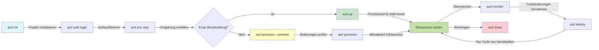
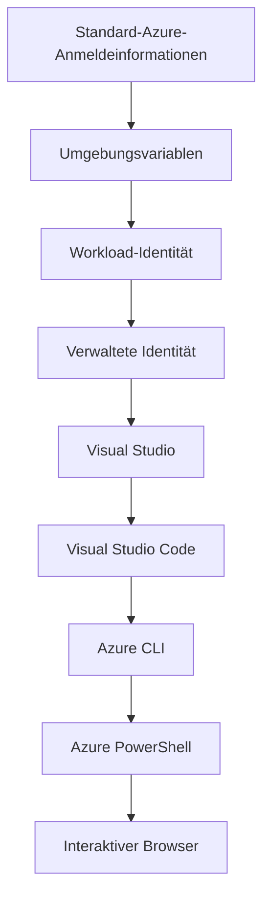

# AZD Basics - Verständnis der Azure Developer CLI

# AZD Basics - Kernkonzepte und Grundlagen

**Chapter Navigation:**
- **📚 Kursübersicht**: [AZD für Einsteiger](../../README.md)
- **📖 Aktuelles Kapitel**: Kapitel 1 - Grundlagen & Schnellstart
- **⬅️ Previous**: [Kursübersicht](../../README.md#-chapter-1-foundation--quick-start)
- **➡️ Next**: [Installation & Einrichtung](installation.md)
- **🚀 Next Chapter**: [Kapitel 2: KI-fokussierte Entwicklung](../chapter-02-ai-development/microsoft-foundry-integration.md)

## Einführung

Diese Lektion führt Sie in die Azure Developer CLI (azd) ein, ein leistungsfähiges Befehlszeilentool, das Ihre Reise von der lokalen Entwicklung zur Azure-Bereitstellung beschleunigt. Sie lernen die grundlegenden Konzepte, Kernfunktionen und wie azd die Bereitstellung cloud-nativer Anwendungen vereinfacht.

## Lernziele

Am Ende dieser Lektion werden Sie:
- Verstehen, was die Azure Developer CLI ist und welchen Hauptzweck sie erfüllt
- Die Kernkonzepte von Vorlagen, Umgebungen und Diensten kennenlernen
- Wichtige Funktionen erkunden, einschließlich vorlagengetriebener Entwicklung und Infrastructure as Code
- Die azd-Projektstruktur und den Workflow verstehen
- Bereit sein, azd für Ihre Entwicklungsumgebung zu installieren und zu konfigurieren

## Lernergebnisse

Nach Abschluss dieser Lektion werden Sie in der Lage sein:
- Die Rolle von azd in modernen Cloud-Entwicklungs-Workflows zu erklären
- Die Komponenten einer azd-Projektstruktur zu identifizieren
- Zu beschreiben, wie Vorlagen, Umgebungen und Dienste zusammenarbeiten
- Die Vorteile von Infrastructure as Code mit azd zu verstehen
- Verschiedene azd-Befehle und deren Zweck zu erkennen

## Was ist die Azure Developer CLI (azd)?

Azure Developer CLI (azd) ist ein Befehlszeilentool, das entwickelt wurde, um Ihre Reise von der lokalen Entwicklung zur Azure-Bereitstellung zu beschleunigen. Es vereinfacht den Prozess des Erstellens, Bereitstellens und Verwaltens cloud-nativer Anwendungen auf Azure.

### Was können Sie mit azd bereitstellen?

azd unterstützt eine Vielzahl von Workloads — und die Liste wächst kontinuierlich. Heute können Sie azd verwenden, um folgende Dinge bereitzustellen:

| Workload Type | Examples | Same Workflow? |
|---------------|----------|----------------|
| **Traditional applications** | Web apps, REST APIs, static sites | ✅ `azd up` |
| **Services and microservices** | Container Apps, Function Apps, multi-service backends | ✅ `azd up` |
| **AI-powered applications** | Chat apps with Microsoft Foundry Models, RAG solutions with AI Search | ✅ `azd up` |
| **Intelligent agents** | Foundry-hosted agents, multi-agent orchestrations | ✅ `azd up` |

Die wichtigste Erkenntnis ist, dass **der azd-Lifecycle unabhängig davon gleich bleibt, was Sie bereitstellen**. Sie initialisieren ein Projekt, provisionieren Infrastruktur, deployen Ihren Code, überwachen Ihre App und räumen auf — egal ob es sich um eine einfache Website oder einen komplexen KI-Agenten handelt.

Diese Kontinuität ist beabsichtigt. azd behandelt KI-Funktionen als eine weitere Art von Dienst, den Ihre Anwendung nutzen kann, nicht als etwas grundsätzlich anderes. Ein Chat-Endpunkt, der von Microsoft Foundry Models unterstützt wird, ist aus Sicht von azd lediglich ein weiterer Dienst, der konfiguriert und bereitgestellt werden muss.

### 🎯 Warum AZD verwenden? Ein Vergleich aus der Praxis

Vergleichen wir die Bereitstellung einer einfachen Web-App mit Datenbank:

#### ❌ OHNE AZD: Manuelle Azure-Bereitstellung (30+ Minuten)

```bash
# Schritt 1: Ressourcengruppe erstellen
az group create --name myapp-rg --location eastus

# Schritt 2: App Service-Plan erstellen
az appservice plan create --name myapp-plan \
  --resource-group myapp-rg \
  --sku B1 --is-linux

# Schritt 3: Web-App erstellen
az webapp create --name myapp-web-unique123 \
  --resource-group myapp-rg \
  --plan myapp-plan \
  --runtime "NODE:18-lts"

# Schritt 4: Erstellen eines Cosmos DB-Kontos (10–15 Minuten)
az cosmosdb create --name myapp-cosmos-unique123 \
  --resource-group myapp-rg \
  --kind MongoDB

# Schritt 5: Datenbank erstellen
az cosmosdb mongodb database create \
  --account-name myapp-cosmos-unique123 \
  --resource-group myapp-rg \
  --name tododb

# Schritt 6: Sammlung erstellen
az cosmosdb mongodb collection create \
  --account-name myapp-cosmos-unique123 \
  --resource-group myapp-rg \
  --database-name tododb \
  --name todos

# Schritt 7: Verbindungszeichenfolge abrufen
CONN_STR=$(az cosmosdb keys list \
  --name myapp-cosmos-unique123 \
  --resource-group myapp-rg \
  --type connection-strings \
  --query "connectionStrings[0].connectionString" -o tsv)

# Schritt 8: App-Einstellungen konfigurieren
az webapp config appsettings set \
  --name myapp-web-unique123 \
  --resource-group myapp-rg \
  --settings MONGODB_URI="$CONN_STR"

# Schritt 9: Protokollierung aktivieren
az webapp log config --name myapp-web-unique123 \
  --resource-group myapp-rg \
  --application-logging filesystem \
  --detailed-error-messages true

# Schritt 10: Application Insights einrichten
az monitor app-insights component create \
  --app myapp-insights \
  --location eastus \
  --resource-group myapp-rg

# Schritt 11: App Insights mit der Web-App verknüpfen
INSTRUMENTATION_KEY=$(az monitor app-insights component show \
  --app myapp-insights \
  --resource-group myapp-rg \
  --query "instrumentationKey" -o tsv)

az webapp config appsettings set \
  --name myapp-web-unique123 \
  --resource-group myapp-rg \
  --settings APPINSIGHTS_INSTRUMENTATIONKEY="$INSTRUMENTATION_KEY"

# Schritt 12: Anwendung lokal erstellen
npm install
npm run build

# Schritt 13: Bereitstellungspaket erstellen
zip -r app.zip . -x "*.git*" "node_modules/*"

# Schritt 14: Anwendung bereitstellen
az webapp deployment source config-zip \
  --resource-group myapp-rg \
  --name myapp-web-unique123 \
  --src app.zip

# Schritt 15: Warten und beten, dass es funktioniert 🙏
# (Keine automatische Validierung, manuelle Tests erforderlich)
```

**Probleme:**
- ❌ 15+ Befehle, die man sich merken und in der richtigen Reihenfolge ausführen muss
- ❌ 30-45 Minuten manueller Aufwand
- ❌ Leicht Fehler zu machen (Tippfehler, falsche Parameter)
- ❌ Verbindungsstrings werden im Terminal-Verlauf offengelegt
- ❌ Keine automatisierte Rücknahme bei Fehlern
- ❌ Schwer für Teammitglieder reproduzierbar
- ❌ Bei jedem Mal anders (nicht reproduzierbar)

#### ✅ MIT AZD: Automatisierte Bereitstellung (5 Befehle, 10-15 Minuten)

```bash
# Schritt 1: Aus einer Vorlage initialisieren
azd init --template todo-nodejs-mongo

# Schritt 2: Authentifizieren
azd auth login

# Schritt 3: Umgebung erstellen
azd env new dev

# Schritt 4: Änderungen in der Vorschau prüfen (optional, aber empfohlen)
azd provision --preview

# Schritt 5: Alles bereitstellen
azd up

# ✨ Fertig! Alles ist bereitgestellt, konfiguriert und wird überwacht
```

**Vorteile:**
- ✅ **5 Befehle** vs. 15+ manuelle Schritte
- ✅ **10-15 Minuten** Gesamtzeit (überwiegend Warten auf Azure)
- ✅ **Keine Fehler** - automatisiert und getestet
- ✅ **Geheimnisse sicher verwaltet** via Key Vault
- ✅ **Automatische Rücknahme** bei Fehlern
- ✅ **Vollständig reproduzierbar** - jedes Mal dasselbe Ergebnis
- ✅ **Team-fähig** - jeder kann mit denselben Befehlen deployen
- ✅ **Infrastructure as Code** - versionskontrollierte Bicep-Vorlagen
- ✅ **Integriertes Monitoring** - Application Insights wird automatisch konfiguriert

### 📊 Zeit- und Fehlerreduktion

| Metric | Manual Deployment | AZD Deployment | Improvement |
|:-------|:------------------|:---------------|:------------|
| **Commands** | 15+ | 5 | 67% fewer |
| **Time** | 30-45 min | 10-15 min | 60% faster |
| **Error Rate** | ~40% | <5% | 88% reduction |
| **Consistency** | Low (manual) | 100% (automated) | Perfect |
| **Team Onboarding** | 2-4 hours | 30 minutes | 75% faster |
| **Rollback Time** | 30+ min (manual) | 2 min (automated) | 93% faster |

## Kernkonzepte

### Vorlagen
Vorlagen sind die Grundlage von azd. Sie enthalten:
- **Anwendungscode** - Ihr Quellcode und Abhängigkeiten
- **Infrastrukturbeschreibungen** - Azure-Ressourcen, definiert in Bicep oder Terraform
- **Konfigurationsdateien** - Einstellungen und Umgebungsvariablen
- **Bereitstellungsskripte** - Automatisierte Bereitstellungsabläufe

### Umgebungen
Umgebungen repräsentieren verschiedene Bereitstellungsziele:
- **Development** - Für Tests und Entwicklung
- **Staging** - Vorproduktionsumgebung
- **Production** - Live-Produktionsumgebung

Jede Umgebung verwaltet ihre eigene:
- Azure resource group
- Konfigurationseinstellungen
- Bereitstellungsstatus

### Dienste
Dienste sind die Bausteine Ihrer Anwendung:
- **Frontend** - Webanwendungen, SPAs
- **Backend** - APIs, Microservices
- **Datenbank** - Datenspeicherlösungen
- **Speicher** - Datei- und Blob-Speicher

## Wichtige Funktionen

### 1. Vorlagengetriebene Entwicklung
```bash
# Verfügbare Vorlagen durchsuchen
azd template list

# Aus einer Vorlage initialisieren
azd init --template <template-name>
```

### 2. Infrastruktur als Code
- **Bicep** - Azures domänenspezifische Sprache
- **Terraform** - Multi-cloud Infrastruktur-Tool
- **ARM-Vorlagen** - Azure Resource Manager-Vorlagen

### 3. Integrierte Workflows
```bash
# Vollständiger Bereitstellungs-Workflow
azd up            # Provision + Deploy — dies ist für die Erstkonfiguration ohne manuellen Eingriff

# 🧪 NEU: Vorschau von Infrastrukturänderungen vor der Bereitstellung (SICHER)
azd provision --preview    # Infrastruktur-Bereitstellung simulieren, ohne Änderungen vorzunehmen

azd provision     # Azure-Ressourcen erstellen — bei Aktualisierung der Infrastruktur verwenden
azd deploy        # Anwendungscode bereitstellen oder nach einem Update erneut bereitstellen
azd down          # Ressourcen bereinigen
```

#### 🛡️ Sichere Infrastrukturplanung mit Preview
Der Befehl `azd provision --preview` ist ein Wendepunkt für sichere Bereitstellungen:
- **Trockendurchlauf-Analyse** - Zeigt, was erstellt, geändert oder gelöscht wird
- **Kein Risiko** - Es werden keine tatsächlichen Änderungen an Ihrer Azure-Umgebung vorgenommen
- **Teamzusammenarbeit** - Vorschauergebnisse vor der Bereitstellung teilen
- **Kostenschätzung** - Ressourcen­kosten vor der Verpflichtung verstehen

```bash
# Beispielhafter Vorschau-Workflow
azd provision --preview           # Sehen, was sich ändern wird
# Überprüfe die Ausgabe, diskutiere mit dem Team
azd provision                     # Wende Änderungen mit Zuversicht an
```

### 📊 Visual: AZD-Entwicklungsworkflow


```mermaid
graph LR
    A[azd init] -->|Projekt initialisieren| B[azd auth login]
    B -->|Authentifizieren| C[azd env new]
    C -->|Umgebung erstellen| D{Erste Bereitstellung?}
    D -->|Ja| E[azd up]
    D -->|Nein| F[azd provision --preview]
    F -->|Änderungen prüfen| G[azd provision]
    E -->|Provisioniert & stellt bereit| H[Ressourcen laufen]
    G -->|Aktualisiert Infrastruktur| H
    H -->|Überwachen| I[azd monitor]
    I -->|Codeänderungen vornehmen| J[azd deploy]
    J -->|Nur Code neu bereitstellen| H
    H -->|Bereinigen| K[azd down]
    
    style A fill:#e1f5fe
    style E fill:#c8e6c9
    style F fill:#fff9c4
    style H fill:#c5e1a5
    style K fill:#ffcdd2
```

**Ablaufbeschreibung:**
1. **Init** - Mit Vorlage oder neuem Projekt starten
2. **Auth** - Mit Azure authentifizieren
3. **Environment** - Isolierte Bereitstellungsumgebung erstellen
4. **Preview** - 🆕 Änderungen an der Infrastruktur immer zuerst prüfen (sichere Praxis)
5. **Provision** - Azure-Ressourcen erstellen/aktualisieren
6. **Deploy** - Anwendungscode bereitstellen
7. **Monitor** - Anwendungsleistung überwachen
8. **Iterate** - Änderungen vornehmen und Code erneut bereitstellen
9. **Cleanup** - Ressourcen entfernen, wenn sie nicht mehr benötigt werden

### 4. Umgebungsverwaltung
```bash
# Umgebungen erstellen und verwalten
azd env new <environment-name>
azd env select <environment-name>
azd env list
```

### 5. Erweiterungen und KI-Befehle

azd verwendet ein Erweiterungssystem, um Fähigkeiten über das Kern-CLI hinaus hinzuzufügen. Dies ist besonders nützlich für KI-Workloads:

```bash
# Verfügbare Erweiterungen auflisten
azd extension list

# Foundry-Agents-Erweiterung installieren
azd extension install azure.ai.agents

# Ein KI-Agentenprojekt aus einem Manifest initialisieren
azd ai agent init -m agent-manifest.yaml

# MCP-Server für KI-unterstützte Entwicklung starten (Alpha)
azd mcp start
```

> Erweiterungen werden ausführlich in [Kapitel 2: KI-fokussierte Entwicklung](../chapter-02-ai-development/agents.md) und der [AZD AI CLI-Befehle](../chapter-08-production/production-ai-practices.md#azd-ai-cli-commands-and-extensions) Referenz behandelt.

## 📁 Projektstruktur

Eine typische azd-Projektstruktur:
```
my-app/
├── .azd/                    # azd configuration
│   └── config.json
├── .azure/                  # Azure deployment artifacts
├── .devcontainer/          # Development container config
├── .github/workflows/      # GitHub Actions
├── .vscode/               # VS Code settings
├── infra/                 # Infrastructure code
│   ├── main.bicep        # Main infrastructure template
│   ├── main.parameters.json
│   └── modules/          # Reusable modules
├── src/                  # Application source code
│   ├── api/             # Backend services
│   └── web/             # Frontend application
├── azure.yaml           # azd project configuration
└── README.md
```

## 🔧 Konfigurationsdateien

### azure.yaml
Die Hauptprojektkonfigurationsdatei:
```yaml
name: my-awesome-app
metadata:
  template: my-template@1.0.0

services:
  web:
    project: ./src/web
    language: js
    host: appservice
  api:
    project: ./src/api
    language: js
    host: appservice

hooks:
  preprovision:
    shell: pwsh
    run: echo "Preparing to provision..."
```

### .azure/config.json
Umgebungsspezifische Konfiguration:
```json
{
  "version": 1,
  "defaultEnvironment": "dev",
  "environments": {
    "dev": {
      "subscriptionId": "your-subscription-id",
      "location": "eastus"
    }
  }
}
```

## 🎪 Häufige Workflows mit praktischen Übungen

> **💡 Lerntipp:** Folgen Sie diesen Übungen in der Reihenfolge, um Ihre AZD-Fähigkeiten schrittweise aufzubauen.

### 🎯 Übung 1: Initialisieren Sie Ihr erstes Projekt

**Ziel:** Ein AZD-Projekt erstellen und dessen Struktur erkunden

**Schritte:**
```bash
# Verwenden Sie eine erprobte Vorlage
azd init --template todo-nodejs-mongo

# Erkunden Sie die generierten Dateien
ls -la  # Zeigen Sie alle Dateien, einschließlich versteckter, an

# Wichtige erstellte Dateien:
# - azure.yaml (Hauptkonfiguration)
# - infra/ (Infrastruktur-Code)
# - src/ (Anwendungscode)
```

**✅ Erfolg:** Sie haben die Verzeichnisse azure.yaml, infra/ und src/

---

### 🎯 Übung 2: Bereitstellung in Azure

**Ziel:** End-to-End-Bereitstellung abschließen

**Schritte:**
```bash
# 1. Authentifizieren
az login && azd auth login

# 2. Umgebung erstellen
azd env new dev
azd env set AZURE_LOCATION eastus

# 3. Änderungen ansehen (EMPFOHLEN)
azd provision --preview

# 4. Alles bereitstellen
azd up

# 5. Bereitstellung überprüfen
azd show    # 6. Deine App-URL anzeigen
```

**Erwartete Zeit:** 10-15 Minuten  
**✅ Erfolg:** Anwendungs-URL öffnet sich im Browser

---

### 🎯 Übung 3: Mehrere Umgebungen

**Ziel:** Bereitstellung in dev und staging

**Schritte:**
```bash
# Dev existiert bereits, staging erstellen
azd env new staging
azd env set AZURE_LOCATION westus2
azd up

# Zwischen ihnen wechseln
azd env list
azd env select dev
```

**✅ Erfolg:** Zwei separate Ressourcengruppen im Azure-Portal

---

### 🛡️ Saubere Ausgangslage: `azd down --force --purge`

Wenn Sie vollständig zurücksetzen müssen:

```bash
azd down --force --purge
```

**Was es macht:**
- `--force`: Keine Bestätigungsaufforderungen
- `--purge`: Löscht alle lokalen Zustände und Azure-Ressourcen

**Verwendung bei:**
- Bereitstellung ist mitten im Prozess fehlgeschlagen
- Projektwechsel
- Benötigen einen Neuanfang

---

## 🎪 Ursprüngliche Workflow-Referenz

### Starten eines neuen Projekts
```bash
# Methode 1: Vorhandene Vorlage verwenden
azd init --template todo-nodejs-mongo

# Methode 2: Von Grund auf neu beginnen
azd init

# Methode 3: Aktuelles Verzeichnis verwenden
azd init .
```

### Entwicklungszyklus
```bash
# Entwicklungsumgebung einrichten
azd auth login
azd env new dev
azd env select dev

# Alles bereitstellen
azd up

# Änderungen vornehmen und erneut bereitstellen
azd deploy

# Nach Abschluss bereinigen
azd down --force --purge # Ein Befehl in der Azure Developer CLI ist ein **harter Reset** für deine Umgebung — besonders nützlich, wenn du fehlgeschlagene Bereitstellungen behebst, verwaiste Ressourcen bereinigst oder dich auf eine erneute Bereitstellung vorbereitest.
```

## Verständnis von `azd down --force --purge`
Der Befehl `azd down --force --purge` ist ein leistungsfähiger Weg, um Ihre azd-Umgebung und alle zugehörigen Ressourcen vollständig abzubauen. Hier ist eine Aufschlüsselung dessen, was jeder Schalter bewirkt:
```
--force
```
- Überspringt Bestätigungsaufforderungen.
- Nützlich für Automatisierung oder Skripting, wenn manuelle Eingaben nicht möglich sind.
- Stellt sicher, dass der Abbau ohne Unterbrechung fortgesetzt wird, selbst wenn die CLI Inkonsistenzen erkennt.

```
--purge
```
Löscht **alle zugehörigen Metadaten**, einschließlich:
Umgebungszustand
Lokaler `.azure`-Ordner
Zwischengespeicherte Bereitstellungsinformationen
Verhindert, dass azd sich an vorherige Bereitstellungen "erinnert", was Probleme wie nicht übereinstimmende Ressourcengruppen oder veraltete Registry-Verweise verursachen kann.


### Warum beide verwenden?
Wenn Sie bei `azd up` auf ein Hindernis stoßen, das durch verbleibenden Zustand oder teilweise Bereitstellungen verursacht wird, sorgt diese Kombination für eine **saubere Ausgangslage**.

Sie ist besonders hilfreich nach manuellen Ressourcendeletionen im Azure-Portal oder beim Wechsel von Vorlagen, Umgebungen oder Namenskonventionen für Ressourcengruppen.


### Verwaltung mehrerer Umgebungen
```bash
# Staging-Umgebung erstellen
azd env new staging
azd env select staging
azd up

# Zurück zu dev wechseln
azd env select dev

# Umgebungen vergleichen
azd env list
```

## 🔐 Authentifizierung und Anmeldeinformationen

Das Verständnis der Authentifizierung ist entscheidend für erfolgreiche azd-Bereitstellungen. Azure verwendet mehrere Authentifizierungsmethoden, und azd nutzt dieselbe Anmeldekette wie andere Azure-Tools.

### Azure-CLI-Authentifizierung (`az login`)

Bevor Sie azd verwenden, müssen Sie sich bei Azure authentifizieren. Die gängigste Methode ist die Verwendung der Azure CLI:

```bash
# Interaktive Anmeldung (öffnet den Browser)
az login

# Anmeldung mit bestimmtem Mandanten
az login --tenant <tenant-id>

# Anmeldung mit Dienstprinzipal
az login --service-principal -u <app-id> -p <password> --tenant <tenant-id>

# Aktuellen Anmeldestatus prüfen
az account show

# Verfügbare Abonnements auflisten
az account list --output table

# Standardabonnement festlegen
az account set --subscription <subscription-id>
```

### Authentifizierungsablauf
1. **Interaktive Anmeldung**: Öffnet Ihren Standardbrowser zur Authentifizierung
2. **Device Code Flow**: Für Umgebungen ohne Browserzugang
3. **Service Principal**: Für Automatisierungs- und CI/CD-Szenarien
4. **Managed Identity**: Für in Azure gehostete Anwendungen

### DefaultAzureCredential-Kette

`DefaultAzureCredential` ist ein Anmeldetyp, der ein vereinfachtes Authentifizierungserlebnis bietet, indem er automatisch mehrere Anmeldequellen in einer bestimmten Reihenfolge ausprobiert:

#### Reihenfolge der Anmeldequellen

```mermaid
graph TD
    A[Standard-Azure-Anmeldeinformationen] --> B[Umgebungsvariablen]
    B --> C[Workload-Identität]
    C --> D[Verwaltete Identität]
    D --> E[Visual Studio]
    E --> F[Visual Studio Code]
    F --> G[Azure CLI]
    G --> H[Azure PowerShell]
    H --> I[Interaktiver Browser]
```
#### 1. Umgebungsvariablen
```bash
# Umgebungsvariablen für den Service Principal setzen
export AZURE_CLIENT_ID="<app-id>"
export AZURE_CLIENT_SECRET="<password>"
export AZURE_TENANT_ID="<tenant-id>"
```

#### 2. Workload Identity (Kubernetes/GitHub Actions)
Wird automatisch verwendet in:
- Azure Kubernetes Service (AKS) mit Workload Identity
- GitHub Actions mit OIDC-Föderation
- Anderen föderierten Identitätsszenarien

#### 3. Managed Identity
Für Azure-Ressourcen wie:
- Virtuelle Maschinen
- App Service
- Azure Functions
- Container Instances

```bash
# Prüfen, ob auf einer Azure-Ressource mit verwalteter Identität ausgeführt wird
az account show --query "user.type" --output tsv
# Gibt zurück: "servicePrincipal", wenn eine verwaltete Identität verwendet wird
```

#### 4. Integration von Entwicklerwerkzeugen
- **Visual Studio**: Verwendet automatisch das angemeldete Konto
- **VS Code**: Verwendet die Anmeldeinformationen der Azure Account-Erweiterung
- **Azure CLI**: Verwendet die `az login` Anmeldeinformationen (am häufigsten für lokale Entwicklung)

### AZD-Authentifizierungseinrichtung

```bash
# Methode 1: Azure CLI verwenden (Empfohlen für die Entwicklung)
az login
azd auth login  # Verwendet vorhandene Azure CLI-Anmeldeinformationen

# Methode 2: Direkte azd-Authentifizierung
azd auth login --use-device-code  # Für Headless-Umgebungen

# Methode 3: Authentifizierungsstatus prüfen
azd auth login --check-status

# Methode 4: Abmelden und erneut authentifizieren
azd auth logout
azd auth login
```

### Best Practices für Authentifizierung

#### Für die lokale Entwicklung
```bash
# 1. Mit der Azure-CLI anmelden
az login

# 2. Richtiges Abonnement überprüfen
az account show
az account set --subscription "Your Subscription Name"

# 3. azd mit vorhandenen Anmeldeinformationen verwenden
azd auth login
```

#### Für CI/CD-Pipelines
```yaml
# GitHub Actions example
- name: Azure Login
  uses: azure/login@v1
  with:
    creds: ${{ secrets.AZURE_CREDENTIALS }}

- name: Deploy with azd
  run: |
    azd auth login --client-id ${{ secrets.AZURE_CLIENT_ID }} \
                    --client-secret ${{ secrets.AZURE_CLIENT_SECRET }} \
                    --tenant-id ${{ secrets.AZURE_TENANT_ID }}
    azd up --no-prompt
```

#### Für Produktionsumgebungen
- Verwenden Sie **Managed Identity**, wenn die Anwendung auf Azure-Ressourcen ausgeführt wird
- Verwenden Sie **Service Principal** für Automatisierungsszenarien
- Vermeiden Sie das Speichern von Anmeldeinformationen im Code oder in Konfigurationsdateien
- Verwenden Sie **Azure Key Vault** für sensible Konfiguration

### Häufige Authentifizierungsprobleme und Lösungen

#### Problem: „Kein Abonnement gefunden“
```bash
# Lösung: Standardabonnement festlegen
az account list --output table
az account set --subscription "<subscription-id>"
azd env set AZURE_SUBSCRIPTION_ID "<subscription-id>"
```

#### Problem: „Unzureichende Berechtigungen“
```bash
# Lösung: Erforderliche Rollen prüfen und zuweisen
az role assignment list --assignee $(az account show --query user.name --output tsv)

# Häufig benötigte Rollen:
# - Contributor (für Ressourcenverwaltung)
# - User Access Administrator (für Rollenzuweisungen)
```

#### Problem: „Token abgelaufen“
```bash
# Lösung: Erneut authentifizieren
az logout
az login
azd auth logout
azd auth login
```

### Authentifizierung in verschiedenen Szenarien

#### Lokale Entwicklung
```bash
# Konto für persönliche Entwicklung
az login
azd auth login
```

#### Team-Entwicklung
```bash
# Verwenden Sie einen bestimmten Mandanten für die Organisation
az login --tenant contoso.onmicrosoft.com
azd auth login
```

#### Multi-Tenant-Szenarien
```bash
# Zwischen Mandanten wechseln
az login --tenant tenant1.onmicrosoft.com
# Für Mandant 1 bereitstellen
azd up

az login --tenant tenant2.onmicrosoft.com  
# Für Mandant 2 bereitstellen
azd up
```

### Sicherheitsüberlegungen
1. **Credential Storage**: Bewahre niemals Zugangsdaten im Quellcode auf
2. **Scope Limitation**: Verwende das Prinzip der geringsten Rechte für Service-Principals
3. **Token Rotation**: Rotieren Sie regelmäßig die Geheimnisse von Service-Principals
4. **Audit Trail**: Überwache Authentifizierungs- und Bereitstellungsaktivitäten
5. **Network Security**: Verwende nach Möglichkeit private Endpunkte

### Fehlerbehebung bei der Authentifizierung

```bash
# Authentifizierungsprobleme beheben
azd auth login --check-status
az account show
az account get-access-token

# Gängige Diagnosebefehle
whoami                          # Aktueller Benutzerkontext
az ad signed-in-user show      # Azure AD-Benutzerdetails
az group list                  # Ressourcenzugriff testen
```

## Verständnis von `azd down --force --purge`

### Entdeckung
```bash
azd template list              # Vorlagen durchsuchen
azd template show <template>   # Vorlagendetails
azd init --help               # Initialisierungsoptionen
```

### Projektverwaltung
```bash
azd show                     # Projektübersicht
azd env show                 # Aktuelle Umgebung
azd config list             # Konfigurationseinstellungen
```

### Überwachung
```bash
azd monitor                  # Überwachung im Azure-Portal öffnen
azd monitor --logs           # Anwendungsprotokolle anzeigen
azd monitor --live           # Live-Metriken anzeigen
azd pipeline config          # CI/CD einrichten
```

## Beste Vorgehensweisen

### 1. Verwende aussagekräftige Namen
```bash
# Gut
azd env new production-east
azd init --template web-app-secure

# Vermeiden
azd env new env1
azd init --template template1
```

### 2. Nutze Vorlagen
- Beginne mit vorhandenen Vorlagen
- Passe sie an deine Anforderungen an
- Erstelle wiederverwendbare Vorlagen für deine Organisation

### 3. Umgebungstrennung
- Verwende separate Umgebungen für dev/staging/prod
- Stelle niemals direkt von deinem lokalen Rechner in Produktion bereit
- Verwende CI/CD-Pipelines für Produktionsbereitstellungen

### 4. Konfigurationsmanagement
- Verwende Umgebungsvariablen für sensible Daten
- Bewahre Konfiguration im Versionskontrollsystem auf
- Dokumentiere umgebungsspezifische Einstellungen

## Lernfortschritt

### Anfänger (Woche 1-2)
1. Installiere azd und authentifiziere dich
2. Stelle eine einfache Vorlage bereit
3. Verstehe die Projektstruktur
4. Lerne die Grundbefehle (up, down, deploy)

### Fortgeschrittene (Woche 3-4)
1. Passe Vorlagen an
2. Verwalte mehrere Umgebungen
3. Verstehe Infrastruktur-Code
4. Richte CI/CD-Pipelines ein

### Fortgeschrittene (Woche 5+)
1. Erstelle benutzerdefinierte Vorlagen
2. Fortgeschrittene Infrastrukturmuster
3. Bereitstellungen in mehreren Regionen
4. Unternehmensgerechte Konfigurationen

## Nächste Schritte

**📖 Weiter mit Kapitel 1:**
- [Installation & Einrichtung](installation.md) - Installiere und konfiguriere azd
- [Dein erstes Projekt](first-project.md) - Schließe das praktische Tutorial ab
- [Konfigurationsanleitung](configuration.md) - Erweiterte Konfigurationsoptionen

**🎯 Bereit für das nächste Kapitel?**
- [Kapitel 2: KI-zentrierte Entwicklung](../chapter-02-ai-development/microsoft-foundry-integration.md) - Beginne mit dem Erstellen von KI-Anwendungen

## Zusätzliche Ressourcen

- [Überblick über Azure Developer CLI](https://learn.microsoft.com/en-us/azure/developer/azure-developer-cli/)
- [Vorlagengalerie](https://azure.github.io/awesome-azd/)
- [Community-Beispiele](https://github.com/Azure-Samples)

---

## 🙋 Häufig gestellte Fragen

### Allgemeine Fragen

**Q: Was ist der Unterschied zwischen AZD und Azure CLI?**

A: Die Azure CLI (`az`) dient zur Verwaltung einzelner Azure-Ressourcen. AZD (`azd`) dient zur Verwaltung kompletter Anwendungen:

```bash
# Azure CLI - Verwaltung von Ressourcen auf niedriger Ebene
az webapp create --name myapp --resource-group rg
az sql server create --name myserver --resource-group rg
# ...es werden noch viele weitere Befehle benötigt

# AZD - Verwaltung auf Anwendungsebene
azd up  # Stellt die gesamte Anwendung mit allen Ressourcen bereit.
```

**Betrachte es so:**
- `az` = Arbeiten an einzelnen Lego-Steinen
- `azd` = Arbeiten mit kompletten Lego-Sets

---

**Q: Muss ich Bicep oder Terraform kennen, um AZD zu verwenden?**

A: Nein! Beginne mit Vorlagen:
```bash
# Vorhandene Vorlage verwenden – keine IaC-Kenntnisse erforderlich
azd init --template todo-nodejs-mongo
azd up
```

Du kannst Bicep später lernen, um die Infrastruktur anzupassen. Vorlagen bieten funktionierende Beispiele, von denen man lernen kann.

---

**Q: Wie viel kostet das Ausführen von AZD-Vorlagen?**

A: Die Kosten variieren je nach Vorlage. Die meisten Entwicklungs-Vorlagen kosten $50-150/month:

```bash
# Kosten vor dem Bereitstellen überprüfen
azd provision --preview

# Beim Nichtgebrauch stets bereinigen
azd down --force --purge  # Entfernt alle Ressourcen
```

**Pro-Tipp:** Verwende kostenlose Kontingente, wo verfügbar:
- App Service: F1 (Free) tier
- Microsoft Foundry Models: Azure OpenAI 50,000 tokens/month free
- Cosmos DB: 1000 RU/s free tier

---

**Q: Kann ich AZD mit bestehenden Azure-Ressourcen verwenden?**

A: Ja, aber es ist einfacher, frisch zu starten. AZD funktioniert am besten, wenn es den gesamten Lebenszyklus verwaltet. Für bestehende Ressourcen:

```bash
# Option 1: Vorhandene Ressourcen importieren (fortgeschritten)
azd init
# Dann infra/ anpassen, um auf vorhandene Ressourcen zu verweisen

# Option 2: Neu anfangen (empfohlen)
azd init --template matching-your-stack
azd up  # Erstellt eine neue Umgebung
```

---

**Q: Wie teile ich mein Projekt mit Teamkollegen?**

A: Committe das AZD-Projekt in Git (aber NICHT den .azure-Ordner):

```bash
# Bereits standardmäßig in .gitignore
.azure/        # Enthält Geheimnisse und Umgebungsdaten
*.env          # Umgebungsvariablen

# Teammitglieder dann:
git clone <your-repo>
azd auth login
azd env new <their-name>-dev
azd up
```

Jeder erhält identische Infrastruktur aus denselben Vorlagen.

---

### Fragen zur Fehlerbehebung

**Q: "azd up" failed halfway. What do I do?**

A: Prüfe den Fehler, behebe ihn und versuche es erneut:

```bash
# Detaillierte Protokolle anzeigen
azd show

# Gängige Lösungen:

# 1. Wenn das Kontingent überschritten ist:
azd env set AZURE_LOCATION "westus2"  # Versuchen Sie eine andere Region

# 2. Bei Konflikt des Ressourcennamens:
azd down --force --purge  # Zurücksetzen
azd up  # Erneut versuchen

# 3. Wenn die Authentifizierung abgelaufen ist:
az login
azd auth login
azd up
```

**Häufigstes Problem:** Falsches Azure-Abonnement ausgewählt
```bash
az account list --output table
az account set --subscription "<correct-subscription>"
```

---

**Q: Wie kann ich nur Code-Änderungen bereitstellen, ohne die Ressourcen neu zu provisionieren?**

A: Verwende `azd deploy` statt `azd up`:

```bash
azd up          # Beim ersten Mal: Einrichtung + Bereitstellung (langsam)

# Codeänderungen vornehmen...

azd deploy      # Bei nachfolgenden Durchläufen: nur Bereitstellung (schnell)
```

Geschwindigkeitsvergleich:
- `azd up`: 10-15 minutes (provisions infrastructure)
- `azd deploy`: 2-5 minutes (code only)

---

**Q: Kann ich die Infrastrukturvorlagen anpassen?**

A: Ja! Bearbeite die Bicep-Dateien in `infra/`:

```bash
# Nach azd init
cd infra/
code main.bicep  # In VS Code bearbeiten

# Änderungen anzeigen
azd provision --preview

# Änderungen anwenden
azd provision
```

**Tipp:** Fang klein an – ändere zuerst die SKUs:
```bicep
// infra/main.bicep
sku: {
  name: 'B1'  // Change to 'P1V2' for production
}
```

---

**Q: Wie lösche ich alles, was AZD erstellt hat?**

A: Ein Befehl entfernt alle Ressourcen:

```bash
azd down --force --purge

# Dies löscht:
# - Alle Azure-Ressourcen
# - Ressourcengruppe
# - Lokaler Umgebungszustand
# - Zwischengespeicherte Bereitstellungsdaten
```

**Führe dies immer aus, wenn:**
- Testen einer Vorlage abgeschlossen
- Wechsel zu einem anderen Projekt
- Du neu anfangen möchtest

**Kostenersparnis:** Löschen ungenutzter Ressourcen = $0 Kosten

---

**Q: Was, wenn ich versehentlich Ressourcen im Azure-Portal gelöscht habe?**

A: Der Zustand von AZD kann aus dem Takt geraten. Vorgehen für einen sauberen Neustart:

```bash
# 1. Lokalen Zustand entfernen
azd down --force --purge

# 2. Von vorn beginnen
azd up

# Alternative: AZD erkennen und beheben lassen
azd provision  # Wird fehlende Ressourcen erstellen
```

---

### Fortgeschrittene Fragen

**Q: Kann ich AZD in CI/CD-Pipelines verwenden?**

A: Ja! Beispiel für GitHub Actions:

```yaml
# .github/workflows/deploy.yml
name: Deploy with AZD

on:
  push:
    branches: [main]

jobs:
  deploy:
    runs-on: ubuntu-latest
    steps:
      - uses: actions/checkout@v2
      
      - name: Install azd
        run: curl -fsSL https://aka.ms/install-azd.sh | bash
      
      - name: Azure Login
        run: |
          azd auth login \
            --client-id ${{ secrets.AZURE_CLIENT_ID }} \
            --client-secret ${{ secrets.AZURE_CLIENT_SECRET }} \
            --tenant-id ${{ secrets.AZURE_TENANT_ID }}
      
      - name: Deploy
        run: azd up --no-prompt
```

---

**Q: Wie gehe ich mit Secrets und sensiblen Daten um?**

A: AZD integriert sich automatisch mit Azure Key Vault:

```bash
# Geheimnisse werden im Key Vault gespeichert, nicht im Code
azd env set DATABASE_PASSWORD "$(openssl rand -base64 32)"

# AZD automatisch:
# 1. Erstellt einen Key Vault
# 2. Speichert das Geheimnis
# 3. Gewährt der App Zugriff über eine verwaltete Identität
# 4. Führt die Injektion zur Laufzeit durch
```

**Nie committen:**
- `.azure/` Ordner (enthält Umgebungsdaten)
- `.env` Dateien (lokale Secrets)
- Verbindungszeichenfolgen

---

**Q: Kann ich in mehrere Regionen bereitstellen?**

A: Ja, erstelle eine Umgebung pro Region:

```bash
# US-Ost-Umgebung
azd env new prod-eastus
azd env set AZURE_LOCATION eastus
azd up

# Westeuropa-Umgebung
azd env new prod-westeurope
azd env set AZURE_LOCATION westeurope
azd up

# Jede Umgebung ist unabhängig
azd env list
```

Für echte Multi-Region-Anwendungen passe die Bicep-Vorlagen an, um gleichzeitig in mehrere Regionen bereitzustellen.

---

**Q: Wo bekomme ich Hilfe, wenn ich nicht weiterkomme?**

1. **AZD-Dokumentation:** https://learn.microsoft.com/azure/developer/azure-developer-cli/
2. **GitHub Issues:** https://github.com/Azure/azure-dev/issues
3. **Discord:** [Azure Discord](https://discord.gg/microsoft-azure) - Kanal #azure-developer-cli
4. **Stack Overflow:** Tag `azure-developer-cli`
5. **Dieser Kurs:** [Fehlerbehebungsleitfaden](../chapter-07-troubleshooting/common-issues.md)

**Pro-Tipp:** Bevor du fragst, führe aus:
```bash
azd show       # Zeigt den aktuellen Zustand
azd version    # Zeigt Ihre Version
```
Füge diese Informationen in deine Frage ein, um schneller Hilfe zu erhalten.

---

## 🎓 Was kommt als Nächstes?

Du verstehst jetzt die AZD-Grundlagen. Wähle deinen Weg:

### 🎯 Für Anfänger:
1. **Next:** [Installation & Einrichtung](installation.md) - Installiere AZD auf deinem Rechner
2. **Then:** [Dein erstes Projekt](first-project.md) - Stelle deine erste App bereit
3. **Practice:** Schließe alle 3 Übungen in dieser Lektion ab

### 🚀 Für KI-Entwickler:
1. **Skip to:** [Kapitel 2: KI-zentrierte Entwicklung](../chapter-02-ai-development/microsoft-foundry-integration.md)
2. **Bereitstellen:** Beginne mit `azd init --template get-started-with-ai-chat`
3. **Lernen:** Baue, während du bereitstellst

### 🏗️ Für erfahrene Entwickler:
1. **Review:** [Konfigurationsanleitung](configuration.md) - Erweiterte Einstellungen
2. **Explore:** [Infrastructure as Code](../chapter-04-infrastructure/provisioning.md) - Tiefgehender Einblick in Bicep
3. **Build:** Erstelle benutzerdefinierte Vorlagen für deinen Stack

---

**Kapitel-Navigation:**
- **📚 Kurs-Startseite**: [AZD für Anfänger](../../README.md)
- **📖 Aktuelles Kapitel**: Kapitel 1 - Grundlagen & Schnellstart  
- **⬅️ Zurück**: [Kursübersicht](../../README.md#-chapter-1-foundation--quick-start)
- **➡️ Weiter**: [Installation & Einrichtung](installation.md)
- **🚀 Nächstes Kapitel**: [Kapitel 2: KI-zentrierte Entwicklung](../chapter-02-ai-development/microsoft-foundry-integration.md)

---

<!-- CO-OP TRANSLATOR DISCLAIMER START -->
Haftungsausschluss:
Dieses Dokument wurde mithilfe des KI-Übersetzungsdienstes [Co-op Translator](https://github.com/Azure/co-op-translator) übersetzt. Obwohl wir uns um Genauigkeit bemühen, weisen wir darauf hin, dass automatisierte Übersetzungen Fehler oder Ungenauigkeiten enthalten können. Das Originaldokument in seiner Ausgangssprache ist als maßgebliche Quelle zu betrachten. Für kritische Informationen wird eine professionelle Übersetzung durch einen Menschen empfohlen. Wir übernehmen keine Haftung für Missverständnisse oder Fehlinterpretationen, die aus der Nutzung dieser Übersetzung entstehen.
<!-- CO-OP TRANSLATOR DISCLAIMER END -->