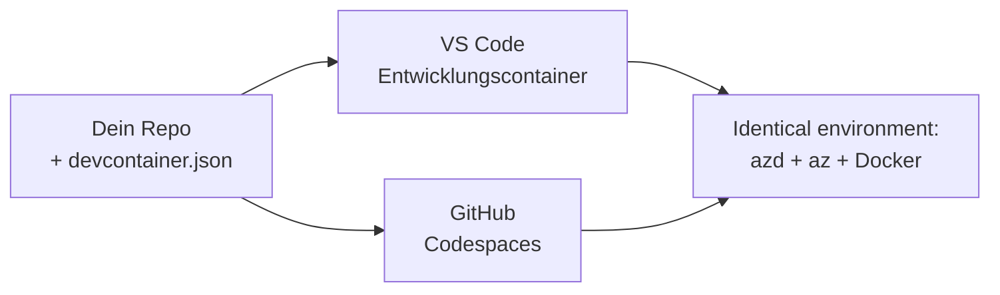

# Dev-Container & GitHub Codespaces für azd

**Kapitel-Navigation:**
- **📚 Kurs-Startseite**: [AZD Für Anfänger](../../README.md)
- **📖 Aktuelles Kapitel**: Kapitel 1 - Grundlagen & Schnellstart
- **⬅️ Vorheriges**: [Bring Your Own App](bring-your-own-app.md)
- **🚀 Nächstes Kapitel**: [Kapitel 2: AI-First Entwicklung](../chapter-02-ai-development/README.md)

> Validiert mit `azd 1.27.1` im Juli 2026.

## Einführung

azd, die passende Sprachlaufzeit, Docker und die Azure CLI auf jedem Gerät zu installieren, ist eine lästige Aufgabe – und der Hauptgrund, warum ein Tutorial, das "auf meinem Rechner funktioniert", bei jemand anderem scheitert. Ein **Dev Container** löst dieses Problem, indem er deine gesamte Toolchain in einer Datei beschreibt. Jeder, der das Projekt in VS Code oder GitHub Codespaces öffnet, erhält exakt die gleiche Umgebung, mit azd bereits installiert. Diese Lektion zeigt dir, wie du einen hinzufügst.

## Lernziele

Am Ende dieser Lektion wirst du:
- Verstehen, was ein Dev Container ist und warum er bei azd hilft
- Eine minimale `.devcontainer/devcontainer.json` zu einem Projekt hinzufügen
- azd, die Azure CLI und Docker über Dev Container *Features* einbinden
- Das Projekt in GitHub Codespaces oder VS Code öffnen

## Lernergebnisse

Nach Abschluss dieser Lektion wirst du in der Lage sein:
- Eine `devcontainer.json` für ein azd-Projekt zu erstellen
- azd und Azure-Tools ohne manuelle Installationen hinzuzufügen
- `azd up` innerhalb eines Containers oder Codespaces auszuführen

---

## Was ist ein Dev Container?

Ein Dev Container ist eine Docker-basierte Entwicklungsumgebung, definiert durch eine `.devcontainer/devcontainer.json` Datei in deinem Repository. Wenn du das Projekt öffnest:

- **VS Code** (mit der Dev Containers-Erweiterung) baut den Container und hängt sich daran an.
- **GitHub Codespaces** baut denselben Container in der Cloud und gibt dir einen browserbasierten Editor.

So oder so erhält jeder Mitwirkende identische Werkzeuge – keine „Hast du azd installiert?“-Probleme mehr.



---

## Schritt 1: Erstelle die devcontainer Datei

Erstelle `.devcontainer/devcontainer.json` im Stammverzeichnis deines Projekts:

```json
{
  "name": "azd-project",
  "image": "mcr.microsoft.com/devcontainers/base:bookworm",
  "features": {
    "ghcr.io/devcontainers/features/azure-cli:1": {},
    "ghcr.io/azure/azure-dev/azd:latest": {},
    "ghcr.io/devcontainers/features/docker-in-docker:2": {},
    "ghcr.io/devcontainers/features/node:1": {}
  },
  "customizations": {
    "vscode": {
      "extensions": [
        "ms-azuretools.azure-dev",
        "ms-azuretools.vscode-bicep"
      ]
    }
  },
  "forwardPorts": [3000],
  "postCreateCommand": "azd version"
}
```

Was jeder Teil bewirkt:

| Schlüssel | Zweck |
|-----|---------|
| `image` | Das Basissystem für den Container |
| `features` | Vorgefertigte Installer – hier: Azure CLI, **azd**, Docker und Node.js |
| `customizations.vscode.extensions` | Installiert automatisch die azd- und Bicep-VS Code-Erweiterungen |
| `forwardPorts` | Macht den Port deiner App im Browser zugänglich |
| `postCreateCommand` | Wird einmal ausgeführt, nachdem der Container gebaut ist (hier eine Überprüfung) |

> Das Feature `ghcr.io/azure/azure-dev/azd:latest` ist der offizielle Weg, um azd in einem Container zu bekommen. Pinn eine bestimmte Version (z.B. `azd:1.27.1`) für Reproduzierbarkeit.

---

## Schritt 2: Passe das Feature an die Sprache deiner App an

Ersetze das `node` Feature durch das, was deine App verwendet:

```jsonc
// Python project
"ghcr.io/devcontainers/features/python:1": {},

// .NET project
"ghcr.io/devcontainers/features/dotnet:2": {},

// Java project
"ghcr.io/devcontainers/features/java:1": {},

// Go project
"ghcr.io/devcontainers/features/go:1": {}
```

Behalte `docker-in-docker`, wenn dein `host` `containerapp`, `aks` oder etwas ist, das Container Images baut – azd benötigt Docker zum Erstellen und Hochladen von Images.

---

## Schritt 3: Öffne es

**In VS Code:**
1. Installiere die **Dev Containers** Erweiterung.
2. Öffne den Projektordner.
3. Klicke auf **Im Container neu öffnen**, wenn du dazu aufgefordert wirst (oder führe *Dev Containers: Reopen in Container* aus).

**In GitHub Codespaces:**
1. Push das Repo zu GitHub.
2. Klicke auf **Code → Codespaces → Codespace auf main erstellen**.
3. Warte, bis der Container gebaut ist – azd ist im Terminal bereit.

---

## Schritt 4: Deployment aus dem Container heraus

Der Container hat azd vorinstalliert, deshalb funktioniert der normale Workflow einfach:

```bash
azd auth login --use-device-code   # Der Gerätecode ist praktisch innerhalb von Codespaces
azd up
```

> **Warum `--use-device-code`?** In einem Remote-Container oder Codespace gibt es keinen lokalen Browser für die Umleitung, daher ist die Geräte-Code-Anmeldung der zuverlässige Weg. Du wirst einen Code in einen Browser-Tab einfügen, um die Anmeldung abzuschließen.

---

## Häufige Stolperfallen

| Stolperfalle | Lösung |
|---------|-----|
| `azd up` kann kein Image bauen | Füge das `docker-in-docker` Feature hinzu |
| Browser-Anmeldung hängt in Codespaces | Nutze `azd auth login --use-device-code` |
| Werkzeuge unterscheiden sich zwischen Teammitgliedern | Pin Feature-Versionen (z.B. `azd:1.27.1`) |
| App im Browser nicht erreichbar | Füge den Port zu `forwardPorts` hinzu |

---

## Zusammenfassung

- Ein Dev Container macht deine azd-Toolchain für alle reproduzierbar.
- Füge azd, die Azure CLI und Docker über Dev Container *Features* hinzu.
- Passe das Sprachfeature an deine App an und behalte `docker-in-docker` für Container Hosts.
- Verwende die Geräte-Code-Anmeldung, wenn du in Codespaces arbeitest.

---

## 🔗 Navigation

| Richtung | Ressource |
|-----------|----------|
| **Vorheriges** | [Bring Your Own App](bring-your-own-app.md) |
| **Kapitel-Startseite** | [Kapitel 1: Grundlagen & Schnellstart](README.md) |
| **Nächstes Kapitel** | [Kapitel 2: AI-First Entwicklung](../chapter-02-ai-development/README.md) |

## 📖 Verwandte Ressourcen

- [Installation & Einrichtung](installation.md)
- [Befehlsübersicht](../../resources/cheat-sheet.md)
- [Offizielle Dev Containers Spezifikation](https://containers.dev/)
- [azd Dev Container Feature](https://github.com/Azure/azure-dev/tree/main/ext/devcontainer)

---

<!-- CO-OP TRANSLATOR DISCLAIMER START -->
**Haftungsausschluss**:
Dieses Dokument wurde mit dem KI-Übersetzungsdienst [Co-op Translator](https://github.com/Azure/co-op-translator) übersetzt. Obwohl wir uns um Genauigkeit bemühen, beachten Sie bitte, dass automatisierte Übersetzungen Fehler oder Ungenauigkeiten enthalten können. Das Originaldokument in seiner Ursprungssprache gilt als maßgebliche Quelle. Bei kritischen Informationen wird eine professionelle menschliche Übersetzung empfohlen. Wir übernehmen keine Haftung für Missverständnisse oder Fehlinterpretationen, die aus der Verwendung dieser Übersetzung entstehen.
<!-- CO-OP TRANSLATOR DISCLAIMER END -->