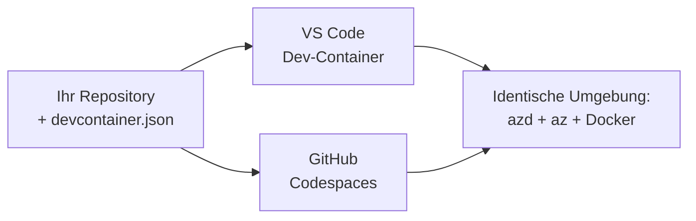

# Dev Containers & GitHub Codespaces für azd

**Kapitel-Navigation:**
- **📚 Kursstart**: [AZD für Einsteiger](../../README.md)
- **📖 Aktuelles Kapitel**: Kapitel 1 - Grundlagen & Schnellstart
- **⬅️ Zurück**: [Bring deine eigene App](bring-your-own-app.md)
- **🚀 Nächstes Kapitel**: [Kapitel 2: KI-zentrierte Entwicklung](../chapter-02-ai-development/README.md)

> Validiert gegen `azd 1.25.6` im Juni 2026.

## Einführung

Die Installation von azd, der richtigen Laufzeitumgebung, Docker und der Azure CLI auf jedem Rechner ist mühsam—und es ist der Hauptgrund, warum ein Tutorial, das "bei mir funktioniert", bei jemand anderem scheitert. Ein **dev container** löst dieses Problem, indem er deine gesamte Toolchain in einer Datei beschreibt. Jeder, der das Projekt in VS Code oder GitHub Codespaces öffnet, erhält exakt dieselbe Umgebung, mit azd bereits installiert. Diese Lektion zeigt dir, wie du einen hinzufügst.

## Lernziele

Am Ende dieser Lektion wirst du:
- Verstehen, was ein dev container ist und warum er bei azd hilft
- Ein minimales `.devcontainer/devcontainer.json` zu einem Projekt hinzufügen
- azd, die Azure CLI und Docker über Dev Container *features* einbeziehen
- Das Projekt in GitHub Codespaces oder VS Code öffnen

## Lernergebnisse

Nach Abschluss dieser Lektion wirst du in der Lage sein:
- Eine `devcontainer.json` für ein azd-Projekt erstellen
- azd und Azure-Tools ohne manuelle Installationen hinzufügen
- `azd up` aus einem Container oder Codespace ausführen

---

## Was ist ein Dev Container?

Ein Dev Container ist eine Docker-basierte Entwicklungsumgebung, die durch eine `.devcontainer/devcontainer.json`-Datei in deinem Repository definiert wird. Wenn du das Projekt öffnest:

- **VS Code** (mit der Erweiterung Dev Containers) baut den Container und verbindet sich damit.
- **GitHub Codespaces** baut denselben Container in der Cloud und stellt dir einen browserbasierten Editor zur Verfügung.

So oder so erhält jede:r Beitragende identische Werkzeuge—keine "Hast du azd installiert?"-Fehlersuche.



---

## Schritt 1: Erstelle die devcontainer-Datei

Erstelle `.devcontainer/devcontainer.json` im Stammverzeichnis deines Projekts:

```json
{
  "name": "azd-project",
  "image": "mcr.microsoft.com/devcontainers/base:bookworm",
  "features": {
    "ghcr.io/devcontainers/features/azure-cli:1": {},
    "ghcr.io/azure/azure-dev/azd:latest": {},
    "ghcr.io/devcontainers/features/docker-in-docker:2": {},
    "ghcr.io/devcontainers/features/node:1": {}
  },
  "customizations": {
    "vscode": {
      "extensions": [
        "ms-azuretools.azure-dev",
        "ms-azuretools.vscode-bicep"
      ]
    }
  },
  "forwardPorts": [3000],
  "postCreateCommand": "azd version"
}
```

Wofür jeder Teil zuständig ist:

| Schlüssel | Zweck |
|-----|---------|
| `image` | Das Basis-Betriebssystem für den Container |
| `features` | Vorgefertigte Installer—hier: Azure CLI, **azd**, Docker und Node.js |
| `customizations.vscode.extensions` | Installiert automatisch die azd- und Bicep-VS-Code-Erweiterungen |
| `forwardPorts` | Öffnet den Port deiner App für den Browser |
| `postCreateCommand` | Wird einmal ausgeführt, nachdem der Container gebaut wurde (hier ein kurzer Funktionstest) |

> Das `ghcr.io/azure/azure-dev/azd:latest`-Feature ist der offizielle Weg, azd in einem Container zu bekommen. Pinne eine spezifische Version (zum Beispiel `azd:1.25.6`), wenn du Reproduzierbarkeit brauchst.

---

## Schritt 2: Das Feature an die Sprache deiner App anpassen

Ersetze das `node`-Feature durch das Feature, das deine App verwendet:

```jsonc
// Python project
"ghcr.io/devcontainers/features/python:1": {},

// .NET project
"ghcr.io/devcontainers/features/dotnet:2": {},

// Java project
"ghcr.io/devcontainers/features/java:1": {},

// Go project
"ghcr.io/devcontainers/features/go:1": {}
```

Behalte `docker-in-docker`, wenn dein `host` `containerapp`, `aks` oder etwas ist, das Container-Images baut—azd benötigt Docker, um Images zu bauen und zu pushen.

---

## Schritt 3: Öffnen

**In VS Code:**
1. Installiere die **Dev Containers**-Erweiterung.
2. Öffne den Projektordner.
3. Klicke auf **Reopen in Container**, wenn du dazu aufgefordert wirst (oder führe *Dev Containers: Reopen in Container* aus).

**In GitHub Codespaces:**
1. Pushe das Repository nach GitHub.
2. Klicke auf **Code → Codespaces → Create codespace on main**.
3. Warte, bis der Container gebaut ist—azd ist im Terminal einsatzbereit.

---

## Schritt 4: Bereitstellen aus dem Container

Der Container hat azd vorinstalliert, daher funktioniert der normale Workflow einfach:

```bash
azd auth login --use-device-code   # Gerätecode ist in Codespaces praktisch.
azd up
```

> **Warum `--use-device-code`?** In einem Remote-Container oder Codespace gibt es keinen lokalen Browser für eine Weiterleitung, daher ist das Device-Code-Login der verlässlichste Weg. Du fügst einen Code in einen Browser-Tab ein, um die Anmeldung abzuschließen.

---

## Häufige Stolperfallen

| Problem | Lösung |
|---------|-----|
| `azd up` can't build an image | Füge das `docker-in-docker`-Feature hinzu |
| Browser login hangs in Codespaces | Verwende `azd auth login --use-device-code` |
| Tools differ between teammates | Pinne Feature-Versionen (z. B. `azd:1.25.6`) |
| App not reachable in browser | Füge den Port zu `forwardPorts` hinzu |

---

## Zusammenfassung

- Ein Dev Container macht deine azd-Toolchain für alle reproduzierbar.
- Füge azd, die Azure CLI und Docker über Dev Container *features* hinzu.
- Passe das Sprach-Feature an deine App an und behalte `docker-in-docker` für Container-Hosts bei.
- Verwende das Device-Code-Login, wenn du in Codespaces arbeitest.

---

## 🔗 Navigation

| Richtung | Ressource |
|-----------|----------|
| **Zurück** | [Bring deine eigene App](bring-your-own-app.md) |
| **Kapitelstart** | [Kapitel 1: Grundlagen & Schnellstart](README.md) |
| **Nächstes Kapitel** | [Kapitel 2: KI-zentrierte Entwicklung](../chapter-02-ai-development/README.md) |

## 📖 Verwandte Ressourcen

- [Installation & Einrichtung](installation.md)
- [Befehlsübersicht](../../resources/cheat-sheet.md)
- [Offizielle Dev-Containers-Spezifikation](https://containers.dev/)
- [azd Dev Container-Feature](https://github.com/Azure/azure-dev/tree/main/ext/devcontainer)

---

<!-- CO-OP TRANSLATOR DISCLAIMER START -->
**Haftungsausschluss**:
Dieses Dokument wurde mit dem KI-Übersetzungsdienst [Co-op Translator](https://github.com/Azure/co-op-translator) übersetzt. Obwohl wir uns um Genauigkeit bemühen, beachten Sie bitte, dass automatisierte Übersetzungen Fehler oder Ungenauigkeiten enthalten können. Das Originaldokument in seiner Ursprungssprache gilt als maßgebliche Quelle. Bei kritischen Informationen wird eine professionelle menschliche Übersetzung empfohlen. Wir übernehmen keine Haftung für Missverständnisse oder Fehlinterpretationen, die aus der Verwendung dieser Übersetzung entstehen.
<!-- CO-OP TRANSLATOR DISCLAIMER END -->