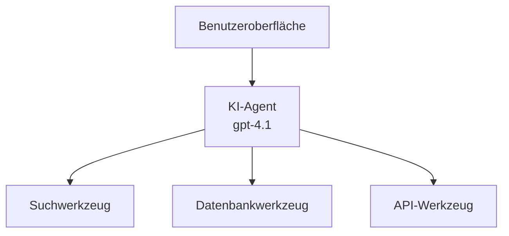
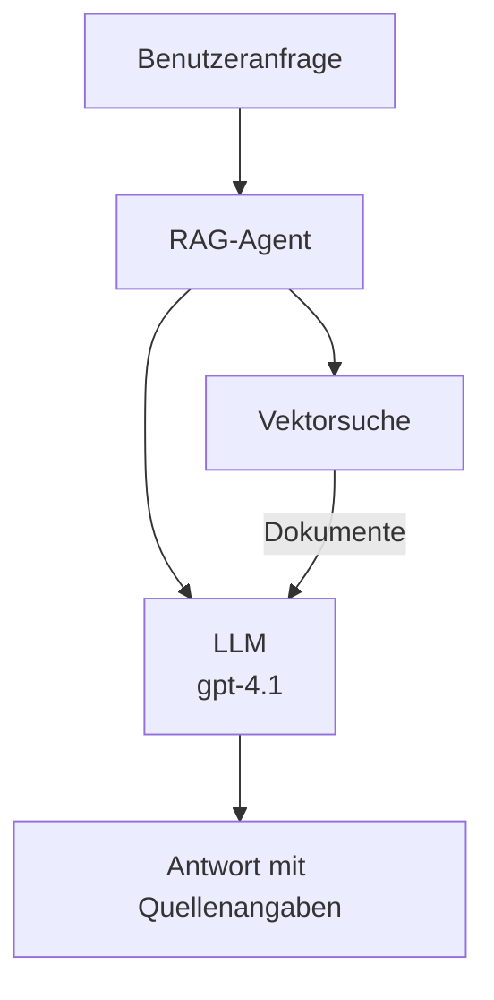
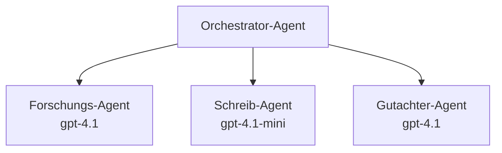

# KI-Agenten mit Azure Developer CLI

**Kapitel-Navigation:**
- **📚 Kursübersicht**: [AZD für Einsteiger](../../README.md)
- **📖 Aktuelles Kapitel**: Kapitel 2 - KI‑zentrierte Entwicklung
- **⬅️ Vorheriges**: [Microsoft Foundry-Integration](microsoft-foundry-integration.md)
- **➡️ Nächstes**: [Bereitstellung von KI-Modellen](ai-model-deployment.md)
- **🚀 Fortgeschritten**: [Multi-Agenten-Lösungen](../../examples/retail-scenario.md)

---

## Einführung

KI-Agenten sind autonome Programme, die ihre Umgebung wahrnehmen, Entscheidungen treffen und Aktionen ausführen, um bestimmte Ziele zu erreichen. Im Gegensatz zu einfachen Chatbots, die auf Eingaben reagieren, können Agenten:

- **Werkzeuge nutzen** - APIs aufrufen, Datenbanken durchsuchen, Code ausführen
- **Planen und schlussfolgern** - Komplexe Aufgaben in Schritte zerlegen
- **Aus dem Kontext lernen** - Speicher behalten und Verhalten anpassen
- **Zusammenarbeiten** - Mit anderen Agenten arbeiten (Multi-Agenten-Systeme)

Dieses Handbuch zeigt, wie man KI-Agenten auf Azure mit dem Azure Developer CLI (azd) bereitstellt.

> **Validierungshinweis (2026-03-25):** Dieses Handbuch wurde mit `azd` `1.23.12` und `azure.ai.agents` `0.1.18-preview` geprüft. Die `azd ai`-Erfahrung befindet sich noch in der Vorschau; prüfen Sie die Hilfefunktionen der Erweiterung, wenn Ihre installierten Flags abweichen.

## Lernziele

Durch Abschluss dieses Leitfadens werden Sie:
- Verstehen, was KI-Agenten sind und wie sie sich von Chatbots unterscheiden
- Vorgefertigte KI-Agenten-Vorlagen mit AZD bereitstellen
- Foundry Agents für benutzerdefinierte Agenten konfigurieren
- Einfache Agentenmuster implementieren (Werkzeugnutzung, RAG, Multi-Agent)
- Bereitgestellte Agenten überwachen und debuggen

## Lernergebnisse

Nach Abschluss werden Sie in der Lage sein:
- KI-Agenten-Anwendungen mit einem einzigen Befehl auf Azure bereitzustellen
- Agentenwerkzeuge und -fähigkeiten zu konfigurieren
- Retrieval-Augmented Generation (RAG) mit Agenten zu implementieren
- Multi-Agenten-Architekturen für komplexe Workflows zu entwerfen
- Häufige Probleme bei der Agentenbereitstellung zu beheben

---

## 🤖 Was macht einen Agenten anders als einen Chatbot?

| Feature | Chatbot | KI-Agent |
|---------|---------|----------|
| **Verhalten** | Antwortet auf Eingaben | Ergreift autonome Maßnahmen |
| **Werkzeuge** | Keine | Kann APIs aufrufen, suchen, Code ausführen |
| **Speicher** | Nur sitzungsbasiert | Persistenter Speicher über Sitzungen hinweg |
| **Planung** | Einzelantwort | Mehrstufiges Denken |
| **Zusammenarbeit** | Einzelne Einheit | Kann mit anderen Agenten zusammenarbeiten |

### Einfache Analogie

- **Chatbot** = Eine hilfsbereite Person, die Fragen an einem Informationsschalter beantwortet
- **KI-Agent** = Ein persönlicher Assistent, der Anrufe tätigen, Termine buchen und Aufgaben für Sie erledigen kann

---

## 🚀 Schnellstart: Ihren ersten Agenten bereitstellen

### Option 1: Foundry Agents-Vorlage (empfohlen)

```bash
# Vorlage für KI-Agenten initialisieren
azd init --template get-started-with-ai-agents

# Auf Azure bereitstellen
azd up
```

**Was bereitgestellt wird:**
- ✅ Foundry Agents
- ✅ Microsoft Foundry Modelle (gpt-4.1)
- ✅ Azure AI Search (für RAG)
- ✅ Azure Container Apps (Weboberfläche)
- ✅ Application Insights (Überwachung)

**Zeit:** ~15-20 Minuten
**Kosten:** ~$100-150/Monat (Entwicklung)

### Option 2: OpenAI-Agent mit Prompty

```bash
# Initialisiere die Prompty-basierte Agentenvorlage
azd init --template agent-openai-python-prompty

# Auf Azure bereitstellen
azd up
```

**Was bereitgestellt wird:**
- ✅ Azure Functions (serverlose Agentenausführung)
- ✅ Microsoft Foundry Modelle
- ✅ Prompty-Konfigurationsdateien
- ✅ Beispielimplementierung eines Agenten

**Zeit:** ~10-15 Minuten
**Kosten:** ~$50-100/Monat (Entwicklung)

### Option 3: RAG-Chat-Agent

```bash
# RAG-Chat-Vorlage initialisieren
azd init --template azure-search-openai-demo

# Auf Azure bereitstellen
azd up
```

**Was bereitgestellt wird:**
- ✅ Microsoft Foundry Modelle
- ✅ Azure AI Search mit Beispielfaten
- ✅ Dokumentverarbeitungspipeline
- ✅ Chat-Oberfläche mit Zitaten

**Zeit:** ~15-25 Minuten
**Kosten:** ~$80-150/Monat (Entwicklung)

### Option 4: AZD AI Agent Init (Manifest- oder Vorlagen-basierte Vorschau)

Wenn Sie eine Agenten-Manifestdatei haben, können Sie den Befehl `azd ai` verwenden, um direkt ein Foundry Agent Service-Projekt zu erstellen. Neuere Preview-Versionen haben außerdem template-basierte Initialisierungsunterstützung hinzugefügt, sodass der genaue Ablauf der Eingabeaufforderungen je nach installierter Erweiterungsversion leicht variieren kann.

```bash
# Installieren Sie die Erweiterung für KI-Agenten
azd extension install azure.ai.agents

# Optional: Überprüfen Sie die installierte Vorschauversion
azd extension show azure.ai.agents

# Aus einem Agentenmanifest initialisieren
azd ai agent init -m agent-manifest.yaml

# In Azure bereitstellen
azd up
```

**Wann `azd ai agent init` vs. `azd init --template` verwenden:**

| Approach | Best For | How It Works |
|----------|----------|------|
| `azd init --template` | Einstieg mit einer funktionierenden Beispiel-App | Klont ein vollständiges Vorlagen-Repo mit Code + Infrastruktur |
| `azd ai agent init -m` | Aufbau anhand Ihres eigenen Agenten-Manifests | Gerüstet Projektstruktur aus Ihrer Agenten-Definition |

> **Tipp:** Verwenden Sie `azd init --template`, wenn Sie lernen (Optionen 1-3 oben). Verwenden Sie `azd ai agent init`, wenn Sie Produktionsagenten mit eigenen Manifests erstellen. Siehe [AZD AI CLI-Befehle](../chapter-08-production/production-ai-practices.md#azd-ai-cli-commands-and-extensions) für die vollständige Referenz.

---

## 🏗️ Agenten-Architektur-Muster

### Muster 1: Einzelner Agent mit Werkzeugen

Das einfachste Agentenmuster – ein Agent, der mehrere Werkzeuge nutzen kann.


**Ideal für:**
- Kunden-Support-Bots
- Rechercheassistenten
- Datenanalyse-Agenten

**AZD-Vorlage:** `azure-search-openai-demo`

### Muster 2: RAG-Agent (Retrieval-Augmented Generation)

Ein Agent, der relevante Dokumente abruft, bevor er Antworten generiert.


**Ideal für:**
- Unternehmenswissensdatenbanken
- Dokumenten-Q&A-Systeme
- Compliance- und Rechtsrecherchen

**AZD-Vorlage:** `azure-search-openai-demo`

### Muster 3: Multi-Agenten-System

Mehrere spezialisierte Agenten arbeiten gemeinsam an komplexen Aufgaben.


**Ideal für:**
- Komplexe Inhaltserstellung
- Mehrstufige Workflows
- Aufgaben, die unterschiedliche Expertise erfordern

**Mehr erfahren:** [Koordinationsmuster für Multi-Agenten](../chapter-06-pre-deployment/coordination-patterns.md)

---

## ⚙️ Agenten-Werkzeuge konfigurieren

Agenten werden mächtig, wenn sie Werkzeuge nutzen können. So konfigurieren Sie gängige Werkzeuge:

### Werkzeugkonfiguration in Foundry Agents

```python
# agent_config.py
from azure.ai.projects import AIProjectClient
from azure.ai.projects.models import FunctionTool, CodeInterpreterTool

# Benutzerdefinierte Werkzeuge definieren
search_tool = FunctionTool(
    name="search_knowledge_base",
    description="Search the company knowledge base for relevant documents",
    parameters={
        "type": "object",
        "properties": {
            "query": {
                "type": "string",
                "description": "The search query"
            }
        },
        "required": ["query"]
    }
)

# Agent mit Werkzeugen erstellen
agent = project_client.agents.create_agent(
    model="gpt-4.1",
    name="Support Agent",
    instructions="You are a helpful support agent. Use the search tool to find relevant information.",
    tools=[search_tool, CodeInterpreterTool()]
)
```

### Umgebungskonfiguration

```bash
# Agentenspezifische Umgebungsvariablen einrichten
azd env set AZURE_OPENAI_MODEL "gpt-4.1"
azd env set AGENT_INSTRUCTIONS "You are a helpful assistant..."
azd env set ENABLE_CODE_INTERPRETER "true"
azd env set ENABLE_FILE_SEARCH "true"

# Mit aktualisierter Konfiguration bereitstellen
azd deploy
```

---

## 📊 Agenten überwachen

### Application Insights-Integration

Alle AZD-Agenten-Vorlagen enthalten Application Insights für die Überwachung:

```bash
# Überwachungs-Dashboard öffnen
azd monitor --overview

# Live-Protokolle anzeigen
azd monitor --logs

# Live-Metriken anzeigen
azd monitor --live
```

### Wichtige Metriken zur Überwachung

| Metric | Description | Target |
|--------|-------------|--------|
| Antwortlatenz | Zeit zur Generierung der Antwort | < 5 Sekunden |
| Tokenverbrauch | Tokens pro Anfrage | Zur Kostenüberwachung |
| Erfolgsrate der Werkzeugaufrufe | % erfolgreicher Werkzeugausführungen | > 95% |
| Fehlerquote | Fehlgeschlagene Agenten-Anfragen | < 1% |
| Benutzerzufriedenheit | Feedback-Scores | > 4.0/5.0 |

### Benutzerdefiniertes Logging für Agenten

```python
import os
from azure.monitor.opentelemetry import configure_azure_monitor
from opentelemetry import trace

# Azure Monitor mit OpenTelemetry konfigurieren
configure_azure_monitor(
    connection_string=os.environ["APPLICATIONINSIGHTS_CONNECTION_STRING"]
)

tracer = trace.get_tracer(__name__)

def log_agent_interaction(user_query, agent_response, tools_used, latency_ms):
    with tracer.start_as_current_span("agent_interaction") as span:
        span.set_attributes({
            "user_query": user_query,
            "response_length": len(agent_response),
            "tools_used": tools_used,
            "latency_ms": latency_ms
        })
```

> **Hinweis:** Installieren Sie die erforderlichen Pakete: `pip install azure-monitor-opentelemetry opentelemetry`

---

## 💰 Kostenüberlegungen

### Geschätzte monatliche Kosten nach Muster

| Pattern | Dev Environment | Production |
|---------|-----------------|------------|
| Einzelner Agent | $50-100 | $200-500 |
| RAG-Agent | $80-150 | $300-800 |
| Multi-Agenten (2-3 Agenten) | $150-300 | $500-1,500 |
| Unternehmens-Multi-Agenten | $300-500 | $1,500-5,000+ |

### Tipps zur Kostenoptimierung

1. **Verwenden Sie gpt-4.1-mini für einfache Aufgaben**
   ```bash
   azd env set AZURE_OPENAI_MODEL "gpt-4.1-mini"
   ```

2. **Caching für wiederholte Abfragen implementieren**
   ```python
   from functools import lru_cache
   
   @lru_cache(maxsize=1000)
   def get_cached_response(query_hash):
       return agent.run(query_hash)
   ```

3. **Token-Limits pro Lauf setzen**
   ```python
   # Setze max_completion_tokens beim Ausführen des Agenten, nicht während der Erstellung
   run = project_client.agents.create_run(
       thread_id=thread.id,
       agent_id=agent.id,
       max_completion_tokens=1000  # Begrenze die Antwortlänge
   )
   ```

4. **Bei Nichtgebrauch auf Null skalieren**
   ```bash
   # Container-Apps skalieren automatisch auf null
   azd env set MIN_REPLICAS "0"
   ```

---

## 🔧 Fehlerbehebung für Agenten

### Häufige Probleme und Lösungen

<details>
<summary><strong>❌ Agent reagiert nicht auf Werkzeugaufrufe</strong></summary>

```bash
# Überprüfen, ob Tools ordnungsgemäß registriert sind
azd show

# OpenAI-Bereitstellung überprüfen
az cognitiveservices account deployment list \
  --name $AZURE_OPENAI_NAME \
  --resource-group $RG_NAME

# Agentenprotokolle überprüfen
azd monitor --logs
```

**Häufige Ursachen:**
- Unstimmigkeit in der Signatur der Tool-Funktion
- Fehlende erforderliche Berechtigungen
- API-Endpunkt nicht erreichbar
</details>

<details>
<summary><strong>❌ Hohe Latenz bei Agentenantworten</strong></summary>

```bash
# Überprüfen Sie Application Insights auf Engpässe
azd monitor --live

# Erwägen Sie die Verwendung eines schnelleren Modells
azd env set AZURE_OPENAI_MODEL "gpt-4.1-mini"
azd deploy
```

**Optimierungstipps:**
- Streaming-Antworten verwenden
- Antwort-Caching implementieren
- Kontextfenster verkleinern
</details>

<details>
<summary><strong>❌ Agent gibt falsche oder halluzinierte Informationen zurück</strong></summary>

```python
# Mit besseren Systemaufforderungen verbessern
instructions = """
You are a helpful assistant. IMPORTANT:
- Only answer based on provided context
- If you don't know, say "I don't know"
- Always cite your sources
- Never make up information
"""

# Abruf zur Verankerung hinzufügen
agent = project_client.agents.create_agent(
    model="gpt-4.1",
    instructions=instructions,
    tools=[FileSearchTool()]  # Antworten in Dokumenten verankern
)
```
</details>

<details>
<summary><strong>❌ Fehler: Token-Limit überschritten</strong></summary>

```python
# Kontextfensterverwaltung implementieren
def truncate_context(messages, max_tokens=8000, model="gpt-4.1"):
    """Keep only recent messages within token limit."""
    import tiktoken
    encoding = tiktoken.encoding_for_model(model)
    total_tokens = 0
    truncated = []
    
    for msg in reversed(messages):
        msg_tokens = len(encoding.encode(msg.content))
        if total_tokens + msg_tokens > max_tokens:
            break
        truncated.insert(0, msg)
        total_tokens += msg_tokens
    
    return truncated
```
</details>

---

## 🎓 Praktische Übungen

### Übung 1: Einen einfachen Agenten bereitstellen (20 Minuten)

**Ziel:** Ihren ersten KI-Agenten mit AZD bereitstellen

```bash
# Schritt 1: Vorlage initialisieren
azd init --template get-started-with-ai-agents

# Schritt 2: Bei Azure anmelden
azd auth login
# Wenn Sie über mehrere Mandanten hinweg arbeiten, fügen Sie --tenant-id <tenant-id> hinzu

# Schritt 3: Bereitstellen
azd up

# Schritt 4: Den Agenten testen
# Erwartete Ausgabe nach der Bereitstellung:
#   Bereitstellung abgeschlossen!
#   Endpunkt: https://<app-name>.<region>.azurecontainerapps.io
# Öffnen Sie die in der Ausgabe angezeigte URL und versuchen Sie, eine Frage zu stellen

# Schritt 5: Überwachung anzeigen
azd monitor --overview

# Schritt 6: Bereinigen
azd down --force --purge
```

**Erfolgskriterien:**
- [ ] Agent antwortet auf Fragen
- [ ] Kann über `azd monitor` auf das Monitoring-Dashboard zugreifen
- [ ] Ressourcen erfolgreich bereinigt

### Übung 2: Ein benutzerdefiniertes Tool hinzufügen (30 Minuten)

**Ziel:** Einen Agenten mit einem benutzerdefinierten Tool erweitern

1. Stellen Sie die Agentenvorlage bereit:
   ```bash
   azd init --template get-started-with-ai-agents
   azd up
   ```
2. Erstellen Sie eine neue Tool-Funktion in Ihrem Agentencode:
   ```python
   def get_weather(location: str) -> str:
       """Get current weather for a location."""
       # API-Aufruf an den Wetterdienst
       return f"Weather in {location}: Sunny, 72°F"
   ```
3. Registrieren Sie das Tool beim Agenten:
   ```python
   from azure.ai.projects.models import FunctionTool

   weather_tool = FunctionTool(
       name="get_weather",
       description="Get current weather for a location",
       parameters={
           "type": "object",
           "properties": {
               "location": {"type": "string", "description": "City name"}
           },
           "required": ["location"]
       }
   )

   agent = project_client.agents.create_agent(
       model="gpt-4.1",
       name="Weather Agent",
       tools=[weather_tool]
   )
   ```
4. Erneut bereitstellen und testen:
   ```bash
   azd deploy
   # Frage: "Wie ist das Wetter in Seattle?"
   # Erwartet: Agent ruft get_weather("Seattle") auf und gibt Wetterinformationen zurück
   ```

**Erfolgskriterien:**
- [ ] Agent erkennt fragen zu Wetterthemen
- [ ] Tool wird korrekt aufgerufen
- [ ] Antwort enthält Wetterinformationen

### Übung 3: Einen RAG-Agenten erstellen (45 Minuten)

**Ziel:** Einen Agenten erstellen, der Fragen aus Ihren Dokumenten beantwortet

```bash
# Schritt 1: Bereitstellen der RAG-Vorlage
azd init --template azure-search-openai-demo
azd up

# Schritt 2: Laden Sie Ihre Dokumente hoch
# Legen Sie PDF/TXT-Dateien in das Verzeichnis data/ und führen Sie dann aus:
python scripts/prepdocs.py

# Schritt 3: Testen Sie mit domänenspezifischen Fragen
# Öffnen Sie die Web-App-URL aus der Ausgabe von azd up
# Stellen Sie Fragen zu Ihren hochgeladenen Dokumenten
# Antworten sollten Zitationsverweise wie [doc.pdf] enthalten
```

**Erfolgskriterien:**
- [ ] Agent antwortet basierend auf hochgeladenen Dokumenten
- [ ] Antworten enthalten Zitate
- [ ] Keine Halluzinationen bei Fragen außerhalb des Geltungsbereichs

---

## 📚 Nächste Schritte

Nun, da Sie KI-Agenten verstanden haben, erkunden Sie diese fortgeschrittenen Themen:

| Thema | Beschreibung | Link |
|-------|-------------|------|
| **Multi-Agenten-Systeme** | Systeme mit mehreren zusammenarbeitenden Agenten bauen | [Einzelhandels-Multi-Agent-Beispiel](../../examples/retail-scenario.md) |
| **Koordinationsmuster** | Orchestrierungs- und Kommunikationsmuster lernen | [Koordinationsmuster](../chapter-06-pre-deployment/coordination-patterns.md) |
| **Produktionsbereitstellung** | Agentenbereitstellung für Unternehmen | [Produktions-KI-Praktiken](../chapter-08-production/production-ai-practices.md) |
| **Agentenbewertung** | Agentenleistung testen und bewerten | [KI-Fehlerbehebung](../chapter-07-troubleshooting/ai-troubleshooting.md) |
| **KI-Workshop-Labor** | Praxis: Machen Sie Ihre KI-Lösung AZD‑bereit | [AI Workshop Lab](ai-workshop-lab.md) |

---

## 📖 Weitere Ressourcen

### Offizielle Dokumentation
- [Azure AI Agent Service](https://learn.microsoft.com/azure/ai-services/agents/)
- [Azure AI Foundry Agent Service Quickstart](https://learn.microsoft.com/azure/ai-services/agents/quickstart)
- [Semantic Kernel Agent Framework](https://learn.microsoft.com/semantic-kernel/)

### AZD-Vorlagen für Agenten
- [Get Started with AI Agents](https://github.com/Azure-Samples/get-started-with-ai-agents)
- [Agent OpenAI Python Prompty](https://github.com/Azure-Samples/agent-openai-python-prompty)
- [Azure Search OpenAI Demo](https://github.com/Azure-Samples/azure-search-openai-demo)

### Community-Ressourcen
- [Awesome AZD - Agent Templates](https://azure.github.io/awesome-azd/?tags=ai-agents)
- [Azure AI Discord](https://discord.gg/microsoft-azure)
- [Microsoft Foundry Discord](https://discord.gg/nTYy5BXMWG)

### Agenten-Fertigkeiten für Ihren Editor
- [**Microsoft Azure Agent-Fertigkeiten**](https://skills.sh/microsoft/github-copilot-for-azure) - Installieren Sie wiederverwendbare KI-Agenten-Fertigkeiten für die Azure-Entwicklung in GitHub Copilot, Cursor oder jedem unterstützten Agenten. Enthält Fertigkeiten für [Azure AI](https://skills.sh/microsoft/github-copilot-for-azure/azure-ai), [Microsoft Foundry](https://skills.sh/microsoft/github-copilot-for-azure/microsoft-foundry), [Bereitstellung](https://skills.sh/microsoft/github-copilot-for-azure/azure-deploy) und [Diagnose](https://skills.sh/microsoft/github-copilot-for-azure/azure-diagnostics):
  ```bash
  npx skills add microsoft/github-copilot-for-azure
  ```

---

**Navigation**
- **Vorherige Lektion**: [Microsoft Foundry-Integration](microsoft-foundry-integration.md)
- **Nächste Lektion**: [Bereitstellung von KI-Modellen](ai-model-deployment.md)

---

<!-- CO-OP TRANSLATOR DISCLAIMER START -->
**Haftungsausschluss**:
Dieses Dokument wurde mithilfe des KI-Übersetzungsdienstes [Co-op Translator](https://github.com/Azure/co-op-translator) übersetzt. Obwohl wir uns um Genauigkeit bemühen, beachten Sie bitte, dass automatisierte Übersetzungen Fehler oder Ungenauigkeiten enthalten können. Das Originaldokument in seiner Ursprungssprache ist als verbindliche Quelle zu betrachten. Für kritische Informationen wird eine professionelle menschliche Übersetzung empfohlen. Wir haften nicht für Missverständnisse oder Fehlinterpretationen, die aus der Verwendung dieser Übersetzung entstehen.
<!-- CO-OP TRANSLATOR DISCLAIMER END -->