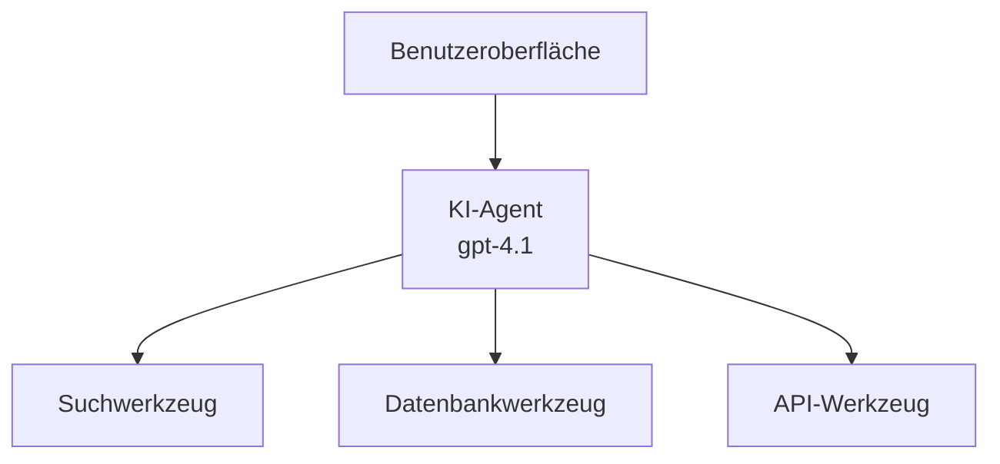
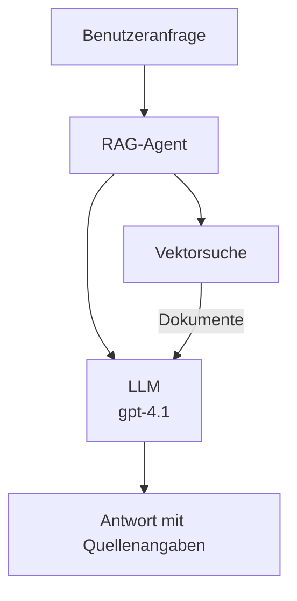
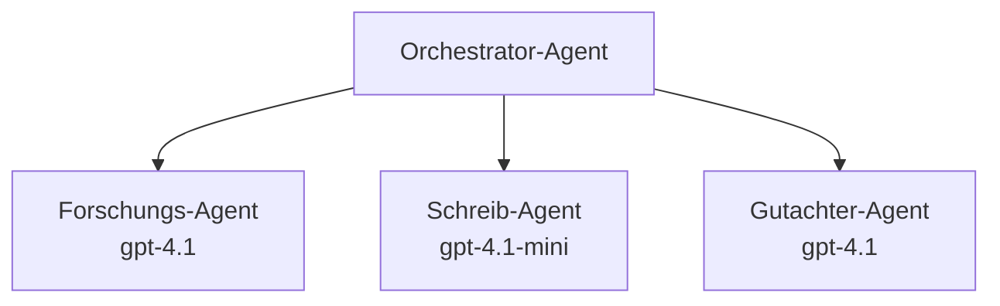

# KI-Agenten mit Azure Developer CLI

**Kapitel-Navigation:**
- **📚 Kurs-Startseite**: [AZD für Anfänger](../../README.md)
- **📖 Aktuelles Kapitel**: Kapitel 2 - KI-First-Entwicklung
- **⬅️ Vorherige**: [Microsoft Foundry Integration](microsoft-foundry-integration.md)
- **➡️ Nächste**: [AI Model Deployment](ai-model-deployment.md)
- **🚀 Fortgeschrittene**: [Multi-Agenten-Lösungen](../../examples/retail-scenario.md)

---

## Einführung

KI-Agenten sind autonome Programme, die ihre Umgebung wahrnehmen, Entscheidungen treffen und Aktionen ausführen können, um bestimmte Ziele zu erreichen. Im Gegensatz zu einfachen Chatbots, die auf Eingaben reagieren, können Agenten:

- **Werkzeuge verwenden** - APIs aufrufen, Datenbanken durchsuchen, Code ausführen
- **Planen und schlussfolgern** - Komplexe Aufgaben in Schritte aufteilen
- **Aus dem Kontext lernen** - Erinnerung behalten und Verhalten anpassen
- **Zusammenarbeiten** - Mit anderen Agenten (Multi-Agenten-Systeme) arbeiten

Dieser Leitfaden zeigt, wie Sie KI-Agenten mit Azure Developer CLI (azd) in Azure bereitstellen.

> **Validierungshinweis (2026-03-25):** Dieser Leitfaden wurde gegen `azd` `1.23.12` und `azure.ai.agents` `0.1.18-preview` überprüft. Die `azd ai`-Erfahrung ist noch preview-getrieben; prüfen Sie die Hilfe der Erweiterung, wenn Ihre installierten Flags abweichen.

## Lernziele

Durch das Abschließen dieses Leitfadens werden Sie:
- Verstehen, was KI-Agenten sind und wie sie sich von Chatbots unterscheiden
- Vorgefertigte KI-Agenten-Templates mit AZD bereitstellen
- Foundry Agents für benutzerdefinierte Agenten konfigurieren
- Grundlegende Agentenmuster implementieren (Werkzeugnutzung, RAG, Multi-Agent)
- Bereitgestellte Agenten überwachen und debuggen

## Lernergebnisse

Nach Abschluss sind Sie in der Lage:
- KI-Agenten-Anwendungen mit einem einzigen Befehl in Azure bereitzustellen
- Agenten-Werkzeuge und -Fähigkeiten zu konfigurieren
- Retrieval-Augmented Generation (RAG) mit Agenten zu implementieren
- Multi-Agenten-Architekturen für komplexe Workflows zu entwerfen
- Häufige Probleme bei der Agentenbereitstellung zu beheben

---

## 🤖 Was unterscheidet einen Agenten von einem Chatbot?

| Merkmal | Chatbot | KI-Agent |
|---------|---------|----------|
| **Verhalten** | Reagiert auf Eingaben | Führt autonome Aktionen aus |
| **Werkzeuge** | Keine | Kann APIs aufrufen, suchen, Code ausführen |
| **Speicher** | Nur sitzungsbasiert | Persistenter Speicher über Sitzungen hinweg |
| **Planung** | Einzelne Antwort | Mehrstufiges Schlussfolgern |
| **Zusammenarbeit** | Einzelne Einheit | Kann mit anderen Agenten zusammenarbeiten |

### Einfache Analogie

- **Chatbot** = Eine hilfreiche Person, die Fragen an einem Informationsschalter beantwortet
- **KI-Agent** = Ein persönlicher Assistent, der Anrufe tätigen, Termine buchen und Aufgaben für Sie erledigen kann

---

## 🚀 Schnellstart: Setzen Sie Ihren ersten Agenten ein

### Option 1: Foundry Agents Template (Empfohlen)

```bash
# Initialisiere die Vorlage für KI-Agenten
azd init --template get-started-with-ai-agents

# In Azure bereitstellen
azd up
```

**Wird bereitgestellt:**
- ✅ Foundry Agents
- ✅ Microsoft Foundry Models (gpt-4.1)
- ✅ Azure AI Search (für RAG)
- ✅ Azure Container Apps (Weboberfläche)
- ✅ Application Insights (Überwachung)

**Zeit:** ~15–20 Minuten
**Kosten:** ~100–150 $/Monat (Entwicklung)

### Option 2: OpenAI Agent mit Prompty

```bash
# Initialisiere die auf Prompty basierende Agentenvorlage
azd init --template agent-openai-python-prompty

# In Azure bereitstellen
azd up
```

**Wird bereitgestellt:**
- ✅ Azure Functions (serverlose Agentenausführung)
- ✅ Microsoft Foundry Models
- ✅ Prompty-Konfigurationsdateien
- ✅ Beispielimplementierung eines Agenten

**Zeit:** ~10–15 Minuten
**Kosten:** ~50–100 $/Monat (Entwicklung)

### Option 3: RAG-Chat-Agent

```bash
# RAG-Chat-Vorlage initialisieren
azd init --template azure-search-openai-demo

# Auf Azure bereitstellen
azd up
```

**Wird bereitgestellt:**
- ✅ Microsoft Foundry Models
- ✅ Azure AI Search mit Beispieldaten
- ✅ Dokumentverarbeitungspipeline
- ✅ Chat-Oberfläche mit Zitaten

**Zeit:** ~15–25 Minuten
**Kosten:** ~80–150 $/Monat (Entwicklung)

### Option 4: AZD AI Agent Init (Manifest- oder Template-basiert, Preview)

Wenn Sie eine Agentenmanifestdatei haben, können Sie den `azd ai`-Befehl verwenden, um direkt ein Foundry Agent Service-Projekt zu scaffolden. Jüngste Preview-Versionen haben außerdem template-basierte Initialisierungsunterstützung hinzugefügt, sodass der genaue Ablauf der Eingabeaufforderungen je nach installierter Erweiterungsversion leicht abweichen kann.

```bash
# Installieren Sie die KI-Agenten-Erweiterung
azd extension install azure.ai.agents

# Optional: Überprüfen Sie die installierte Vorschauversion
azd extension show azure.ai.agents

# Aus einem Agentenmanifest initialisieren
azd ai agent init -m agent-manifest.yaml

# Auf Azure bereitstellen
azd up

# Testen Sie den bereitgestellten Agenten (zeigt Latenz und Zeit bis zum ersten Byte)
azd ai agent invoke
```

**Wann Sie `azd ai agent init` vs. `azd init --template` verwenden sollten:**

| Ansatz | Am besten für | Funktionsweise |
|----------|----------|------|
| `azd init --template` | Starten mit einer funktionierenden Beispiel-App | Klont ein vollständiges Template-Repo mit Code + Infrastruktur |
| `azd ai agent init -m` | Erstellen aus Ihrem eigenen Agentenmanifest | Scaffoldt die Projektstruktur aus Ihrer Agentendefinition |

> **Tipp:** Verwenden Sie `azd init --template`, wenn Sie lernen (Optionen 1–3 oben). Verwenden Sie `azd ai agent init`, wenn Sie Produktionsagenten mit eigenen Manifesten erstellen.

Nach `azd up` führt dieselbe Erweiterung Sie durch den restlichen Agenten-Lifecycle: `azd ai agent invoke` zum Testen, `azd ai agent eval generate` und `azd ai agent optimize` zum Messen und Verbessern der Qualität sowie `azd ai agent delete` zum Bereinigen. Siehe [AZD AI CLI-Befehle](../chapter-08-production/production-ai-practices.md#azd-ai-cli-commands-and-extensions) für die vollständige Referenz.

---

## 🏗️ Agent-Architektur-Muster

### Muster 1: Ein einzelner Agent mit Werkzeugen

Das einfachste Agentenmuster – ein Agent, der mehrere Werkzeuge nutzen kann.



**Am besten für:**
- Kunden-Support-Bots
- Rechercheassistenten
- Datenanalyse-Agenten

**AZD Template:** `azure-search-openai-demo`

### Muster 2: RAG-Agent (Retrieval-Augmented Generation)

Ein Agent, der relevante Dokumente abruft, bevor er Antworten generiert.



**Am besten für:**
- Unternehmenswissensdatenbanken
- Dokumenten-Q&A-Systeme
- Compliance- und Rechtsrecherche

**AZD Template:** `azure-search-openai-demo`

### Muster 3: Multi-Agenten-System

Mehrere spezialisierte Agenten, die zusammen an komplexen Aufgaben arbeiten.



**Am besten für:**
- Komplexe Inhaltserstellung
- Mehrstufige Workflows
- Aufgaben, die unterschiedliche Fachkompetenzen erfordern

**Mehr erfahren:** [Koordinationsmuster für Multi-Agenten](../chapter-06-pre-deployment/coordination-patterns.md)

---

## ⚙️ Konfigurieren von Agenten-Tools

Agenten werden mächtig, wenn sie Werkzeuge verwenden können. So konfigurieren Sie gängige Werkzeuge:

### Werkzeugkonfiguration in Foundry Agents

```python
# agent_config.py
from azure.ai.projects import AIProjectClient
from azure.ai.projects.models import FunctionTool, CodeInterpreterTool

# Benutzerdefinierte Tools definieren
search_tool = FunctionTool(
    name="search_knowledge_base",
    description="Search the company knowledge base for relevant documents",
    parameters={
        "type": "object",
        "properties": {
            "query": {
                "type": "string",
                "description": "The search query"
            }
        },
        "required": ["query"]
    }
)

# Agent mit Tools erstellen
agent = project_client.agents.create_agent(
    model="gpt-4.1",
    name="Support Agent",
    instructions="You are a helpful support agent. Use the search tool to find relevant information.",
    tools=[search_tool, CodeInterpreterTool()]
)
```

### Umgebungskonfiguration

```bash
# Richte agentenspezifische Umgebungsvariablen ein
azd env set AZURE_OPENAI_MODEL "gpt-4.1"
azd env set AGENT_INSTRUCTIONS "You are a helpful assistant..."
azd env set ENABLE_CODE_INTERPRETER "true"
azd env set ENABLE_FILE_SEARCH "true"

# Mit aktualisierter Konfiguration bereitstellen
azd deploy
```

---

## 📊 Überwachen von Agenten

### Integration von Application Insights

Alle AZD-Agenten-Templates enthalten Application Insights für die Überwachung:

```bash
# Überwachungs-Dashboard öffnen
azd monitor --overview

# Echtzeitprotokolle anzeigen
azd monitor --logs

# Echtzeitmetriken anzeigen
azd monitor --live
```

### Wichtige Metriken zur Überwachung

| Metrik | Beschreibung | Ziel |
|--------|-------------|--------|
| Antwortlatenz | Zeit zur Generierung einer Antwort | < 5 Sekunden |
| Token-Nutzung | Tokens pro Anfrage | Zur Kostenüberwachung |
| Erfolgsquote von Werkzeugaufrufen | % erfolgreicher Werkzeugausführungen | > 95% |
| Fehlerquote | Fehlgeschlagene Agentenanfragen | < 1% |
| Benutzerzufriedenheit | Bewertungswerte | > 4,0/5,0 |

### Benutzerdefiniertes Logging für Agenten

```python
import os
from azure.monitor.opentelemetry import configure_azure_monitor
from opentelemetry import trace

# Azure Monitor mit OpenTelemetry konfigurieren
configure_azure_monitor(
    connection_string=os.environ["APPLICATIONINSIGHTS_CONNECTION_STRING"]
)

tracer = trace.get_tracer(__name__)

def log_agent_interaction(user_query, agent_response, tools_used, latency_ms):
    with tracer.start_as_current_span("agent_interaction") as span:
        span.set_attributes({
            "user_query": user_query,
            "response_length": len(agent_response),
            "tools_used": tools_used,
            "latency_ms": latency_ms
        })
```

> **Hinweis:** Installieren Sie die erforderlichen Pakete: `pip install azure-monitor-opentelemetry opentelemetry`

---

## 💰 Kostenüberlegungen

### Geschätzte monatliche Kosten nach Muster

| Muster | Entwicklungsumgebung | Produktion |
|---------|-----------------|------------|
| Einzelner Agent | 50–100 $ | 200–500 $ |
| RAG-Agent | 80–150 $ | 300–800 $ |
| Multi-Agent (2–3 Agenten) | 150–300 $ | 500–1.500 $ |
| Enterprise Multi-Agent | 300–500 $ | 1.500–5.000+ $ |

### Tipps zur Kostenoptimierung

1. **Verwenden Sie gpt-4.1-mini für einfache Aufgaben**
   ```bash
   azd env set AZURE_OPENAI_MODEL "gpt-4.1-mini"
   ```

2. **Implementieren Sie Caching für wiederholte Abfragen**
   ```python
   from functools import lru_cache
   
   @lru_cache(maxsize=1000)
   def get_cached_response(query_hash):
       return agent.run(query_hash)
   ```

3. **Setzen Sie Token-Limits pro Ausführung**
   ```python
   # Setze max_completion_tokens beim Ausführen des Agents, nicht bei der Erstellung
   run = project_client.agents.create_run(
       thread_id=thread.id,
       agent_id=agent.id,
       max_completion_tokens=1000  # Begrenze die Antwortlänge
   )
   ```

4. **Auf Null skalieren, wenn nicht in Gebrauch**
   ```bash
   # Container-Apps skalieren automatisch auf null
   azd env set MIN_REPLICAS "0"
   ```

---

## 🔧 Fehlerbehebung bei Agenten

### Häufige Probleme und Lösungen

<details>
<summary><strong>❌ Agent reagiert nicht auf Werkzeugaufrufe</strong></summary>

```bash
# Überprüfe, ob Werkzeuge korrekt registriert sind
azd show

# Überprüfe die OpenAI-Bereitstellung
az cognitiveservices account deployment list \
  --name $AZURE_OPENAI_NAME \
  --resource-group $RG_NAME

# Überprüfe die Agentenprotokolle
azd monitor --logs
```

**Häufige Ursachen:**
- Falsche Funktionssignatur des Werkzeugs
- Fehlende erforderliche Berechtigungen
- API-Endpunkt nicht erreichbar
</details>

<details>
<summary><strong>❌ Hohe Latenz bei Agentenantworten</strong></summary>

```bash
# Überprüfen Sie Application Insights auf Engpässe
azd monitor --live

# Erwägen Sie die Verwendung eines schnelleren Modells
azd env set AZURE_OPENAI_MODEL "gpt-4.1-mini"
azd deploy
```

**Optimierungstipps:**
- Streaming-Antworten verwenden
- Antwort-Caching implementieren
- Kontextfenster verkleinern
</details>

<details>
<summary><strong>❌ Agent liefert falsche oder halluzinierte Informationen</strong></summary>

```python
# Mit besseren Systemaufforderungen verbessern
instructions = """
You are a helpful assistant. IMPORTANT:
- Only answer based on provided context
- If you don't know, say "I don't know"
- Always cite your sources
- Never make up information
"""

# Füge Abrufmechanismen zur Verankerung hinzu
agent = project_client.agents.create_agent(
    model="gpt-4.1",
    instructions=instructions,
    tools=[FileSearchTool()]  # Antworten in Dokumenten verankern
)
```
</details>

<details>
<summary><strong>❌ Token-Limit-Überschreitungsfehler</strong></summary>

```python
# Kontextfensterverwaltung implementieren
def truncate_context(messages, max_tokens=8000, model="gpt-4.1"):
    """Keep only recent messages within token limit."""
    import tiktoken
    encoding = tiktoken.encoding_for_model(model)
    total_tokens = 0
    truncated = []
    
    for msg in reversed(messages):
        msg_tokens = len(encoding.encode(msg.content))
        if total_tokens + msg_tokens > max_tokens:
            break
        truncated.insert(0, msg)
        total_tokens += msg_tokens
    
    return truncated
```
</details>

---

## 🎓 Praktische Übungen

### Übung 1: Einen Basis-Agenten bereitstellen (20 Minuten)

**Ziel:** Setzen Sie Ihren ersten KI-Agenten mit AZD ein

```bash
# Schritt 1: Vorlage initialisieren
azd init --template get-started-with-ai-agents

# Schritt 2: Bei Azure anmelden
azd auth login
# Wenn Sie über mehrere Mandanten arbeiten, fügen Sie --tenant-id <tenant-id> hinzu

# Schritt 3: Bereitstellen
azd up

# Schritt 4: Den Agenten testen
# Erwartete Ausgabe nach der Bereitstellung:
#   Bereitstellung abgeschlossen!
#   Endpunkt: https://<app-name>.<region>.azurecontainerapps.io
# Öffnen Sie die in der Ausgabe angezeigte URL und versuchen Sie, eine Frage zu stellen

# Schritt 5: Überwachung anzeigen
azd monitor --overview

# Schritt 6: Aufräumen
azd down --force --purge
```

**Erfolgskriterien:**
- [ ] Agent beantwortet Fragen
- [ ] Kann auf das Überwachungs-Dashboard über `azd monitor` zugreifen
- [ ] Ressourcen erfolgreich bereinigt

### Übung 2: Ein benutzerdefiniertes Werkzeug hinzufügen (30 Minuten)

**Ziel:** Erweitern Sie einen Agenten mit einem benutzerdefinierten Werkzeug

1. Stelle das Agenten-Template bereit:
   ```bash
   azd init --template get-started-with-ai-agents
   azd up
   ```
2. Erstelle eine neue Werkzeugfunktion in deinem Agentencode:
   ```python
   def get_weather(location: str) -> str:
       """Get current weather for a location."""
       # API-Aufruf zum Wetterdienst
       return f"Weather in {location}: Sunny, 72°F"
   ```
3. Registriere das Werkzeug beim Agenten:
   ```python
   from azure.ai.projects.models import FunctionTool

   weather_tool = FunctionTool(
       name="get_weather",
       description="Get current weather for a location",
       parameters={
           "type": "object",
           "properties": {
               "location": {"type": "string", "description": "City name"}
           },
           "required": ["location"]
       }
   )

   agent = project_client.agents.create_agent(
       model="gpt-4.1",
       name="Weather Agent",
       tools=[weather_tool]
   )
   ```
4. Redeployen und testen:
   ```bash
   azd deploy
   # Frage: "Wie ist das Wetter in Seattle?"
   # Erwartet: Agent ruft get_weather("Seattle") auf und gibt Wetterinformationen zurück
   ```

**Erfolgskriterien:**
- [ ] Agent erkennt wetterbezogene Anfragen
- [ ] Werkzeug wird korrekt aufgerufen
- [ ] Antwort enthält Wetterinformationen

### Übung 3: Einen RAG-Agenten erstellen (45 Minuten)

**Ziel:** Erstellen Sie einen Agenten, der Fragen aus Ihren Dokumenten beantwortet

```bash
# Schritt 1: RAG-Vorlage bereitstellen
azd init --template azure-search-openai-demo
azd up

# Schritt 2: Laden Sie Ihre Dokumente hoch
# Legen Sie PDF/TXT-Dateien in das Verzeichnis data/ und führen Sie dann aus:
python scripts/prepdocs.py

# Schritt 3: Testen Sie mit domänenspezifischen Fragen
# Öffnen Sie die Web-App-URL aus der Ausgabe von azd up
# Stellen Sie Fragen zu Ihren hochgeladenen Dokumenten
# Antworten sollten Quellenverweise wie [doc.pdf] enthalten
```

**Erfolgskriterien:**
- [ ] Agent antwortet aus hochgeladenen Dokumenten
- [ ] Antworten enthalten Zitate
- [ ] Keine Halluzinationen bei Fragen außerhalb des Bereichs

---

## 📚 Nächste Schritte

Jetzt, da Sie KI-Agenten verstehen, erkunden Sie diese fortgeschrittenen Themen:

| Thema | Beschreibung | Link |
|-------|-------------|------|
| **Multi-Agenten-Systeme** | Systeme mit mehreren zusammenarbeitenden Agenten bauen | [Retail Multi-Agent Example](../../examples/retail-scenario.md) |
| **Koordinationsmuster** | Erlernen von Orchestrierungs- und Kommunikationsmustern | [Koordinationsmuster](../chapter-06-pre-deployment/coordination-patterns.md) |
| **Produktionsbereitstellung** | Agentenbereitstellung für Unternehmen | [Production AI Practices](../chapter-08-production/production-ai-practices.md) |
| **Agentenevaluation** | Testen und Bewerten der Agentenleistung | [AI Troubleshooting](../chapter-07-troubleshooting/ai-troubleshooting.md) |
| **KI-Workshop-Lab** | Praktisch: Machen Sie Ihre KI-Lösung AZD-bereit | [AI Workshop Lab](ai-workshop-lab.md) |

---

## 📖 Weitere Ressourcen

### Offizielle Dokumentation
- [Microsoft Foundry Agent Service](https://learn.microsoft.com/azure/ai-services/agents/)
- [Microsoft Foundry Agent Service Quickstart](https://learn.microsoft.com/azure/ai-services/agents/quickstart)
- [Semantic Kernel Agent Framework](https://learn.microsoft.com/semantic-kernel/)

### AZD-Templates für Agenten
- [Get Started with AI Agents](https://github.com/Azure-Samples/get-started-with-ai-agents)
- [Agent OpenAI Python Prompty](https://github.com/Azure-Samples/agent-openai-python-prompty)
- [Azure Search OpenAI Demo](https://github.com/Azure-Samples/azure-search-openai-demo)

### Community-Ressourcen
- [Awesome AZD - Agent Templates](https://azure.github.io/awesome-azd/?tags=ai-agents)
- [Azure AI Discord](https://discord.gg/microsoft-azure)
- [Microsoft Foundry Discord](https://discord.gg/nTYy5BXMWG)

### Agenten-Fähigkeiten für Ihren Editor
- [**Microsoft Azure Agent-Fähigkeiten**](https://skills.sh/microsoft/github-copilot-for-azure) - Installieren Sie wiederverwendbare KI-Agenten-Fähigkeiten für die Azure-Entwicklung in GitHub Copilot, Cursor oder jedem unterstützten Agenten. Enthält Fähigkeiten für [Azure AI](https://skills.sh/microsoft/github-copilot-for-azure/azure-ai), [Microsoft Foundry](https://skills.sh/microsoft/github-copilot-for-azure/microsoft-foundry), [Bereitstellung](https://skills.sh/microsoft/github-copilot-for-azure/azure-deploy) und [Diagnose](https://skills.sh/microsoft/github-copilot-for-azure/azure-diagnostics):
  ```bash
  npx skills add microsoft/github-copilot-for-azure
  ```

---

**Navigation**
- **Vorherige Lektion**: [Microsoft Foundry Integration](microsoft-foundry-integration.md)
- **Nächste Lektion**: [AI Model Deployment](ai-model-deployment.md)

---

<!-- CO-OP TRANSLATOR DISCLAIMER START -->
**Haftungsausschluss**:
Dieses Dokument wurde mit dem KI-Übersetzungsdienst [Co-op Translator](https://github.com/Azure/co-op-translator) übersetzt. Obwohl wir uns um Genauigkeit bemühen, beachten Sie bitte, dass automatisierte Übersetzungen Fehler oder Ungenauigkeiten enthalten können. Das Originaldokument in seiner Ursprungssprache gilt als maßgebliche Quelle. Bei kritischen Informationen wird eine professionelle menschliche Übersetzung empfohlen. Wir übernehmen keine Haftung für Missverständnisse oder Fehlinterpretationen, die aus der Verwendung dieser Übersetzung entstehen.
<!-- CO-OP TRANSLATOR DISCLAIMER END -->