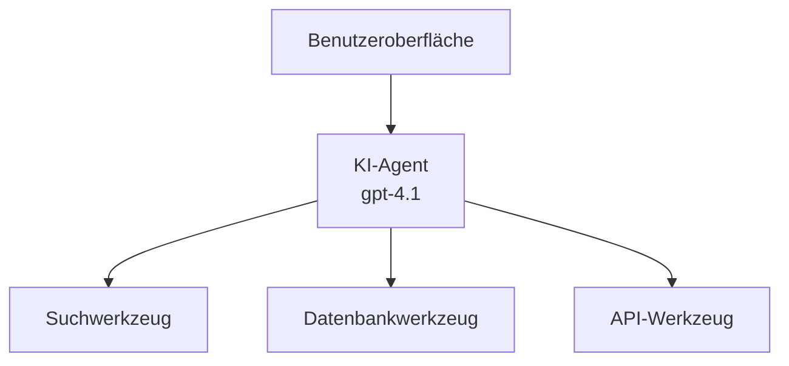
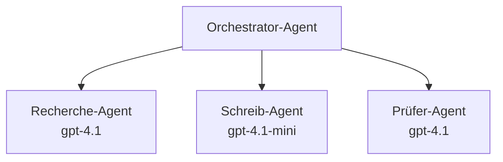

# KI-Agenten mit Azure Developer CLI

**Kapitel-Navigation:**
- **📚 Kursstartseite**: [AZD für Einsteiger](../../README.md)
- **📖 Aktuelles Kapitel**: Kapitel 2 - KI-First Entwicklung
- **⬅️ Vorheriges**: [Microsoft Foundry Integration](microsoft-foundry-integration.md)
- **➡️ Nächstes**: [KI-Modellbereitstellung](ai-model-deployment.md)
- **🚀 Fortgeschritten**: [Multi-Agenten-Lösungen](../../examples/retail-scenario.md)

---

## Einführung

KI-Agenten sind autonome Programme, die ihre Umgebung wahrnehmen, Entscheidungen treffen und Handlungen ausführen, um bestimmte Ziele zu erreichen. Im Gegensatz zu einfachen Chatbots, die auf Eingaben reagieren, können Agenten:

- **Werkzeuge nutzen** - APIs aufrufen, Datenbanken durchsuchen, Code ausführen
- **Planen und schlussfolgern** - Komplexe Aufgaben in Schritte aufteilen
- **Aus Kontext lernen** - Erinnerungen behalten und Verhalten anpassen
- **Zusammenarbeiten** - Mit anderen Agenten zusammenarbeiten (Multi-Agenten-Systeme)

Dieser Leitfaden zeigt Ihnen, wie Sie KI-Agenten mit Azure Developer CLI (azd) in Azure bereitstellen.

> **Validierungshinweis (2026-07-13):** Dieser Leitfaden wurde mit `azd` `1.27.1` und `azure.ai.agents` `1.0.0-beta.5` überprüft. Die `azd ai`-Erfahrung befindet sich noch in der Vorschau, überprüfen Sie die Erweiterungshilfe, falls Ihre installierten Flags abweichen.

## Lernziele

Nach Abschluss dieses Leitfadens werden Sie:
- Verstehen, was KI-Agenten sind und wie sie sich von Chatbots unterscheiden
- Vorgefertigte KI-Agentenvorlagen mit AZD bereitstellen können
- Foundry Agenten für benutzerdefinierte Agenten konfigurieren können
- Grundlegende Agentenmuster (Werkzeugnutzung, RAG, Multi-Agent) umsetzen können
- Bereitgestellte Agenten überwachen und debuggen können

## Lernresultate

Nach Abschluss sind Sie in der Lage:
- KI-Agenten-Anwendungen mit einem einzigen Befehl in Azure bereitzustellen
- Agenten-Werkzeuge und -Fähigkeiten zu konfigurieren
- Retrieval-Augmented Generation (RAG) mit Agenten umzusetzen
- Multi-Agenten-Architekturen für komplexe Workflows zu entwerfen
- Häufige Probleme bei der Agentenbereitstellung zu beheben

---

## 🤖 Was macht einen Agenten anders als einen Chatbot?

| Merkmal | Chatbot | KI-Agent |
|---------|---------|----------|
| **Verhalten** | Reagiert auf Eingaben | Führt autonome Aktionen aus |
| **Werkzeuge** | Keine | Kann APIs aufrufen, suchen, Code ausführen |
| **Speicher** | Nur sitzungsbasiert | Persistenter Speicher über Sitzungen hinweg |
| **Planung** | Einfache Antwort | Mehrstufiges Denken |
| **Zusammenarbeit** | Einzelnes Wesen | Kann mit anderen Agenten zusammenarbeiten |

### Einfache Analogie

- **Chatbot** = Eine hilfsbereite Person, die an einem Informationsschalter Fragen beantwortet
- **KI-Agent** = Ein persönlicher Assistent, der Anrufe tätigen, Termine buchen und Aufgaben für Sie erledigen kann

---

## 🚀 Schnellstart: Stellen Sie Ihren ersten Agenten bereit

### Option 1: Foundry Agents Vorlage (empfohlen)

```bash
# Initialisiere die Vorlage für KI-Agenten
azd init --template get-started-with-ai-agents

# Auf Azure bereitstellen
azd up
```

**Was bereitgestellt wird:**
- ✅ Foundry Agents
- ✅ Microsoft Foundry Modelle (gpt-4.1)
- ✅ Azure AI Search (für RAG)
- ✅ Azure Container Apps (Weboberfläche)
- ✅ Application Insights (Überwachung)

**Zeit:** ~15-20 Minuten
**Kosten:** ~100-150 $/Monat (Entwicklung)

### Option 2: OpenAI Agent mit Prompty

```bash
# Initialisiere die auf Prompty basierende Agentenvorlage
azd init --template agent-openai-python-prompty

# In Azure bereitstellen
azd up
```

**Was bereitgestellt wird:**
- ✅ Azure Functions (serverlose Agentenausführung)
- ✅ Microsoft Foundry Modelle
- ✅ Prompty-Konfigurationsdateien
- ✅ Beispielhafte Agentenimplementierung

**Zeit:** ~10-15 Minuten
**Kosten:** ~50-100 $/Monat (Entwicklung)

### Option 3: RAG Chat Agent

```bash
# RAG-Chat-Vorlage initialisieren
azd init --template azure-search-openai-demo

# Auf Azure bereitstellen
azd up
```

**Was bereitgestellt wird:**
- ✅ Microsoft Foundry Modelle
- ✅ Azure AI Search mit Beispiel-Daten
- ✅ Pipeline zur Dokumentenverarbeitung
- ✅ Chat-Oberfläche mit Quellenangaben

**Zeit:** ~15-25 Minuten
**Kosten:** ~80-150 $/Monat (Entwicklung)

### Option 4: AZD AI Agent Init (Manifest- oder Vorlagen-basierte Vorschau)

Wenn Sie eine Agent-Manifestdatei haben, können Sie mit dem Befehl `azd ai` direkt ein Foundry Agent Service-Projekt scaffolden. Kürzlich hinzugefügte Vorschau-Versionen unterstützen auch vorlagenbasierte Initialisierung, daher kann der genaue Ablauf je nach installierter Erweiterungsversion leicht variieren.

```bash
# Installieren Sie die AI-Agenten-Erweiterung
azd extension install azure.ai.agents

# Optional: Überprüfen Sie die installierte Vorschauversion
azd extension show azure.ai.agents

# Initialisieren Sie aus einem Agentenmanifest
azd ai agent init -m agent-manifest.yaml

# Bereitstellen in Azure
azd up

# Testen Sie den bereitgestellten Agenten (zeigt Latenz + Time-to-First-Byte)
azd ai agent invoke
```

**Wann `azd ai agent init` vs. `azd init --template` nutzen:**

| Vorgehen | Am besten für | Funktionsweise |
|----------|--------------|--------------|
| `azd init --template` | Start mit einer funktionierenden Beispiel-App | Klont ein vollständiges Vorlagen-Repo mit Code + Infrastruktur |
| `azd ai agent init -m` | Aufbau mit eigenem Agent-Manifest | Erstellt die Projektstruktur basierend auf Ihrer Agentendefinition |

> **Tipp:** Nutzen Sie `azd init --template` beim Lernen (Optionen 1-3 oben). Verwenden Sie `azd ai agent init`, wenn Sie Produktionsagenten mit eigenen Manifests erstellen.

Nach `azd up` begleitet Sie dieselbe Erweiterung durch den restlichen Agentenlebenszyklus: `azd ai agent invoke` zum Testen, `azd ai agent eval generate` und `azd ai agent optimize` zur Messung und Verbesserung der Qualität und `azd ai agent delete` zum Aufräumen. Siehe [AZD AI CLI Befehle](../chapter-08-production/production-ai-practices.md#azd-ai-cli-commands-and-extensions) für die vollständige Referenz.

---

## 🏗️ Agenten-Architekturmuster

### Muster 1: Einzelner Agent mit Werkzeugen

Das einfachste Agentenmuster – ein Agent, der mehrere Werkzeuge nutzen kann.



**Am besten geeignet für:**
- Kunden-Support-Bots
- Rechercheassistenten
- Datenanalysen-Agenten

**AZD Vorlage:** `azure-search-openai-demo`

### Muster 2: RAG Agent (Retrieval-Augmented Generation)

Ein Agent, der relevante Dokumente abruft, bevor er Antworten generiert.


**Am besten geeignet für:**
- Unternehmens-Wissensdatenbanken
- Dokumenten-Q&A-Systeme
- Compliance- und Rechtsrecherchen

**AZD Vorlage:** `azure-search-openai-demo`

### Muster 3: Multi-Agenten-System

Mehrere spezialisierte Agenten, die bei komplexen Aufgaben zusammenarbeiten.



**Am besten geeignet für:**
- Komplexe Inhaltserstellung
- Mehrstufige Arbeitsabläufe
- Aufgaben, die unterschiedliche Fachkenntnisse erfordern

**Mehr erfahren:** [Multi-Agenten-Koordinationsmuster](../chapter-06-pre-deployment/coordination-patterns.md)

---

## ⚙️ Agenten-Werkzeuge konfigurieren

Agenten werden mächtig, wenn sie Werkzeuge nutzen können. So konfigurieren Sie gängige Werkzeuge:

### Werkzeug-Konfiguration in Foundry Agents

```python
# agent_config.py
from azure.ai.projects import AIProjectClient
from azure.ai.projects.models import FunctionTool, CodeInterpreterTool

# Benutzerdefinierte Werkzeuge definieren
search_tool = FunctionTool(
    name="search_knowledge_base",
    description="Search the company knowledge base for relevant documents",
    parameters={
        "type": "object",
        "properties": {
            "query": {
                "type": "string",
                "description": "The search query"
            }
        },
        "required": ["query"]
    }
)

# Agent mit Werkzeugen erstellen
agent = project_client.agents.create_agent(
    model="gpt-4.1",
    name="Support Agent",
    instructions="You are a helpful support agent. Use the search tool to find relevant information.",
    tools=[search_tool, CodeInterpreterTool()]
)
```

### Umgebungs-Konfiguration

```bash
# Agentenspezifische Umgebungsvariablen einrichten
azd env set AZURE_OPENAI_MODEL "gpt-4.1"
azd env set AGENT_INSTRUCTIONS "You are a helpful assistant..."
azd env set ENABLE_CODE_INTERPRETER "true"
azd env set ENABLE_FILE_SEARCH "true"

# Mit aktualisierter Konfiguration bereitstellen
azd deploy
```

---

## 📊 Agenten überwachen

### Application Insights Integration

Alle AZD-Agentenvorlagen beinhalten Application Insights zur Überwachung:

```bash
# Überwachungs-Dashboard öffnen
azd monitor --overview

# Live-Logs anzeigen
azd monitor --logs

# Live-Metriken anzeigen
azd monitor --live
```

### Wichtige Metriken zur Überwachung

| Metrik | Beschreibung | Ziel |
|--------|--------------|------|
| Antwortlatenz | Zeit zur Antwortgenerierung | < 5 Sekunden |
| Tokenverbrauch | Tokens pro Anfrage | Zur Kostenüberwachung |
| Erfolgsrate von Werkzeugaufrufen | % erfolgreicher Werkzeugs-Ausführungen | > 95 % |
| Fehlerquote | Fehlgeschlagene Agentenanfragen | < 1 % |
| Benutzerzufriedenheit | Feedbackwert | > 4.0/5.0 |

### Benutzerdefinierte Protokollierung für Agenten

```python
import os
from azure.monitor.opentelemetry import configure_azure_monitor
from opentelemetry import trace

# Azure Monitor mit OpenTelemetry konfigurieren
configure_azure_monitor(
    connection_string=os.environ["APPLICATIONINSIGHTS_CONNECTION_STRING"]
)

tracer = trace.get_tracer(__name__)

def log_agent_interaction(user_query, agent_response, tools_used, latency_ms):
    with tracer.start_as_current_span("agent_interaction") as span:
        span.set_attributes({
            "user_query": user_query,
            "response_length": len(agent_response),
            "tools_used": tools_used,
            "latency_ms": latency_ms
        })
```

> **Hinweis:** Installieren Sie die erforderlichen Pakete: `pip install azure-monitor-opentelemetry opentelemetry`

---

## 💰 Kostenüberlegungen

### Geschätzte monatliche Kosten nach Muster

| Muster | Entwicklungsumgebung | Produktion |
|---------|---------------------|------------|
| Einzelner Agent | 50-100 $ | 200-500 $ |
| RAG Agent | 80-150 $ | 300-800 $ |
| Multi-Agent (2-3 Agenten) | 150-300 $ | 500-1.500 $ |
| Enterprise Multi-Agent | 300-500 $ | 1.500-5.000+ $ |

### Tipps zur Kostenoptimierung

1. **Nutzen Sie gpt-4.1-mini für einfache Aufgaben**
   ```bash
   azd env set AZURE_OPENAI_MODEL "gpt-4.1-mini"
   ```

2. **Implementieren Sie Caching für wiederholte Anfragen**
   ```python
   from functools import lru_cache
   
   @lru_cache(maxsize=1000)
   def get_cached_response(query_hash):
       return agent.run(query_hash)
   ```

3. **Setzen Sie Token-Limits pro Ausführung**
   ```python
   # Legen Sie max_completion_tokens fest, wenn der Agent ausgeführt wird, nicht während der Erstellung
   run = project_client.agents.create_run(
       thread_id=thread.id,
       agent_id=agent.id,
       max_completion_tokens=1000  # Begrenzen Sie die Antwortlänge
   )
   ```

4. **Skalieren Sie auf Null, wenn nicht verwendet**
   ```bash
   # Container-Apps skalieren automatisch auf null
   azd env set MIN_REPLICAS "0"
   ```

---

## 🔧 Fehlerbehebung bei Agenten

### Häufige Probleme und Lösungen

<details>
<summary><strong>❌ Agent reagiert nicht auf Werkzeug-Aufrufe</strong></summary>

```bash
# Überprüfen, ob Tools richtig registriert sind
azd show

# OpenAI-Bereitstellung überprüfen
az cognitiveservices account deployment list \
  --name $AZURE_OPENAI_NAME \
  --resource-group $RG_NAME

# Agentenprotokolle überprüfen
azd monitor --logs
```

**Häufige Ursachen:**
- Unstimmigkeiten in der Funktionssignatur des Werkzeugs
- Fehlende erforderliche Berechtigungen
- API-Endpunkt nicht erreichbar
</details>

<details>
<summary><strong>❌ Hohe Latenz bei Agentenantworten</strong></summary>

```bash
# Überprüfen Sie Application Insights auf Engpässe
azd monitor --live

# Ziehen Sie die Verwendung eines schnelleren Modells in Betracht
azd env set AZURE_OPENAI_MODEL "gpt-4.1-mini"
azd deploy
```

**Optimierungstipps:**
- Nutzen Sie Streaming-Antworten
- Implementieren Sie Antwort-Caching
- Reduzieren Sie die Größe des Kontextfensters
</details>

<details>
<summary><strong>❌ Agent liefert falsche oder halluzinierte Informationen zurück</strong></summary>

```python
# Mit besseren Systemanweisungen verbessern
instructions = """
You are a helpful assistant. IMPORTANT:
- Only answer based on provided context
- If you don't know, say "I don't know"
- Always cite your sources
- Never make up information
"""

# Abruf für Fundamentierung hinzufügen
agent = project_client.agents.create_agent(
    model="gpt-4.1",
    instructions=instructions,
    tools=[FileSearchTool()]  # Antworten in Dokumenten verankern
)
```
</details>

<details>
<summary><strong>❌ Token-Limit überschritten Fehler</strong></summary>

```python
# Implementierung der Verwaltung des Kontextfensters
def truncate_context(messages, max_tokens=8000, model="gpt-4.1"):
    """Keep only recent messages within token limit."""
    import tiktoken
    encoding = tiktoken.encoding_for_model(model)
    total_tokens = 0
    truncated = []
    
    for msg in reversed(messages):
        msg_tokens = len(encoding.encode(msg.content))
        if total_tokens + msg_tokens > max_tokens:
            break
        truncated.insert(0, msg)
        total_tokens += msg_tokens
    
    return truncated
```
</details>

---

## 🎓 Praktische Übungen

### Übung 1: Grundlegenden Agent bereitstellen (20 Minuten)

**Ziel:** Ihren ersten KI-Agenten mit AZD bereitstellen

```bash
# Schritt 1: Vorlage initialisieren
azd init --template get-started-with-ai-agents

# Schritt 2: Bei Azure anmelden
azd auth login
# Wenn Sie über Mandanten hinweg arbeiten, fügen Sie --tenant-id <tenant-id> hinzu

# Schritt 3: Bereitstellen
azd up

# Schritt 4: Agent testen
# Erwartete Ausgabe nach der Bereitstellung:
#   Bereitstellung abgeschlossen!
#   Endpunkt: https://<app-name>.<region>.azurecontainerapps.io
# Öffnen Sie die in der Ausgabe angezeigte URL und versuchen Sie, eine Frage zu stellen

# Schritt 5: Überwachung anzeigen
azd monitor --overview

# Schritt 6: Bereinigung
azd down --force --purge
```

**Erfolgskriterien:**
- [ ] Agent beantwortet Fragen
- [ ] Zugriff auf das Überwachungs-Dashboard via `azd monitor`
- [ ] Ressourcen erfolgreich bereinigt

### Übung 2: Ein benutzerdefiniertes Werkzeug hinzufügen (30 Minuten)

**Ziel:** Einen Agenten mit einem benutzerdefinierten Werkzeug erweitern

1. Stellen Sie die Agentenvorlage bereit:
   ```bash
   azd init --template get-started-with-ai-agents
   azd up
   ```
2. Erstellen Sie eine neue Werkzeugfunktion im Agenten-Code:
   ```python
   def get_weather(location: str) -> str:
       """Get current weather for a location."""
       # API-Aufruf zum Wetterdienst
       return f"Weather in {location}: Sunny, 72°F"
   ```
3. Registrieren Sie das Werkzeug beim Agenten:
   ```python
   from azure.ai.projects.models import FunctionTool

   weather_tool = FunctionTool(
       name="get_weather",
       description="Get current weather for a location",
       parameters={
           "type": "object",
           "properties": {
               "location": {"type": "string", "description": "City name"}
           },
           "required": ["location"]
       }
   )

   agent = project_client.agents.create_agent(
       model="gpt-4.1",
       name="Weather Agent",
       tools=[weather_tool]
   )
   ```
4. Erneut bereitstellen und testen:
   ```bash
   azd deploy
   # Fragen: "Wie ist das Wetter in Seattle?"
   # Erwartet: Agent ruft get_weather("Seattle") auf und gibt Wetterinformationen zurück
   ```

**Erfolgskriterien:**
- [ ] Agent erkennt wetterbezogene Anfragen
- [ ] Werkzeug wird korrekt aufgerufen
- [ ] Antwort enthält Wetterinformationen

### Übung 3: Einen RAG Agent erstellen (45 Minuten)

**Ziel:** Erstellen Sie einen Agenten, der Fragen aus Ihren Dokumenten beantwortet

```bash
# Schritt 1: RAG-Vorlage bereitstellen
azd init --template azure-search-openai-demo
azd up

# Schritt 2: Laden Sie Ihre Dokumente hoch
# Legen Sie PDF-/TXT-Dateien im Verzeichnis data/ ab und führen Sie dann aus:
python scripts/prepdocs.py

# Schritt 3: Testen Sie mit domänenspezifischen Fragen
# Öffnen Sie die URL der Webanwendung aus der azd up-Ausgabe
# Stellen Sie Fragen zu Ihren hochgeladenen Dokumenten
# Antworten sollten Zitierverweise wie [doc.pdf] enthalten
```

**Erfolgskriterien:**
- [ ] Agent antwortet aus hochgeladenen Dokumenten
- [ ] Antworten enthalten Quellenangaben
- [ ] Keine Halluzinationen bei nicht abgedeckten Fragen

---

## 📚 Nächste Schritte

Jetzt, da Sie KI-Agenten verstehen, erkunden Sie diese fortgeschrittenen Themen:

| Thema | Beschreibung | Link |
|-------|-------------|------|
| **Multi-Agenten-Systeme** | Systeme mit mehreren kooperierenden Agenten bauen | [Retail Multi-Agent Beispiel](../../examples/retail-scenario.md) |
| **Koordinationsmuster** | Orchestrierungs- und Kommunikationsmuster lernen | [Koordinationsmuster](../chapter-06-pre-deployment/coordination-patterns.md) |
| **Produktionsbereitstellung** | Produktionsreife Agentenbereitstellung | [Produktion KI-Praktiken](../chapter-08-production/production-ai-practices.md) |
| **Agentenbewertung** | Agentenleistung testen und bewerten | [KI-Fehlerbehebung](../chapter-07-troubleshooting/ai-troubleshooting.md) |
| **KI-Workshop-Labor** | Praxis: Machen Sie Ihre KI-Lösung azd-bereit | [KI-Workshop-Labor](ai-workshop-lab.md) |

---

## 📖 Zusätzliche Ressourcen

### Offizielle Dokumentation
- [Microsoft Foundry Agent Service](https://learn.microsoft.com/azure/ai-services/agents/)
- [Microsoft Foundry Agent Service Schnellstart](https://learn.microsoft.com/azure/ai-services/agents/quickstart)
- [Semantic Kernel Agent Framework](https://learn.microsoft.com/semantic-kernel/)

### AZD-Vorlagen für Agenten
- [Anfangen mit KI-Agenten](https://github.com/Azure-Samples/get-started-with-ai-agents)
- [Agent OpenAI Python Prompty](https://github.com/Azure-Samples/agent-openai-python-prompty)
- [Azure Search OpenAI Demo](https://github.com/Azure-Samples/azure-search-openai-demo)

### Community-Ressourcen
- [Awesome AZD - Agentenvorlagen](https://azure.github.io/awesome-azd/?tags=ai-agents)
- [Azure AI Discord](https://discord.gg/microsoft-azure)
- [Microsoft Foundry Discord](https://discord.gg/nTYy5BXMWG)

### Agent Skills für Ihren Editor
- [**Microsoft Azure Agent Skills**](https://skills.sh/microsoft/github-copilot-for-azure) - Installieren Sie wiederverwendbare KI-Agentenfähigkeiten für Azure-Entwicklung in GitHub Copilot, Cursor oder jedem unterstützten Agenten. Beinhaltet Fähigkeiten für [Azure AI](https://skills.sh/microsoft/github-copilot-for-azure/azure-ai), [Microsoft Foundry](https://skills.sh/microsoft/github-copilot-for-azure/microsoft-foundry), [Bereitstellung](https://skills.sh/microsoft/github-copilot-for-azure/azure-deploy) und [Diagnostik](https://skills.sh/microsoft/github-copilot-for-azure/azure-diagnostics):
  ```bash
  npx skills add microsoft/github-copilot-for-azure
  ```

---

**Navigation**
- **Vorherige Lektion**: [Microsoft Foundry Integration](microsoft-foundry-integration.md)
- **Nächste Lektion**: [KI-Modellbereitstellung](ai-model-deployment.md)

---

<!-- CO-OP TRANSLATOR DISCLAIMER START -->
**Haftungsausschluss**:
Dieses Dokument wurde mit dem KI-Übersetzungsdienst [Co-op Translator](https://github.com/Azure/co-op-translator) übersetzt. Obwohl wir uns um Genauigkeit bemühen, beachten Sie bitte, dass automatisierte Übersetzungen Fehler oder Ungenauigkeiten enthalten können. Das Originaldokument in seiner Ursprungssprache gilt als maßgebliche Quelle. Bei kritischen Informationen wird eine professionelle menschliche Übersetzung empfohlen. Wir übernehmen keine Haftung für Missverständnisse oder Fehlinterpretationen, die aus der Verwendung dieser Übersetzung entstehen.
<!-- CO-OP TRANSLATOR DISCLAIMER END -->