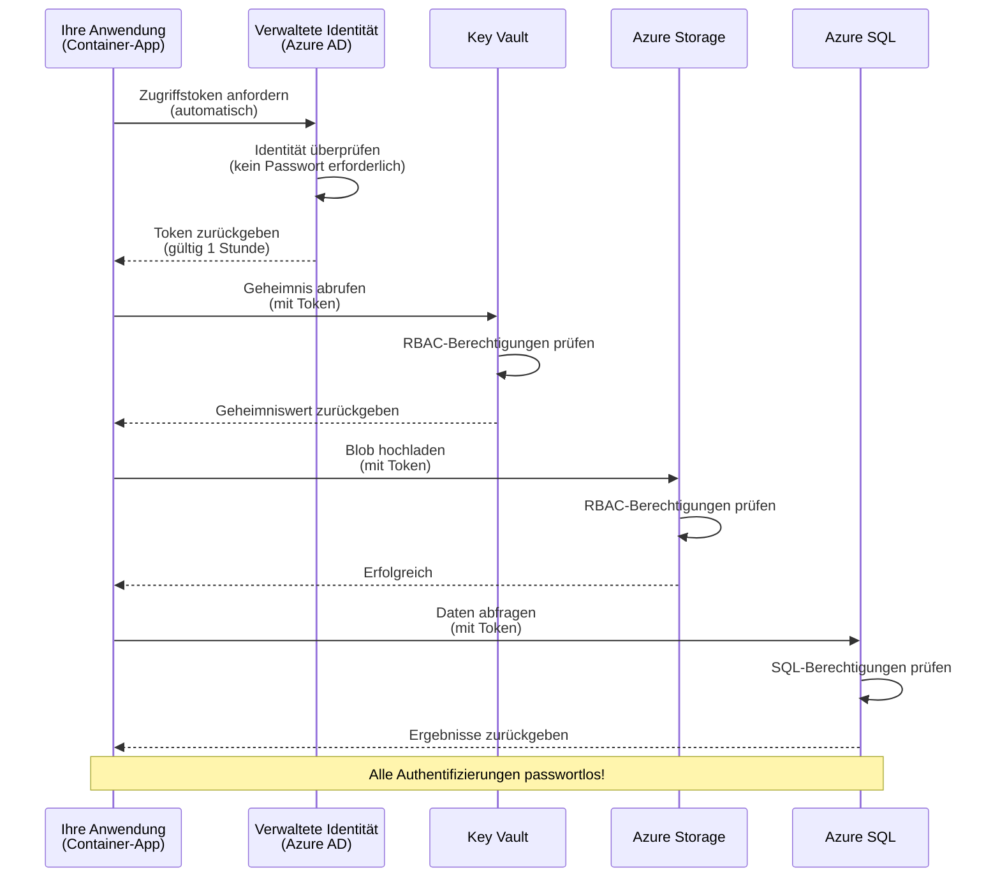
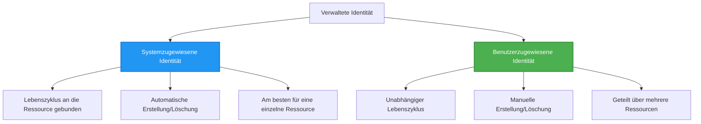

# Authentifizierungsmuster und Managed Identity

⏱️ **Geschätzte Zeit**: 45-60 Minuten | 💰 **Kosten**: Kostenlos (keine zusätzlichen Gebühren) | ⭐ **Komplexität**: Mittel

**📚 Lernpfad:**
- ← Vorherige: [Configuration Management](configuration.md) - Verwaltung von Umgebungsvariablen und Geheimnissen
- 🎯 **Sie sind hier**: Authentifizierung & Sicherheit (Managed Identity, Key Vault, sichere Muster)
- → Nächste: [First Project](first-project.md) - Erstellen Sie Ihre erste AZD-Anwendung
- 🏠 [Course Home](../../README.md)

---

## Was Sie lernen werden

Durch Abschließen dieser Lektion werden Sie:
- Azure-Authentifizierungsmuster verstehen (Keys, Connection Strings, Managed Identity)
- **Managed Identity** für passwortlose Authentifizierung implementieren
- Geheimnisse mit **Azure Key Vault** sichern
- **Role-based Access Control (RBAC)** für AZD-Bereitstellungen konfigurieren
- Sicherheits-Best-Practices in Container Apps und Azure-Diensten anwenden
- Von schlüsselbasierter zu identitätsbasierter Authentifizierung migrieren

## Warum Managed Identity wichtig ist

### Das Problem: Traditionelle Authentifizierung

**Vor Managed Identity:**
```javascript
// ❌ SICHERHEITSRISIKO: Hartkodierte Geheimnisse im Code
const connectionString = "Server=mydb.database.windows.net;User=admin;Password=P@ssw0rd123";
const storageKey = "xK7mN9pQ2wR5tY8uI0oP3aS6dF1gH4jK...";
const cosmosKey = "C2x7B9n4M1p8Q5w3E6r0T2y5U8i1O4p7...";
```

**Probleme:**
- 🔴 **Offengelegte Geheimnisse** im Code, in Konfigurationsdateien, in Umgebungsvariablen
- 🔴 **Rotation von Anmeldeinformationen** erfordert Codeänderungen und erneute Bereitstellung
- 🔴 **Audit-Albträume** – wer hat was wann zugegriffen?
- 🔴 **Verstreuung** – Geheimnisse über mehrere Systeme verteilt
- 🔴 **Compliance-Risiken** – besteht Sicherheitsprüfungen nicht

### Die Lösung: Managed Identity

**Nach Managed Identity:**
```javascript
// ✅ SICHER: Keine Geheimnisse im Code
const credential = new DefaultAzureCredential();
const client = new BlobServiceClient(
  "https://mystorageaccount.blob.core.windows.net",
  credential  // Azure übernimmt die Authentifizierung automatisch
);
```

**Vorteile:**
- ✅ **Keine Geheimnisse** im Code oder in der Konfiguration
- ✅ **Automatische Rotation** – Azure übernimmt das
- ✅ **Vollständige Audit-Nachverfolgung** in Azure AD-Protokollen
- ✅ **Zentrale Sicherheit** – Verwaltung im Azure-Portal
- ✅ **Compliance-fähig** – erfüllt Sicherheitsstandards

**Analogie**: Traditionelle Authentifizierung ist wie das Mitführen mehrerer physischer Schlüssel für verschiedene Türen. Managed Identity ist wie ein Sicherheitsausweis, der automatisch Zugriff basierend auf Ihrer Identität gewährt – keine Schlüssel, die verloren gehen, kopiert oder rotiert werden müssen.

---

## Architekturübersicht

### Authentifizierungsablauf mit Managed Identity


### Typen von Managed Identities


| Merkmal | Systemzugewiesen | Benutzerzugewiesen |
|---------|----------------|---------------|
| **Lebenszyklus** | An die Ressource gebunden | Unabhängig |
| **Erstellung** | Automatisch mit der Ressource | Manuelle Erstellung |
| **Löschung** | Wird mit der Ressource gelöscht | Bleibt nach Löschung der Ressource bestehen |
| **Freigabe** | Nur eine Ressource | Mehrere Ressourcen |
| **Anwendungsfall** | Einfache Szenarien | Komplexe Multi-Ressourcen-Szenarien |
| **AZD-Standard** | ✅ Empfohlen | Optional |

---

## Voraussetzungen

### Erforderliche Werkzeuge

Sie sollten diese bereits aus vorherigen Lektionen installiert haben:

```bash
# Azure Developer CLI überprüfen
azd version
# ✅ Erwartet: azd Version 1.0.0 oder höher

# Azure CLI überprüfen
az --version
# ✅ Erwartet: azure-cli 2.50.0 oder höher
```

### Azure-Anforderungen

- Aktives Azure-Abonnement
- Berechtigungen für:
  - Managed Identities erstellen
  - RBAC-Rollen zuweisen
  - Key Vault-Ressourcen erstellen
  - Container Apps bereitstellen

### Voraussetzungen an Kenntnisse

Sie sollten abgeschlossen haben:
- [Installation Guide](installation.md) - AZD-Einrichtung
- [AZD Basics](azd-basics.md) - Kernkonzepte
- [Configuration Management](configuration.md) - Umgebungsvariablen

---

## Lektion 1: Authentifizierungsmuster verstehen

### Muster 1: Connection Strings (Legacy - vermeiden)

**Wie es funktioniert:**
```bash
# Verbindungszeichenfolge enthält Anmeldedaten
STORAGE_CONNECTION_STRING="DefaultEndpointsProtocol=https;AccountName=myaccount;AccountKey=xK7mN9pQ2wR5..."
COSMOS_CONNECTION_STRING="AccountEndpoint=https://myaccount.documents.azure.com:443/;AccountKey=C2x7..."
SQL_CONNECTION_STRING="Server=myserver.database.windows.net;User=admin;Password=P@ssw0rd..."
```

**Probleme:**
- ❌ Geheimnisse sichtbar in Umgebungsvariablen
- ❌ In Bereitstellungssystemen protokolliert
- ❌ Schwer zu rotieren
- ❌ Kein Audit-Trail für Zugriffe

**Wann verwenden:** Nur für lokale Entwicklung, niemals in Produktionsumgebungen.

---

### Muster 2: Key Vault-Verweise (Besser)

**Wie es funktioniert:**
```bicep
// Store secret in Key Vault
resource keyVault 'Microsoft.KeyVault/vaults@2023-02-01' = {
  name: 'mykv'
  properties: {
    enableRbacAuthorization: true
  }
}

// Reference in Container App
env: [
  {
    name: 'STORAGE_KEY'
    secretRef: 'storage-key'  // References Key Vault
  }
]
```

**Vorteile:**
- ✅ Geheimnisse sicher im Key Vault gespeichert
- ✅ Zentrale Geheimnisverwaltung
- ✅ Rotation ohne Codeänderungen

**Einschränkungen:**
- ⚠️ Es werden weiterhin Keys/Passwörter verwendet
- ⚠️ Zugriff auf Key Vault muss verwaltet werden

**Wann verwenden:** Übergangsschritt von Connection Strings zu Managed Identity.

---

### Muster 3: Managed Identity (Beste Praxis)

**Wie es funktioniert:**
```bicep
// Enable managed identity
resource containerApp 'Microsoft.App/containerApps@2023-05-01' = {
  name: 'myapp'
  identity: {
    type: 'SystemAssigned'  // Automatically creates identity
  }
}

// Grant permissions
resource roleAssignment 'Microsoft.Authorization/roleAssignments@2022-04-01' = {
  scope: storageAccount
  properties: {
    roleDefinitionId: storageBlobDataContributorRole
    principalId: containerApp.identity.principalId
  }
}
```

**Anwendungscode:**
```javascript
// Keine Geheimnisse erforderlich!
const { DefaultAzureCredential } = require('@azure/identity');
const { BlobServiceClient } = require('@azure/storage-blob');

const credential = new DefaultAzureCredential();
const blobServiceClient = new BlobServiceClient(
  'https://mystorageaccount.blob.core.windows.net',
  credential
);
```

**Vorteile:**
- ✅ Keine Geheimnisse im Code/Konfiguration
- ✅ Automatische Rotation der Anmeldeinformationen
- ✅ Vollständiger Audit-Trail
- ✅ RBAC-basierte Berechtigungen
- ✅ Compliance-fähig

**Wann verwenden:** Immer, für Produktionsanwendungen.

---

## Lektion 2: Implementierung der Managed Identity mit AZD

### Schritt-für-Schritt-Implementierung

Lassen Sie uns eine sichere Container App erstellen, die Managed Identity verwendet, um auf Azure Storage und Key Vault zuzugreifen.

### Projektstruktur

```
secure-app/
├── azure.yaml                 # AZD configuration
├── infra/
│   ├── main.bicep            # Main infrastructure
│   ├── core/
│   │   ├── identity.bicep    # Managed identity setup
│   │   ├── keyvault.bicep    # Key Vault configuration
│   │   └── storage.bicep     # Storage with RBAC
│   └── app/
│       └── container-app.bicep
└── src/
    ├── app.js                # Application code
    ├── package.json
    └── Dockerfile
```

### 1. AZD konfigurieren (azure.yaml)

```yaml
name: secure-app
metadata:
  template: secure-app@1.0.0

services:
  api:
    project: ./src
    language: js
    host: containerapp

# Enable managed identity (AZD handles this automatically)
```

### 2. Infrastruktur: Managed Identity aktivieren

**Datei: `infra/main.bicep`**

```bicep
targetScope = 'subscription'

param environmentName string
param location string = 'eastus'

var tags = { 'azd-env-name': environmentName }

// Resource group
resource rg 'Microsoft.Resources/resourceGroups@2021-04-01' = {
  name: 'rg-${environmentName}'
  location: location
  tags: tags
}

// Storage Account
module storage './core/storage.bicep' = {
  name: 'storage'
  scope: rg
  params: {
    name: 'st${uniqueString(rg.id)}'
    location: location
    tags: tags
  }
}

// Key Vault
module keyVault './core/keyvault.bicep' = {
  name: 'keyvault'
  scope: rg
  params: {
    name: 'kv-${uniqueString(rg.id)}'
    location: location
    tags: tags
  }
}

// Container App with Managed Identity
module containerApp './app/container-app.bicep' = {
  name: 'container-app'
  scope: rg
  params: {
    name: 'ca-${environmentName}'
    location: location
    tags: tags
    storageAccountName: storage.outputs.name
    keyVaultName: keyVault.outputs.name
  }
}

// Grant Container App access to Storage
module storageRoleAssignment './core/role-assignment.bicep' = {
  name: 'storage-role'
  scope: rg
  params: {
    principalId: containerApp.outputs.identityPrincipalId
    roleDefinitionId: 'ba92f5b4-2d11-453d-a403-e96b0029c9fe'  // Storage Blob Data Contributor
    targetResourceId: storage.outputs.id
  }
}

// Grant Container App access to Key Vault
module kvRoleAssignment './core/role-assignment.bicep' = {
  name: 'kv-role'
  scope: rg
  params: {
    principalId: containerApp.outputs.identityPrincipalId
    roleDefinitionId: '4633458b-17de-408a-b874-0445c86b69e6'  // Key Vault Secrets User
    targetResourceId: keyVault.outputs.id
  }
}

// Outputs
output AZURE_STORAGE_ACCOUNT_NAME string = storage.outputs.name
output AZURE_KEY_VAULT_NAME string = keyVault.outputs.name
output APP_URL string = containerApp.outputs.url
```

### 3. Container App mit systemzugewiesener Identität

**Datei: `infra/app/container-app.bicep`**

```bicep
param name string
param location string
param tags object = {}
param storageAccountName string
param keyVaultName string

resource containerApp 'Microsoft.App/containerApps@2023-05-01' = {
  name: name
  location: location
  tags: tags
  identity: {
    type: 'SystemAssigned'  // 🔑 Enable managed identity
  }
  properties: {
    configuration: {
      ingress: {
        external: true
        targetPort: 3000
      }
    }
    template: {
      containers: [
        {
          name: 'api'
          image: 'myregistry.azurecr.io/api:latest'
          resources: {
            cpu: json('0.5')
            memory: '1Gi'
          }
          env: [
            {
              name: 'AZURE_STORAGE_ACCOUNT_NAME'
              value: storageAccountName
            }
            {
              name: 'AZURE_KEY_VAULT_NAME'
              value: keyVaultName
            }
            // 🔑 No secrets - managed identity handles authentication!
          ]
        }
      ]
    }
  }
}

// Output the identity for RBAC assignments
output identityPrincipalId string = containerApp.identity.principalId
output id string = containerApp.id
output url string = 'https://${containerApp.properties.configuration.ingress.fqdn}'
```

### 4. RBAC-Rollen-Zuordnungsmodul

**Datei: `infra/core/role-assignment.bicep`**

```bicep
param principalId string
param roleDefinitionId string  // Azure built-in role ID
param targetResourceId string

resource roleAssignment 'Microsoft.Authorization/roleAssignments@2022-04-01' = {
  name: guid(principalId, roleDefinitionId, targetResourceId)
  scope: resourceId('Microsoft.Resources/resourceGroups', resourceGroup().name)
  properties: {
    roleDefinitionId: subscriptionResourceId('Microsoft.Authorization/roleDefinitions', roleDefinitionId)
    principalId: principalId
    principalType: 'ServicePrincipal'
  }
}

output id string = roleAssignment.id
```

### 5. Anwendungscode mit Managed Identity

**Datei: `src/app.js`**

```javascript
const express = require('express');
const { DefaultAzureCredential } = require('@azure/identity');
const { BlobServiceClient } = require('@azure/storage-blob');
const { SecretClient } = require('@azure/keyvault-secrets');

const app = express();
const PORT = process.env.PORT || 3000;

// 🔑 Anmeldeinformationen initialisieren (funktioniert automatisch mit verwalteter Identität)
const credential = new DefaultAzureCredential();

// Azure Storage einrichten
const storageAccountName = process.env.AZURE_STORAGE_ACCOUNT_NAME;
const blobServiceClient = new BlobServiceClient(
  `https://${storageAccountName}.blob.core.windows.net`,
  credential  // Keine Schlüssel erforderlich!
);

// Key Vault einrichten
const keyVaultName = process.env.AZURE_KEY_VAULT_NAME;
const secretClient = new SecretClient(
  `https://${keyVaultName}.vault.azure.net`,
  credential  // Keine Schlüssel erforderlich!
);

// Gesundheitsprüfung
app.get('/health', (req, res) => {
  res.json({ status: 'healthy', authentication: 'managed-identity' });
});

// Datei in den Blob-Speicher hochladen
app.post('/upload', async (req, res) => {
  try {
    const containerClient = blobServiceClient.getContainerClient('uploads');
    await containerClient.createIfNotExists();
    
    const blobName = `file-${Date.now()}.txt`;
    const blockBlobClient = containerClient.getBlockBlobClient(blobName);
    
    await blockBlobClient.upload('Hello from managed identity!', 30);
    
    res.json({
      success: true,
      blobName: blobName,
      message: 'File uploaded using managed identity!'
    });
  } catch (error) {
    console.error('Upload error:', error);
    res.status(500).json({ error: error.message });
  }
});

// Geheimnis aus Key Vault abrufen
app.get('/secret/:name', async (req, res) => {
  try {
    const secretName = req.params.name;
    const secret = await secretClient.getSecret(secretName);
    
    res.json({
      name: secretName,
      value: secret.value,
      message: 'Secret retrieved using managed identity!'
    });
  } catch (error) {
    console.error('Secret error:', error);
    res.status(500).json({ error: error.message });
  }
});

// Blob-Container auflisten (demonstriert Lesezugriff)
app.get('/containers', async (req, res) => {
  try {
    const containers = [];
    for await (const container of blobServiceClient.listContainers()) {
      containers.push(container.name);
    }
    
    res.json({
      containers: containers,
      count: containers.length,
      message: 'Containers listed using managed identity!'
    });
  } catch (error) {
    console.error('List error:', error);
    res.status(500).json({ error: error.message });
  }
});

app.listen(PORT, () => {
  console.log(`Secure API listening on port ${PORT}`);
  console.log('Authentication: Managed Identity (passwordless)');
});
```

**Datei: `src/package.json`**

```json
{
  "name": "secure-app",
  "version": "1.0.0",
  "dependencies": {
    "express": "^4.18.2",
    "@azure/identity": "^4.0.0",
    "@azure/storage-blob": "^12.17.0",
    "@azure/keyvault-secrets": "^4.7.0"
  },
  "scripts": {
    "start": "node app.js"
  }
}
```

### 6. Bereitstellen und Testen

```bash
# AZD-Umgebung initialisieren
azd init

# Infrastruktur und Anwendung bereitstellen
azd up

# App-URL abrufen
APP_URL=$(azd env get-values | grep APP_URL | cut -d '=' -f2 | tr -d '"')

# Gesundheitsprüfung testen
curl $APP_URL/health
```

**✅ Erwartete Ausgabe:**
```json
{
  "status": "healthy",
  "authentication": "managed-identity"
}
```

**Blob-Upload testen:**
```bash
curl -X POST $APP_URL/upload
```

**✅ Erwartete Ausgabe:**
```json
{
  "success": true,
  "blobName": "file-1700404800000.txt",
  "message": "File uploaded using managed identity!"
}
```

**Container-Auflistung testen:**
```bash
curl $APP_URL/containers
```

**✅ Erwartete Ausgabe:**
```json
{
  "containers": ["uploads"],
  "count": 1,
  "message": "Containers listed using managed identity!"
}
```

---

## Häufige Azure RBAC-Rollen

### Eingebaute Rollen-IDs für Managed Identity

| Dienst | Rollenname | Rollen-ID | Berechtigungen |
|---------|-----------|---------|-------------|
| **Storage** | Storage Blob Data Reader | `2a2b9908-6b94-4a3d-8e5a-a7d8f8cc8a12` | Blobs und Container lesen |
| **Storage** | Storage Blob Data Contributor | `ba92f5b4-2d11-453d-a403-e96b0029c9fe` | Blobs lesen, schreiben, löschen |
| **Storage** | Storage Queue Data Contributor | `974c5e8b-45b9-4653-ba55-5f855dd0fb88` | Warteschlangen-Nachrichten lesen, schreiben, löschen |
| **Key Vault** | Key Vault Secrets User | `4633458b-17de-408a-b874-0445c86b69e6` | Geheimnisse lesen |
| **Key Vault** | Key Vault Secrets Officer | `b86a8fe4-44ce-4948-aee5-eccb2c155cd7` | Geheimnisse lesen, schreiben, löschen |
| **Cosmos DB** | Cosmos DB Built-in Data Reader | `00000000-0000-0000-0000-000000000001` | Cosmos DB-Daten lesen |
| **Cosmos DB** | Cosmos DB Built-in Data Contributor | `00000000-0000-0000-0000-000000000002` | Cosmos DB-Daten lesen und schreiben |
| **SQL Database** | SQL DB Contributor | `9b7fa17d-e63e-47b0-bb0a-15c516ac86ec` | SQL-Datenbanken verwalten |
| **Service Bus** | Azure Service Bus Data Owner | `090c5cfd-751d-490a-894a-3ce6f1109419` | Nachrichten senden, empfangen und verwalten |

### So finden Sie Rollen-IDs

```bash
# Alle vordefinierten Rollen auflisten
az role definition list --query "[].{Name:roleName, ID:name}" --output table

# Nach einer bestimmten Rolle suchen
az role definition list --query "[?contains(roleName, 'Storage Blob')].{Name:roleName, ID:name}" --output table

# Details zur Rolle abrufen
az role definition list --name "Storage Blob Data Contributor"
```

---

## Praktische Übungen

### Übung 1: Managed Identity für bestehende App aktivieren ⭐⭐ (Mittel)

**Ziel**: Managed Identity zu einer bestehenden Container App-Bereitstellung hinzufügen

**Szenario**: Sie haben eine Container App, die Connection Strings verwendet. Konvertieren Sie sie zu Managed Identity.

**Ausgangspunkt**: Container App mit dieser Konfiguration:

```bicep
// ❌ Current: Using connection string
env: [
  {
    name: 'STORAGE_CONNECTION_STRING'
    secretRef: 'storage-connection'
  }
]
```

**Schritte**:

1. **Managed Identity in Bicep aktivieren:**

```bicep
resource containerApp 'Microsoft.App/containerApps@2023-05-01' = {
  name: 'myapp'
  identity: {
    type: 'SystemAssigned'  // Add this
  }
  // ... rest of configuration
}
```

2. **Storage-Zugriff gewähren:**

```bicep
// Get storage account reference
resource storageAccount 'Microsoft.Storage/storageAccounts@2023-01-01' existing = {
  name: storageAccountName
}

// Assign role
resource roleAssignment 'Microsoft.Authorization/roleAssignments@2022-04-01' = {
  name: guid(containerApp.id, 'ba92f5b4-2d11-453d-a403-e96b0029c9fe', storageAccount.id)
  scope: storageAccount
  properties: {
    roleDefinitionId: subscriptionResourceId('Microsoft.Authorization/roleDefinitions', 'ba92f5b4-2d11-453d-a403-e96b0029c9fe')
    principalId: containerApp.identity.principalId
    principalType: 'ServicePrincipal'
  }
}
```

3. **Anwendungscode aktualisieren:**

**Vorher (Connection String):**
```javascript
const { BlobServiceClient } = require('@azure/storage-blob');

const blobServiceClient = BlobServiceClient.fromConnectionString(
  process.env.STORAGE_CONNECTION_STRING
);
```

**Nachher (Managed Identity):**
```javascript
const { DefaultAzureCredential } = require('@azure/identity');
const { BlobServiceClient } = require('@azure/storage-blob');

const credential = new DefaultAzureCredential();
const blobServiceClient = new BlobServiceClient(
  `https://${process.env.STORAGE_ACCOUNT_NAME}.blob.core.windows.net`,
  credential
);
```

4. **Umgebungsvariablen aktualisieren:**

```bicep
env: [
  {
    name: 'STORAGE_ACCOUNT_NAME'
    value: storageAccountName  // Just the name, no secrets!
  }
  // Remove STORAGE_CONNECTION_STRING
]
```

5. **Bereitstellen und testen:**

```bash
# Erneut bereitstellen
azd up

# Testen, ob es noch funktioniert
curl https://myapp.azurecontainerapps.io/upload
```

**✅ Erfolgskriterien:**
- ✅ Anwendung wird ohne Fehler bereitgestellt
- ✅ Storage-Operationen funktionieren (Upload, Auflisten, Herunterladen)
- ✅ Keine Connection Strings in Umgebungsvariablen
- ✅ Identität im Azure-Portal unter dem Reiter "Identity" sichtbar

**Verifizierung:**

```bash
# Überprüfen, ob die verwaltete Identität aktiviert ist
az containerapp show \
  --name myapp \
  --resource-group rg-myapp \
  --query "identity.type"
# ✅ Erwartet: "SystemAssigned"

# Rollenzuweisung prüfen
az role assignment list \
  --assignee $(az containerapp show --name myapp --resource-group rg-myapp --query "identity.principalId" -o tsv) \
  --scope /subscriptions/{sub-id}/resourceGroups/rg-myapp/providers/Microsoft.Storage/storageAccounts/mystorageaccount
# ✅ Erwartet: Zeigt die Rolle "Storage Blob Data Contributor" an
```

**Zeit**: 20-30 Minuten

---

### Übung 2: Mehrfacher Service-Zugriff mit benutzerzugewiesener Identität ⭐⭐⭐ (Fortgeschritten)

**Ziel**: Eine benutzerzugewiesene Identität erstellen, die über mehrere Container Apps geteilt wird

**Szenario**: Sie haben 3 Microservices, die alle Zugriff auf dasselbe Storage-Konto und Key Vault benötigen.

**Schritte**:

1. **Benutzerzugewiesene Identität erstellen:**

**Datei: `infra/core/identity.bicep`**

```bicep
param name string
param location string
param tags object = {}

resource userAssignedIdentity 'Microsoft.ManagedIdentity/userAssignedIdentities@2023-01-31' = {
  name: name
  location: location
  tags: tags
}

output id string = userAssignedIdentity.id
output principalId string = userAssignedIdentity.properties.principalId
output clientId string = userAssignedIdentity.properties.clientId
```

2. **Rollen der benutzerzugewiesenen Identität zuweisen:**

```bicep
// In main.bicep
module userIdentity './core/identity.bicep' = {
  name: 'user-identity'
  scope: rg
  params: {
    name: 'id-${environmentName}'
    location: location
    tags: tags
  }
}

// Grant Storage access
resource storageRoleAssignment 'Microsoft.Authorization/roleAssignments@2022-04-01' = {
  name: guid(userIdentity.outputs.principalId, 'storage-contributor')
  scope: storageAccount
  properties: {
    roleDefinitionId: subscriptionResourceId('Microsoft.Authorization/roleDefinitions', 'ba92f5b4-2d11-453d-a403-e96b0029c9fe')
    principalId: userIdentity.outputs.principalId
    principalType: 'ServicePrincipal'
  }
}

// Grant Key Vault access
resource kvRoleAssignment 'Microsoft.Authorization/roleAssignments@2022-04-01' = {
  name: guid(userIdentity.outputs.principalId, 'kv-secrets-user')
  scope: keyVault
  properties: {
    roleDefinitionId: subscriptionResourceId('Microsoft.Authorization/roleDefinitions', '4633458b-17de-408a-b874-0445c86b69e6')
    principalId: userIdentity.outputs.principalId
    principalType: 'ServicePrincipal'
  }
}
```

3. **Identität mehreren Container Apps zuweisen:**

```bicep
resource apiGateway 'Microsoft.App/containerApps@2023-05-01' = {
  name: 'api-gateway'
  identity: {
    type: 'UserAssigned'
    userAssignedIdentities: {
      '${userIdentity.outputs.id}': {}
    }
  }
  // ... rest of config
}

resource productService 'Microsoft.App/containerApps@2023-05-01' = {
  name: 'product-service'
  identity: {
    type: 'UserAssigned'
    userAssignedIdentities: {
      '${userIdentity.outputs.id}': {}
    }
  }
  // ... rest of config
}

resource orderService 'Microsoft.App/containerApps@2023-05-01' = {
  name: 'order-service'
  identity: {
    type: 'UserAssigned'
    userAssignedIdentities: {
      '${userIdentity.outputs.id}': {}
    }
  }
  // ... rest of config
}
```

4. **Anwendungscode (alle Dienste verwenden dasselbe Muster):**

```javascript
const { DefaultAzureCredential, ManagedIdentityCredential } = require('@azure/identity');

// Geben Sie für eine benutzerzugewiesene Identität die Client-ID an
const credential = new ManagedIdentityCredential(
  process.env.AZURE_CLIENT_ID  // Client-ID der benutzerzugewiesenen Identität
);

// Oder verwenden Sie DefaultAzureCredential (erkennt automatisch)
const credential = new DefaultAzureCredential();

const blobServiceClient = new BlobServiceClient(
  `https://${process.env.STORAGE_ACCOUNT_NAME}.blob.core.windows.net`,
  credential
);
```

5. **Bereitstellen und überprüfen:**

```bash
azd up

# Prüfen, ob alle Dienste auf den Speicher zugreifen können
curl https://api-gateway.azurecontainerapps.io/upload
curl https://product-service.azurecontainerapps.io/upload
curl https://order-service.azurecontainerapps.io/upload
```

**✅ Erfolgskriterien:**
- ✅ Eine Identität wird über 3 Dienste geteilt
- ✅ Alle Dienste können auf Storage und Key Vault zugreifen
- ✅ Identität bleibt erhalten, wenn Sie einen Dienst löschen
- ✅ Zentrale Berechtigungsverwaltung

**Vorteile einer benutzerzugewiesenen Identität:**
- Eine Identität zur Verwaltung
- Konsistente Berechtigungen über Dienste hinweg
- Überlebt das Löschen einzelner Dienste
- Besser für komplexe Architekturen

**Zeit**: 30-40 Minuten

---

### Übung 3: Key Vault-Geheimnisrotation implementieren ⭐⭐⭐ (Fortgeschritten)

**Ziel**: Drittanbieter-API-Schlüssel im Key Vault speichern und mit Managed Identity darauf zugreifen

**Szenario**: Ihre App muss eine externe API (OpenAI, Stripe, SendGrid) aufrufen, die API-Schlüssel erfordert.

**Schritte**:

1. **Key Vault mit RBAC erstellen:**

**Datei: `infra/core/keyvault.bicep`**

```bicep
param name string
param location string
param tags object = {}

resource keyVault 'Microsoft.KeyVault/vaults@2023-02-01' = {
  name: name
  location: location
  tags: tags
  properties: {
    enableRbacAuthorization: true  // Use RBAC instead of access policies
    sku: {
      family: 'A'
      name: 'standard'
    }
    tenantId: subscription().tenantId
    enableSoftDelete: true
    softDeleteRetentionInDays: 90
  }
}

// Allow Container App to read secrets
output id string = keyVault.id
output name string = keyVault.name
output uri string = keyVault.properties.vaultUri
```

2. **Geheimnisse im Key Vault speichern:**

```bash
# Key Vault-Name abrufen
KV_NAME=$(azd env get-values | grep AZURE_KEY_VAULT_NAME | cut -d '=' -f2 | tr -d '"')

# Drittanbieter-API-Schlüssel speichern
az keyvault secret set \
  --vault-name $KV_NAME \
  --name "OpenAI-ApiKey" \
  --value "sk-proj-xxxxxxxxxxxxx"

az keyvault secret set \
  --vault-name $KV_NAME \
  --name "Stripe-ApiKey" \
  --value "sk_live_xxxxxxxxxxxxx"

az keyvault secret set \
  --vault-name $KV_NAME \
  --name "SendGrid-ApiKey" \
  --value "SG.xxxxxxxxxxxxx"
```

3. **Anwendungscode zum Abrufen von Geheimnissen:**

**Datei: `src/config.js`**

```javascript
const { DefaultAzureCredential } = require('@azure/identity');
const { SecretClient } = require('@azure/keyvault-secrets');

class Config {
  constructor() {
    this.credential = new DefaultAzureCredential();
    this.secretClient = new SecretClient(
      `https://${process.env.AZURE_KEY_VAULT_NAME}.vault.azure.net`,
      this.credential
    );
    this.cache = {};
  }

  async getSecret(secretName) {
    // Zuerst den Cache prüfen
    if (this.cache[secretName]) {
      return this.cache[secretName];
    }

    try {
      const secret = await this.secretClient.getSecret(secretName);
      this.cache[secretName] = secret.value;
      console.log(`✅ Retrieved secret: ${secretName}`);
      return secret.value;
    } catch (error) {
      console.error(`❌ Failed to get secret ${secretName}:`, error.message);
      throw error;
    }
  }

  async getOpenAIKey() {
    return this.getSecret('OpenAI-ApiKey');
  }

  async getStripeKey() {
    return this.getSecret('Stripe-ApiKey');
  }

  async getSendGridKey() {
    return this.getSecret('SendGrid-ApiKey');
  }
}

module.exports = new Config();
```

4. **Geheimnisse in der Anwendung verwenden:**

**Datei: `src/app.js`**

```javascript
const express = require('express');
const config = require('./config');
const { OpenAI } = require('openai');

const app = express();

// OpenAI mit dem Schlüssel aus dem Key Vault initialisieren
let openaiClient;

async function initializeServices() {
  const openaiKey = await config.getOpenAIKey();
  openaiClient = new OpenAI({ apiKey: openaiKey });
  console.log('✅ Services initialized with secrets from Key Vault');
}

// Beim Start aufrufen
initializeServices().catch(console.error);

app.post('/chat', async (req, res) => {
  try {
    const completion = await openaiClient.chat.completions.create({
      model: 'gpt-4',
      messages: [{ role: 'user', content: 'Hello!' }]
    });
    
    res.json({
      response: completion.choices[0].message.content,
      authentication: 'Key from Key Vault via Managed Identity'
    });
  } catch (error) {
    res.status(500).json({ error: error.message });
  }
});

app.listen(3000, () => {
  console.log('Secure API with Key Vault integration running');
});
```

5. **Bereitstellen und testen:**

```bash
azd up

# Testen, ob API-Schlüssel funktionieren
curl -X POST https://myapp.azurecontainerapps.io/chat \
  -H "Content-Type: application/json" \
  -d '{"message":"Hello AI"}'
```

**✅ Erfolgskriterien:**
- ✅ Keine API-Schlüssel im Code oder in Umgebungsvariablen
- ✅ Anwendung ruft Schlüssel aus dem Key Vault ab
- ✅ Drittanbieter-APIs funktionieren korrekt
- ✅ Schlüssel können ohne Codeänderungen rotiert werden

**Ein Geheimnis rotieren:**

```bash
# Geheimnis im Key Vault aktualisieren
az keyvault secret set \
  --vault-name $KV_NAME \
  --name "OpenAI-ApiKey" \
  --value "sk-proj-NEW_KEY_HERE"

# App neu starten, damit der neue Schlüssel übernommen wird
az containerapp revision restart \
  --name myapp \
  --resource-group rg-myapp
```

**Zeit**: 25-35 Minuten

---

## Wissens-Checkpoint

### 1. Authentifizierungsmuster ✓

Testen Sie Ihr Verständnis:

- [ ] **Q1**: Welche drei Haupt-Authentifizierungsmuster gibt es?
  - **A**: Connection Strings (Legacy), Key Vault-Verweise (Übergang), Managed Identity (Beste Praxis)

- [ ] **Q2**: Warum ist Managed Identity besser als Connection Strings?
  - **A**: Keine Geheimnisse im Code, automatische Rotation, vollständiger Audit-Trail, RBAC-Berechtigungen

- [ ] **Q3**: Wann würden Sie eine benutzerzugewiesene Identität statt einer systemzugewiesenen verwenden?
  - **A**: Wenn eine Identität über mehrere Ressourcen geteilt werden soll oder wenn der Identitäts-Lebenszyklus unabhängig vom Ressourcen-Lebenszyklus sein soll

**Praktische Überprüfung:**
```bash
# Prüfen Sie, welchen Identitätstyp Ihre App verwendet
az containerapp show \
  --name myapp \
  --resource-group rg-myapp \
  --query "identity.type"

# Listen Sie alle Rollenzuweisungen für die Identität auf
az role assignment list \
  --assignee $(az containerapp show --name myapp --resource-group rg-myapp --query "identity.principalId" -o tsv)
```

---

### 2. RBAC und Berechtigungen ✓

Testen Sie Ihr Verständnis:

- [ ] **Q1**: Was ist die Rollen-ID für "Storage Blob Data Contributor"?
  - **A**: `ba92f5b4-2d11-453d-a403-e96b0029c9fe`

- [ ] **Q2**: Welche Berechtigungen bietet "Key Vault Secrets User"?
  - **A**: Lesezugriff auf Geheimnisse (kann nicht erstellen, aktualisieren oder löschen)

- [ ] **Q3**: Wie gewähren Sie einer Container App Zugriff auf Azure SQL?
  - **A**: "SQL DB Contributor"-Rolle zuweisen oder Azure AD-Authentifizierung für SQL konfigurieren

**Praktische Überprüfung:**
```bash
# Spezifische Rolle finden
az role definition list --name "Storage Blob Data Contributor"

# Überprüfe, welche Rollen deiner Identität zugewiesen sind
PRINCIPAL_ID=$(az containerapp show --name myapp --resource-group rg-myapp --query "identity.principalId" -o tsv)
az role assignment list --assignee $PRINCIPAL_ID --output table
```

---

### 3. Key Vault-Integration ✓
- [ ] **Q1**: Wie aktivierst du RBAC für Key Vault anstelle von Zugriffsrichtlinien?
  - **A**: Setze `enableRbacAuthorization: true` in Bicep

- [ ] **Q2**: Welche Azure SDK-Bibliothek übernimmt die Managed Identity-Authentifizierung?
  - **A**: `@azure/identity` mit der Klasse `DefaultAzureCredential`

- [ ] **Q3**: Wie lange bleiben Key Vault-Geheimnisse im Cache?
  - **A**: Anwendungsabhängig; implementiere deine eigene Caching-Strategie

**Praktische Überprüfung:**
```bash
# Zugriff auf Key Vault testen
az keyvault secret show \
  --vault-name $KV_NAME \
  --name "OpenAI-ApiKey" \
  --query "value"

# Überprüfen, ob RBAC aktiviert ist
az keyvault show \
  --name $KV_NAME \
  --query "properties.enableRbacAuthorization"
# ✅ Erwartet: true
```

---

## Sicherheits-Best Practices

### ✅ TUN:

1. **Verwende in der Produktion immer eine verwaltete Identität**
   ```bicep
   identity: {
     type: 'SystemAssigned'
   }
   ```

2. **Verwende RBAC-Rollen mit minimalen Berechtigungen**
   - Verwende nach Möglichkeit die Rolle "Reader"
   - Vermeide "Owner" oder "Contributor", sofern nicht notwendig

3. **Speichere Schlüssel von Drittanbietern im Key Vault**
   ```javascript
   const apiKey = await secretClient.getSecret('ThirdPartyApiKey');
   ```

4. **Aktiviere Audit-Logging**
   ```bicep
   diagnosticSettings: {
     logs: [{ category: 'AuditEvent', enabled: true }]
   }
   ```

5. **Verwende unterschiedliche Identitäten für dev/staging/prod**
   ```bash
   azd env new dev
   azd env new staging
   azd env new prod
   ```

6. **Lasse Geheimnisse regelmäßig rotieren**
   - Setze Ablaufdaten für Key Vault-Geheimnisse
   - Automatisiere die Rotation mit Azure Functions

### ❌ NICHT TUN:

1. **Geheimnisse niemals hartkodieren**
   ```javascript
   // ❌ SCHLECHT
   const apiKey = "sk-proj-xxxxxxxxxxxxx";
   ```

2. **Verwende in der Produktion keine Connection-Strings**
   ```javascript
   // ❌ SCHLECHT
   BlobServiceClient.fromConnectionString(process.env.STORAGE_CONNECTION_STRING)
   ```

3. **Gewähre keine übermäßigen Berechtigungen**
   ```bicep
   // ❌ BAD - too much access
   roleDefinitionId: 'Owner'
   
   // ✅ GOOD - least privilege
   roleDefinitionId: 'Storage Blob Data Reader'
   ```

4. **Protokolliere keine Geheimnisse**
   ```javascript
   // ❌ SCHLECHT
   console.log('API Key:', apiKey);
   
   // ✅ GUT
   console.log('API Key retrieved successfully');
   ```

5. **Teile Produktionsidentitäten nicht zwischen Umgebungen**
   ```bicep
   // ❌ BAD - same identity for dev and prod
   // ✅ GOOD - separate identities per environment
   ```

---

## Fehlerbehebungsanleitung

### Problem: "Unauthorized" beim Zugriff auf Azure Storage

**Symptome:**
```
Error: Unauthorized (403)
AuthorizationPermissionMismatch: This request is not authorized to perform this operation
```

**Diagnose:**

```bash
# Überprüfen, ob die verwaltete Identität aktiviert ist
az containerapp show \
  --name myapp \
  --resource-group rg-myapp \
  --query "identity.type"
# ✅ Erwartet: "SystemAssigned" oder "UserAssigned"

# Rollenzuweisungen überprüfen
PRINCIPAL_ID=$(az containerapp show --name myapp --resource-group rg-myapp --query "identity.principalId" -o tsv)
az role assignment list --assignee $PRINCIPAL_ID

# Erwartet: Es sollte "Storage Blob Data Contributor" oder eine ähnliche Rolle sichtbar sein
```

**Lösungen:**

1. **Gewähre die richtige RBAC-Rolle:**
```bash
STORAGE_ID=$(az storage account show --name mystorageaccount --resource-group rg-myapp --query "id" -o tsv)
az role assignment create \
  --assignee $PRINCIPAL_ID \
  --role "Storage Blob Data Contributor" \
  --scope $STORAGE_ID
```

2. **Warte auf die Verbreitung (kann 5-10 Minuten dauern):**
```bash
# Überprüfe den Status der Rollenzuweisung
az role assignment list --assignee $PRINCIPAL_ID --scope $STORAGE_ID
```

3. **Überprüfe, dass der Anwendungscode die richtigen Anmeldeinformationen verwendet:**
```javascript
// Stellen Sie sicher, dass Sie DefaultAzureCredential verwenden
const credential = new DefaultAzureCredential();
```

---

### Problem: Zugriff auf Key Vault verweigert

**Symptome:**
```
Error: Forbidden (403)
The user, group or application does not have secrets get permission
```

**Diagnose:**

```bash
# Prüfe, ob Key Vault RBAC aktiviert ist
az keyvault show \
  --name $KV_NAME \
  --query "properties.enableRbacAuthorization"
# ✅ Erwartet: true

# Prüfe Rollenzuweisungen
az role assignment list \
  --assignee $PRINCIPAL_ID \
  --scope /subscriptions/{sub-id}/resourceGroups/rg-myapp/providers/Microsoft.KeyVault/vaults/$KV_NAME
```

**Lösungen:**

1. **Aktiviere RBAC für Key Vault:**
```bash
az keyvault update \
  --name $KV_NAME \
  --enable-rbac-authorization true
```

2. **Gewähre die Rolle 'Key Vault Secrets User':**
```bash
KV_ID=$(az keyvault show --name $KV_NAME --query "id" -o tsv)
az role assignment create \
  --assignee $PRINCIPAL_ID \
  --role "Key Vault Secrets User" \
  --scope $KV_ID
```

---

### Problem: DefaultAzureCredential schlägt lokal fehl

**Symptome:**
```
Error: DefaultAzureCredential failed to retrieve a token
CredentialUnavailableError: No credential available
```

**Diagnose:**

```bash
# Überprüfen, ob du eingeloggt bist
az account show

# Überprüfen, ob die Azure CLI authentifiziert ist
az ad signed-in-user show
```

**Lösungen:**

1. **Melde dich bei der Azure CLI an:**
```bash
az login
```

2. **Setze das Azure-Abonnement:**
```bash
az account set --subscription "Your Subscription Name"
```

3. **Verwende für die lokale Entwicklung Umgebungsvariablen:**
```bash
export AZURE_TENANT_ID="your-tenant-id"
export AZURE_CLIENT_ID="your-client-id"
export AZURE_CLIENT_SECRET="your-client-secret"
```

4. **Oder verwende lokal andere Anmeldeinformationen:**
```javascript
const { DefaultAzureCredential, AzureCliCredential } = require('@azure/identity');

// Verwenden Sie AzureCliCredential für lokale Entwicklung
const credential = process.env.NODE_ENV === 'production' 
  ? new DefaultAzureCredential()
  : new AzureCliCredential();
```

---

### Problem: Rollenzuweisung braucht zu lange, um wirksam zu werden

**Symptome:**
- Rolle erfolgreich zugewiesen
- Immer noch 403-Fehler
- Instabiler Zugriff (manchmal funktioniert es, manchmal nicht)

**Erklärung:**
Änderungen an Azure RBAC können 5–10 Minuten dauern, bis sie global verbreitet sind.

**Lösung:**

```bash
# Warten und erneut versuchen
echo "Waiting for RBAC propagation..."
sleep 300  # Warten Sie 5 Minuten

# Zugriff testen
curl https://myapp.azurecontainerapps.io/upload

# Wenn es weiterhin fehlschlägt, starten Sie die App neu
az containerapp revision restart \
  --name myapp \
  --resource-group rg-myapp
```

---

## Kostenüberlegungen

### Kosten für Managed Identity

| Ressource | Kosten |
|----------|------|
| **Managed Identity** | 🆓 **KOSTENLOS** - Keine Gebühren |
| **RBAC-Rollen-Zuweisungen** | 🆓 **KOSTENLOS** - Keine Gebühren |
| **Azure AD Token-Anfragen** | 🆓 **KOSTENLOS** - Inklusive |
| **Key Vault-Vorgänge** | $0.03 pro 10.000 Vorgänge |
| **Key Vault-Speicherung** | $0.024 pro Geheimnis pro Monat |

**Managed Identity spart Geld durch:**
- ✅ Eliminierung von Key Vault-Operationen für Service-zu-Service-Authentifizierung
- ✅ Reduzierung von Sicherheitsvorfällen (keine geleakten Anmeldeinformationen)
- ✅ Verringerung des betrieblichen Aufwands (keine manuelle Rotation)

**Beispielhafte Kostenzusammenstellung (monatlich):**

| Szenario | Connection-Strings | Managed Identity | Einsparungen |
|----------|-------------------|-----------------|---------|
| Kleine App (1M Anfragen) | ~$50 (Key Vault + Vorgänge) | ~$0 | $50/Monat |
| Mittlere App (10M Anfragen) | ~$200 | ~$0 | $200/Monat |
| Große App (100M Anfragen) | ~$1.500 | ~$0 | $1.500/Monat |

---

## Mehr erfahren

### Offizielle Dokumentation
- [Azure Managed Identity](https://learn.microsoft.com/entra/identity/managed-identities-azure-resources/overview)
- [Azure RBAC](https://learn.microsoft.com/azure/role-based-access-control/overview)
- [Azure Key Vault](https://learn.microsoft.com/azure/key-vault/general/overview)
- [DefaultAzureCredential](https://learn.microsoft.com/dotnet/api/azure.identity.defaultazurecredential)

### SDK-Dokumentation
- [@azure/identity (Node.js)](https://www.npmjs.com/package/@azure/identity)
- [Azure.Identity (C#)](https://www.nuget.org/packages/Azure.Identity/)
- [azure-identity (Python)](https://pypi.org/project/azure-identity/)

### Nächste Schritte in diesem Kurs
- ← Vorherige: [Konfigurationsverwaltung](configuration.md)
- → Weiter: [Erstes Projekt](first-project.md)
- 🏠 [Kurs-Startseite](../../README.md)

### Verwandte Beispiele
- [Azure OpenAI Chat Beispiel](../../../../examples/azure-openai-chat) - Verwendet Managed Identity für Azure OpenAI
- [Microservices Beispiel](../../../../examples/microservices) - Muster für Multi-Service-Authentifizierung

---

## Zusammenfassung

**Du hast gelernt:**
- ✅ Drei Authentifizierungs-Patterns (Connection-Strings, Key Vault, Managed Identity)
- ✅ Wie man Managed Identity in AZD aktiviert und konfiguriert
- ✅ RBAC-Rollen-Zuweisungen für Azure-Dienste
- ✅ Key Vault-Integration für Drittanbieter-Geheimnisse
- ✅ Benutzerzugewiesene vs. systemzugewiesene Identitäten
- ✅ Sicherheits-Best Practices und Fehlerbehebung

**Wichtige Erkenntnisse:**
1. **Verwende in der Produktion immer eine verwaltete Identität** - Keine Geheimnisse, automatische Rotation
2. **Verwende RBAC-Rollen mit minimalen Berechtigungen** - Gewähre nur notwendige Berechtigungen
3. **Speichere Drittanbieter-Schlüssel im Key Vault** - Zentralisiertes Geheimnismanagement
4. **Trenne Identitäten pro Umgebung** - Isolation von Dev, Staging und Prod
5. **Aktiviere Audit-Logging** - Nachverfolgen, wer worauf zugegriffen hat

**Nächste Schritte:**
1. Schließe die praktischen Übungen oben ab
2. Migriere eine bestehende App von Connection-Strings zu Managed Identity
3. Baue dein erstes AZD-Projekt mit Sicherheit von Anfang an: [Erstes Projekt](first-project.md)

---

<!-- CO-OP TRANSLATOR DISCLAIMER START -->
**Haftungsausschluss**:
Dieses Dokument wurde mithilfe des KI-Übersetzungsdienstes [Co-op Translator](https://github.com/Azure/co-op-translator) übersetzt. Obwohl wir uns um Genauigkeit bemühen, beachten Sie bitte, dass automatisierte Übersetzungen Fehler oder Ungenauigkeiten enthalten können. Das Originaldokument in seiner Ausgangssprache ist als maßgebliche Quelle zu betrachten. Für kritische Informationen wird eine professionelle menschliche Übersetzung empfohlen. Wir haften nicht für Missverständnisse oder Fehlinterpretationen, die sich aus der Verwendung dieser Übersetzung ergeben.
<!-- CO-OP TRANSLATOR DISCLAIMER END -->