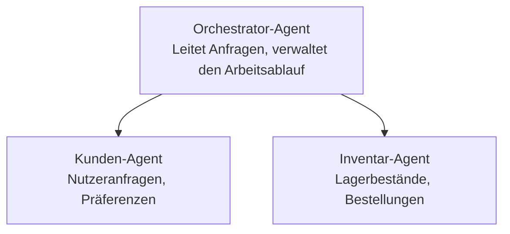

# Kapitel 5: Multi-Agent KI-Lösungen

**📚 Kurs**: [AZD For Beginners](../../README.md) | **⏱️ Dauer**: 2-3 Stunden | **⭐ Komplexität**: Fortgeschritten

---

## Übersicht

Dieses Kapitel behandelt fortgeschrittene Multi-Agent-Architektur‑Muster, Agentenorchestrierung und produktionsreife KI‑Bereitstellungen für komplexe Szenarien.

> Geprüft mit `azd 1.25.6` im Juni 2026.

## Lernziele

Nach Abschluss dieses Kapitels werden Sie:
- Multi-Agent-Architektur‑Muster verstehen
- koordinierte KI‑Agentensysteme bereitstellen
- Kommunikation zwischen Agenten implementieren
- produktionsreife Multi-Agenten‑Lösungen erstellen

---

## 📚 Lektionen

| # | Lektion | Beschreibung | Zeit |
|---|--------|-------------|------|
| 1 | [Multi-Agent Basics](multi-agent-basics.md) | Praxis: eine funktionierende Multi-Agenten-Anwendung mit `azd up` bereitstellen | 45 min |
| 2 | [Coordination Patterns](../chapter-06-pre-deployment/coordination-patterns.md) | Agenten-Orchestrierungsstrategien (setzt sich in Kapitel 6 fort) | 30 min |
| 3 | [ARM Template Deployment](../../examples/retail-multiagent-arm-template/README.md) | Ein-Klick-Bereitstellungsbeispiel | 30 min |

> **Beginnen Sie mit Lektion 1.** Sie ist die einzige vollständig praktische, bereitstellbare Lektion in diesem Kapitel. Lektion 2 befindet sich in Kapitel 6 (sie wird mit der Pre-Deployment-Planung geteilt), und die [Retail Multi-Agent-Lösung](../../examples/retail-scenario.md) ist ein Architektur-Blueprint — eine Designreferenz, keine Ein-Kommando-Vorlage.

---

## 🚀 Schnellstart

```bash
# Option 1: Aus einer Vorlage bereitstellen
azd init --template agent-openai-python-prompty
azd up

# Option 2: Aus einem Agentenmanifest bereitstellen (erfordert die azure.ai.agents-Erweiterung)
azd extension install azure.ai.agents
azd ai agent init -m agent-manifest.yaml
azd up
```

> **Welche Vorgehensweise?** Verwenden Sie `azd init --template`, um von einem funktionierenden Beispiel zu starten. Verwenden Sie `azd ai agent init`, wenn Sie ein eigenes Agenten‑Manifest haben. Siehe die [AZD AI CLI-Referenz](../chapter-08-production/production-ai-practices.md#azd-ai-cli-commands-and-extensions) für vollständige Details.

---

## 🤖 Multi-Agent-Architektur



---

## 🎯 Vorgestellte Lösung: Retail Multi-Agent-Lösung

Die [Retail Multi-Agent-Lösung](../../examples/retail-scenario.md) zeigt:

- **Kunden-Agent**: Verarbeitet Benutzerinteraktionen und -präferenzen
- **Inventar-Agent**: Verwaltet Lagerbestände und Auftragsabwicklung
- **Orchestrator**: Koordiniert die Agenten untereinander
- **Gemeinsamer Speicher**: Kontextverwaltung über Agenten hinweg

### Verwendete Dienste

| Dienst | Zweck |
|---------|---------|
| Microsoft Foundry Models | Sprachverständnis |
| Azure AI Search | Produktkatalog |
| Cosmos DB | Agentenstatus und -speicher |
| Container Apps | Agenten-Hosting |
| Application Insights | Überwachung |

---

## 🔗 Navigation

| Richtung | Kapitel |
|-----------|---------|
| **Vorheriges** | [Kapitel 4: Infrastruktur](../chapter-04-infrastructure/README.md) |
| **Nächstes** | [Kapitel 6: Pre-Deployment](../chapter-06-pre-deployment/README.md) |

---

## 📖 Verwandte Ressourcen

- [KI-Agenten-Leitfaden](../chapter-02-ai-development/agents.md)
- [Produktions-KI-Praktiken](../chapter-08-production/production-ai-practices.md)
- [KI-Fehlerbehebung](../chapter-07-troubleshooting/ai-troubleshooting.md)

---

<!-- CO-OP TRANSLATOR DISCLAIMER START -->
**Haftungsausschluss**:
Dieses Dokument wurde mit dem KI-Übersetzungsdienst [Co-op Translator](https://github.com/Azure/co-op-translator) übersetzt. Obwohl wir uns um Genauigkeit bemühen, beachten Sie bitte, dass automatisierte Übersetzungen Fehler oder Ungenauigkeiten enthalten können. Das Originaldokument in seiner Ursprungssprache gilt als maßgebliche Quelle. Bei kritischen Informationen wird eine professionelle menschliche Übersetzung empfohlen. Wir übernehmen keine Haftung für Missverständnisse oder Fehlinterpretationen, die aus der Verwendung dieser Übersetzung entstehen.
<!-- CO-OP TRANSLATOR DISCLAIMER END -->