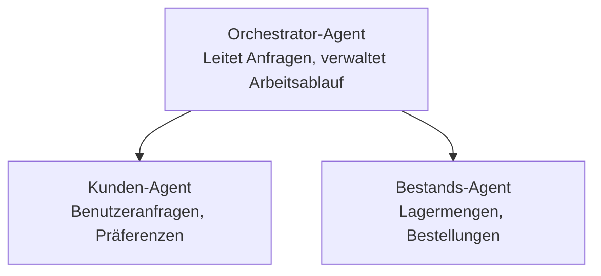

# Kapitel 5: Multi-Agent KI-Lösungen

**📚 Kurs**: [AZD für Anfänger](../../README.md) | **⏱️ Dauer**: 2-3 Stunden | **⭐ Komplexität**: Fortgeschritten

---

## Übersicht

Dieses Kapitel behandelt fortgeschrittene Multi-Agent-Architekturmuster, Agenten-Orchestrierung und produktionsreife KI-Bereitstellungen für komplexe Szenarien.

> Validiert mit `azd 1.27.1` im Juli 2026.

## Lernziele

Nach Abschluss dieses Kapitels wirst du:
- Multi-Agent-Architekturmuster verstehen
- koordinierte KI-Agenten-Systeme bereitstellen
- Agent-zu-Agent-Kommunikation implementieren
- produktionsreife Multi-Agent-Lösungen bauen

---

## 📚 Lektionen

| # | Lektion | Beschreibung | Zeit |
|---|--------|-------------|------|
| 1 | [Multi-Agent Grundlagen](multi-agent-basics.md) | Praktisch: Eine funktionierende Multi-Agent-App mit `azd up` bereitstellen | 45 Min |
| 2 | [Koordinationsmuster](../chapter-06-pre-deployment/coordination-patterns.md) | Agenten-Orchestrierungsstrategien (geht weiter in Kapitel 6) | 30 Min |
| 3 | [ARM Template Deployment](../../examples/retail-multiagent-arm-template/README.md) | Beispiel für One-Click-Bereitstellung | 30 Min |

> **Beginne mit Lektion 1.** Sie ist die einzige vollständig praktische, bereitstellbare Lektion in diesem Kapitel. Lektion 2 befindet sich in Kapitel 6 (shared mit der Vorbereitungsplanung), und die [Retail Multi-Agent Solution](../../examples/retail-scenario.md) ist eine Architekturvorlage – ein Designreferenz, kein One-Command Template.

---

## 🚀 Schnellstart

```bash
# Option 1: Bereitstellung aus einer Vorlage
azd init --template agent-openai-python-prompty
azd up

# Option 2: Bereitstellung aus einem Agentenmanifest (erfordert azure.ai.agents Erweiterung)
azd extension install azure.ai.agents
azd ai agent init -m agent-manifest.yaml
azd up
```

> **Welcher Ansatz?** Benutze `azd init --template`, um mit einem funktionierenden Beispiel zu starten. Nutze `azd ai agent init`, wenn du ein eigenes Agenten-Manifest hast. Siehe die [AZD AI CLI Referenz](../chapter-08-production/production-ai-practices.md#azd-ai-cli-commands-and-extensions) für volle Details.

---

## 🤖 Multi-Agent Architektur



---

## 🎯 Vorgestellte Lösung: Retail Multi-Agent

Die [Retail Multi-Agent Solution](../../examples/retail-scenario.md) demonstriert:

- **Kundenagent**: Verarbeitet Benutzerinteraktionen und Präferenzen
- **Bestandsagent**: Verwaltet Lagerbestand und Bestellabwicklung
- **Orchestrator**: Koordiniert zwischen Agenten
- **Gemeinsamer Speicher**: Kontextverwaltung über Agenten hinweg

### Eingesetzte Dienste

| Dienst | Zweck |
|---------|---------|
| Microsoft Foundry Models | Sprachverständnis |
| Azure AI Search | Produktkatalog |
| Cosmos DB | Agentenstatus und Speicher |
| Container-Apps | Agenten-Hosting |
| Application Insights | Überwachung |

---

## 🔗 Navigation

| Richtung | Kapitel |
|-----------|---------|
| **Vorheriges** | [Kapitel 4: Infrastruktur](../chapter-04-infrastructure/README.md) |
| **Nächstes** | [Kapitel 6: Vorbereitungen](../chapter-06-pre-deployment/README.md) |

---

## 📖 Verwandte Ressourcen

- [KI-Agenten Leitfaden](../chapter-02-ai-development/agents.md)
- [Produktions-KI-Praktiken](../chapter-08-production/production-ai-practices.md)
- [KI-Fehlerbehebung](../chapter-07-troubleshooting/ai-troubleshooting.md)

---

<!-- CO-OP TRANSLATOR DISCLAIMER START -->
**Haftungsausschluss**:
Dieses Dokument wurde mit dem KI-Übersetzungsdienst [Co-op Translator](https://github.com/Azure/co-op-translator) übersetzt. Obwohl wir uns um Genauigkeit bemühen, beachten Sie bitte, dass automatisierte Übersetzungen Fehler oder Ungenauigkeiten enthalten können. Das Originaldokument in seiner Ursprungssprache gilt als maßgebliche Quelle. Bei kritischen Informationen wird eine professionelle menschliche Übersetzung empfohlen. Wir übernehmen keine Haftung für Missverständnisse oder Fehlinterpretationen, die aus der Verwendung dieser Übersetzung entstehen.
<!-- CO-OP TRANSLATOR DISCLAIMER END -->