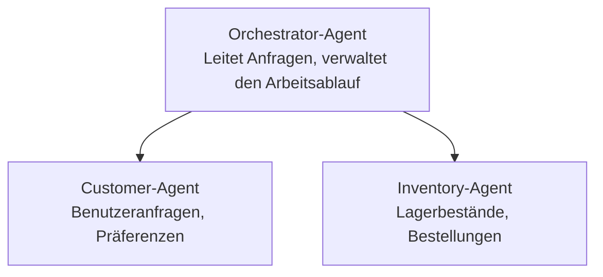

# Kapitel 5: Multi-Agent-KI-Lösungen

**📚 Kurs**: [AZD For Beginners](../../README.md) | **⏱️ Dauer**: 2-3 hours | **⭐ Komplexität**: Fortgeschritten

---

## Überblick

Dieses Kapitel behandelt fortgeschrittene Multi-Agent-Architekturmuster, Agenten-Orchestrierung und produktionsreife KI-Bereitstellungen für komplexe Szenarien.

## Lernziele

Nach Abschluss dieses Kapitels werden Sie:
- Multi-Agent-Architekturmuster verstehen
- koordinierte KI-Agentensysteme bereitstellen
- Agent-zu-Agent-Kommunikation implementieren
- produktionsreife Multi-Agent-Lösungen erstellen

---

## 📚 Lessons

| # | Lesson | Description | Time |
|---|--------|-------------|------|
| 1 | [Retail Multi-Agent Solution](../../examples/retail-scenario.md) | Vollständiger Implementierungsdurchgang | 90 min |
| 2 | [Coordination Patterns](../chapter-06-pre-deployment/coordination-patterns.md) | Strategien zur Agenten-Orchestrierung | 30 min |
| 3 | [ARM Template Deployment](../../examples/retail-multiagent-arm-template/README.md) | Ein-Klick-Bereitstellung | 30 min |

---

## 🚀 Schnellstart

```bash
# Option 1: Bereitstellung aus einer Vorlage
azd init --template agent-openai-python-prompty
azd up

# Option 2: Bereitstellung aus einem Agentenmanifest (erfordert die Erweiterung azure.ai.agents)
azd extension install azure.ai.agents
azd ai agent init -m agent-manifest.yaml
azd up
```

> **Welche Vorgehensweise?** Verwenden Sie `azd init --template`, um mit einem funktionierenden Beispiel zu beginnen. Verwenden Sie `azd ai agent init`, wenn Sie Ihr eigenes Agenten-Manifest haben. Siehe die [AZD AI CLI-Referenz](../chapter-08-production/production-ai-practices.md#azd-ai-cli-commands-and-extensions) für vollständige Details.

---

## 🤖 Multi-Agent-Architektur


---

## 🎯 Vorgestellte Lösung: Einzelhandels-Multi-Agent

Die [Retail Multi-Agent Solution](../../examples/retail-scenario.md) zeigt:

- **Customer Agent**: Verarbeitet Benutzerinteraktionen und Präferenzen
- **Inventory Agent**: Verwaltet Lagerbestand und Auftragsabwicklung
- **Orchestrator**: Koordiniert zwischen Agenten
- **Shared Memory**: Kontextverwaltung über Agenten hinweg

### Verwendete Dienste

| Service | Purpose |
|---------|---------|
| Microsoft Foundry Models | Sprachverstehen |
| Azure AI Search | Produktkatalog |
| Cosmos DB | Agentenzustand und -speicher |
| Container Apps | Agent-Hosting |
| Application Insights | Überwachung |

---

## 🔗 Navigation

| Direction | Chapter |
|-----------|---------|
| **Previous** | [Chapter 4: Infrastructure](../chapter-04-infrastructure/README.md) |
| **Next** | [Chapter 6: Pre-Deployment](../chapter-06-pre-deployment/README.md) |

---

## 📖 Verwandte Ressourcen

- [AI Agents Guide](../chapter-02-ai-development/agents.md)
- [Production AI Practices](../chapter-08-production/production-ai-practices.md)
- [AI Troubleshooting](../chapter-07-troubleshooting/ai-troubleshooting.md)

---

<!-- CO-OP TRANSLATOR DISCLAIMER START -->
Haftungsausschluss:
Dieses Dokument wurde mithilfe des KI-Übersetzungsdienstes [Co-op Translator](https://github.com/Azure/co-op-translator) übersetzt. Obwohl wir um Genauigkeit bemüht sind, kann es bei automatischen Übersetzungen zu Fehlern oder Ungenauigkeiten kommen. Das Originaldokument in seiner ursprünglichen Sprache ist als maßgebliche Quelle zu betrachten. Für wichtige Informationen wird eine professionelle menschliche Übersetzung empfohlen. Wir übernehmen keine Haftung für Missverständnisse oder Fehlinterpretationen, die aus der Nutzung dieser Übersetzung entstehen.
<!-- CO-OP TRANSLATOR DISCLAIMER END -->