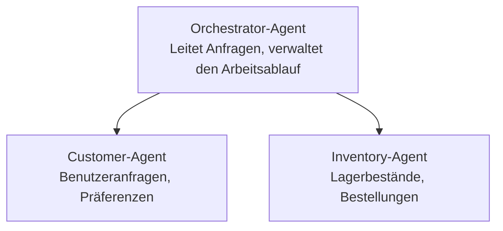

# Kapitel 5: Multi-Agent KI-Lösungen

**📚 Kurs**: [AZD für Einsteiger](../../README.md) | **⏱️ Dauer**: 2–3 Stunden | **⭐ Komplexität**: Fortgeschritten

---

## Überblick

Dieses Kapitel behandelt fortgeschrittene Multi-Agent-Architektur-Muster, Agentenorchestrierung und produktionsreife KI-Bereitstellungen für komplexe Szenarien.

> Validiert gegen `azd 1.23.12` im März 2026.

## Lernziele

Nach Abschluss dieses Kapitels werden Sie:
- Multi-Agent-Architekturmuster verstehen
- Koordinierte KI-Agentensysteme bereitstellen
- Agent-zu-Agent-Kommunikation implementieren
- Produktionsreife Multi-Agent-Lösungen erstellen

---

## 📚 Lektionen

| # | Lektion | Beschreibung | Dauer |
|---|--------|-------------|------|
| 1 | [Einzelhandels-Multi-Agenten-Lösung](../../examples/retail-scenario.md) | Vollständige Implementierungsdurchführung | 90 min |
| 2 | [Koordinationsmuster](../chapter-06-pre-deployment/coordination-patterns.md) | Strategien zur Agentenorchestrierung | 30 min |
| 3 | [ARM-Template-Bereitstellung](../../examples/retail-multiagent-arm-template/README.md) | Bereitstellung mit einem Klick | 30 min |

---

## 🚀 Schnellstart

```bash
# Option 1: Aus einer Vorlage bereitstellen
azd init --template agent-openai-python-prompty
azd up

# Option 2: Aus einem Agentenmanifest bereitstellen (erfordert die Erweiterung azure.ai.agents)
azd extension install azure.ai.agents
azd ai agent init -m agent-manifest.yaml
azd up
```

> **Welche Vorgehensweise?** Verwenden Sie `azd init --template`, um mit einer funktionierenden Vorlage zu beginnen. Verwenden Sie `azd ai agent init`, wenn Sie ein eigenes Agentenmanifest haben. Siehe die [AZD AI CLI-Referenz](../chapter-08-production/production-ai-practices.md#azd-ai-cli-commands-and-extensions) für vollständige Details.

---

## 🤖 Multi-Agent-Architektur


---

## 🎯 Vorgestellte Lösung: Einzelhandels-Multi-Agenten-Lösung

Die [Einzelhandels-Multi-Agenten-Lösung](../../examples/retail-scenario.md) demonstriert:

- **Customer Agent**: Verarbeitet Benutzerinteraktionen und Präferenzen
- **Inventory Agent**: Verwaltet Lagerbestand und Auftragsabwicklung
- **Orchestrator**: Koordiniert zwischen Agenten
- **Shared Memory**: Kontextverwaltung über Agenten hinweg

### Verwendete Dienste

| Dienst | Zweck |
|---------|---------|
| Microsoft Foundry Models | Sprachverständnis |
| Azure AI Search | Produktkatalog |
| Cosmos DB | Agentenzustand und Speicher |
| Container Apps | Agent-Hosting |
| Application Insights | Überwachung |

---

## 🔗 Navigation

| Richtung | Kapitel |
|-----------|---------|
| **Vorheriges** | [Kapitel 4: Infrastructure](../chapter-04-infrastructure/README.md) |
| **Nächstes** | [Kapitel 6: Pre-Deployment](../chapter-06-pre-deployment/README.md) |

---

## 📖 Verwandte Ressourcen

- [Leitfaden zu KI-Agenten](../chapter-02-ai-development/agents.md)
- [Produktions-KI-Praktiken](../chapter-08-production/production-ai-practices.md)
- [Fehlerbehebung für KI](../chapter-07-troubleshooting/ai-troubleshooting.md)

---

<!-- CO-OP TRANSLATOR DISCLAIMER START -->
**Haftungsausschluss**:
Dieses Dokument wurde mit dem KI-Übersetzungsdienst [Co-op Translator](https://github.com/Azure/co-op-translator) übersetzt. Obwohl wir uns um Genauigkeit bemühen, beachten Sie bitte, dass automatisierte Übersetzungen Fehler oder Ungenauigkeiten enthalten können. Das Originaldokument in seiner ursprünglichen Sprache sollte als maßgebliche Quelle betrachtet werden. Für kritische Informationen wird eine professionelle, menschliche Übersetzung empfohlen. Wir haften nicht für Missverständnisse oder Fehlinterpretationen, die sich aus der Verwendung dieser Übersetzung ergeben.
<!-- CO-OP TRANSLATOR DISCLAIMER END -->