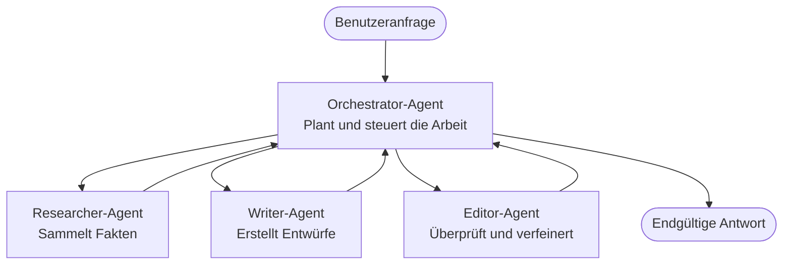

# Grundlagen zu Multi-Agenten – Stellen Sie Ihr erstes koordiniertes KI-System bereit

**Kapitel-Navigation:**
- **📚 Kursstart**: [AZD für Einsteiger](../../README.md)
- **📖 Aktuelles Kapitel**: Kapitel 5 – Multi-Agenten KI-Lösungen
- **⬅️ Vorheriges**: [Kapitel 4: Infrastruktur](../chapter-04-infrastructure/README.md)
- **➡️ Nächstes**: [Koordinationsmuster](../chapter-06-pre-deployment/coordination-patterns.md)

> Validiert mit `azd 1.27.1` im Juli 2026.

## Einführung

In den vorherigen Kapiteln haben Sie eine einzelne Anwendung bereitgestellt – und in Kapitel 2 haben Sie einen einzelnen KI-Agenten bereitgestellt. Diese Lektion geht einen Schritt weiter: Sie stellen ein **Multi-Agenten-System** bereit, in dem mehrere spezialisierte Agenten zusammenarbeiten, um ein Problem zu lösen, das kein einzelner Agent allein gut bewältigen könnte.

Die gute Nachricht für Anfänger: **Sie benötigen keine neuen Befehle.** Eine Multi-Agenten-Lösung ist immer noch ein azd-Projekt. Sie führen `azd init`, `azd up`, Tests und `azd down` durch – genau den Workflow, den Sie bereits kennen. Was sich ändert, ist die *Gestalt* der App im Inneren.

## Lernziele

Am Ende dieser Lektion werden Sie:
- Verstehen, was "multi-agent" bedeutet und wann die zusätzliche Komplexität lohnt
- Die typischen Rollen in einem Multi-Agenten-System erkennen (Orchestrator + Spezialisten)
- Eine echte, funktionierende Multi-Agenten-Vorlage mit `azd up` bereitstellen
- Die Azure-Ressourcen verstehen, die eine Multi-Agenten-App unterstützen
- Wissen, wie man die Lösung überprüft, anpasst und sicher abbaut

## Lernergebnisse

Nach Abschluss dieser Lektion werden Sie in der Lage sein:
- Den Unterschied zwischen einem einzelnen Agenten und einem Multi-Agenten-System zu erklären
- Zwischen einem einzelnen Agenten mit Tools und einem echten Multi-Agenten-Design zu wählen
- Eine Multi-Agenten-Vorlage end-to-end mit azd bereitzustellen und zu testen
- Zu identifizieren, wo jeder Agent läuft und wie sie kommunizieren
- Alle Ressourcen aufzuräumen, um fortlaufende Kosten zu vermeiden

---

## Was ist ein Multi-Agenten-System?

Ein einzelner KI-Agent ist ein Modell mit einem Satz von Anweisungen und (optional) einigen Werkzeugen. Das funktioniert gut für fokussierte Aufgaben. Aber wenn eine Aufgabe größer wird – recherchieren, dann schreiben, dann bearbeiten, dann Fakten prüfen – macht alles in einen Prompt zu packen den Agenten langsamer, weniger zuverlässig und schwerer zu debuggen.

Ein **Multi-Agenten-System** teilt die Arbeit in Spezialisten auf, die jeweils eine Aufgabe gut erledigen, koordiniert von einem Orchestrator:



### Die zwei Rollen, die Sie immer sehen werden

| Rolle | Aufgabe | Beispiel |
|------|---------|----------|
| **Orchestrator** | Entscheidet *was als Nächstes passiert* und verteilt die Arbeit zwischen den Agenten | "Zuerst recherchieren, dann schreiben, dann bearbeiten" |
| **Spezialist** | Erledigt eine fokussierte Aufgabe und liefert ein Ergebnis zurück | Ein „Forscher“, der nur Fakten sammelt |

### Brauchen Sie wirklich mehrere Agenten?

Starten Sie einfach. Greifen Sie **nur** dann zu Multi-Agenten, wenn eines der folgenden zutrifft:

- ✅ Die Aufgabe hat **unterschiedliche Phasen**, die von unterschiedlichen Anweisungen profitieren (Recherchieren vs. Schreiben vs. Überprüfen)
- ✅ Sie möchten, dass Spezialisten **parallel laufen**, um Zeit zu sparen
- ✅ Verschiedene Schritte benötigen **verschiedene Werkzeuge oder Datenquellen**
- ✅ Jeder Schritt soll **unabhängig testbar und debugbar** sein

Wenn Ihre Aufgabe eine einzelne Frage-Antwort oder ein einfacher Tool-Aufruf ist, ist ein **einzelner Agent mit Werkzeugen** (Kapitel 2) einfacher, kostengünstiger und leichter zu betreiben.

> **Anfängertipp:** „Mehr Agenten“ ist nicht „besser“. Jeder Agent fügt Verzögerung, Kosten und eine neue Überwachungsaufgabe hinzu. Fügen Sie Agenten nur hinzu, wenn sich das Problem klar in Teile teilt.

---

## Zwei Wege, Multi-Agenten auf Azure zu bauen

| Ansatz | Was es ist | Am besten für |
|--------|-----------|-------------|
| **Einzelner Agent + Werkzeuge** | Ein Foundry-Agent, der Funktionen/Werkzeuge aufruft | Einfache Workflows, erster Einstieg |
| **Mehrere koordinierte Agenten** | Mehrere Agenten mit einem Orchestrator | Unterschiedliche Phasen, parallele Arbeit, Spezialisierung |

Diese Lektion konzentriert sich auf den zweiten Ansatz mit einer **fertigen Vorlage**, damit Sie ein echtes Multi-Agenten-System in Aktion sehen, bevor Sie Ihr eigenes bauen.

---

## Praxis: Eine funktionierende Multi-Agenten-App bereitstellen

Wir stellen **Contoso Creative Writer** bereit, ein offizielles Azure-Beispiel, das mehrere Agenten (Forscher, Schreiber, Redakteur) koordiniert, um einen Artikel zu erstellen. Es ist eine großartige erste Multi-Agenten-App, weil die Rollen leicht verständlich sind.

### Schritt 1: Vorlage initialisieren

```bash
# Erstelle einen Arbeitsordner
mkdir creative-writer && cd creative-writer

# Initialisiere aus der offiziellen Multi-Agenten-Vorlage
azd init --template contoso-creative-writer
```

> Durchsuchen Sie jederzeit weitere Multi-Agenten-Vorlagen in der [Awesome AZD AI Galerie](https://azure.github.io/awesome-azd/?tags=ai). Andere anfängerfreundliche Optionen sind `get-started-with-ai-agents` und `azure-ai-travel-agents`.

### Schritt 2: Authentifizieren

```bash
# Erforderlich für azd-Arbeitsabläufe
azd auth login
```

### Schritt 3: Eine Umgebung erstellen

```bash
azd env new dev
```

### Schritt 4: Vorschau und dann bereitstellen

```bash
# Sehen Sie, was erstellt wird, bevor Sie etwas ausgeben (empfohlen)
azd provision --preview

# Infrastruktur bereitstellen und alle Agenten in einem Schritt bereitstellen
azd up
```

`azd up` fordert Sie auf, ein Abonnement und eine Region auszuwählen, stellt dann die Azure-Ressourcen bereit und deployt die Anwendung. KI-Bereitstellungen können länger dauern als eine einfache Web-App – wenn Sie größere Modelle bereitstellen, können Sie das Deploy-Timeout verlängern:

```bash
azd deploy --timeout 1800
```

> **Hinweis zu Kosten und Kapazität:** Multi-Agenten-Apps deployen KI-Modelle, die Quoten verbrauchen und Kosten verursachen. Wenn `azd up` aufgrund von Modellquoten fehlschlägt, sehen Sie unter [KI-Fehlerbehebung](../chapter-07-troubleshooting/ai-troubleshooting.md) nach Regionen- und Quotenkorrekturen, und Kapitel 6 [Kapazitätsplanung](../chapter-06-pre-deployment/capacity-planning.md).

---

## Verstehen, was Sie bereitgestellt haben

Eine typische Multi-Agenten-App wie diese stellt eine Reihe von Azure-Ressourcen bereit, die direkt den Verantwortlichkeiten im obigen Diagramm entsprechen:

| Ressource | Warum sie da ist |
|----------|------------------|
| **Microsoft Foundry / Modelle** | Hostet die Sprachmodelle, die jeder Agent verwendet |
| **Azure AI Search** | Gibt dem Forscher-Agenten fundierte Daten zur Suche |
| **Container Apps** (oder App Service) | Hostet den Orchestrator und den Agenten-Code |
| **Cosmos DB** (in einigen Beispielen) | Speichert gemeinsamen Zustand/Speicher, der zwischen Agenten ausgetauscht wird |
| **Application Insights** | Verfolgt Anfragen *über* Agenten hinweg, damit Sie den Ablauf debuggen können |

### Wie die Agenten miteinander kommunizieren

In den meisten azd Multi-Agenten-Beispielen läuft der **Orchestrator im Anwendungscode** (z. B. mit Frameworks wie Semantic Kernel oder Microsoft Agent Framework). Der Orchestrator ruft jeden Spezialisten nacheinander auf, übergibt die Ergebnisse und fügt die finale Antwort zusammen. Die Agenten teilen Kontext durch:

- **Funktions-/Werkzeugaufrufe** — der Orchestrator ruft einen Spezialisten auf und erhält ein Ergebnis zurück
- **Gemeinsamer Speicher** — eine Datenbank (oft Cosmos DB) hält einen Zustand, den beide Agenten lesen können
- **Nachrichten/Ereignisse** — für lockerere Kopplung kommunizieren Agenten über eine Warteschlange oder Service Bus

> **Warum das für das Debugging wichtig ist:** Da jeder Schritt separat ist, zeigt Application Insights *welcher* Agent langsam war oder fehlgeschlagen ist. Das ist ein Hauptgrund, die Arbeit überhaupt auf mehrere Agenten aufzuteilen.

---

## Überprüfung der Bereitstellung

Bestätigen Sie, dass das System tatsächlich funktioniert, bevor Sie weitermachen:

```bash
# Zeige die bereitgestellten Endpunkte an
azd show

# Öffne das Überwachungs-Dashboard der App
azd monitor

# Protokolle verfolgen, wenn etwas ungewöhnlich aussieht
azd monitor --logs
```

Öffnen Sie dann die App-URL von `azd show` und testen Sie eine Anfrage, die alle Agenten beansprucht (für Creative Writer zum Beispiel einen kurzen Artikel zu einem Thema schreiben lassen). In der Application Insights **Transaktionssuche** sollten Sie sehen, wie die Anfrage sich auf Forscher-, Schreiber- und Redakteur-Schritte verteilt.

**Erfolgskriterien:**
- ✅ `azd show` zeigt einen erreichbaren Endpunkt an
- ✅ Eine Anfrage liefert ein Ergebnis, das deutlich mehrere Phasen durchlaufen hat
- ✅ Application Insights zeigt Traces für mehr als einen Agenten-Schritt

---

## Anpassen: Einen Agenten hinzufügen oder ändern

Da jeder Agent nur Anweisungen plus Werkzeuge ist, ist das Anpassen gut machbar:

1. **Finden Sie die Agent-Definitionen** in der Vorlage (oft ein Satz von Dateien in `prompts/`, `agents/` oder `*.prompty`).
2. **Passen Sie die Anweisungen eines Agenten an** – zum Beispiel den Redakteur-Agenten dazu bringen, einen bestimmten Ton oder eine Wortzahl durchzusetzen.
3. **Nur den Code neu bereitstellen** (die Infrastruktur bleibt unverändert):

   ```bash
   azd deploy
   ```

Um weiterzugehen und Agenten aus *eigenen* Manifests zu bauen, verwenden Sie die Agent-Erweiterung und ihren vollständigen Lebenszyklus:

```bash
azd extension install azure.ai.agents
azd ai agent init -m agent-manifest.yaml
azd up
azd ai agent invoke      # Test, mit Antwortzeitmessung
```

Siehe [Kapitel 2: Agenten](../chapter-02-ai-development/agents.md) und die [AZD AI CLI Referenz](../chapter-08-production/production-ai-practices.md#azd-ai-cli-commands-and-extensions) für den vollständigen Agenten-Lebenszyklus (`invoke`, `eval generate`, `optimize`, `delete`).

---

## Aufräumen

Multi-Agenten-Apps betreiben mehrere kostenpflichtige Dienste. Räumen Sie alles ab, wenn Sie fertig sind:

```bash
azd down --force --purge
```

Der `--purge`-Schalter entfernt auch weichgelöschte KI-Ressourcen (wie Foundry-/Azure AI Services-Konten), damit diese keine zukünftigen erneuten Bereitstellungen blockieren oder weiterhin Kosten verursachen.

---

## Ein Hinweis zu produktiven Multi-Agenten-Systemen

Die [Retail Multi-Agent Solution](../../examples/retail-scenario.md) in diesem Repo ist ein **Architektur-Blueprint**, keine One-Command-Vorlage – sie dokumentiert, wie ein produktives Einzelhandelssystem *gebaut werden würde* (und macht deutlich, dass ein vollständiger Aufbau ein erheblicher Aufwand ist). Nutzen Sie sie als Designreferenz *nachdem* Sie hier ein funktionierendes Beispiel bereitgestellt haben. Für produktionsrelevante Themen (Ausfallsicherheit, Kosten, Überwachung, Governance) siehe weiter [Kapitel 8: Produktion KI-Praktiken](../chapter-08-production/production-ai-practices.md).

---

## Zusammenfassung

- Ein Multi-Agenten-System teilt Arbeit auf Spezialisten auf, die vom Orchestrator koordiniert werden.
- Nutzen Sie es nur, wenn die Aufgabe unterschiedliche Phasen, Parallelität oder verschiedene Werkzeuge pro Schritt hat – sonst bevorzugen Sie einen einzelnen Agenten.
- Der azd-Workflow bleibt gleich: `azd init` → `azd up` → testen → `azd down`.
- Eine echte Vorlage wie `contoso-creative-writer` ermöglicht es Ihnen heute, eine funktionierende Multi-Agenten-App zu sehen und anzupassen.
- Die Application Insights-Verfolgung über Agenten hinweg ist einer der größten praktischen Vorteile des Multi-Agenten-Designs.

---

## 🔗 Navigation

| Richtung | Lektion |
|----------|---------|
| **Vorheriges** | [Kapitel 4: Infrastruktur](../chapter-04-infrastructure/README.md) |
| **Nächstes** | [Koordinationsmuster](../chapter-06-pre-deployment/coordination-patterns.md) |

## 📖 Verwandte Ressourcen

- [KI-Agenten Leitfaden](../chapter-02-ai-development/agents.md)
- [Koordinationsmuster](../chapter-06-pre-deployment/coordination-patterns.md)
- [Produktion KI-Praktiken](../chapter-08-production/production-ai-practices.md)
- [KI-Fehlerbehebung](../chapter-07-troubleshooting/ai-troubleshooting.md)

---

<!-- CO-OP TRANSLATOR DISCLAIMER START -->
**Haftungsausschluss**:
Dieses Dokument wurde mit dem KI-Übersetzungsdienst [Co-op Translator](https://github.com/Azure/co-op-translator) übersetzt. Obwohl wir uns um Genauigkeit bemühen, beachten Sie bitte, dass automatisierte Übersetzungen Fehler oder Ungenauigkeiten enthalten können. Das Originaldokument in seiner Ursprungssprache gilt als maßgebliche Quelle. Bei kritischen Informationen wird eine professionelle menschliche Übersetzung empfohlen. Wir übernehmen keine Haftung für Missverständnisse oder Fehlinterpretationen, die aus der Verwendung dieser Übersetzung entstehen.
<!-- CO-OP TRANSLATOR DISCLAIMER END -->