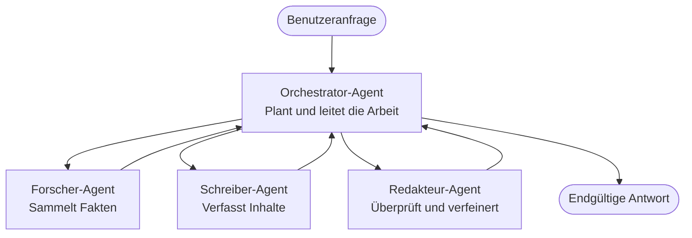

# Multi-Agent-Grundlagen - Setzen Sie Ihr erstes koordiniertes KI-System ein

**Kapitel-Navigation:**
- **📚 Course Home**: [AZD For Beginners](../../README.md)
- **📖 Current Chapter**: Kapitel 5 - Multi-Agent KI-Lösungen
- **⬅️ Previous**: [Chapter 4: Infrastructure](../chapter-04-infrastructure/README.md)
- **➡️ Next**: [Coordination Patterns](../chapter-06-pre-deployment/coordination-patterns.md)

> Validiert gegen `azd 1.25.6` im Juni 2026.

## Einführung

In den früheren Kapiteln haben Sie eine einzelne Anwendung bereitgestellt — und in Kapitel 2 haben Sie einen einzelnen KI-Agenten bereitgestellt. Diese Lektion macht den nächsten Schritt: das Bereitstellen eines **Multi-Agenten-Systems**, in dem mehrere spezialisierte Agenten zusammenarbeiten, um ein Problem zu lösen, das kein einzelner Agent allein gut bewältigen könnte.

Die gute Nachricht für Einsteiger: **Sie benötigen keine neuen Befehle.** Eine Multi-Agent-Lösung ist weiterhin ein azd-Projekt. Sie werden `azd init`, `azd up`, testen und `azd down` ausführen — genau den Workflow, den Sie bereits kennen. Was sich ändert, ist die *Gestalt* der App im Inneren.

## Lernziele

Am Ende dieser Lektion werden Sie:
- Verstehen, was „Multi-Agent“ bedeutet und wann sich die zusätzliche Komplexität lohnt
- Die gängigen Rollen in einem Multi-Agent-System erkennen (Orchestrator + Spezialisten)
- Eine echte, funktionierende Multi-Agent-Vorlage mit `azd up` bereitstellen
- Die Azure-Ressourcen verstehen, die eine Multi-Agent-App unterstützen
- Wissen, wie Sie die Lösung überprüfen, anpassen und sicher wieder entfernen

## Lernergebnisse

Nach Abschluss dieser Lektion sind Sie in der Lage:
- Den Unterschied zwischen einem einzelnen Agenten und einem Multi-Agent-System zu erklären
- Zwischen einem Einzelagenten mit Tools und einem echten Multi-Agent-Design zu wählen
- Eine Multi-Agent-Vorlage mit azd Ende-zu-Ende bereitzustellen und zu testen
- Zu erkennen, wo jeder Agent ausgeführt wird und wie sie kommunizieren
- Alle Ressourcen aufzuräumen, um laufende Kosten zu vermeiden

---

## Was ist ein Multi-Agent-System?

Ein einzelner KI-Agent ist ein Modell mit einer Reihe von Anweisungen und (optional) einigen Tools. Das funktioniert gut für fokussierte Aufgaben. Wenn eine Aufgabe jedoch wächst — recherchieren, dann schreiben, dann bearbeiten, dann Fakten überprüfen — wird alles in einen einzigen Prompt zu stopfen den Agenten langsamer, weniger zuverlässig und schwerer zu debuggen machen.

Ein **Multi-Agent-System** zerlegt die Arbeit in Spezialisten, die jeweils eine Aufgabe gut erledigen, koordiniert von einem Orchestrator:



### Die beiden Rollen, die Sie immer sehen werden

| Rolle | Aufgabe | Beispiel |
|------|-----|---------|
| **Orchestrator** | Entscheidet *was als Nächstes passiert* und leitet die Arbeit zwischen den Agenten weiter | "Erst recherchieren, dann schreiben, dann bearbeiten" |
| **Spezialist** | Erledigt eine fokussierte Aufgabe und liefert ein Ergebnis zurück | Ein "Researcher", der nur Fakten sammelt |

### Brauchen Sie tatsächlich mehrere Agenten?

Beginnen Sie einfach. Greifen Sie nur dann zu Multi-Agent, wenn eines der folgenden zutrifft:

- ✅ Die Aufgabe hat **unterschiedliche Phasen**, die von verschiedenen Anweisungen profitieren (Recherche vs. Schreiben vs. Review)
- ✅ Sie möchten, dass Spezialisten **parallel** laufen, um Zeit zu sparen
- ✅ Unterschiedliche Schritte benötigen **verschiedene Tools oder Datenquellen**
- ✅ Sie benötigen, dass jeder Schritt **unabhängig testbar und debuggbar** ist

Wenn Ihre Aufgabe eine einfache Frage-Antwort-Situation oder ein einfacher Tool-Aufruf ist, ist ein **einzelner Agent mit Tools** (Kapitel 2) einfacher, günstiger und leichter zu betreiben.

> **Tipp für Einsteiger:** „Mehr Agenten“ ist nicht „besser“. Jeder Agent fügt Latenz, Kosten und einen weiteren zu überwachenden Punkt hinzu. Fügen Sie Agenten nur hinzu, wenn das Problem sich klar in Teile aufspaltet.

---

## Zwei Wege, Multi-Agent auf Azure zu bauen

| Ansatz | Was es ist | Am besten für |
|----------|-----------|----------|
| **Ein einzelner Agent + Tools** | Ein Foundry-Agent, der Funktionen/Tools aufruft | Einfache Workflows, Einstieg |
| **Mehrere koordinierte Agenten** | Mehrere Agenten mit einem Orchestrator | Unterschiedliche Phasen, parallele Arbeit, Spezialisierung |

Diese Lektion konzentriert sich auf den zweiten Ansatz mit einer **fertigen Vorlage**, damit Sie ein echtes Multi-Agent-System in Aktion sehen können, bevor Sie Ihr eigenes bauen.

---

## Praxis: Eine funktionierende Multi-Agent-App bereitstellen

Wir werden **Contoso Creative Writer** bereitstellen, ein offizielles Azure-Beispiel, das mehrere Agenten verwendet (Researcher, Writer, Editor), die koordiniert einen Artikel erstellen. Es ist eine großartige erste Multi-Agent-App, weil die Rollen leicht zu verstehen sind.

### Schritt 1: Vorlage initialisieren

```bash
# Erstelle einen Arbeitsordner
mkdir creative-writer && cd creative-writer

# Initialisiere aus der offiziellen Multiagenten-Vorlage
azd init --template contoso-creative-writer
```

> Durchsuchen Sie jederzeit weitere Multi-Agent-Vorlagen in der [Awesome AZD AI gallery](https://azure.github.io/awesome-azd/?tags=ai). Weitere anfängerfreundliche Optionen sind `get-started-with-ai-agents` und `azure-ai-travel-agents`.

### Schritt 2: Authentifizieren

```bash
# Erforderlich für azd-Workflows
azd auth login
```

### Schritt 3: Umgebung erstellen

```bash
azd env new dev
```

### Schritt 4: Vorschau, dann bereitstellen

```bash
# Sehen Sie, was erstellt wird, bevor Sie etwas ausgeben (empfohlen)
azd provision --preview

# Infrastruktur bereitstellen und alle Agenten in einem Schritt bereitstellen
azd up
```

`azd up` fordert Sie zur Auswahl eines Abonnements und einer Region auf, provisioniert dann die Azure-Ressourcen und stellt die Anwendung bereit. AI-Bereitstellungen können länger dauern als eine einfache Web-App — wenn Sie größere Modelle bereitstellen, können Sie das Bereitstellungs-Timeout verlängern:

```bash
azd deploy --timeout 1800
```

> **Hinweis zu Kosten und Kapazität:** Multi-Agent-Apps stellen KI-Modelle bereit, die Kontingente verbrauchen und Kosten verursachen. Falls `azd up` aufgrund von Modell-Kontingenten fehlschlägt, siehe [AI Troubleshooting](../chapter-07-troubleshooting/ai-troubleshooting.md) für Regionen- und Kontingentbehebungen, und Kapitel 6 [Capacity Planning](../chapter-06-pre-deployment/capacity-planning.md).

---

## Verstehen, was Sie bereitgestellt haben

Eine typische Multi-Agent-App wie diese stellt eine Reihe von Azure-Ressourcen bereit, die direkt den Verantwortlichkeiten im obigen Diagramm entsprechen:

| Ressource | Warum sie vorhanden ist |
|----------|----------------|
| **Microsoft Foundry / Models** | Hostet die Sprachmodelle, die jeder Agent verwendet |
| **Azure AI Search** | Bietet dem Researcher-Agenten fundierte Daten zum Durchsuchen |
| **Container Apps** (oder App Service) | Hostet den Orchestrator und den Agentencode |
| **Cosmos DB** (in einigen Beispielen) | Speichert gemeinsam genutzten Zustand/Speicher, der zwischen Agenten weitergegeben wird |
| **Application Insights** | Verfolgt Anfragen *über* Agenten hinweg, damit Sie den Ablauf debuggen können |

### Wie die Agenten miteinander kommunizieren

In den meisten azd Multi-Agent-Beispielen läuft der **Orchestrator in Ihrem Anwendungscode** (zum Beispiel unter Verwendung eines Frameworks wie Semantic Kernel oder des Microsoft Agent Framework). Der Orchestrator ruft jeden Spezialisten nacheinander auf, gibt die Ergebnisse weiter und setzt die endgültige Antwort zusammen. Die Agenten teilen Kontext über:

- **Function/tool calls** — der Orchestrator ruft einen Spezialisten auf und erhält ein Ergebnis zurück
- **Geteilten Speicher** — eine Datenbank (oft Cosmos DB) hält Zustand, den beide Agenten lesen können
- **Nachrichten/Ereignisse** — für lose Kopplung kommunizieren Agenten über eine Warteschlange oder Service Bus

> **Warum das für das Debugging wichtig ist:** Da jeder Schritt getrennt ist, zeigt Application Insights Ihnen *welcher* Agent langsam war oder fehlgeschlagen ist. Das ist ein wesentlicher Grund, Arbeit über Agenten zu verteilen.

---

## Überprüfen Sie die Bereitstellung

Bestätigen Sie, dass das System tatsächlich funktioniert, bevor Sie weitermachen:

```bash
# Zeige die bereitgestellten Endpunkte
azd show

# Öffne das Überwachungs-Dashboard der App
azd monitor

# Protokolle fortlaufend anzeigen, wenn etwas nicht stimmt
azd monitor --logs
```

Öffnen Sie dann die App-URL aus `azd show` und führen Sie eine Anfrage aus, die alle Agenten beansprucht (bei Creative Writer bitten Sie ihn zum Beispiel, einen kurzen Artikel zu einem Thema zu schreiben). In der Application Insights **transaction search** sollten Sie sehen, wie sich die Anfrage über Researcher-, Writer- und Editor-Schritte verteilt.

**Erfolgskriterien:**
- ✅ `azd show` listet einen erreichbaren Endpunkt auf
- ✅ Eine Anfrage erzeugt ein Ergebnis, das deutlich mehrere Phasen durchlaufen hat
- ✅ Application Insights zeigt Traces für mehr als einen Agenten-Schritt

---

## Anpassen: Einen Agenten hinzufügen oder anpassen

Da jeder Agent nur Anweisungen plus Tools ist, ist das Anpassen gut zugänglich:

1. **Finden Sie die Agentendefinitionen** in der Vorlage (oft eine `prompts/`, `agents/` oder `*.prompty`-Datei).
2. **Passen Sie die Anweisungen eines Agenten an** — zum Beispiel können Sie dem Editor-Agenten vorgeben, einen bestimmten Ton oder eine bestimmte Wortanzahl durchzusetzen.
3. **Nur den Code neu bereitstellen** (die Infrastruktur bleibt unverändert):

   ```bash
   azd deploy
   ```

Um weiterzugehen und Agenten aus Ihrem *eigenen* Manifest zu erstellen, verwenden Sie die agent extension und deren vollständigen Lifecycle:

```bash
azd extension install azure.ai.agents
azd ai agent init -m agent-manifest.yaml
azd up
azd ai agent invoke      # Test, mit Antwortzeitmessung
```

Siehe [Kapitel 2: Agenten](../chapter-02-ai-development/agents.md) und die [AZD AI CLI-Referenz](../chapter-08-production/production-ai-practices.md#azd-ai-cli-commands-and-extensions) für den vollständigen Agenten-Lifecycle (`invoke`, `eval generate`, `optimize`, `delete`).

---

## Aufräumen

Multi-Agent-Apps betreiben mehrere abrechenbare Dienste. Räumen Sie alles ab, wenn Sie fertig sind:

```bash
azd down --force --purge
```

Der `--purge`-Schalter entfernt außerdem soft-gelöschte KI-Ressourcen (wie Foundry/Azure AI Services-Konten), damit sie eine zukünftige Bereitstellung nicht blockieren oder weiterhin Kosten verursachen.

---

## Ein Hinweis zu Produktions‑Multi‑Agent‑Systemen

Die [Retail Multi-Agent Solution](../../examples/retail-scenario.md) in diesem Repo ist ein **Architektur-Blueprint**, keine Ein-Klick-Vorlage — sie dokumentiert, wie ein Produktions‑Retail‑System *gebaut werden würde* (und stellt klar, dass ein komplettes Build einen erheblichen Aufwand darstellt). Verwenden Sie es als Design-Referenz *nachdem* Sie ein funktionierendes Beispiel hier bereitgestellt haben. Für Produktionsbelange (Resilienz, Kosten, Monitoring, Governance) schauen Sie weiter in [Kapitel 8: Production AI Practices](../chapter-08-production/production-ai-practices.md).

---

## Zusammenfassung

- Ein Multi-Agent-System teilt Arbeit zwischen Spezialisten, koordiniert durch einen Orchestrator.
- Verwenden Sie es nur, wenn die Aufgabe unterschiedliche Phasen, Parallelität oder verschiedene Tools pro Schritt hat — ansonsten bevorzugen Sie einen einzelnen Agenten.
- Der azd-Workflow bleibt unverändert: `azd init` → `azd up` → testen → `azd down`.
- Eine echte Vorlage wie `contoso-creative-writer` ermöglicht es Ihnen, heute eine funktionierende Multi-Agent-App zu sehen und anzupassen.
- Application Insights-Tracing über Agenten hinweg ist einer der größten praktischen Vorteile des Multi-Agent-Designs.

---

## 🔗 Navigation

| Richtung | Lektion |
|-----------|--------|
| **Previous** | [Chapter 4: Infrastructure](../chapter-04-infrastructure/README.md) |
| **Next** | [Coordination Patterns](../chapter-06-pre-deployment/coordination-patterns.md) |

## 📖 Verwandte Ressourcen

- [AI Agents Guide](../chapter-02-ai-development/agents.md)
- [Coordination Patterns](../chapter-06-pre-deployment/coordination-patterns.md)
- [Production AI Practices](../chapter-08-production/production-ai-practices.md)
- [AI Troubleshooting](../chapter-07-troubleshooting/ai-troubleshooting.md)

---

<!-- CO-OP TRANSLATOR DISCLAIMER START -->
**Haftungsausschluss**:
Dieses Dokument wurde mit dem KI-Übersetzungsdienst [Co-op Translator](https://github.com/Azure/co-op-translator) übersetzt. Obwohl wir uns um Genauigkeit bemühen, beachten Sie bitte, dass automatisierte Übersetzungen Fehler oder Ungenauigkeiten enthalten können. Das Originaldokument in seiner Ursprungssprache gilt als maßgebliche Quelle. Bei kritischen Informationen wird eine professionelle menschliche Übersetzung empfohlen. Wir übernehmen keine Haftung für Missverständnisse oder Fehlinterpretationen, die aus der Verwendung dieser Übersetzung entstehen.
<!-- CO-OP TRANSLATOR DISCLAIMER END -->