# Application Insights-Integration mit AZD

⏱️ **Geschätzte Zeit**: 40–50 Minuten | 💰 **Kostenwirkung**: ~5–15 $/Monat | ⭐ **Komplexität**: Mittel

**📚 Lernpfad:**
- ← Vorherige: [Vorabprüfungen](preflight-checks.md) - Vorbereitungsprüfungen vor der Bereitstellung
- 🎯 **Sie sind hier**: Application Insights-Integration (Monitoring, Telemetrie, Debugging)
- → Nächste: [Bereitstellungsanleitung](../chapter-04-infrastructure/deployment-guide.md) - In Azure bereitstellen
- 🏠 [Kursübersicht](../../README.md)

---

## Was Sie lernen werden

Durch Abschluss dieser Lektion werden Sie:
- Application Insights automatisch in AZD-Projekte integrieren
- Verteiltes Tracing für Microservices konfigurieren
- Benutzerdefinierte Telemetrie implementieren (Metriken, Ereignisse, Abhängigkeiten)
- Live Metrics für Echtzeitüberwachung einrichten
- Alarme und Dashboards aus AZD-Bereitstellungen erstellen
- Produktionsprobleme mit Telemetrieabfragen debuggen
- Kosten- und Sampling-Strategien optimieren
- AI/LLM-Anwendungen überwachen (Tokens, Latenz, Kosten)

## Warum Application Insights mit AZD wichtig ist

### Die Herausforderung: Observability in der Produktion

**Ohne Application Insights:**
```
❌ No visibility into production behavior
❌ Manual log aggregation across services
❌ Reactive debugging (wait for customer complaints)
❌ No performance metrics
❌ Cannot trace requests across services
❌ Unknown failure rates and bottlenecks
```

**Mit Application Insights + AZD:**
```
✅ Automatic telemetry collection
✅ Centralized logs from all services
✅ Proactive issue detection
✅ End-to-end request tracing
✅ Performance metrics and insights
✅ Real-time dashboards
✅ AZD provisions everything automatically
```

**Analogie**: Application Insights ist wie ein "Black-Box"-Flugschreiber + Cockpit-Dashboard für Ihre Anwendung. Sie sehen in Echtzeit alles, was passiert, und können jeden Vorfall rekonstruieren.

---

## Architekturüberblick

### Application Insights in der AZD-Architektur


### Was automatisch überwacht wird

| Telemetrie-Typ | Was er erfasst | Anwendungsfall |
|----------------|----------------|----------------|
| **Requests** | HTTP-Anfragen, Statuscodes, Dauer | API-Leistungsüberwachung |
| **Dependencies** | Externe Aufrufe (DB, APIs, Storage) | Engpässe identifizieren |
| **Exceptions** | Nicht abgefangene Fehler mit Stacktraces | Fehlerbehebung |
| **Custom Events** | Business-Ereignisse (Signup, Kauf) | Analytics und Funnels |
| **Metrics** | Performance-Counter, benutzerdefinierte Metriken | Kapazitätsplanung |
| **Traces** | Lognachrichten mit Schweregrad | Debugging und Auditing |
| **Availability** | Uptime- und Antwortzeit-Tests | SLA-Überwachung |

---

## Voraussetzungen

### Erforderliche Tools

```bash
# Azure Developer CLI überprüfen
azd version
# ✅ Erwartet: azd Version 1.0.0 oder höher

# Azure CLI überprüfen
az --version
# ✅ Erwartet: azure-cli 2.50.0 oder höher
```

### Azure-Anforderungen

- Aktives Azure-Abonnement
- Berechtigungen zum Erstellen von:
  - Application Insights-Ressourcen
  - Log Analytics-Arbeitsbereichen
  - Container Apps
  - Ressourcengruppen

### Fachliche Voraussetzungen

Sie sollten abgeschlossen haben:
- [AZD Basics](../chapter-01-foundation/azd-basics.md) - Kernkonzepte von AZD
- [Configuration](../chapter-03-configuration/configuration.md) - Umgebungskonfiguration
- [First Project](../chapter-01-foundation/first-project.md) - Basisbereitstellung

---

## Lektion 1: Automatische Application Insights mit AZD

### Wie AZD Application Insights bereitstellt

AZD erstellt und konfiguriert Application Insights automatisch beim Deploy. Sehen wir uns an, wie das funktioniert.

### Projektstruktur

```
monitored-app/
├── azure.yaml                     # AZD configuration
├── infra/
│   ├── main.bicep                # Main infrastructure
│   ├── core/
│   │   └── monitoring.bicep      # Application Insights + Log Analytics
│   └── app/
│       └── api.bicep             # Container App with monitoring
└── src/
    ├── app.py                    # Application with telemetry
    ├── requirements.txt
    └── Dockerfile
```

---

### Schritt 1: AZD konfigurieren (azure.yaml)

**Datei: `azure.yaml`**

```yaml
name: monitored-app
metadata:
  template: monitored-app@1.0.0

services:
  api:
    project: ./src
    language: python
    host: containerapp

# AZD automatically provisions monitoring!
```

**Das war's!** AZD erstellt Application Insights standardmäßig. Für grundlegendes Monitoring ist keine zusätzliche Konfiguration erforderlich.

---

### Schritt 2: Monitoring-Infrastruktur (Bicep)

**Datei: `infra/core/monitoring.bicep`**

```bicep
param logAnalyticsName string
param applicationInsightsName string
param location string = resourceGroup().location
param tags object = {}

// Log Analytics Workspace (required for Application Insights)
resource logAnalytics 'Microsoft.OperationalInsights/workspaces@2022-10-01' = {
  name: logAnalyticsName
  location: location
  tags: tags
  properties: {
    sku: {
      name: 'PerGB2018'  // Pay-as-you-go pricing
    }
    retentionInDays: 30  // Keep logs for 30 days
    features: {
      enableLogAccessUsingOnlyResourcePermissions: true
    }
  }
}

// Application Insights
resource applicationInsights 'Microsoft.Insights/components@2020-02-02' = {
  name: applicationInsightsName
  location: location
  tags: tags
  kind: 'web'
  properties: {
    Application_Type: 'web'
    WorkspaceResourceId: logAnalytics.id
    IngestionMode: 'LogAnalytics'
    publicNetworkAccessForIngestion: 'Enabled'
    publicNetworkAccessForQuery: 'Enabled'
  }
}

// Outputs for Container Apps
output logAnalyticsWorkspaceId string = logAnalytics.id
output logAnalyticsWorkspaceName string = logAnalytics.name
output applicationInsightsConnectionString string = applicationInsights.properties.ConnectionString
output applicationInsightsInstrumentationKey string = applicationInsights.properties.InstrumentationKey
output applicationInsightsName string = applicationInsights.name
```

---

### Schritt 3: Container App mit Application Insights verbinden

**Datei: `infra/app/api.bicep`**

```bicep
param name string
param location string
param tags object = {}
param containerAppsEnvironmentName string
param applicationInsightsConnectionString string

resource containerApp 'Microsoft.App/containerApps@2023-05-01' = {
  name: name
  location: location
  tags: tags
  properties: {
    configuration: {
      ingress: {
        external: true
        targetPort: 8000
      }
      secrets: [
        {
          name: 'appinsights-connection-string'
          value: applicationInsightsConnectionString
        }
      ]
    }
    template: {
      containers: [
        {
          name: 'api'
          image: 'myregistry.azurecr.io/api:latest'
          resources: {
            cpu: json('0.5')
            memory: '1Gi'
          }
          env: [
            {
              name: 'APPLICATIONINSIGHTS_CONNECTION_STRING'
              secretRef: 'appinsights-connection-string'
            }
            {
              name: 'APPLICATIONINSIGHTS_ENABLED'
              value: 'true'
            }
          ]
        }
      ]
    }
  }
}

output uri string = 'https://${containerApp.properties.configuration.ingress.fqdn}'
```

---

### Schritt 4: Anwendungs-Code mit Telemetrie

**Datei: `src/app.py`**

```python
from flask import Flask, request, jsonify
from opencensus.ext.azure.log_exporter import AzureLogHandler
from opencensus.ext.azure.trace_exporter import AzureExporter
from opencensus.ext.flask.flask_middleware import FlaskMiddleware
from opencensus.trace.samplers import ProbabilitySampler
import logging
import os

app = Flask(__name__)

# Application Insights-Verbindungszeichenfolge abrufen
connection_string = os.environ.get('APPLICATIONINSIGHTS_CONNECTION_STRING')

if connection_string:
    # Verteiltes Tracing konfigurieren
    middleware = FlaskMiddleware(
        app,
        exporter=AzureExporter(connection_string=connection_string),
        sampler=ProbabilitySampler(rate=1.0)  # 100% Sampling für die Entwicklung
    )
    
    # Protokollierung konfigurieren
    logger = logging.getLogger(__name__)
    logger.addHandler(AzureLogHandler(connection_string=connection_string))
    logger.setLevel(logging.INFO)
    
    print("✅ Application Insights enabled")
else:
    logger = logging.getLogger(__name__)
    logger.setLevel(logging.INFO)
    print("⚠️ Application Insights not configured")

@app.route('/health')
def health():
    logger.info('Health check endpoint called')
    return jsonify({'status': 'healthy', 'monitoring': 'enabled'})

@app.route('/api/products')
def get_products():
    logger.info('Fetching products')
    
    # Datenbankaufruf simulieren (wird automatisch als Abhängigkeit verfolgt)
    products = [
        {'id': 1, 'name': 'Laptop', 'price': 999.99},
        {'id': 2, 'name': 'Mouse', 'price': 29.99},
        {'id': 3, 'name': 'Keyboard', 'price': 79.99}
    ]
    
    logger.info(f'Returned {len(products)} products')
    return jsonify(products)

@app.route('/api/error-test')
def error_test():
    """Test error tracking"""
    logger.error('Testing error tracking')
    try:
        raise ValueError('This is a test exception')
    except Exception as e:
        logger.exception('Exception occurred in error-test endpoint')
        return jsonify({'error': str(e)}), 500

@app.route('/api/slow')
def slow_endpoint():
    """Test performance tracking"""
    import time
    logger.info('Slow endpoint called')
    time.sleep(3)  # Langsame Operation simulieren
    logger.warning('Endpoint took 3 seconds to respond')
    return jsonify({'message': 'Slow operation completed'})

if __name__ == '__main__':
    app.run(host='0.0.0.0', port=8000)
```

**Datei: `src/requirements.txt`**

```txt
Flask==3.0.0
opencensus-ext-azure==1.1.13
opencensus-ext-flask==0.8.1
gunicorn==21.2.0
```

---

### Schritt 5: Bereitstellen und Verifizieren

```bash
# AZD initialisieren
azd init

# Bereitstellen (richtet Application Insights automatisch ein)
azd up

# App-URL abrufen
APP_URL=$(azd env get-values | grep API_URL | cut -d '=' -f2 | tr -d '"')

# Telemetrie generieren
curl $APP_URL/health
curl $APP_URL/api/products
curl $APP_URL/api/error-test
curl $APP_URL/api/slow
```

**✅ Erwartete Ausgabe:**
```json
{
  "status": "healthy",
  "monitoring": "enabled"
}
```

---

### Schritt 6: Telemetrie im Azure-Portal ansehen

```bash
# Details zu Application Insights abrufen
azd env get-values | grep APPLICATIONINSIGHTS

# Im Azure-Portal öffnen
az monitor app-insights component show \
  --app $(azd env get-values | grep APPLICATIONINSIGHTS_NAME | cut -d '=' -f2 | tr -d '"') \
  --resource-group $(azd env get-values | grep AZURE_RESOURCE_GROUP | cut -d '=' -f2 | tr -d '"') \
  --query "appId" -o tsv
```

**Navigieren Sie im Azure-Portal → Application Insights → Transaktionssuche**

Sie sollten sehen:
- ✅ HTTP-Anfragen mit Statuscodes
- ✅ Anfragedauer (3+ Sekunden für `/api/slow`)
- ✅ Ausnahmedetails von `/api/error-test`
- ✅ Benutzerdefinierte Lognachrichten

---

## Lektion 2: Benutzerdefinierte Telemetrie und Ereignisse

### Geschäftsereignisse erfassen

Fügen wir benutzerdefinierte Telemetrie für geschäftskritische Ereignisse hinzu.

**Datei: `src/telemetry.py`**

```python
from opencensus.ext.azure import metrics_exporter
from opencensus.stats import aggregation as aggregation_module
from opencensus.stats import measure as measure_module
from opencensus.stats import stats as stats_module
from opencensus.stats import view as view_module
from opencensus.tags import tag_map as tag_map_module
from opencensus.ext.azure.log_exporter import AzureLogHandler
from opencensus.ext.azure.trace_exporter import AzureExporter
from opencensus.trace import tracer as tracer_module
import logging
import os

class TelemetryClient:
    """Custom telemetry client for Application Insights"""
    
    def __init__(self, connection_string=None):
        self.connection_string = connection_string or os.environ.get('APPLICATIONINSIGHTS_CONNECTION_STRING')
        
        if not self.connection_string:
            print("⚠️ Application Insights connection string not found")
            return
        
        # Logger einrichten
        self.logger = logging.getLogger(__name__)
        self.logger.addHandler(AzureLogHandler(connection_string=self.connection_string))
        self.logger.setLevel(logging.INFO)
        
        # Metrik-Exporter einrichten
        self.stats = stats_module.stats
        self.view_manager = self.stats.view_manager
        self.stats_recorder = self.stats.stats_recorder
        
        exporter = metrics_exporter.new_metrics_exporter(
            connection_string=self.connection_string
        )
        self.view_manager.register_exporter(exporter)
        
        # Tracer einrichten
        self.tracer = tracer_module.Tracer(
            exporter=AzureExporter(connection_string=self.connection_string)
        )
        
        print("✅ Custom telemetry client initialized")
    
    def track_event(self, event_name: str, properties: dict = None):
        """Track custom business event"""
        properties = properties or {}
        self.logger.info(
            f"CustomEvent: {event_name}",
            extra={
                'custom_dimensions': {
                    'event_name': event_name,
                    **properties
                }
            }
        )
    
    def track_metric(self, metric_name: str, value: float, properties: dict = None):
        """Track custom metric"""
        properties = properties or {}
        self.logger.info(
            f"CustomMetric: {metric_name} = {value}",
            extra={
                'custom_dimensions': {
                    'metric_name': metric_name,
                    'value': value,
                    **properties
                }
            }
        )
    
    def track_dependency(self, name: str, dependency_type: str, duration: float, success: bool):
        """Track external dependency call"""
        with self.tracer.span(name=name) as span:
            span.add_attribute('dependency.type', dependency_type)
            span.add_attribute('duration', duration)
            span.add_attribute('success', success)

# Globaler Telemetrie-Client
telemetry = TelemetryClient()
```

### Anwendung mit benutzerdefinierten Ereignissen aktualisieren

**Datei: `src/app.py` (erweitert)**

```python
from flask import Flask, request, jsonify
from telemetry import telemetry
import time
import random

app = Flask(__name__)

@app.route('/api/purchase', methods=['POST'])
def purchase():
    """Track purchase event with custom telemetry"""
    data = request.json
    product_id = data.get('product_id')
    quantity = data.get('quantity', 1)
    price = data.get('price', 0)
    
    # Geschäftsereignis verfolgen
    telemetry.track_event('Purchase', {
        'product_id': product_id,
        'quantity': quantity,
        'total_amount': price * quantity,
        'user_id': request.headers.get('X-User-Id', 'anonymous')
    })
    
    # Umsatzkennzahl verfolgen
    telemetry.track_metric('Revenue', price * quantity, {
        'product_id': product_id,
        'currency': 'USD'
    })
    
    return jsonify({
        'order_id': f'ORD-{random.randint(1000, 9999)}',
        'status': 'confirmed',
        'total': price * quantity
    })

@app.route('/api/search')
def search():
    """Track search queries"""
    query = request.args.get('q', '')
    
    start_time = time.time()
    
    # Suche simulieren (wäre eine echte Datenbankabfrage)
    results = [{'id': 1, 'name': f'Result for {query}'}]
    
    duration = (time.time() - start_time) * 1000  # In ms umrechnen
    
    # Suchereignis verfolgen
    telemetry.track_event('Search', {
        'query': query,
        'results_count': len(results),
        'duration_ms': duration
    })
    
    # Leistungskennzahl der Suche verfolgen
    telemetry.track_metric('SearchDuration', duration, {
        'query_length': len(query)
    })
    
    return jsonify({'results': results, 'count': len(results)})

@app.route('/api/external-call')
def external_call():
    """Track external API dependency"""
    import requests
    
    start_time = time.time()
    success = True
    
    try:
        # Externe API-Anfrage simulieren
        response = requests.get('https://api.example.com/data', timeout=5)
        result = response.json()
    except Exception as e:
        success = False
        result = {'error': str(e)}
    
    duration = (time.time() - start_time) * 1000
    
    # Abhängigkeit verfolgen
    telemetry.track_dependency(
        name='ExternalAPI',
        dependency_type='HTTP',
        duration=duration,
        success=success
    )
    
    return jsonify(result)

if __name__ == '__main__':
    app.run(host='0.0.0.0', port=8000)
```

### Benutzerdefinierte Telemetrie testen

```bash
# Kaufereignis verfolgen
curl -X POST $APP_URL/api/purchase \
  -H "Content-Type: application/json" \
  -H "X-User-Id: user123" \
  -d '{"product_id": 1, "quantity": 2, "price": 29.99}'

# Suchereignis verfolgen
curl "$APP_URL/api/search?q=laptop"

# Externe Abhängigkeit verfolgen
curl $APP_URL/api/external-call
```

**Im Azure-Portal anzeigen:**

Navigieren Sie zu Application Insights → Logs und führen Sie dann aus:

```kusto
// View purchase events
traces
| where customDimensions.event_name == "Purchase"
| project 
    timestamp,
    product_id = tostring(customDimensions.product_id),
    total_amount = todouble(customDimensions.total_amount),
    user_id = tostring(customDimensions.user_id)
| order by timestamp desc

// View revenue metrics
traces
| where customDimensions.metric_name == "Revenue"
| summarize TotalRevenue = sum(todouble(customDimensions.value)) by bin(timestamp, 1h)
| render timechart

// View search performance
traces
| where customDimensions.event_name == "Search"
| summarize 
    AvgDuration = avg(todouble(customDimensions.duration_ms)),
    SearchCount = count()
  by bin(timestamp, 5m)
| render timechart
```

---

## Lektion 3: Verteiltes Tracing für Microservices

### Cross-Service Tracing aktivieren

Für Microservices korreliert Application Insights Anfragen über Services hinweg automatisch.

**Datei: `infra/main.bicep`**

```bicep
targetScope = 'subscription'

param environmentName string
param location string = 'eastus'

var tags = { 'azd-env-name': environmentName }

resource rg 'Microsoft.Resources/resourceGroups@2021-04-01' = {
  name: 'rg-${environmentName}'
  location: location
  tags: tags
}

// Monitoring (shared by all services)
module monitoring './core/monitoring.bicep' = {
  name: 'monitoring'
  scope: rg
  params: {
    logAnalyticsName: 'log-${environmentName}'
    applicationInsightsName: 'appi-${environmentName}'
    location: location
    tags: tags
  }
}

// API Gateway
module apiGateway './app/api-gateway.bicep' = {
  name: 'api-gateway'
  scope: rg
  params: {
    name: 'ca-gateway-${environmentName}'
    location: location
    tags: union(tags, { 'azd-service-name': 'gateway' })
    applicationInsightsConnectionString: monitoring.outputs.applicationInsightsConnectionString
  }
}

// Product Service
module productService './app/product-service.bicep' = {
  name: 'product-service'
  scope: rg
  params: {
    name: 'ca-products-${environmentName}'
    location: location
    tags: union(tags, { 'azd-service-name': 'products' })
    applicationInsightsConnectionString: monitoring.outputs.applicationInsightsConnectionString
  }
}

// Order Service
module orderService './app/order-service.bicep' = {
  name: 'order-service'
  scope: rg
  params: {
    name: 'ca-orders-${environmentName}'
    location: location
    tags: union(tags, { 'azd-service-name': 'orders' })
    applicationInsightsConnectionString: monitoring.outputs.applicationInsightsConnectionString
  }
}

output APPLICATIONINSIGHTS_CONNECTION_STRING string = monitoring.outputs.applicationInsightsConnectionString
output GATEWAY_URL string = apiGateway.outputs.uri
```

### End-to-End-Transaktion ansehen

```mermaid
sequenceDiagram
    participant User as Benutzer
    participant Gateway as API-Gateway<br/>(Trace-ID: abc123)
    participant Product as Produkt-Service<br/>(Übergeordnete ID: abc123)
    participant Order as Bestell-Service<br/>(Übergeordnete ID: abc123)
    participant AppInsights as Application Insights
    
    User->>Gateway: POST /api/checkout
    Note over Gateway: Trace starten: abc123
    Gateway->>AppInsights: Anfrage protokollieren (Trace-ID: abc123)
    
    Gateway->>Product: GET /products/123
    Note over Product: Übergeordnete ID: abc123
    Product->>AppInsights: Abhängigkeitsaufruf protokollieren
    Product-->>Gateway: Produktdetails
    
    Gateway->>Order: POST /orders
    Note over Order: Übergeordnete ID: abc123
    Order->>AppInsights: Abhängigkeitsaufruf protokollieren
    Order-->>Gateway: Bestellung erstellt
    
    Gateway-->>User: Checkout abgeschlossen
    Gateway->>AppInsights: Antwort protokollieren (Dauer: 450ms)
    
    Note over AppInsights: Korrelation anhand der Trace-ID
```


**End-to-End-Trace abfragen:**

```kusto
// Find complete request flow
let traceId = "abc123...";  // Get from response header
dependencies
| union requests
| where operation_Id == traceId
| project 
    timestamp,
    type = itemType,
    name,
    duration,
    success,
    cloud_RoleName
| order by timestamp asc
```

---

## Lektion 4: Live Metrics und Echtzeitüberwachung

### Live Metrics Stream aktivieren

Live Metrics liefert Echtzeit-Telemetrie mit <1 Sekunde Latenz.

**Zugriff auf Live Metrics:**

```bash
# Application Insights-Ressource abrufen
APPI_NAME=$(azd env get-values | grep APPLICATIONINSIGHTS_NAME | cut -d '=' -f2 | tr -d '"')

# Ressourcengruppe abrufen
RG_NAME=$(azd env get-values | grep AZURE_RESOURCE_GROUP | cut -d '=' -f2 | tr -d '"')

echo "Navigate to: Azure Portal → Resource Groups → $RG_NAME → $APPI_NAME → Live Metrics"
```

**Was Sie in Echtzeit sehen:**
- ✅ Eingehende Anforderungsrate (requests/sec)
- ✅ Ausgehende Abhängigkeitsaufrufe
- ✅ Anzahl der Ausnahmen
- ✅ CPU- und Speicherverbrauch
- ✅ Aktive Serveranzahl
- ✅ Beispieltelemetrie

### Last zum Testen erzeugen

```bash
# Erzeugen Sie Last, um Live-Metriken zu sehen
for i in {1..100}; do
  curl $APP_URL/api/products &
  curl $APP_URL/api/search?q=test$i &
done

# Beobachten Sie Live-Metriken im Azure-Portal
# Sie sollten einen Anstieg der Anfragerate sehen
```

---

## Praktische Übungen

### Übung 1: Alarme einrichten ⭐⭐ (Mittel)

**Ziel**: Erstellen Sie Alarme für hohe Fehlerraten und langsame Antworten.

**Schritte:**

1. **Alarm für Fehlerrate erstellen:**

```bash
# Application Insights-Ressourcen-ID abrufen
APPI_ID=$(az monitor app-insights component show \
  --app $APPI_NAME \
  --resource-group $RG_NAME \
  --query "id" -o tsv)

# Metrikwarnung für fehlgeschlagene Anfragen erstellen
az monitor metrics alert create \
  --name "High-Error-Rate" \
  --resource-group $RG_NAME \
  --scopes $APPI_ID \
  --condition "count requests/failed > 10" \
  --window-size 5m \
  --evaluation-frequency 1m \
  --description "Alert when error rate exceeds 10 per 5 minutes"
```

2. **Alarm für langsame Antworten erstellen:**

```bash
az monitor metrics alert create \
  --name "Slow-Responses" \
  --resource-group $RG_NAME \
  --scopes $APPI_ID \
  --condition "avg requests/duration > 3000" \
  --window-size 5m \
  --evaluation-frequency 1m \
  --description "Alert when average response time exceeds 3 seconds"
```

3. **Alarm via Bicep erstellen (bevorzugt für AZD):**

**Datei: `infra/core/alerts.bicep`**

```bicep
param applicationInsightsId string
param actionGroupId string = ''
param location string = resourceGroup().location

// High error rate alert
resource errorRateAlert 'Microsoft.Insights/metricAlerts@2018-03-01' = {
  name: 'high-error-rate'
  location: 'global'
  properties: {
    description: 'Alert when error rate exceeds threshold'
    severity: 2
    enabled: true
    scopes: [
      applicationInsightsId
    ]
    evaluationFrequency: 'PT1M'
    windowSize: 'PT5M'
    criteria: {
      'odata.type': 'Microsoft.Azure.Monitor.SingleResourceMultipleMetricCriteria'
      allOf: [
        {
          name: 'Error rate'
          metricName: 'requests/failed'
          operator: 'GreaterThan'
          threshold: 10
          timeAggregation: 'Count'
        }
      ]
    }
    actions: actionGroupId != '' ? [
      {
        actionGroupId: actionGroupId
      }
    ] : []
  }
}

// Slow response alert
resource slowResponseAlert 'Microsoft.Insights/metricAlerts@2018-03-01' = {
  name: 'slow-responses'
  location: 'global'
  properties: {
    description: 'Alert when response time is too high'
    severity: 3
    enabled: true
    scopes: [
      applicationInsightsId
    ]
    evaluationFrequency: 'PT1M'
    windowSize: 'PT5M'
    criteria: {
      'odata.type': 'Microsoft.Azure.Monitor.SingleResourceMultipleMetricCriteria'
      allOf: [
        {
          name: 'Response duration'
          metricName: 'requests/duration'
          operator: 'GreaterThan'
          threshold: 3000
          timeAggregation: 'Average'
        }
      ]
    }
  }
}

output errorAlertId string = errorRateAlert.id
output slowResponseAlertId string = slowResponseAlert.id
```

4. **Alarme testen:**

```bash
# Fehler erzeugen
for i in {1..20}; do
  curl $APP_URL/api/error-test
done

# Langsame Antworten erzeugen
for i in {1..10}; do
  curl $APP_URL/api/slow
done

# Alarmstatus prüfen (5-10 Minuten warten)
az monitor metrics alert list \
  --resource-group $RG_NAME \
  --query "[].{Name:name, Enabled:enabled, State:properties.enabled}" \
  --output table
```

**✅ Erfolgskriterien:**
- ✅ Alarme wurden erfolgreich erstellt
- ✅ Alarme lösen aus, wenn Schwellwerte überschritten werden
- ✅ Alarmhistorie im Azure-Portal einsehbar
- ✅ In AZD-Bereitstellung integriert

**Zeit**: 20–25 Minuten

---

### Übung 2: Benutzerdefiniertes Dashboard erstellen ⭐⭐ (Mittel)

**Ziel**: Erstellen Sie ein Dashboard mit wichtigen Anwendungsmetriken.

**Schritte:**

1. **Dashboard über Azure-Portal erstellen:**

Navigieren zu: Azure-Portal → Dashboards → Neues Dashboard

2. **Kacheln für Schlüsselmetriken hinzufügen:**

- Anfrageanzahl (letzte 24 Stunden)
- Durchschnittliche Antwortzeit
- Fehlerrate
- Top 5 langsamste Operationen
- Geografische Verteilung der Nutzer

3. **Dashboard via Bicep erstellen:**

**Datei: `infra/core/dashboard.bicep`**

```bicep
param dashboardName string
param applicationInsightsId string
param location string = resourceGroup().location

resource dashboard 'Microsoft.Portal/dashboards@2020-09-01-preview' = {
  name: dashboardName
  location: location
  properties: {
    lenses: [
      {
        order: 0
        parts: [
          // Request count
          {
            position: { x: 0, y: 0, rowSpan: 4, colSpan: 6 }
            metadata: {
              type: 'Extension/Microsoft_OperationsManagementSuite_Workspace/PartType/LogsDashboardPart'
              inputs: [
                {
                  name: 'resourceId'
                  value: applicationInsightsId
                }
                {
                  name: 'query'
                  value: '''
                    requests
                    | summarize RequestCount = count() by bin(timestamp, 1h)
                    | render timechart
                  '''
                }
              ]
            }
          }
          // Error rate
          {
            position: { x: 6, y: 0, rowSpan: 4, colSpan: 6 }
            metadata: {
              type: 'Extension/Microsoft_OperationsManagementSuite_Workspace/PartType/LogsDashboardPart'
              inputs: [
                {
                  name: 'resourceId'
                  value: applicationInsightsId
                }
                {
                  name: 'query'
                  value: '''
                    requests
                    | summarize 
                        Total = count(),
                        Failed = countif(success == false)
                    | extend ErrorRate = (Failed * 100.0) / Total
                    | project ErrorRate
                  '''
                }
              ]
            }
          }
        ]
      }
    ]
  }
}

output dashboardId string = dashboard.id
```

4. **Dashboard bereitstellen:**

```bash
# Zu main.bicep hinzufügen
module dashboard './core/dashboard.bicep' = {
  name: 'dashboard'
  scope: rg
  params: {
    dashboardName: 'dashboard-${environmentName}'
    applicationInsightsId: monitoring.outputs.applicationInsightsId
    location: location
  }
}

# Bereitstellen
azd up
```

**✅ Erfolgskriterien:**
- ✅ Dashboard zeigt Schlüsselmetriken an
- ✅ Kann an Azure-Portal-Startseite angeheftet werden
- ✅ Aktualisiert sich in Echtzeit
- ✅ Per AZD bereitstellbar

**Zeit**: 25–30 Minuten

---

### Übung 3: AI/LLM-Anwendung überwachen ⭐⭐⭐ (Fortgeschritten)

**Ziel**: Verfolgen Sie Azure OpenAI-Nutzung (Tokens, Kosten, Latenz).

**Schritte:**

1. **AI-Monitoring-Wrapper erstellen:**

**Datei: `src/ai_telemetry.py`**

```python
from telemetry import telemetry
from openai import AzureOpenAI
import time

class MonitoredAzureOpenAI:
    """Azure OpenAI client with automatic telemetry"""
    
    def __init__(self, api_key, endpoint, api_version="2024-02-01"):
        self.client = AzureOpenAI(
            api_key=api_key,
            api_version=api_version,
            azure_endpoint=endpoint
        )
    
    def chat_completion(self, model: str, messages: list, **kwargs):
        """Track chat completion with telemetry"""
        start_time = time.time()
        
        try:
            # Azure OpenAI aufrufen
            response = self.client.chat.completions.create(
                model=model,
                messages=messages,
                **kwargs
            )
            
            duration = (time.time() - start_time) * 1000  # ms
            
            # Nutzungsdaten extrahieren
            usage = response.usage
            prompt_tokens = usage.prompt_tokens
            completion_tokens = usage.completion_tokens
            total_tokens = usage.total_tokens
            
            # Kosten berechnen (GPT-4-Preise)
            prompt_cost = (prompt_tokens / 1000) * 0.03  # $0,03 pro 1K Token
            completion_cost = (completion_tokens / 1000) * 0.06  # $0,06 pro 1K Token
            total_cost = prompt_cost + completion_cost
            
            # Benutzerdefiniertes Ereignis verfolgen
            telemetry.track_event('OpenAI_Request', {
                'model': model,
                'prompt_tokens': prompt_tokens,
                'completion_tokens': completion_tokens,
                'total_tokens': total_tokens,
                'duration_ms': duration,
                'cost_usd': total_cost,
                'success': True
            })
            
            # Metriken verfolgen
            telemetry.track_metric('OpenAI_Tokens', total_tokens, {
                'model': model,
                'type': 'total'
            })
            
            telemetry.track_metric('OpenAI_Cost', total_cost, {
                'model': model,
                'currency': 'USD'
            })
            
            telemetry.track_metric('OpenAI_Duration', duration, {
                'model': model
            })
            
            return response
            
        except Exception as e:
            duration = (time.time() - start_time) * 1000
            
            telemetry.track_event('OpenAI_Request', {
                'model': model,
                'duration_ms': duration,
                'success': False,
                'error': str(e)
            })
            
            raise
```

2. **Überwachten Client verwenden:**

```python
from flask import Flask, request, jsonify
from ai_telemetry import MonitoredAzureOpenAI
import os

app = Flask(__name__)

# Überwachten OpenAI-Client initialisieren
openai_client = MonitoredAzureOpenAI(
    api_key=os.environ['AZURE_OPENAI_API_KEY'],
    endpoint=os.environ['AZURE_OPENAI_ENDPOINT']
)

@app.route('/api/chat', methods=['POST'])
def chat():
    data = request.json
    user_message = data.get('message')
    
    # Aufruf mit automatischer Überwachung
    response = openai_client.chat_completion(
        model='gpt-4',
        messages=[
            {'role': 'user', 'content': user_message}
        ]
    )
    
    return jsonify({
        'response': response.choices[0].message.content,
        'tokens': response.usage.total_tokens
    })
```

3. **AI-Metriken abfragen:**

```kusto
// Total AI spend over time
traces
| where customDimensions.event_name == "OpenAI_Request"
| where customDimensions.success == "True"
| summarize TotalCost = sum(todouble(customDimensions.cost_usd)) by bin(timestamp, 1h)
| render timechart

// Token usage by model
traces
| where customDimensions.event_name == "OpenAI_Request"
| summarize 
    TotalTokens = sum(toint(customDimensions.total_tokens)),
    RequestCount = count()
  by Model = tostring(customDimensions.model)

// Average latency
traces
| where customDimensions.event_name == "OpenAI_Request"
| summarize AvgDuration = avg(todouble(customDimensions.duration_ms))
| project AvgDurationSeconds = AvgDuration / 1000

// Cost per request
traces
| where customDimensions.event_name == "OpenAI_Request"
| extend Cost = todouble(customDimensions.cost_usd)
| summarize 
    TotalCost = sum(Cost),
    RequestCount = count(),
    AvgCostPerRequest = avg(Cost)
```

**✅ Erfolgskriterien:**
- ✅ Jeder OpenAI-Aufruf wird automatisch verfolgt
- ✅ Tokenverbrauch und Kosten sichtbar
- ✅ Latenz überwacht
- ✅ Budgetalarme einstellbar

**Zeit**: 35–45 Minuten

---

## Kostenoptimierung

### Sampling-Strategien

Steuern Sie die Kosten durch Sampling der Telemetrie:

```python
from opencensus.trace.samplers import ProbabilitySampler

# Entwicklung: 100% Sampling
sampler = ProbabilitySampler(rate=1.0)

# Produktion: 10% Sampling (Kosten um 90% reduzieren)
sampler = ProbabilitySampler(rate=0.1)

# Adaptives Sampling (passt sich automatisch an)
from opencensus.trace.samplers import AdaptiveSampler
sampler = AdaptiveSampler()
```

**In Bicep:**

```bicep
resource applicationInsights 'Microsoft.Insights/components@2020-02-02' = {
  name: applicationInsightsName
  properties: {
    SamplingPercentage: 10  // 10% sampling
  }
}
```

### Datenaufbewahrung

```bicep
resource logAnalytics 'Microsoft.OperationalInsights/workspaces@2022-10-01' = {
  name: logAnalyticsName
  properties: {
    retentionInDays: 30  // Minimum (cheapest)
    // Options: 30, 31, 60, 90, 120, 180, 270, 365, 550, 730
  }
}
```

### Monatliche Kostenschätzungen

| Datenvolumen | Aufbewahrung | Monatliche Kosten |
|-------------|-----------|--------------|
| 1 GB/Monat | 30 Tage | ~2–5 $ |
| 5 GB/Monat | 30 Tage | ~10–15 $ |
| 10 GB/Monat | 90 Tage | ~25–40 $ |
| 50 GB/Monat | 90 Tage | ~100–150 $ |

**Free-Tier**: 5 GB/Monat inklusive

---

## Wissens-Checkpoint

### 1. Grundlegende Integration ✓

Testen Sie Ihr Verständnis:

- [ ] **Q1**: Wie provisioniert AZD Application Insights?
  - **A**: Automatisch über Bicep-Templates in `infra/core/monitoring.bicep`

- [ ] **Q2**: Welche Umgebungsvariable aktiviert Application Insights?
  - **A**: `APPLICATIONINSIGHTS_CONNECTION_STRING`

- [ ] **Q3**: Welche drei Haupttelemetrietypen gibt es?
  - **A**: Requests (HTTP-Aufrufe), Dependencies (externe Aufrufe), Exceptions (Fehler)

**Hands-On-Verifikation:**
```bash
# Prüfen, ob Application Insights konfiguriert ist
azd env get-values | grep APPLICATIONINSIGHTS

# Prüfen, ob Telemetrie übertragen wird
az monitor app-insights metrics show \
  --app $APPI_NAME \
  --resource-group $RG_NAME \
  --metric "requests/count"
```

---

### 2. Benutzerdefinierte Telemetrie ✓

Testen Sie Ihr Verständnis:

- [ ] **Q1**: Wie verfolgen Sie benutzerdefinierte Business-Ereignisse?
  - **A**: Verwenden Sie Logger mit `custom_dimensions` oder `TelemetryClient.track_event()`

- [ ] **Q2**: Was ist der Unterschied zwischen Events und Metriken?
  - **A**: Events sind diskrete Ereignisse, Metriken sind numerische Messwerte

- [ ] **Q3**: Wie korrelieren Sie Telemetrie über Services hinweg?
  - **A**: Application Insights verwendet automatisch `operation_Id` zur Korrelation

**Hands-On-Verifikation:**
```kusto
// Verify custom events
traces
| where customDimensions.event_name != ""
| summarize count() by tostring(customDimensions.event_name)
```

---

### 3. Produktionsüberwachung ✓

Testen Sie Ihr Verständnis:

- [ ] **Q1**: Was ist Sampling und warum verwendet man es?
  - **A**: Sampling reduziert das Datenvolumen (und die Kosten), indem nur ein Prozentsatz der Telemetrie erfasst wird

- [ ] **Q2**: Wie richten Sie Alarme ein?
  - **A**: Verwenden Sie Metrikalarm-Regeln in Bicep oder im Azure-Portal basierend auf Application Insights-Metriken

- [ ] **Q3**: Was ist der Unterschied zwischen Log Analytics und Application Insights?
  - **A**: Application Insights speichert Daten in einem Log Analytics-Arbeitsbereich; App Insights bietet anwendungsspezifische Ansichten

**Hands-On-Verifikation:**
```bash
# Überprüfe die Sampling-Konfiguration
az monitor app-insights component show \
  --app $APPI_NAME \
  --resource-group $RG_NAME \
  --query "properties.SamplingPercentage"
```

---

## Best Practices

### ✅ TUN:

1. **Verwenden Sie Korrelation-IDs**
   ```python
   logger.info('Processing order', extra={
       'custom_dimensions': {
           'order_id': order_id,
           'user_id': user_id
       }
   })
   ```

2. **Richten Sie Alarme für kritische Metriken ein**
   ```bicep
   // Error rate, slow responses, availability
   ```

3. **Verwenden Sie strukturiertes Logging**
   ```python
   # ✅ GUT: Strukturiert
   logger.info('User signup', extra={'custom_dimensions': {'user_id': 123}})
   
   # ❌ SCHLECHT: Unstrukturiert
   logger.info(f'User 123 signed up')
   ```

4. **Überwachen Sie Abhängigkeiten**
   ```python
   # Automatisch Datenbankaufrufe, HTTP-Anfragen usw. verfolgen.
   ```

5. **Nutzen Sie Live Metrics während Deployments**

### ❌ NICHT:

1. **Keine sensiblen Daten protokollieren**
   ```python
   # ❌ SCHLECHT
   logger.info(f'Login: {username}:{password}')
   
   # ✅ GUT
   logger.info('Login attempt', extra={'custom_dimensions': {'username': username}})
   ```

2. **Verwenden Sie nicht 100% Sampling in der Produktion**
   ```python
   # ❌ Teuer
   sampler = ProbabilitySampler(rate=1.0)
   
   # ✅ Kosteneffizient
   sampler = ProbabilitySampler(rate=0.1)
   ```

3. **Vernachlässigen Sie nicht Dead-Letter-Queues**

4. **Vergessen Sie nicht, Aufbewahrungsgrenzen für Daten zu setzen**

---

## Fehlerbehebung

### Problem: Keine Telemetrie vorhanden

**Diagnose:**
```bash
# Überprüfen, ob die Verbindungszeichenfolge gesetzt ist
azd env get-values | grep APPLICATIONINSIGHTS

# Anwendungsprotokolle über Azure Monitor überprüfen
azd monitor --logs

# Oder die Azure CLI für Container-Apps verwenden:
az containerapp logs show --name $APP_NAME --resource-group $RG_NAME --tail 50
```

**Lösung:**
```bash
# Überprüfen Sie die Verbindungszeichenfolge in der Container-App
az containerapp show \
  --name $APP_NAME \
  --resource-group $RG_NAME \
  --query "properties.template.containers[0].env" \
  | grep -i applicationinsights
```

---

### Problem: Hohe Kosten

**Diagnose:**
```bash
# Datenaufnahme prüfen
az monitor app-insights metrics show \
  --app $APPI_NAME \
  --resource-group $RG_NAME \
  --metric "availabilityResults/count"
```

**Lösung:**
- Sampling-Rate reduzieren
- Aufbewahrungszeitraum verkürzen
- Ausführliches Logging entfernen

---

## Mehr erfahren

### Offizielle Dokumentation
- [Application Insights Overview](https://learn.microsoft.com/azure/azure-monitor/app/app-insights-overview)
- [Application Insights for Python](https://learn.microsoft.com/azure/azure-monitor/app/opencensus-python)
- [Kusto Query Language](https://learn.microsoft.com/azure/data-explorer/kusto/query/)
- [AZD Monitoring](https://learn.microsoft.com/azure/developer/azure-developer-cli/monitor-your-app)

### Nächste Schritte in diesem Kurs
- ← Vorherige: [Vorabprüfungen](preflight-checks.md)
- → Nächste: [Bereitstellungsanleitung](../chapter-04-infrastructure/deployment-guide.md)
- 🏠 [Kursübersicht](../../README.md)

### Verwandte Beispiele
- [Azure OpenAI Example](../../../../examples/azure-openai-chat) - AI-Telemetrie
- [Microservices Example](../../../../examples/microservices) - Verteiltes Tracing

---

## Zusammenfassung

**Sie haben gelernt:**
- ✅ Automatische Bereitstellung von Application Insights mit AZD
- ✅ Benutzerdefinierte Telemetrie (Ereignisse, Metriken, Abhängigkeiten)
- ✅ Verteiltes Tracing über Microservices
- ✅ Live-Metriken und Echtzeitüberwachung
- ✅ Warnungen und Dashboards
- ✅ Überwachung von AI/LLM-Anwendungen
- ✅ Strategien zur Kostenoptimierung

**Wichtigste Erkenntnisse:**
1. **AZD richtet die Überwachung automatisch ein** - Keine manuelle Einrichtung
2. **Verwenden Sie strukturierte Protokollierung** - Macht Abfragen einfacher
3. **Verfolgen Sie Geschäftsereignisse** - Nicht nur technische Metriken
4. **Überwachen Sie AI-Kosten** - Verfolgen Sie Token und Ausgaben
5. **Richten Sie Warnungen ein** - Seien Sie proaktiv, nicht reaktiv
6. **Optimieren Sie die Kosten** - Verwenden Sie Sampling und Aufbewahrungsgrenzen

**Nächste Schritte:**
1. Schließen Sie die praktischen Übungen ab
2. Fügen Sie Application Insights zu Ihren AZD-Projekten hinzu
3. Erstellen Sie benutzerdefinierte Dashboards für Ihr Team
4. Lesen Sie die [Bereitstellungsanleitung](../chapter-04-infrastructure/deployment-guide.md)

---

<!-- CO-OP TRANSLATOR DISCLAIMER START -->
**Haftungsausschluss**:
Dieses Dokument wurde mit dem KI-Übersetzungsdienst [Co-op Translator](https://github.com/Azure/co-op-translator) übersetzt. Obwohl wir uns um Genauigkeit bemühen, weisen wir darauf hin, dass automatisierte Übersetzungen Fehler oder Ungenauigkeiten enthalten können. Das Originaldokument in seiner Originalsprache ist als maßgebliche Quelle zu betrachten. Für wichtige Informationen wird eine professionelle menschliche Übersetzung empfohlen. Für Missverständnisse oder Fehlinterpretationen, die sich aus der Nutzung dieser Übersetzung ergeben, übernehmen wir keine Haftung.
<!-- CO-OP TRANSLATOR DISCLAIMER END -->