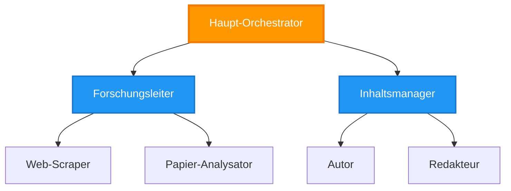
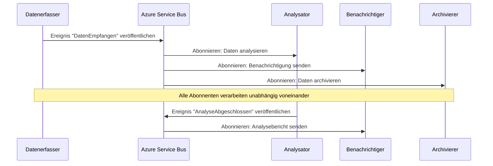
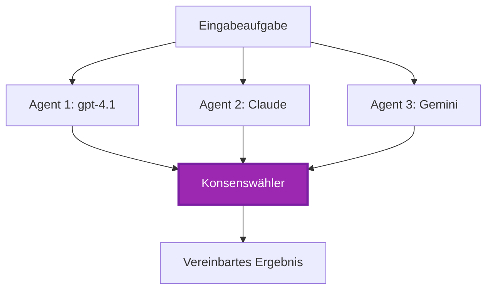
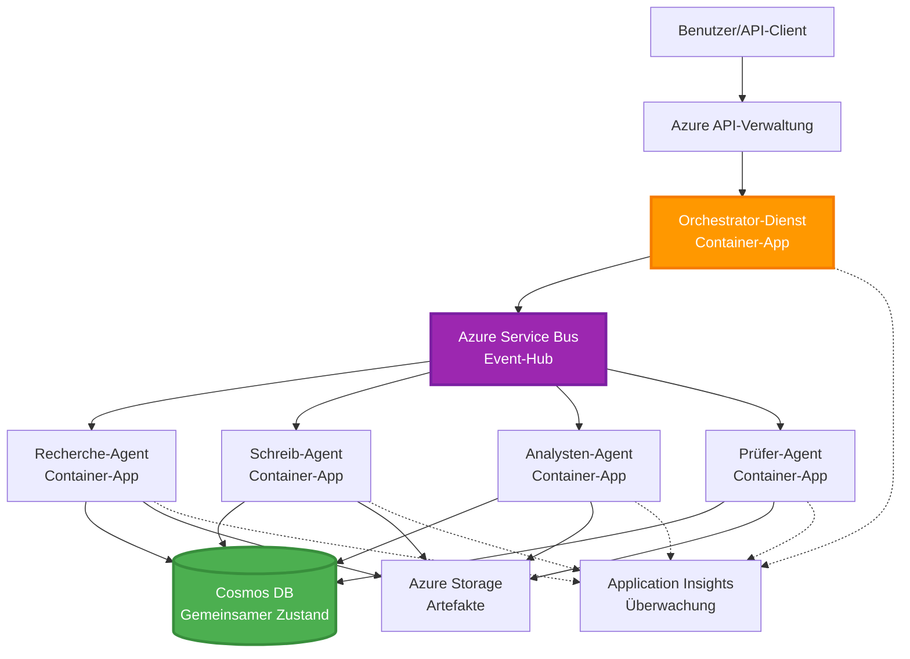

# Multi-Agent-Koordinationsmuster

⏱️ **Geschätzte Zeit**: 60-75 Minuten | 💰 **Geschätzte Kosten**: ~$100-300/Monat | ⭐ **Komplexität**: Fortgeschritten

**📚 Lernpfad:**
- ← Vorherige: [Kapazitätsplanung](capacity-planning.md) - Ressourcenplanung und Skalierungsstrategien
- 🎯 **Sie sind hier**: Multi-Agent-Koordinationsmuster (Orchestrierung, Kommunikation, Zustandsverwaltung)
- → Nächste: [SKU Selection](sku-selection.md) - Auswahl der richtigen Azure-Dienste
- 🏠 [Kursübersicht](../../README.md)

---

## Was Sie lernen werden

Durch den Abschluss dieser Lektion werden Sie:
- Verstehen von **Multi-Agenten-Architektur**-Mustern und deren Einsatzszenarien
- Implementieren von **Orchestrierungsmustern** (zentralisiert, dezentralisiert, hierarchisch)
- Entwerfen von **Agentenkommunikations**strategien (synchron, asynchron, ereignisgesteuert)
- Verwalten von **gemeinsamem Zustand** über verteilte Agenten hinweg
- Bereitstellen von **Multi-Agenten-Systemen** auf Azure mit AZD
- Anwenden von **Koordinationsmustern** für reale KI-Szenarien
- Überwachen und Debuggen verteilter Agentensysteme

## Warum Multi-Agent-Koordination wichtig ist

### Die Entwicklung: Vom Einzelagenten zum Multi-Agenten

**Einzelagent (Einfach):**
```
User → Agent → Response
```
- ✅ Einfach zu verstehen und zu implementieren
- ✅ Schnell für einfache Aufgaben
- ❌ Begrenzte Fähigkeiten des einzelnen Modells
- ❌ Kann komplexe Aufgaben nicht parallelisieren
- ❌ Keine Spezialisierung

**Multi-Agent-System (Fortgeschritten):**
```mermaid
graph TD
    Orchestrator[Orchestrator] --> Agent1[Agent1<br/>Planen]
    Orchestrator --> Agent2[Agent2<br/>Programmieren]
    Orchestrator --> Agent3[Agent3<br/>Überprüfen]
```- ✅ Spezialisierte Agenten für spezifische Aufgaben
- ✅ Parallele Ausführung für Geschwindigkeit
- ✅ Modular und wartbar
- ✅ Besser für komplexe Workflows
- ⚠️ Erfordert Koordinationslogik

**Analogie**: Ein Einzelagent ist wie eine Person, die alle Aufgaben erledigt. Ein Multi-Agent-System ist wie ein Team, in dem jedes Mitglied spezialisierte Fähigkeiten hat (Forscher, Entwickler, Prüfer, Schreiber) und zusammenarbeitet.

---

## Kern-Koordinationsmuster

### Muster 1: Sequentielle Koordination (Verantwortungskette)

**Wann verwenden**: Aufgaben müssen in einer bestimmten Reihenfolge abgeschlossen werden, jeder Agent baut auf der Ausgabe des vorherigen auf.

```mermaid
sequenceDiagram
    participant User
    participant Orchestrator
    participant Agent1 as Recherche-Agent
    participant Agent2 as Schreib-Agent
    participant Agent3 as Redakteur-Agent
    
    User->>Orchestrator: "Schreibe einen Artikel über KI"
    Orchestrator->>Agent1: Thema recherchieren
    Agent1-->>Orchestrator: Rechercheergebnisse
    Orchestrator->>Agent2: Entwurf schreiben (mit Recherche)
    Agent2-->>Orchestrator: Artikelentwurf
    Orchestrator->>Agent3: Überarbeiten und verbessern
    Agent3-->>Orchestrator: Endgültiger Artikel
    Orchestrator-->>User: Ausgefeilter Artikel
    
    Note over User,Agent3: Sequenziell: Jeder Schritt wartet auf den vorherigen
```}
**Vorteile:**
- ✅ Klarer Datenfluss
- ✅ Einfach zu debuggen
- ✅ Vorhersehbare Ausführungsreihenfolge

**Einschränkungen:**
- ❌ Langsamer (keine Parallelität)
- ❌ Ein Fehler blockiert die gesamte Kette
- ❌ Kann keine voneinander abhängigen Aufgaben verarbeiten

**Beispielanwendungsfälle:**
- Content-Erstellungs-Pipeline (Recherche → Schreiben → Überarbeiten → Veröffentlichen)
- Code-Generierung (Planen → Implementieren → Testen → Bereitstellen)
- Berichtserstellung (Datenerfassung → Analyse → Visualisierung → Zusammenfassung)

---

### Muster 2: Parallele Koordination (Fan-Out/Fan-In)

**Wann verwenden**: Unabhängige Aufgaben können gleichzeitig ausgeführt werden, Ergebnisse werden am Ende zusammengeführt.

```mermaid
graph TB
    User[Benutzeranfrage]
    Orchestrator[Koordinator]
    Agent1[Analyse-Agent]
    Agent2[Recherche-Agent]
    Agent3[Daten-Agent]
    Aggregator[Ergebnis-Aggregator]
    Response[Kombinierte Antwort]
    
    User --> Orchestrator
    Orchestrator --> Agent1
    Orchestrator --> Agent2
    Orchestrator --> Agent3
    Agent1 --> Aggregator
    Agent2 --> Aggregator
    Agent3 --> Aggregator
    Aggregator --> Response
    
    style Orchestrator fill:#2196F3,stroke:#1976D2,stroke-width:3px,color:#fff
    style Aggregator fill:#4CAF50,stroke:#388E3C,stroke-width:3px,color:#fff
```
**Vorteile:**
- ✅ Schnell (parallele Ausführung)
- ✅ Fehlertolerant (teilweise Ergebnisse akzeptabel)
- ✅ Skalierbar horizontal

**Einschränkungen:**
- ⚠️ Ergebnisse können außerhalb der Reihenfolge eintreffen
- ⚠️ Aggregationslogik erforderlich
- ⚠️ Komplexe Zustandsverwaltung

**Beispielanwendungsfälle:**
- Mehrquellen-Datensammlung (APIs + Datenbanken + Web-Scraping)
- Wettbewerbsanalyse (mehrere Modelle erzeugen Lösungen, beste wird ausgewählt)
- Übersetzungsdienste (gleichzeitige Übersetzung in mehrere Sprachen)

---

### Muster 3: Hierarchische Koordination (Manager-Worker)

**Wann verwenden**: Komplexe Workflows mit Unteraufgaben, Delegation erforderlich.


**Vorteile:**
- ✅ Handhabt komplexe Workflows
- ✅ Modular und wartbar
- ✅ Klare Verantwortungsgrenzen

**Einschränkungen:**
- ⚠️ Komplexere Architektur
- ⚠️ Höhere Latenz (mehrere Koordinationsschichten)
- ⚠️ Erfordert ausgefeilte Orchestrierung

**Beispielanwendungsfälle:**
- Unternehmensdokumentenverarbeitung (klassifizieren → weiterleiten → verarbeiten → archivieren)
- Mehrstufige Datenpipelines (ingest → bereinigen → transformieren → analysieren → berichten)
- Komplexe Automatisierungs-Workflows (Planung → Ressourcenzuweisung → Ausführung → Überwachung)

---

### Muster 4: Ereignisgesteuerte Koordination (Publish-Subscribe)

**Wann verwenden**: Agenten müssen auf Ereignisse reagieren, lose Kopplung erwünscht.


**Vorteile:**
- ✅ Lose Kopplung zwischen Agenten
- ✅ Einfach neue Agenten hinzuzufügen (einfach abonnieren)
- ✅ Asynchrone Verarbeitung
- ✅ Resilient (Nachrichtenpersistenz)

**Einschränkungen:**
- ⚠️ Eventual Consistency
- ⚠️ Schwieriger zu debuggen
- ⚠️ Herausforderungen bei Nachrichtenreihenfolge

**Beispielanwendungsfälle:**
- Echtzeit-Überwachungssysteme (Alarme, Dashboards, Logs)
- Multikanal-Benachrichtigungen (E-Mail, SMS, Push, Slack)
- Datenverarbeitungspipelines (mehrere Konsumenten derselben Daten)

---

### Muster 5: Konsensbasierte Koordination (Voting/Quorum)

**Wann verwenden**: Zustimmung mehrerer Agenten erforderlich, bevor fortgefahren wird.


**Vorteile:**
- ✅ Höhere Genauigkeit (mehrere Meinungen)
- ✅ Fehlertolerant (Minderheitsausfälle akzeptabel)
- ✅ Eingebaute Qualitätssicherung

**Einschränkungen:**
- ❌ Teuer (mehrere Modellaufrufe)
- ❌ Langsamer (Warten auf mehrere Agenten)
- ⚠️ Konfliktauflösung erforderlich

**Beispielanwendungsfälle:**
- Inhaltsmoderation (mehrere Modelle prüfen Inhalte)
- Code-Review (mehrere Linter/Analysetools)
- Medizinische Diagnostik (mehrere KI-Modelle, Expertenvalidierung)

---

## Architekturübersicht

### Komplettes Multi-Agent-System auf Azure


**Wichtige Komponenten:**

| Komponente | Zweck | Azure-Dienst |
|-----------|---------|---------------|
| **API-Gateway** | Einstiegspunkt, Rate-Limiting, Authentifizierung | API Management |
| **Orchestrator** | Koordiniert Agenten-Workflows | Container Apps |
| **Nachrichtenwarteschlange** | Asynchrone Kommunikation | Service Bus / Event Hubs |
| **Agenten** | Spezialisierte KI-Arbeiter | Container Apps / Functions |
| **Zustandsspeicher** | Gemeinsamer Zustand, Aufgabenverfolgung | Cosmos DB |
| **Artefaktspeicher** | Dokumente, Ergebnisse, Logs | Blob Storage |
| **Überwachung** | Verteiltes Tracing, Logs | Application Insights |

---

## Voraussetzungen

### Erforderliche Werkzeuge

```bash
# Azure Developer CLI überprüfen
azd version
# ✅ Erwartet: azd-Version 1.0.0 oder höher

# Azure CLI überprüfen
az --version
# ✅ Erwartet: azure-cli-Version 2.50.0 oder höher

# Docker überprüfen (für lokale Tests)
docker --version
# ✅ Erwartet: Docker-Version 20.10 oder höher
```

### Azure-Anforderungen

- Aktives Azure-Abonnement
- Berechtigungen zum Erstellen von:
  - Container Apps
  - Service Bus namespaces
  - Cosmos DB accounts
  - Storage accounts
  - Application Insights

### Vorkenntnisse

Sie sollten abgeschlossen haben:
- [Konfigurationsmanagement](../chapter-03-configuration/configuration.md)
- [Authentifizierung & Sicherheit](../chapter-03-configuration/authsecurity.md)
- [Microservices-Beispiel](../../../../examples/microservices)

---

## Implementierungsleitfaden

### Projektstruktur

```
multi-agent-system/
├── azure.yaml                    # AZD configuration
├── infra/
│   ├── main.bicep               # Main infrastructure
│   ├── core/
│   │   ├── servicebus.bicep     # Message queue
│   │   ├── cosmos.bicep         # State store
│   │   ├── storage.bicep        # Artifact storage
│   │   └── monitoring.bicep     # Application Insights
│   └── app/
│       ├── orchestrator.bicep   # Orchestrator service
│       └── agent.bicep          # Agent template
└── src/
    ├── orchestrator/            # Orchestration logic
    │   ├── app.py
    │   ├── workflows.py
    │   └── Dockerfile
    ├── agents/
    │   ├── research/            # Research agent
    │   ├── writer/              # Writer agent
    │   ├── analyst/             # Analyst agent
    │   └── reviewer/            # Reviewer agent
    └── shared/
        ├── state_manager.py     # Shared state logic
        └── message_handler.py   # Message handling
```

---

## Lektion 1: Sequentielles Koordinationsmuster

### Implementierung: Inhaltserstellungs-Pipeline

Lassen Sie uns eine sequentielle Pipeline bauen: Recherche → Schreiben → Überarbeiten → Veröffentlichen

### 1. AZD-Konfiguration

**Datei: `azure.yaml`**

```yaml
name: content-pipeline
metadata:
  template: multi-agent-sequential@1.0.0

services:
  orchestrator:
    project: ./src/orchestrator
    language: python
    host: containerapp
  
  research-agent:
    project: ./src/agents/research
    language: python
    host: containerapp
  
  writer-agent:
    project: ./src/agents/writer
    language: python
    host: containerapp
  
  editor-agent:
    project: ./src/agents/editor
    language: python
    host: containerapp
```

### 2. Infrastruktur: Service Bus zur Koordination

**Datei: `infra/core/servicebus.bicep`**

```bicep
param name string
param location string
param tags object = {}

resource serviceBusNamespace 'Microsoft.ServiceBus/namespaces@2022-10-01-preview' = {
  name: name
  location: location
  tags: tags
  sku: {
    name: 'Standard'
    tier: 'Standard'
  }
  properties: {
    minimumTlsVersion: '1.2'
  }
}

// Queue for orchestrator → research agent
resource researchQueue 'Microsoft.ServiceBus/namespaces/queues@2022-10-01-preview' = {
  parent: serviceBusNamespace
  name: 'research-tasks'
  properties: {
    maxDeliveryCount: 3
    lockDuration: 'PT5M'
    deadLetteringOnMessageExpiration: true
  }
}

// Queue for research agent → writer agent
resource writerQueue 'Microsoft.ServiceBus/namespaces/queues@2022-10-01-preview' = {
  parent: serviceBusNamespace
  name: 'writer-tasks'
  properties: {
    maxDeliveryCount: 3
    lockDuration: 'PT5M'
  }
}

// Queue for writer agent → editor agent
resource editorQueue 'Microsoft.ServiceBus/namespaces/queues@2022-10-01-preview' = {
  parent: serviceBusNamespace
  name: 'editor-tasks'
  properties: {
    maxDeliveryCount: 3
    lockDuration: 'PT5M'
  }
}

output namespace string = serviceBusNamespace.name
output connectionString string = listKeys('${serviceBusNamespace.id}/AuthorizationRules/RootManageSharedAccessKey', serviceBusNamespace.apiVersion).primaryConnectionString
```

### 3. Shared State Manager

**Datei: `src/shared/state_manager.py`**

```python
from azure.cosmos import CosmosClient, PartitionKey
from datetime import datetime
import os

class StateManager:
    """Manages shared state across agents using Cosmos DB"""
    
    def __init__(self):
        endpoint = os.environ['COSMOS_ENDPOINT']
        key = os.environ['COSMOS_KEY']
        
        self.client = CosmosClient(endpoint, key)
        self.database = self.client.get_database_client('agent-state')
        self.container = self.database.get_container_client('tasks')
    
    def create_task(self, task_id: str, task_type: str, input_data: dict):
        """Create a new task"""
        task = {
            'id': task_id,
            'type': task_type,
            'status': 'pending',
            'input': input_data,
            'created_at': datetime.utcnow().isoformat(),
            'steps': []
        }
        self.container.create_item(task)
        return task
    
    def update_task_step(self, task_id: str, step_name: str, result: dict):
        """Update task with completed step"""
        task = self.container.read_item(task_id, partition_key=task_id)
        
        task['steps'].append({
            'name': step_name,
            'completed_at': datetime.utcnow().isoformat(),
            'result': result
        })
        
        self.container.replace_item(task_id, task)
        return task
    
    def complete_task(self, task_id: str, final_result: dict):
        """Mark task as complete"""
        task = self.container.read_item(task_id, partition_key=task_id)
        task['status'] = 'completed'
        task['result'] = final_result
        task['completed_at'] = datetime.utcnow().isoformat()
        self.container.replace_item(task_id, task)
        return task
    
    def get_task(self, task_id: str):
        """Retrieve task state"""
        return self.container.read_item(task_id, partition_key=task_id)
```

### 4. Orchestrator-Service

**Datei: `src/orchestrator/app.py`**

```python
from flask import Flask, request, jsonify
from azure.servicebus import ServiceBusClient, ServiceBusMessage
import json
import uuid
import os
from shared.state_manager import StateManager

app = Flask(__name__)
state_manager = StateManager()

# Service-Bus-Verbindung
servicebus_connection_str = os.environ['SERVICEBUS_CONNECTION_STRING']
servicebus_client = ServiceBusClient.from_connection_string(servicebus_connection_str)

@app.route('/health', methods=['GET'])
def health():
    return jsonify({'status': 'healthy', 'service': 'orchestrator'})

@app.route('/create-content', methods=['POST'])
def create_content():
    """
    Sequential workflow: Research → Write → Edit → Publish
    """
    data = request.json
    topic = data.get('topic')
    
    if not topic:
        return jsonify({'error': 'Topic required'}), 400
    
    # Aufgabe im Zustandspeicher erstellen
    task_id = str(uuid.uuid4())
    task = state_manager.create_task(
        task_id=task_id,
        task_type='content_creation',
        input_data={'topic': topic}
    )
    
    # Nachricht an den Forschungsagenten senden (erster Schritt)
    sender = servicebus_client.get_queue_sender('research-tasks')
    message = ServiceBusMessage(
        body=json.dumps({
            'task_id': task_id,
            'topic': topic,
            'next_queue': 'writer-tasks'  # Wohin die Ergebnisse gesendet werden sollen
        }),
        content_type='application/json'
    )
    
    with sender:
        sender.send_messages(message)
    
    return jsonify({
        'task_id': task_id,
        'status': 'started',
        'workflow': 'sequential',
        'steps': ['research', 'write', 'edit', 'publish'],
        'message': 'Content creation pipeline initiated'
    }), 202

@app.route('/task/<task_id>', methods=['GET'])
def get_task_status(task_id):
    """Check task status"""
    try:
        task = state_manager.get_task(task_id)
        return jsonify(task)
    except Exception as e:
        return jsonify({'error': str(e)}), 404

if __name__ == '__main__':
    app.run(host='0.0.0.0', port=8080)
```

### 5. Research-Agent

**Datei: `src/agents/research/app.py`**

```python
from azure.servicebus import ServiceBusClient, ServiceBusMessage
from openai import AzureOpenAI
import json
import os
import time
from shared.state_manager import StateManager

# Clients initialisieren
state_manager = StateManager()
servicebus_client = ServiceBusClient.from_connection_string(
    os.environ['SERVICEBUS_CONNECTION_STRING']
)

openai_client = AzureOpenAI(
    api_key=os.environ['AZURE_OPENAI_API_KEY'],
    api_version="2024-02-01",
    azure_endpoint=os.environ['AZURE_OPENAI_ENDPOINT']
)

def process_research_task(message_data):
    """Process research request and pass to writer"""
    task_id = message_data['task_id']
    topic = message_data['topic']
    next_queue = message_data['next_queue']
    
    print(f"🔬 Researching: {topic}")
    
    # Microsoft Foundry-Modelle für Forschung aufrufen
    response = openai_client.chat.completions.create(
        model="gpt-4.1",
        messages=[
            {"role": "system", "content": "You are a research assistant. Provide comprehensive research on the given topic."},
            {"role": "user", "content": f"Research this topic thoroughly: {topic}"}
        ],
        max_tokens=1500
    )
    
    research_results = response.choices[0].message.content
    
    # Status aktualisieren
    state_manager.update_task_step(
        task_id=task_id,
        step_name='research',
        result={'research': research_results}
    )
    
    # An den nächsten Agenten (Schreiber) senden
    sender = servicebus_client.get_queue_sender(next_queue)
    message = ServiceBusMessage(
        body=json.dumps({
            'task_id': task_id,
            'topic': topic,
            'research': research_results,
            'next_queue': 'editor-tasks'
        }),
        content_type='application/json'
    )
    
    with sender:
        sender.send_messages(message)
    
    print(f"✅ Research complete for task {task_id}")

def main():
    """Listen to research queue"""
    receiver = servicebus_client.get_queue_receiver('research-tasks')
    
    print("🔬 Research Agent started, listening for tasks...")
    
    with receiver:
        while True:
            messages = receiver.receive_messages(max_wait_time=5)
            for message in messages:
                try:
                    message_data = json.loads(str(message))
                    process_research_task(message_data)
                    receiver.complete_message(message)
                except Exception as e:
                    print(f"❌ Error processing message: {e}")
                    receiver.abandon_message(message)

if __name__ == '__main__':
    main()
```

### 6. Writer-Agent

**Datei: `src/agents/writer/app.py`**

```python
from azure.servicebus import ServiceBusClient, ServiceBusMessage
from openai import AzureOpenAI
import json
import os
from shared.state_manager import StateManager

state_manager = StateManager()
servicebus_client = ServiceBusClient.from_connection_string(
    os.environ['SERVICEBUS_CONNECTION_STRING']
)

openai_client = AzureOpenAI(
    api_key=os.environ['AZURE_OPENAI_API_KEY'],
    api_version="2024-02-01",
    azure_endpoint=os.environ['AZURE_OPENAI_ENDPOINT']
)

def process_writing_task(message_data):
    """Write article based on research"""
    task_id = message_data['task_id']
    topic = message_data['topic']
    research = message_data['research']
    next_queue = message_data['next_queue']
    
    print(f"✍️ Writing article: {topic}")
    
    # Rufe Microsoft Foundry Models auf, um einen Artikel zu schreiben
    response = openai_client.chat.completions.create(
        model="gpt-4.1",
        messages=[
            {"role": "system", "content": "You are a professional writer. Write engaging, well-structured articles."},
            {"role": "user", "content": f"Based on this research:\n\n{research}\n\nWrite a comprehensive article about: {topic}"}
        ],
        max_tokens=2000
    )
    
    article_draft = response.choices[0].message.content
    
    # Zustand aktualisieren
    state_manager.update_task_step(
        task_id=task_id,
        step_name='writing',
        result={'draft': article_draft}
    )
    
    # An den Redakteur senden
    sender = servicebus_client.get_queue_sender(next_queue)
    message = ServiceBusMessage(
        body=json.dumps({
            'task_id': task_id,
            'topic': topic,
            'draft': article_draft
        }),
        content_type='application/json'
    )
    
    with sender:
        sender.send_messages(message)
    
    print(f"✅ Article draft complete for task {task_id}")

def main():
    """Listen to writer queue"""
    receiver = servicebus_client.get_queue_receiver('writer-tasks')
    
    print("✍️ Writer Agent started, listening for tasks...")
    
    with receiver:
        while True:
            messages = receiver.receive_messages(max_wait_time=5)
            for message in messages:
                try:
                    message_data = json.loads(str(message))
                    process_writing_task(message_data)
                    receiver.complete_message(message)
                except Exception as e:
                    print(f"❌ Error: {e}")
                    receiver.abandon_message(message)

if __name__ == '__main__':
    main()
```

### 7. Editor-Agent

**Datei: `src/agents/editor/app.py`**

```python
from azure.servicebus import ServiceBusClient
from openai import AzureOpenAI
import json
import os
from shared.state_manager import StateManager

state_manager = StateManager()
servicebus_client = ServiceBusClient.from_connection_string(
    os.environ['SERVICEBUS_CONNECTION_STRING']
)

openai_client = AzureOpenAI(
    api_key=os.environ['AZURE_OPENAI_API_KEY'],
    api_version="2024-02-01",
    azure_endpoint=os.environ['AZURE_OPENAI_ENDPOINT']
)

def process_editing_task(message_data):
    """Edit and finalize article"""
    task_id = message_data['task_id']
    topic = message_data['topic']
    draft = message_data['draft']
    
    print(f"📝 Editing article: {topic}")
    
    # Microsoft Foundry Models zum Bearbeiten aufrufen
    response = openai_client.chat.completions.create(
        model="gpt-4.1",
        messages=[
            {"role": "system", "content": "You are an expert editor. Improve grammar, clarity, and structure."},
            {"role": "user", "content": f"Edit and improve this article:\n\n{draft}"}
        ],
        max_tokens=2000
    )
    
    final_article = response.choices[0].message.content
    
    # Aufgabe als erledigt markieren
    state_manager.complete_task(
        task_id=task_id,
        final_result={
            'topic': topic,
            'final_article': final_article,
            'word_count': len(final_article.split())
        }
    )
    
    print(f"✅ Article finalized for task {task_id}")

def main():
    """Listen to editor queue"""
    receiver = servicebus_client.get_queue_receiver('editor-tasks')
    
    print("📝 Editor Agent started, listening for tasks...")
    
    with receiver:
        while True:
            messages = receiver.receive_messages(max_wait_time=5)
            for message in messages:
                try:
                    message_data = json.loads(str(message))
                    process_editing_task(message_data)
                    receiver.complete_message(message)
                except Exception as e:
                    print(f"❌ Error: {e}")
                    receiver.abandon_message(message)

if __name__ == '__main__':
    main()
```

### 8. Bereitstellen und Testen

```bash
# Option A: Vorlagenbasierte Bereitstellung
azd init
azd up

# Option B: Agentenmanifest-Bereitstellung (erfordert eine Erweiterung)
azd extension install azure.ai.agents
azd ai agent init -m agent-manifest.yaml
azd up
```

> Siehe [AZD AI CLI-Befehle](../chapter-08-production/production-ai-practices.md#azd-ai-cli-commands-and-extensions) für alle `azd ai` Flags und Optionen.

```bash
# Orchestrator-URL abrufen
ORCHESTRATOR_URL=$(azd env get-values | grep ORCHESTRATOR_URL | cut -d '=' -f2 | tr -d '"')

# Inhalt erstellen
curl -X POST $ORCHESTRATOR_URL/create-content \
  -H "Content-Type: application/json" \
  -d '{"topic": "The Future of AI in Healthcare"}'
```

**✅ Erwartete Ausgabe:**
```json
{
  "task_id": "a1b2c3d4-e5f6-7890-abcd-ef1234567890",
  "status": "started",
  "workflow": "sequential",
  "steps": ["research", "write", "edit", "publish"],
  "message": "Content creation pipeline initiated"
}
```

**Aufgabenfortschritt prüfen:**
```bash
TASK_ID="a1b2c3d4-e5f6-7890-abcd-ef1234567890"
curl $ORCHESTRATOR_URL/task/$TASK_ID
```

**✅ Erwartete Ausgabe (abgeschlossen):**
```json
{
  "id": "a1b2c3d4-e5f6-7890-abcd-ef1234567890",
  "type": "content_creation",
  "status": "completed",
  "steps": [
    {
      "name": "research",
      "completed_at": "2025-11-19T10:30:00Z",
      "result": {"research": "..."}
    },
    {
      "name": "writing",
      "completed_at": "2025-11-19T10:32:00Z",
      "result": {"draft": "..."}
    }
  ],
  "result": {
    "topic": "The Future of AI in Healthcare",
    "final_article": "...",
    "word_count": 1500
  }
}
```

---

## Lektion 2: Paralleles Koordinationsmuster

### Implementierung: Multi-Quellen-Recherche-Aggregator

Lassen Sie uns ein paralleles System erstellen, das Informationen gleichzeitig aus mehreren Quellen sammelt.

### Paralleler Orchestrator

**Datei: `src/orchestrator/parallel_workflow.py`**

```python
from flask import Flask, request, jsonify
from azure.servicebus import ServiceBusClient, ServiceBusMessage
import json
import uuid
import os
from shared.state_manager import StateManager

app = Flask(__name__)
state_manager = StateManager()

servicebus_client = ServiceBusClient.from_connection_string(
    os.environ['SERVICEBUS_CONNECTION_STRING']
)

@app.route('/research-parallel', methods=['POST'])
def research_parallel():
    """
    Parallel workflow: Multiple agents work simultaneously
    """
    data = request.json
    query = data.get('query')
    
    task_id = str(uuid.uuid4())
    task = state_manager.create_task(
        task_id=task_id,
        task_type='parallel_research',
        input_data={
            'query': query,
            'agents': ['web', 'academic', 'news', 'social']
        }
    )
    
    # Fan-out: Gleichzeitig an alle Agenten senden
    agents = [
        ('web-research-queue', 'web'),
        ('academic-research-queue', 'academic'),
        ('news-research-queue', 'news'),
        ('social-research-queue', 'social')
    ]
    
    for queue_name, agent_type in agents:
        sender = servicebus_client.get_queue_sender(queue_name)
        message = ServiceBusMessage(
            body=json.dumps({
                'task_id': task_id,
                'query': query,
                'agent_type': agent_type,
                'result_queue': 'aggregation-queue'
            }),
            content_type='application/json'
        )
        
        with sender:
            sender.send_messages(message)
    
    return jsonify({
        'task_id': task_id,
        'status': 'started',
        'workflow': 'parallel',
        'agents_dispatched': 4,
        'message': 'Parallel research initiated'
    }), 202

if __name__ == '__main__':
    app.run(host='0.0.0.0', port=8080)
```

### Aggregationslogik

**Datei: `src/agents/aggregator/app.py`**

```python
from azure.servicebus import ServiceBusClient
import json
import os
from collections import defaultdict
from shared.state_manager import StateManager

state_manager = StateManager()
servicebus_client = ServiceBusClient.from_connection_string(
    os.environ['SERVICEBUS_CONNECTION_STRING']
)

# Ergebnisse pro Aufgabe verfolgen
task_results = defaultdict(list)
expected_agents = 4  # Web, akademisch, Nachrichten, sozial

def process_result(message_data):
    """Aggregate results from parallel agents"""
    task_id = message_data['task_id']
    agent_type = message_data['agent_type']
    result = message_data['result']
    
    # Ergebnis speichern
    task_results[task_id].append({
        'agent': agent_type,
        'data': result
    })
    
    print(f"📊 Received result from {agent_type} agent ({len(task_results[task_id])}/{expected_agents})")
    
    # Prüfen, ob alle Agenten abgeschlossen sind (Fan-in)
    if len(task_results[task_id]) == expected_agents:
        print(f"✅ All agents completed for task {task_id}. Aggregating...")
        
        # Ergebnisse zusammenführen
        aggregated = {
            'query': message_data['query'],
            'sources': task_results[task_id],
            'summary': generate_summary(task_results[task_id])
        }
        
        # Als abgeschlossen markieren
        state_manager.complete_task(task_id, aggregated)
        
        # Aufräumen
        del task_results[task_id]
        
        print(f"✅ Aggregation complete for task {task_id}")

def generate_summary(results):
    """Generate summary from all sources"""
    summaries = [r['data'].get('summary', '') for r in results]
    return '\n\n'.join(summaries)

def main():
    """Listen to aggregation queue"""
    receiver = servicebus_client.get_queue_receiver('aggregation-queue')
    
    print("📊 Aggregator started, listening for results...")
    
    with receiver:
        while True:
            messages = receiver.receive_messages(max_wait_time=5)
            for message in messages:
                try:
                    message_data = json.loads(str(message))
                    process_result(message_data)
                    receiver.complete_message(message)
                except Exception as e:
                    print(f"❌ Error: {e}")
                    receiver.abandon_message(message)

if __name__ == '__main__':
    main()
```

**Vorteile des parallelen Musters:**
- ⚡ **4x schneller** (Agenten laufen gleichzeitig)
- 🔄 **Fehlertolerant** (teilweise Ergebnisse akzeptabel)
- 📈 **Skalierbar** (einfach zusätzliche Agenten hinzufügen)

---

## Praktische Übungen

### Übung 1: Timeout-Behandlung hinzufügen ⭐⭐ (Mittel)

**Ziel**: Implementieren Sie Timeout-Logik, damit der Aggregator nicht ewig auf langsame Agenten wartet.

**Schritte**:

1. **Timeout-Tracking zum Aggregator hinzufügen:**

```python
from datetime import datetime, timedelta

task_timeouts = {}  # task_id -> expiration_time

def process_result(message_data):
    task_id = message_data['task_id']
    
    # Timeout für das erste Ergebnis setzen
    if task_id not in task_timeouts:
        task_timeouts[task_id] = datetime.utcnow() + timedelta(seconds=30)
    
    task_results[task_id].append({
        'agent': message_data['agent_type'],
        'data': message_data['result']
    })
    
    # Überprüfen, ob abgeschlossen oder abgelaufen
    if len(task_results[task_id]) == expected_agents or \
       datetime.utcnow() > task_timeouts[task_id]:
        
        print(f"📊 Aggregating with {len(task_results[task_id])}/{expected_agents} results")
        
        aggregated = {
            'query': message_data['query'],
            'sources': task_results[task_id],
            'completed_agents': len(task_results[task_id]),
            'timed_out': len(task_results[task_id]) < expected_agents
        }
        
        state_manager.complete_task(task_id, aggregated)
        
        # Aufräumen
        del task_results[task_id]
        del task_timeouts[task_id]
```

2. **Mit künstlichen Verzögerungen testen:**

```python
# Bei einem Agenten eine Verzögerung hinzufügen, um langsame Verarbeitung zu simulieren
import time
time.sleep(35)  # Überschreitet das 30-Sekunden-Zeitlimit
```

3. **Bereitstellen und überprüfen:**

```bash
azd deploy aggregator

# Aufgabe einreichen
curl -X POST $ORCHESTRATOR_URL/research-parallel \
  -H "Content-Type: application/json" \
  -d '{"query": "AI safety research"}'

# Ergebnisse nach 30 Sekunden prüfen
curl $ORCHESTRATOR_URL/task/$TASK_ID
```

**✅ Erfolgskriterien:**
- ✅ Aufgabe wird nach 30 Sekunden abgeschlossen, selbst wenn Agenten unvollständig sind
- ✅ Antwort gibt partielle Ergebnisse an (`"timed_out": true`)
- ✅ Verfügbare Ergebnisse werden zurückgegeben (3 von 4 Agenten)

**Zeit**: 20-25 Minuten

---

### Übung 2: Retry-Logik implementieren ⭐⭐⭐ (Fortgeschritten)

**Ziel**: Fehlerhafte Agentenaufgaben automatisch erneut versuchen, bevor aufgegeben wird.

**Schritte**:

1. **Retry-Tracking zum Orchestrator hinzufügen:**

```python
from dataclasses import dataclass
from typing import Dict

@dataclass
class RetryConfig:
    max_retries: int = 3
    backoff_seconds: int = 5

retry_counts: Dict[str, int] = {}  # Nachrichten-ID -> Anzahl der Wiederholungsversuche

def send_with_retry(queue_name: str, message_data: dict, retry_config: RetryConfig):
    """Send message with retry metadata"""
    message_id = message_data.get('message_id', str(uuid.uuid4()))
    message_data['message_id'] = message_id
    message_data['retry_count'] = retry_counts.get(message_id, 0)
    message_data['max_retries'] = retry_config.max_retries
    
    sender = servicebus_client.get_queue_sender(queue_name)
    message = ServiceBusMessage(
        body=json.dumps(message_data),
        content_type='application/json',
        message_id=message_id
    )
    
    with sender:
        sender.send_messages(message)
```

2. **Retry-Handler zu den Agenten hinzufügen:**

```python
def process_with_retry(message, receiver, process_func):
    """Process message with automatic retry on failure"""
    try:
        message_data = json.loads(str(message))
        
        # Nachricht verarbeiten
        process_func(message_data)
        
        # Erfolg - abgeschlossen
        receiver.complete_message(message)
        
    except Exception as e:
        message_id = message.message_id
        retry_count = message_data.get('retry_count', 0)
        max_retries = message_data.get('max_retries', 3)
        
        if retry_count < max_retries:
            # Wiederholen: aufgeben und mit erhöhtem Zähler erneut in die Warteschlange einreihen
            print(f"⚠️ Retry {retry_count + 1}/{max_retries} for message {message_id}")
            
            message_data['retry_count'] = retry_count + 1
            
            # Zurück in dieselbe Warteschlange mit Verzögerung senden
            time.sleep(5 * (retry_count + 1))  # Exponentielles Backoff
            send_with_retry(queue_name, message_data, RetryConfig())
            
            receiver.complete_message(message)  # Original entfernen
        else:
            # Maximale Anzahl von Wiederholungen überschritten - in die Dead-Letter-Queue verschieben
            print(f"❌ Max retries exceeded for message {message_id}")
            receiver.dead_letter_message(
                message,
                reason="MaxRetriesExceeded",
                error_description=str(e)
            )
```

3. **Dead-Letter-Queue überwachen:**

```python
def monitor_dead_letters():
    """Check dead letter queue for failed messages"""
    receiver = servicebus_client.get_queue_receiver(
        'research-queue',
        sub_queue='deadletter'
    )
    
    with receiver:
        messages = receiver.receive_messages(max_wait_time=5)
        for message in messages:
            print(f"☠️ Dead letter: {message.message_id}")
            print(f"Reason: {message.dead_letter_reason}")
            print(f"Description: {message.dead_letter_error_description}")
```

**✅ Erfolgskriterien:**
- ✅ Fehlgeschlagene Aufgaben werden automatisch erneut versucht (bis zu 3 Mal)
- ✅ Exponentielles Backoff zwischen den Retries (5s, 10s, 15s)
- ✅ Nach maximalen Retries gehen Nachrichten in die Dead-Letter-Queue
- ✅ Die Dead-Letter-Queue kann überwacht und erneut abgespielt werden

**Zeit**: 30-40 Minuten

---

### Übung 3: Circuit Breaker implementieren ⭐⭐⭐ (Fortgeschritten)

**Ziel**: Verhindern Sie kaskadierende Ausfälle, indem Sie Anfragen an ausfallende Agenten stoppen.

**Schritte**:

1. **Circuit-Breaker-Klasse erstellen:**

```python
from enum import Enum
from datetime import datetime, timedelta

class CircuitState(Enum):
    CLOSED = "closed"      # Normalbetrieb
    OPEN = "open"          # Fehlerhaft, Anfragen ablehnen
    HALF_OPEN = "half_open"  # Testen, ob wiederhergestellt wurde

class CircuitBreaker:
    def __init__(self, failure_threshold=5, timeout_seconds=60):
        self.failure_threshold = failure_threshold
        self.timeout_seconds = timeout_seconds
        self.failure_count = 0
        self.last_failure_time = None
        self.state = CircuitState.CLOSED
    
    def call(self, func):
        """Execute function with circuit breaker protection"""
        if self.state == CircuitState.OPEN:
            # Prüfen, ob das Zeitlimit abgelaufen ist
            if datetime.utcnow() - self.last_failure_time > timedelta(seconds=self.timeout_seconds):
                self.state = CircuitState.HALF_OPEN
                print("🔄 Circuit breaker: HALF_OPEN (testing)")
            else:
                raise Exception(f"Circuit breaker OPEN for agent. Try again in {self.timeout_seconds}s")
        
        try:
            result = func()
            
            # Erfolg
            if self.state == CircuitState.HALF_OPEN:
                self.state = CircuitState.CLOSED
                self.failure_count = 0
                print("✅ Circuit breaker: CLOSED (recovered)")
            
            return result
            
        except Exception as e:
            self.failure_count += 1
            self.last_failure_time = datetime.utcnow()
            
            if self.failure_count >= self.failure_threshold:
                self.state = CircuitState.OPEN
                print(f"🔴 Circuit breaker: OPEN (too many failures)")
            
            raise e
```

2. **Auf Agentenaufrufe anwenden:**

```python
# Im Orchestrator
agent_circuits = {
    'web': CircuitBreaker(failure_threshold=5, timeout_seconds=60),
    'academic': CircuitBreaker(failure_threshold=5, timeout_seconds=60),
    'news': CircuitBreaker(failure_threshold=5, timeout_seconds=60),
    'social': CircuitBreaker(failure_threshold=5, timeout_seconds=60)
}

def send_to_agent(agent_type, message_data):
    """Send with circuit breaker protection"""
    circuit = agent_circuits[agent_type]
    
    try:
        circuit.call(lambda: send_message(agent_type, message_data))
    except Exception as e:
        print(f"⚠️ Skipping {agent_type} agent: {e}")
        # Mit anderen Agenten fortfahren
```

3. **Circuit Breaker testen:**

```bash
# Wiederholte Fehler simulieren (einen Agenten stoppen)
az containerapp stop --name web-research-agent --resource-group rg-agents

# Mehrere Anfragen senden
for i in {1..10}; do
  curl -X POST $ORCHESTRATOR_URL/research-parallel \
    -H "Content-Type: application/json" \
    -d '{"query": "test query '$i'"}'
  sleep 2
done

# Logs prüfen - es sollte ersichtlich sein, dass der Circuit nach 5 Fehlern geöffnet wird
# Verwende die Azure CLI für Container-App-Protokolle:
az containerapp logs show --name orchestrator --resource-group $RG_NAME --tail 50
```

**✅ Erfolgskriterien:**
- ✅ Nach 5 Fehlern öffnet sich der Circuit (Anfragen werden abgelehnt)
- ✅ Nach 60 Sekunden geht der Circuit in Half-Open (Test der Wiederherstellung)
- ✅ Andere Agenten arbeiten normal weiter
- ✅ Circuit schließt sich automatisch, wenn der Agent sich erholt

**Zeit**: 40-50 Minuten

---

## Überwachung und Fehlerbehebung

### Verteiltes Tracing mit Application Insights

**Datei: `src/shared/tracing.py`**

```python
from opencensus.ext.azure.log_exporter import AzureLogHandler
from opencensus.ext.azure.trace_exporter import AzureExporter
from opencensus.trace import config_integration
from opencensus.trace.tracer import Tracer
from opencensus.trace.samplers import AlwaysOnSampler
import logging
import os

# Tracing konfigurieren
config_integration.trace_integrations(['requests', 'logging'])

connection_string = os.environ.get('APPLICATIONINSIGHTS_CONNECTION_STRING')

# Tracer erstellen
tracer = Tracer(
    exporter=AzureExporter(connection_string=connection_string),
    sampler=AlwaysOnSampler()
)

# Logging konfigurieren
logger = logging.getLogger(__name__)
logger.addHandler(AzureLogHandler(connection_string=connection_string))
logger.setLevel(logging.INFO)

def trace_agent_call(agent_name, task_id, operation):
    """Trace agent operations"""
    with tracer.span(name=f'{agent_name}.{operation}') as span:
        span.add_attribute('agent', agent_name)
        span.add_attribute('task_id', task_id)
        span.add_attribute('operation', operation)
        
        try:
            result = operation()
            span.add_attribute('status', 'success')
            return result
        except Exception as e:
            span.add_attribute('status', 'error')
            span.add_attribute('error', str(e))
            raise
```

### Application Insights-Abfragen

**Mehragenten-Workflows verfolgen:**

```kusto
// Trace complete workflow for a task
traces
| where customDimensions.task_id == "a1b2c3d4-..."
| project timestamp, message, customDimensions.agent, customDimensions.operation
| order by timestamp asc
```

**Leistungsvergleich der Agenten:**

```kusto
// Compare agent execution times
dependencies
| where name contains "agent"
| summarize 
    avg_duration = avg(duration),
    p95_duration = percentile(duration, 95),
    count = count()
  by agent = tostring(customDimensions.agent)
| order by avg_duration desc
```

**Fehleranalyse:**

```kusto
// Find which agents fail most
exceptions
| where customDimensions.agent != ""
| summarize 
    failure_count = count(),
    unique_errors = dcount(outerMessage)
  by agent = tostring(customDimensions.agent)
| order by failure_count desc
```

---

## Kostenanalyse

### Kosten des Multi-Agent-Systems (monatliche Schätzungen)

| Komponente | Konfiguration | Kosten |
|-----------|--------------|------|
| **Orchestrator** | 1 Container App (1 vCPU, 2GB) | $30-50 |
| **4 Agenten** | 4 Container Apps (0.5 vCPU, 1GB jeweils) | $60-120 |
| **Service Bus** | Standard-Tier, 10M Nachrichten | $10-20 |
| **Cosmos DB** | Serverless, 5GB Speicher, 1M RUs | $25-50 |
| **Blob Storage** | 10GB Speicher, 100K Operationen | $5-10 |
| **Application Insights** | 5GB Ingestion | $10-15 |
| **Microsoft Foundry Models** | gpt-4.1, 10M Tokens | $100-300 |
| **Gesamt** | | **$240-565/Monat** |

### Strategien zur Kostenoptimierung

1. **Verwenden Sie Serverless, wo möglich:**
   ```bicep
   // Cosmos DB serverless (no minimum cost)
   properties: {
     databaseAccountOfferType: 'Standard'
     capabilities: [{ name: 'EnableServerless' }]
   }
   ```

2. **Skalieren Sie Agenten auf Null, wenn sie inaktiv sind:**
   ```bicep
   scale: {
     minReplicas: 0  // Scale to zero when no messages
     maxReplicas: 10
   }
   ```

3. **Verwenden Sie Batching für Service Bus:**
   ```python
   # Nachrichten in Chargen senden (günstiger)
   sender.send_messages([message1, message2, message3])
   ```

4. **Cache häufig verwendete Ergebnisse:**
   ```python
   # Azure Cache for Redis verwenden
   if cache.exists(query_hash):
       return cache.get(query_hash)
   ```

---

## Best Practices

### ✅ TUN SIE:

1. **Verwenden Sie idempotente Operationen**
   ```python
   # Agent kann dieselbe Nachricht mehrmals sicher verarbeiten
   def process_task(task_id):
       if state_manager.task_exists(task_id):
           print(f"Task {task_id} already processed, skipping")
           return
       # Aufgabe wird verarbeitet...
   ```

2. **Implementieren Sie umfassende Protokollierung**
   ```python
   logger.info(f"Agent: {agent_name}, Task: {task_id}, Action: {action}")
   ```

3. **Verwenden Sie Korrelations-IDs**
   ```python
   # task_id durch den gesamten Workflow weiterreichen
   message_data = {
       'task_id': task_id,  # Korrelations-ID
       'timestamp': datetime.utcnow().isoformat()
   }
   ```

4. **Setzen Sie Message-TTL (Time-to-Live)**
   ```bicep
   properties: {
     defaultMessageTimeToLive: 'PT1H'  // 1 hour max
   }
   ```

5. **Überwachen Sie Dead-Letter-Queues**
   ```python
   # Regelmäßige Überwachung fehlgeschlagener Nachrichten
   monitor_dead_letters()
   ```

### ❌ NICHT TUN:

1. **Erstellen Sie keine zirkulären Abhängigkeiten**
   ```python
   # ❌ SCHLECHT: Agent A → Agent B → Agent A (Endlosschleife)
   # ✅ GUT: Definiere einen klaren gerichteten azyklischen Graphen (DAG)
   ```

2. **Blockieren Sie keine Agenten-Threads**
   ```python
   # ❌ SCHLECHT: Synchrones Warten
   while not task_complete:
       time.sleep(1)
   
   # ✅ GUT: Verwende Rückrufe der Nachrichtenwarteschlange
   ```

3. **Ignorieren Sie keine teilweisen Fehler**
   ```python
   # ❌ SCHLECHT: Gesamten Workflow abbrechen, wenn ein Agent fehlschlägt
   # ✅ GUT: Teilergebnisse mit Fehlerindikatoren zurückgeben
   ```

4. **Verwende keine unendlichen Wiederholungen**
   ```python
   # ❌ SCHLECHT: immer wieder versuchen
   # ✅ GUT: max_retries = 3, dann in die Dead-Letter-Warteschlange
   ```

---

## Leitfaden zur Fehlerbehebung

### Problem: Nachrichten bleiben in der Warteschlange hängen

**Symptome:**
- Nachrichten sammeln sich in der Warteschlange an
- Agenten verarbeiten nicht
- Task status stuck at "pending"

**Diagnose:**
```bash
# Warteschlangentiefe prüfen
az servicebus queue show \
  --namespace-name mybus \
  --name research-tasks \
  --query "countDetails"

# Agentenprotokolle mit der Azure CLI prüfen
az containerapp logs show --name research-agent --resource-group $RG_NAME --tail 50
```

**Lösungen:**

1. **Erhöhe die Agent-Replikate:**
   ```bash
   az containerapp update \
     --name research-agent \
     --min-replicas 3 \
     --max-replicas 10
   ```

2. **Überprüfe die Dead-Letter-Warteschlange:**
   ```bash
   az servicebus queue show \
     --namespace-name mybus \
     --name research-tasks \
     --query "countDetails.deadLetterMessageCount"
   ```

---

### Problem: Aufgaben-Timeout / wird nie abgeschlossen

**Symptome:**
- Task status stays "in_progress"
- Einige Agenten schließen ab, andere nicht
- Keine Fehlermeldungen

**Diagnose:**
```bash
# Aufgabenstatus prüfen
curl $ORCHESTRATOR_URL/task/$TASK_ID

# Application Insights überprüfen
# Abfrage ausführen: traces | where customDimensions.task_id == "..."
```

**Lösungen:**

1. **Implementiere einen Timeout im Aggregator (Übung 1)**

2. **Überprüfe Agentenausfälle mit Azure Monitor:**
   ```bash
   # Protokolle mit azd monitor anzeigen
   azd monitor --logs
   
   # Oder verwenden Sie die Azure CLI, um die Protokolle einer bestimmten Container-App anzuzeigen
   az containerapp logs show --name <agent-name> --resource-group $RG_NAME --follow | grep "ERROR\|FAIL"
   ```

3. **Stelle sicher, dass alle Agenten laufen:**
   ```bash
   az containerapp list \
     --resource-group rg-agents \
     --query "[].{name:name, status:properties.runningStatus}"
   ```

---

## Weiterführende Informationen

### Offizielle Dokumentation
- [Azure Service Bus](https://learn.microsoft.com/azure/service-bus-messaging/service-bus-messaging-overview)
- [Cosmos DB](https://learn.microsoft.com/azure/cosmos-db/introduction)
- [Container Apps DAPR](https://learn.microsoft.com/azure/container-apps/dapr-overview)
- [Multi-Agent Design Patterns](https://learn.microsoft.com/azure/architecture/guide/ai/multi-agent-systems)

### Nächste Schritte in diesem Kurs
- ← Vorherige: [Kapazitätsplanung](capacity-planning.md)
- → Nächste: [SKU-Auswahl](sku-selection.md)
- 🏠 [Kursstartseite](../../README.md)

### Verwandte Beispiele
- [Microservices-Beispiel](../../../../examples/microservices) - Service-Kommunikationsmuster
- [Microsoft Foundry Models Beispiel](../../../../examples/azure-openai-chat) - KI-Integration

---

## Zusammenfassung

**Sie haben gelernt:**
- ✅ Fünf Koordinationsmuster (sequenziell, parallel, hierarchisch, ereignisgesteuert, Konsens)
- ✅ Multi-Agenten-Architektur auf Azure (Service Bus, Cosmos DB, Container Apps)
- ✅ Zustandsverwaltung über verteilte Agenten
- ✅ Timeout-Behandlung, Wiederholungen und Circuit Breaker
- ✅ Überwachung und Fehlersuche in verteilten Systemen
- ✅ Strategien zur Kostenoptimierung

**Wesentliche Erkenntnisse:**
1. **Wählen Sie das richtige Muster** - Sequenziell für geordnete Workflows, parallel für Geschwindigkeit, ereignisgesteuert für Flexibilität
2. **Verwalten Sie den Zustand sorgfältig** - Verwenden Sie Cosmos DB oder Ähnliches für gemeinsam genutzten Zustand
3. **Behandeln Sie Ausfälle angemessen** - Timeouts, Wiederholungen, Circuit Breaker, Dead-Letter-Warteschlangen
4. **Überwachen Sie alles** - Verteiltes Tracing ist für die Fehlersuche unerlässlich
5. **Optimieren Sie die Kosten** - Auf null skalieren, Serverless nutzen, Caching implementieren

**Nächste Schritte:**
1. Schließen Sie die praktischen Übungen ab
2. Bauen Sie ein Multi-Agenten-System für Ihren Anwendungsfall
3. Studieren Sie [SKU-Auswahl](sku-selection.md), um Leistung und Kosten zu optimieren

---

<!-- CO-OP TRANSLATOR DISCLAIMER START -->
Haftungsausschluss:
Dieses Dokument wurde mithilfe des KI-Übersetzungsdienstes [Co-op Translator](https://github.com/Azure/co-op-translator) übersetzt. Obwohl wir uns um Genauigkeit bemühen, beachten Sie bitte, dass automatisierte Übersetzungen Fehler oder Ungenauigkeiten enthalten können. Das Originaldokument in seiner ursprünglichen Sprache ist als maßgebliche Quelle zu betrachten. Für kritische Informationen wird eine professionelle menschliche Übersetzung empfohlen. Wir übernehmen keine Haftung für Missverständnisse oder Fehlinterpretationen, die aus der Verwendung dieser Übersetzung entstehen.
<!-- CO-OP TRANSLATOR DISCLAIMER END -->