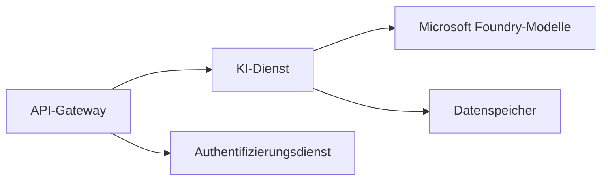
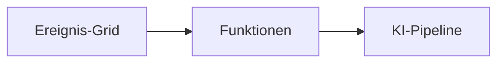

# Kapitel 8: Produktions- & Unternehmensmuster

**📚 Kurs**: [AZD For Beginners](../../README.md) | **⏱️ Dauer**: 2-3 Stunden | **⭐ Komplexität**: Fortgeschritten

---

## Übersicht

Dieses Kapitel behandelt unternehmensgerechte Bereitstellungsmuster, Sicherheits-Härtung, Monitoring und Kostenoptimierung für produktive KI-Workloads.

## Lernziele

Nach Abschluss dieses Kapitels werden Sie:
- Multi-Region-resiliente Anwendungen bereitstellen
- Unternehmenssicherheitsmuster implementieren
- Umfassendes Monitoring konfigurieren
- Kosten in großem Maßstab optimieren
- CI/CD-Pipelines mit AZD einrichten

---

## 📚 Lektionen

| # | Lektion | Beschreibung | Zeit |
|---|--------|-------------|------|
| 1 | [Produktions-KI-Praktiken](production-ai-practices.md) | Unternehmensbereitstellungsmuster | 90 Min. |

---

## 🚀 Produktions-Checkliste

- [ ] Multi-Region-Bereitstellung zur Ausfallsicherheit
- [ ] Verwaltete Identität für Authentifizierung (keine Schlüssel)
- [ ] Application Insights zur Überwachung
- [ ] Kostenbudgets und Warnungen konfiguriert
- [ ] Sicherheits-Scans aktiviert
- [ ] CI/CD-Pipeline-Integration
- [ ] Notfallwiederherstellungsplan

---

## 🏗️ Architektur-Muster

### Muster 1: Microservices-KI


### Muster 2: Ereignisgesteuerte KI


---

## 🔐 Beste Sicherheitspraktiken

```bicep
// Use managed identity
identity: {
  type: 'SystemAssigned'
}

// Private endpoints for AI services
properties: {
  publicNetworkAccess: 'Disabled'
  networkAcls: {
    defaultAction: 'Deny'
  }
}
```

---

## 💰 Kostenoptimierung

| Strategie | Einsparungen |
|----------|---------|
| Auf Null skalieren (Container Apps) | 60-80% |
| Verbrauchsbasierte Stufen für Entwicklung verwenden | 50-70% |
| Geplante Skalierung | 30-50% |
| Reservierte Kapazität | 20-40% |

```bash
# Budgetwarnungen festlegen
az consumption budget create \
  --budget-name "AI-Budget" \
  --amount 500 \
  --category Cost \
  --time-grain Monthly
```

---

## 📊 Monitoring-Einrichtung

```bash
# Protokolle streamen
azd monitor --logs

# Application Insights überprüfen
azd monitor

# Metriken anzeigen
az monitor metrics list --resource <resource-id>
```

---

## 🔗 Navigation

| Richtung | Kapitel |
|-----------|---------|
| **Vorherige** | [Kapitel 7: Fehlerbehebung](../chapter-07-troubleshooting/README.md) |
| **Kurs abgeschlossen** | [Kursübersicht](../../README.md) |

---

## 📖 Verwandte Ressourcen

- [Leitfaden für KI-Agenten](../chapter-02-ai-development/agents.md)
- [Application Insights](../chapter-06-pre-deployment/application-insights.md)
- [Multi-Agent-Lösungen](../chapter-05-multi-agent/README.md)
- [Microservices-Beispiel](../../examples/microservices/README.md)

---

<!-- CO-OP TRANSLATOR DISCLAIMER START -->
Haftungsausschluss:
Dieses Dokument wurde mithilfe des KI-Übersetzungsdienstes [Co-op Translator](https://github.com/Azure/co-op-translator) übersetzt. Obwohl wir uns um Genauigkeit bemühen, beachten Sie bitte, dass automatisierte Übersetzungen Fehler oder Ungenauigkeiten enthalten können. Das Originaldokument in seiner ursprünglichen Sprache ist als maßgebliche Quelle zu betrachten. Für kritische Informationen empfehlen wir eine professionelle, menschliche Übersetzung. Für Missverständnisse oder Fehlinterpretationen, die durch die Nutzung dieser Übersetzung entstehen, übernehmen wir keine Haftung.
<!-- CO-OP TRANSLATOR DISCLAIMER END -->