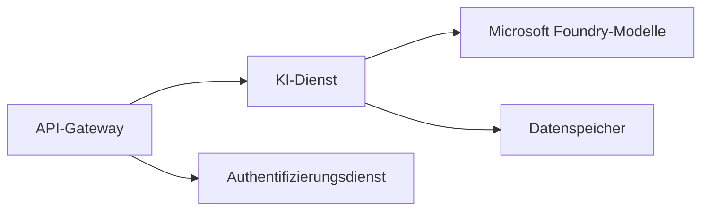

# Kapitel 8: Produktions- und Unternehmensmuster

**📚 Kurs**: [AZD für Einsteiger](../../README.md) | **⏱️ Dauer**: 2–3 Stunden | **⭐ Komplexität**: Fortgeschritten

---

## Überblick

Dieses Kapitel behandelt unternehmensreife Bereitstellungsmuster, Sicherheits­härtung, Überwachung und Kostenoptimierung für Produktions-KI-Workloads.

> Validiert gegen `azd 1.25.6` im Juni 2026.

## Lernziele

Durch das Abschließen dieses Kapitels werden Sie:
- Multi-Region resiliente Anwendungen bereitstellen
- Unternehmenssicherheitsmuster implementieren
- Umfassende Überwachung konfigurieren
- Kosten in großem Maßstab optimieren
- CI/CD-Pipelines mit AZD einrichten

---

## 📚 Lektionen

| # | Lektion | Beschreibung | Dauer |
|---|--------|-------------|------|
| 1 | [Produktions-KI-Praktiken](production-ai-practices.md) | Enterprise-Bereitstellungsmuster | 90 Min. |

---

## 🚀 Produktions-Checkliste

- [ ] Multi-Region-Bereitstellung für Resilienz
- [ ] Managed Identity für Authentifizierung (keine Schlüssel)
- [ ] Application Insights für Monitoring
- [ ] Kostenbudgets und Alerts konfiguriert
- [ ] Sicherheitsscans aktiviert
- [ ] CI/CD-Pipeline-Integration
- [ ] Notfallwiederherstellungsplan

---

## 🏗️ Architektur-Muster

### Muster 1: Microservices-KI



### Muster 2: Ereignisgesteuerte KI


---

## 🔐 Beste Sicherheitspraktiken

```bicep
// Use managed identity
identity: {
  type: 'SystemAssigned'
}

// Private endpoints for AI services
properties: {
  publicNetworkAccess: 'Disabled'
  networkAcls: {
    defaultAction: 'Deny'
  }
}
```

---

## 💰 Kostenoptimierung

| Strategie | Einsparungen |
|----------|---------|
| Auf null skalieren (Container Apps) | 60-80% |
| Verbrauchsbasierte Pläne für Entwicklung verwenden | 50-70% |
| Geplantes Skalieren | 30-50% |
| Reservierte Kapazität | 20-40% |

```bash
# Budgetwarnungen festlegen
az consumption budget create \
  --budget-name "AI-Budget" \
  --amount 500 \
  --category Cost \
  --time-grain Monthly
```

---

## 📊 Überwachungs-Setup

```bash
# Protokolle streamen
azd monitor --logs

# Application Insights überprüfen
azd monitor --overview

# Metriken anzeigen
az monitor metrics list --resource <resource-id>
```

---

## 🔗 Navigation

| Richtung | Kapitel |
|-----------|---------|
| **Vorheriges** | [Kapitel 7: Fehlerbehebung](../chapter-07-troubleshooting/README.md) |
| **Kurs abgeschlossen** | [Kursstartseite](../../README.md) |

---

## 📖 Verwandte Ressourcen

- [Leitfaden zu KI-Agenten](../chapter-02-ai-development/agents.md)
- [Application Insights](../chapter-06-pre-deployment/application-insights.md)
- [Multi-Agenten-Lösungen](../chapter-05-multi-agent/README.md)
- [Microservices-Beispiel](../../examples/microservices/README.md)

---

<!-- CO-OP TRANSLATOR DISCLAIMER START -->
**Haftungsausschluss**:
Dieses Dokument wurde mit dem KI-Übersetzungsdienst [Co-op Translator](https://github.com/Azure/co-op-translator) übersetzt. Obwohl wir uns um Genauigkeit bemühen, beachten Sie bitte, dass automatisierte Übersetzungen Fehler oder Ungenauigkeiten enthalten können. Das Originaldokument in seiner Ursprungssprache gilt als maßgebliche Quelle. Bei kritischen Informationen wird eine professionelle menschliche Übersetzung empfohlen. Wir übernehmen keine Haftung für Missverständnisse oder Fehlinterpretationen, die aus der Verwendung dieser Übersetzung entstehen.
<!-- CO-OP TRANSLATOR DISCLAIMER END -->