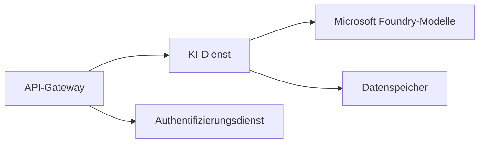

# Kapitel 8: Produktions- und Enterprise-Muster

**📚 Kurs**: [AZD für Anfänger](../../README.md) | **⏱️ Dauer**: 2-3 Stunden | **⭐ Komplexität**: Fortgeschritten

---

## Übersicht

Dieses Kapitel behandelt unternehmensgerechte Bereitstellungsmuster, Sicherheitshärtung, Überwachung und Kostenoptimierung für KI-Produktions-Workloads.

> Validiert gegen `azd 1.27.1` im Juli 2026.

## Lernziele

Nach Abschluss dieses Kapitels werden Sie:
- Mehrregionale resiliente Anwendungen bereitstellen
- Enterprise-Sicherheitsmuster implementieren
- Umfassende Überwachung konfigurieren
- Kosten in großem Maßstab optimieren
- CI/CD-Pipelines mit AZD einrichten

---

## 📚 Lektionen

| # | Lektion | Beschreibung | Zeit |
|---|--------|-------------|------|
| 1 | [Produktions-KI-Praktiken](production-ai-practices.md) | Bereitstellungsmuster für Unternehmen | 90 Min |

---

## 🚀 Produktions-Checkliste

- [ ] Mehrregionale Bereitstellung für Resilienz
- [ ] Verwaltene Identität für Authentifizierung (keine Schlüssel)
- [ ] Application Insights für Überwachung
- [ ] Kostenbudgets und Warnungen konfiguriert
- [ ] Sicherheitsscans aktiviert
- [ ] CI/CD-Pipeline integriert
- [ ] Notfallwiederherstellungsplan

---

## 🏗️ Architektur-Muster

### Muster 1: Microservices KI



### Muster 2: Ereignisgesteuerte KI


---

## 🔐 Sicherheits-Best Practices

```bicep
// Use managed identity
identity: {
  type: 'SystemAssigned'
}

// Private endpoints for AI services
properties: {
  publicNetworkAccess: 'Disabled'
  networkAcls: {
    defaultAction: 'Deny'
  }
}
```

---

## 💰 Kostenoptimierung

| Strategie | Einsparungen |
|----------|-------------|
| Skalierung auf Null (Container Apps) | 60-80% |
| Verbrauchsstufen für Entwicklung nutzen | 50-70% |
| Geplante Skalierung | 30-50% |
| Reservierte Kapazität | 20-40% |

```bash
# Budgetwarnungen festlegen
az consumption budget create \
  --budget-name "AI-Budget" \
  --amount 500 \
  --category Cost \
  --time-grain Monthly
```

---

## 📊 Überwachungs-Setup

```bash
# Protokolle streamen
azd monitor --logs

# Application Insights überprüfen
azd monitor --overview

# Metriken anzeigen
az monitor metrics list --resource <resource-id>
```

---

## 🔗 Navigation

| Richtung | Kapitel |
|-----------|---------|
| **Vorheriges** | [Kapitel 7: Fehlerbehebung](../chapter-07-troubleshooting/README.md) |
| **Kurs abgeschlossen** | [Kursübersicht](../../README.md) |

---

## 📖 Verwandte Ressourcen

- [AI-Agenten-Leitfaden](../chapter-02-ai-development/agents.md)
- [Application Insights](../chapter-06-pre-deployment/application-insights.md)
- [Multi-Agenten-Lösungen](../chapter-05-multi-agent/README.md)
- [Microservices-Beispiel](../../examples/microservices/README.md)

---

<!-- CO-OP TRANSLATOR DISCLAIMER START -->
**Haftungsausschluss**:
Dieses Dokument wurde mit dem KI-Übersetzungsdienst [Co-op Translator](https://github.com/Azure/co-op-translator) übersetzt. Obwohl wir uns um Genauigkeit bemühen, beachten Sie bitte, dass automatisierte Übersetzungen Fehler oder Ungenauigkeiten enthalten können. Das Originaldokument in seiner Ursprungssprache gilt als maßgebliche Quelle. Bei kritischen Informationen wird eine professionelle menschliche Übersetzung empfohlen. Wir übernehmen keine Haftung für Missverständnisse oder Fehlinterpretationen, die aus der Verwendung dieser Übersetzung entstehen.
<!-- CO-OP TRANSLATOR DISCLAIMER END -->