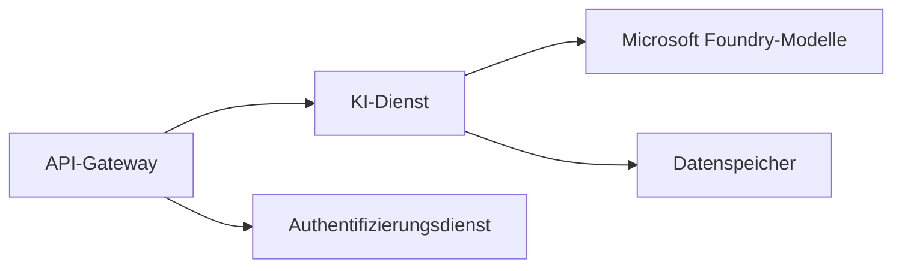

# Kapitel 8: Produktion & Unternehmensmuster

**📚 Kurs**: [AZD For Beginners](../../README.md) | **⏱️ Dauer**: 2-3 Stunden | **⭐ Komplexität**: Fortgeschritten

---

## Überblick

Dieses Kapitel behandelt unternehmensgerechte Bereitstellungsmuster, Sicherheits­härtung, Überwachung und Kostenoptimierung für produktive KI-Arbeitslasten.

> Validiert gegen `azd 1.23.12` im März 2026.

## Lernziele

Nach Abschluss dieses Kapitels werden Sie:
- Anwendungen mit Multi-Region-Resilienz bereitstellen
- Sicherheitsmuster für Unternehmen implementieren
- Umfassendes Monitoring konfigurieren
- Kosten im großen Maßstab optimieren
- CI/CD-Pipelines mit AZD einrichten

---

## 📚 Lektionen

| # | Lektion | Beschreibung | Zeit |
|---|--------|-------------|------|
| 1 | [Production AI Practices](production-ai-practices.md) | Bereitstellungsmuster für Unternehmen | 90 Min. |

---

## 🚀 Produktions-Checkliste

- [ ] Multi-Region-Bereitstellung zur Ausfallsicherheit
- [ ] Verwaltete Identität für Authentifizierung (keine Schlüssel)
- [ ] Application Insights für Überwachung
- [ ] Kostenbudgets und Warnungen konfiguriert
- [ ] Sicherheits-Scans aktiviert
- [ ] CI/CD-Pipeline-Integration
- [ ] Notfallwiederherstellungsplan

---

## 🏗️ Architektur-Muster

### Muster 1: Microservices-KI


### Muster 2: Ereignisgetriebene KI


---

## 🔐 Beste Sicherheitspraktiken

```bicep
// Use managed identity
identity: {
  type: 'SystemAssigned'
}

// Private endpoints for AI services
properties: {
  publicNetworkAccess: 'Disabled'
  networkAcls: {
    defaultAction: 'Deny'
  }
}
```

---

## 💰 Kostenoptimierung

| Strategie | Einsparungen |
|----------|---------|
| Auf Null skalieren (Container Apps) | 60-80% |
| Verbrauchsstufen für Entwicklung nutzen | 50-70% |
| Geplantes Skalieren | 30-50% |
| Reservierte Kapazität | 20-40% |

```bash
# Budgetwarnungen festlegen
az consumption budget create \
  --budget-name "AI-Budget" \
  --amount 500 \
  --category Cost \
  --time-grain Monthly
```

---

## 📊 Überwachungs-Einrichtung

```bash
# Protokolle streamen
azd monitor --logs

# Application Insights prüfen
azd monitor --overview

# Metriken anzeigen
az monitor metrics list --resource <resource-id>
```

---

## 🔗 Navigation

| Richtung | Kapitel |
|-----------|---------|
| **Vorheriges** | [Kapitel 7: Fehlerbehebung](../chapter-07-troubleshooting/README.md) |
| **Kurs abgeschlossen** | [Kursstartseite](../../README.md) |

---

## 📖 Verwandte Ressourcen

- [Leitfaden für KI-Agenten](../chapter-02-ai-development/agents.md)
- [Application Insights](../chapter-06-pre-deployment/application-insights.md)
- [Multi-Agenten-Lösungen](../chapter-05-multi-agent/README.md)
- [Microservices-Beispiel](../../examples/microservices/README.md)

---

<!-- CO-OP TRANSLATOR DISCLAIMER START -->
**Haftungsausschluss**:
Dieses Dokument wurde mithilfe des KI-Übersetzungsdienstes [Co-op Translator](https://github.com/Azure/co-op-translator) übersetzt. Obwohl wir um Genauigkeit bemüht sind, sollten Sie beachten, dass automatisierte Übersetzungen Fehler oder Ungenauigkeiten enthalten können. Das ursprüngliche Dokument in seiner Ausgangssprache ist als maßgebliche Quelle anzusehen. Bei kritischen Informationen wird eine professionelle menschliche Übersetzung empfohlen. Wir haften nicht für Missverständnisse oder Fehlinterpretationen, die sich aus der Nutzung dieser Übersetzung ergeben.
<!-- CO-OP TRANSLATOR DISCLAIMER END -->