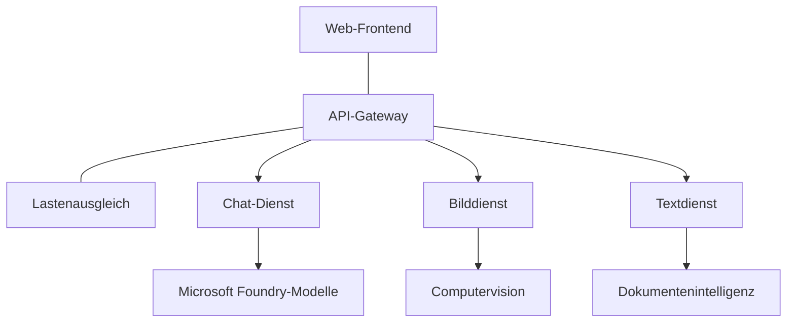

# Best Practices für produktive KI-Workloads mit AZD

**Chapter Navigation:**
- **📚 Course Home**: [AZD für Einsteiger](../../README.md)
- **📖 Current Chapter**: Kapitel 8 - Produktions- & Unternehmensmuster
- **⬅️ Previous Chapter**: [Kapitel 7: Fehlerbehebung](../chapter-07-troubleshooting/debugging.md)
- **⬅️ Also Related**: [KI-Workshop-Labor](ai-workshop-lab.md)
- **🎯 Course Complete**: [AZD für Einsteiger](../../README.md)

## Overview

Dieser Leitfaden bietet umfassende Best Practices für die Bereitstellung produktionsreifer KI-Workloads mit dem Azure Developer CLI (AZD). Basierend auf Feedback aus der Microsoft Foundry Discord-Community und realen Kundeneinsätzen adressieren diese Praktiken die häufigsten Herausforderungen in produktiven KI-Systemen.

## Key Challenges Addressed

Basierend auf den Ergebnissen unserer Community-Umfrage sind dies die größten Herausforderungen, denen Entwickler gegenüberstehen:

- **45%** haben Probleme mit KI-Bereitstellungen mit mehreren Diensten
- **38%** haben Probleme mit Zugangsdaten- und Geheimnisverwaltung  
- **35%** finden Produktionsreife und Skalierung schwierig
- **32%** benötigen bessere Kostenoptimierungsstrategien
- **29%** benötigen verbesserte Überwachung und Fehlerbehebung

## Architekturmuster für produktive KI

### Muster 1: Microservices-KI-Architektur

**Wann einsetzen**: Komplexe KI-Anwendungen mit mehreren Funktionen


**AZD-Implementierung**:

```yaml
# azure.yaml
name: enterprise-ai-platform
services:
  web:
    project: ./web
    host: staticwebapp
  api-gateway:
    project: ./api-gateway
    host: containerapp
  chat-service:
    project: ./services/chat
    host: containerapp
  vision-service:
    project: ./services/vision
    host: containerapp
  text-service:
    project: ./services/text
    host: containerapp
```

### Muster 2: Ereignisgesteuerte KI-Verarbeitung

**Wann einsetzen**: Stapelverarbeitung, Dokumentenanalyse, asynchrone Workflows

```bicep
// Event Hub for AI processing pipeline
resource eventHub 'Microsoft.EventHub/namespaces@2023-01-01-preview' = {
  name: eventHubNamespaceName
  location: location
  sku: {
    name: 'Standard'
    tier: 'Standard'
    capacity: 1
  }
}

// Service Bus for reliable message processing
resource serviceBus 'Microsoft.ServiceBus/namespaces@2022-10-01-preview' = {
  name: serviceBusNamespaceName
  location: location
  sku: {
    name: 'Premium'
    tier: 'Premium'
    capacity: 1
  }
}

// Function App for processing
resource functionApp 'Microsoft.Web/sites@2023-01-01' = {
  name: functionAppName
  location: location
  kind: 'functionapp,linux'
  properties: {
    siteConfig: {
      appSettings: [
        {
          name: 'FUNCTIONS_EXTENSION_VERSION'
          value: '~4'
        }
        {
          name: 'AZURE_OPENAI_ENDPOINT'
          value: '@Microsoft.KeyVault(VaultName=${keyVault.name};SecretName=openai-endpoint)'
        }
      ]
    }
  }
}
```

## Zur Gesundheit von KI-Agenten

Wenn eine traditionelle Webanwendung ausfällt, sind die Symptome vertraut: Eine Seite lädt nicht, eine API gibt einen Fehler zurück oder eine Bereitstellung schlägt fehl. KI-basierte Anwendungen können auf all diese Arten ausfallen — sie können sich aber auch subtiler falsch verhalten, ohne offensichtliche Fehlermeldungen zu erzeugen.

Dieser Abschnitt hilft Ihnen, ein mentales Modell für die Überwachung von KI-Workloads aufzubauen, damit Sie wissen, wo Sie nachsehen müssen, wenn etwas nicht stimmt.

### Wie sich die Agentengesundheit von der traditionellen App-Gesundheit unterscheidet

Eine traditionelle App funktioniert entweder oder sie funktioniert nicht. Ein KI-Agent kann funktionieren erscheinen, aber schlechte Ergebnisse liefern. Betrachten Sie die Agentengesundheit in zwei Ebenen:

| Layer | What to Watch | Where to Look |
|-------|--------------|---------------|
| **Infrastruktur-Gesundheit** | Läuft der Dienst? Sind Ressourcen bereitgestellt? Sind Endpunkte erreichbar? | `azd monitor`, Azure Portal resource health, container/app logs |
| **Verhaltens-Gesundheit** | Reagiert der Agent genau? Sind die Antworten zeitgerecht? Wird das Modell korrekt aufgerufen? | Application Insights-Traces, Latenzmetriken von Modellaufrufen, Logs zur Antwortqualität |

Infrastruktur-Gesundheit ist vertraut—sie ist bei jeder azd-App gleich. Verhaltens-Gesundheit ist die neue Ebene, die KI-Workloads einführen.

### Wo nachsehen, wenn sich KI-Anwendungen nicht wie erwartet verhalten

Wenn Ihre KI-Anwendung nicht die erwarteten Ergebnisse liefert, hier eine konzeptionelle Checkliste:

1. **Beginnen Sie mit den Grundlagen.** Läuft die App? Kann sie ihre Abhängigkeiten erreichen? Überprüfen Sie `azd monitor` und den Ressourcenstatus wie bei jeder anderen App.
2. **Überprüfen Sie die Modellverbindung.** Ruft Ihre Anwendung das KI-Modell erfolgreich auf? Fehlgeschlagene oder zeitüberschrittene Modellaufrufe sind die häufigste Ursache für Probleme mit KI-Apps und erscheinen in Ihren Anwendungslogs.
3. **Sehen Sie nach, was das Modell erhalten hat.** KI-Antworten hängen von der Eingabe ab (dem Prompt und jedem abgerufenen Kontext). Wenn die Ausgabe falsch ist, ist meist die Eingabe falsch. Prüfen Sie, ob Ihre Anwendung die richtigen Daten an das Modell sendet.
4. **Überprüfen Sie die Antwortlatenz.** Modellaufrufe sind langsamer als typische API-Aufrufe. Wenn sich Ihre App langsam anfühlt, prüfen Sie, ob die Modellantwortzeiten zugenommen haben—das kann auf Throttling, Kapazitätsgrenzen oder Regionenüberlastung hindeuten.
5. **Achten Sie auf Kostensignale.** Unerwartete Spitzen beim Token-Verbrauch oder bei API-Aufrufen können auf eine Schleife, einen falsch konfigurierten Prompt oder übermäßige Wiederholungen hinweisen.

Sie müssen nicht sofort ein Experte für Observability-Tools werden. Die wichtigste Erkenntnis ist, dass KI-Anwendungen eine zusätzliche Verhaltens-Ebene haben, die es zu überwachen gilt, und azd's integriertes Monitoring (`azd monitor`) bietet einen Ausgangspunkt, um beide Ebenen zu untersuchen.

---

## Sicherheits-Best Practices

### 1. Zero-Trust-Sicherheitsmodell

**Umsetzungsstrategie**:
- Keine Service-zu-Service-Kommunikation ohne Authentifizierung
- Alle API-Aufrufe nutzen verwaltete Identitäten
- Netzwerkisolation mit privaten Endpunkten
- Zugriffssteuerung nach dem Least-Privilege-Prinzip

```bicep
// Managed Identity for each service
resource chatServiceIdentity 'Microsoft.ManagedIdentity/userAssignedIdentities@2023-01-31' = {
  name: 'chat-service-identity'
  location: location
}

// Role assignments with minimal permissions
resource openAIUserRole 'Microsoft.Authorization/roleAssignments@2022-04-01' = {
  scope: openAIAccount
  name: guid(openAIAccount.id, chatServiceIdentity.id, openAIUserRoleDefinitionId)
  properties: {
    roleDefinitionId: subscriptionResourceId('Microsoft.Authorization/roleDefinitions', '5e0bd9bd-7b93-4f28-af87-19fc36ad61bd')
    principalId: chatServiceIdentity.properties.principalId
    principalType: 'ServicePrincipal'
  }
}
```

### 2. Sichere Geheimnisverwaltung

**Key-Vault-Integrationsmuster**:

```bicep
// Key Vault with proper access policies
resource keyVault 'Microsoft.KeyVault/vaults@2023-02-01' = {
  name: keyVaultName
  location: location
  properties: {
    tenantId: tenant().tenantId
    sku: {
      family: 'A'
      name: 'premium'  // Use premium for production
    }
    enableRbacAuthorization: true  // Use RBAC instead of access policies
    enablePurgeProtection: true    // Prevent accidental deletion
    enableSoftDelete: true
    softDeleteRetentionInDays: 90
  }
}

// Store all AI service credentials
resource openAIKeySecret 'Microsoft.KeyVault/vaults/secrets@2023-02-01' = {
  parent: keyVault
  name: 'openai-api-key'
  properties: {
    value: openAIAccount.listKeys().key1
    attributes: {
      enabled: true
    }
  }
}
```

### 3. Netzwerksicherheit

**Konfiguration privater Endpunkte**:

```bicep
// Virtual Network for AI services
resource virtualNetwork 'Microsoft.Network/virtualNetworks@2023-04-01' = {
  name: vnetName
  location: location
  properties: {
    addressSpace: {
      addressPrefixes: ['10.0.0.0/16']
    }
    subnets: [
      {
        name: 'ai-services-subnet'
        properties: {
          addressPrefix: '10.0.1.0/24'
          privateEndpointNetworkPolicies: 'Disabled'
        }
      }
      {
        name: 'app-services-subnet'
        properties: {
          addressPrefix: '10.0.2.0/24'
          delegations: [
            {
              name: 'Microsoft.Web/serverFarms'
              properties: {
                serviceName: 'Microsoft.Web/serverFarms'
              }
            }
          ]
        }
      }
    ]
  }
}

// Private endpoints for all AI services
resource openAIPrivateEndpoint 'Microsoft.Network/privateEndpoints@2023-04-01' = {
  name: '${openAIAccountName}-pe'
  location: location
  properties: {
    subnet: {
      id: virtualNetwork.properties.subnets[0].id
    }
    privateLinkServiceConnections: [
      {
        name: 'openai-connection'
        properties: {
          privateLinkServiceId: openAIAccount.id
          groupIds: ['account']
        }
      }
    ]
  }
}
```

## Leistung und Skalierung

### 1. Auto-Skalierungsstrategien

**Auto-Skalierung für Container Apps**:

```bicep
resource containerApp 'Microsoft.App/containerApps@2023-05-01' = {
  name: containerAppName
  location: location
  properties: {
    configuration: {
      ingress: {
        external: true
        targetPort: 8000
        transport: 'http'
      }
    }
    template: {
      scale: {
        minReplicas: 2  // Always have 2 instances minimum
        maxReplicas: 50 // Scale up to 50 for high load
        rules: [
          {
            name: 'http-scaling'
            http: {
              metadata: {
                concurrentRequests: '20'  // Scale when >20 concurrent requests
              }
            }
          }
          {
            name: 'cpu-scaling'
            custom: {
              type: 'cpu'
              metadata: {
                type: 'Utilization'
                value: '70'  // Scale when CPU >70%
              }
            }
          }
        ]
      }
    }
  }
}
```

### 2. Caching-Strategien

**Redis-Cache für KI-Antworten**:

```bicep
// Redis Premium for production workloads
resource redisCache 'Microsoft.Cache/redis@2023-04-01' = {
  name: redisCacheName
  location: location
  properties: {
    sku: {
      name: 'Premium'
      family: 'P'
      capacity: 1
    }
    enableNonSslPort: false
    minimumTlsVersion: '1.2'
    redisConfiguration: {
      'maxmemory-policy': 'allkeys-lru'
    }
    // Enable clustering for high availability
    redisVersion: '6.0'
    shardCount: 2
  }
}

// Cache configuration in application
var cacheConnectionString = '${redisCache.properties.hostName}:6380,password=${redisCache.listKeys().primaryKey},ssl=True,abortConnect=False'
```

### 3. Lastverteilung und Verkehrsmanagement

**Application Gateway mit WAF**:

```bicep
// Application Gateway with Web Application Firewall
resource applicationGateway 'Microsoft.Network/applicationGateways@2023-04-01' = {
  name: appGatewayName
  location: location
  properties: {
    sku: {
      name: 'WAF_v2'
      tier: 'WAF_v2'
      capacity: 2
    }
    webApplicationFirewallConfiguration: {
      enabled: true
      firewallMode: 'Prevention'
      ruleSetType: 'OWASP'
      ruleSetVersion: '3.2'
    }
    // Backend pools for AI services
    backendAddressPools: [
      {
        name: 'ai-services-pool'
        properties: {
          backendAddresses: [
            {
              fqdn: '${containerApp.properties.configuration.ingress.fqdn}'
            }
          ]
        }
      }
    ]
  }
}
```

## 💰 Kostenoptimierung

### 1. Ressourcen angemessen dimensionieren

**Umgebungsspezifische Konfigurationen**:

```bash
# Entwicklungsumgebung
azd env new development
azd env set AZURE_OPENAI_SKU "S0"
azd env set AZURE_OPENAI_CAPACITY 10
azd env set AZURE_SEARCH_SKU "basic"
azd env set CONTAINER_CPU 0.5
azd env set CONTAINER_MEMORY 1.0

# Produktionsumgebung
azd env new production
azd env set AZURE_OPENAI_SKU "S0"
azd env set AZURE_OPENAI_CAPACITY 100
azd env set AZURE_SEARCH_SKU "standard"
azd env set CONTAINER_CPU 2.0
azd env set CONTAINER_MEMORY 4.0
```

### 2. Kostenüberwachung und Budgets

```bicep
// Cost management and budgets
resource budget 'Microsoft.Consumption/budgets@2023-05-01' = {
  name: 'ai-workload-budget'
  properties: {
    timePeriod: {
      startDate: '2024-01-01'
      endDate: '2024-12-31'
    }
    timeGrain: 'Monthly'
    amount: 2000  // $2000 monthly budget
    category: 'Cost'
    notifications: {
      warning: {
        enabled: true
        operator: 'GreaterThan'
        threshold: 80
        contactEmails: [
          'finance@company.com'
          'engineering@company.com'
        ]
        contactRoles: [
          'Owner'
          'Contributor'
        ]
      }
      critical: {
        enabled: true
        operator: 'GreaterThan'
        threshold: 95
        contactEmails: [
          'cto@company.com'
        ]
      }
    }
  }
}
```

### 3. Optimierung der Token-Nutzung

**OpenAI-Kostenmanagement**:

```typescript
// Token-Optimierung auf Anwendungsebene
class TokenOptimizer {
  private readonly maxTokens = 4000;
  private readonly reserveTokens = 500;
  
  optimizePrompt(userInput: string, context: string): string {
    const availableTokens = this.maxTokens - this.reserveTokens;
    const estimatedTokens = this.estimateTokens(userInput + context);
    
    if (estimatedTokens > availableTokens) {
      // Kontext kürzen, nicht die Nutzereingabe
      context = this.truncateContext(context, availableTokens - this.estimateTokens(userInput));
    }
    
    return `${context}\n\nUser: ${userInput}`;
  }
  
  private estimateTokens(text: string): number {
    // Grobe Schätzung: 1 Token ≈ 4 Zeichen
    return Math.ceil(text.length / 4);
  }
}
```

## Monitoring und Observability

### 1. Umfassende Application Insights

```bicep
// Application Insights with advanced features
resource applicationInsights 'Microsoft.Insights/components@2020-02-02' = {
  name: applicationInsightsName
  location: location
  kind: 'web'
  properties: {
    Application_Type: 'web'
    WorkspaceResourceId: logAnalyticsWorkspace.id
    SamplingPercentage: 100  // Full sampling for AI apps
    DisableIpMasking: false  // Enable for security
  }
}

// Custom metrics for AI operations
resource aiMetricAlerts 'Microsoft.Insights/metricAlerts@2018-03-01' = {
  name: 'ai-high-error-rate'
  location: 'global'
  properties: {
    description: 'Alert when AI service error rate is high'
    severity: 2
    enabled: true
    scopes: [
      applicationInsights.id
    ]
    evaluationFrequency: 'PT1M'
    windowSize: 'PT5M'
    criteria: {
      'odata.type': 'Microsoft.Azure.Monitor.SingleResourceMultipleMetricCriteria'
      allOf: [
        {
          name: 'high-error-rate'
          metricName: 'requests/failed'
          operator: 'GreaterThan'
          threshold: 10
          timeAggregation: 'Count'
        }
      ]
    }
  }
}
```

### 2. KI-spezifisches Monitoring

**Benutzerdefinierte Dashboards für KI-Metriken**:

```json
// Dashboard configuration for AI workloads
{
  "dashboard": {
    "name": "AI Application Monitoring",
    "tiles": [
      {
        "name": "OpenAI Request Volume",
        "query": "requests | where name contains 'openai' | summarize count() by bin(timestamp, 5m)"
      },
      {
        "name": "AI Response Latency",
        "query": "requests | where name contains 'openai' | summarize avg(duration) by bin(timestamp, 5m)"
      },
      {
        "name": "Token Usage",
        "query": "customMetrics | where name == 'openai_tokens_used' | summarize sum(value) by bin(timestamp, 1h)"
      },
      {
        "name": "Cost per Hour",
        "query": "customMetrics | where name == 'openai_cost' | summarize sum(value) by bin(timestamp, 1h)"
      }
    ]
  }
}
```

### 3. Health Checks und Uptime-Monitoring

```bicep
// Application Insights availability tests
resource availabilityTest 'Microsoft.Insights/webtests@2022-06-15' = {
  name: 'ai-app-availability-test'
  location: location
  tags: {
    'hidden-link:${applicationInsights.id}': 'Resource'
  }
  properties: {
    SyntheticMonitorId: 'ai-app-availability-test'
    Name: 'AI Application Availability Test'
    Description: 'Tests AI application endpoints'
    Enabled: true
    Frequency: 300  // 5 minutes
    Timeout: 120    // 2 minutes
    Kind: 'ping'
    Locations: [
      {
        Id: 'us-east-2-azr'
      }
      {
        Id: 'us-west-2-azr'
      }
    ]
    Configuration: {
      WebTest: '''
        <WebTest Name="AI Health Check" 
                 Id="8d2de8d2-a2b0-4c2e-9a0d-8f9c9a0b8c8d" 
                 Enabled="True" 
                 CssProjectStructure="" 
                 CssIteration="" 
                 Timeout="120" 
                 WorkItemIds="" 
                 xmlns="http://microsoft.com/schemas/VisualStudio/TeamTest/2010" 
                 Description="" 
                 CredentialUserName="" 
                 CredentialPassword="" 
                 PreAuthenticate="True" 
                 Proxy="default" 
                 StopOnError="False" 
                 RecordedResultFile="" 
                 ResultsLocale="">
          <Items>
            <Request Method="GET" 
                     Guid="a5f10126-e4cd-570d-961c-cea43999a200" 
                     Version="1.1" 
                     Url="${webApp.properties.defaultHostName}/health" 
                     ThinkTime="0" 
                     Timeout="120" 
                     ParseDependentRequests="True" 
                     FollowRedirects="True" 
                     RecordResult="True" 
                     Cache="False" 
                     ResponseTimeGoal="0" 
                     Encoding="utf-8" 
                     ExpectedHttpStatusCode="200" 
                     ExpectedResponseUrl="" 
                     ReportingName="" 
                     IgnoreHttpStatusCode="False" />
          </Items>
        </WebTest>
      '''
    }
  }
}
```

## Notfallwiederherstellung und Hochverfügbarkeit

### 1. Multi-Region-Bereitstellung

```yaml
# azure.yaml - Multi-region configuration
name: ai-app-multiregion
services:
  api-primary:
    project: ./api
    host: containerapp
    env:
      - AZURE_REGION=eastus
  api-secondary:
    project: ./api
    host: containerapp
    env:
      - AZURE_REGION=westus2
```

```bicep
// Traffic Manager for global load balancing
resource trafficManager 'Microsoft.Network/trafficManagerProfiles@2022-04-01' = {
  name: trafficManagerProfileName
  location: 'global'
  properties: {
    profileStatus: 'Enabled'
    trafficRoutingMethod: 'Priority'
    dnsConfig: {
      relativeName: trafficManagerProfileName
      ttl: 30
    }
    monitorConfig: {
      protocol: 'HTTPS'
      port: 443
      path: '/health'
      intervalInSeconds: 30
      toleratedNumberOfFailures: 3
      timeoutInSeconds: 10
    }
    endpoints: [
      {
        name: 'primary-endpoint'
        type: 'Microsoft.Network/trafficManagerProfiles/azureEndpoints'
        properties: {
          targetResourceId: primaryAppService.id
          endpointStatus: 'Enabled'
          priority: 1
        }
      }
      {
        name: 'secondary-endpoint'
        type: 'Microsoft.Network/trafficManagerProfiles/azureEndpoints'
        properties: {
          targetResourceId: secondaryAppService.id
          endpointStatus: 'Enabled'
          priority: 2
        }
      }
    ]
  }
}
```

### 2. Datensicherung und Wiederherstellung

```bicep
// Backup configuration for critical data
resource backupVault 'Microsoft.DataProtection/backupVaults@2023-05-01' = {
  name: backupVaultName
  location: location
  identity: {
    type: 'SystemAssigned'
  }
  properties: {
    storageSettings: [
      {
        datastoreType: 'VaultStore'
        type: 'LocallyRedundant'
      }
    ]
  }
}

// Backup policy for AI models and data
resource backupPolicy 'Microsoft.DataProtection/backupVaults/backupPolicies@2023-05-01' = {
  parent: backupVault
  name: 'ai-data-backup-policy'
  properties: {
    policyRules: [
      {
        backupParameters: {
          backupType: 'Full'
          objectType: 'AzureBackupParams'
        }
        trigger: {
          schedule: {
            repeatingTimeIntervals: [
              'R/2024-01-01T02:00:00+00:00/P1D'  // Daily at 2 AM
            ]
          }
          objectType: 'ScheduleBasedTriggerContext'
        }
        dataStore: {
          datastoreType: 'VaultStore'
          objectType: 'DataStoreInfoBase'
        }
        name: 'BackupDaily'
        objectType: 'AzureBackupRule'
      }
    ]
  }
}
```

## DevOps und CI/CD-Integration

### 1. GitHub Actions Workflow

```yaml
# .github/workflows/deploy-ai-app.yml
name: Deploy AI Application

on:
  push:
    branches: [main]
  pull_request:
    branches: [main]

jobs:
  test:
    runs-on: ubuntu-latest
    steps:
      - uses: actions/checkout@v4
      
      - name: Setup Python
        uses: actions/setup-python@v4
        with:
          python-version: '3.11'
          
      - name: Install dependencies
        run: |
          pip install -r requirements.txt
          pip install pytest
          
      - name: Run tests
        run: pytest tests/
        
      - name: AI Safety Tests
        run: |
          python scripts/test_ai_safety.py
          python scripts/validate_prompts.py

  deploy-staging:
    needs: test
    if: github.event_name == 'pull_request'
    runs-on: ubuntu-latest
    steps:
      - uses: actions/checkout@v4
      
      - name: Setup AZD
        uses: Azure/setup-azd@v1.0.0
        
      - name: Login to Azure
        uses: azure/login@v1
        with:
          creds: ${{ secrets.AZURE_CREDENTIALS }}
          
      - name: Deploy to Staging
        run: |
          azd env select staging
          azd deploy

  deploy-production:
    needs: test
    if: github.ref == 'refs/heads/main'
    runs-on: ubuntu-latest
    steps:
      - uses: actions/checkout@v4
      
      - name: Setup AZD
        uses: Azure/setup-azd@v1.0.0
        
      - name: Login to Azure
        uses: azure/login@v1
        with:
          creds: ${{ secrets.AZURE_CREDENTIALS }}
          
      - name: Deploy to Production
        run: |
          azd env select production
          azd deploy
          
      - name: Run Production Health Checks
        run: |
          python scripts/health_check.py --env production
```

### 2. Infrastrukturvalidierung

```bash
# scripts/validate_infrastructure.sh
#!/bin/bash

echo "Validating AI infrastructure deployment..."

# Überprüfen, ob alle erforderlichen Dienste laufen
services=("openai" "search" "storage" "keyvault")
for service in "${services[@]}"; do
    echo "Checking $service..."
    if ! az resource list --resource-type "Microsoft.CognitiveServices/accounts" --query "[?contains(name, '$service')]" -o tsv; then
        echo "ERROR: $service not found"
        exit 1
    fi
done

# OpenAI-Modellbereitstellungen validieren
echo "Validating OpenAI model deployments..."
models=$(az cognitiveservices account deployment list --name $AZURE_OPENAI_NAME --resource-group $AZURE_RESOURCE_GROUP --query "[].name" -o tsv)
if [[ ! $models == *"gpt-35-turbo"* ]]; then
    echo "ERROR: Required model gpt-35-turbo not deployed"
    exit 1
fi

# KI-Dienstkonnektivität testen
echo "Testing AI service connectivity..."
python scripts/test_connectivity.py

echo "Infrastructure validation completed successfully!"
```

## Checkliste zur Produktionsbereitschaft

### Sicherheit ✅
- [ ] Alle Dienste verwenden verwaltete Identitäten
- [ ] Secrets im Key Vault gespeichert
- [ ] Private Endpunkte konfiguriert
- [ ] Network Security Groups implementiert
- [ ] RBAC mit minimalen Berechtigungen
- [ ] WAF auf öffentlichen Endpunkten aktiviert

### Leistung ✅
- [ ] Auto-Skalierung konfiguriert
- [ ] Caching implementiert
- [ ] Lastverteilung eingerichtet
- [ ] CDN für statische Inhalte
- [ ] Datenbankverbindungs-Pooling
- [ ] Optimierung der Token-Nutzung

### Überwachung ✅
- [ ] Application Insights konfiguriert
- [ ] Benutzerdefinierte Metriken definiert
- [ ] Alarmregeln eingerichtet
- [ ] Dashboard erstellt
- [ ] Health Checks implementiert
- [ ] Aufbewahrungsrichtlinien für Logs

### Zuverlässigkeit ✅
- [ ] Multi-Region-Bereitstellung
- [ ] Backup- und Wiederherstellungsplan
- [ ] Circuit Breaker implementiert
- [ ] Retry-Richtlinien konfiguriert
- [ ] Abgestufter Ausfall (Graceful Degradation)
- [ ] Health-Check-Endpunkte

### Kostenmanagement ✅
- [ ] Budgetwarnungen konfiguriert
- [ ] Ressourcen angemessen dimensioniert
- [ ] Dev/Test-Rabatte angewendet
- [ ] Reserved Instances gekauft
- [ ] Kostenüberwachungs-Dashboard
- [ ] Regelmäßige Kostenüberprüfungen

### Compliance ✅
- [ ] Anforderungen an Datenresidenz erfüllt
- [ ] Audit-Logging aktiviert
- [ ] Compliance-Richtlinien angewendet
- [ ] Sicherheits-Baselines implementiert
- [ ] Regelmäßige Sicherheitsbewertungen
- [ ] Incident-Response-Plan

## Leistungsbenchmarks

### Typische Produktionsmetriken

| Metrik | Ziel | Überwachung |
|--------|--------|------------|
| **Antwortzeit** | < 2 seconds | Application Insights |
| **Verfügbarkeit** | 99.9% | Uptime monitoring |
| **Fehlerquote** | < 0.1% | Application logs |
| **Token-Nutzung** | < $500/month | Cost management |
| **Gleichzeitige Nutzer** | 1000+ | Load testing |
| **Wiederherstellungszeit** | < 1 hour | Disaster recovery tests |

### Lasttests

```bash
# Lasttestskript für KI-Anwendungen
python scripts/load_test.py \
  --endpoint https://your-ai-app.azurewebsites.net \
  --concurrent-users 100 \
  --duration 300 \
  --ramp-up 60
```

## 🤝 Best Practices der Community

Basierend auf dem Feedback der Microsoft Foundry Discord-Community:

### Top-Empfehlungen aus der Community:

1. **Klein anfangen, schrittweise skalieren**: Beginnen Sie mit einfachen SKUs und skalieren Sie basierend auf dem tatsächlichen Verbrauch
2. **Alles überwachen**: Richten Sie von Anfang an umfassendes Monitoring ein
3. **Sicherheit automatisieren**: Verwenden Sie Infrastructure as Code für konsistente Sicherheit
4. **Gründlich testen**: Nehmen Sie KI-spezifische Tests in Ihre Pipeline auf
5. **Kosten einplanen**: Überwachen Sie die Token-Nutzung und richten Sie früh Budgetwarnungen ein

### Häufige Fallstricke, die vermieden werden sollten:

- ❌ API-Schlüssel im Code hardcodieren
- ❌ Kein richtiges Monitoring einrichten
- ❌ Kostenoptimierung ignorieren
- ❌ Fehlerinzenario-Tests vernachlässigen
- ❌ Bereitstellen ohne Health Checks

## AZD KI-CLI-Befehle und Erweiterungen

AZD enthält eine wachsende Auswahl an KI-spezifischen Befehlen und Erweiterungen, die produktive KI-Workflows vereinfachen. Diese Tools überbrücken die Lücke zwischen lokaler Entwicklung und Produktivbereitstellung für KI-Workloads.

### AZD-Erweiterungen für KI

AZD verwendet ein Erweiterungssystem, um KI-spezifische Funktionen hinzuzufügen. Installieren und verwalten Sie Erweiterungen mit:

```bash
# Alle verfügbaren Erweiterungen auflisten (einschließlich KI)
azd extension list

# Die Foundry Agents-Erweiterung installieren
azd extension install azure.ai.agents

# Die Fine-Tuning-Erweiterung installieren
azd extension install azure.ai.finetune

# Die Erweiterung für benutzerdefinierte Modelle installieren
azd extension install azure.ai.models

# Alle installierten Erweiterungen aktualisieren
azd extension upgrade --all
```

**Verfügbare KI-Erweiterungen:**

| Erweiterung | Zweck | Status |
|-----------|---------|--------|
| `azure.ai.agents` | Foundry Agent Service-Verwaltung | Vorschau |
| `azure.ai.finetune` | Foundry-Modell-Fine-Tuning | Vorschau |
| `azure.ai.models` | Foundry benutzerdefinierte Modelle | Vorschau |
| `azure.coding-agent` | Konfiguration des Coding-Agenten | Verfügbar |

### Initialisieren von Agent-Projekten mit `azd ai agent init`

Der Befehl `azd ai agent init` scaffoldet ein produktionsreifes KI-Agentenprojekt, das in den Microsoft Foundry Agent Service integriert ist:

```bash
# Initialisiere ein neues Agent-Projekt aus einem Agenten-Manifest
azd ai agent init -m <manifest-path-or-uri>

# Initialisiere und lege ein bestimmtes Foundry-Projekt als Ziel fest
azd ai agent init -m agent-manifest.yaml --project-id <foundry-project-id>

# Initialisiere mit einem benutzerdefinierten Quellverzeichnis
azd ai agent init -m agent-manifest.yaml --src ./agents/my-agent

# Wähle Container Apps als Host
azd ai agent init -m agent-manifest.yaml --host containerapp
```

**Wichtige Flags:**

| Flag | Beschreibung |
|------|-------------|
| `-m, --manifest` | Pfad oder URI zu einem Agent-Manifest, das zu Ihrem Projekt hinzugefügt werden soll |
| `-p, --project-id` | Bestehende Microsoft Foundry-Projekt-ID für Ihre azd-Umgebung |
| `-s, --src` | Verzeichnis zum Herunterladen der Agenten-Definition (Standard: `src/<agent-id>`) |
| `--host` | Standard-Host überschreiben (z. B. `containerapp`) |
| `-e, --environment` | Die zu verwendende azd-Umgebung |

**Produktionstipp**: Verwenden Sie `--project-id`, um direkt eine Verbindung zu einem bestehenden Foundry-Projekt herzustellen und Ihren Agenten-Code und Cloud-Ressourcen von Anfang an zu verknüpfen.

### Model Context Protocol (MCP) mit `azd mcp`

AZD enthält integrierte MCP-Serverunterstützung (Alpha), die es KI-Agenten und Tools ermöglicht, über ein standardisiertes Protokoll mit Ihren Azure-Ressourcen zu interagieren:

```bash
# Starten Sie den MCP-Server für Ihr Projekt
azd mcp start

# Verwalten Sie die Zustimmung von Tools für MCP-Operationen
azd mcp consent
```

Der MCP-Server macht Ihren azd-Projektkontext — Umgebungen, Dienste und Azure-Ressourcen — für KI-gestützte Entwicklungstools zugänglich. Dies ermöglicht:

- **KI-unterstützte Bereitstellung**: Lassen Sie Coding-Agenten Ihren Projektstatus abfragen und Bereitstellungen auslösen
- **Ressourcenerkennung**: KI-Tools können erkennen, welche Azure-Ressourcen Ihr Projekt verwendet
- **Umgebungsverwaltung**: Agenten können zwischen Dev/Staging/Production-Umgebungen wechseln

### Infrastruktur-Generierung mit `azd infra generate`

Für produktive KI-Workloads können Sie Infrastructure as Code generieren und anpassen, anstatt sich auf automatische Provisionierung zu verlassen:

```bash
# Bicep/Terraform-Dateien aus Ihrer Projektdefinition generieren
azd infra generate
```

Dies schreibt IaC auf die Festplatte, sodass Sie:
- Infrastruktur vor der Bereitstellung überprüfen und auditieren können
- Benutzerdefinierte Sicherheitsrichtlinien hinzufügen können (Netzwerkregeln, private Endpunkte)
- In vorhandene IaC-Review-Prozesse integrieren können
- Infrastrukturänderungen getrennt vom Anwendungscode versionieren können

### Produktions-Lifecycle-Hooks

AZD-Hooks ermöglichen es Ihnen, benutzerdefinierte Logik in jeder Phase des Bereitstellungs-Lebenszyklus einzufügen — entscheidend für produktive KI-Workflows:

```yaml
# azure.yaml - Production hooks example
name: ai-production-app
hooks:
  preprovision:
    shell: sh
    run: scripts/validate-quotas.sh    # Check AI model quota before provisioning
  postprovision:
    shell: sh
    run: scripts/configure-networking.sh  # Set up private endpoints
  predeploy:
    shell: sh
    run: scripts/run-ai-safety-tests.sh  # Run prompt safety checks
  postdeploy:
    shell: sh
    run: scripts/smoke-test.sh           # Verify agent responses post-deploy
services:
  agent-api:
    project: ./src/agent
    host: containerapp
    hooks:
      predeploy:
        shell: sh
        run: scripts/validate-model-access.sh  # Per-service hook
```

```bash
# Führe einen bestimmten Hook während der Entwicklung manuell aus.
azd hooks run predeploy
```

**Empfohlene Produktions-Hooks für KI-Workloads:**

| Hook | Anwendungsfall |
|------|----------|
| `preprovision` | Abonnementquoten für KI-Modellkapazität validieren |
| `postprovision` | Private Endpunkte konfigurieren, Modellgewichte bereitstellen |
| `predeploy` | KI-Sicherheitstests durchführen, Prompt-Vorlagen validieren |
| `postdeploy` | Smoke-Tests der Agentenantworten, Modellkonnektivität überprüfen |

### CI/CD-Pipeline-Konfiguration

Verwenden Sie `azd pipeline config`, um Ihr Projekt mit GitHub Actions oder Azure Pipelines mit sicherer Azure-Authentifizierung zu verbinden:

```bash
# CI/CD-Pipeline konfigurieren (interaktiv)
azd pipeline config

# Mit einem bestimmten Anbieter konfigurieren
azd pipeline config --provider github
```

Dieser Befehl:
- Erstellt ein Service Principal mit minimalen Berechtigungen
- Konfiguriert föderierte Anmeldeinformationen (keine gespeicherten Secrets)
- Erstellt oder aktualisiert Ihre Pipeline-Definitionsdatei
- Setzt erforderliche Umgebungsvariablen in Ihrem CI/CD-System

**Produktions-Workflow mit pipeline config:**

```bash
# 1. Produktionsumgebung einrichten
azd env new production
azd env set AZURE_OPENAI_CAPACITY 100

# 2. Pipeline konfigurieren
azd pipeline config --provider github

# 3. Pipeline führt azd deploy bei jedem Push auf main aus
```

### Komponenten hinzufügen mit `azd add`

Fügen Sie schrittweise Azure-Dienste zu einem bestehenden Projekt hinzu:

```bash
# Füge interaktiv eine neue Service-Komponente hinzu.
azd add
```

Dies ist besonders nützlich, um produktive KI-Anwendungen zu erweitern — zum Beispiel das Hinzufügen eines Vektor-Suchdienstes, eines neuen Agentenendpunkts oder einer Monitoring-Komponente zu einer bestehenden Bereitstellung.

## Zusätzliche Ressourcen
- **Azure Well-Architected Framework**: [Leitfaden für KI-Arbeitslasten](https://learn.microsoft.com/azure/well-architected/ai/)
- **Microsoft Foundry Documentation**: [Offizielle Dokumentation](https://learn.microsoft.com/azure/ai-studio/)
- **Community Templates**: [Azure-Beispiele](https://github.com/Azure-Samples)
- **Discord Community**: [#Azure-Kanal](https://discord.gg/microsoft-azure)
- **Agent Skills for Azure**: [microsoft/github-copilot-for-azure on skills.sh](https://skills.sh/microsoft/github-copilot-for-azure) - 37 offene Agentenfähigkeiten für Azure AI, Foundry, Bereitstellung, Kostenoptimierung und Diagnose. Installiere in deinem Editor:
  ```bash
  npx skills add microsoft/github-copilot-for-azure
  ```

---

**Kapitel-Navigation:**
- **📚 Kursstart**: [AZD für Einsteiger](../../README.md)
- **📖 Aktuelles Kapitel**: Kapitel 8 - Produktions- & Unternehmensmuster
- **⬅️ Vorheriges Kapitel**: [Kapitel 7: Fehlerbehebung](../chapter-07-troubleshooting/debugging.md)
- **⬅️ Ebenfalls relevant**: [KI-Workshop-Labor](ai-workshop-lab.md)
- **� Kurs abgeschlossen**: [AZD für Einsteiger](../../README.md)

**Denke daran**: Produktive KI-Arbeitslasten erfordern sorgfältige Planung, Überwachung und kontinuierliche Optimierung. Beginne mit diesen Mustern und passe sie an deine spezifischen Anforderungen an.

---

<!-- CO-OP TRANSLATOR DISCLAIMER START -->
**Haftungsausschluss**:
Dieses Dokument wurde mit dem KI-Übersetzungsdienst [Co-op Translator](https://github.com/Azure/co-op-translator) übersetzt. Obwohl wir uns um Genauigkeit bemühen, beachten Sie bitte, dass automatisierte Übersetzungen Fehler oder Ungenauigkeiten enthalten können. Das Originaldokument in seiner ursprünglichen Sprache ist als maßgebliche Quelle anzusehen. Für kritische Informationen wird eine professionelle menschliche Übersetzung empfohlen. Wir übernehmen keine Haftung für Missverständnisse oder Fehlinterpretationen, die aus der Verwendung dieser Übersetzung entstehen.
<!-- CO-OP TRANSLATOR DISCLAIMER END -->