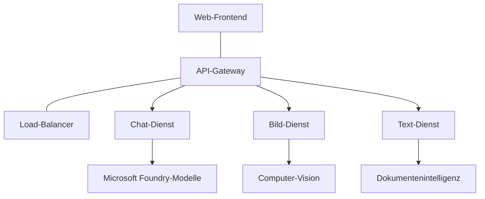

# Production AI Workload Best Practices with AZD

**Chapter Navigation:**
- **📚 Course Home**: [AZD For Beginners](../../README.md)
- **📖 Current Chapter**: Kapitel 8 - Produktion & Unternehmensmuster
- **⬅️ Previous Chapter**: [Kapitel 7: Fehlerbehebung](../chapter-07-troubleshooting/debugging.md)
- **⬅️ Also Related**: [AI Workshop Lab](ai-workshop-lab.md)
- **🎯 Course Complete**: [AZD For Beginners](../../README.md)

## Übersicht

Dieser Leitfaden liefert umfassende Best Practices für das Bereitstellen produktionsreifer KI-Workloads mit der Azure Developer CLI (AZD). Basierend auf Feedback aus der Microsoft Foundry Discord-Community und realen Kundeneinsätzen gehen diese Praktiken die häufigsten Herausforderungen in Produktions-KI-Systemen an.

## Zentrale Herausforderungen

Basierend auf den Ergebnissen unserer Community-Umfrage sind dies die größten Herausforderungen, mit denen Entwickler konfrontiert sind:

- **45%** haben Probleme mit Multi-Service-KI-Bereitstellungen
- **38%** haben Schwierigkeiten mit Anmeldeinformationen und Geheimnisverwaltung  
- **35%** finden Produktionsreife und Skalierung schwierig
- **32%** benötigen bessere Strategien zur Kostenoptimierung
- **29%** benötigen verbesserte Überwachung und Fehlerbehebung

## Architektur-Muster für Produktions-KI

### Muster 1: Microservices-KI-Architektur

**Wann verwenden**: Komplexe KI-Anwendungen mit mehreren Fähigkeiten



**AZD-Implementierung**:

```yaml
# azure.yaml
name: enterprise-ai-platform
services:
  web:
    project: ./web
    host: staticwebapp
  api-gateway:
    project: ./api-gateway
    host: containerapp
  chat-service:
    project: ./services/chat
    host: containerapp
  vision-service:
    project: ./services/vision
    host: containerapp
  text-service:
    project: ./services/text
    host: containerapp
```

### Muster 2: Ereignisgesteuerte KI-Verarbeitung

**Wann verwenden**: Batch-Verarbeitung, Dokumentenanalyse, asynchrone Workflows

```bicep
// Event Hub for AI processing pipeline
resource eventHub 'Microsoft.EventHub/namespaces@2023-01-01-preview' = {
  name: eventHubNamespaceName
  location: location
  sku: {
    name: 'Standard'
    tier: 'Standard'
    capacity: 1
  }
}

// Service Bus for reliable message processing
resource serviceBus 'Microsoft.ServiceBus/namespaces@2022-10-01-preview' = {
  name: serviceBusNamespaceName
  location: location
  sku: {
    name: 'Premium'
    tier: 'Premium'
    capacity: 1
  }
}

// Function App for processing
resource functionApp 'Microsoft.Web/sites@2023-01-01' = {
  name: functionAppName
  location: location
  kind: 'functionapp,linux'
  properties: {
    siteConfig: {
      appSettings: [
        {
          name: 'FUNCTIONS_EXTENSION_VERSION'
          value: '~4'
        }
        {
          name: 'AZURE_OPENAI_ENDPOINT'
          value: '@Microsoft.KeyVault(VaultName=${keyVault.name};SecretName=openai-endpoint)'
        }
      ]
    }
  }
}
```

## Über die Gesundheit von KI-Agenten

Wenn eine traditionelle Webanwendung ausfällt, sind die Symptome vertraut: Eine Seite lädt nicht, eine API liefert einen Fehler oder eine Bereitstellung schlägt fehl. KI-gestützte Anwendungen können auf all diese Weisen ausfallen — sie können sich aber auch subtiler fehlverhalten, ohne offensichtliche Fehlermeldungen zu erzeugen.

Dieser Abschnitt hilft Ihnen, ein mentales Modell für die Überwachung von KI-Workloads aufzubauen, damit Sie wissen, wo Sie nachsehen müssen, wenn etwas nicht richtig zu sein scheint.

### Wie sich die Agenten-Gesundheit von traditioneller App-Gesundheit unterscheidet

Eine traditionelle App funktioniert entweder oder nicht. Ein KI-Agent kann funktionieren erscheinen, aber schlechte Ergebnisse liefern. Betrachten Sie die Agenten-Gesundheit in zwei Ebenen:

| Ebene | Worauf achten | Wo nachsehen |
|-------|--------------|---------------|
| **Infrastruktur-Status** | Läuft der Dienst? Sind Ressourcen bereitgestellt? Sind Endpunkte erreichbar? | `azd monitor`, Azure Portal resource health, Container-/App-Logs |
| **Verhaltens-Status** | Reagiert der Agent korrekt? Sind die Antworten zeitnah? Wird das Modell korrekt aufgerufen? | Application Insights-Traces, Metriken zur Modellaufruf-Latenz, Logs zur Antwortqualität |

Der Infrastruktur-Status ist vertraut — er ist derselbe wie bei jeder azd-App. Der Verhaltens-Status ist die neue Ebene, die KI-Workloads einführen.

### Wo nachsehen, wenn KI-Anwendungen sich unerwartet verhalten

Wenn Ihre KI-Anwendung nicht die erwarteten Ergebnisse liefert, hier eine konzeptionelle Checkliste:

1. **Mit den Grundlagen beginnen.** Läuft die App? Kann sie ihre Abhängigkeiten erreichen? Überprüfen Sie `azd monitor` und den Resource Health, so wie Sie es bei jeder App tun würden.
2. **Die Modellverbindung prüfen.** Ruft Ihre Anwendung erfolgreich das KI-Modell auf? Fehlgeschlagene oder ablaufende Modellaufrufe sind die häufigste Ursache für Probleme mit KI-Apps und werden in Ihren Anwendungsprotokollen sichtbar.
3. **Schauen Sie, was das Modell erhalten hat.** KI-Antworten hängen von der Eingabe ab (dem Prompt und jeglichem abgerufenen Kontext). Wenn die Ausgabe falsch ist, ist die Eingabe meist falsch. Prüfen Sie, ob Ihre Anwendung die richtigen Daten an das Modell sendet.
4. **Antwortlatenz überprüfen.** Modellaufrufe sind langsamer als typische API-Aufrufe. Wenn sich Ihre App träge anfühlt, prüfen Sie, ob die Modellantwortzeiten gestiegen sind — das kann auf Drosselung, Kapazitätsgrenzen oder regionale Überlastung hinweisen.
5. **Auf Kostenindikatoren achten.** Unerwartete Spitzen beim Token-Verbrauch oder bei API-Aufrufen können auf eine Schleife, einen falsch konfigurierten Prompt oder übermäßige Wiederholungen hinweisen.

Sie müssen nicht sofort alle Observability-Tools meistern. Die zentrale Erkenntnis ist, dass KI-Anwendungen eine zusätzliche Verhaltensebene haben, die überwacht werden muss, und dass azd's integrierte Überwachung (`azd monitor`) einen Startpunkt für die Untersuchung beider Ebenen bietet.

---

## Sicherheits-Best Practices

### 1. Zero-Trust-Sicherheitsmodell

**Implementierungsstrategie**:
- Keine Service-zu-Service-Kommunikation ohne Authentifizierung
- Alle API-Aufrufe verwenden Managed Identities
- Netzwerkisolation mit Private Endpoints
- Zugriffssteuerung mit minimalen Rechten

```bicep
// Managed Identity for each service
resource chatServiceIdentity 'Microsoft.ManagedIdentity/userAssignedIdentities@2023-01-31' = {
  name: 'chat-service-identity'
  location: location
}

// Role assignments with minimal permissions
resource openAIUserRole 'Microsoft.Authorization/roleAssignments@2022-04-01' = {
  scope: openAIAccount
  name: guid(openAIAccount.id, chatServiceIdentity.id, openAIUserRoleDefinitionId)
  properties: {
    roleDefinitionId: subscriptionResourceId('Microsoft.Authorization/roleDefinitions', '5e0bd9bd-7b93-4f28-af87-19fc36ad61bd')
    principalId: chatServiceIdentity.properties.principalId
    principalType: 'ServicePrincipal'
  }
}
```

### 2. Sichere Geheimnisverwaltung

**Key Vault-Integrationsmuster**:

```bicep
// Key Vault with proper access policies
resource keyVault 'Microsoft.KeyVault/vaults@2023-02-01' = {
  name: keyVaultName
  location: location
  properties: {
    tenantId: tenant().tenantId
    sku: {
      family: 'A'
      name: 'premium'  // Use premium for production
    }
    enableRbacAuthorization: true  // Use RBAC instead of access policies
    enablePurgeProtection: true    // Prevent accidental deletion
    enableSoftDelete: true
    softDeleteRetentionInDays: 90
  }
}

// Store all AI service credentials
resource openAIKeySecret 'Microsoft.KeyVault/vaults/secrets@2023-02-01' = {
  parent: keyVault
  name: 'openai-api-key'
  properties: {
    value: openAIAccount.listKeys().key1
    attributes: {
      enabled: true
    }
  }
}
```

### 3. Netzwerksicherheit

**Private Endpoint-Konfiguration**:

```bicep
// Virtual Network for AI services
resource virtualNetwork 'Microsoft.Network/virtualNetworks@2023-04-01' = {
  name: vnetName
  location: location
  properties: {
    addressSpace: {
      addressPrefixes: ['10.0.0.0/16']
    }
    subnets: [
      {
        name: 'ai-services-subnet'
        properties: {
          addressPrefix: '10.0.1.0/24'
          privateEndpointNetworkPolicies: 'Disabled'
        }
      }
      {
        name: 'app-services-subnet'
        properties: {
          addressPrefix: '10.0.2.0/24'
          delegations: [
            {
              name: 'Microsoft.Web/serverFarms'
              properties: {
                serviceName: 'Microsoft.Web/serverFarms'
              }
            }
          ]
        }
      }
    ]
  }
}

// Private endpoints for all AI services
resource openAIPrivateEndpoint 'Microsoft.Network/privateEndpoints@2023-04-01' = {
  name: '${openAIAccountName}-pe'
  location: location
  properties: {
    subnet: {
      id: virtualNetwork.properties.subnets[0].id
    }
    privateLinkServiceConnections: [
      {
        name: 'openai-connection'
        properties: {
          privateLinkServiceId: openAIAccount.id
          groupIds: ['account']
        }
      }
    ]
  }
}
```

## Leistung und Skalierung

### 1. Auto-Skalierungsstrategien

**Auto-Skalierung für Container Apps**:

```bicep
resource containerApp 'Microsoft.App/containerApps@2023-05-01' = {
  name: containerAppName
  location: location
  properties: {
    configuration: {
      ingress: {
        external: true
        targetPort: 8000
        transport: 'http'
      }
    }
    template: {
      scale: {
        minReplicas: 2  // Always have 2 instances minimum
        maxReplicas: 50 // Scale up to 50 for high load
        rules: [
          {
            name: 'http-scaling'
            http: {
              metadata: {
                concurrentRequests: '20'  // Scale when >20 concurrent requests
              }
            }
          }
          {
            name: 'cpu-scaling'
            custom: {
              type: 'cpu'
              metadata: {
                type: 'Utilization'
                value: '70'  // Scale when CPU >70%
              }
            }
          }
        ]
      }
    }
  }
}
```

### 2. Caching-Strategien

**Redis-Cache für KI-Antworten**:

```bicep
// Redis Premium for production workloads
resource redisCache 'Microsoft.Cache/redis@2023-04-01' = {
  name: redisCacheName
  location: location
  properties: {
    sku: {
      name: 'Premium'
      family: 'P'
      capacity: 1
    }
    enableNonSslPort: false
    minimumTlsVersion: '1.2'
    redisConfiguration: {
      'maxmemory-policy': 'allkeys-lru'
    }
    // Enable clustering for high availability
    redisVersion: '6.0'
    shardCount: 2
  }
}

// Cache configuration in application
var cacheConnectionString = '${redisCache.properties.hostName}:6380,password=${redisCache.listKeys().primaryKey},ssl=True,abortConnect=False'
```

### 3. Lastverteilung und Verkehrsmanagement

**Application Gateway mit WAF**:

```bicep
// Application Gateway with Web Application Firewall
resource applicationGateway 'Microsoft.Network/applicationGateways@2023-04-01' = {
  name: appGatewayName
  location: location
  properties: {
    sku: {
      name: 'WAF_v2'
      tier: 'WAF_v2'
      capacity: 2
    }
    webApplicationFirewallConfiguration: {
      enabled: true
      firewallMode: 'Prevention'
      ruleSetType: 'OWASP'
      ruleSetVersion: '3.2'
    }
    // Backend pools for AI services
    backendAddressPools: [
      {
        name: 'ai-services-pool'
        properties: {
          backendAddresses: [
            {
              fqdn: '${containerApp.properties.configuration.ingress.fqdn}'
            }
          ]
        }
      }
    ]
  }
}
```

## 💰 Kostenoptimierung

### 1. Ressourcen richtig dimensionieren

**Umgebungsspezifische Konfigurationen**:

```bash
# Entwicklungsumgebung
azd env new development
azd env set AZURE_OPENAI_SKU "S0"
azd env set AZURE_OPENAI_CAPACITY 10
azd env set AZURE_SEARCH_SKU "basic"
azd env set CONTAINER_CPU 0.5
azd env set CONTAINER_MEMORY 1.0

# Produktionsumgebung
azd env new production
azd env set AZURE_OPENAI_SKU "S0"
azd env set AZURE_OPENAI_CAPACITY 100
azd env set AZURE_SEARCH_SKU "standard"
azd env set CONTAINER_CPU 2.0
azd env set CONTAINER_MEMORY 4.0
```

### 2. Kostenüberwachung und Budgets

```bicep
// Cost management and budgets
resource budget 'Microsoft.Consumption/budgets@2023-05-01' = {
  name: 'ai-workload-budget'
  properties: {
    timePeriod: {
      startDate: '2024-01-01'
      endDate: '2024-12-31'
    }
    timeGrain: 'Monthly'
    amount: 2000  // $2000 monthly budget
    category: 'Cost'
    notifications: {
      warning: {
        enabled: true
        operator: 'GreaterThan'
        threshold: 80
        contactEmails: [
          'finance@company.com'
          'engineering@company.com'
        ]
        contactRoles: [
          'Owner'
          'Contributor'
        ]
      }
      critical: {
        enabled: true
        operator: 'GreaterThan'
        threshold: 95
        contactEmails: [
          'cto@company.com'
        ]
      }
    }
  }
}
```

### 3. Token-Verbrauch optimieren

**OpenAI Kostenverwaltung**:

```typescript
// Token-Optimierung auf Anwendungsebene
class TokenOptimizer {
  private readonly maxTokens = 4000;
  private readonly reserveTokens = 500;
  
  optimizePrompt(userInput: string, context: string): string {
    const availableTokens = this.maxTokens - this.reserveTokens;
    const estimatedTokens = this.estimateTokens(userInput + context);
    
    if (estimatedTokens > availableTokens) {
      // Kontext kürzen, nicht die Benutzereingabe
      context = this.truncateContext(context, availableTokens - this.estimateTokens(userInput));
    }
    
    return `${context}\n\nUser: ${userInput}`;
  }
  
  private estimateTokens(text: string): number {
    // Grobe Schätzung: 1 Token ≈ 4 Zeichen
    return Math.ceil(text.length / 4);
  }
}
```

## Monitoring und Beobachtbarkeit

### 1. Umfassendes Application Insights

```bicep
// Application Insights with advanced features
resource applicationInsights 'Microsoft.Insights/components@2020-02-02' = {
  name: applicationInsightsName
  location: location
  kind: 'web'
  properties: {
    Application_Type: 'web'
    WorkspaceResourceId: logAnalyticsWorkspace.id
    SamplingPercentage: 100  // Full sampling for AI apps
    DisableIpMasking: false  // Enable for security
  }
}

// Custom metrics for AI operations
resource aiMetricAlerts 'Microsoft.Insights/metricAlerts@2018-03-01' = {
  name: 'ai-high-error-rate'
  location: 'global'
  properties: {
    description: 'Alert when AI service error rate is high'
    severity: 2
    enabled: true
    scopes: [
      applicationInsights.id
    ]
    evaluationFrequency: 'PT1M'
    windowSize: 'PT5M'
    criteria: {
      'odata.type': 'Microsoft.Azure.Monitor.SingleResourceMultipleMetricCriteria'
      allOf: [
        {
          name: 'high-error-rate'
          metricName: 'requests/failed'
          operator: 'GreaterThan'
          threshold: 10
          timeAggregation: 'Count'
        }
      ]
    }
  }
}
```

### 2. KI-spezifische Überwachung

**Benutzerdefinierte Dashboards für KI-Metriken**:

```json
// Dashboard configuration for AI workloads
{
  "dashboard": {
    "name": "AI Application Monitoring",
    "tiles": [
      {
        "name": "OpenAI Request Volume",
        "query": "requests | where name contains 'openai' | summarize count() by bin(timestamp, 5m)"
      },
      {
        "name": "AI Response Latency",
        "query": "requests | where name contains 'openai' | summarize avg(duration) by bin(timestamp, 5m)"
      },
      {
        "name": "Token Usage",
        "query": "customMetrics | where name == 'openai_tokens_used' | summarize sum(value) by bin(timestamp, 1h)"
      },
      {
        "name": "Cost per Hour",
        "query": "customMetrics | where name == 'openai_cost' | summarize sum(value) by bin(timestamp, 1h)"
      }
    ]
  }
}
```

### 3. Health Checks und Uptime-Monitoring

```bicep
// Application Insights availability tests
resource availabilityTest 'Microsoft.Insights/webtests@2022-06-15' = {
  name: 'ai-app-availability-test'
  location: location
  tags: {
    'hidden-link:${applicationInsights.id}': 'Resource'
  }
  properties: {
    SyntheticMonitorId: 'ai-app-availability-test'
    Name: 'AI Application Availability Test'
    Description: 'Tests AI application endpoints'
    Enabled: true
    Frequency: 300  // 5 minutes
    Timeout: 120    // 2 minutes
    Kind: 'ping'
    Locations: [
      {
        Id: 'us-east-2-azr'
      }
      {
        Id: 'us-west-2-azr'
      }
    ]
    Configuration: {
      WebTest: '''
        <WebTest Name="AI Health Check" 
                 Id="8d2de8d2-a2b0-4c2e-9a0d-8f9c9a0b8c8d" 
                 Enabled="True" 
                 CssProjectStructure="" 
                 CssIteration="" 
                 Timeout="120" 
                 WorkItemIds="" 
                 xmlns="http://microsoft.com/schemas/VisualStudio/TeamTest/2010" 
                 Description="" 
                 CredentialUserName="" 
                 CredentialPassword="" 
                 PreAuthenticate="True" 
                 Proxy="default" 
                 StopOnError="False" 
                 RecordedResultFile="" 
                 ResultsLocale="">
          <Items>
            <Request Method="GET" 
                     Guid="a5f10126-e4cd-570d-961c-cea43999a200" 
                     Version="1.1" 
                     Url="${webApp.properties.defaultHostName}/health" 
                     ThinkTime="0" 
                     Timeout="120" 
                     ParseDependentRequests="True" 
                     FollowRedirects="True" 
                     RecordResult="True" 
                     Cache="False" 
                     ResponseTimeGoal="0" 
                     Encoding="utf-8" 
                     ExpectedHttpStatusCode="200" 
                     ExpectedResponseUrl="" 
                     ReportingName="" 
                     IgnoreHttpStatusCode="False" />
          </Items>
        </WebTest>
      '''
    }
  }
}
```

## Notfallwiederherstellung und Hochverfügbarkeit

### 1. Multi-Region-Bereitstellung

```yaml
# azure.yaml - Multi-region configuration
name: ai-app-multiregion
services:
  api-primary:
    project: ./api
    host: containerapp
    env:
      - AZURE_REGION=eastus
  api-secondary:
    project: ./api
    host: containerapp
    env:
      - AZURE_REGION=westus2
```

```bicep
// Traffic Manager for global load balancing
resource trafficManager 'Microsoft.Network/trafficManagerProfiles@2022-04-01' = {
  name: trafficManagerProfileName
  location: 'global'
  properties: {
    profileStatus: 'Enabled'
    trafficRoutingMethod: 'Priority'
    dnsConfig: {
      relativeName: trafficManagerProfileName
      ttl: 30
    }
    monitorConfig: {
      protocol: 'HTTPS'
      port: 443
      path: '/health'
      intervalInSeconds: 30
      toleratedNumberOfFailures: 3
      timeoutInSeconds: 10
    }
    endpoints: [
      {
        name: 'primary-endpoint'
        type: 'Microsoft.Network/trafficManagerProfiles/azureEndpoints'
        properties: {
          targetResourceId: primaryAppService.id
          endpointStatus: 'Enabled'
          priority: 1
        }
      }
      {
        name: 'secondary-endpoint'
        type: 'Microsoft.Network/trafficManagerProfiles/azureEndpoints'
        properties: {
          targetResourceId: secondaryAppService.id
          endpointStatus: 'Enabled'
          priority: 2
        }
      }
    ]
  }
}
```

### 2. Datensicherung und Wiederherstellung

```bicep
// Backup configuration for critical data
resource backupVault 'Microsoft.DataProtection/backupVaults@2023-05-01' = {
  name: backupVaultName
  location: location
  identity: {
    type: 'SystemAssigned'
  }
  properties: {
    storageSettings: [
      {
        datastoreType: 'VaultStore'
        type: 'LocallyRedundant'
      }
    ]
  }
}

// Backup policy for AI models and data
resource backupPolicy 'Microsoft.DataProtection/backupVaults/backupPolicies@2023-05-01' = {
  parent: backupVault
  name: 'ai-data-backup-policy'
  properties: {
    policyRules: [
      {
        backupParameters: {
          backupType: 'Full'
          objectType: 'AzureBackupParams'
        }
        trigger: {
          schedule: {
            repeatingTimeIntervals: [
              'R/2024-01-01T02:00:00+00:00/P1D'  // Daily at 2 AM
            ]
          }
          objectType: 'ScheduleBasedTriggerContext'
        }
        dataStore: {
          datastoreType: 'VaultStore'
          objectType: 'DataStoreInfoBase'
        }
        name: 'BackupDaily'
        objectType: 'AzureBackupRule'
      }
    ]
  }
}
```

## DevOps- und CI/CD-Integration

### 1. GitHub Actions Workflow

```yaml
# .github/workflows/deploy-ai-app.yml
name: Deploy AI Application

on:
  push:
    branches: [main]
  pull_request:
    branches: [main]

jobs:
  test:
    runs-on: ubuntu-latest
    steps:
      - uses: actions/checkout@v4
      
      - name: Setup Python
        uses: actions/setup-python@v4
        with:
          python-version: '3.11'
          
      - name: Install dependencies
        run: |
          pip install -r requirements.txt
          pip install pytest
          
      - name: Run tests
        run: pytest tests/
        
      - name: AI Safety Tests
        run: |
          python scripts/test_ai_safety.py
          python scripts/validate_prompts.py

  deploy-staging:
    needs: test
    if: github.event_name == 'pull_request'
    runs-on: ubuntu-latest
    steps:
      - uses: actions/checkout@v4
      
      - name: Setup AZD
        uses: Azure/setup-azd@v2
        
      - name: Login to Azure
        uses: azure/login@v1
        with:
          creds: ${{ secrets.AZURE_CREDENTIALS }}
          
      - name: Deploy to Staging
        run: |
          azd env select staging
          azd deploy

  deploy-production:
    needs: test
    if: github.ref == 'refs/heads/main'
    runs-on: ubuntu-latest
    steps:
      - uses: actions/checkout@v4
      
      - name: Setup AZD
        uses: Azure/setup-azd@v2
        
      - name: Login to Azure
        uses: azure/login@v1
        with:
          creds: ${{ secrets.AZURE_CREDENTIALS }}
          
      - name: Deploy to Production
        run: |
          azd env select production
          azd deploy
          
      - name: Run Production Health Checks
        run: |
          python scripts/health_check.py --env production
```

### 2. Infrastrukturvalidierung

```bash
# scripts/validate_infrastructure.sh
#!/bin/bash

echo "Validating AI infrastructure deployment..."

# Prüfen, ob alle erforderlichen Dienste laufen
services=("openai" "search" "storage" "keyvault")
for service in "${services[@]}"; do
    echo "Checking $service..."
    if ! az resource list --resource-type "Microsoft.CognitiveServices/accounts" --query "[?contains(name, '$service')]" -o tsv; then
        echo "ERROR: $service not found"
        exit 1
    fi
done

# OpenAI-Modellbereitstellungen validieren
echo "Validating OpenAI model deployments..."
models=$(az cognitiveservices account deployment list --name $AZURE_OPENAI_NAME --resource-group $AZURE_RESOURCE_GROUP --query "[].name" -o tsv)
if [[ ! $models == *"gpt-4.1-mini"* ]]; then
  echo "ERROR: Required model gpt-4.1-mini not deployed"
    exit 1
fi

# Konnektivität des KI-Dienstes testen
echo "Testing AI service connectivity..."
python scripts/test_connectivity.py

echo "Infrastructure validation completed successfully!"
```

## Produktionsbereitschafts-Checkliste

### Sicherheit ✅
- [ ] Alle Dienste verwenden Managed Identities
- [ ] Geheimnisse im Key Vault gespeichert
- [ ] Private Endpunkte konfiguriert
- [ ] Network Security Groups implementiert
- [ ] RBAC mit minimalen Rechten
- [ ] WAF auf öffentlichen Endpunkten aktiviert

### Leistung ✅
- [ ] Auto-Skalierung konfiguriert
- [ ] Caching implementiert
- [ ] Lastverteilung eingerichtet
- [ ] CDN für statische Inhalte
- [ ] Datenbank-Verbindungs-Pooling
- [ ] Token-Verbrauch optimiert

### Überwachung ✅
- [ ] Application Insights konfiguriert
- [ ] Benutzerdefinierte Metriken definiert
- [ ] Alerting-Regeln eingerichtet
- [ ] Dashboard erstellt
- [ ] Health Checks implementiert
- [ ] Aufbewahrungsrichtlinien für Logs

### Zuverlässigkeit ✅
- [ ] Multi-Region-Bereitstellung
- [ ] Backup- und Wiederherstellungsplan
- [ ] Circuit Breaker implementiert
- [ ] Retry-Strategien konfiguriert
- [ ] Graceful Degradation
- [ ] Health-Check-Endpunkte

### Kostenmanagement ✅
- [ ] Budgetwarnungen konfiguriert
- [ ] Ressourcen richtig dimensioniert
- [ ] Dev/Test-Rabatte angewendet
- [ ] Reservierte Instanzen erworben
- [ ] Kostenüberwachungs-Dashboard
- [ ] Regelmäßige Kostenüberprüfungen

### Compliance ✅
- [ ] Anforderungen an Datenresidenz erfüllt
- [ ] Audit-Logging aktiviert
- [ ] Compliance-Richtlinien angewendet
- [ ] Sicherheits-Baselines implementiert
- [ ] Regelmäßige Sicherheitsüberprüfungen
- [ ] Incident-Response-Plan

## Leistungs-Benchmarks

### Typische Produktionsmetriken

| Metrik | Ziel | Überwachung |
|--------|--------|------------|
| **Antwortzeit** | < 2 seconds | Application Insights |
| **Verfügbarkeit** | 99.9% | Uptime monitoring |
| **Fehlerquote** | < 0.1% | Anwendungsprotokolle |
| **Token-Verbrauch** | < $500/month | Kostenmanagement |
| **Gleichzeitige Benutzer** | 1000+ | Lasttests |
| **Wiederherstellungszeit** | < 1 hour | Notfallwiederherstellungstests |

### Lasttests

```bash
# Skript zum Lasttest von KI-Anwendungen
python scripts/load_test.py \
  --endpoint https://your-ai-app.azurewebsites.net \
  --concurrent-users 100 \
  --duration 300 \
  --ramp-up 60
```

## 🤝 Community Best Practices

Basierend auf dem Feedback der Microsoft Foundry Discord-Community:

### Top-Empfehlungen aus der Community:

1. **Klein anfangen, schrittweise skalieren**: Beginnen Sie mit grundlegenden SKUs und skalieren Sie basierend auf der tatsächlichen Nutzung
2. **Alles überwachen**: Richten Sie von Anfang an umfassendes Monitoring ein
3. **Sicherheit automatisieren**: Verwenden Sie Infrastructure-as-Code für konsistente Sicherheit
4. **Gründlich testen**: Schließen Sie KI-spezifische Tests in Ihre Pipeline ein
5. **Kosten planen**: Überwachen Sie den Token-Verbrauch und richten Sie früh Budgetwarnungen ein

### Häufige Fallstricke, die vermieden werden sollten:

- ❌ API-Schlüssel im Code hardcoden
- ❌ Kein ordentliches Monitoring einrichten
- ❌ Kostenoptimierung ignorieren
- ❌ Fehlerfälle nicht testen
- ❌ Ohne Health Checks bereitstellen

## AZD AI CLI-Befehle und Erweiterungen

AZD enthält eine wachsende Menge an KI-spezifischen Befehlen und Erweiterungen, die Produktions-KI-Workflows vereinfachen. Diese Tools überbrücken die Lücke zwischen lokaler Entwicklung und Produktionsbereitstellung für KI-Workloads.

### AZD-Erweiterungen für KI

AZD verwendet ein Erweiterungssystem, um KI-spezifische Fähigkeiten hinzuzufügen. Installieren und verwalten Sie Erweiterungen mit:

```bash
# Alle verfügbaren Erweiterungen auflisten (einschließlich KI)
azd extension list

# Details installierter Erweiterungen anzeigen
azd extension show azure.ai.agents

# Die Foundry Agents-Erweiterung installieren
azd extension install azure.ai.agents

# Die Feinabstimmungs-Erweiterung installieren
azd extension install azure.ai.finetune

# Die Erweiterung für benutzerdefinierte Modelle installieren
azd extension install azure.ai.models

# Alle installierten Erweiterungen aktualisieren
azd extension upgrade --all
```

**Verfügbare KI-Erweiterungen:**

| Erweiterung | Zweck | Status |
|-----------|---------|--------|
| `azure.ai.agents` | Foundry Agent Service-Verwaltung | Vorschau |
| `azure.ai.skills` | Wiederverwendbare Agenten-Fähigkeiten | Vorschau |
| `azure.ai.connections` | Foundry-Verbindungen (Datenquellen, Tools) | Vorschau |
| `azure.ai.finetune` | Foundry Modell-Feinabstimmung | Vorschau |
| `azure.ai.models` | Foundry benutzerdefinierte Modelle | Vorschau |
| `azure.coding-agent` | Konfiguration des Coding-Agenten | Verfügbar |

> Die `azure.ai.agents`-Erweiterung entwickelt sich schnell. Dieser Kurs ist gegen `0.1.40-preview` validiert. Führen Sie `azd extension upgrade --all` aus, um das neueste Befehlsset zu erhalten, und `azd extension show azure.ai.agents`, um Ihre installierte Version zu bestätigen.

**Was sind die neueren `skills`- und `connections`-Erweiterungen?**

Zwei Vorschauerweiterungen sind zusammen mit dem Agenten-Tooling erschienen und sollten verstanden werden, auch als Einsteiger:

- **`azure.ai.skills`** — Eine **Skill** ist eine wiederverwendbare Fähigkeit (ein gepacktes Tool oder Verhalten), das Sie an einen oder mehrere Agenten anhängen können, statt es jedes Mal neu zu implementieren. Denken Sie daran wie an einen gemeinsamen Baustein: Definieren Sie einmal einen "durchsuche die Docs"- oder "bestellung nachschlagen"-Skill und verwenden Sie ihn dann über Agenten hinweg wieder. Das hält Multi-Agent-Systeme (Kapitel 5) konsistent und vermeidet Copy-Paste.
- **`azure.ai.connections`** — Eine **Connection** ist eine verwaltete Verbindung von Ihrem Foundry-Projekt zu einer externen Ressource, die Ihre Agenten benötigen — eine Datenquelle (wie Azure AI Search), ein Tool-Endpunkt oder ein anderer Dienst. Connections zentralisieren *wo* und *wie* Agenten auf Daten zugreifen, sodass Anmeldeinformationen und Endpunkte an einem verwalteten Ort liegen, statt im Code verstreut zu sein.

Sie benötigen diese nicht, um Ihre ersten Agenten bereitzustellen — bleiben Sie beim Lernen bei `azure.ai.agents`. Greifen Sie zu `skills`, wenn Sie dasselbe Tool in mehreren Agenten duplizieren, und zu `connections`, wenn mehrere Agenten dieselbe Datenquelle teilen.

### Initialisieren von Agent-Projekten mit `azd ai agent init`

Der Befehl `azd ai agent init` scaffoldet ein produktionsbereites KI-Agenten-Projekt, integriert mit dem Microsoft Foundry Agent Service:

```bash
# Ein neues Agentenprojekt aus einem Agentenmanifest initialisieren
azd ai agent init -m <manifest-path-or-uri>

# Ein bestimmtes Foundry-Projekt initialisieren und als Ziel festlegen
azd ai agent init -m agent-manifest.yaml --project-id <foundry-project-id>

# Mit einem benutzerdefinierten Quellverzeichnis initialisieren
azd ai agent init -m agent-manifest.yaml --src ./agents/my-agent

# Container-Apps als Host festlegen
azd ai agent init -m agent-manifest.yaml --host containerapp
```

**Wichtige Flags:**

| Flag | Beschreibung |
|------|-------------|
| `-m, --manifest` | Pfad oder URI zu einem Agenten-Manifest, das zu Ihrem Projekt hinzugefügt werden soll |
| `-p, --project-id` | Vorhandene Microsoft Foundry Project ID für Ihre azd-Umgebung |
| `-s, --src` | Verzeichnis, um die Agentendefinition herunterzuladen (defaults to `src/<agent-id>`) |
| `--host` | Überschreiben Sie den Standard-Host (z. B. `containerapp`) |
| `-e, --environment` | Die zu verwendende azd-Umgebung |

**Produktionstipp**: Verwenden Sie `--project-id`, um sich direkt mit einem vorhandenen Foundry-Projekt zu verbinden und Ihren Agenten-Code und Cloud-Ressourcen von Anfang an zu verknüpfen.

### Verwaltung des Agenten-Lebenszyklus

Über `init` hinaus bietet die `azure.ai.agents`-Erweiterung Befehle für den gesamten Lebenszyklus eines gehosteten Agenten — Testen, Evaluieren, Optimieren und Außerbetriebnahme:

```bash
# Einen bereitgestellten Agenten aufrufen und die Server-Antwortzeiten anzeigen
# (gesamte Latenz und Zeit bis zum ersten Byte)
azd ai agent invoke

# Die Live-Endpunktkonfiguration anzeigen, bevor Sie sie ändern
azd ai agent endpoint show

# Einen Evaluationsdatensatz für den Agenten generieren
azd ai agent eval generate --dataset ./eval/dataset.jsonl

# Agentenanweisungen anhand Ihrer Evaluationsdaten optimieren
# (erfordert ein optimization_model im Agentenprojekt)
azd ai agent optimize

# Den bereitgestellten Quellcode eines codebasierten gehosteten Agenten herunterladen
# (mit SHA-256-Prüfung)
azd ai agent code download

# Einen gehosteten Agenten und alle seine Versionen löschen
# (--force beendet aktive Sitzungen)
azd ai agent delete --force
```

**Lebenszyklus im Überblick:**

| Phase | Befehl | Produktionseinsatz |
|-------|---------|----------------|
| Test | `azd ai agent invoke` | Antworten validieren und Latenz vor der Freigabe messen |
| Untersuchen | `azd ai agent endpoint show` | Endpunkt-Auth/-Konfiguration prüfen; breaking changes früh erkennen |
| Messen | `azd ai agent eval generate` | Ein wiederholbares Evaluationsset aus realen Traces erstellen |
| Verbessern | `azd ai agent optimize` | Anweisungen gegen gemessene Qualität abstimmen |
| Wiederherstellen | `azd ai agent code download` | Den exakt bereitgestellten Source für Audit/Rollback abrufen |
| Außer Betrieb nehmen | `azd ai agent delete --force` | Einen Agenten und seine Versionen sauber abbauen |

> Dies sind Preview-Befehle und können sich zwischen Erweiterungs-Releases ändern. Führen Sie `azd ai agent --help` aus, um die genauen Unterbefehle in Ihrer installierten Version zu sehen.

### Model Context Protocol (MCP) mit `azd mcp`
AZD includes built-in MCP server support (Alpha), enabling AI agents and tools to interact with your Azure resources through a standardized protocol:

```bash
# Starte den MCP-Server für dein Projekt
azd mcp start

# Überprüfe die aktuellen Copilot-Zustimmungsregeln für die Ausführung von Tools
azd copilot consent list
```

Der MCP-Server macht den azd-Projektkontext—Umgebungen, Dienste und Azure-Ressourcen—für KI-gestützte Entwicklungstools zugänglich. Dies ermöglicht:

- **AI-unterstützte Bereitstellung**: Lassen Sie Coding-Agenten Ihren Projektstatus abfragen und Bereitstellungen auslösen
- **Ressourcen-Erkennung**: KI-Tools können herausfinden, welche Azure-Ressourcen Ihr Projekt verwendet
- **Umgebungsverwaltung**: Agenten können zwischen Entwicklungs-/Staging-/Produktionsumgebungen wechseln

### Infrastruktur-Generierung mit `azd infra generate`

Für produktive KI-Workloads können Sie Infrastructure as Code generieren und anpassen, anstatt sich auf automatische Bereitstellung zu verlassen:

```bash
# Generiere Bicep-/Terraform-Dateien aus deiner Projektdefinition
azd infra generate
```

Dies schreibt IaC auf die Festplatte, sodass Sie:
- Infrastruktur vor der Bereitstellung überprüfen und auditieren
- Benutzerdefinierte Sicherheitsrichtlinien hinzufügen (Netzwerkregeln, private Endpunkte)
- In bestehende IaC-Review-Prozesse integrieren
- Infrastrukturänderungen getrennt vom Anwendungs-Code versionieren

### Produktions-Lifecycle-Hooks

AZD-Hooks ermöglichen es Ihnen, in jeder Phase des Bereitstellungs-Lifecycles eigene Logik einzufügen—entscheidend für produktive KI-Workflows:

```yaml
# azure.yaml - Production hooks example
name: ai-production-app
hooks:
  preprovision:
    shell: sh
    run: scripts/validate-quotas.sh    # Check AI model quota before provisioning
  postprovision:
    shell: sh
    run: scripts/configure-networking.sh  # Set up private endpoints
  predeploy:
    shell: sh
    run: scripts/run-ai-safety-tests.sh  # Run prompt safety checks
  postdeploy:
    shell: sh
    run: scripts/smoke-test.sh           # Verify agent responses post-deploy
services:
  agent-api:
    project: ./src/agent
    host: containerapp
    hooks:
      predeploy:
        shell: sh
        run: scripts/validate-model-access.sh  # Per-service hook
```

```bash
# Führe einen bestimmten Hook während der Entwicklung manuell aus.
azd hooks run predeploy
```

**Empfohlene Produktions-Hooks für KI-Workloads:**

| Hook | Anwendungsfall |
|------|----------------|
| `preprovision` | Abonnementquoten für KI-Modellkapazität validieren |
| `postprovision` | Private Endpunkte konfigurieren, Model-Gewichte bereitstellen |
| `predeploy` | KI-Sicherheitstests durchführen, Prompt-Vorlagen validieren |
| `postdeploy` | Smoke-Tests für Agenten-Antworten, Modellkonnektivität überprüfen |

### CI/CD-Pipeline-Konfiguration

Verwenden Sie `azd pipeline config`, um Ihr Projekt mit GitHub Actions oder Azure Pipelines mit sicherer Azure-Authentifizierung zu verbinden:

```bash
# CI/CD-Pipeline konfigurieren (interaktiv)
azd pipeline config

# Mit einem bestimmten Anbieter konfigurieren
azd pipeline config --provider github
```

Dieser Befehl:
- Erstellt ein Service Principal mit geringstmöglichen Berechtigungen
- Konfiguriert föderierte Anmeldeinformationen (keine gespeicherten Secrets)
- Generiert oder aktualisiert Ihre Pipeline-Definitionsdatei
- Setzt erforderliche Umgebungsvariablen in Ihrem CI/CD-System

#### Schritt-für-Schritt: Ihre erste GitHub Actions-Pipeline

Hier ist die vollständige Anleitung vom funktionierenden azd-Projekt bis zu automatisierten Bereitstellungen bei jedem Push.

**1. Stellen Sie sicher, dass Ihr Projekt auf GitHub ist**

```bash
git init
git add .
git commit -m "Initial azd project"
gh repo create my-ai-app --private --source=. --push
```

**2. Führen Sie pipeline config aus**

```bash
azd pipeline config --provider github
```

azd wird interaktiv:
- Abfragen, welche Azure-Subscription und Umgebung Ziel sein sollen
- Eine Entra **App-Registrierung + ein Service Principal** für die Pipeline erstellen
- **Föderierte Anmeldeinformationen (OIDC)** einrichten—sodass GitHub sich mit kurzlebigen Tokens bei Azure authentifiziert und **keine Secrets gespeichert werden**
- Die erforderlichen **Variablen** in Ihr GitHub-Repo pushen (`AZURE_CLIENT_ID`, `AZURE_TENANT_ID`, `AZURE_SUBSCRIPTION_ID`, `AZURE_ENV_NAME`, `AZURE_LOCATION`)

**3. Verstehen Sie den generierten Workflow**

azd fügt `.github/workflows/azure-dev.yml` hinzu. Die wichtigsten Teile sehen so aus:

```yaml
# .github/workflows/azure-dev.yml
on:
  push:
    branches: [ main ]
  workflow_dispatch:        # lets you run it manually too

permissions:
  id-token: write           # required for OIDC federated login
  contents: read

jobs:
  build:
    runs-on: ubuntu-latest
    env:
      AZURE_CLIENT_ID: ${{ vars.AZURE_CLIENT_ID }}
      AZURE_TENANT_ID: ${{ vars.AZURE_TENANT_ID }}
      AZURE_SUBSCRIPTION_ID: ${{ vars.AZURE_SUBSCRIPTION_ID }}
      AZURE_ENV_NAME: ${{ vars.AZURE_ENV_NAME }}
      AZURE_LOCATION: ${{ vars.AZURE_LOCATION }}
    steps:
      - uses: actions/checkout@v4
      - name: Install azd
        uses: Azure/setup-azd@v2
      - name: Log in with OIDC
        run: azd auth login --client-id "$AZURE_CLIENT_ID" --federated-credential-provider "github" --tenant-id "$AZURE_TENANT_ID"
      - name: Provision infrastructure
        run: azd provision --no-prompt
      - name: Deploy application
        run: azd deploy --no-prompt
```

**4. Überprüfen Sie, dass es funktioniert**

```bash
# Eine Änderung pushen, um die Pipeline auszulösen
git commit -am "Trigger pipeline" --allow-empty
git push
```

Öffnen Sie die **Actions**-Registerkarte in Ihrem GitHub-Repo und beobachten Sie, wie der Workflow automatisch `azd provision` und `azd deploy` ausführt.

> **Warum föderierte Anmeldeinformationen wichtig sind:** Ältere Pipelines speicherten ein Client-Secret in GitHub. OIDC-föderierte Anmeldeinformationen entfernen dieses Secret vollständig—GitHub fordert zur Laufzeit ein kurzlebiges Token an, was sowohl sicherer ist als auch nichts zum Rotieren oder Leaken darstellt. Dies ist die Standardkonfiguration, die `azd pipeline config` einrichtet.

> **Secrets vs. Variablen:** Nicht-sensitive Identifikatoren (`AZURE_CLIENT_ID`, etc.) kommen in die Repo-**Variablen**. Wenn Ihre App zur Build-Zeit wirklich ein Secret benötigt, fügen Sie es als GitHub **Secret** hinzu und referenzieren Sie es mit `${{ secrets.NAME }}`—bevorzugen Sie jedoch Key Vault + Managed Identity zur Laufzeit (siehe [Kapitel 3](../chapter-03-configuration/authsecurity.md)).

**Produktiver Workflow mit pipeline config:**

```bash
# 1. Produktionsumgebung einrichten
azd env new production
azd env set AZURE_OPENAI_CAPACITY 100

# 2. Pipeline konfigurieren
azd pipeline config --provider github

# 3. Pipeline führt azd deploy bei jedem Push auf main aus
```

#### Schritt-für-Schritt: Azure DevOps-Pipelines

Bevorzugen Sie Azure DevOps gegenüber GitHub Actions? azd unterstützt dies nativ mit dem `azdo`-Provider. Der Ablauf ist nahezu identisch—azd generiert die Pipeline-Datei, erstellt eine Service-Verbindung und richtet die Authentifizierung ein.

**1. Stellen Sie sicher, dass Sie ein Azure DevOps-Projekt haben**

Sie benötigen eine Organisation und ein Projekt unter `https://dev.azure.com/<your-org>`. Generieren Sie ein Personal Access Token (PAT) mit den Berechtigungen **Build (Read & execute)**, **Code (Read & write)** und **Service Connections (Read, query & manage)**—azd wird Sie danach fragen.

**2. Konfigurieren Sie die Pipeline**

```bash
azd pipeline config --provider azdo
```

azd wird:
- Nach Ihrer Azure DevOps-Organisation und Ihrem Projekt fragen
- Eine **Service-Verbindung** zu Azure mithilfe eines Service Principals erstellen (oder wiederverwenden)
- **Workload Identity Federation (OIDC)** konfigurieren, sodass kein Client-Secret gespeichert wird
- Eine `azure-dev.yml`-Pipeline-Definition in Ihr Repo committen

**3. Überprüfen Sie die generierte `azure-dev.yml`**

azd schreibt eine Pipeline, die bei jedem Push auf `main` provisioniert und deployt:

```yaml
# azure-dev.yml
trigger:
  - main

pool:
  vmImage: ubuntu-latest

steps:
  - task: setup-azd@1
    displayName: Install azd

  - script: azd provision --no-prompt
    displayName: Provision Infrastructure
    env:
      AZURE_SUBSCRIPTION_ID: $(AZURE_SUBSCRIPTION_ID)
      AZURE_ENV_NAME: $(AZURE_ENV_NAME)
      AZURE_LOCATION: $(AZURE_LOCATION)

  - script: azd deploy --no-prompt
    displayName: Deploy Application
    env:
      AZURE_SUBSCRIPTION_ID: $(AZURE_SUBSCRIPTION_ID)
      AZURE_ENV_NAME: $(AZURE_ENV_NAME)
      AZURE_LOCATION: $(AZURE_LOCATION)
```

**4. Woher die Variablen stammen**

azd speichert die Umgebungswerte (`AZURE_ENV_NAME`, `AZURE_LOCATION`, `AZURE_SUBSCRIPTION_ID`) als **Variablengruppe** in Azure DevOps, damit die Pipeline sie lesen kann. Sie können sie unter **Pipelines → Library** anzeigen und bearbeiten.

> **Gleicher OIDC-Vorteil wie bei GitHub:** Der `azdo`-Provider konfiguriert ebenfalls standardmäßig Workload-Identity-Federation, sodass kein Client-Secret in der Service-Verbindung gespeichert wird—Azure DevOps tauscht zur Laufzeit ein kurzlebiges Token aus. Übergeben Sie `--auth-type client-credentials` nur, wenn Ihre Organisation OIDC noch nicht verwenden kann.

**5. Führen Sie es aus**

```bash
git commit -am "Add Azure DevOps pipeline" --allow-empty
git push
```

Öffnen Sie **Pipelines** in Azure DevOps, um zu beobachten, wie `azd provision` und `azd deploy` ausgeführt werden.

### Komponenten hinzufügen mit `azd add`

Fügen Sie schrittweise Azure-Dienste zu einem bestehenden Projekt hinzu:

```bash
# Fügen Sie interaktiv eine neue Service-Komponente hinzu
azd add
```

Dies ist besonders nützlich, um produktive KI-Anwendungen zu erweitern—for example, adding a vector search service, a new agent endpoint, or a monitoring component to an existing deployment.

## Zusätzliche Ressourcen

- **Azure Well-Architected Framework**: [Leitfaden für KI-Workloads](https://learn.microsoft.com/azure/well-architected/ai/)
- **Microsoft Foundry Documentation**: [Offizielle Dokumentation](https://learn.microsoft.com/azure/ai-studio/)
- **Community-Vorlagen**: [Azure Samples](https://github.com/Azure-Samples)
- **Discord-Community**: [#Azure-Kanal](https://discord.gg/microsoft-azure)
- **Agent Skills for Azure**: [microsoft/github-copilot-for-azure auf skills.sh](https://skills.sh/microsoft/github-copilot-for-azure) - 37 offene Agenten-Skills für Azure AI, Foundry, Bereitstellung, Kostenoptimierung und Diagnosen. In Ihrem Editor installieren:
  ```bash
  npx skills add microsoft/github-copilot-for-azure
  ```

---

**Kapitel-Navigation:**
- **📚 Kursübersicht**: [AZD für Einsteiger](../../README.md)
- **📖 Aktuelles Kapitel**: Kapitel 8 - Produktions- & Unternehmensmuster
- **⬅️ Vorheriges Kapitel**: [Kapitel 7: Fehlerbehebung](../chapter-07-troubleshooting/debugging.md)
- **⬅️ Ebenfalls relevant**: [KI-Workshop-Labor](ai-workshop-lab.md)
- **� Kurs abgeschlossen**: [AZD für Einsteiger](../../README.md)

**Denken Sie daran**: Produktive KI-Workloads erfordern sorgfältige Planung, Überwachung und kontinuierliche Optimierung. Beginnen Sie mit diesen Mustern und passen Sie sie an Ihre speziellen Anforderungen an.

---

<!-- CO-OP TRANSLATOR DISCLAIMER START -->
**Haftungsausschluss**:
Dieses Dokument wurde mit dem KI-Übersetzungsdienst [Co-op Translator](https://github.com/Azure/co-op-translator) übersetzt. Obwohl wir uns um Genauigkeit bemühen, beachten Sie bitte, dass automatisierte Übersetzungen Fehler oder Ungenauigkeiten enthalten können. Das Originaldokument in seiner Ursprungssprache gilt als maßgebliche Quelle. Bei kritischen Informationen wird eine professionelle menschliche Übersetzung empfohlen. Wir übernehmen keine Haftung für Missverständnisse oder Fehlinterpretationen, die aus der Verwendung dieser Übersetzung entstehen.
<!-- CO-OP TRANSLATOR DISCLAIMER END -->