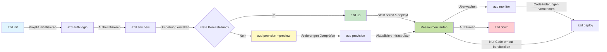
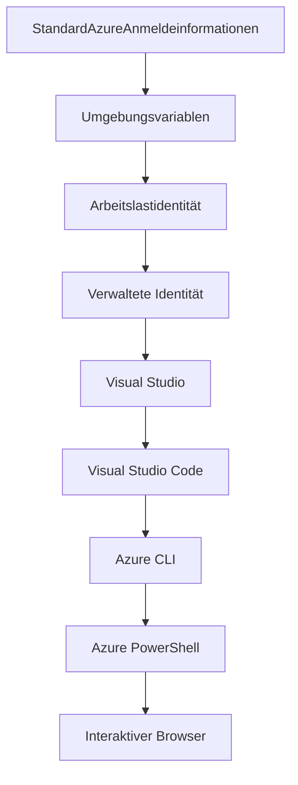

# AZD Grundlagen - Einführung in Azure Developer CLI

# AZD Grundlagen - Kernkonzepte und Grundlagen

**Kapitelübersicht:**
- **📚 Kursübersicht**: [AZD für Anfänger](../../README.md)
- **📖 Aktuelles Kapitel**: Kapitel 1 - Grundlagen & Schnellstart
- **⬅️ Vorheriges**: [Kursübersicht](../../README.md#-chapter-1-foundation--quick-start)
- **➡️ Nächstes**: [Installation & Einrichtung](installation.md)
- **🚀 Nächstes Kapitel**: [Kapitel 2: KI-gestützte Entwicklung](../microsoft-foundry/microsoft-foundry-integration.md)

## Einführung

In dieser Lektion lernen Sie die Azure Developer CLI (azd) kennen, ein leistungsstarkes Kommandozeilen-Tool, das Ihre Reise von der lokalen Entwicklung bis zur Bereitstellung in Azure beschleunigt. Sie erfahren die grundlegenden Konzepte, die Kernfunktionen und wie azd die Bereitstellung von cloud-nativen Anwendungen vereinfacht.

## Lernziele

Am Ende dieser Lektion werden Sie:
- Verstehen, was die Azure Developer CLI ist und welchen Hauptzweck sie erfüllt
- Die Kernkonzepte von Vorlagen, Umgebungen und Diensten kennenlernen
- Wichtige Funktionen wie vorlagenbasierte Entwicklung und Infrastructure as Code erkunden
- Die azd-Projektstruktur und den Workflow verstehen
- Bereit sein, azd für Ihre Entwicklungsumgebung zu installieren und zu konfigurieren

## Lernergebnisse

Nach Abschluss dieser Lektion können Sie:
- Die Rolle von azd in modernen Cloud-Entwicklungs-Workflows erklären
- Die Komponenten einer azd-Projektstruktur identifizieren
- Beschreiben, wie Vorlagen, Umgebungen und Dienste zusammenarbeiten
- Die Vorteile von Infrastructure as Code mit azd verstehen
- Verschiedene azd-Befehle und deren Zwecke erkennen

## Was ist Azure Developer CLI (azd)?

Azure Developer CLI (azd) ist ein Kommandozeilen-Tool, das entwickelt wurde, um Ihre Reise von der lokalen Entwicklung bis zur Bereitstellung in Azure zu beschleunigen. Es vereinfacht den Prozess des Erstellens, Bereitstellens und Verwalten von cloud-nativen Anwendungen auf Azure.

### 🎯 Warum AZD verwenden? Ein Vergleich aus der Praxis

Vergleichen wir die Bereitstellung einer einfachen Web-App mit Datenbank:

#### ❌ OHNE AZD: Manuelle Azure-Bereitstellung (30+ Minuten)

```bash
# Schritt 1: Ressourcengruppe erstellen
az group create --name myapp-rg --location eastus

# Schritt 2: App Service Plan erstellen
az appservice plan create --name myapp-plan \
  --resource-group myapp-rg \
  --sku B1 --is-linux

# Schritt 3: Web-App erstellen
az webapp create --name myapp-web-unique123 \
  --resource-group myapp-rg \
  --plan myapp-plan \
  --runtime "NODE:18-lts"

# Schritt 4: Cosmos DB-Konto erstellen (10-15 Minuten)
az cosmosdb create --name myapp-cosmos-unique123 \
  --resource-group myapp-rg \
  --kind MongoDB

# Schritt 5: Datenbank erstellen
az cosmosdb mongodb database create \
  --account-name myapp-cosmos-unique123 \
  --resource-group myapp-rg \
  --name tododb

# Schritt 6: Sammlung erstellen
az cosmosdb mongodb collection create \
  --account-name myapp-cosmos-unique123 \
  --resource-group myapp-rg \
  --database-name tododb \
  --name todos

# Schritt 7: Verbindungszeichenfolge abrufen
CONN_STR=$(az cosmosdb keys list \
  --name myapp-cosmos-unique123 \
  --resource-group myapp-rg \
  --type connection-strings \
  --query "connectionStrings[0].connectionString" -o tsv)

# Schritt 8: App-Einstellungen konfigurieren
az webapp config appsettings set \
  --name myapp-web-unique123 \
  --resource-group myapp-rg \
  --settings MONGODB_URI="$CONN_STR"

# Schritt 9: Protokollierung aktivieren
az webapp log config --name myapp-web-unique123 \
  --resource-group myapp-rg \
  --application-logging filesystem \
  --detailed-error-messages true

# Schritt 10: Application Insights einrichten
az monitor app-insights component create \
  --app myapp-insights \
  --location eastus \
  --resource-group myapp-rg

# Schritt 11: App Insights mit Web-App verknüpfen
INSTRUMENTATION_KEY=$(az monitor app-insights component show \
  --app myapp-insights \
  --resource-group myapp-rg \
  --query "instrumentationKey" -o tsv)

az webapp config appsettings set \
  --name myapp-web-unique123 \
  --resource-group myapp-rg \
  --settings APPINSIGHTS_INSTRUMENTATIONKEY="$INSTRUMENTATION_KEY"

# Schritt 12: Anwendung lokal erstellen
npm install
npm run build

# Schritt 13: Bereitstellungspaket erstellen
zip -r app.zip . -x "*.git*" "node_modules/*"

# Schritt 14: Anwendung bereitstellen
az webapp deployment source config-zip \
  --resource-group myapp-rg \
  --name myapp-web-unique123 \
  --src app.zip

# Schritt 15: Warten und hoffen, dass es funktioniert 🙏
# (Keine automatisierte Validierung, manuelles Testen erforderlich)
```

**Probleme:**
- ❌ Über 15 Befehle, die man sich merken und ausführen muss
- ❌ 30-45 Minuten manuelle Arbeit
- ❌ Fehleranfällig (Tippfehler, falsche Parameter)
- ❌ Verbindungsstrings im Terminalverlauf sichtbar
- ❌ Keine automatisierte Rücksetzung bei Fehlern
- ❌ Schwer für Teammitglieder zu replizieren
- ❌ Jedes Mal anders (nicht reproduzierbar)

#### ✅ MIT AZD: Automatisierte Bereitstellung (5 Befehle, 10-15 Minuten)

```bash
# Schritt 1: Von Vorlage initialisieren
azd init --template todo-nodejs-mongo

# Schritt 2: Authentifizieren
azd auth login

# Schritt 3: Umgebung erstellen
azd env new dev

# Schritt 4: Änderungen anzeigen (optional, aber empfohlen)
azd provision --preview

# Schritt 5: Alles bereitstellen
azd up

# ✨ Fertig! Alles ist bereitgestellt, konfiguriert und überwacht
```

**Vorteile:**
- ✅ **5 Befehle** statt über 15 manuelle Schritte
- ✅ **10-15 Minuten** Gesamtzeit (hauptsächlich Wartezeit für Azure)
- ✅ **Keine Fehler** - automatisiert und getestet
- ✅ **Sichere Verwaltung von Geheimnissen** über Key Vault
- ✅ **Automatische Rücksetzung** bei Fehlern
- ✅ **Vollständig reproduzierbar** - jedes Mal das gleiche Ergebnis
- ✅ **Teamfähig** - jeder kann mit denselben Befehlen bereitstellen
- ✅ **Infrastructure as Code** - versionskontrollierte Bicep-Vorlagen
- ✅ **Integriertes Monitoring** - Application Insights automatisch konfiguriert

### 📊 Zeit- und Fehlerreduzierung

| Metrik | Manuelle Bereitstellung | AZD-Bereitstellung | Verbesserung |
|:-------|:------------------------|:-------------------|:-------------|
| **Befehle** | Über 15 | 5 | 67% weniger |
| **Zeit** | 30-45 Min | 10-15 Min | 60% schneller |
| **Fehlerrate** | ~40% | <5% | 88% Reduktion |
| **Konsistenz** | Niedrig (manuell) | 100% (automatisiert) | Perfekt |
| **Team-Einarbeitung** | 2-4 Stunden | 30 Minuten | 75% schneller |
| **Rücksetzzeit** | Über 30 Min (manuell) | 2 Min (automatisiert) | 93% schneller |

## Kernkonzepte

### Vorlagen
Vorlagen sind die Grundlage von azd. Sie enthalten:
- **Anwendungscode** - Ihren Quellcode und Abhängigkeiten
- **Infrastrukturdefinitionen** - Azure-Ressourcen definiert in Bicep oder Terraform
- **Konfigurationsdateien** - Einstellungen und Umgebungsvariablen
- **Bereitstellungsskripte** - Automatisierte Bereitstellungs-Workflows

### Umgebungen
Umgebungen repräsentieren verschiedene Bereitstellungsziele:
- **Entwicklung** - Für Tests und Entwicklung
- **Staging** - Vorproduktionsumgebung
- **Produktion** - Live-Produktionsumgebung

Jede Umgebung hat ihre eigenen:
- Azure-Ressourcengruppe
- Konfigurationseinstellungen
- Bereitstellungsstatus

### Dienste
Dienste sind die Bausteine Ihrer Anwendung:
- **Frontend** - Webanwendungen, SPAs
- **Backend** - APIs, Microservices
- **Datenbank** - Datenlösungen
- **Speicher** - Datei- und Blob-Speicher

## Wichtige Funktionen

### 1. Vorlagenbasierte Entwicklung
```bash
# Verfügbare Vorlagen durchsuchen
azd template list

# Aus einer Vorlage initialisieren
azd init --template <template-name>
```

### 2. Infrastructure as Code
- **Bicep** - Azure-spezifische Sprache
- **Terraform** - Multi-Cloud-Infrastruktur-Tool
- **ARM-Vorlagen** - Azure Resource Manager-Vorlagen

### 3. Integrierte Workflows
```bash
# Vollständiger Bereitstellungs-Workflow
azd up            # Bereitstellen + Bereitstellen, dies ist beim ersten Setup ohne Eingriff

# 🧪 NEU: Vorschau auf Infrastrukturänderungen vor der Bereitstellung (SICHER)
azd provision --preview    # Simulation der Infrastruktur-Bereitstellung ohne Änderungen vorzunehmen

azd provision     # Azure-Ressourcen erstellen, wenn Sie die Infrastruktur aktualisieren, verwenden Sie dies
azd deploy        # Anwendungs-Code bereitstellen oder Anwendungs-Code nach einem Update erneut bereitstellen
azd down          # Ressourcen bereinigen
```

#### 🛡️ Sichere Infrastrukturplanung mit Vorschau
Der Befehl `azd provision --preview` ist ein Game-Changer für sichere Bereitstellungen:
- **Analyse im Trockendurchlauf** - Zeigt, was erstellt, geändert oder gelöscht wird
- **Null Risiko** - Es werden keine tatsächlichen Änderungen an Ihrer Azure-Umgebung vorgenommen
- **Teamzusammenarbeit** - Teilen Sie Vorschauergebnisse vor der Bereitstellung
- **Kostenabschätzung** - Verstehen Sie Ressourcenkosten vor der Verpflichtung

```bash
# Beispielvorschau-Workflow
azd provision --preview           # Sehen, was sich ändern wird
# Überprüfen Sie die Ausgabe, besprechen Sie sie mit dem Team
azd provision                     # Änderungen mit Zuversicht anwenden
```

### 📊 Visualisierung: AZD-Entwicklungsworkflow


**Workflow-Erklärung:**
1. **Init** - Mit Vorlage oder neuem Projekt starten
2. **Auth** - Mit Azure authentifizieren
3. **Umgebung** - Isolierte Bereitstellungsumgebung erstellen
4. **Vorschau** - 🆕 Infrastrukturänderungen immer zuerst vorschauen (sichere Praxis)
5. **Provision** - Azure-Ressourcen erstellen/aktualisieren
6. **Deploy** - Anwendungscode bereitstellen
7. **Monitor** - Anwendungsleistung überwachen
8. **Iterate** - Änderungen vornehmen und Code erneut bereitstellen
9. **Cleanup** - Ressourcen entfernen, wenn fertig

### 4. Umweltmanagement
```bash
# Erstellen und Verwalten von Umgebungen
azd env new <environment-name>
azd env select <environment-name>
azd env list
```

## 📁 Projektstruktur

Eine typische azd-Projektstruktur:
```
my-app/
├── .azd/                    # azd configuration
│   └── config.json
├── .azure/                  # Azure deployment artifacts
├── .devcontainer/          # Development container config
├── .github/workflows/      # GitHub Actions
├── .vscode/               # VS Code settings
├── infra/                 # Infrastructure code
│   ├── main.bicep        # Main infrastructure template
│   ├── main.parameters.json
│   └── modules/          # Reusable modules
├── src/                  # Application source code
│   ├── api/             # Backend services
│   └── web/             # Frontend application
├── azure.yaml           # azd project configuration
└── README.md
```

## 🔧 Konfigurationsdateien

### azure.yaml
Die Hauptkonfigurationsdatei des Projekts:
```yaml
name: my-awesome-app
metadata:
  template: my-template@1.0.0

services:
  web:
    project: ./src/web
    language: js
    host: appservice
  api:
    project: ./src/api
    language: js
    host: appservice

hooks:
  preprovision:
    shell: pwsh
    run: echo "Preparing to provision..."
```

### .azure/config.json
Umgebungsspezifische Konfiguration:
```json
{
  "version": 1,
  "defaultEnvironment": "dev",
  "environments": {
    "dev": {
      "subscriptionId": "your-subscription-id",
      "location": "eastus"
    }
  }
}
```

## 🎪 Häufige Workflows mit praktischen Übungen

> **💡 Lerntipp:** Folgen Sie diesen Übungen der Reihe nach, um Ihre AZD-Fähigkeiten schrittweise aufzubauen.

### 🎯 Übung 1: Ihr erstes Projekt initialisieren

**Ziel:** Ein AZD-Projekt erstellen und dessen Struktur erkunden

**Schritte:**
```bash
# Verwenden Sie eine bewährte Vorlage
azd init --template todo-nodejs-mongo

# Erkunden Sie die generierten Dateien
ls -la  # Alle Dateien einschließlich versteckter anzeigen

# Erstellte Schlüsseldateien:
# - azure.yaml (Hauptkonfiguration)
# - infra/ (Infrastrukturcode)
# - src/ (Anwendungscode)
```

**✅ Erfolg:** Sie haben azure.yaml, infra/ und src/ Verzeichnisse

---

### 🎯 Übung 2: Bereitstellung in Azure

**Ziel:** End-to-End-Bereitstellung abschließen

**Schritte:**
```bash
# 1. Authentifizieren
az login && azd auth login

# 2. Umgebung erstellen
azd env new dev
azd env set AZURE_LOCATION eastus

# 3. Änderungen anzeigen (EMPFOHLEN)
azd provision --preview

# 4. Alles bereitstellen
azd up

# 5. Bereitstellung überprüfen
azd show    # App-URL anzeigen
```

**Erwartete Zeit:** 10-15 Minuten  
**✅ Erfolg:** Anwendungs-URL öffnet sich im Browser

---

### 🎯 Übung 3: Mehrere Umgebungen

**Ziel:** Bereitstellung in Entwicklung und Staging

**Schritte:**
```bash
# Bereits dev vorhanden, staging erstellen
azd env new staging
azd env set AZURE_LOCATION westus2
azd up

# Zwischen ihnen wechseln
azd env list
azd env select dev
```

**✅ Erfolg:** Zwei separate Ressourcengruppen im Azure-Portal

---

### 🛡️ Sauberer Neustart: `azd down --force --purge`

Wenn Sie einen vollständigen Reset benötigen:

```bash
azd down --force --purge
```

**Was es macht:**
- `--force`: Keine Bestätigungsaufforderungen
- `--purge`: Löscht alle lokalen Zustände und Azure-Ressourcen

**Verwendung bei:**
- Bereitstellung ist mitten im Prozess fehlgeschlagen
- Wechsel zwischen Projekten
- Frischer Start erforderlich

---

## 🎪 Ursprüngliche Workflow-Referenz

### Neues Projekt starten
```bash
# Methode 1: Vorhandene Vorlage verwenden
azd init --template todo-nodejs-mongo

# Methode 2: Von Grund auf neu beginnen
azd init

# Methode 3: Aktuelles Verzeichnis verwenden
azd init .
```

### Entwicklungszyklus
```bash
# Entwicklungsumgebung einrichten
azd auth login
azd env new dev
azd env select dev

# Alles bereitstellen
azd up

# Änderungen vornehmen und erneut bereitstellen
azd deploy

# Aufräumen, wenn fertig
azd down --force --purge # Der Befehl in der Azure Developer CLI ist ein **harter Reset** für Ihre Umgebung – besonders nützlich, wenn Sie fehlgeschlagene Bereitstellungen beheben, verwaiste Ressourcen bereinigen oder sich auf eine frische Bereitstellung vorbereiten.
```

## Verständnis von `azd down --force --purge`
Der Befehl `azd down --force --purge` ist eine leistungsstarke Möglichkeit, Ihre azd-Umgebung und alle zugehörigen Ressourcen vollständig abzubauen. Hier ist eine Aufschlüsselung, was jede Option bewirkt:
```
--force
```
- Überspringt Bestätigungsaufforderungen.
- Nützlich für Automatisierung oder Skripte, bei denen manuelle Eingaben nicht möglich sind.
- Stellt sicher, dass der Abbau ohne Unterbrechung fortgesetzt wird, selbst wenn die CLI Inkonsistenzen erkennt.

```
--purge
```
Löscht **alle zugehörigen Metadaten**, einschließlich:
Umgebungsstatus
Lokaler `.azure`-Ordner
Zwischengespeicherte Bereitstellungsinformationen
Verhindert, dass azd sich an frühere Bereitstellungen "erinnert", was Probleme wie nicht übereinstimmende Ressourcengruppen oder veraltete Registry-Referenzen verursachen kann.

### Warum beide verwenden?
Wenn Sie mit `azd up` aufgrund verbleibender Zustände oder teilweiser Bereitstellungen nicht weiterkommen, sorgt diese Kombination für einen **sauberen Neustart**.

Besonders hilfreich nach manuellen Ressourcendeletionen im Azure-Portal oder beim Wechsel von Vorlagen, Umgebungen oder Ressourcengruppennamen.

### Verwaltung mehrerer Umgebungen
```bash
# Erstelle Staging-Umgebung
azd env new staging
azd env select staging
azd up

# Zurück zu Entwicklung wechseln
azd env select dev

# Umgebungen vergleichen
azd env list
```

## 🔐 Authentifizierung und Anmeldeinformationen

Das Verständnis der Authentifizierung ist entscheidend für erfolgreiche azd-Bereitstellungen. Azure verwendet mehrere Authentifizierungsmethoden, und azd nutzt dieselbe Anmeldekette wie andere Azure-Tools.

### Azure CLI-Authentifizierung (`az login`)

Bevor Sie azd verwenden, müssen Sie sich bei Azure authentifizieren. Die häufigste Methode ist die Verwendung der Azure CLI:

```bash
# Interaktives Login (öffnet Browser)
az login

# Anmeldung mit spezifischem Mandanten
az login --tenant <tenant-id>

# Anmeldung mit Dienstprinzipal
az login --service-principal -u <app-id> -p <password> --tenant <tenant-id>

# Aktuellen Anmeldestatus überprüfen
az account show

# Verfügbare Abonnements auflisten
az account list --output table

# Standardabonnement festlegen
az account set --subscription <subscription-id>
```

### Authentifizierungsablauf
1. **Interaktives Login**: Öffnet Ihren Standardbrowser zur Authentifizierung
2. **Gerätecode-Ablauf**: Für Umgebungen ohne Browserzugriff
3. **Service Principal**: Für Automatisierung und CI/CD-Szenarien
4. **Managed Identity**: Für Azure-gehostete Anwendungen

### DefaultAzureCredential-Kette

`DefaultAzureCredential` ist ein Anmeldetyp, der eine vereinfachte Authentifizierungserfahrung bietet, indem automatisch mehrere Anmeldequellen in einer bestimmten Reihenfolge ausprobiert werden:

#### Reihenfolge der Anmeldekette

#### 1. Umgebungsvariablen
```bash
# Umgebungsvariablen für Service Principal festlegen
export AZURE_CLIENT_ID="<app-id>"
export AZURE_CLIENT_SECRET="<password>"
export AZURE_TENANT_ID="<tenant-id>"
```

#### 2. Workload Identity (Kubernetes/GitHub Actions)
Automatisch verwendet in:
- Azure Kubernetes Service (AKS) mit Workload Identity
- GitHub Actions mit OIDC-Föderation
- Andere föderierte Identitätsszenarien

#### 3. Managed Identity
Für Azure-Ressourcen wie:
- Virtuelle Maschinen
- App Service
- Azure Functions
- Container Instances

```bash
# Überprüfen, ob auf einer Azure-Ressource mit verwalteter Identität ausgeführt wird
az account show --query "user.type" --output tsv
# Gibt zurück: "servicePrincipal", wenn eine verwaltete Identität verwendet wird
```

#### 4. Integration von Entwickler-Tools
- **Visual Studio**: Verwendet automatisch angemeldetes Konto
- **VS Code**: Verwendet Anmeldeinformationen der Azure Account-Erweiterung
- **Azure CLI**: Verwendet `az login`-Anmeldeinformationen (am häufigsten für lokale Entwicklung)

### AZD-Authentifizierungseinrichtung

```bash
# Methode 1: Verwenden Sie Azure CLI (Empfohlen für die Entwicklung)
az login
azd auth login  # Verwendet vorhandene Azure CLI-Anmeldeinformationen

# Methode 2: Direkte azd-Authentifizierung
azd auth login --use-device-code  # Für kopflose Umgebungen

# Methode 3: Überprüfen Sie den Authentifizierungsstatus
azd auth login --check-status

# Methode 4: Abmelden und erneut authentifizieren
azd auth logout
azd auth login
```

### Authentifizierungs-Best Practices

#### Für lokale Entwicklung
```bash
# 1. Mit Azure CLI anmelden
az login

# 2. Richtige Abonnement überprüfen
az account show
az account set --subscription "Your Subscription Name"

# 3. Azd mit vorhandenen Anmeldeinformationen verwenden
azd auth login
```

#### Für CI/CD-Pipelines
```yaml
# GitHub Actions example
- name: Azure Login
  uses: azure/login@v1
  with:
    creds: ${{ secrets.AZURE_CREDENTIALS }}

- name: Deploy with azd
  run: |
    azd auth login --client-id ${{ secrets.AZURE_CLIENT_ID }} \
                    --client-secret ${{ secrets.AZURE_CLIENT_SECRET }} \
                    --tenant-id ${{ secrets.AZURE_TENANT_ID }}
    azd up --no-prompt
```

#### Für Produktionsumgebungen
- Verwenden Sie **Managed Identity**, wenn Sie auf Azure-Ressourcen laufen
- Verwenden Sie **Service Principal** für Automatisierungsszenarien
- Vermeiden Sie das Speichern von Anmeldeinformationen im Code oder in Konfigurationsdateien
- Verwenden Sie **Azure Key Vault** für sensible Konfigurationen

### Häufige Authentifizierungsprobleme und Lösungen

#### Problem: "Kein Abonnement gefunden"
```bash
# Lösung: Standardabonnement festlegen
az account list --output table
az account set --subscription "<subscription-id>"
azd env set AZURE_SUBSCRIPTION_ID "<subscription-id>"
```

#### Problem: "Unzureichende Berechtigungen"
```bash
# Lösung: Überprüfen und zuweisen der erforderlichen Rollen
az role assignment list --assignee $(az account show --query user.name --output tsv)

# Allgemein erforderliche Rollen:
# - Mitwirkender (für Ressourcenmanagement)
# - Benutzerzugriffsadministrator (für Rollenzuweisungen)
```

#### Problem: "Token abgelaufen"
```bash
# Lösung: Erneut authentifizieren
az logout
az login
azd auth logout
azd auth login
```

### Authentifizierung in verschiedenen Szenarien

#### Lokale Entwicklung
```bash
# Persönliches Entwicklungskonto
az login
azd auth login
```

#### Team-Entwicklung
```bash
# Spezifischen Mandanten für die Organisation verwenden
az login --tenant contoso.onmicrosoft.com
azd auth login
```

#### Multi-Tenant-Szenarien
```bash
# Zwischen Mandanten wechseln
az login --tenant tenant1.onmicrosoft.com
# In Mandant 1 bereitstellen
azd up

az login --tenant tenant2.onmicrosoft.com  
# In Mandant 2 bereitstellen
azd up
```

### Sicherheitsüberlegungen

1. **Anmeldeinformationsspeicherung**: Niemals Anmeldeinformationen im Quellcode speichern
2. **Einschränkung des Umfangs**: Verwenden Sie das Prinzip der minimalen Rechte für Service Principals
3. **Token-Rotation**: Service Principal-Geheimnisse regelmäßig rotieren
4. **Audit-Trail**: Authentifizierungs- und Bereitstellungsaktivitäten überwachen
5. **Netzwerksicherheit**: Wenn möglich, private Endpunkte verwenden

### Fehlerbehebung bei der Authentifizierung

```bash
# Debuggen von Authentifizierungsproblemen
azd auth login --check-status
az account show
az account get-access-token

# Allgemeine Diagnosebefehle
whoami                          # Aktueller Benutzerkontext
az ad signed-in-user show      # Azure AD-Benutzerdetails
az group list                  # Ressourcen-Zugriff testen
```

## Verständnis von `azd down --force --purge`

### Entdeckung
```bash
azd template list              # Vorlagen durchsuchen
azd template show <template>   # Vorlagendetails
azd init --help               # Initialisierungsoptionen
```

### Projektmanagement
```bash
azd show                     # Projektübersicht
azd env show                 # Aktuelle Umgebung
azd config list             # Konfigurationseinstellungen
```

### Monitoring
```bash
azd monitor                  # Azure-Portal öffnen
azd pipeline config          # CI/CD einrichten
azd logs                     # Anwendungsprotokolle anzeigen
```

## Best Practices

### 1. Sinnvolle Namen verwenden
```bash
# Gut
azd env new production-east
azd init --template web-app-secure

# Vermeiden
azd env new env1
azd init --template template1
```

### 2. Vorlagen nutzen
- Mit bestehenden Vorlagen starten
- Für Ihre Bedürfnisse anpassen
- Wiederverwendbare Vorlagen für Ihre Organisation erstellen

### 3. Umweltisolierung
- Separate Umgebungen für Entwicklung/Staging/Produktion verwenden
- Niemals direkt von der lokalen Maschine in die Produktion bereitstellen
- CI/CD-Pipelines für Produktionsbereitstellungen verwenden

### 4. Konfigurationsmanagement
- Umgebungsvariablen für sensible Daten verwenden
- Konfiguration in der Versionskontrolle halten
- Umgebungsspezifische Einstellungen dokumentieren

## Lernfortschritt

### Anfänger (Woche 1-2)
1. azd installieren und authentifizieren
2. Eine einfache Vorlage bereitstellen
3. Projektstruktur verstehen
4. Grundlegende Befehle lernen (up, down, deploy)

### Fortgeschrittene (Woche 3-4)
1. Vorlagen anpassen
2. Mehrere Umgebungen verwalten
3. Infrastrukturcode verstehen
4. CI/CD-Pipelines einrichten

### Experten (Woche 5+)
1. Eigene Vorlagen erstellen
2. Fortgeschrittene Infrastrukturmuster
3. Multi-Region-Bereitstellungen
4. Konfigurationen auf Unternehmensniveau

## Nächste Schritte

**📖 Lernen Sie weiter in Kapitel 1:**
- [Installation & Einrichtung](installation.md) - Azd installieren und konfigurieren
- [Ihr erstes Projekt](first-project.md) - Praktisches Tutorial abschließen
- [Konfigurationsleitfaden](configuration.md) - Erweiterte Konfigurationsoptionen

**🎯 Bereit für das nächste Kapitel?**
- [Kapitel 2: AI-First-Entwicklung](../microsoft-foundry/microsoft-foundry-integration.md) - Beginnen Sie mit der Entwicklung von KI-Anwendungen

## Zusätzliche Ressourcen

- [Azure Developer CLI Übersicht](https://learn.microsoft.com/en-us/azure/developer/azure-developer-cli/)
- [Vorlagen-Galerie](https://azure.github.io/awesome-azd/)
- [Community-Beispiele](https://github.com/Azure-Samples)

---

## 🙋 Häufig gestellte Fragen

### Allgemeine Fragen

**F: Was ist der Unterschied zwischen AZD und Azure CLI?**

A: Azure CLI (`az`) dient zur Verwaltung einzelner Azure-Ressourcen. AZD (`azd`) dient zur Verwaltung ganzer Anwendungen:

```bash
# Azure CLI - Ressourcenverwaltung auf niedriger Ebene
az webapp create --name myapp --resource-group rg
az sql server create --name myserver --resource-group rg
# ...viele weitere Befehle erforderlich

# AZD - Verwaltung auf Anwendungsebene
azd up  # Stellt die gesamte App mit allen Ressourcen bereit
```

**Stellen Sie es sich so vor:**
- `az` = Arbeiten mit einzelnen Lego-Steinen
- `azd` = Arbeiten mit kompletten Lego-Sets

---

**F: Muss ich Bicep oder Terraform kennen, um AZD zu nutzen?**

A: Nein! Beginnen Sie mit Vorlagen:
```bash
# Vorhandene Vorlage verwenden - keine IaC-Kenntnisse erforderlich
azd init --template todo-nodejs-mongo
azd up
```

Sie können später Bicep lernen, um die Infrastruktur anzupassen. Vorlagen bieten funktionierende Beispiele zum Lernen.

---

**F: Wie viel kostet es, AZD-Vorlagen auszuführen?**

A: Die Kosten variieren je nach Vorlage. Die meisten Entwicklungs-Vorlagen kosten $50-150/Monat:

```bash
# Vorschaukosten vor der Bereitstellung
azd provision --preview

# Immer aufräumen, wenn nicht in Gebrauch
azd down --force --purge  # Entfernt alle Ressourcen
```

**Tipp:** Nutzen Sie kostenlose Tarife, wo verfügbar:
- App Service: F1 (kostenloser) Tarif
- Azure OpenAI: 50.000 Tokens/Monat kostenlos
- Cosmos DB: 1000 RU/s kostenloser Tarif

---

**F: Kann ich AZD mit bestehenden Azure-Ressourcen nutzen?**

A: Ja, aber es ist einfacher, neu zu starten. AZD funktioniert am besten, wenn es den gesamten Lebenszyklus verwaltet. Für bestehende Ressourcen:

```bash
# Option 1: Vorhandene Ressourcen importieren (fortgeschritten)
azd init
# Dann infra/ ändern, um auf vorhandene Ressourcen zu verweisen

# Option 2: Neu beginnen (empfohlen)
azd init --template matching-your-stack
azd up  # Erstellt eine neue Umgebung
```

---

**F: Wie teile ich mein Projekt mit Teamkollegen?**

A: Committen Sie das AZD-Projekt in Git (aber NICHT den .azure-Ordner):

```bash
# Bereits standardmäßig in .gitignore
.azure/        # Enthält Geheimnisse und Umgebungsdaten
*.env          # Umgebungsvariablen

# Teammitglieder damals:
git clone <your-repo>
azd auth login
azd env new <their-name>-dev
azd up
```

Jeder erhält identische Infrastruktur aus denselben Vorlagen.

---

### Fragen zur Fehlerbehebung

**F: "azd up" ist auf halbem Weg fehlgeschlagen. Was soll ich tun?**

A: Überprüfen Sie den Fehler, beheben Sie ihn und versuchen Sie es erneut:

```bash
# Detaillierte Protokolle anzeigen
azd show

# Häufige Lösungen:

# 1. Wenn das Kontingent überschritten wurde:
azd env set AZURE_LOCATION "westus2"  # Versuchen Sie eine andere Region

# 2. Wenn ein Ressourcenname-Konflikt vorliegt:
azd down --force --purge  # Alles zurücksetzen
azd up  # Erneut versuchen

# 3. Wenn die Authentifizierung abgelaufen ist:
az login
azd auth login
azd up
```

**Häufigstes Problem:** Falsches Azure-Abonnement ausgewählt
```bash
az account list --output table
az account set --subscription "<correct-subscription>"
```

---

**F: Wie deploye ich nur Codeänderungen ohne Neu-Provisionierung?**

A: Verwenden Sie `azd deploy` anstelle von `azd up`:

```bash
azd up          # Erstes Mal: Bereitstellung + Deployment (langsam)

# Codeänderungen vornehmen...

azd deploy      # Nachfolgende Male: nur Deployment (schnell)
```

Geschwindigkeitsvergleich:
- `azd up`: 10-15 Minuten (provisioniert Infrastruktur)
- `azd deploy`: 2-5 Minuten (nur Code)

---

**F: Kann ich die Infrastrukturvorlagen anpassen?**

A: Ja! Bearbeiten Sie die Bicep-Dateien im `infra/`-Ordner:

```bash
# Nach azd init
cd infra/
code main.bicep  # In VS Code bearbeiten

# Änderungen anzeigen
azd provision --preview

# Änderungen anwenden
azd provision
```

**Tipp:** Beginnen Sie klein - ändern Sie zuerst die SKUs:
```bicep
// infra/main.bicep
sku: {
  name: 'B1'  // Change to 'P1V2' for production
}
```

---

**F: Wie lösche ich alles, was AZD erstellt hat?**

A: Ein Befehl entfernt alle Ressourcen:

```bash
azd down --force --purge

# Dies löscht:
# - Alle Azure-Ressourcen
# - Ressourcengruppe
# - Lokalen Umgebungszustand
# - Zwischengespeicherte Bereitstellungsdaten
```

**Führen Sie dies immer aus, wenn:**
- Sie eine Vorlage getestet haben
- Zu einem anderen Projekt wechseln
- Frisch starten möchten

**Kostenersparnis:** Löschen nicht genutzter Ressourcen = $0 Gebühren

---

**F: Was passiert, wenn ich Ressourcen im Azure-Portal versehentlich gelöscht habe?**

A: Der AZD-Status kann aus dem Gleichgewicht geraten. Ansatz: Alles neu starten:

```bash
# 1. Lokalen Zustand entfernen
azd down --force --purge

# 2. Neu starten
azd up

# Alternative: Lassen Sie AZD erkennen und beheben
azd provision  # Wird fehlende Ressourcen erstellen
```

---

### Fortgeschrittene Fragen

**F: Kann ich AZD in CI/CD-Pipelines verwenden?**

A: Ja! Beispiel für GitHub Actions:

```yaml
# .github/workflows/deploy.yml
name: Deploy with AZD

on:
  push:
    branches: [main]

jobs:
  deploy:
    runs-on: ubuntu-latest
    steps:
      - uses: actions/checkout@v2
      
      - name: Install azd
        run: curl -fsSL https://aka.ms/install-azd.sh | bash
      
      - name: Azure Login
        run: |
          azd auth login \
            --client-id ${{ secrets.AZURE_CLIENT_ID }} \
            --client-secret ${{ secrets.AZURE_CLIENT_SECRET }} \
            --tenant-id ${{ secrets.AZURE_TENANT_ID }}
      
      - name: Deploy
        run: azd up --no-prompt
```

---

**F: Wie gehe ich mit Geheimnissen und sensiblen Daten um?**

A: AZD integriert sich automatisch mit Azure Key Vault:

```bash
# Geheimnisse werden im Key Vault gespeichert, nicht im Code
azd env set DATABASE_PASSWORD "$(openssl rand -base64 32)"

# AZD automatisch:
# 1. Erstellt Key Vault
# 2. Speichert Geheimnis
# 3. Gewährt App-Zugriff über Managed Identity
# 4. Injiziert zur Laufzeit
```

**Niemals committen:**
- `.azure/`-Ordner (enthält Umgebungsdaten)
- `.env`-Dateien (lokale Geheimnisse)
- Verbindungsstrings

---

**F: Kann ich in mehrere Regionen deployen?**

A: Ja, erstellen Sie eine Umgebung pro Region:

```bash
# Ost-US-Umgebung
azd env new prod-eastus
azd env set AZURE_LOCATION eastus
azd up

# Westeuropa-Umgebung
azd env new prod-westeurope
azd env set AZURE_LOCATION westeurope
azd up

# Jede Umgebung ist unabhängig
azd env list
```

Für echte Multi-Region-Apps passen Sie die Bicep-Vorlagen an, um gleichzeitig in mehrere Regionen zu deployen.

---

**F: Wo bekomme ich Hilfe, wenn ich nicht weiterkomme?**

1. **AZD-Dokumentation:** https://learn.microsoft.com/azure/developer/azure-developer-cli/
2. **GitHub-Issues:** https://github.com/Azure/azure-dev/issues
3. **Discord:** [Azure Discord](https://discord.gg/microsoft-azure) - #azure-developer-cli Kanal
4. **Stack Overflow:** Tag `azure-developer-cli`
5. **Dieser Kurs:** [Leitfaden zur Fehlerbehebung](../troubleshooting/common-issues.md)

**Tipp:** Vor dem Fragen ausführen:
```bash
azd show       # Zeigt den aktuellen Zustand
azd version    # Zeigt Ihre Version
```
Fügen Sie diese Informationen Ihrer Frage hinzu, um schneller Hilfe zu erhalten.

---

## 🎓 Was kommt als Nächstes?

Sie verstehen jetzt die Grundlagen von AZD. Wählen Sie Ihren Weg:

### 🎯 Für Anfänger:
1. **Weiter:** [Installation & Einrichtung](installation.md) - Installieren Sie AZD auf Ihrem Rechner
2. **Dann:** [Ihr erstes Projekt](first-project.md) - Deployen Sie Ihre erste App
3. **Üben:** Schließen Sie alle 3 Übungen in dieser Lektion ab

### 🚀 Für KI-Entwickler:
1. **Überspringen zu:** [Kapitel 2: AI-First-Entwicklung](../microsoft-foundry/microsoft-foundry-integration.md)
2. **Deployen:** Beginnen Sie mit `azd init --template get-started-with-ai-chat`
3. **Lernen:** Entwickeln Sie, während Sie deployen

### 🏗️ Für erfahrene Entwickler:
1. **Überprüfen:** [Konfigurationsleitfaden](configuration.md) - Erweiterte Einstellungen
2. **Erkunden:** [Infrastructure as Code](../deployment/provisioning.md) - Bicep-Vertiefung
3. **Erstellen:** Erstellen Sie benutzerdefinierte Vorlagen für Ihren Stack

---

**Kapitel-Navigation:**
- **📚 Kursübersicht**: [AZD für Anfänger](../../README.md)
- **📖 Aktuelles Kapitel**: Kapitel 1 - Grundlagen & Schnellstart  
- **⬅️ Vorheriges**: [Kursübersicht](../../README.md#-chapter-1-foundation--quick-start)
- **➡️ Nächstes**: [Installation & Einrichtung](installation.md)
- **🚀 Nächstes Kapitel**: [Kapitel 2: AI-First-Entwicklung](../microsoft-foundry/microsoft-foundry-integration.md)

---

<!-- CO-OP TRANSLATOR DISCLAIMER START -->
**Haftungsausschluss**:  
Dieses Dokument wurde mit dem KI-Übersetzungsdienst [Co-op Translator](https://github.com/Azure/co-op-translator) übersetzt. Obwohl wir uns um Genauigkeit bemühen, beachten Sie bitte, dass automatisierte Übersetzungen Fehler oder Ungenauigkeiten enthalten können. Das Originaldokument in seiner ursprünglichen Sprache sollte als maßgebliche Quelle betrachtet werden. Für kritische Informationen wird eine professionelle menschliche Übersetzung empfohlen. Wir übernehmen keine Haftung für Missverständnisse oder Fehlinterpretationen, die aus der Nutzung dieser Übersetzung entstehen.
<!-- CO-OP TRANSLATOR DISCLAIMER END -->