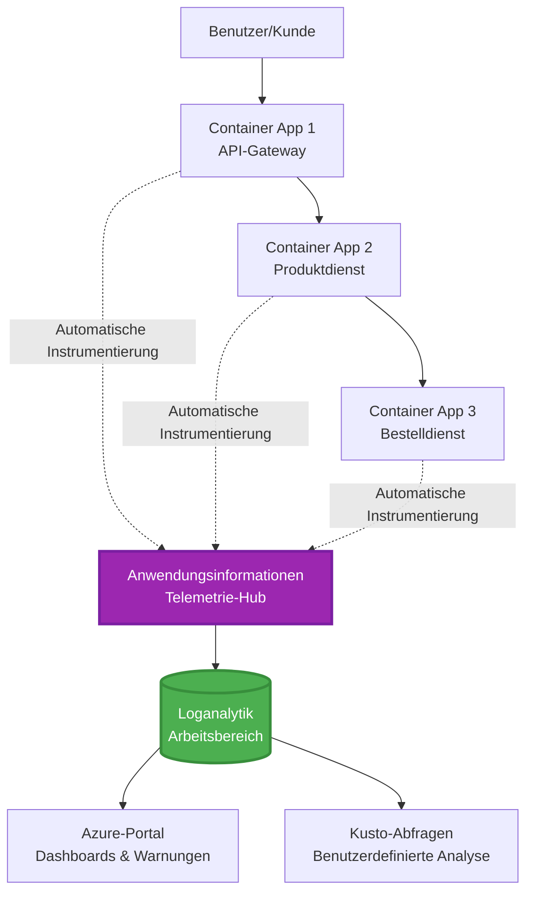

<!--
CO_OP_TRANSLATOR_METADATA:
{
  "original_hash": "e5aa37cdb6378c09099500ac31600b8c",
  "translation_date": "2025-11-20T02:35:04+00:00",
  "source_file": "docs/pre-deployment/application-insights.md",
  "language_code": "de"
}
-->
# Integration von Application Insights mit AZD

⏱️ **Geschätzte Zeit**: 40-50 Minuten | 💰 **Kostenaufwand**: ~5-15 €/Monat | ⭐ **Komplexität**: Mittel

**📚 Lernpfad:**
- ← Vorher: [Preflight Checks](preflight-checks.md) - Validierung vor der Bereitstellung
- 🎯 **Hier bist du**: Integration von Application Insights (Überwachung, Telemetrie, Debugging)
- → Weiter: [Deployment Guide](../deployment/deployment-guide.md) - Bereitstellung in Azure
- 🏠 [Kursübersicht](../../README.md)

---

## Was du lernen wirst

Nach Abschluss dieser Lektion wirst du:
- **Application Insights** automatisch in AZD-Projekte integrieren
- **Verteiltes Tracing** für Microservices konfigurieren
- **Benutzerdefinierte Telemetrie** (Metriken, Ereignisse, Abhängigkeiten) implementieren
- **Live-Metriken** für Echtzeitüberwachung einrichten
- **Warnungen und Dashboards** aus AZD-Bereitstellungen erstellen
- Produktionsprobleme mit **Telemetrieabfragen** debuggen
- **Kosten und Sampling-Strategien** optimieren
- **AI/LLM-Anwendungen** überwachen (Tokens, Latenz, Kosten)

## Warum Application Insights mit AZD wichtig ist

### Die Herausforderung: Produktionsüberwachung

**Ohne Application Insights:**
```
❌ No visibility into production behavior
❌ Manual log aggregation across services
❌ Reactive debugging (wait for customer complaints)
❌ No performance metrics
❌ Cannot trace requests across services
❌ Unknown failure rates and bottlenecks
```

**Mit Application Insights + AZD:**
```
✅ Automatic telemetry collection
✅ Centralized logs from all services
✅ Proactive issue detection
✅ End-to-end request tracing
✅ Performance metrics and insights
✅ Real-time dashboards
✅ AZD provisions everything automatically
```

**Analogie**: Application Insights ist wie ein "Blackbox"-Flugschreiber + Cockpit-Dashboard für deine Anwendung. Du siehst alles, was in Echtzeit passiert, und kannst jeden Vorfall erneut analysieren.

---

## Architekturübersicht

### Application Insights in der AZD-Architektur


### Was automatisch überwacht wird

| Telemetrie-Typ | Was erfasst wird | Anwendungsfall |
|----------------|------------------|----------------|
| **Anfragen** | HTTP-Anfragen, Statuscodes, Dauer | API-Leistungsüberwachung |
| **Abhängigkeiten** | Externe Aufrufe (DB, APIs, Speicher) | Engpässe identifizieren |
| **Ausnahmen** | Nicht behandelte Fehler mit Stack-Traces | Fehlerbehebung |
| **Benutzerdefinierte Ereignisse** | Geschäftsvorfälle (Anmeldung, Kauf) | Analysen und Funnels |
| **Metriken** | Leistungsindikatoren, benutzerdefinierte Metriken | Kapazitätsplanung |
| **Traces** | Log-Nachrichten mit Schweregrad | Debugging und Auditing |
| **Verfügbarkeit** | Tests zur Betriebszeit und Antwortzeit | SLA-Überwachung |

---

## Voraussetzungen

### Erforderliche Tools

```bash
# Überprüfen Sie Azure Developer CLI
azd version
# ✅ Erwartet: azd Version 1.0.0 oder höher

# Überprüfen Sie Azure CLI
az --version
# ✅ Erwartet: azure-cli 2.50.0 oder höher
```

### Azure-Voraussetzungen

- Aktives Azure-Abonnement
- Berechtigungen zum Erstellen von:
  - Application Insights-Ressourcen
  - Log Analytics-Arbeitsbereichen
  - Container-Apps
  - Ressourcengruppen

### Wissensvoraussetzungen

Du solltest abgeschlossen haben:
- [AZD Basics](../getting-started/azd-basics.md) - Grundlegende AZD-Konzepte
- [Configuration](../getting-started/configuration.md) - Einrichtung der Umgebung
- [First Project](../getting-started/first-project.md) - Grundlegende Bereitstellung

---

## Lektion 1: Automatische Application Insights mit AZD

### Wie AZD Application Insights bereitstellt

AZD erstellt und konfiguriert Application Insights automatisch bei der Bereitstellung. Lass uns sehen, wie das funktioniert.

### Projektstruktur

```
monitored-app/
├── azure.yaml                     # AZD configuration
├── infra/
│   ├── main.bicep                # Main infrastructure
│   ├── core/
│   │   └── monitoring.bicep      # Application Insights + Log Analytics
│   └── app/
│       └── api.bicep             # Container App with monitoring
└── src/
    ├── app.py                    # Application with telemetry
    ├── requirements.txt
    └── Dockerfile
```

---

### Schritt 1: AZD konfigurieren (azure.yaml)

**Datei: `azure.yaml`**

```yaml
name: monitored-app
metadata:
  template: monitored-app@1.0.0

services:
  api:
    project: ./src
    language: python
    host: containerapp

# AZD automatically provisions monitoring!
```

**Das war's!** AZD erstellt Application Insights standardmäßig. Keine zusätzliche Konfiguration für grundlegende Überwachung erforderlich.

---

### Schritt 2: Überwachungsinfrastruktur (Bicep)

**Datei: `infra/core/monitoring.bicep`**

```bicep
param logAnalyticsName string
param applicationInsightsName string
param location string = resourceGroup().location
param tags object = {}

// Log Analytics Workspace (required for Application Insights)
resource logAnalytics 'Microsoft.OperationalInsights/workspaces@2022-10-01' = {
  name: logAnalyticsName
  location: location
  tags: tags
  properties: {
    sku: {
      name: 'PerGB2018'  // Pay-as-you-go pricing
    }
    retentionInDays: 30  // Keep logs for 30 days
    features: {
      enableLogAccessUsingOnlyResourcePermissions: true
    }
  }
}

// Application Insights
resource applicationInsights 'Microsoft.Insights/components@2020-02-02' = {
  name: applicationInsightsName
  location: location
  tags: tags
  kind: 'web'
  properties: {
    Application_Type: 'web'
    WorkspaceResourceId: logAnalytics.id
    IngestionMode: 'LogAnalytics'
    publicNetworkAccessForIngestion: 'Enabled'
    publicNetworkAccessForQuery: 'Enabled'
  }
}

// Outputs for Container Apps
output logAnalyticsWorkspaceId string = logAnalytics.id
output logAnalyticsWorkspaceName string = logAnalytics.name
output applicationInsightsConnectionString string = applicationInsights.properties.ConnectionString
output applicationInsightsInstrumentationKey string = applicationInsights.properties.InstrumentationKey
output applicationInsightsName string = applicationInsights.name
```

---

### Schritt 3: Container-App mit Application Insights verbinden

**Datei: `infra/app/api.bicep`**

```bicep
param name string
param location string
param tags object = {}
param containerAppsEnvironmentName string
param applicationInsightsConnectionString string

resource containerApp 'Microsoft.App/containerApps@2023-05-01' = {
  name: name
  location: location
  tags: tags
  properties: {
    configuration: {
      ingress: {
        external: true
        targetPort: 8000
      }
      secrets: [
        {
          name: 'appinsights-connection-string'
          value: applicationInsightsConnectionString
        }
      ]
    }
    template: {
      containers: [
        {
          name: 'api'
          image: 'myregistry.azurecr.io/api:latest'
          resources: {
            cpu: json('0.5')
            memory: '1Gi'
          }
          env: [
            {
              name: 'APPLICATIONINSIGHTS_CONNECTION_STRING'
              secretRef: 'appinsights-connection-string'
            }
            {
              name: 'APPLICATIONINSIGHTS_ENABLED'
              value: 'true'
            }
          ]
        }
      ]
    }
  }
}

output uri string = 'https://${containerApp.properties.configuration.ingress.fqdn}'
```

---

### Schritt 4: Anwendungscode mit Telemetrie

**Datei: `src/app.py`**

```python
from flask import Flask, request, jsonify
from opencensus.ext.azure.log_exporter import AzureLogHandler
from opencensus.ext.azure.trace_exporter import AzureExporter
from opencensus.ext.flask.flask_middleware import FlaskMiddleware
from opencensus.trace.samplers import ProbabilitySampler
import logging
import os

app = Flask(__name__)

# Abrufen der Application Insights-Verbindungszeichenfolge
connection_string = os.environ.get('APPLICATIONINSIGHTS_CONNECTION_STRING')

if connection_string:
    # Konfigurieren der verteilten Nachverfolgung
    middleware = FlaskMiddleware(
        app,
        exporter=AzureExporter(connection_string=connection_string),
        sampler=ProbabilitySampler(rate=1.0)  # 100% Stichprobenerhebung für Entwicklung
    )
    
    # Konfigurieren der Protokollierung
    logger = logging.getLogger(__name__)
    logger.addHandler(AzureLogHandler(connection_string=connection_string))
    logger.setLevel(logging.INFO)
    
    print("✅ Application Insights enabled")
else:
    logger = logging.getLogger(__name__)
    logger.setLevel(logging.INFO)
    print("⚠️ Application Insights not configured")

@app.route('/health')
def health():
    logger.info('Health check endpoint called')
    return jsonify({'status': 'healthy', 'monitoring': 'enabled'})

@app.route('/api/products')
def get_products():
    logger.info('Fetching products')
    
    # Datenbankaufruf simulieren (automatisch als Abhängigkeit verfolgt)
    products = [
        {'id': 1, 'name': 'Laptop', 'price': 999.99},
        {'id': 2, 'name': 'Mouse', 'price': 29.99},
        {'id': 3, 'name': 'Keyboard', 'price': 79.99}
    ]
    
    logger.info(f'Returned {len(products)} products')
    return jsonify(products)

@app.route('/api/error-test')
def error_test():
    """Test error tracking"""
    logger.error('Testing error tracking')
    try:
        raise ValueError('This is a test exception')
    except Exception as e:
        logger.exception('Exception occurred in error-test endpoint')
        return jsonify({'error': str(e)}), 500

@app.route('/api/slow')
def slow_endpoint():
    """Test performance tracking"""
    import time
    logger.info('Slow endpoint called')
    time.sleep(3)  # Langsame Operation simulieren
    logger.warning('Endpoint took 3 seconds to respond')
    return jsonify({'message': 'Slow operation completed'})

if __name__ == '__main__':
    app.run(host='0.0.0.0', port=8000)
```

**Datei: `src/requirements.txt`**

```txt
Flask==3.0.0
opencensus-ext-azure==1.1.13
opencensus-ext-flask==0.8.1
gunicorn==21.2.0
```

---

### Schritt 5: Bereitstellen und Überprüfen

```bash
# Initialisiere AZD
azd init

# Bereitstellen (richtet Application Insights automatisch ein)
azd up

# Hole App-URL
APP_URL=$(azd env get-values | grep API_URL | cut -d '=' -f2 | tr -d '"')

# Generiere Telemetrie
curl $APP_URL/health
curl $APP_URL/api/products
curl $APP_URL/api/error-test
curl $APP_URL/api/slow
```

**✅ Erwartete Ausgabe:**
```json
{
  "status": "healthy",
  "monitoring": "enabled"
}
```

---

### Schritt 6: Telemetrie im Azure-Portal anzeigen

```bash
# Abrufen von Application Insights-Details
azd env get-values | grep APPLICATIONINSIGHTS

# Im Azure-Portal öffnen
az monitor app-insights component show \
  --app $(azd env get-values | grep APPLICATIONINSIGHTS_NAME | cut -d '=' -f2 | tr -d '"') \
  --resource-group $(azd env get-values | grep AZURE_RESOURCE_GROUP | cut -d '=' -f2 | tr -d '"') \
  --query "appId" -o tsv
```

**Navigiere zu Azure Portal → Application Insights → Transaktionssuche**

Du solltest sehen:
- ✅ HTTP-Anfragen mit Statuscodes
- ✅ Anfragedauer (3+ Sekunden für `/api/slow`)
- ✅ Ausnahmedetails von `/api/error-test`
- ✅ Benutzerdefinierte Log-Nachrichten

---

## Lektion 2: Benutzerdefinierte Telemetrie und Ereignisse

### Geschäftsvorfälle verfolgen

Lass uns benutzerdefinierte Telemetrie für geschäftskritische Ereignisse hinzufügen.

**Datei: `src/telemetry.py`**

```python
from opencensus.ext.azure import metrics_exporter
from opencensus.stats import aggregation as aggregation_module
from opencensus.stats import measure as measure_module
from opencensus.stats import stats as stats_module
from opencensus.stats import view as view_module
from opencensus.tags import tag_map as tag_map_module
from opencensus.ext.azure.log_exporter import AzureLogHandler
from opencensus.ext.azure.trace_exporter import AzureExporter
from opencensus.trace import tracer as tracer_module
import logging
import os

class TelemetryClient:
    """Custom telemetry client for Application Insights"""
    
    def __init__(self, connection_string=None):
        self.connection_string = connection_string or os.environ.get('APPLICATIONINSIGHTS_CONNECTION_STRING')
        
        if not self.connection_string:
            print("⚠️ Application Insights connection string not found")
            return
        
        # Logger einrichten
        self.logger = logging.getLogger(__name__)
        self.logger.addHandler(AzureLogHandler(connection_string=self.connection_string))
        self.logger.setLevel(logging.INFO)
        
        # Metrics-Exporter einrichten
        self.stats = stats_module.stats
        self.view_manager = self.stats.view_manager
        self.stats_recorder = self.stats.stats_recorder
        
        exporter = metrics_exporter.new_metrics_exporter(
            connection_string=self.connection_string
        )
        self.view_manager.register_exporter(exporter)
        
        # Tracer einrichten
        self.tracer = tracer_module.Tracer(
            exporter=AzureExporter(connection_string=self.connection_string)
        )
        
        print("✅ Custom telemetry client initialized")
    
    def track_event(self, event_name: str, properties: dict = None):
        """Track custom business event"""
        properties = properties or {}
        self.logger.info(
            f"CustomEvent: {event_name}",
            extra={
                'custom_dimensions': {
                    'event_name': event_name,
                    **properties
                }
            }
        )
    
    def track_metric(self, metric_name: str, value: float, properties: dict = None):
        """Track custom metric"""
        properties = properties or {}
        self.logger.info(
            f"CustomMetric: {metric_name} = {value}",
            extra={
                'custom_dimensions': {
                    'metric_name': metric_name,
                    'value': value,
                    **properties
                }
            }
        )
    
    def track_dependency(self, name: str, dependency_type: str, duration: float, success: bool):
        """Track external dependency call"""
        with self.tracer.span(name=name) as span:
            span.add_attribute('dependency.type', dependency_type)
            span.add_attribute('duration', duration)
            span.add_attribute('success', success)

# Globaler Telemetrie-Client
telemetry = TelemetryClient()
```

### Anwendung mit benutzerdefinierten Ereignissen aktualisieren

**Datei: `src/app.py` (erweitert)**

```python
from flask import Flask, request, jsonify
from telemetry import telemetry
import time
import random

app = Flask(__name__)

@app.route('/api/purchase', methods=['POST'])
def purchase():
    """Track purchase event with custom telemetry"""
    data = request.json
    product_id = data.get('product_id')
    quantity = data.get('quantity', 1)
    price = data.get('price', 0)
    
    # Geschäftsvorgang verfolgen
    telemetry.track_event('Purchase', {
        'product_id': product_id,
        'quantity': quantity,
        'total_amount': price * quantity,
        'user_id': request.headers.get('X-User-Id', 'anonymous')
    })
    
    # Umsatzkennzahl verfolgen
    telemetry.track_metric('Revenue', price * quantity, {
        'product_id': product_id,
        'currency': 'USD'
    })
    
    return jsonify({
        'order_id': f'ORD-{random.randint(1000, 9999)}',
        'status': 'confirmed',
        'total': price * quantity
    })

@app.route('/api/search')
def search():
    """Track search queries"""
    query = request.args.get('q', '')
    
    start_time = time.time()
    
    # Suche simulieren (wäre eine echte Datenbankabfrage)
    results = [{'id': 1, 'name': f'Result for {query}'}]
    
    duration = (time.time() - start_time) * 1000  # In ms umwandeln
    
    # Suchvorgang verfolgen
    telemetry.track_event('Search', {
        'query': query,
        'results_count': len(results),
        'duration_ms': duration
    })
    
    # Suchleistungskennzahl verfolgen
    telemetry.track_metric('SearchDuration', duration, {
        'query_length': len(query)
    })
    
    return jsonify({'results': results, 'count': len(results)})

@app.route('/api/external-call')
def external_call():
    """Track external API dependency"""
    import requests
    
    start_time = time.time()
    success = True
    
    try:
        # Externen API-Aufruf simulieren
        response = requests.get('https://api.example.com/data', timeout=5)
        result = response.json()
    except Exception as e:
        success = False
        result = {'error': str(e)}
    
    duration = (time.time() - start_time) * 1000
    
    # Abhängigkeit verfolgen
    telemetry.track_dependency(
        name='ExternalAPI',
        dependency_type='HTTP',
        duration=duration,
        success=success
    )
    
    return jsonify(result)

if __name__ == '__main__':
    app.run(host='0.0.0.0', port=8000)
```

### Benutzerdefinierte Telemetrie testen

```bash
# Kaufereignis verfolgen
curl -X POST $APP_URL/api/purchase \
  -H "Content-Type: application/json" \
  -H "X-User-Id: user123" \
  -d '{"product_id": 1, "quantity": 2, "price": 29.99}'

# Suchereignis verfolgen
curl "$APP_URL/api/search?q=laptop"

# Externe Abhängigkeit verfolgen
curl $APP_URL/api/external-call
```

**Im Azure-Portal anzeigen:**

Navigiere zu Application Insights → Logs und führe aus:

```kusto
// View purchase events
traces
| where customDimensions.event_name == "Purchase"
| project 
    timestamp,
    product_id = tostring(customDimensions.product_id),
    total_amount = todouble(customDimensions.total_amount),
    user_id = tostring(customDimensions.user_id)
| order by timestamp desc

// View revenue metrics
traces
| where customDimensions.metric_name == "Revenue"
| summarize TotalRevenue = sum(todouble(customDimensions.value)) by bin(timestamp, 1h)
| render timechart

// View search performance
traces
| where customDimensions.event_name == "Search"
| summarize 
    AvgDuration = avg(todouble(customDimensions.duration_ms)),
    SearchCount = count()
  by bin(timestamp, 5m)
| render timechart
```

---

## Lektion 3: Verteiltes Tracing für Microservices

### Cross-Service-Tracing aktivieren

Für Microservices korreliert Application Insights automatisch Anfragen zwischen Diensten.

**Datei: `infra/main.bicep`**

```bicep
targetScope = 'subscription'

param environmentName string
param location string = 'eastus'

var tags = { 'azd-env-name': environmentName }

resource rg 'Microsoft.Resources/resourceGroups@2021-04-01' = {
  name: 'rg-${environmentName}'
  location: location
  tags: tags
}

// Monitoring (shared by all services)
module monitoring './core/monitoring.bicep' = {
  name: 'monitoring'
  scope: rg
  params: {
    logAnalyticsName: 'log-${environmentName}'
    applicationInsightsName: 'appi-${environmentName}'
    location: location
    tags: tags
  }
}

// API Gateway
module apiGateway './app/api-gateway.bicep' = {
  name: 'api-gateway'
  scope: rg
  params: {
    name: 'ca-gateway-${environmentName}'
    location: location
    tags: union(tags, { 'azd-service-name': 'gateway' })
    applicationInsightsConnectionString: monitoring.outputs.applicationInsightsConnectionString
  }
}

// Product Service
module productService './app/product-service.bicep' = {
  name: 'product-service'
  scope: rg
  params: {
    name: 'ca-products-${environmentName}'
    location: location
    tags: union(tags, { 'azd-service-name': 'products' })
    applicationInsightsConnectionString: monitoring.outputs.applicationInsightsConnectionString
  }
}

// Order Service
module orderService './app/order-service.bicep' = {
  name: 'order-service'
  scope: rg
  params: {
    name: 'ca-orders-${environmentName}'
    location: location
    tags: union(tags, { 'azd-service-name': 'orders' })
    applicationInsightsConnectionString: monitoring.outputs.applicationInsightsConnectionString
  }
}

output APPLICATIONINSIGHTS_CONNECTION_STRING string = monitoring.outputs.applicationInsightsConnectionString
output GATEWAY_URL string = apiGateway.outputs.uri
```

### End-to-End-Transaktion anzeigen

```mermaid
sequenceDiagram
    participant User
    participant Gateway as API-Gateway<br/>(Trace-ID: abc123)
    participant Product as Produktdienst<br/>(Parent-ID: abc123)
    participant Order as Bestelldienst<br/>(Parent-ID: abc123)
    participant AppInsights as Anwendungsüberwachung
    
    User->>Gateway: POST /api/checkout
    Note over Gateway: Trace starten: abc123
    Gateway->>AppInsights: Anfrage protokollieren (Trace-ID: abc123)
    
    Gateway->>Product: GET /products/123
    Note over Product: Parent-ID: abc123
    Product->>AppInsights: Abhängigkeitsaufruf protokollieren
    Product-->>Gateway: Produktdetails
    
    Gateway->>Order: POST /orders
    Note over Order: Parent-ID: abc123
    Order->>AppInsights: Abhängigkeitsaufruf protokollieren
    Order-->>Gateway: Bestellung erstellt
    
    Gateway-->>User: Checkout abgeschlossen
    Gateway->>AppInsights: Antwort protokollieren (Dauer: 450ms)
    
    Note over AppInsights: Korrelation nach Trace-ID
```


**End-to-End-Trace abfragen:**

```kusto
// Find complete request flow
let traceId = "abc123...";  // Get from response header
dependencies
| union requests
| where operation_Id == traceId
| project 
    timestamp,
    type = itemType,
    name,
    duration,
    success,
    cloud_RoleName
| order by timestamp asc
```

---

## Lektion 4: Live-Metriken und Echtzeitüberwachung

### Live-Metrics-Stream aktivieren

Live-Metriken bieten Echtzeit-Telemetrie mit <1 Sekunde Latenz.

**Live-Metriken aufrufen:**

```bash
# Abrufen der Application Insights-Ressource
APPI_NAME=$(azd env get-values | grep APPLICATIONINSIGHTS_NAME | cut -d '=' -f2 | tr -d '"')

# Ressourcengruppe abrufen
RG_NAME=$(azd env get-values | grep AZURE_RESOURCE_GROUP | cut -d '=' -f2 | tr -d '"')

echo "Navigate to: Azure Portal → Resource Groups → $RG_NAME → $APPI_NAME → Live Metrics"
```

**Was du in Echtzeit siehst:**
- ✅ Eingehende Anfragenrate (Anfragen/Sekunde)
- ✅ Ausgehende Abhängigkeitsaufrufe
- ✅ Anzahl der Ausnahmen
- ✅ CPU- und Speichernutzung
- ✅ Anzahl aktiver Server
- ✅ Beispieltelemetrie

### Last für Tests generieren

```bash
# Last erzeugen, um Live-Metriken zu sehen
for i in {1..100}; do
  curl $APP_URL/api/products &
  curl $APP_URL/api/search?q=test$i &
done

# Live-Metriken im Azure-Portal ansehen
# Sie sollten einen Anstieg der Anforderungsrate sehen
```

---

## Praktische Übungen

### Übung 1: Warnungen einrichten ⭐⭐ (Mittel)

**Ziel**: Warnungen für hohe Fehlerraten und langsame Antworten erstellen.

**Schritte:**

1. **Warnung für Fehlerrate erstellen:**

```bash
# Abrufen der Ressourcen-ID von Application Insights
APPI_ID=$(az monitor app-insights component show \
  --app $APPI_NAME \
  --resource-group $RG_NAME \
  --query "id" -o tsv)

# Erstellen Sie eine Metrikwarnung für fehlgeschlagene Anfragen
az monitor metrics alert create \
  --name "High-Error-Rate" \
  --resource-group $RG_NAME \
  --scopes $APPI_ID \
  --condition "count requests/failed > 10" \
  --window-size 5m \
  --evaluation-frequency 1m \
  --description "Alert when error rate exceeds 10 per 5 minutes"
```

2. **Warnung für langsame Antworten erstellen:**

```bash
az monitor metrics alert create \
  --name "Slow-Responses" \
  --resource-group $RG_NAME \
  --scopes $APPI_ID \
  --condition "avg requests/duration > 3000" \
  --window-size 5m \
  --evaluation-frequency 1m \
  --description "Alert when average response time exceeds 3 seconds"
```

3. **Warnung über Bicep erstellen (empfohlen für AZD):**

**Datei: `infra/core/alerts.bicep`**

```bicep
param applicationInsightsId string
param actionGroupId string = ''
param location string = resourceGroup().location

// High error rate alert
resource errorRateAlert 'Microsoft.Insights/metricAlerts@2018-03-01' = {
  name: 'high-error-rate'
  location: 'global'
  properties: {
    description: 'Alert when error rate exceeds threshold'
    severity: 2
    enabled: true
    scopes: [
      applicationInsightsId
    ]
    evaluationFrequency: 'PT1M'
    windowSize: 'PT5M'
    criteria: {
      'odata.type': 'Microsoft.Azure.Monitor.SingleResourceMultipleMetricCriteria'
      allOf: [
        {
          name: 'Error rate'
          metricName: 'requests/failed'
          operator: 'GreaterThan'
          threshold: 10
          timeAggregation: 'Count'
        }
      ]
    }
    actions: actionGroupId != '' ? [
      {
        actionGroupId: actionGroupId
      }
    ] : []
  }
}

// Slow response alert
resource slowResponseAlert 'Microsoft.Insights/metricAlerts@2018-03-01' = {
  name: 'slow-responses'
  location: 'global'
  properties: {
    description: 'Alert when response time is too high'
    severity: 3
    enabled: true
    scopes: [
      applicationInsightsId
    ]
    evaluationFrequency: 'PT1M'
    windowSize: 'PT5M'
    criteria: {
      'odata.type': 'Microsoft.Azure.Monitor.SingleResourceMultipleMetricCriteria'
      allOf: [
        {
          name: 'Response duration'
          metricName: 'requests/duration'
          operator: 'GreaterThan'
          threshold: 3000
          timeAggregation: 'Average'
        }
      ]
    }
  }
}

output errorAlertId string = errorRateAlert.id
output slowResponseAlertId string = slowResponseAlert.id
```

4. **Warnungen testen:**

```bash
# Fehler generieren
for i in {1..20}; do
  curl $APP_URL/api/error-test
done

# Langsame Antworten generieren
for i in {1..10}; do
  curl $APP_URL/api/slow
done

# Alarmstatus überprüfen (5-10 Minuten warten)
az monitor metrics alert list \
  --resource-group $RG_NAME \
  --query "[].{Name:name, Enabled:enabled, State:properties.enabled}" \
  --output table
```

**✅ Erfolgskriterien:**
- ✅ Warnungen erfolgreich erstellt
- ✅ Warnungen werden ausgelöst, wenn Schwellenwerte überschritten werden
- ✅ Warnungsverlauf im Azure-Portal sichtbar
- ✅ In AZD-Bereitstellung integriert

**Zeit**: 20-25 Minuten

---

### Übung 2: Benutzerdefiniertes Dashboard erstellen ⭐⭐ (Mittel)

**Ziel**: Ein Dashboard mit wichtigen Anwendungsmetriken erstellen.

**Schritte:**

1. **Dashboard über Azure-Portal erstellen:**

Navigiere zu: Azure Portal → Dashboards → Neues Dashboard

2. **Kacheln für wichtige Metriken hinzufügen:**

- Anzahl der Anfragen (letzte 24 Stunden)
- Durchschnittliche Antwortzeit
- Fehlerrate
- Top 5 langsamste Operationen
- Geografische Verteilung der Nutzer

3. **Dashboard über Bicep erstellen:**

**Datei: `infra/core/dashboard.bicep`**

```bicep
param dashboardName string
param applicationInsightsId string
param location string = resourceGroup().location

resource dashboard 'Microsoft.Portal/dashboards@2020-09-01-preview' = {
  name: dashboardName
  location: location
  properties: {
    lenses: [
      {
        order: 0
        parts: [
          // Request count
          {
            position: { x: 0, y: 0, rowSpan: 4, colSpan: 6 }
            metadata: {
              type: 'Extension/Microsoft_OperationsManagementSuite_Workspace/PartType/LogsDashboardPart'
              inputs: [
                {
                  name: 'resourceId'
                  value: applicationInsightsId
                }
                {
                  name: 'query'
                  value: '''
                    requests
                    | summarize RequestCount = count() by bin(timestamp, 1h)
                    | render timechart
                  '''
                }
              ]
            }
          }
          // Error rate
          {
            position: { x: 6, y: 0, rowSpan: 4, colSpan: 6 }
            metadata: {
              type: 'Extension/Microsoft_OperationsManagementSuite_Workspace/PartType/LogsDashboardPart'
              inputs: [
                {
                  name: 'resourceId'
                  value: applicationInsightsId
                }
                {
                  name: 'query'
                  value: '''
                    requests
                    | summarize 
                        Total = count(),
                        Failed = countif(success == false)
                    | extend ErrorRate = (Failed * 100.0) / Total
                    | project ErrorRate
                  '''
                }
              ]
            }
          }
        ]
      }
    ]
  }
}

output dashboardId string = dashboard.id
```

4. **Dashboard bereitstellen:**

```bash
# Zu main.bicep hinzufügen
module dashboard './core/dashboard.bicep' = {
  name: 'dashboard'
  scope: rg
  params: {
    dashboardName: 'dashboard-${environmentName}'
    applicationInsightsId: monitoring.outputs.applicationInsightsId
    location: location
  }
}

# Bereitstellen
azd up
```

**✅ Erfolgskriterien:**
- ✅ Dashboard zeigt wichtige Metriken an
- ✅ Kann auf Azure-Portal-Startseite angeheftet werden
- ✅ Aktualisiert sich in Echtzeit
- ✅ Über AZD bereitstellbar

**Zeit**: 25-30 Minuten

---

### Übung 3: AI/LLM-Anwendung überwachen ⭐⭐⭐ (Fortgeschritten)

**Ziel**: Azure OpenAI-Nutzung (Tokens, Kosten, Latenz) verfolgen.

**Schritte:**

1. **AI-Überwachungs-Wrapper erstellen:**

**Datei: `src/ai_telemetry.py`**

```python
from telemetry import telemetry
from openai import AzureOpenAI
import time

class MonitoredAzureOpenAI:
    """Azure OpenAI client with automatic telemetry"""
    
    def __init__(self, api_key, endpoint, api_version="2024-02-01"):
        self.client = AzureOpenAI(
            api_key=api_key,
            api_version=api_version,
            azure_endpoint=endpoint
        )
    
    def chat_completion(self, model: str, messages: list, **kwargs):
        """Track chat completion with telemetry"""
        start_time = time.time()
        
        try:
            # Azure OpenAI aufrufen
            response = self.client.chat.completions.create(
                model=model,
                messages=messages,
                **kwargs
            )
            
            duration = (time.time() - start_time) * 1000  # ms
            
            # Nutzung extrahieren
            usage = response.usage
            prompt_tokens = usage.prompt_tokens
            completion_tokens = usage.completion_tokens
            total_tokens = usage.total_tokens
            
            # Kosten berechnen (GPT-4 Preisgestaltung)
            prompt_cost = (prompt_tokens / 1000) * 0.03  # $0,03 pro 1K Tokens
            completion_cost = (completion_tokens / 1000) * 0.06  # $0,06 pro 1K Tokens
            total_cost = prompt_cost + completion_cost
            
            # Benutzerdefiniertes Ereignis verfolgen
            telemetry.track_event('OpenAI_Request', {
                'model': model,
                'prompt_tokens': prompt_tokens,
                'completion_tokens': completion_tokens,
                'total_tokens': total_tokens,
                'duration_ms': duration,
                'cost_usd': total_cost,
                'success': True
            })
            
            # Metriken verfolgen
            telemetry.track_metric('OpenAI_Tokens', total_tokens, {
                'model': model,
                'type': 'total'
            })
            
            telemetry.track_metric('OpenAI_Cost', total_cost, {
                'model': model,
                'currency': 'USD'
            })
            
            telemetry.track_metric('OpenAI_Duration', duration, {
                'model': model
            })
            
            return response
            
        except Exception as e:
            duration = (time.time() - start_time) * 1000
            
            telemetry.track_event('OpenAI_Request', {
                'model': model,
                'duration_ms': duration,
                'success': False,
                'error': str(e)
            })
            
            raise
```

2. **Überwachten Client verwenden:**

```python
from flask import Flask, request, jsonify
from ai_telemetry import MonitoredAzureOpenAI
import os

app = Flask(__name__)

# Initialisiere überwachten OpenAI-Client
openai_client = MonitoredAzureOpenAI(
    api_key=os.environ['AZURE_OPENAI_API_KEY'],
    endpoint=os.environ['AZURE_OPENAI_ENDPOINT']
)

@app.route('/api/chat', methods=['POST'])
def chat():
    data = request.json
    user_message = data.get('message')
    
    # Aufruf mit automatischer Überwachung
    response = openai_client.chat_completion(
        model='gpt-4',
        messages=[
            {'role': 'user', 'content': user_message}
        ]
    )
    
    return jsonify({
        'response': response.choices[0].message.content,
        'tokens': response.usage.total_tokens
    })
```

3. **AI-Metriken abfragen:**

```kusto
// Total AI spend over time
traces
| where customDimensions.event_name == "OpenAI_Request"
| where customDimensions.success == "True"
| summarize TotalCost = sum(todouble(customDimensions.cost_usd)) by bin(timestamp, 1h)
| render timechart

// Token usage by model
traces
| where customDimensions.event_name == "OpenAI_Request"
| summarize 
    TotalTokens = sum(toint(customDimensions.total_tokens)),
    RequestCount = count()
  by Model = tostring(customDimensions.model)

// Average latency
traces
| where customDimensions.event_name == "OpenAI_Request"
| summarize AvgDuration = avg(todouble(customDimensions.duration_ms))
| project AvgDurationSeconds = AvgDuration / 1000

// Cost per request
traces
| where customDimensions.event_name == "OpenAI_Request"
| extend Cost = todouble(customDimensions.cost_usd)
| summarize 
    TotalCost = sum(Cost),
    RequestCount = count(),
    AvgCostPerRequest = avg(Cost)
```

**✅ Erfolgskriterien:**
- ✅ Jeder OpenAI-Aufruf wird automatisch verfolgt
- ✅ Token-Nutzung und Kosten sichtbar
- ✅ Latenz überwacht
- ✅ Budgetwarnungen einstellbar

**Zeit**: 35-45 Minuten

---

## Kostenoptimierung

### Sampling-Strategien

Kosten durch Sampling der Telemetrie kontrollieren:

```python
from opencensus.trace.samplers import ProbabilitySampler

# Entwicklung: 100% Stichproben
sampler = ProbabilitySampler(rate=1.0)

# Produktion: 10% Stichproben (Kosten um 90% reduzieren)
sampler = ProbabilitySampler(rate=0.1)

# Adaptives Sampling (passt sich automatisch an)
from opencensus.trace.samplers import AdaptiveSampler
sampler = AdaptiveSampler()
```

**In Bicep:**

```bicep
resource applicationInsights 'Microsoft.Insights/components@2020-02-02' = {
  name: applicationInsightsName
  properties: {
    SamplingPercentage: 10  // 10% sampling
  }
}
```

### Datenaufbewahrung

```bicep
resource logAnalytics 'Microsoft.OperationalInsights/workspaces@2022-10-01' = {
  name: logAnalyticsName
  properties: {
    retentionInDays: 30  // Minimum (cheapest)
    // Options: 30, 31, 60, 90, 120, 180, 270, 365, 550, 730
  }
}
```

### Monatliche Kostenschätzungen

| Datenvolumen | Aufbewahrung | Monatliche Kosten |
|--------------|--------------|-------------------|
| 1 GB/Monat   | 30 Tage      | ~2-5 €           |
| 5 GB/Monat   | 30 Tage      | ~10-15 €         |
| 10 GB/Monat  | 90 Tage      | ~25-40 €         |
| 50 GB/Monat  | 90 Tage      | ~100-150 €       |

**Kostenloses Kontingent**: 5 GB/Monat inklusive

---

## Wissensüberprüfung

### 1. Grundlegende Integration ✓

Teste dein Verständnis:

- [ ] **F1**: Wie stellt AZD Application Insights bereit?
  - **A**: Automatisch über Bicep-Vorlagen in `infra/core/monitoring.bicep`

- [ ] **F2**: Welche Umgebungsvariable aktiviert Application Insights?
  - **A**: `APPLICATIONINSIGHTS_CONNECTION_STRING`

- [ ] **F3**: Was sind die drei Haupt-Telemetrie-Typen?
  - **A**: Anfragen (HTTP-Aufrufe), Abhängigkeiten (externe Aufrufe), Ausnahmen (Fehler)

**Praktische Überprüfung:**
```bash
# Überprüfen, ob Application Insights konfiguriert ist
azd env get-values | grep APPLICATIONINSIGHTS

# Überprüfen, ob Telemetrie fließt
az monitor app-insights metrics show \
  --app $APPI_NAME \
  --resource-group $RG_NAME \
  --metric "requests/count"
```

---

### 2. Benutzerdefinierte Telemetrie ✓

Teste dein Verständnis:

- [ ] **F1**: Wie verfolgst du benutzerdefinierte Geschäftsvorfälle?
  - **A**: Verwende Logger mit `custom_dimensions` oder `TelemetryClient.track_event()`

- [ ] **F2**: Was ist der Unterschied zwischen Ereignissen und Metriken?
  - **A**: Ereignisse sind diskrete Vorkommnisse, Metriken sind numerische Messungen

- [ ] **F3**: Wie korrelierst du Telemetrie zwischen Diensten?
  - **A**: Application Insights verwendet automatisch `operation_Id` für die Korrelation

**Praktische Überprüfung:**
```kusto
// Verify custom events
traces
| where customDimensions.event_name != ""
| summarize count() by tostring(customDimensions.event_name)
```

---

### 3. Produktionsüberwachung ✓

Teste dein Verständnis:

- [ ] **F1**: Was ist Sampling und warum wird es verwendet?
  - **A**: Sampling reduziert das Datenvolumen (und die Kosten), indem nur ein Prozentsatz der Telemetrie erfasst wird

- [ ] **F2**: Wie richtest du Warnungen ein?
  - **A**: Verwende Metrikwarnungen in Bicep oder Azure-Portal basierend auf Application Insights-Metriken

- [ ] **F3**: Was ist der Unterschied zwischen Log Analytics und Application Insights?
  - **A**: Application Insights speichert Daten im Log Analytics-Arbeitsbereich; App Insights bietet anwendungsspezifische Ansichten

**Praktische Überprüfung:**
```bash
# Überprüfen Sie die Stichprobenkonfiguration
az monitor app-insights component show \
  --app $APPI_NAME \
  --resource-group $RG_NAME \
  --query "properties.SamplingPercentage"
```

---

## Best Practices

### ✅ MACHEN:

1. **Verwende Korrelations-IDs**
   ```python
   logger.info('Processing order', extra={
       'custom_dimensions': {
           'order_id': order_id,
           'user_id': user_id
       }
   })
   ```

2. **Richte Warnungen für kritische Metriken ein**
   ```bicep
   // Error rate, slow responses, availability
   ```

3. **Verwende strukturiertes Logging**
   ```python
   # ✅ GUT: Strukturiert
   logger.info('User signup', extra={'custom_dimensions': {'user_id': 123}})
   
   # ❌ SCHLECHT: Unstrukturiert
   logger.info(f'User 123 signed up')
   ```

4. **Überwache Abhängigkeiten**
   ```python
   # Automatisch Datenbankaufrufe, HTTP-Anfragen usw. verfolgen.
   ```

5. **Nutze Live-Metriken während der Bereitstellung**

### ❌ NICHT MACHEN:

1. **Keine sensiblen Daten protokollieren**
   ```python
   # ❌ SCHLECHT
   logger.info(f'Login: {username}:{password}')
   
   # ✅ GUT
   logger.info('Login attempt', extra={'custom_dimensions': {'username': username}})
   ```

2. **Kein 100% Sampling in der Produktion verwenden**
   ```python
   # ❌ Teuer
   sampler = ProbabilitySampler(rate=1.0)
   
   # ✅ Kosteneffektiv
   sampler = ProbabilitySampler(rate=0.1)
   ```

3. **Dead Letter Queues nicht ignorieren**

4. **Datenaufbewahrungsgrenzen nicht vergessen**

---

## Fehlerbehebung

### Problem: Keine Telemetrie erscheint

**Diagnose:**
```bash
# Überprüfen, ob die Verbindungszeichenfolge festgelegt ist
azd env get-values | grep APPLICATIONINSIGHTS

# Überprüfen Sie die Anwendungsprotokolle
azd logs api --tail 50
```

**Lösung:**
```bash
# Überprüfen Sie die Verbindungszeichenfolge in der Container-App
az containerapp show \
  --name $APP_NAME \
  --resource-group $RG_NAME \
  --query "properties.template.containers[0].env" \
  | grep -i applicationinsights
```

---

### Problem: Hohe Kosten

**Diagnose:**
```bash
# Überprüfen Sie die Datenaufnahme
az monitor app-insights metrics show \
  --app $APPI_NAME \
  --resource-group $RG_NAME \
  --metric "availabilityResults/count"
```

**Lösung:**
- Sampling-Rate reduzieren
- Aufbewahrungszeit verkürzen
- Ausführliche Protokollierung entfernen

---

## Mehr erfahren

### Offizielle Dokumentation
- [Application Insights Übersicht](https://learn.microsoft.com/azure/azure-monitor/app/app-insights-overview)
- [Application Insights für Python](https://learn.microsoft.com/azure/azure-monitor/app/opencensus-python)
- [Kusto Query Language](https://learn.microsoft.com/azure/data-explorer/kusto/query/)
- [AZD Monitoring](https://learn.microsoft.com/azure/developer/azure-developer-cli/monitor-your-app)

### Nächste Schritte in diesem Kurs
- ← Vorher: [Preflight Checks](preflight-checks.md)
- → Weiter: [Deployment Guide](../deployment/deployment-guide.md)
- 🏠 [Kursübersicht](../../README.md)

### Verwandte Beispiele
- [Azure OpenAI Beispiel](../../../../examples/azure-openai-chat) - AI-Telemetrie
- [Microservices Beispiel](../../../../examples/microservices) - Verteiltes Tracing

---

## Zusammenfassung

**Du hast gelernt:**
- ✅ Automatische Bereitstellung von Application Insights mit AZD
- ✅ Benutzerdefinierte Telemetrie (Ereignisse, Metriken, Abhängigkeiten)
- ✅ Verteiltes Tracing über Microservices
- ✅ Live-Metriken und Echtzeitüberwachung
- ✅ Warnungen und Dashboards
- ✅ Überwachung von KI/LLM-Anwendungen
- ✅ Strategien zur Kostenoptimierung

**Wichtige Erkenntnisse:**
1. **AZD richtet Überwachung automatisch ein** - Kein manueller Aufwand erforderlich
2. **Verwende strukturiertes Logging** - Erleichtert das Abfragen
3. **Geschäftsereignisse verfolgen** - Nicht nur technische Metriken
4. **KI-Kosten überwachen** - Tokens und Ausgaben im Blick behalten
5. **Warnungen einrichten** - Proaktiv statt reaktiv handeln
6. **Kosten optimieren** - Sampling und Begrenzung der Aufbewahrung nutzen

**Nächste Schritte:**
1. Praktische Übungen abschließen
2. Application Insights zu deinen AZD-Projekten hinzufügen
3. Eigene Dashboards für dein Team erstellen
4. [Bereitstellungsleitfaden](../deployment/deployment-guide.md) lernen

---

<!-- CO-OP TRANSLATOR DISCLAIMER START -->
**Haftungsausschluss**:  
Dieses Dokument wurde mit dem KI-Übersetzungsdienst [Co-op Translator](https://github.com/Azure/co-op-translator) übersetzt. Obwohl wir uns um Genauigkeit bemühen, beachten Sie bitte, dass automatisierte Übersetzungen Fehler oder Ungenauigkeiten enthalten können. Das Originaldokument in seiner ursprünglichen Sprache sollte als maßgebliche Quelle betrachtet werden. Für kritische Informationen wird eine professionelle menschliche Übersetzung empfohlen. Wir übernehmen keine Haftung für Missverständnisse oder Fehlinterpretationen, die sich aus der Nutzung dieser Übersetzung ergeben.
<!-- CO-OP TRANSLATOR DISCLAIMER END -->