<!--
CO_OP_TRANSLATOR_METADATA:
{
  "original_hash": "bcefbd5d0107691ef3e6e33ba694d6f4",
  "translation_date": "2025-11-20T02:27:17+00:00",
  "source_file": "docs/pre-deployment/coordination-patterns.md",
  "language_code": "de"
}
-->
# Koordinationsmuster für Multi-Agenten-Systeme

⏱️ **Geschätzte Zeit**: 60-75 Minuten | 💰 **Geschätzte Kosten**: ~100-300 $/Monat | ⭐ **Komplexität**: Fortgeschritten

**📚 Lernpfad:**
- ← Vorher: [Kapazitätsplanung](capacity-planning.md) - Strategien zur Ressourcengröße und Skalierung
- 🎯 **Hier bist du**: Koordinationsmuster für Multi-Agenten-Systeme (Orchestrierung, Kommunikation, Zustandsverwaltung)
- → Nächster Schritt: [SKU-Auswahl](sku-selection.md) - Auswahl der richtigen Azure-Dienste
- 🏠 [Kursübersicht](../../README.md)

---

## Was du lernen wirst

Nach Abschluss dieser Lektion wirst du:
- **Architekturmuster für Multi-Agenten-Systeme** verstehen und wissen, wann sie eingesetzt werden sollten
- **Orchestrierungsmuster** implementieren (zentralisiert, dezentralisiert, hierarchisch)
- **Kommunikationsstrategien für Agenten** entwerfen (synchron, asynchron, ereignisgesteuert)
- **Gemeinsamen Zustand** zwischen verteilten Agenten verwalten
- **Multi-Agenten-Systeme** auf Azure mit AZD bereitstellen
- **Koordinationsmuster** für reale KI-Szenarien anwenden
- Verteilte Agentensysteme überwachen und debuggen

## Warum Multi-Agenten-Koordination wichtig ist

### Die Entwicklung: Vom Einzelagenten zum Multi-Agenten-System

**Einzelagent (Einfach):**
```
User → Agent → Response
```
- ✅ Einfach zu verstehen und umzusetzen
- ✅ Schnell für einfache Aufgaben
- ❌ Begrenzte Fähigkeiten eines einzelnen Modells
- ❌ Keine Parallelisierung komplexer Aufgaben
- ❌ Keine Spezialisierung

**Multi-Agenten-System (Fortgeschritten):**
```
           ┌─────────────┐
           │ Orchestrator│
           └──────┬──────┘
        ┌─────────┼─────────┐
        │         │         │
    ┌───▼──┐  ┌──▼───┐  ┌──▼────┐
    │Agent1│  │Agent2│  │Agent3 │
    │(Plan)│  │(Code)│  │(Review)│
    └──────┘  └──────┘  └───────┘
```
- ✅ Spezialisierte Agenten für spezifische Aufgaben
- ✅ Parallele Ausführung für Geschwindigkeit
- ✅ Modular und wartbar
- ✅ Besser für komplexe Workflows
- ⚠️ Erfordert Koordinationslogik

**Analogie**: Ein Einzelagent ist wie eine Person, die alle Aufgaben erledigt. Ein Multi-Agenten-System ist wie ein Team, in dem jedes Mitglied spezialisierte Fähigkeiten hat (Forscher, Programmierer, Prüfer, Autor), die zusammenarbeiten.

---

## Zentrale Koordinationsmuster

### Muster 1: Sequentielle Koordination (Verantwortungskette)

**Wann verwenden**: Aufgaben müssen in einer bestimmten Reihenfolge abgeschlossen werden, jeder Agent baut auf dem vorherigen Ergebnis auf.

```mermaid
sequenceDiagram
    participant User
    participant Orchestrator
    participant Agent1 as Forschungsagent
    participant Agent2 as Schreibagent
    participant Agent3 as Bearbeitungsagent
    
    User->>Orchestrator: "Artikel über KI schreiben"
    Orchestrator->>Agent1: Thema recherchieren
    Agent1-->>Orchestrator: Forschungsergebnisse
    Orchestrator->>Agent2: Entwurf schreiben (mit Forschung)
    Agent2-->>Orchestrator: Artikelentwurf
    Orchestrator->>Agent3: Bearbeiten und verbessern
    Agent3-->>Orchestrator: Finaler Artikel
    Orchestrator-->>User: Überarbeiteter Artikel
    
    Note over User,Agent3: Sequenziell: Jeder Schritt wartet auf den vorherigen
```


**Vorteile:**
- ✅ Klarer Datenfluss
- ✅ Einfach zu debuggen
- ✅ Vorhersehbare Ausführungsreihenfolge

**Einschränkungen:**
- ❌ Langsamer (keine Parallelität)
- ❌ Ein Fehler blockiert die gesamte Kette
- ❌ Kann keine voneinander abhängigen Aufgaben bewältigen

**Beispielanwendungen:**
- Content-Erstellungs-Pipeline (Recherche → Schreiben → Bearbeiten → Veröffentlichen)
- Code-Generierung (Planen → Implementieren → Testen → Bereitstellen)
- Berichtserstellung (Datensammlung → Analyse → Visualisierung → Zusammenfassung)

---

### Muster 2: Parallele Koordination (Fan-Out/Fan-In)

**Wann verwenden**: Unabhängige Aufgaben können gleichzeitig ausgeführt werden, Ergebnisse werden am Ende kombiniert.


**Vorteile:**
- ✅ Schnell (parallele Ausführung)
- ✅ Fehlertolerant (teilweise Ergebnisse akzeptabel)
- ✅ Horizontale Skalierung

**Einschränkungen:**
- ⚠️ Ergebnisse können in falscher Reihenfolge eintreffen
- ⚠️ Aggregationslogik erforderlich
- ⚠️ Komplexe Zustandsverwaltung

**Beispielanwendungen:**
- Datensammlung aus mehreren Quellen (APIs + Datenbanken + Web-Scraping)
- Wettbewerbsanalyse (mehrere Modelle generieren Lösungen, die beste wird ausgewählt)
- Übersetzungsdienste (gleichzeitige Übersetzung in mehrere Sprachen)

---

### Muster 3: Hierarchische Koordination (Manager-Arbeiter)

**Wann verwenden**: Komplexe Workflows mit Unteraufgaben, Delegation erforderlich.


**Vorteile:**
- ✅ Bewältigt komplexe Workflows
- ✅ Modular und wartbar
- ✅ Klare Verantwortungsbereiche

**Einschränkungen:**
- ⚠️ Komplexere Architektur
- ⚠️ Höhere Latenz (mehrere Koordinationsschichten)
- ⚠️ Erfordert anspruchsvolle Orchestrierung

**Beispielanwendungen:**
- Dokumentenverarbeitung in Unternehmen (klassifizieren → weiterleiten → verarbeiten → archivieren)
- Mehrstufige Datenpipelines (importieren → bereinigen → transformieren → analysieren → berichten)
- Komplexe Automatisierungs-Workflows (Planung → Ressourcenallokation → Ausführung → Überwachung)

---

### Muster 4: Ereignisgesteuerte Koordination (Publish-Subscribe)

**Wann verwenden**: Agenten müssen auf Ereignisse reagieren, lose Kopplung gewünscht.

```mermaid
sequenceDiagram
    participant Agent1 as Datensammler
    participant EventBus as Azure Service Bus
    participant Agent2 as Analysator
    participant Agent3 as Benachrichtiger
    participant Agent4 as Archivierer
    
    Agent1->>EventBus: Veröffentlichen "DatenEmpfangen" Ereignis
    EventBus->>Agent2: Abonnieren: Daten analysieren
    EventBus->>Agent3: Abonnieren: Benachrichtigung senden
    EventBus->>Agent4: Abonnieren: Daten archivieren
    
    Note over Agent1,Agent4: Alle Abonnenten verarbeiten unabhängig
    
    Agent2->>EventBus: Veröffentlichen "AnalyseAbgeschlossen" Ereignis
    EventBus->>Agent3: Abonnieren: Analysebericht senden
```


**Vorteile:**
- ✅ Lose Kopplung zwischen Agenten
- ✅ Einfach neue Agenten hinzufügen (nur abonnieren)
- ✅ Asynchrone Verarbeitung
- ✅ Resilient (Nachrichtenpersistenz)

**Einschränkungen:**
- ⚠️ Eventuelle Konsistenz
- ⚠️ Komplexes Debugging
- ⚠️ Herausforderungen bei der Nachrichtenreihenfolge

**Beispielanwendungen:**
- Echtzeit-Überwachungssysteme (Warnungen, Dashboards, Protokolle)
- Multi-Kanal-Benachrichtigungen (E-Mail, SMS, Push, Slack)
- Datenverarbeitungspipelines (mehrere Verbraucher derselben Daten)

---

### Muster 5: Konsensbasierte Koordination (Abstimmung/Quorum)

**Wann verwenden**: Zustimmung von mehreren Agenten erforderlich, bevor fortgefahren wird.

```mermaid
graph TB
    Input[Eingabeaufgabe]
    Agent1[Agent 1: GPT-4]
    Agent2[Agent 2: Claude]
    Agent3[Agent 3: Gemini]
    Voter[Konsenswähler]
    Output[Abgestimmte Ausgabe]
    
    Input --> Agent1
    Input --> Agent2
    Input --> Agent3
    Agent1 --> Voter
    Agent2 --> Voter
    Agent3 --> Voter
    Voter --> Output
    
    style Voter fill:#9C27B0,stroke:#7B1FA2,stroke-width:3px,color:#fff
```


**Vorteile:**
- ✅ Höhere Genauigkeit (mehrere Meinungen)
- ✅ Fehlertolerant (Minderheitsfehler akzeptabel)
- ✅ Qualitätssicherung eingebaut

**Einschränkungen:**
- ❌ Teuer (mehrere Modellaufrufe)
- ❌ Langsamer (Warten auf alle Agenten)
- ⚠️ Konfliktlösung erforderlich

**Beispielanwendungen:**
- Inhaltsmoderation (mehrere Modelle überprüfen Inhalte)
- Code-Review (mehrere Linter/Analysatoren)
- Medizinische Diagnosen (mehrere KI-Modelle, Expertenvalidierung)

---

## Architekturübersicht

### Komplettes Multi-Agenten-System auf Azure


**Wichtige Komponenten:**

| Komponente | Zweck | Azure-Dienst |
|------------|-------|--------------|
| **API-Gateway** | Einstiegspunkt, Ratenbegrenzung, Authentifizierung | API Management |
| **Orchestrator** | Koordiniert Agenten-Workflows | Container Apps |
| **Nachrichtenwarteschlange** | Asynchrone Kommunikation | Service Bus / Event Hubs |
| **Agenten** | Spezialisierte KI-Arbeiter | Container Apps / Functions |
| **Zustandsspeicher** | Gemeinsamer Zustand, Aufgabenverfolgung | Cosmos DB |
| **Artefaktspeicher** | Dokumente, Ergebnisse, Protokolle | Blob Storage |
| **Überwachung** | Verteiltes Tracing, Protokolle | Application Insights |

---

## Voraussetzungen

### Erforderliche Tools

```bash
# Überprüfen Sie Azure Developer CLI
azd version
# ✅ Erwartet: azd Version 1.0.0 oder höher

# Überprüfen Sie Azure CLI
az --version
# ✅ Erwartet: azure-cli 2.50.0 oder höher

# Überprüfen Sie Docker (für lokale Tests)
docker --version
# ✅ Erwartet: Docker Version 20.10 oder höher
```

### Azure-Anforderungen

- Aktives Azure-Abonnement
- Berechtigungen zum Erstellen von:
  - Container Apps
  - Service Bus-Namensräume
  - Cosmos DB-Konten
  - Speicherkonten
  - Application Insights

### Wissensvoraussetzungen

Du solltest abgeschlossen haben:
- [Konfigurationsmanagement](../getting-started/configuration.md)
- [Authentifizierung & Sicherheit](../getting-started/authsecurity.md)
- [Microservices-Beispiel](../../../../examples/microservices)

---

## Implementierungsanleitung

### Projektstruktur

```
multi-agent-system/
├── azure.yaml                    # AZD configuration
├── infra/
│   ├── main.bicep               # Main infrastructure
│   ├── core/
│   │   ├── servicebus.bicep     # Message queue
│   │   ├── cosmos.bicep         # State store
│   │   ├── storage.bicep        # Artifact storage
│   │   └── monitoring.bicep     # Application Insights
│   └── app/
│       ├── orchestrator.bicep   # Orchestrator service
│       └── agent.bicep          # Agent template
└── src/
    ├── orchestrator/            # Orchestration logic
    │   ├── app.py
    │   ├── workflows.py
    │   └── Dockerfile
    ├── agents/
    │   ├── research/            # Research agent
    │   ├── writer/              # Writer agent
    │   ├── analyst/             # Analyst agent
    │   └── reviewer/            # Reviewer agent
    └── shared/
        ├── state_manager.py     # Shared state logic
        └── message_handler.py   # Message handling
```

---

## Lektion 1: Sequentielles Koordinationsmuster

### Implementierung: Content-Erstellungs-Pipeline

Lass uns eine sequentielle Pipeline erstellen: Recherche → Schreiben → Bearbeiten → Veröffentlichen

### 1. AZD-Konfiguration

**Datei: `azure.yaml`**

```yaml
name: content-pipeline
metadata:
  template: multi-agent-sequential@1.0.0

services:
  orchestrator:
    project: ./src/orchestrator
    language: python
    host: containerapp
  
  research-agent:
    project: ./src/agents/research
    language: python
    host: containerapp
  
  writer-agent:
    project: ./src/agents/writer
    language: python
    host: containerapp
  
  editor-agent:
    project: ./src/agents/editor
    language: python
    host: containerapp
```

### 2. Infrastruktur: Service Bus für Koordination

**Datei: `infra/core/servicebus.bicep`**

```bicep
param name string
param location string
param tags object = {}

resource serviceBusNamespace 'Microsoft.ServiceBus/namespaces@2022-10-01-preview' = {
  name: name
  location: location
  tags: tags
  sku: {
    name: 'Standard'
    tier: 'Standard'
  }
  properties: {
    minimumTlsVersion: '1.2'
  }
}

// Queue for orchestrator → research agent
resource researchQueue 'Microsoft.ServiceBus/namespaces/queues@2022-10-01-preview' = {
  parent: serviceBusNamespace
  name: 'research-tasks'
  properties: {
    maxDeliveryCount: 3
    lockDuration: 'PT5M'
    deadLetteringOnMessageExpiration: true
  }
}

// Queue for research agent → writer agent
resource writerQueue 'Microsoft.ServiceBus/namespaces/queues@2022-10-01-preview' = {
  parent: serviceBusNamespace
  name: 'writer-tasks'
  properties: {
    maxDeliveryCount: 3
    lockDuration: 'PT5M'
  }
}

// Queue for writer agent → editor agent
resource editorQueue 'Microsoft.ServiceBus/namespaces/queues@2022-10-01-preview' = {
  parent: serviceBusNamespace
  name: 'editor-tasks'
  properties: {
    maxDeliveryCount: 3
    lockDuration: 'PT5M'
  }
}

output namespace string = serviceBusNamespace.name
output connectionString string = listKeys('${serviceBusNamespace.id}/AuthorizationRules/RootManageSharedAccessKey', serviceBusNamespace.apiVersion).primaryConnectionString
```

### 3. Zustandsmanager

**Datei: `src/shared/state_manager.py`**

```python
from azure.cosmos import CosmosClient, PartitionKey
from datetime import datetime
import os

class StateManager:
    """Manages shared state across agents using Cosmos DB"""
    
    def __init__(self):
        endpoint = os.environ['COSMOS_ENDPOINT']
        key = os.environ['COSMOS_KEY']
        
        self.client = CosmosClient(endpoint, key)
        self.database = self.client.get_database_client('agent-state')
        self.container = self.database.get_container_client('tasks')
    
    def create_task(self, task_id: str, task_type: str, input_data: dict):
        """Create a new task"""
        task = {
            'id': task_id,
            'type': task_type,
            'status': 'pending',
            'input': input_data,
            'created_at': datetime.utcnow().isoformat(),
            'steps': []
        }
        self.container.create_item(task)
        return task
    
    def update_task_step(self, task_id: str, step_name: str, result: dict):
        """Update task with completed step"""
        task = self.container.read_item(task_id, partition_key=task_id)
        
        task['steps'].append({
            'name': step_name,
            'completed_at': datetime.utcnow().isoformat(),
            'result': result
        })
        
        self.container.replace_item(task_id, task)
        return task
    
    def complete_task(self, task_id: str, final_result: dict):
        """Mark task as complete"""
        task = self.container.read_item(task_id, partition_key=task_id)
        task['status'] = 'completed'
        task['result'] = final_result
        task['completed_at'] = datetime.utcnow().isoformat()
        self.container.replace_item(task_id, task)
        return task
    
    def get_task(self, task_id: str):
        """Retrieve task state"""
        return self.container.read_item(task_id, partition_key=task_id)
```

### 4. Orchestrator-Dienst

**Datei: `src/orchestrator/app.py`**

```python
from flask import Flask, request, jsonify
from azure.servicebus import ServiceBusClient, ServiceBusMessage
import json
import uuid
import os
from shared.state_manager import StateManager

app = Flask(__name__)
state_manager = StateManager()

# Service Bus Verbindung
servicebus_connection_str = os.environ['SERVICEBUS_CONNECTION_STRING']
servicebus_client = ServiceBusClient.from_connection_string(servicebus_connection_str)

@app.route('/health', methods=['GET'])
def health():
    return jsonify({'status': 'healthy', 'service': 'orchestrator'})

@app.route('/create-content', methods=['POST'])
def create_content():
    """
    Sequential workflow: Research → Write → Edit → Publish
    """
    data = request.json
    topic = data.get('topic')
    
    if not topic:
        return jsonify({'error': 'Topic required'}), 400
    
    # Aufgabe im Statusspeicher erstellen
    task_id = str(uuid.uuid4())
    task = state_manager.create_task(
        task_id=task_id,
        task_type='content_creation',
        input_data={'topic': topic}
    )
    
    # Nachricht an Forschungsagenten senden (erster Schritt)
    sender = servicebus_client.get_queue_sender('research-tasks')
    message = ServiceBusMessage(
        body=json.dumps({
            'task_id': task_id,
            'topic': topic,
            'next_queue': 'writer-tasks'  # Wohin Ergebnisse senden
        }),
        content_type='application/json'
    )
    
    with sender:
        sender.send_messages(message)
    
    return jsonify({
        'task_id': task_id,
        'status': 'started',
        'workflow': 'sequential',
        'steps': ['research', 'write', 'edit', 'publish'],
        'message': 'Content creation pipeline initiated'
    }), 202

@app.route('/task/<task_id>', methods=['GET'])
def get_task_status(task_id):
    """Check task status"""
    try:
        task = state_manager.get_task(task_id)
        return jsonify(task)
    except Exception as e:
        return jsonify({'error': str(e)}), 404

if __name__ == '__main__':
    app.run(host='0.0.0.0', port=8080)
```

### 5. Forschungsagent

**Datei: `src/agents/research/app.py`**

```python
from azure.servicebus import ServiceBusClient, ServiceBusMessage
from openai import AzureOpenAI
import json
import os
import time
from shared.state_manager import StateManager

# Initialisiere Clients
state_manager = StateManager()
servicebus_client = ServiceBusClient.from_connection_string(
    os.environ['SERVICEBUS_CONNECTION_STRING']
)

openai_client = AzureOpenAI(
    api_key=os.environ['AZURE_OPENAI_API_KEY'],
    api_version="2024-02-01",
    azure_endpoint=os.environ['AZURE_OPENAI_ENDPOINT']
)

def process_research_task(message_data):
    """Process research request and pass to writer"""
    task_id = message_data['task_id']
    topic = message_data['topic']
    next_queue = message_data['next_queue']
    
    print(f"🔬 Researching: {topic}")
    
    # Rufe Azure OpenAI für Forschung auf
    response = openai_client.chat.completions.create(
        model="gpt-4",
        messages=[
            {"role": "system", "content": "You are a research assistant. Provide comprehensive research on the given topic."},
            {"role": "user", "content": f"Research this topic thoroughly: {topic}"}
        ],
        max_tokens=1500
    )
    
    research_results = response.choices[0].message.content
    
    # Aktualisiere Status
    state_manager.update_task_step(
        task_id=task_id,
        step_name='research',
        result={'research': research_results}
    )
    
    # Sende an nächsten Agenten (Schreiber)
    sender = servicebus_client.get_queue_sender(next_queue)
    message = ServiceBusMessage(
        body=json.dumps({
            'task_id': task_id,
            'topic': topic,
            'research': research_results,
            'next_queue': 'editor-tasks'
        }),
        content_type='application/json'
    )
    
    with sender:
        sender.send_messages(message)
    
    print(f"✅ Research complete for task {task_id}")

def main():
    """Listen to research queue"""
    receiver = servicebus_client.get_queue_receiver('research-tasks')
    
    print("🔬 Research Agent started, listening for tasks...")
    
    with receiver:
        while True:
            messages = receiver.receive_messages(max_wait_time=5)
            for message in messages:
                try:
                    message_data = json.loads(str(message))
                    process_research_task(message_data)
                    receiver.complete_message(message)
                except Exception as e:
                    print(f"❌ Error processing message: {e}")
                    receiver.abandon_message(message)

if __name__ == '__main__':
    main()
```

### 6. Schreibagent

**Datei: `src/agents/writer/app.py`**

```python
from azure.servicebus import ServiceBusClient, ServiceBusMessage
from openai import AzureOpenAI
import json
import os
from shared.state_manager import StateManager

state_manager = StateManager()
servicebus_client = ServiceBusClient.from_connection_string(
    os.environ['SERVICEBUS_CONNECTION_STRING']
)

openai_client = AzureOpenAI(
    api_key=os.environ['AZURE_OPENAI_API_KEY'],
    api_version="2024-02-01",
    azure_endpoint=os.environ['AZURE_OPENAI_ENDPOINT']
)

def process_writing_task(message_data):
    """Write article based on research"""
    task_id = message_data['task_id']
    topic = message_data['topic']
    research = message_data['research']
    next_queue = message_data['next_queue']
    
    print(f"✍️ Writing article: {topic}")
    
    # Azure OpenAI aufrufen, um Artikel zu schreiben
    response = openai_client.chat.completions.create(
        model="gpt-4",
        messages=[
            {"role": "system", "content": "You are a professional writer. Write engaging, well-structured articles."},
            {"role": "user", "content": f"Based on this research:\n\n{research}\n\nWrite a comprehensive article about: {topic}"}
        ],
        max_tokens=2000
    )
    
    article_draft = response.choices[0].message.content
    
    # Status aktualisieren
    state_manager.update_task_step(
        task_id=task_id,
        step_name='writing',
        result={'draft': article_draft}
    )
    
    # An den Redakteur senden
    sender = servicebus_client.get_queue_sender(next_queue)
    message = ServiceBusMessage(
        body=json.dumps({
            'task_id': task_id,
            'topic': topic,
            'draft': article_draft
        }),
        content_type='application/json'
    )
    
    with sender:
        sender.send_messages(message)
    
    print(f"✅ Article draft complete for task {task_id}")

def main():
    """Listen to writer queue"""
    receiver = servicebus_client.get_queue_receiver('writer-tasks')
    
    print("✍️ Writer Agent started, listening for tasks...")
    
    with receiver:
        while True:
            messages = receiver.receive_messages(max_wait_time=5)
            for message in messages:
                try:
                    message_data = json.loads(str(message))
                    process_writing_task(message_data)
                    receiver.complete_message(message)
                except Exception as e:
                    print(f"❌ Error: {e}")
                    receiver.abandon_message(message)

if __name__ == '__main__':
    main()
```

### 7. Bearbeitungsagent

**Datei: `src/agents/editor/app.py`**

```python
from azure.servicebus import ServiceBusClient
from openai import AzureOpenAI
import json
import os
from shared.state_manager import StateManager

state_manager = StateManager()
servicebus_client = ServiceBusClient.from_connection_string(
    os.environ['SERVICEBUS_CONNECTION_STRING']
)

openai_client = AzureOpenAI(
    api_key=os.environ['AZURE_OPENAI_API_KEY'],
    api_version="2024-02-01",
    azure_endpoint=os.environ['AZURE_OPENAI_ENDPOINT']
)

def process_editing_task(message_data):
    """Edit and finalize article"""
    task_id = message_data['task_id']
    topic = message_data['topic']
    draft = message_data['draft']
    
    print(f"📝 Editing article: {topic}")
    
    # Azure OpenAI aufrufen, um zu bearbeiten
    response = openai_client.chat.completions.create(
        model="gpt-4",
        messages=[
            {"role": "system", "content": "You are an expert editor. Improve grammar, clarity, and structure."},
            {"role": "user", "content": f"Edit and improve this article:\n\n{draft}"}
        ],
        max_tokens=2000
    )
    
    final_article = response.choices[0].message.content
    
    # Aufgabe als abgeschlossen markieren
    state_manager.complete_task(
        task_id=task_id,
        final_result={
            'topic': topic,
            'final_article': final_article,
            'word_count': len(final_article.split())
        }
    )
    
    print(f"✅ Article finalized for task {task_id}")

def main():
    """Listen to editor queue"""
    receiver = servicebus_client.get_queue_receiver('editor-tasks')
    
    print("📝 Editor Agent started, listening for tasks...")
    
    with receiver:
        while True:
            messages = receiver.receive_messages(max_wait_time=5)
            for message in messages:
                try:
                    message_data = json.loads(str(message))
                    process_editing_task(message_data)
                    receiver.complete_message(message)
                except Exception as e:
                    print(f"❌ Error: {e}")
                    receiver.abandon_message(message)

if __name__ == '__main__':
    main()
```

### 8. Bereitstellen und Testen

```bash
# Initialisieren und bereitstellen
azd init
azd up

# Orchestrator-URL abrufen
ORCHESTRATOR_URL=$(azd env get-values | grep ORCHESTRATOR_URL | cut -d '=' -f2 | tr -d '"')

# Inhalt erstellen
curl -X POST $ORCHESTRATOR_URL/create-content \
  -H "Content-Type: application/json" \
  -d '{"topic": "The Future of AI in Healthcare"}'
```

**✅ Erwartete Ausgabe:**
```json
{
  "task_id": "a1b2c3d4-e5f6-7890-abcd-ef1234567890",
  "status": "started",
  "workflow": "sequential",
  "steps": ["research", "write", "edit", "publish"],
  "message": "Content creation pipeline initiated"
}
```

**Fortschritt der Aufgaben überprüfen:**
```bash
TASK_ID="a1b2c3d4-e5f6-7890-abcd-ef1234567890"
curl $ORCHESTRATOR_URL/task/$TASK_ID
```

**✅ Erwartete Ausgabe (abgeschlossen):**
```json
{
  "id": "a1b2c3d4-e5f6-7890-abcd-ef1234567890",
  "type": "content_creation",
  "status": "completed",
  "steps": [
    {
      "name": "research",
      "completed_at": "2025-11-19T10:30:00Z",
      "result": {"research": "..."}
    },
    {
      "name": "writing",
      "completed_at": "2025-11-19T10:32:00Z",
      "result": {"draft": "..."}
    }
  ],
  "result": {
    "topic": "The Future of AI in Healthcare",
    "final_article": "...",
    "word_count": 1500
  }
}
```

---

## Lektion 2: Paralleles Koordinationsmuster

### Implementierung: Multi-Source-Forschungsaggregator

Lass uns ein paralleles System erstellen, das Informationen aus mehreren Quellen gleichzeitig sammelt.

### Paralleler Orchestrator

**Datei: `src/orchestrator/parallel_workflow.py`**

```python
from flask import Flask, request, jsonify
from azure.servicebus import ServiceBusClient, ServiceBusMessage
import json
import uuid
import os
from shared.state_manager import StateManager

app = Flask(__name__)
state_manager = StateManager()

servicebus_client = ServiceBusClient.from_connection_string(
    os.environ['SERVICEBUS_CONNECTION_STRING']
)

@app.route('/research-parallel', methods=['POST'])
def research_parallel():
    """
    Parallel workflow: Multiple agents work simultaneously
    """
    data = request.json
    query = data.get('query')
    
    task_id = str(uuid.uuid4())
    task = state_manager.create_task(
        task_id=task_id,
        task_type='parallel_research',
        input_data={
            'query': query,
            'agents': ['web', 'academic', 'news', 'social']
        }
    )
    
    # Fan-out: Senden Sie gleichzeitig an alle Agenten
    agents = [
        ('web-research-queue', 'web'),
        ('academic-research-queue', 'academic'),
        ('news-research-queue', 'news'),
        ('social-research-queue', 'social')
    ]
    
    for queue_name, agent_type in agents:
        sender = servicebus_client.get_queue_sender(queue_name)
        message = ServiceBusMessage(
            body=json.dumps({
                'task_id': task_id,
                'query': query,
                'agent_type': agent_type,
                'result_queue': 'aggregation-queue'
            }),
            content_type='application/json'
        )
        
        with sender:
            sender.send_messages(message)
    
    return jsonify({
        'task_id': task_id,
        'status': 'started',
        'workflow': 'parallel',
        'agents_dispatched': 4,
        'message': 'Parallel research initiated'
    }), 202

if __name__ == '__main__':
    app.run(host='0.0.0.0', port=8080)
```

### Aggregationslogik

**Datei: `src/agents/aggregator/app.py`**

```python
from azure.servicebus import ServiceBusClient
import json
import os
from collections import defaultdict
from shared.state_manager import StateManager

state_manager = StateManager()
servicebus_client = ServiceBusClient.from_connection_string(
    os.environ['SERVICEBUS_CONNECTION_STRING']
)

# Ergebnisse pro Aufgabe verfolgen
task_results = defaultdict(list)
expected_agents = 4  # Web, akademisch, Nachrichten, sozial

def process_result(message_data):
    """Aggregate results from parallel agents"""
    task_id = message_data['task_id']
    agent_type = message_data['agent_type']
    result = message_data['result']
    
    # Ergebnis speichern
    task_results[task_id].append({
        'agent': agent_type,
        'data': result
    })
    
    print(f"📊 Received result from {agent_type} agent ({len(task_results[task_id])}/{expected_agents})")
    
    # Überprüfen, ob alle Agenten abgeschlossen haben (Fan-In)
    if len(task_results[task_id]) == expected_agents:
        print(f"✅ All agents completed for task {task_id}. Aggregating...")
        
        # Ergebnisse kombinieren
        aggregated = {
            'query': message_data['query'],
            'sources': task_results[task_id],
            'summary': generate_summary(task_results[task_id])
        }
        
        # Als abgeschlossen markieren
        state_manager.complete_task(task_id, aggregated)
        
        # Aufräumen
        del task_results[task_id]
        
        print(f"✅ Aggregation complete for task {task_id}")

def generate_summary(results):
    """Generate summary from all sources"""
    summaries = [r['data'].get('summary', '') for r in results]
    return '\n\n'.join(summaries)

def main():
    """Listen to aggregation queue"""
    receiver = servicebus_client.get_queue_receiver('aggregation-queue')
    
    print("📊 Aggregator started, listening for results...")
    
    with receiver:
        while True:
            messages = receiver.receive_messages(max_wait_time=5)
            for message in messages:
                try:
                    message_data = json.loads(str(message))
                    process_result(message_data)
                    receiver.complete_message(message)
                except Exception as e:
                    print(f"❌ Error: {e}")
                    receiver.abandon_message(message)

if __name__ == '__main__':
    main()
```

**Vorteile des parallelen Musters:**
- ⚡ **4x schneller** (Agenten laufen gleichzeitig)
- 🔄 **Fehlertolerant** (teilweise Ergebnisse akzeptabel)
- 📈 **Skalierbar** (einfach weitere Agenten hinzufügen)

---

## Praktische Übungen

### Übung 1: Timeout-Handling hinzufügen ⭐⭐ (Mittel)

**Ziel**: Timeout-Logik implementieren, damit der Aggregator nicht ewig auf langsame Agenten wartet.

**Schritte**:

1. **Timeout-Tracking zum Aggregator hinzufügen:**

```python
from datetime import datetime, timedelta

task_timeouts = {}  # task_id -> Ablaufzeit

def process_result(message_data):
    task_id = message_data['task_id']
    
    # Timeout für erstes Ergebnis festlegen
    if task_id not in task_timeouts:
        task_timeouts[task_id] = datetime.utcnow() + timedelta(seconds=30)
    
    task_results[task_id].append({
        'agent': message_data['agent_type'],
        'data': message_data['result']
    })
    
    # Überprüfen, ob abgeschlossen ODER abgelaufen
    if len(task_results[task_id]) == expected_agents or \
       datetime.utcnow() > task_timeouts[task_id]:
        
        print(f"📊 Aggregating with {len(task_results[task_id])}/{expected_agents} results")
        
        aggregated = {
            'query': message_data['query'],
            'sources': task_results[task_id],
            'completed_agents': len(task_results[task_id]),
            'timed_out': len(task_results[task_id]) < expected_agents
        }
        
        state_manager.complete_task(task_id, aggregated)
        
        # Aufräumen
        del task_results[task_id]
        del task_timeouts[task_id]
```

2. **Mit künstlichen Verzögerungen testen:**

```python
# In einem Agenten Verzögerung hinzufügen, um langsame Verarbeitung zu simulieren
import time
time.sleep(35)  # Überschreitet das 30-Sekunden-Timeout
```

3. **Bereitstellen und überprüfen:**

```bash
azd deploy aggregator

# Aufgabe einreichen
curl -X POST $ORCHESTRATOR_URL/research-parallel \
  -H "Content-Type: application/json" \
  -d '{"query": "AI safety research"}'

# Ergebnisse nach 30 Sekunden überprüfen
curl $ORCHESTRATOR_URL/task/$TASK_ID
```

**✅ Erfolgskriterien:**
- ✅ Aufgabe wird nach 30 Sekunden abgeschlossen, auch wenn Agenten nicht fertig sind
- ✅ Antwort zeigt teilweise Ergebnisse an (`"timed_out": true`)
- ✅ Verfügbare Ergebnisse werden zurückgegeben (3 von 4 Agenten)

**Zeit**: 20-25 Minuten

---

### Übung 2: Retry-Logik implementieren ⭐⭐⭐ (Fortgeschritten)

**Ziel**: Fehlgeschlagene Agentenaufgaben automatisch erneut versuchen, bevor aufgegeben wird.

**Schritte**:

1. **Retry-Tracking zum Orchestrator hinzufügen:**

```python
from dataclasses import dataclass
from typing import Dict

@dataclass
class RetryConfig:
    max_retries: int = 3
    backoff_seconds: int = 5

retry_counts: Dict[str, int] = {}  # message_id -> Wiederholungsanzahl

def send_with_retry(queue_name: str, message_data: dict, retry_config: RetryConfig):
    """Send message with retry metadata"""
    message_id = message_data.get('message_id', str(uuid.uuid4()))
    message_data['message_id'] = message_id
    message_data['retry_count'] = retry_counts.get(message_id, 0)
    message_data['max_retries'] = retry_config.max_retries
    
    sender = servicebus_client.get_queue_sender(queue_name)
    message = ServiceBusMessage(
        body=json.dumps(message_data),
        content_type='application/json',
        message_id=message_id
    )
    
    with sender:
        sender.send_messages(message)
```

2. **Retry-Handler zu Agenten hinzufügen:**

```python
def process_with_retry(message, receiver, process_func):
    """Process message with automatic retry on failure"""
    try:
        message_data = json.loads(str(message))
        
        # Verarbeite die Nachricht
        process_func(message_data)
        
        # Erfolg - abgeschlossen
        receiver.complete_message(message)
        
    except Exception as e:
        message_id = message.message_id
        retry_count = message_data.get('retry_count', 0)
        max_retries = message_data.get('max_retries', 3)
        
        if retry_count < max_retries:
            # Erneut versuchen: abbrechen und mit erhöhtem Zähler erneut einreihen
            print(f"⚠️ Retry {retry_count + 1}/{max_retries} for message {message_id}")
            
            message_data['retry_count'] = retry_count + 1
            
            # Zurück in die gleiche Warteschlange mit Verzögerung senden
            time.sleep(5 * (retry_count + 1))  # Exponentielles Backoff
            send_with_retry(queue_name, message_data, RetryConfig())
            
            receiver.complete_message(message)  # Original entfernen
        else:
            # Maximale Anzahl von Wiederholungen überschritten - in die Dead-Letter-Warteschlange verschieben
            print(f"❌ Max retries exceeded for message {message_id}")
            receiver.dead_letter_message(
                message,
                reason="MaxRetriesExceeded",
                error_description=str(e)
            )
```

3. **Dead-Letter-Queue überwachen:**

```python
def monitor_dead_letters():
    """Check dead letter queue for failed messages"""
    receiver = servicebus_client.get_queue_receiver(
        'research-queue',
        sub_queue='deadletter'
    )
    
    with receiver:
        messages = receiver.receive_messages(max_wait_time=5)
        for message in messages:
            print(f"☠️ Dead letter: {message.message_id}")
            print(f"Reason: {message.dead_letter_reason}")
            print(f"Description: {message.dead_letter_error_description}")
```

**✅ Erfolgskriterien:**
- ✅ Fehlgeschlagene Aufgaben werden automatisch erneut versucht (bis zu 3 Mal)
- ✅ Exponentielles Backoff zwischen den Versuchen (5s, 10s, 15s)
- ✅ Nach maximalen Versuchen gehen Nachrichten in die Dead-Letter-Queue
- ✅ Dead-Letter-Queue kann überwacht und erneut abgespielt werden

**Zeit**: 30-40 Minuten

---

### Übung 3: Circuit Breaker implementieren ⭐⭐⭐ (Fortgeschritten)

**Ziel**: Kaskadierende Fehler verhindern, indem Anfragen an fehlerhafte Agenten gestoppt werden.

**Schritte**:

1. **Circuit-Breaker-Klasse erstellen:**

```python
from enum import Enum
from datetime import datetime, timedelta

class CircuitState(Enum):
    CLOSED = "closed"      # Normaler Betrieb
    OPEN = "open"          # Fehlerhaft, Anfragen ablehnen
    HALF_OPEN = "half_open"  # Testen, ob wiederhergestellt

class CircuitBreaker:
    def __init__(self, failure_threshold=5, timeout_seconds=60):
        self.failure_threshold = failure_threshold
        self.timeout_seconds = timeout_seconds
        self.failure_count = 0
        self.last_failure_time = None
        self.state = CircuitState.CLOSED
    
    def call(self, func):
        """Execute function with circuit breaker protection"""
        if self.state == CircuitState.OPEN:
            # Überprüfen, ob Zeitüberschreitung abgelaufen ist
            if datetime.utcnow() - self.last_failure_time > timedelta(seconds=self.timeout_seconds):
                self.state = CircuitState.HALF_OPEN
                print("🔄 Circuit breaker: HALF_OPEN (testing)")
            else:
                raise Exception(f"Circuit breaker OPEN for agent. Try again in {self.timeout_seconds}s")
        
        try:
            result = func()
            
            # Erfolg
            if self.state == CircuitState.HALF_OPEN:
                self.state = CircuitState.CLOSED
                self.failure_count = 0
                print("✅ Circuit breaker: CLOSED (recovered)")
            
            return result
            
        except Exception as e:
            self.failure_count += 1
            self.last_failure_time = datetime.utcnow()
            
            if self.failure_count >= self.failure_threshold:
                self.state = CircuitState.OPEN
                print(f"🔴 Circuit breaker: OPEN (too many failures)")
            
            raise e
```

2. **Auf Agentenaufrufe anwenden:**

```python
# Im Orchestrator
agent_circuits = {
    'web': CircuitBreaker(failure_threshold=5, timeout_seconds=60),
    'academic': CircuitBreaker(failure_threshold=5, timeout_seconds=60),
    'news': CircuitBreaker(failure_threshold=5, timeout_seconds=60),
    'social': CircuitBreaker(failure_threshold=5, timeout_seconds=60)
}

def send_to_agent(agent_type, message_data):
    """Send with circuit breaker protection"""
    circuit = agent_circuits[agent_type]
    
    try:
        circuit.call(lambda: send_message(agent_type, message_data))
    except Exception as e:
        print(f"⚠️ Skipping {agent_type} agent: {e}")
        # Mit anderen Agenten fortfahren
```

3. **Circuit Breaker testen:**

```bash
# Simulieren Sie wiederholte Ausfälle (einen Agenten stoppen)
az containerapp stop --name web-research-agent --resource-group rg-agents

# Mehrere Anfragen senden
for i in {1..10}; do
  curl -X POST $ORCHESTRATOR_URL/research-parallel \
    -H "Content-Type: application/json" \
    -d '{"query": "test query '$i'"}'
  sleep 2
done

# Protokolle überprüfen - sollte nach 5 Ausfällen einen offenen Stromkreis sehen
azd logs orchestrator --tail 50
```

**✅ Erfolgskriterien:**
- ✅ Nach 5 Fehlern öffnet sich der Circuit (Anfragen werden abgelehnt)
- ✅ Nach 60 Sekunden geht der Circuit halb-offen (testet Wiederherstellung)
- ✅ Andere Agenten arbeiten weiterhin normal
- ✅ Circuit schließt sich automatisch, wenn der Agent sich erholt

**Zeit**: 40-50 Minuten

---

## Überwachung und Debugging

### Verteiltes Tracing mit Application Insights

**Datei: `src/shared/tracing.py`**

```python
from opencensus.ext.azure.log_exporter import AzureLogHandler
from opencensus.ext.azure.trace_exporter import AzureExporter
from opencensus.trace import config_integration
from opencensus.trace.tracer import Tracer
from opencensus.trace.samplers import AlwaysOnSampler
import logging
import os

# Konfigurieren Sie die Verfolgung
config_integration.trace_integrations(['requests', 'logging'])

connection_string = os.environ.get('APPLICATIONINSIGHTS_CONNECTION_STRING')

# Erstellen Sie einen Tracer
tracer = Tracer(
    exporter=AzureExporter(connection_string=connection_string),
    sampler=AlwaysOnSampler()
)

# Konfigurieren Sie die Protokollierung
logger = logging.getLogger(__name__)
logger.addHandler(AzureLogHandler(connection_string=connection_string))
logger.setLevel(logging.INFO)

def trace_agent_call(agent_name, task_id, operation):
    """Trace agent operations"""
    with tracer.span(name=f'{agent_name}.{operation}') as span:
        span.add_attribute('agent', agent_name)
        span.add_attribute('task_id', task_id)
        span.add_attribute('operation', operation)
        
        try:
            result = operation()
            span.add_attribute('status', 'success')
            return result
        except Exception as e:
            span.add_attribute('status', 'error')
            span.add_attribute('error', str(e))
            raise
```

### Application Insights-Abfragen

**Multi-Agenten-Workflows verfolgen:**

```kusto
// Trace complete workflow for a task
traces
| where customDimensions.task_id == "a1b2c3d4-..."
| project timestamp, message, customDimensions.agent, customDimensions.operation
| order by timestamp asc
```

**Agentenleistungsvergleich:**

```kusto
// Compare agent execution times
dependencies
| where name contains "agent"
| summarize 
    avg_duration = avg(duration),
    p95_duration = percentile(duration, 95),
    count = count()
  by agent = tostring(customDimensions.agent)
| order by avg_duration desc
```

**Fehleranalyse:**

```kusto
// Find which agents fail most
exceptions
| where customDimensions.agent != ""
| summarize 
    failure_count = count(),
    unique_errors = dcount(outerMessage)
  by agent = tostring(customDimensions.agent)
| order by failure_count desc
```

---

## Kostenanalyse

### Kosten für Multi-Agenten-Systeme (Monatliche Schätzungen)

| Komponente | Konfiguration | Kosten |
|------------|---------------|--------|
| **Orchestrator** | 1 Container App (1 vCPU, 2GB) | 30-50 $ |
| **4 Agenten** | 4 Container Apps (0.5 vCPU, 1GB jeweils) | 60-120 $ |
| **Service Bus** | Standard-Tier, 10M Nachrichten | 10-20 $ |
| **Cosmos DB** | Serverless, 5GB Speicher, 1M RUs | 25-50 $ |
| **Blob Storage** | 10GB Speicher, 100K Operationen | 5-10 $ |
| **Application Insights** | 5GB Ingestion | 10-15 $ |
| **Azure OpenAI** | GPT-4, 10M Tokens | 100-300 $ |
| **Gesamt** | | **240-565 $/Monat** |

### Strategien zur Kostenoptimierung

1. **Serverless verwenden, wo möglich:**
   ```bicep
   // Cosmos DB serverless (no minimum cost)
   properties: {
     databaseAccountOfferType: 'Standard'
     capabilities: [{ name: 'EnableServerless' }]
   }
   ```

2. **Agenten bei Inaktivität auf Null skalieren:**
   ```bicep
   scale: {
     minReplicas: 0  // Scale to zero when no messages
     maxReplicas: 10
   }
   ```

3. **Batching für Service Bus verwenden:**
   ```python
   # Nachrichten in Stapeln senden (günstiger)
   sender.send_messages([message1, message2, message3])
   ```

4. **Häufig verwendete Ergebnisse zwischenspeichern:**
   ```python
   # Verwenden Sie Azure Cache für Redis
   if cache.exists(query_hash):
       return cache.get(query_hash)
   ```

---

## Best Practices

### ✅ MACHEN:

1. **Idempotente Operationen verwenden**
   ```python
   # Agent kann dieselbe Nachricht sicher mehrfach verarbeiten
   def process_task(task_id):
       if state_manager.task_exists(task_id):
           print(f"Task {task_id} already processed, skipping")
           return
       # Aufgabe verarbeiten...
   ```

2. **Umfassendes Logging implementieren**
   ```python
   logger.info(f"Agent: {agent_name}, Task: {task_id}, Action: {action}")
   ```

3. **Korrelations-IDs verwenden**
   ```python
   # Übergabe der task_id durch den gesamten Workflow
   message_data = {
       'task_id': task_id,  # Korrelations-ID
       'timestamp': datetime.utcnow().isoformat()
   }
   ```

4. **Nachrichten-TTL (Time-to-Live) setzen**
   ```bicep
   properties: {
     defaultMessageTimeToLive: 'PT1H'  // 1 hour max
   }
   ```

5. **Dead-Letter-Queues überwachen**
   ```python
   # Regelmäßige Überwachung fehlgeschlagener Nachrichten
   monitor_dead_letters()
   ```

### ❌ NICHT MACHEN:

1. **Keine zirkulären Abhängigkeiten erstellen**
   ```python
   # ❌ SCHLECHT: Agent A → Agent B → Agent A (Endlosschleife)
   # ✅ GUT: Definiere klaren gerichteten azyklischen Graphen (DAG)
   ```

2. **Agenten-Threads nicht blockieren**
   ```python
   # ❌ SCHLECHT: Synchrones Warten
   while not task_complete:
       time.sleep(1)
   
   # ✅ GUT: Verwenden Sie Nachrichtenwarteschlangen-Callbacks
   ```

3. **Teilweise Fehler nicht ignorieren**
   ```python
   # ❌ SCHLECHT: Gesamten Workflow fehlschlagen lassen, wenn ein Agent fehlschlägt
   # ✅ GUT: Teilweise Ergebnisse mit Fehlerindikatoren zurückgeben
   ```

4. **Keine unendlichen Wiederholungen verwenden**
   ```python
   # ❌ SCHLECHT: unendlich wiederholen
   # ✅ GUT: max_retries = 3, dann Dead Letter
   ```

---
## Fehlerbehebungsleitfaden

### Problem: Nachrichten bleiben in der Warteschlange hängen

**Symptome:**
- Nachrichten sammeln sich in der Warteschlange
- Agenten verarbeiten nicht
- Aufgabenstatus bleibt auf "ausstehend"

**Diagnose:**
```bash
# Überprüfen Sie die Warteschlangentiefe
az servicebus queue show \
  --namespace-name mybus \
  --name research-tasks \
  --query "countDetails"

# Überprüfen Sie die Agentengesundheit
azd logs research-agent --tail 50
```

**Lösungen:**

1. **Agenten-Replikate erhöhen:**
   ```bash
   az containerapp update \
     --name research-agent \
     --min-replicas 3 \
     --max-replicas 10
   ```

2. **Dead Letter Queue überprüfen:**
   ```bash
   az servicebus queue show \
     --namespace-name mybus \
     --name research-tasks \
     --query "countDetails.deadLetterMessageCount"
   ```

---

### Problem: Aufgabe läuft ab/wird nie abgeschlossen

**Symptome:**
- Aufgabenstatus bleibt auf "in_progress"
- Einige Agenten schließen ab, andere nicht
- Keine Fehlermeldungen

**Diagnose:**
```bash
# Überprüfen Sie den Aufgabenstatus
curl $ORCHESTRATOR_URL/task/$TASK_ID

# Überprüfen Sie Application Insights
# Abfrage ausführen: traces | where customDimensions.task_id == "..."
```

**Lösungen:**

1. **Timeout im Aggregator implementieren (Übung 1)**

2. **Agentenfehler überprüfen:**
   ```bash
   azd logs --follow | grep "ERROR\|FAIL"
   ```

3. **Sicherstellen, dass alle Agenten laufen:**
   ```bash
   az containerapp list \
     --resource-group rg-agents \
     --query "[].{name:name, status:properties.runningStatus}"
   ```

---

## Mehr erfahren

### Offizielle Dokumentation
- [Azure Service Bus](https://learn.microsoft.com/azure/service-bus-messaging/service-bus-messaging-overview)
- [Cosmos DB](https://learn.microsoft.com/azure/cosmos-db/introduction)
- [Container Apps DAPR](https://learn.microsoft.com/azure/container-apps/dapr-overview)
- [Multi-Agent Design Patterns](https://learn.microsoft.com/azure/architecture/guide/ai/multi-agent-systems)

### Nächste Schritte in diesem Kurs
- ← Vorherige: [Kapazitätsplanung](capacity-planning.md)
- → Nächste: [SKU-Auswahl](sku-selection.md)
- 🏠 [Kursübersicht](../../README.md)

### Verwandte Beispiele
- [Microservices Beispiel](../../../../examples/microservices) - Kommunikationsmuster für Dienste
- [Azure OpenAI Beispiel](../../../../examples/azure-openai-chat) - KI-Integration

---

## Zusammenfassung

**Sie haben gelernt:**
- ✅ Fünf Koordinationsmuster (sequenziell, parallel, hierarchisch, ereignisgesteuert, Konsens)
- ✅ Multi-Agent-Architektur auf Azure (Service Bus, Cosmos DB, Container Apps)
- ✅ Zustandsverwaltung über verteilte Agenten hinweg
- ✅ Umgang mit Timeouts, Wiederholungen und Circuit Breakers
- ✅ Überwachung und Debugging verteilter Systeme
- ✅ Strategien zur Kostenoptimierung

**Wichtige Erkenntnisse:**
1. **Das richtige Muster wählen** - Sequenziell für geordnete Workflows, parallel für Geschwindigkeit, ereignisgesteuert für Flexibilität
2. **Zustand sorgfältig verwalten** - Verwenden Sie Cosmos DB oder Ähnliches für geteilten Zustand
3. **Fehler elegant handhaben** - Timeouts, Wiederholungen, Circuit Breakers, Dead Letter Queues
4. **Alles überwachen** - Verteiltes Tracing ist essenziell für Debugging
5. **Kosten optimieren** - Auf Null skalieren, serverlos nutzen, Caching implementieren

**Nächste Schritte:**
1. Schließen Sie die praktischen Übungen ab
2. Erstellen Sie ein Multi-Agent-System für Ihren Anwendungsfall
3. Studieren Sie [SKU-Auswahl](sku-selection.md), um Leistung und Kosten zu optimieren

---

<!-- CO-OP TRANSLATOR DISCLAIMER START -->
**Haftungsausschluss**:  
Dieses Dokument wurde mit dem KI-Übersetzungsdienst [Co-op Translator](https://github.com/Azure/co-op-translator) übersetzt. Obwohl wir uns um Genauigkeit bemühen, beachten Sie bitte, dass automatisierte Übersetzungen Fehler oder Ungenauigkeiten enthalten können. Das Originaldokument in seiner ursprünglichen Sprache sollte als maßgebliche Quelle betrachtet werden. Für kritische Informationen wird eine professionelle menschliche Übersetzung empfohlen. Wir übernehmen keine Haftung für Missverständnisse oder Fehlinterpretationen, die sich aus der Nutzung dieser Übersetzung ergeben.
<!-- CO-OP TRANSLATOR DISCLAIMER END -->