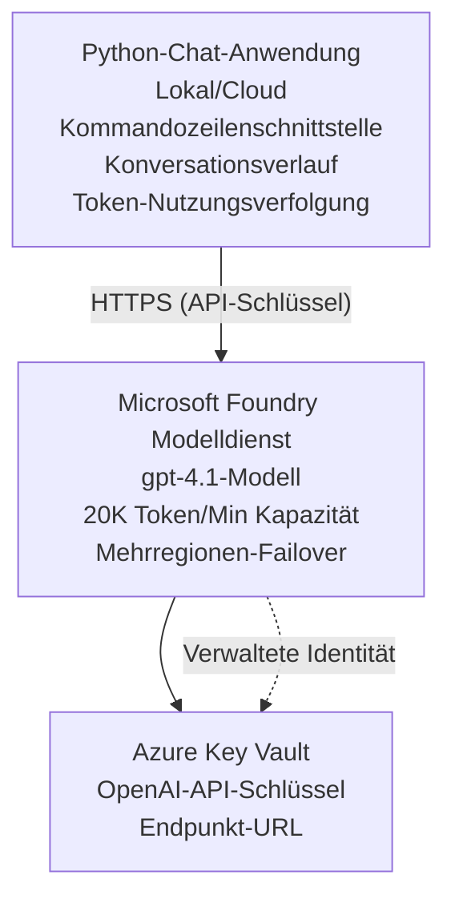

# Microsoft Foundry Models Chat-Anwendung

**Lernpfad:** Mittelstufe ⭐⭐ | **Zeit:** 35-45 Minuten | **Kosten:** $50-200/Monat

Eine vollständige Microsoft Foundry Models Chat-Anwendung, die mit Azure Developer CLI (azd) bereitgestellt wird. Dieses Beispiel demonstriert die Bereitstellung von gpt-4.1, sicheren API-Zugriff und eine einfache Chat-Oberfläche.

## 🎯 Was Sie lernen werden

- Bereitstellen des Microsoft Foundry Models Service mit dem Modell gpt-4.1
- OpenAI-API-Schlüssel mit Key Vault sichern
- Einfache Chat-Oberfläche mit Python erstellen
- Token-Nutzung und Kosten überwachen
- Rate-Limiting und Fehlerbehandlung implementieren

## 📦 Was enthalten ist

✅ **Microsoft Foundry Models Service** - Bereitstellung des Modells gpt-4.1  
✅ **Python-Chat-App** - Einfache Befehlszeilen-Chat-Oberfläche  
✅ **Key Vault-Integration** - Sichere Speicherung der API-Schlüssel  
✅ **ARM-Vorlagen** - Vollständige Infrastruktur als Code  
✅ **Kostenüberwachung** - Verfolgung der Token-Nutzung  
✅ **Rate-Limiting** - Verhindert Erschöpfung der Kontingente  

## Architektur


## Voraussetzungen

### Erforderlich

- **Azure Developer CLI (azd)** - [Installationsanleitung](https://learn.microsoft.com/azure/developer/azure-developer-cli/install-azd)
- **Azure-Abonnement** mit OpenAI-Zugang - [Zugang anfordern](https://aka.ms/oai/access)
- **Python 3.9+** - [Python installieren](https://www.python.org/downloads/)

### Voraussetzungen überprüfen

```bash
# Überprüfe azd-Version (benötigt 1.5.0 oder höher)
azd version

# Überprüfe Azure-Anmeldung
azd auth login

# Überprüfe Python-Version
python --version  # oder python3 --version

# Überprüfe OpenAI-Zugriff (im Azure-Portal nachsehen)
az cognitiveservices account list-skus \
  --kind OpenAI \
  --location eastus
```

> **⚠️ Wichtig:** Microsoft Foundry Models erfordert eine Antragsgenehmigung. Wenn Sie noch keinen Antrag gestellt haben, besuchen Sie [aka.ms/oai/access](https://aka.ms/oai/access). Die Genehmigung dauert in der Regel 1-2 Werktage.

## ⏱️ Bereitstellungszeitplan

| Phase | Dauer | Was passiert |
|-------|----------|--------------|
| Prerequisites check | 2-3 minutes | Verify OpenAI quota availability |
| Deploy infrastructure | 8-12 minutes | Create OpenAI, Key Vault, model deployment |
| Configure application | 2-3 minutes | Set up environment and dependencies |
| **Total** | **12-18 minutes** | Ready to chat with gpt-4.1 |

**Hinweis:** Die erstmalige Bereitstellung von OpenAI kann aufgrund der Modellbereitstellung länger dauern.

## Schnellstart

```bash
# Zum Beispiel navigieren
cd examples/azure-openai-chat

# Umgebung initialisieren
azd env new myopenai

# Alles bereitstellen (Infrastruktur + Konfiguration)
azd up
# Sie werden aufgefordert:
# 1. Azure-Abonnement auswählen
# 2. Region mit OpenAI-Verfügbarkeit wählen (z. B. eastus, eastus2, westus)
# 3. 12–18 Minuten auf die Bereitstellung warten

# Python-Abhängigkeiten installieren
pip install -r requirements.txt

# Chat starten!
python chat.py
```

**Erwartete Ausgabe:**
```
🤖 Microsoft Foundry Models Chat Application
Connected to: gpt-4.1 (eastus)
Type your message (or 'quit' to exit)

You: Hello! Tell me about Microsoft Foundry Models.
Assistant: Microsoft Foundry Models Service provides REST API access to OpenAI's powerful language models including gpt-4.1, GPT-3.5-Turbo, and Embeddings...

[Tokens used: 145 | Estimated cost: $0.0044]
```

## ✅ Bereitstellung überprüfen

### Schritt 1: Azure-Ressourcen prüfen

```bash
# Bereitgestellte Ressourcen anzeigen
azd show

# Die erwartete Ausgabe zeigt:
# - OpenAI-Dienst: (Ressourcenname)
# - Key Vault: (Ressourcenname)
# - Bereitstellung: gpt-4.1
# - Standort: eastus (oder Ihre gewählte Region)
```

### Schritt 2: OpenAI-API testen

```bash
# OpenAI-Endpunkt und Schlüssel abrufen
OPENAI_ENDPOINT=$(azd env get-value AZURE_OPENAI_ENDPOINT)
OPENAI_KEY=$(azd env get-value AZURE_OPENAI_API_KEY)

# API-Aufruf testen
curl "$OPENAI_ENDPOINT/openai/deployments/gpt-4.1/chat/completions?api-version=2024-08-01-preview" \
  -H "Content-Type: application/json" \
  -H "api-key: $OPENAI_KEY" \
  -d '{
    "messages": [{"role": "user", "content": "Say hello!"}],
    "max_tokens": 50
  }'
```

**Erwartete Antwort:**
```json
{
  "choices": [
    {
      "message": {
        "role": "assistant",
        "content": "Hello! How can I assist you today?"
      }
    }
  ],
  "usage": {
    "prompt_tokens": 8,
    "completion_tokens": 9,
    "total_tokens": 17
  }
}
```

### Schritt 3: Zugriff auf Key Vault überprüfen

```bash
# Geheimnisse im Key Vault auflisten
KV_NAME=$(azd env get-value AZURE_KEY_VAULT_NAME)

az keyvault secret list \
  --vault-name $KV_NAME \
  --query "[].name" \
  --output table
```

**Erwartete Geheimnisse:**
- `openai-api-key`
- `openai-endpoint`

**Erfolgskriterien:**
- ✅ OpenAI-Dienst mit gpt-4.1 bereitgestellt
- ✅ API-Aufruf liefert eine gültige Completion
- ✅ Geheimnisse im Key Vault gespeichert
- ✅ Verfolgung der Token-Nutzung funktioniert

## Projektstruktur

```
azure-openai-chat/
├── README.md                   ✅ This guide
├── azure.yaml                  ✅ AZD configuration
├── infra/                      ✅ Infrastructure as Code
│   ├── main.bicep             ✅ Main Bicep template
│   ├── main.parameters.json   ✅ Parameters
│   └── openai.bicep           ✅ OpenAI resource definition
├── src/                        ✅ Application code
│   ├── chat.py                ✅ Chat interface
│   ├── config.py              ✅ Configuration loader
│   └── requirements.txt       ✅ Python dependencies
└── .gitignore                  ✅ Git ignore rules
```

## Anwendungsfunktionen

### Chat-Oberfläche (`chat.py`)

Die Chat-Anwendung umfasst:

- **Konversationsverlauf** - Bewahrt den Kontext über Nachrichten hinweg
- **Token-Zählung** - Verfolgt die Nutzung und schätzt Kosten
- **Fehlerbehandlung** - Robuste Handhabung von Rate-Limits und API-Fehlern
- **Kostenabschätzung** - Echtzeit-Kostenberechnung pro Nachricht
- **Streaming-Unterstützung** - Optionale Streaming-Antworten

### Befehle

Während des Chats können Sie Folgendes verwenden:
- `quit` oder `exit` - Sitzung beenden
- `clear` - Konversationsverlauf löschen
- `tokens` - Gesamte Token-Nutzung anzeigen
- `cost` - Geschätzte Gesamtkosten anzeigen

### Konfiguration (`config.py`)

Lädt die Konfiguration aus Umgebungsvariablen:
```python
AZURE_OPENAI_ENDPOINT  # Aus dem Key Vault
AZURE_OPENAI_API_KEY   # Aus dem Key Vault
AZURE_OPENAI_MODEL     # Standard: gpt-4.1
AZURE_OPENAI_MAX_TOKENS # Standard: 800
```

## Anwendungsbeispiele

### Grundlegender Chat

```bash
python chat.py
```

### Chat mit benutzerdefiniertem Modell

```bash
export AZURE_OPENAI_MODEL=gpt-35-turbo
python chat.py
```

### Chat mit Streaming

```bash
python chat.py --stream
```

### Beispielkonversation

```
You: Explain Microsoft Foundry Models Service in 3 sentences.
Assistant: Microsoft Foundry Models Service is Microsoft Azure's cloud platform offering 
that provides access to OpenAI's powerful language models. It enables developers 
to integrate capabilities like gpt-4.1 into their applications with enterprise-grade 
security and compliance. The service includes features for content filtering, 
abuse monitoring, and responsible AI practices.

[Tokens used: 89 | Estimated cost: $0.0027]

You: What models are available?
Assistant: Microsoft Foundry Models Service offers several model families including gpt-4.1 
(most capable), GPT-3.5-Turbo (faster and cost-effective), and Embeddings models 
for vector search. Each model has different capabilities, pricing, and token limits.

[Tokens used: 67 | Estimated cost: $0.0020]

Total session: 156 tokens | $0.0047
```

## Kostenverwaltung

### Token-Preise (gpt-4.1)

| Modell | Eingabe (pro 1K tokens) | Ausgabe (pro 1K tokens) |
|-------|----------------------|------------------------|
| gpt-4.1 | $0.03 | $0.06 |
| GPT-3.5-Turbo | $0.0015 | $0.002 |

### Geschätzte monatliche Kosten

Basierend auf Nutzungsmustern:

| Nutzungsniveau | Nachrichten/Tag | Tokens/Tag | Monatliche Kosten |
|-------------|--------------|------------|--------------|
| **Leicht** | 20 Nachrichten | 3,000 tokens | $3-5 |
| **Moderat** | 100 Nachrichten | 15,000 tokens | $15-25 |
| **Intensiv** | 500 Nachrichten | 75,000 tokens | $75-125 |

**Basisinfrastrukturkosten:** $1-2/Monat (Key Vault + minimale Compute-Ressourcen)

### Tipps zur Kostenoptimierung

```bash
# 1. Verwenden Sie GPT-3.5-Turbo für einfachere Aufgaben (20x günstiger)
export AZURE_OPENAI_MODEL=gpt-35-turbo

# 2. Reduzieren Sie die maximale Tokenanzahl für kürzere Antworten
export AZURE_OPENAI_MAX_TOKENS=400

# 3. Überwachen Sie den Tokenverbrauch
python chat.py --show-tokens

# 4. Richten Sie Budgetwarnungen ein
az consumption budget create \
  --budget-name "openai-budget" \
  --amount 50 \
  --time-grain Monthly
```

## Überwachung

### Token-Nutzung ansehen

```bash
# Im Azure-Portal:
# OpenAI-Ressource → Metriken → "Token Transaction" auswählen

# Oder über die Azure CLI:
az monitor metrics list \
  --resource $(azd env get-value AZURE_OPENAI_RESOURCE_ID) \
  --metric "TokenTransaction" \
  --start-time $(date -u -d '1 hour ago' '+%Y-%m-%dT%H:%M:%S') \
  --interval PT1M
```

### API-Protokolle ansehen

```bash
# Diagnoseprotokolle streamen
az monitor diagnostic-settings create \
  --resource $(azd env get-value AZURE_OPENAI_RESOURCE_ID) \
  --name openai-logs \
  --logs '[{"category": "Audit", "enabled": true}]' \
  --workspace $(azd env get-value LOG_ANALYTICS_WORKSPACE_ID)

# Abfrageprotokolle
az monitor log-analytics query \
  --workspace $(azd env get-value LOG_ANALYTICS_WORKSPACE_ID) \
  --analytics-query "AzureDiagnostics | where Category == 'Audit' | top 10 by TimeGenerated"
```

## Fehlerbehebung

### Problem: "Access Denied" Fehler

**Symptome:** 403 Forbidden beim Aufruf der API

**Lösungen:**
```bash
# 1. Überprüfen Sie, dass der Zugriff auf OpenAI genehmigt ist
az cognitiveservices account show \
  --name $(azd env get-value AZURE_OPENAI_NAME) \
  --resource-group $(azd env get-value AZURE_RESOURCE_GROUP)

# 2. Überprüfen Sie, ob der API-Schlüssel korrekt ist
azd env get-value AZURE_OPENAI_API_KEY

# 3. Überprüfen Sie das Format der Endpunkt-URL
azd env get-value AZURE_OPENAI_ENDPOINT
# Sollte sein: https://[name].openai.azure.com/
```

### Problem: "Rate Limit Exceeded"

**Symptome:** 429 Too Many Requests

**Lösungen:**
```bash
# 1. Aktuelles Kontingent prüfen
az cognitiveservices account deployment show \
  --name $(azd env get-value AZURE_OPENAI_NAME) \
  --resource-group $(azd env get-value AZURE_RESOURCE_GROUP) \
  --deployment-name gpt-4.1

# 2. Erhöhung des Kontingents anfordern (falls erforderlich)
# Gehen Sie zum Azure-Portal → OpenAI-Ressource → Kontingente → Erhöhung anfordern

# 3. Wiederholungslogik implementieren (bereits in chat.py)
# Die Anwendung versucht automatisch erneut mit exponentiellem Backoff
```

### Problem: "Model Not Found"

**Symptome:** 404-Fehler bei der Bereitstellung

**Lösungen:**
```bash
# 1. Verfügbare Bereitstellungen auflisten
az cognitiveservices account deployment list \
  --name $(azd env get-value AZURE_OPENAI_NAME) \
  --resource-group $(azd env get-value AZURE_RESOURCE_GROUP)

# 2. Den Modellnamen in der Umgebung überprüfen
echo $AZURE_OPENAI_MODEL

# 3. Auf den korrekten Bereitstellungsnamen aktualisieren
export AZURE_OPENAI_MODEL=gpt-4.1  # oder gpt-35-turbo
```

### Problem: Hohe Latenz

**Symptome:** Langsame Antwortzeiten (>5 Sekunden)

**Lösungen:**
```bash
# 1. Regionale Latenz prüfen
# In die der Nutzer am nächsten gelegene Region bereitstellen

# 2. max_tokens reduzieren, um schnellere Antworten zu erhalten
export AZURE_OPENAI_MAX_TOKENS=400

# 3. Streaming verwenden, um die Nutzererfahrung zu verbessern
python chat.py --stream
```

## Sicherheits-Best Practices

### 1. API-Schlüssel schützen

```bash
# Schlüssel niemals in die Versionskontrolle einchecken
# Key Vault verwenden (bereits konfiguriert)

# Schlüssel regelmäßig erneuern
az cognitiveservices account keys regenerate \
  --name $(azd env get-value AZURE_OPENAI_NAME) \
  --resource-group $(azd env get-value AZURE_RESOURCE_GROUP) \
  --key-name key1
```

### 2. Inhaltsfilterung implementieren

```python
# Microsoft Foundry Models enthält integrierte Inhaltsfilterung
# Im Azure-Portal konfigurieren:
# OpenAI-Ressource → Inhaltsfilter → Benutzerdefinierten Filter erstellen

# Kategorien: Hass, Sexuell, Gewalt, Selbstverletzung
# Stufen: Niedrig, Mittel, Hoch
```

### 3. Verwaltete Identität verwenden (Produktivumgebung)

```bash
# Für Produktionsbereitstellungen verwenden Sie eine verwaltete Identität
# anstelle von API-Schlüsseln (erfordert das Hosting der App auf Azure)

# Aktualisieren Sie infra/openai.bicep, um Folgendes aufzunehmen:
# identity: { type: 'SystemAssigned' }
```

## Entwicklung

### Lokal ausführen

```bash
# Abhängigkeiten installieren
pip install -r src/requirements.txt

# Umgebungsvariablen setzen
export AZURE_OPENAI_ENDPOINT="https://[name].openai.azure.com/"
export AZURE_OPENAI_API_KEY="your-api-key"
export AZURE_OPENAI_MODEL="gpt-4.1"

# Anwendung ausführen
python src/chat.py
```

### Tests ausführen

```bash
# Testabhängigkeiten installieren
pip install pytest pytest-cov

# Tests ausführen
pytest tests/ -v

# Mit Codeabdeckung
pytest tests/ --cov=src --cov-report=html
```

### Modellbereitstellung aktualisieren

```bash
# Andere Modellversion bereitstellen
az cognitiveservices account deployment create \
  --name $(azd env get-value AZURE_OPENAI_NAME) \
  --resource-group $(azd env get-value AZURE_RESOURCE_GROUP) \
  --deployment-name gpt-35-turbo \
  --model-name gpt-35-turbo \
  --model-version "0613" \
  --model-format OpenAI \
  --sku-capacity 20 \
  --sku-name "Standard"
```

## Aufräumen

```bash
# Alle Azure-Ressourcen löschen
azd down --force --purge

# Dies entfernt:
# - OpenAI-Dienst
# - Key Vault (mit 90-tägiger Soft-Löschung)
# - Ressourcengruppe
# - Alle Bereitstellungen und Konfigurationen
```

## Nächste Schritte

### Dieses Beispiel erweitern

1. **Weboberfläche hinzufügen** - React/Vue-Frontend erstellen
   ```bash
   # Füge den Frontend-Service zu azure.yaml hinzu
   # Auf Azure Static Web Apps bereitstellen
   ```

2. **RAG implementieren** - Dokumentensuche mit Azure AI Search hinzufügen
   ```python
   # Azure Cognitive Search integrieren
   # Dokumente hochladen und Vektorindex erstellen
   ```

3. **Function Calling hinzufügen** - Werkzeugnutzung aktivieren
   ```python
   # Definiere Funktionen in chat.py
   # Lass gpt-4.1 externe APIs aufrufen
   ```

4. **Multi-Model-Unterstützung** - Mehrere Modelle bereitstellen
   ```bash
   # Füge gpt-35-turbo- und Einbettungsmodelle hinzu
   # Implementiere die Logik zur Modellweiterleitung
   ```

### Verwandte Beispiele

- **[Retail Multi-Agent](../retail-scenario.md)** - Erweiterte Multi-Agent-Architektur
- **[Database App](../../../../examples/database-app)** - Persistenten Speicher hinzufügen
- **[Container Apps](../../../../examples/container-app)** - Als containerisierter Dienst bereitstellen

### Lernressourcen

- 📚 [AZD für Einsteiger-Kurs](../../README.md) - Hauptseite des Kurses
- 📚 [Microsoft Foundry Models Documentation](https://learn.microsoft.com/azure/ai-services/openai/) - Offizielle Dokumentation
- 📚 [OpenAI API Reference](https://platform.openai.com/docs/api-reference) - API-Details
- 📚 [Responsible AI](https://www.microsoft.com/ai/responsible-ai) - Beste Praktiken

## Weitere Ressourcen

### Dokumentation
- **[Microsoft Foundry Models Service](https://learn.microsoft.com/azure/ai-services/openai/)** - Vollständige Anleitung
- **[gpt-4.1 Models](https://learn.microsoft.com/azure/ai-services/openai/concepts/models)** - Modellfähigkeiten
- **[Content Filtering](https://learn.microsoft.com/azure/ai-services/openai/concepts/content-filter)** - Sicherheitsfunktionen
- **[Azure Developer CLI](https://learn.microsoft.com/azure/developer/azure-developer-cli/)** - azd-Referenz

### Tutorials
- **[OpenAI Quickstart](https://learn.microsoft.com/azure/ai-services/openai/quickstart)** - Erste Bereitstellung
- **[Chat Completions](https://learn.microsoft.com/azure/ai-services/openai/how-to/chatgpt)** - Erstellen von Chat-Anwendungen
- **[Function Calling](https://learn.microsoft.com/azure/ai-services/openai/how-to/function-calling)** - Erweiterte Funktionen

### Tools
- **[Microsoft Foundry Models Studio](https://oai.azure.com/)** - Webbasierter Playground
- **[Prompt Engineering Guide](https://platform.openai.com/docs/guides/prompt-engineering)** - Bessere Prompts erstellen
- **[Token Calculator](https://platform.openai.com/tokenizer)** - Token-Nutzung schätzen

### Community
- **[Azure AI Discord](https://discord.gg/azure)** - Hilfe aus der Community erhalten
- **[GitHub Discussions](https://github.com/Azure-Samples/openai/discussions)** - Q&A-Forum
- **[Azure Blog](https://azure.microsoft.com/blog/tag/azure-openai-service/)** - Neueste Updates

---

**🎉 Erfolg!** Sie haben Microsoft Foundry Models bereitgestellt und eine funktionierende Chat-Anwendung erstellt. Beginnen Sie damit, die Fähigkeiten von gpt-4.1 zu erkunden und mit verschiedenen Prompts und Anwendungsfällen zu experimentieren.

**Fragen?** [Ein Issue öffnen](https://github.com/microsoft/AZD-for-beginners/issues) oder die [FAQ](../../resources/faq.md) prüfen

**Kostenhinweis:** Denken Sie daran, `azd down` auszuführen, wenn Sie mit dem Testen fertig sind, um laufende Kosten zu vermeiden (~$50-100/Monat bei aktiver Nutzung).

---

<!-- CO-OP TRANSLATOR DISCLAIMER START -->
**Haftungsausschluss**:
Dieses Dokument wurde mit dem KI-Übersetzungsdienst [Co-op Translator](https://github.com/Azure/co-op-translator) übersetzt. Obwohl wir uns um Genauigkeit bemühen, beachten Sie bitte, dass automatisierte Übersetzungen Fehler oder Ungenauigkeiten enthalten können. Das Originaldokument in seiner Originalsprache gilt als maßgebliche Quelle. Für kritische Informationen empfehlen wir eine professionelle, menschliche Übersetzung. Wir übernehmen keine Haftung für Missverständnisse oder Fehlinterpretationen, die aus der Verwendung dieser Übersetzung entstehen.
<!-- CO-OP TRANSLATOR DISCLAIMER END -->