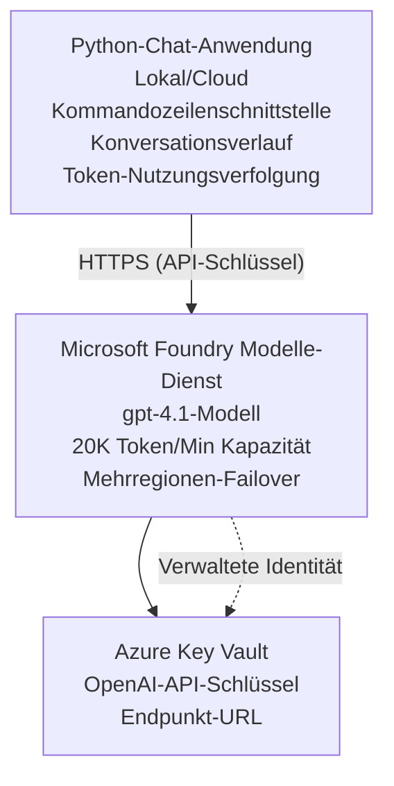

# Microsoft Foundry Models Chat-Anwendung

**Lernpfad:** Mittelstufe ⭐⭐ | **Zeit:** 35-45 Minuten | **Kosten:** $50-200/Monat

Eine vollständige Microsoft Foundry Models Chat-Anwendung, bereitgestellt mit Azure Developer CLI (azd). Dieses Beispiel zeigt die Bereitstellung von gpt-4.1, sicheren API-Zugriff und eine einfache Chat-Oberfläche.

## 🎯 Was Sie lernen werden

- Bereitstellung des Microsoft Foundry Models Service mit dem Modell gpt-4.1
- Sichere Speicherung von OpenAI-API-Schlüsseln mit Key Vault
- Aufbau einer einfachen Chat-Oberfläche mit Python
- Überwachung des Tokenverbrauchs und der Kosten
- Implementierung von Rate Limiting und Fehlerbehandlung

## 📦 Was enthalten ist

✅ **Microsoft Foundry Models Service** - Bereitstellung des Modells gpt-4.1  
✅ **Python Chat-App** - Einfache Kommandozeilen-Chat-Oberfläche  
✅ **Key Vault Integration** - Sichere Speicherung von API-Schlüsseln  
✅ **ARM-Vorlagen** - Vollständige Infrastruktur als Code  
✅ **Kostenüberwachung** - Nachverfolgung des Tokenverbrauchs  
✅ **Rate Limiting** - Verhinderung von Quotenerschöpfung  

## Architektur



## Voraussetzungen

### Erforderlich

- **Azure Developer CLI (azd)** - [Installationsanleitung](https://learn.microsoft.com/azure/developer/azure-developer-cli/install-azd)
- **Azure-Abonnement** mit OpenAI-Zugang - [Zugang anfordern](https://aka.ms/oai/access)
- **Python 3.9+** - [Python installieren](https://www.python.org/downloads/)

### Voraussetzungen prüfen

```bash
# Überprüfe azd-Version (benötigt 1.5.0 oder höher)
azd version

# Überprüfe Azure-Anmeldung
azd auth login

# Überprüfe Python-Version
python --version  # oder python3 --version

# Überprüfe OpenAI-Zugriff (im Azure-Portal überprüfen)
az cognitiveservices account list-skus \
  --kind OpenAI \
  --location eastus
```

> **⚠️ Wichtig:** Microsoft Foundry Models erfordert eine Antragsgenehmigung. Wenn Sie sich noch nicht beworben haben, besuchen Sie [aka.ms/oai/access](https://aka.ms/oai/access). Die Genehmigung dauert in der Regel 1–2 Werktage.

## ⏱️ Bereitstellungszeitplan

| Phase | Dauer | Was passiert |
|-------|----------|--------------|
| Überprüfung der Voraussetzungen | 2-3 Minuten | Überprüfen der Verfügbarkeit der OpenAI-Quota |
| Infrastruktur bereitstellen | 8-12 Minuten | Erstellen von OpenAI, Key Vault, Modellbereitstellung |
| Anwendung konfigurieren | 2-3 Minuten | Einrichten der Umgebung und Abhängigkeiten |
| **Gesamt** | **12-18 Minuten** | Bereit zum Chatten mit gpt-4.1 |

**Hinweis:** Die erste OpenAI-Bereitstellung kann aufgrund der Modell-Provisionierung länger dauern.

## Schnellstart

```bash
# Zum Beispiel navigieren
cd examples/azure-openai-chat

# Umgebung initialisieren
azd env new myopenai

# Alles bereitstellen (Infrastruktur + Konfiguration)
azd up
# Sie werden aufgefordert:
# 1. Azure-Abonnement auswählen
# 2. Region mit OpenAI-Verfügbarkeit auswählen (z. B. eastus, eastus2, westus)
# 3. 12–18 Minuten auf die Bereitstellung warten

# Python-Abhängigkeiten installieren
pip install -r requirements.txt

# Chat starten!
python chat.py
```

**Erwartete Ausgabe:**
```
🤖 Microsoft Foundry Models Chat Application
Connected to: gpt-4.1 (eastus)
Type your message (or 'quit' to exit)

You: Hello! Tell me about Microsoft Foundry Models.
Assistant: Microsoft Foundry Models Service provides REST API access to OpenAI's powerful language models including gpt-4.1, GPT-3.5-Turbo, and Embeddings...

[Tokens used: 145 | Estimated cost: $0.0044]
```

## ✅ Bereitstellung überprüfen

### Schritt 1: Azure-Ressourcen prüfen

```bash
# Bereitgestellte Ressourcen anzeigen
azd show

# Die erwartete Ausgabe zeigt:
# - OpenAI-Service: (Name der Ressource)
# - Key Vault: (Name der Ressource)
# - Bereitstellung: gpt-4.1
# - Standort: eastus (oder Ihre ausgewählte Region)
```

### Schritt 2: OpenAI-API testen

```bash
# OpenAI-Endpunkt und Schlüssel abrufen
OPENAI_ENDPOINT=$(azd env get-value AZURE_OPENAI_ENDPOINT)
OPENAI_KEY=$(azd env get-value AZURE_OPENAI_API_KEY)

# API-Aufruf testen
curl "$OPENAI_ENDPOINT/openai/deployments/gpt-4.1/chat/completions?api-version=2024-08-01-preview" \
  -H "Content-Type: application/json" \
  -H "api-key: $OPENAI_KEY" \
  -d '{
    "messages": [{"role": "user", "content": "Say hello!"}],
    "max_tokens": 50
  }'
```

**Erwartete Antwort:**
```json
{
  "choices": [
    {
      "message": {
        "role": "assistant",
        "content": "Hello! How can I assist you today?"
      }
    }
  ],
  "usage": {
    "prompt_tokens": 8,
    "completion_tokens": 9,
    "total_tokens": 17
  }
}
```

### Schritt 3: Key Vault Zugriff verifizieren

```bash
# Geheimnisse im Key Vault auflisten
KV_NAME=$(azd env get-value AZURE_KEY_VAULT_NAME)

az keyvault secret list \
  --vault-name $KV_NAME \
  --query "[].name" \
  --output table
```

**Erwartete Secrets:**
- `openai-api-key`
- `openai-endpoint`

**Erfolgskriterien:**
- ✅ OpenAI-Service mit gpt-4.1 bereitgestellt
- ✅ API-Aufruf liefert gültige Completion
- ✅ Secrets im Key Vault gespeichert
- ✅ Tokenverbrauchsverfolgung funktioniert

## Projektstruktur

```
azure-openai-chat/
├── README.md                   ✅ This guide
├── azure.yaml                  ✅ AZD configuration
├── infra/                      ✅ Infrastructure as Code
│   ├── main.bicep             ✅ Main Bicep template
│   ├── main.parameters.json   ✅ Parameters
│   └── openai.bicep           ✅ OpenAI resource definition
├── src/                        ✅ Application code
│   ├── chat.py                ✅ Chat interface
│   ├── config.py              ✅ Configuration loader
│   └── requirements.txt       ✅ Python dependencies
└── .gitignore                  ✅ Git ignore rules
```

## Anwendungsfunktionen

### Chat-Oberfläche (`chat.py`)

Die Chat-Anwendung umfasst:

- **Konversationsverlauf** - Beibehaltung des Kontexts über Nachrichten hinweg
- **Token-Zählung** - Verfolgt den Verbrauch und schätzt die Kosten
- **Fehlerbehandlung** - Robuste Behandlung von Ratenbegrenzungen und API-Fehlern
- **Kostenabschätzung** - Echtzeit-Kostenberechnung pro Nachricht
- **Streaming-Unterstützung** - Optionale Streaming-Antworten

### Befehle

Während des Chats können Sie folgende Befehle verwenden:
- `quit` or `exit` - Sitzung beenden
- `clear` - Konversationsverlauf löschen
- `tokens` - Gesamten Tokenverbrauch anzeigen
- `cost` - Geschätzte Gesamtkosten anzeigen

### Konfiguration (`config.py`)

Lädt Konfiguration aus Umgebungsvariablen:
```python
AZURE_OPENAI_ENDPOINT  # Aus dem Key Vault
AZURE_OPENAI_API_KEY   # Aus dem Key Vault
AZURE_OPENAI_MODEL     # Standard: gpt-4.1
AZURE_OPENAI_MAX_TOKENS # Standard: 800
```

## Anwendungsbeispiele

### Basis-Chat

```bash
python chat.py
```

### Chat mit benutzerdefiniertem Modell

```bash
export AZURE_OPENAI_MODEL=gpt-35-turbo
python chat.py
```

### Chat mit Streaming

```bash
python chat.py --stream
```

### Beispiel-Konversation

```
You: Explain Microsoft Foundry Models Service in 3 sentences.
Assistant: Microsoft Foundry Models Service is Microsoft Azure's cloud platform offering 
that provides access to OpenAI's powerful language models. It enables developers 
to integrate capabilities like gpt-4.1 into their applications with enterprise-grade 
security and compliance. The service includes features for content filtering, 
abuse monitoring, and responsible AI practices.

[Tokens used: 89 | Estimated cost: $0.0027]

You: What models are available?
Assistant: Microsoft Foundry Models Service offers several model families including gpt-4.1 
(most capable), GPT-3.5-Turbo (faster and cost-effective), and Embeddings models 
for vector search. Each model has different capabilities, pricing, and token limits.

[Tokens used: 67 | Estimated cost: $0.0020]

Total session: 156 tokens | $0.0047
```

## Kostenverwaltung

### Token-Preise (gpt-4.1)

| Modell | Eingabe (pro 1K Tokens) | Ausgabe (pro 1K Tokens) |
|-------|----------------------|------------------------|
| gpt-4.1 | $0.03 | $0.06 |
| GPT-3.5-Turbo | $0.0015 | $0.002 |

### Geschätzte monatliche Kosten

Basierend auf Nutzungsprofilen:

| Nutzungsniveau | Nachrichten/Tag | Tokens/Tag | Monatliche Kosten |
|-------------|--------------|------------|--------------|
| **Leicht** | 20 Nachrichten | 3.000 Tokens | $3-5 |
| **Moderat** | 100 Nachrichten | 15.000 Tokens | $15-25 |
| **Hoch** | 500 Nachrichten | 75.000 Tokens | $75-125 |

**Basis-Infrastrukturkosten:** $1-2/Monat (Key Vault + minimale Rechenressourcen)

### Tipps zur Kostenoptimierung

```bash
# 1. Verwende GPT-3.5-Turbo für einfachere Aufgaben (20× günstiger)
export AZURE_OPENAI_MODEL=gpt-35-turbo

# 2. Reduziere die maximale Anzahl an Tokens für kürzere Antworten
export AZURE_OPENAI_MAX_TOKENS=400

# 3. Überwache die Token-Nutzung
python chat.py --show-tokens

# 4. Richte Budgetwarnungen ein
az consumption budget create \
  --budget-name "openai-budget" \
  --amount 50 \
  --time-grain Monthly
```

## Überwachung

### Token-Nutzung anzeigen

```bash
# Im Azure-Portal:
# OpenAI-Ressource → Metriken → Wählen Sie "Token Transaction" aus

# Oder über die Azure CLI:
az monitor metrics list \
  --resource $(azd env get-value AZURE_OPENAI_RESOURCE_ID) \
  --metric "TokenTransaction" \
  --start-time $(date -u -d '1 hour ago' '+%Y-%m-%dT%H:%M:%S') \
  --interval PT1M
```

### API-Protokolle anzeigen

```bash
# Diagnoseprotokolle streamen
az monitor diagnostic-settings create \
  --resource $(azd env get-value AZURE_OPENAI_RESOURCE_ID) \
  --name openai-logs \
  --logs '[{"category": "Audit", "enabled": true}]' \
  --workspace $(azd env get-value LOG_ANALYTICS_WORKSPACE_ID)

# Protokolle abfragen
az monitor log-analytics query \
  --workspace $(azd env get-value LOG_ANALYTICS_WORKSPACE_ID) \
  --analytics-query "AzureDiagnostics | where Category == 'Audit' | top 10 by TimeGenerated"
```

## Fehlerbehebung

### Problem: "Access Denied" Fehler

**Symptome:** 403 Forbidden beim Aufrufen der API

**Lösungen:**
```bash
# 1. Überprüfen Sie, ob der OpenAI-Zugang genehmigt ist
az cognitiveservices account show \
  --name $(azd env get-value AZURE_OPENAI_NAME) \
  --resource-group $(azd env get-value AZURE_RESOURCE_GROUP)

# 2. Überprüfen Sie, ob der API-Schlüssel korrekt ist
azd env get-value AZURE_OPENAI_API_KEY

# 3. Überprüfen Sie das Format der Endpunkt-URL
azd env get-value AZURE_OPENAI_ENDPOINT
# Sollte sein: https://[name].openai.azure.com/
```

### Problem: "Rate Limit Exceeded"

**Symptome:** 429 Too Many Requests

**Lösungen:**
```bash
# 1. Aktuelles Kontingent prüfen
az cognitiveservices account deployment show \
  --name $(azd env get-value AZURE_OPENAI_NAME) \
  --resource-group $(azd env get-value AZURE_RESOURCE_GROUP) \
  --deployment-name gpt-4.1

# 2. Kontingenterhöhung beantragen (falls erforderlich)
# Gehe zum Azure-Portal → OpenAI-Ressource → Kontingente → Erhöhung anfordern

# 3. Retry-Logik implementieren (bereits in chat.py)
# Die Anwendung wiederholt automatisch mit exponentiellem Backoff
```

### Problem: "Model Not Found"

**Symptome:** 404 Fehler für die Bereitstellung

**Lösungen:**
```bash
# 1. Verfügbare Deployments auflisten
az cognitiveservices account deployment list \
  --name $(azd env get-value AZURE_OPENAI_NAME) \
  --resource-group $(azd env get-value AZURE_RESOURCE_GROUP)

# 2. Modellnamen in der Umgebung überprüfen
echo $AZURE_OPENAI_MODEL

# 3. Auf den korrekten Deployment-Namen aktualisieren
export AZURE_OPENAI_MODEL=gpt-4.1  # oder gpt-35-turbo
```

### Problem: "High Latency"

**Symptome:** Langsame Antwortzeiten (>5 Sekunden)

**Lösungen:**
```bash
# 1. Überprüfe die regionale Latenz
# In die der Nutzer am nächsten gelegene Region bereitstellen

# 2. Reduziere max_tokens für schnellere Antworten
export AZURE_OPENAI_MAX_TOKENS=400

# 3. Verwende Streaming für eine bessere Benutzererfahrung
python chat.py --stream
```

## Sicherheits-Best Practices

### 1. API-Schlüssel schützen

```bash
# Niemals Schlüssel in die Quellcodeverwaltung einchecken
# Key Vault verwenden (bereits konfiguriert)

# Schlüssel regelmäßig austauschen
az cognitiveservices account keys regenerate \
  --name $(azd env get-value AZURE_OPENAI_NAME) \
  --resource-group $(azd env get-value AZURE_RESOURCE_GROUP) \
  --key-name key1
```

### 2. Inhaltsfilterung implementieren

```python
# Microsoft Foundry Models enthält integrierte Inhaltsfilterung
# Im Azure-Portal konfigurieren:
# OpenAI-Ressource → Inhaltsfilter → Benutzerdefinierten Filter erstellen

# Kategorien: Hass, Sexuell, Gewalt, Selbstverletzung
# Filterstufen: Niedrig, Mittel, Hoch
```

### 3. Verwenden Sie Managed Identity (Produktion)

```bash
# Für Produktionsbereitstellungen verwenden Sie eine verwaltete Identität
# anstelle von API-Schlüsseln (erfordert, dass die App auf Azure gehostet wird)

# Aktualisieren Sie infra/openai.bicep, um Folgendes hinzuzufügen:
# identity: { type: 'SystemAssigned' }
```

## Entwicklung

### Lokal ausführen

```bash
# Abhängigkeiten installieren
pip install -r src/requirements.txt

# Umgebungsvariablen setzen
export AZURE_OPENAI_ENDPOINT="https://[name].openai.azure.com/"
export AZURE_OPENAI_API_KEY="your-api-key"
export AZURE_OPENAI_MODEL="gpt-4.1"

# Anwendung ausführen
python src/chat.py
```

### Tests ausführen

```bash
# Testabhängigkeiten installieren
pip install pytest pytest-cov

# Tests ausführen
pytest tests/ -v

# Mit Codeabdeckung
pytest tests/ --cov=src --cov-report=html
```

### Modellbereitstellung aktualisieren

```bash
# Eine andere Modellversion bereitstellen
az cognitiveservices account deployment create \
  --name $(azd env get-value AZURE_OPENAI_NAME) \
  --resource-group $(azd env get-value AZURE_RESOURCE_GROUP) \
  --deployment-name gpt-35-turbo \
  --model-name gpt-35-turbo \
  --model-version "0613" \
  --model-format OpenAI \
  --sku-capacity 20 \
  --sku-name "Standard"
```

## Bereinigen

```bash
# Alle Azure-Ressourcen löschen
azd down --force --purge

# Dies entfernt:
# - OpenAI-Dienst
# - Key Vault (mit 90-tägiger Soft-Löschung)
# - Ressourcengruppe
# - Alle Bereitstellungen und Konfigurationen
```

## Nächste Schritte

### Dieses Beispiel erweitern

1. **Weboberfläche hinzufügen** - Erstellen Sie ein React/Vue-Frontend
   ```bash
   # Frontend-Service zur azure.yaml hinzufügen
   # Auf Azure Static Web Apps bereitstellen
   ```

2. **RAG implementieren** - Dokumentensuche mit Azure AI Search hinzufügen
   ```python
   # Azure AI Search integrieren
   # Dokumente hochladen und einen Vektorindex erstellen
   ```

3. **Function Calling hinzufügen** - Tool-Nutzung ermöglichen
   ```python
   # Definiere Funktionen in chat.py
   # Lasse gpt-4.1 externe APIs aufrufen
   ```

4. **Multi-Modell-Unterstützung** - Mehrere Modelle bereitstellen
   ```bash
   # Füge gpt-35-turbo und Embeddings-Modelle hinzu
   # Implementiere die Modell-Routing-Logik
   ```

### Verwandte Beispiele

- **[Retail Multi-Agent](../retail-scenario.md)** - Fortgeschrittene Multi-Agent-Architektur
- **[Database App](../../../../examples/database-app)** - Persistente Speicherung hinzufügen
- **[Container Apps](../../../../examples/container-app)** - Bereitstellung als containerisierter Dienst

### Lernressourcen

- 📚 [AZD For Beginners Course](../../README.md) - Hauptkurs-Startseite
- 📚 [Microsoft Foundry Models Documentation](https://learn.microsoft.com/azure/ai-services/openai/) - Offizielle Dokumentation
- 📚 [OpenAI API Reference](https://platform.openai.com/docs/api-reference) - API-Details
- 📚 [Responsible AI](https://www.microsoft.com/ai/responsible-ai) - Best Practices

## Zusätzliche Ressourcen

### Dokumentation
- **[Microsoft Foundry Models Service](https://learn.microsoft.com/azure/ai-services/openai/)** - Vollständige Anleitung
- **[gpt-4.1 Models](https://learn.microsoft.com/azure/ai-services/openai/concepts/models)** - Modellfähigkeiten
- **[Content Filtering](https://learn.microsoft.com/azure/ai-services/openai/concepts/content-filter)** - Sicherheitsfunktionen
- **[Azure Developer CLI](https://learn.microsoft.com/azure/developer/azure-developer-cli/)** - azd-Referenz

### Tutorials
- **[OpenAI Quickstart](https://learn.microsoft.com/azure/ai-services/openai/quickstart)** - Erste Bereitstellung
- **[Chat Completions](https://learn.microsoft.com/azure/ai-services/openai/how-to/chatgpt)** - Aufbau von Chat-Apps
- **[Function Calling](https://learn.microsoft.com/azure/ai-services/openai/how-to/function-calling)** - Erweiterte Funktionen

### Tools
- **[Microsoft Foundry Models Studio](https://oai.azure.com/)** - Webbasiertes Playground
- **[Prompt Engineering Guide](https://platform.openai.com/docs/guides/prompt-engineering)** - Bessere Prompts erstellen
- **[Token Calculator](https://platform.openai.com/tokenizer)** - Tokenverbrauch schätzen

### Community
- **[Azure AI Discord](https://discord.gg/azure)** - Hilfe von der Community
- **[GitHub Discussions](https://github.com/Azure-Samples/openai/discussions)** - Q&A-Forum
- **[Azure Blog](https://azure.microsoft.com/blog/tag/azure-openai-service/)** - Neueste Updates

---

**🎉 Erfolg!** Sie haben Microsoft Foundry Models bereitgestellt und eine funktionierende Chat-Anwendung erstellt. Beginnen Sie damit, die Fähigkeiten von gpt-4.1 zu erkunden und mit verschiedenen Prompts und Anwendungsfällen zu experimentieren.

**Fragen?** [Open an issue](https://github.com/microsoft/AZD-for-beginners/issues) oder prüfen Sie die [FAQ](../../resources/faq.md)

**Kostenwarnung:** Denken Sie daran, `azd down` auszuführen, wenn Sie mit dem Testen fertig sind, um fortlaufende Kosten zu vermeiden (~$50-100/Monat bei aktiver Nutzung).

---

<!-- CO-OP TRANSLATOR DISCLAIMER START -->
**Haftungsausschluss**:
Dieses Dokument wurde mit dem KI-Übersetzungsdienst [Co-op Translator](https://github.com/Azure/co-op-translator) übersetzt. Obwohl wir uns um Genauigkeit bemühen, beachten Sie bitte, dass automatisierte Übersetzungen Fehler oder Ungenauigkeiten enthalten können. Das Originaldokument in seiner Ursprungssprache gilt als maßgebliche Quelle. Bei kritischen Informationen wird eine professionelle menschliche Übersetzung empfohlen. Wir übernehmen keine Haftung für Missverständnisse oder Fehlinterpretationen, die aus der Verwendung dieser Übersetzung entstehen.
<!-- CO-OP TRANSLATOR DISCLAIMER END -->