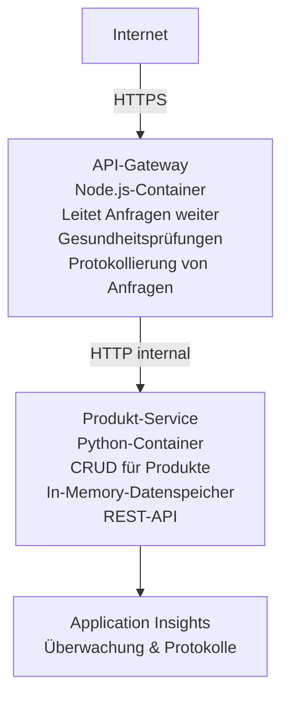

# Microservices-Architektur - Container-App-Beispiel

⏱️ **Geschätzte Zeit**: 25-35 Minuten | 💰 **Geschätzte Kosten**: ~$50-100/Monat | ⭐ **Komplexität**: Fortgeschritten

Eine **vereinfachte, aber funktionsfähige** Microservices-Architektur, die mit dem AZD CLI in Azure Container Apps bereitgestellt wird. Dieses Beispiel zeigt Service-zu-Service-Kommunikation, Container-Orchestrierung und Monitoring mit einer praktischen 2-Dienste-Konfiguration.

> **📚 Lernansatz**: Dieses Beispiel beginnt mit einer minimalen 2-Dienste-Architektur (API-Gateway + Produkt-Service), die Sie tatsächlich bereitstellen und von der Sie lernen können. Nachdem Sie diese Grundlage gemeistert haben, geben wir Hinweise zur Erweiterung zu einem vollständigen Microservices-Ökosystem.

## Was Sie lernen werden

Durch das Abschließen dieses Beispiels werden Sie:
- Mehrere Container in Azure Container Apps bereitstellen
- Service-zu-Service-Kommunikation mit internem Netzwerk implementieren
- Umgebungsbasierte Skalierung und Health-Checks konfigurieren
- Verteilte Anwendungen mit Application Insights überwachen
- Bereitstellungsmuster und Best Practices für Microservices verstehen
- Fortschrittliche Erweiterung von einfachen zu komplexen Architekturen erlernen

## Architektur

### Phase 1: Was wir bauen (in diesem Beispiel enthalten)


**Warum einfach anfangen?**
- ✅ Schnell bereitstellen und verstehen (25-35 Minuten)
- ✅ Kernmuster von Microservices ohne Komplexität erlernen
- ✅ Funktionierender Code, den Sie ändern und ausprobieren können
- ✅ Geringere Kosten für das Lernen (~$50-100/Monat vs $300-1400/Monat)
- ✅ Vertrauen aufbauen, bevor Datenbanken und Message Queues hinzugefügt werden

**Analogie**: Stellen Sie sich das wie Autofahren lernen vor. Sie beginnen mit einem leeren Parkplatz (2 Dienste), meistern die Grundlagen und schreiten dann zum Stadtverkehr voran (5+ Dienste mit Datenbanken).

### Phase 2: Zukünftige Erweiterung (Referenzarchitektur)

```
Full Architecture (Not Included - For Reference)
├── API Gateway (✅ Included)
├── Product Service (✅ Included)
├── Order Service (🔜 Add next)
├── User Service (🔜 Add next)
├── Notification Service (🔜 Add last)
├── Azure Service Bus (🔜 For async communication)
├── Cosmos DB (🔜 For product persistence)
├── Azure SQL (🔜 For order management)
└── Azure Storage (🔜 For file storage)
```

Siehe den Abschnitt „Erweiterungsleitfaden“ am Ende für Schritt-für-Schritt-Anleitungen.

## Enthaltene Funktionen

✅ **Service Discovery**: Automatische DNS-basierte Erkennung zwischen Containern  
✅ **Load Balancing**: Eingebautes Load Balancing über Replikate  
✅ **Auto-scaling**: Unabhängige Skalierung pro Dienst basierend auf HTTP-Anfragen  
✅ **Health Monitoring**: Liveness- und Readiness-Probes für beide Dienste  
✅ **Verteiltes Logging**: Zentralisiertes Logging mit Application Insights  
✅ **Internes Networking**: Sichere Service-zu-Service-Kommunikation  
✅ **Container Orchestrierung**: Automatische Bereitstellung und Skalierung  
✅ **Zero-Downtime-Updates**: Rolling Updates mit Revisionsverwaltung  

## Voraussetzungen

### Erforderliche Tools

Bevor Sie beginnen, überprüfen Sie, ob Sie diese Tools installiert haben:

1. **[Azure Developer CLI (azd)](https://learn.microsoft.com/azure/developer/azure-developer-cli/install-azd)** (Version 1.0.0 oder höher)
   ```bash
   azd version
   # Erwartete Ausgabe: azd-Version 1.0.0 oder höher
   ```

2. **[Azure CLI](https://learn.microsoft.com/cli/azure/install-azure-cli)** (Version 2.50.0 oder höher)
   ```bash
   az --version
   # Erwartete Ausgabe: azure-cli 2.50.0 oder höher
   ```

3. **[Docker](https://www.docker.com/get-started)** (für lokale Entwicklung/Tests - optional)
   ```bash
   docker --version
   # Erwartete Ausgabe: Docker-Version 20.10 oder höher
   ```

### Azure-Anforderungen

- Ein aktives **Azure-Abonnement** ([kostenloses Konto erstellen](https://azure.microsoft.com/free/))
- Berechtigungen zum Erstellen von Ressourcen in Ihrem Abonnement
- **Contributor**-Rolle auf dem Abonnement oder der Ressourcengruppe

### Fachliche Voraussetzungen

Dies ist ein Beispiel auf **fortgeschrittenem Niveau**. Sie sollten:
- Das [Simple Flask API example](../../../../../examples/container-app/simple-flask-api) abgeschlossen haben
- Grundlegendes Verständnis von Microservices-Architektur besitzen
- Vertrautheit mit REST-APIs und HTTP haben
- Verständnis von Container-Konzepten

**Neu bei Container Apps?** Beginnen Sie zuerst mit dem [Simple Flask API example](../../../../../examples/container-app/simple-flask-api), um die Grundlagen zu lernen.

## Schnellstart (Schritt-für-Schritt)

### Schritt 1: Klonen und navigieren

```bash
git clone https://github.com/microsoft/AZD-for-beginners.git
cd AZD-for-beginners/examples/container-app/microservices
```

**✓ Erfolgsprüfung**: Überprüfen Sie, ob Sie `azure.yaml` sehen:
```bash
ls
# Erwartet: README.md, azure.yaml, infra/, src/
```

### Schritt 2: Bei Azure authentifizieren

```bash
azd auth login
```

Dies öffnet Ihren Browser zur Azure-Authentifizierung. Melden Sie sich mit Ihren Azure-Anmeldedaten an.

**✓ Erfolgsprüfung**: Sie sollten Folgendes sehen:
```
Logged in to Azure.
```

### Schritt 3: Umgebung initialisieren

```bash
azd init
```

**Eingaben, die Sie sehen werden**:
- **Environment name**: Geben Sie einen kurzen Namen ein (z. B. `microservices-dev`)
- **Azure subscription**: Wählen Sie Ihr Abonnement aus
- **Azure location**: Wählen Sie eine Region (z. B. `eastus`, `westeurope`)

**✓ Erfolgsprüfung**: Sie sollten Folgendes sehen:
```
SUCCESS: New project initialized!
```

### Schritt 4: Infrastruktur und Dienste bereitstellen

```bash
azd up
```

**Was passiert** (dauert 8–12 Minuten):
1. Erstellt die Container Apps-Umgebung
2. Erstellt Application Insights für das Monitoring
3. Baut den API-Gateway-Container (Node.js)
4. Baut den Product-Service-Container (Python)
5. Stellt beide Container in Azure bereit
6. Konfiguriert Networking und Health-Checks
7. Richtet Monitoring und Logging ein

**✓ Erfolgsprüfung**: Sie sollten Folgendes sehen:
```
SUCCESS: Your application was deployed to Azure in X minutes Y seconds.
Endpoint: https://api-gateway-<unique-id>.azurecontainerapps.io
```

**⏱️ Zeit**: 8–12 Minuten

### Schritt 5: Bereitstellung testen

```bash
# Hole den Gateway-Endpunkt
GATEWAY_URL=$(azd env get-values | grep API_GATEWAY_URL | cut -d '=' -f2 | tr -d '"')

# API-Gateway-Gesundheit testen
curl $GATEWAY_URL/health

# Erwartete Ausgabe:
# {"status":"gesund","service":"api-gateway","timestamp":"2025-11-19T10:30:00Z"}
```

**Produktdienst über das Gateway testen**:
```bash
# Produkte auflisten
curl $GATEWAY_URL/api/products

# Erwartete Ausgabe:
# [
#   {"id":1,"name":"Laptop","price":999.99,"stock":50},
#   {"id":2,"name":"Maus","price":29.99,"stock":200},
#   {"id":3,"name":"Tastatur","price":79.99,"stock":150}
# ]
```

**✓ Erfolgsprüfung**: Beide Endpunkte geben JSON-Daten ohne Fehler zurück.

---

**🎉 Herzlichen Glückwunsch!** Sie haben eine Microservices-Architektur in Azure bereitgestellt!

## Projektstruktur

Alle Implementierungsdateien sind enthalten – dies ist ein vollständiges, funktionierendes Beispiel:

```
microservices/
│
├── README.md                         # This file
├── azure.yaml                        # AZD configuration
├── .gitignore                        # Git ignore patterns
│
├── infra/                           # Infrastructure as Code (Bicep)
│   ├── main.bicep                   # Main orchestration
│   ├── abbreviations.json           # Naming conventions
│   ├── core/                        # Shared infrastructure
│   │   ├── container-apps-environment.bicep  # Container environment + registry
│   │   └── monitor.bicep            # Application Insights + Log Analytics
│   └── app/                         # Service definitions
│       ├── api-gateway.bicep        # API Gateway container app
│       └── product-service.bicep    # Product Service container app
│
└── src/                             # Application source code
    ├── api-gateway/                 # Node.js API Gateway
    │   ├── app.js                   # Express server with routing
    │   ├── package.json             # Node dependencies
    │   └── Dockerfile               # Container definition
    └── product-service/             # Python Product Service
        ├── main.py                  # Flask API with product data
        ├── requirements.txt         # Python dependencies
        └── Dockerfile               # Container definition
```

**Was jede Komponente macht:**

**Infrastruktur (infra/)**:
- `main.bicep`: Orchestriert alle Azure-Ressourcen und deren Abhängigkeiten
- `core/container-apps-environment.bicep`: Erstellt die Container Apps-Umgebung und die Azure Container Registry
- `core/monitor.bicep`: Richtet Application Insights für verteiltes Logging ein
- `app/*.bicep`: Einzelne Container-App-Definitionen mit Skalierung und Health-Checks

**API-Gateway (src/api-gateway/)**:
- Öffentliches Service, das Anfragen an Backend-Dienste weiterleitet
- Implementiert Logging, Fehlerbehandlung und Request-Forwarding
- Demonstriert Service-zu-Service HTTP-Kommunikation

**Produkt-Service (src/product-service/)**:
- Interner Dienst mit Produktkatalog (in-memory zur Vereinfachung)
- REST-API mit Health-Checks
- Beispiel für ein Backend-Microservice-Muster

## Dienstübersicht

### API-Gateway (Node.js/Express)

**Port**: 8080  
**Zugriff**: Öffentlich (externer Ingress)  
**Zweck**: Leitet eingehende Anfragen an die passenden Backend-Dienste weiter  

**Endpunkte**:
- `GET /` - Service-Informationen
- `GET /health` - Health-Check-Endpunkt
- `GET /api/products` - Weiterleitung an den Produkt-Service (alle auflisten)
- `GET /api/products/:id` - Weiterleitung an den Produkt-Service (nach ID abrufen)

**Wesentliche Merkmale**:
- Anfrage-Routing mit axios
- Zentralisiertes Logging
- Fehlerbehandlung und Timeout-Management
- Service-Discovery über Umgebungsvariablen
- Integration mit Application Insights

**Code-Hervorhebung** (`src/api-gateway/app.js`):
```javascript
// Interne Dienstkommunikation
app.get('/api/products', async (req, res) => {
  const response = await axios.get(`${PRODUCT_SERVICE_URL}/products`);
  res.json(response.data);
});
```

### Produkt-Service (Python/Flask)

**Port**: 8000  
**Zugriff**: Nur intern (kein externer Ingress)  
**Zweck**: Verwaltet den Produktkatalog mit In-Memory-Daten  

**Endpunkte**:
- `GET /` - Service-Informationen
- `GET /health` - Health-Check-Endpunkt
- `GET /products` - Alle Produkte auflisten
- `GET /products/<id>` - Produkt nach ID abrufen

**Wesentliche Merkmale**:
- RESTful API mit Flask
- In-Memory-Produktspeicher (einfach, keine Datenbank erforderlich)
- Health-Monitoring mit Probes
- Strukturiertes Logging
- Integration mit Application Insights

**Datenmodell**:
```python
{
  "id": 1,
  "name": "Laptop",
  "description": "High-performance laptop",
  "price": 999.99,
  "stock": 50
}
```

**Warum nur intern?**
Der Produkt-Service ist nicht öffentlich zugänglich. Alle Anfragen müssen über das API-Gateway laufen, das bietet:
- Sicherheit: Kontrollierter Zugangspunkt
- Flexibilität: Backend kann geändert werden, ohne die Clients zu beeinflussen
- Monitoring: Zentralisiertes Request-Logging

## Verständnis der Dienstkommunikation

### Wie Dienste miteinander kommunizieren

In diesem Beispiel kommuniziert das API-Gateway mit dem Produkt-Service mittels **interner HTTP-Aufrufe**:

```javascript
// API-Gateway (src/api-gateway/app.js)
const PRODUCT_SERVICE_URL = process.env.PRODUCT_SERVICE_URL;

// Interne HTTP-Anfrage durchführen
const response = await axios.get(`${PRODUCT_SERVICE_URL}/products`);
```

**Wichtige Punkte**:

1. **DNS-basierte Erkennung**: Container Apps stellt automatisch DNS für interne Dienste bereit
   - Product Service FQDN: `product-service.internal.<environment>.azurecontainerapps.io`
   - Vereinfacht als: `http://product-service` (Container Apps löst dies auf)

2. **Keine öffentliche Exposition**: Der Produkt-Service hat `external: false` in Bicep
   - Nur innerhalb der Container Apps-Umgebung zugänglich
   - Nicht aus dem Internet erreichbar

3. **Umgebungsvariablen**: Dienst-URLs werden zur Bereitstellungszeit injiziert
   - Bicep übergibt den internen FQDN an das Gateway
   - Keine hartcodierten URLs im Anwendungscode

**Analogie**: Stellen Sie sich das wie Büroräume vor. Das API-Gateway ist der Empfang (öffentlich), und der Produkt-Service ist ein Büroraum (nur intern). Besucher müssen über den Empfang gehen, um ein Büro zu erreichen.

## Bereitstellungsoptionen

### Vollständige Bereitstellung (empfohlen)

```bash
# Infrastruktur und beide Dienste bereitstellen
azd up
```

Dies stellt bereit:
1. Container Apps-Umgebung
2. Application Insights
3. Container Registry
4. API-Gateway-Container
5. Produkt-Service-Container

**Zeit**: 8–12 Minuten

### Einzelnen Dienst bereitstellen

```bash
# Nur einen Dienst bereitstellen (nach dem initialen azd up)
azd deploy api-gateway

# Oder den Produktdienst bereitstellen
azd deploy product-service
```

**Anwendungsfall**: Wenn Sie Code in einem Dienst aktualisiert haben und nur diesen Dienst neu bereitstellen möchten.

### Konfiguration aktualisieren

```bash
# Skalierungsparameter ändern
azd env set GATEWAY_MAX_REPLICAS 30

# Mit neuer Konfiguration neu bereitstellen
azd up
```

## Konfiguration

### Skalierungskonfiguration

Beide Dienste sind in ihren Bicep-Dateien mit HTTP-basierter Autoskalierung konfiguriert:

**API-Gateway**:
- Minimale Replikate: 2 (immer mindestens 2 für Verfügbarkeit)
- Maximale Replikate: 20
- Skalierungsauslöser: 50 gleichzeitige Anfragen pro Replikat

**Produkt-Service**:
- Minimale Replikate: 1 (kann bei Bedarf auf null skalieren)
- Maximale Replikate: 10
- Skalierungsauslöser: 100 gleichzeitige Anfragen pro Replikat

**Skalierung anpassen** (in `infra/app/*.bicep`):
```bicep
scale: {
  minReplicas: 1
  maxReplicas: 10
  rules: [
    {
      name: 'http-scale-rule'
      http: {
        metadata: {
          concurrentRequests: '100'  // Adjust this
        }
      }
    }
  ]
}
```

### Ressourcenzuordnung

**API-Gateway**:
- CPU: 1.0 vCPU
- Arbeitsspeicher: 2 GiB
- Grund: Verarbeitet sämtlichen externen Verkehr

**Produkt-Service**:
- CPU: 0.5 vCPU
- Arbeitsspeicher: 1 GiB
- Grund: Leichte In-Memory-Operationen

### Gesundheitsprüfungen

Beide Dienste enthalten Liveness- und Readiness-Probes:

```bicep
probes: [
  {
    type: 'Liveness'
    httpGet: {
      path: '/health'
      port: 8080
    }
    initialDelaySeconds: 10
    periodSeconds: 30
  }
  {
    type: 'Readiness'
    httpGet: {
      path: '/health'
      port: 8080
    }
    initialDelaySeconds: 5
    periodSeconds: 10
  }
]
```

**Was das bedeutet**:
- **Liveness**: Wenn der Health-Check fehlschlägt, startet Container Apps den Container neu
- **Readiness**: Ist ein Replikat nicht bereit, stoppt Container Apps das Routing von Traffic zu diesem Replikat


## Überwachung & Beobachtbarkeit

### Dienstprotokolle anzeigen

```bash
# Protokolle mit azd monitor anzeigen
azd monitor --logs

# Oder verwenden Sie die Azure CLI für bestimmte Container-Apps:
# Protokolle vom API-Gateway streamen
az containerapp logs show --name api-gateway --resource-group $RG_NAME --follow

# Aktuelle Protokolle des Produktdienstes anzeigen
az containerapp logs show --name product-service --resource-group $RG_NAME --tail 100
```

**Erwartete Ausgabe**:
```
[api-gateway] API Gateway listening on port 8080
[api-gateway] Product Service URL: http://product-service
[api-gateway] GET /api/products 200 - 45ms
[product-service] Retrieved 5 products
```

### Application Insights-Abfragen

Öffnen Sie Application Insights im Azure-Portal und führen Sie dann diese Abfragen aus:

**Langsame Anfragen finden**:
```kusto
requests
| where timestamp > ago(1h)
| where duration > 1000  // Requests taking >1 second
| summarize count() by name, cloud_RoleName
| order by count_ desc
```

**Service-zu-Service-Aufrufe nachverfolgen**:
```kusto
dependencies
| where timestamp > ago(1h)
| where type == "Http"
| project timestamp, name, target, duration, success
| order by timestamp desc
```

**Fehlerquote pro Dienst**:
```kusto
exceptions
| where timestamp > ago(24h)
| summarize errorCount = count() by cloud_RoleName, type
| order by errorCount desc
```

**Anfragevolumen im Zeitverlauf**:
```kusto
requests
| where timestamp > ago(1h)
| summarize requestCount = count() by bin(timestamp, 5m), cloud_RoleName
| render timechart
```

### Monitoring-Dashboard aufrufen

```bash
# Application Insights-Details abrufen
azd env get-values | grep APPLICATIONINSIGHTS

# Überwachung im Azure-Portal öffnen
az monitor app-insights component show \
  --app $(azd env get-values | grep APPLICATIONINSIGHTS_CONNECTION_STRING | cut -d '=' -f2) \
  --resource-group $(azd env get-values | grep AZURE_RESOURCE_GROUP | cut -d '=' -f2) \
  --query "appId" -o tsv
```

### Live-Metriken

1. Navigieren Sie zu Application Insights im Azure-Portal
2. Klicken Sie auf "Live Metrics"
3. Sie sehen Echtzeit-Anfragen, Fehler und Performance
4. Testen Sie, indem Sie ausführen: `curl $(azd env get-values | grep API_GATEWAY_URL | cut -d '=' -f2 | tr -d '"')/api/products`

## Praktische Übungen

[Hinweis: Siehe die vollständigen Übungen oben im Abschnitt „Praktische Übungen“ für detaillierte Schritt-für-Schritt-Übungen einschließlich Bereitstellungsüberprüfung, Datenänderung, Autoskalierungstests, Fehlerbehandlung und dem Hinzufügen eines dritten Dienstes.]

## Kostenanalyse

### Geschätzte monatliche Kosten (für dieses 2-Dienste-Beispiel)

| Ressource | Konfiguration | Geschätzte Kosten |
|----------|--------------|----------------|
| API Gateway | 2-20 Replikate, 1 vCPU, 2GB RAM | $30-150 |
| Product Service | 1-10 Replikate, 0.5 vCPU, 1GB RAM | $15-75 |
| Container Registry | Basic tier | $5 |
| Application Insights | 1-2 GB/Monat | $5-10 |
| Log Analytics | 1 GB/Monat | $3 |
| **Gesamt** | | **$58-243/Monat** |

**Kostenaufteilung nach Nutzung**:
- **Geringer Traffic** (Tests/Lernen): ~$60/Monat
- **Moderater Traffic** (kleine Produktion): ~$120/Monat
- **Hoher Traffic** (spitze Zeiten): ~$240/Monat

### Tipps zur Kostenoptimierung

1. **Auf Null skalieren für Entwicklung**:
   ```bicep
   scale: {
     minReplicas: 0  // Save $30-40/month when not in use
     maxReplicas: 10
   }
   ```

2. **Verwenden Sie den Consumption-Plan für Cosmos DB** (wenn Sie ihn hinzufügen):
   - Bezahlen Sie nur das, was Sie nutzen
   - Keine Mindestgebühr

3. **Application Insights-Sampling einstellen**:
   ```javascript
   appInsights.defaultClient.config.samplingPercentage = 50; // 50 % der Anfragen stichprobenartig auswählen
   ```

4. **Aufräumen, wenn nicht benötigt**:
   ```bash
   azd down
   ```

### Kostenlose Optionen

Für Lernen/Tests in Betracht ziehen:
- Azure-Guthaben kostenlos verwenden (erste 30 Tage)
- Replikate auf Minimum beschränken
- Nach dem Test löschen (keine laufenden Kosten)

---

## Cleanup

Um laufende Kosten zu vermeiden, löschen Sie alle Ressourcen:

```bash
azd down --force --purge
```

**Bestätigungsaufforderung**:
```
? Total resources to delete: 6, are you sure you want to continue? (y/N)
```

Geben Sie `y` ein, um zu bestätigen.

**Was gelöscht wird**:
- Container Apps Environment
- Beide Container Apps (Gateway & Product Service)
- Container Registry
- Application Insights
- Log Analytics Workspace
- Resource Group

**✓ Bereinigung überprüfen**:
```bash
az group list --query "[?starts_with(name,'rg-microservices')]" --output table
```

Sollte leer sein.

---

## Erweiterungsleitfaden: Von 2 auf 5+ Dienste

Sobald Sie diese Architektur mit 2 Diensten gemeistert haben, erfahren Sie hier, wie Sie erweitern können:

### Phase 1: Datenbank-Persistenz hinzufügen (nächster Schritt)

**Fügen Sie Cosmos DB für den Product-Service hinzu**:

1. Create `infra/core/cosmos.bicep`:
   ```bicep
   resource cosmosAccount 'Microsoft.DocumentDB/databaseAccounts@2023-04-15' = {
     name: name
     location: location
     kind: 'GlobalDocumentDB'
     properties: {
       databaseAccountOfferType: 'Standard'
       locations: [{ locationName: location, failoverPriority: 0 }]
     }
   }
   ```

2. Aktualisieren Sie den Product-Service, damit er Cosmos DB anstelle von In-Memory-Daten verwendet

3. Geschätzte zusätzliche Kosten: ca. $25/Monat (serverless)

### Phase 2: Dritten Dienst hinzufügen (Bestellverwaltung)

**Order-Service erstellen**:

1. Neuer Ordner: `src/order-service/` (Python/Node.js/C#)
2. Neue Bicep-Datei: `infra/app/order-service.bicep`
3. Aktualisieren Sie das API-Gateway, um `/api/orders` zu routen
4. Fügen Sie eine Azure SQL-Datenbank zur Bestellspeicherung hinzu

**Die Architektur wird**:
```
API Gateway → Product Service (Cosmos DB)
           → Order Service (Azure SQL)
```

### Phase 3: Asynchrone Kommunikation hinzufügen (Service Bus)

**Ereignisgesteuerte Architektur implementieren**:

1. Fügen Sie Azure Service Bus hinzu: `infra/core/servicebus.bicep`
2. Product-Service veröffentlicht "ProductCreated"-Ereignisse
3. Order-Service abonniert Produkt-Ereignisse
4. Fügen Sie einen Notification-Service hinzu, um Ereignisse zu verarbeiten

**Muster**: Request/Response (HTTP) + Ereignisgesteuert (Service Bus)

### Phase 4: Benutzer-Authentifizierung hinzufügen

**Benutzer-Service implementieren**:

1. Erstellen Sie `src/user-service/` (Go/Node.js)
2. Fügen Sie Azure AD B2C oder benutzerdefinierte JWT-Authentifizierung hinzu
3. API-Gateway validiert Tokens
4. Dienste prüfen Benutzerberechtigungen

### Phase 5: Produktionsbereitschaft

**Fügen Sie diese Komponenten hinzu**:
- Azure Front Door (globales Load-Balancing)
- Azure Key Vault (Geheimnisverwaltung)
- Azure Monitor Workbooks (benutzerdefinierte Dashboards)
- CI/CD-Pipeline (GitHub Actions)
- Blue-Green-Deployments
- Managed Identity für alle Dienste

**Kosten für die vollständige Produktionsarchitektur**: ~ $300–1.400/Monat

---

## Mehr erfahren

### Verwandte Dokumentation
- [Azure Container Apps Dokumentation](https://learn.microsoft.com/azure/container-apps/)
- [Leitfaden zur Microservices-Architektur](https://learn.microsoft.com/azure/architecture/guide/architecture-styles/microservices)
- [Application Insights für verteiltes Tracing](https://learn.microsoft.com/azure/azure-monitor/app/distributed-tracing)
- [Azure Developer CLI Dokumentation](https://learn.microsoft.com/azure/developer/azure-developer-cli/)

### Nächste Schritte in diesem Kurs
- ← Vorheriges: [Einfache Flask-API](../../../../../examples/container-app/simple-flask-api) - Anfänger-Einzelcontainer-Beispiel
- → Nächstes: [AI-Integrationsleitfaden](../../../../../examples/docs/ai-foundry) - KI-Funktionen hinzufügen
- 🏠 [Kurs-Startseite](../../README.md)

### Vergleich: Wann was verwenden

**Einzelne Container-App** (Beispiel: Einfache Flask-API):
- ✅ Einfache Anwendungen
- ✅ Monolithische Architektur
- ✅ Schnell zu deployen
- ❌ Begrenzte Skalierbarkeit
- **Kosten**: ~ $15–50/Monat

**Microservices** (Dieses Beispiel):
- ✅ Komplexe Anwendungen
- ✅ Unabhängige Skalierung pro Dienst
- ✅ Team-Autonomie (verschiedene Dienste, verschiedene Teams)
- ❌ Komplexer zu verwalten
- **Kosten**: ~ $60–250/Monat

**Kubernetes (AKS)**:
- ✅ Maximale Kontrolle und Flexibilität
- ✅ Multi-Cloud-Portabilität
- ✅ Erweiterte Netzwerkfunktionen
- ❌ Erfordert Kubernetes-Expertise
- **Kosten**: ~ $150–500/Monat (mindestens)

**Empfehlung**: Beginnen Sie mit Container Apps (dieses Beispiel) und wechseln Sie nur zu AKS, wenn Sie Kubernetes-spezifische Funktionen benötigen.

---

## Häufig gestellte Fragen

**F: Warum nur 2 Dienste statt 5+?**  
A: Pädagogische Reihenfolge. Beherrschen Sie die Grundlagen (Service-Kommunikation, Monitoring, Skalierung) mit einem einfachen Beispiel, bevor Sie Komplexität hinzufügen. Die hier gelernten Muster lassen sich auf Architekturen mit 100 Diensten anwenden.

**F: Kann ich selbst weitere Dienste hinzufügen?**  
A: Absolut! Folgen Sie dem obenstehenden Erweiterungsleitfaden. Jeder neue Dienst folgt dem gleichen Muster: Erstellen Sie einen src-Ordner, erstellen Sie eine Bicep-Datei, aktualisieren Sie azure.yaml, deployen.

**F: Ist dies produktionsreif?**  
A: Es ist eine solide Grundlage. Für die Produktion fügen Sie hinzu: Managed Identity, Key Vault, persistente Datenbanken, CI/CD-Pipeline, Monitoring-Alerts und eine Backup-Strategie.

**F: Warum nicht Dapr oder andere Service-Meshes verwenden?**  
A: Halten Sie es zum Lernen einfach. Sobald Sie die native Container Apps Netzwerkkonzepte verstanden haben, können Sie Dapr für fortgeschrittene Szenarien hinzufügen.

**F: Wie debugge ich lokal?**  
A: Führen Sie die Dienste lokal mit Docker aus:
```bash
cd src/api-gateway
docker build -t local-gateway .
docker run -p 8080:8080 -e PRODUCT_SERVICE_URL=http://localhost:8000 local-gateway
```

**F: Kann ich verschiedene Programmiersprachen verwenden?**  
A: Ja! Dieses Beispiel zeigt Node.js (Gateway) + Python (Product-Service). Sie können beliebige Sprachen mischen, die in Containern laufen.

**F: Was, wenn ich keine Azure-Guthaben habe?**  
A: Nutzen Sie das kostenlose Azure-Angebot (erste 30 Tage für neue Konten) oder deployen Sie für kurze Testzeiträume und löschen Sie sofort.

---

> **🎓 Lernpfad-Zusammenfassung**: Sie haben gelernt, eine Multi-Service-Architektur mit automatischer Skalierung, internem Networking, zentralisiertem Monitoring und produktionsnahen Mustern bereitzustellen. Diese Grundlage bereitet Sie auf komplexe verteilte Systeme und Enterprise-Microservices-Architekturen vor.

**📚 Kursnavigation:**
- ← Vorheriges: [Einfache Flask-API](../../../../../examples/container-app/simple-flask-api)
- → Nächstes: [Beispiel: Datenbankintegration](../../../../../examples/database-app)
- 🏠 [Kurs-Startseite](../../../README.md)
- 📖 [Best Practices für Container Apps](../../../docs/chapter-04-infrastructure/deployment-guide.md)

---

<!-- CO-OP TRANSLATOR DISCLAIMER START -->
**Haftungsausschluss**:
Dieses Dokument wurde mit dem KI-Übersetzungsdienst [Co-op Translator](https://github.com/Azure/co-op-translator) übersetzt. Obwohl wir uns um Genauigkeit bemühen, beachten Sie bitte, dass automatisierte Übersetzungen Fehler oder Ungenauigkeiten enthalten können. Das Originaldokument in seiner Ausgangssprache ist als maßgebliche Quelle zu betrachten. Für kritische Informationen wird eine professionelle menschliche Übersetzung empfohlen. Wir haften nicht für Missverständnisse oder Fehlinterpretationen, die sich aus der Verwendung dieser Übersetzung ergeben.
<!-- CO-OP TRANSLATOR DISCLAIMER END -->