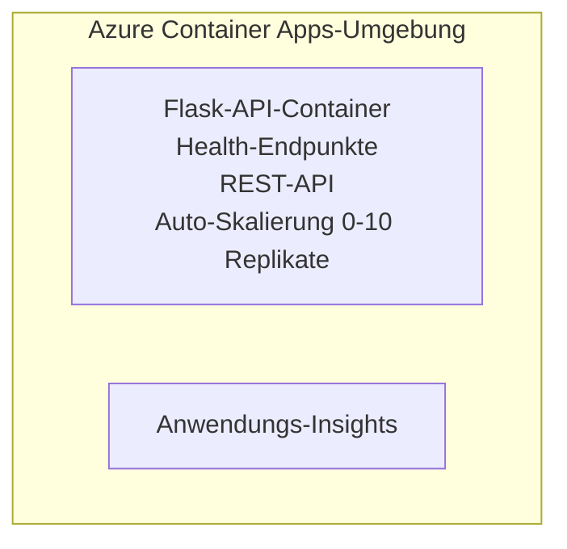

# Simple Flask API - Container App Example

**Lernpfad:** Anfänger ⭐ | **Zeit:** 25-35 Minuten | **Kosten:** $0-15/Monat

Eine vollständige, funktionierende Python Flask REST-API, die mit Azure Container Apps über die Azure Developer CLI (azd) bereitgestellt wird. Dieses Beispiel zeigt die Bereitstellung von Containern, Auto-Skalierung und Grundlagen der Überwachung.

## 🎯 Was Sie lernen werden

- Eine containerisierte Python-Anwendung in Azure bereitstellen
- Auto-Skalierung mit Scale-to-Zero konfigurieren
- Health-Probes und Readiness-Checks implementieren
- Anwendungsprotokolle und Metriken überwachen
- Azure Developer CLI für schnelle Bereitstellungen nutzen

## 📦 Enthalten

✅ **Flask Application** - Vollständige REST-API mit CRUD-Operationen (`src/app.py`)  
✅ **Dockerfile** - Produktionsfertige Container-Konfiguration  
✅ **Bicep Infrastructure** - Container Apps-Umgebung und API-Bereitstellung  
✅ **AZD Configuration** - Ein-Kommando-Bereitstellungs-Setup  
✅ **Health Probes** - Konfigurierte Liveness- und Readiness-Checks  
✅ **Auto-scaling** - 0-10 Replikate basierend auf HTTP-Last  

## Architecture


## Voraussetzungen

### Erforderlich
- **Azure Developer CLI (azd)** - [Installationsanleitung](https://learn.microsoft.com/azure/developer/azure-developer-cli/install-azd)
- **Azure subscription** - [Free account](https://azure.microsoft.com/free/)
- **Docker Desktop** - [Docker installieren](https://www.docker.com/products/docker-desktop/) (für lokale Tests)

### Voraussetzungen überprüfen

```bash
# azd-Version prüfen (benötigt 1.5.0 oder höher)
azd version

# Azure-Anmeldung überprüfen
azd auth login

# Docker prüfen (optional, für lokale Tests)
docker --version
```

## ⏱️ Bereitstellungszeitplan

| Phase | Duration | What Happens |
|-------|----------|--------------||
| Environment setup | 30 seconds | Create azd environment |
| Build container | 2-3 minutes | Docker build Flask app |
| Provision infrastructure | 3-5 minutes | Create Container Apps, registry, monitoring |
| Deploy application | 2-3 minutes | Push image and deploy to Container Apps |
| **Total** | **8-12 minutes** | Complete deployment ready |

## Schnellstart

```bash
# Zum Beispiel navigieren
cd examples/container-app/simple-flask-api

# Umgebung initialisieren (einen eindeutigen Namen wählen)
azd env new myflaskapi

# Alles bereitstellen (Infrastruktur + Anwendung)
azd up
# Sie werden aufgefordert:
# 1. Azure-Abonnement auswählen
# 2. Standort wählen (z. B. eastus2)
# 3. 8–12 Minuten auf die Bereitstellung warten

# Ihren API-Endpunkt abrufen
azd env get-values

# API testen
curl $(azd env get-value API_ENDPOINT)/health
```

**Erwartete Ausgabe:**
```json
{
  "status": "healthy",
  "timestamp": "2025-11-19T10:30:00Z",
  "service": "simple-flask-api",
  "version": "1.0.0"
}
```

## ✅ Bereitstellung überprüfen

### Schritt 1: Bereitstellungsstatus prüfen

```bash
# Bereitgestellte Dienste anzeigen
azd show

# Die erwartete Ausgabe zeigt:
# - Dienst: api
# - Endpunkt: https://ca-api-[env].xxx.azurecontainerapps.io
# - Status: Läuft
```

### Schritt 2: API-Endpunkte testen

```bash
# API-Endpunkt abrufen
API_URL=$(azd env get-value API_ENDPOINT)

# Gesundheitsstatus testen
curl $API_URL/health

# Root-Endpunkt testen
curl $API_URL/

# Ein Element erstellen
curl -X POST $API_URL/api/items \
  -H "Content-Type: application/json" \
  -d '{"name": "Test Item", "description": "My first item"}'

# Alle Elemente abrufen
curl $API_URL/api/items
```

**Erfolgskriterien:**
- ✅ Health-Endpunkt gibt HTTP 200 zurück
- ✅ Root-Endpunkt zeigt API-Informationen
- ✅ POST erstellt ein Element und gibt HTTP 201 zurück
- ✅ GET gibt erstellte Elemente zurück

### Schritt 3: Protokolle anzeigen

```bash
# Live-Protokolle mit azd monitor streamen
azd monitor --logs

# Oder die Azure CLI verwenden:
az containerapp logs show --name api --resource-group $RG_NAME --follow

# Sie sollten Folgendes sehen:
# - Gunicorn-Startmeldungen
# - HTTP-Anforderungsprotokolle
# - Informationsprotokolle der Anwendung
```

## Projektstruktur

```
simple-flask-api/
├── azure.yaml              # AZD configuration
├── infra/
│   ├── main.bicep         # Main infrastructure
│   ├── main.parameters.json
│   └── app/
│       ├── container-env.bicep
│       └── api.bicep
└── src/
    ├── app.py             # Flask application
    ├── requirements.txt
    └── Dockerfile
```

## API-Endpunkte

| Endpoint | Method | Description |
|----------|--------|-------------|
| `/health` | GET | Health-Check |
| `/api/items` | GET | Alle Elemente auflisten |
| `/api/items` | POST | Neues Element erstellen |
| `/api/items/{id}` | GET | Bestimmtes Element abrufen |
| `/api/items/{id}` | PUT | Element aktualisieren |
| `/api/items/{id}` | DELETE | Element löschen |

## Konfiguration

### Umgebungsvariablen

```bash
# Benutzerdefinierte Konfiguration festlegen
azd env set PORT 8000
azd env set LOG_LEVEL info
azd env set MAX_REPLICAS 20
```

### Skalierungskonfiguration

Die API skaliert automatisch basierend auf HTTP-Traffic:
- **Min Replicas**: 0 (skaliert auf Null, wenn inaktiv)
- **Max Replicas**: 10
- **Concurrent Requests per Replica**: 50

## Entwicklung

### Lokal ausführen

```bash
# Abhängigkeiten installieren
cd src
pip install -r requirements.txt

# App ausführen
python app.py

# Lokal testen
curl http://localhost:8000/health
```

### Container bauen und testen

```bash
# Docker-Image erstellen
docker build -t flask-api:local ./src

# Container lokal ausführen
docker run -p 8000:8000 flask-api:local

# Container testen
curl http://localhost:8000/health
```

## Bereitstellung

### Vollständige Bereitstellung

```bash
# Infrastruktur und Anwendung bereitstellen
azd up
```

### Nur-Code-Bereitstellung

```bash
# Nur Anwendungscode bereitstellen (Infrastruktur unverändert)
azd deploy api
```

### Konfiguration aktualisieren

```bash
# Umgebungsvariablen aktualisieren
azd env set API_KEY "new-api-key"

# Erneut mit neuer Konfiguration bereitstellen
azd deploy api
```

## Überwachung

### Protokolle anzeigen

```bash
# Live-Protokolle mit azd monitor streamen
azd monitor --logs

# Oder verwenden Sie die Azure CLI für Container Apps:
az containerapp logs show --name api --resource-group $RG_NAME --follow

# Letzte 100 Zeilen anzeigen
az containerapp logs show --name api --resource-group $RG_NAME --tail 100
```

### Metriken überwachen

```bash
# Azure Monitor-Dashboard öffnen
azd monitor --overview

# Bestimmte Metriken anzeigen
az monitor metrics list \
  --resource $(azd show --output json | jq -r '.services.api.resourceId') \
  --metric "Requests,ResponseTime"
```

## Testen

### Gesundheitsprüfung

```bash
curl $(azd show --output json | jq -r '.services.api.endpoint')/health
```

Erwartete Antwort:
```json
{
  "status": "healthy",
  "timestamp": "2025-11-19T10:30:00Z"
}
```

### Element erstellen

```bash
curl -X POST $(azd show --output json | jq -r '.services.api.endpoint')/api/items \
  -H "Content-Type: application/json" \
  -d '{"name": "Test Item", "description": "A test item"}'
```

### Alle Elemente abrufen

```bash
curl $(azd show --output json | jq -r '.services.api.endpoint')/api/items
```

## Kostenoptimierung

Diese Bereitstellung verwendet Scale-to-Zero, sodass Sie nur zahlen, wenn die API Anfragen verarbeitet:

- **Idle cost**: ~$0/month (skaliert auf Null)
- **Active cost**: ~$0.000024/second per replica
- **Erwartete monatliche Kosten** (geringe Nutzung): $5-15

### Kosten weiter senken

```bash
# Maximale Anzahl der Replikate für die Entwicklung reduzieren
azd env set MAX_REPLICAS 3

# Kürzeren Leerlauf-Timeout verwenden
azd env set SCALE_TO_ZERO_TIMEOUT 300  # 5 Minuten
```

## Fehlerbehebung

### Container startet nicht

```bash
# Containerprotokolle mit der Azure CLI überprüfen
az containerapp logs show --name api --resource-group $RG_NAME --tail 100

# Überprüfen, ob das Docker-Image lokal gebaut werden kann
docker build -t test ./src
```

### API nicht erreichbar

```bash
# Überprüfen, ob der Ingress extern ist
az containerapp show --name api --resource-group rg-simple-flask-api \
  --query properties.configuration.ingress.external
```

### Hohe Antwortzeiten

```bash
# CPU- und Speicherauslastung überprüfen
az monitor metrics list \
  --resource $(azd show --output json | jq -r '.services.api.resourceId') \
  --metric "CPUPercentage,MemoryPercentage"

# Bei Bedarf Ressourcen hochskalieren
az containerapp update --name api --resource-group rg-simple-flask-api \
  --cpu 1.0 --memory 2Gi
```

## Bereinigen

```bash
# Alle Ressourcen löschen
azd down --force --purge
```

## Nächste Schritte

### Dieses Beispiel erweitern

1. **Datenbank hinzufügen** - Azure Cosmos DB oder SQL Database integrieren
   ```bash
   # Füge das Cosmos DB-Modul zu infra/main.bicep hinzu
   # Aktualisiere app.py mit der Datenbankverbindung
   ```

2. **Authentifizierung hinzufügen** - Azure AD oder API-Schlüssel implementieren
   ```python
   # Füge Authentifizierungs-Middleware zu app.py hinzu
   from functools import wraps
   ```

3. **CI/CD einrichten** - GitHub Actions Workflow
   ```yaml
   # Create .github/workflows/deploy.yml
   name: Deploy to Azure
   on: [push]
   ```

4. **Managed Identity hinzufügen** - Gesicherten Zugriff auf Azure-Dienste einrichten
   ```bicep
   # Update infra/app/api.bicep
   identity: { type: 'SystemAssigned' }
   ```

### Verwandte Beispiele

- **[Database App](../../../../../examples/database-app)** - Vollständiges Beispiel mit SQL Database
- **[Microservices](../../../../../examples/container-app/microservices)** - Mehrere Dienste Architektur
- **[Container Apps Master Guide](../README.md)** - Alle Container-Pattern

### Lernressourcen

- 📚 [AZD For Beginners Course](../../../README.md) - Hauptseite des Kurses
- 📚 [Container Apps Patterns](../README.md) - Weitere Bereitstellungsmuster
- 📚 [AZD Templates Gallery](https://azure.github.io/awesome-azd/) - Community-Vorlagen

## Zusätzliche Ressourcen

### Dokumentation
- **[Flask Documentation](https://flask.palletsprojects.com/)** - Flask-Framework-Anleitung
- **[Azure Container Apps](https://learn.microsoft.com/azure/container-apps/)** - Offizielle Azure-Dokumentation
- **[Azure Developer CLI](https://learn.microsoft.com/azure/developer/azure-developer-cli/)** - azd Befehlsreferenz

### Tutorials
- **[Container Apps Quickstart](https://learn.microsoft.com/azure/container-apps/quickstart-portal)** - Ihre erste App bereitstellen
- **[Python on Azure](https://learn.microsoft.com/azure/developer/python/)** - Python-Entwicklungsleitfaden
- **[Bicep Language](https://learn.microsoft.com/azure/azure-resource-manager/bicep/)** - Infrastructure as Code

### Tools
- **[Azure Portal](https://portal.azure.com)** - Ressourcen visuell verwalten
- **[VS Code Azure Extension](https://marketplace.visualstudio.com/items?itemName=ms-azuretools.vscode-azurecontainerapps)** - IDE-Integration

---

**🎉 Herzlichen Glückwunsch!** Sie haben eine produktionsbereite Flask-API in Azure Container Apps mit Auto-Skalierung und Überwachung bereitgestellt.

**Fragen?** [Open an issue](https://github.com/microsoft/AZD-for-beginners/issues) oder schauen Sie in die [FAQ](../../../resources/faq.md)

---

<!-- CO-OP TRANSLATOR DISCLAIMER START -->
Haftungsausschluss:
Dieses Dokument wurde mithilfe des KI-Übersetzungsdienstes [Co-op Translator](https://github.com/Azure/co-op-translator) übersetzt. Obwohl wir um Genauigkeit bemüht sind, beachten Sie bitte, dass automatisierte Übersetzungen Fehler oder Ungenauigkeiten enthalten können. Das Originaldokument in seiner Originalsprache ist als maßgebliche Quelle zu betrachten. Für kritische Informationen wird eine professionelle menschliche Übersetzung empfohlen. Wir übernehmen keine Haftung für Missverständnisse oder Fehlinterpretationen, die sich aus der Nutzung dieser Übersetzung ergeben.
<!-- CO-OP TRANSLATOR DISCLAIMER END -->