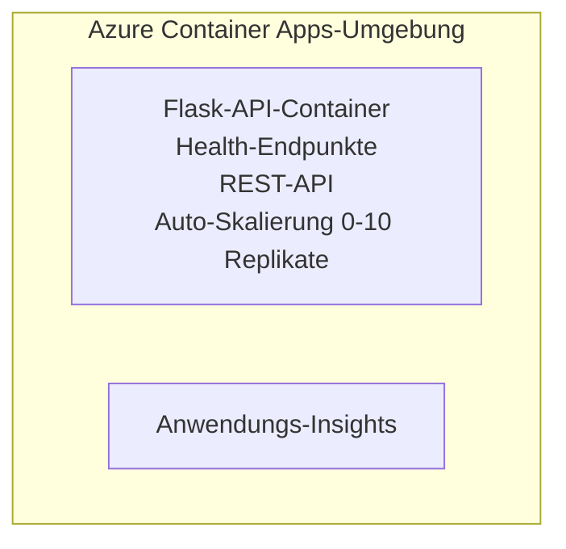

# Einfaches Flask-API - Container-App-Beispiel

**Lernpfad:** Beginner ⭐ | **Zeit:** 25-35 Minuten | **Kosten:** $0-15/Monat

Ein vollständiges, funktionsfähiges Python Flask REST-API, das mit Azure Developer CLI (azd) zu Azure Container Apps bereitgestellt wird. Dieses Beispiel zeigt Bereitstellung von Containern, Auto-Skalierung und Grundlagen des Monitorings.

## 🎯 Was Sie lernen werden

- Eine containerisierte Python-Anwendung nach Azure bereitstellen
- Auto-Skalierung mit Skalierung auf Null (scale-to-zero) konfigurieren
- Health-Probes und Readiness-Checks implementieren
- Anwendungsprotokolle und Metriken überwachen
- Azure Developer CLI für schnelle Bereitstellung verwenden

## 📦 Was enthalten ist

✅ **Flask-Anwendung** - Vollständige REST-API mit CRUD-Operationen (`src/app.py`)  
✅ **Dockerfile** - Produktionsreife Container-Konfiguration  
✅ **Bicep-Infrastruktur** - Container Apps-Umgebung und API-Bereitstellung  
✅ **AZD-Konfiguration** - Bereitstellung mit einem Befehl  
✅ **Health-Probes** - Liveness- und Readiness-Prüfungen konfiguriert  
✅ **Auto-Skalierung** - 0-10 Replikate basierend auf HTTP-Last  

## Architektur



## Voraussetzungen

### Erforderlich
- **Azure Developer CLI (azd)** - [Installationsanleitung](https://learn.microsoft.com/azure/developer/azure-developer-cli/install-azd)
- **Azure-Abonnement** - [Kostenloses Konto](https://azure.microsoft.com/free/)
- **Docker Desktop** - [Docker installieren](https://www.docker.com/products/docker-desktop/) (für lokale Tests)

### Voraussetzungen überprüfen

```bash
# Überprüfe azd-Version (benötigt 1.5.0 oder höher)
azd version

# Überprüfe Azure-Anmeldung
azd auth login

# Überprüfe Docker (optional, für lokale Tests)
docker --version
```

## ⏱️ Bereitstellungszeitplan

| Phase | Dauer | Was passiert |
|-------|----------|--------------||
| Environment setup | 30 Sekunden | azd-Umgebung erstellen |
| Build container | 2-3 Minuten | Docker-Build der Flask-App |
| Provision infrastructure | 3-5 Minuten | Container Apps, Registry, Monitoring erstellen |
| Deploy application | 2-3 Minuten | Image pushen und zu Container Apps bereitstellen |
| **Total** | **8-12 Minuten** | Bereitstellung abgeschlossen |

## Schnellstart

```bash
# Zum Beispiel navigieren
cd examples/container-app/simple-flask-api

# Umgebung initialisieren (einen eindeutigen Namen wählen)
azd env new myflaskapi

# Alles bereitstellen (Infrastruktur + Anwendung)
azd up
# Sie werden aufgefordert:
# 1. Azure-Abonnement auswählen
# 2. Standort wählen (z. B. eastus2)
# 3. 8-12 Minuten auf die Bereitstellung warten

# API-Endpunkt abrufen
azd env get-values

# API testen
curl $(azd env get-value API_ENDPOINT)/health
```

**Erwartete Ausgabe:**
```json
{
  "status": "healthy",
  "timestamp": "2025-11-19T10:30:00Z",
  "service": "simple-flask-api",
  "version": "1.0.0"
}
```

## ✅ Bereitstellung überprüfen

### Schritt 1: Bereitstellungsstatus prüfen

```bash
# Bereitgestellte Dienste anzeigen
azd show

# Erwartete Ausgabe zeigt:
# - Dienst: api
# - Endpunkt: https://ca-api-[env].xxx.azurecontainerapps.io
# - Status: Läuft
```

### Schritt 2: API-Endpunkte testen

```bash
# API-Endpunkt abrufen
API_URL=$(azd env get-value API_ENDPOINT)

# Gesundheit testen
curl $API_URL/health

# Root-Endpunkt testen
curl $API_URL/

# Ein Element erstellen
curl -X POST $API_URL/api/items \
  -H "Content-Type: application/json" \
  -d '{"name": "Test Item", "description": "My first item"}'

# Alle Elemente abrufen
curl $API_URL/api/items
```

**Erfolgskriterien:**
- ✅ Health-Endpunkt gibt HTTP 200 zurück
- ✅ Root-Endpunkt zeigt API-Informationen
- ✅ POST erstellt Element und gibt HTTP 201 zurück
- ✅ GET gibt erstellte Elemente zurück

### Schritt 3: Protokolle ansehen

```bash
# Live-Protokolle mit azd monitor streamen
azd monitor --logs

# Oder die Azure CLI verwenden:
az containerapp logs show --name api --resource-group $RG_NAME --follow

# Sie sollten Folgendes sehen:
# - Gunicorn-Startmeldungen
# - HTTP-Anforderungsprotokolle
# - Info-Protokolle der Anwendung
```

## Projektstruktur

```
simple-flask-api/
├── azure.yaml              # AZD configuration
├── infra/
│   ├── main.bicep         # Main infrastructure
│   ├── main.parameters.json
│   └── app/
│       ├── container-env.bicep
│       └── api.bicep
└── src/
    ├── app.py             # Flask application
    ├── requirements.txt
    └── Dockerfile
```

## API-Endpunkte

| Endpunkt | Methode | Beschreibung |
|----------|--------|-------------|
| `/health` | GET | Health-Check |
| `/api/items` | GET | Alle Elemente auflisten |
| `/api/items` | POST | Neues Element erstellen |
| `/api/items/{id}` | GET | Bestimmtes Element abrufen |
| `/api/items/{id}` | PUT | Element aktualisieren |
| `/api/items/{id}` | DELETE | Element löschen |

## Konfiguration

### Umgebungsvariablen

```bash
# Benutzerdefinierte Konfiguration festlegen
azd env set PORT 8000
azd env set LOG_LEVEL info
azd env set MAX_REPLICAS 20
```

### Skalierungskonfiguration

Die API skaliert automatisch basierend auf HTTP-Verkehr:
- **Minimale Replikate**: 0 (skaliert bei Inaktivität auf Null)
- **Maximale Replikate**: 10
- **Gleichzeitige Anfragen pro Replikat**: 50

## Entwicklung

### Lokal ausführen

```bash
# Abhängigkeiten installieren
cd src
pip install -r requirements.txt

# App ausführen
python app.py

# Lokal testen
curl http://localhost:8000/health
```

### Container bauen und testen

```bash
# Docker-Image erstellen
docker build -t flask-api:local ./src

# Container lokal ausführen
docker run -p 8000:8000 flask-api:local

# Container testen
curl http://localhost:8000/health
```

## Bereitstellung

### Vollständige Bereitstellung

```bash
# Infrastruktur und Anwendung bereitstellen
azd up
```

### Nur-Code-Bereitstellung

```bash
# Nur Anwendungscode bereitstellen (Infrastruktur unverändert)
azd deploy api
```

### Konfiguration aktualisieren

```bash
# Umgebungsvariablen aktualisieren
azd env set API_KEY "new-api-key"

# Erneut mit neuer Konfiguration bereitstellen
azd deploy api
```

## Überwachung

### Protokolle anzeigen

```bash
# Live-Protokolle mit azd monitor streamen
azd monitor --logs

# Oder verwenden Sie die Azure CLI für Container-Apps:
az containerapp logs show --name api --resource-group $RG_NAME --follow

# Letzte 100 Zeilen anzeigen
az containerapp logs show --name api --resource-group $RG_NAME --tail 100
```

### Metriken überwachen

```bash
# Azure Monitor-Dashboard öffnen
azd monitor --overview

# Bestimmte Metriken anzeigen
az monitor metrics list \
  --resource $(azd show --output json | jq -r '.services.api.resourceId') \
  --metric "Requests,ResponseTime"
```

## Tests

### Gesundheitsprüfung

```bash
curl $(azd show --output json | jq -r '.services.api.endpoint')/health
```

Erwartete Antwort:
```json
{
  "status": "healthy",
  "timestamp": "2025-11-19T10:30:00Z"
}
```

### Element erstellen

```bash
curl -X POST $(azd show --output json | jq -r '.services.api.endpoint')/api/items \
  -H "Content-Type: application/json" \
  -d '{"name": "Test Item", "description": "A test item"}'
```

### Alle Elemente abrufen

```bash
curl $(azd show --output json | jq -r '.services.api.endpoint')/api/items
```

## Kostenoptimierung

Diese Bereitstellung verwendet Scale-to-Zero, sodass Sie nur zahlen, wenn die API Anfragen verarbeitet:

- **Leerlaufkosten**: ~$0/Monat (auf Null skaliert)
- **Aktive Kosten**: ~$0.000024/Sekunde pro Replikat
- **Erwartete monatliche Kosten** (geringe Nutzung): $5-15

### Kosten weiter reduzieren

```bash
# Maximalzahl der Replikas für dev herunterskalieren
azd env set MAX_REPLICAS 3

# Kürzeren Inaktivitäts-Timeout verwenden
azd env set SCALE_TO_ZERO_TIMEOUT 300  # 5 Minuten
```

## Fehlerbehebung

### Container startet nicht

```bash
# Container-Protokolle mit der Azure CLI überprüfen
az containerapp logs show --name api --resource-group $RG_NAME --tail 100

# Überprüfen, ob das Docker-Image lokal gebaut werden kann
docker build -t test ./src
```

### API nicht erreichbar

```bash
# Überprüfen, ob Ingress extern ist
az containerapp show --name api --resource-group rg-simple-flask-api \
  --query properties.configuration.ingress.external
```

### Hohe Antwortzeiten

```bash
# CPU- und Speicherauslastung prüfen
az monitor metrics list \
  --resource $(azd show --output json | jq -r '.services.api.resourceId') \
  --metric "CPUPercentage,MemoryPercentage"

# Bei Bedarf Ressourcen hochskalieren
az containerapp update --name api --resource-group rg-simple-flask-api \
  --cpu 1.0 --memory 2Gi
```

## Aufräumen

```bash
# Alle Ressourcen löschen
azd down --force --purge
```

## Nächste Schritte

### Dieses Beispiel erweitern

1. **Datenbank hinzufügen** - Azure Cosmos DB oder SQL-Datenbank integrieren
   ```bash
   # Füge das Cosmos DB-Modul in infra/main.bicep hinzu
   # Aktualisiere app.py mit der Datenbankverbindung
   ```

2. **Authentifizierung hinzufügen** - Microsoft Entra ID oder API-Schlüssel implementieren
   ```python
   # Füge Authentifizierungs-Middleware zu app.py hinzu.
   from functools import wraps
   ```

3. **CI/CD einrichten** - GitHub Actions-Workflow
   ```yaml
   # Create .github/workflows/deploy.yml
   name: Deploy to Azure
   on: [push]
   ```

4. **Managed Identity hinzufügen** - Zugriff auf Azure-Dienste absichern
   ```bicep
   # Update infra/app/api.bicep
   identity: { type: 'SystemAssigned' }
   ```

### Verwandte Beispiele

- **[Datenbank-App](../../../../../examples/database-app)** - Vollständiges Beispiel mit SQL-Datenbank
- **[Microservices](../../../../../examples/container-app/microservices)** - Microservice-Architektur
- **[Container Apps Master Guide](../README.md)** - Alle Container-Muster

### Lernressourcen

- 📚 [AZD für Einsteigerkurs](../../../README.md) - Hauptseite des Kurses
- 📚 [Container Apps Patterns](../README.md) - Weitere Bereitstellungsmuster
- 📚 [AZD Templates Gallery](https://azure.github.io/awesome-azd/) - Community-Vorlagen

## Zusätzliche Ressourcen

### Dokumentation
- **[Flask-Dokumentation](https://flask.palletsprojects.com/)** - Flask-Framework-Leitfaden
- **[Azure Container Apps](https://learn.microsoft.com/azure/container-apps/)** - Offizielle Azure-Dokumentation
- **[Azure Developer CLI](https://learn.microsoft.com/azure/developer/azure-developer-cli/)** - azd-Befehlsreferenz

### Tutorials
- **[Container Apps Quickstart](https://learn.microsoft.com/azure/container-apps/quickstart-portal)** - Ihre erste App bereitstellen
- **[Python on Azure](https://learn.microsoft.com/azure/developer/python/)** - Python-Entwicklungsleitfaden
- **[Bicep Language](https://learn.microsoft.com/azure/azure-resource-manager/bicep/)** - Infrastruktur als Code

### Werkzeuge
- **[Azure Portal](https://portal.azure.com)** - Ressourcen visuell verwalten
- **[VS Code Azure Extension](https://marketplace.visualstudio.com/items?itemName=ms-azuretools.vscode-azurecontainerapps)** - IDE-Integration

---

**🎉 Glückwunsch!** Sie haben eine produktionsbereite Flask-API zu Azure Container Apps mit Auto-Skalierung und Überwachung bereitgestellt.

**Fragen?** [Ein Issue öffnen](https://github.com/microsoft/AZD-for-beginners/issues) oder die [FAQ](../../../resources/faq.md) prüfen

---

<!-- CO-OP TRANSLATOR DISCLAIMER START -->
**Haftungsausschluss**:
Dieses Dokument wurde mit dem KI-Übersetzungsdienst [Co-op Translator](https://github.com/Azure/co-op-translator) übersetzt. Obwohl wir uns um Genauigkeit bemühen, beachten Sie bitte, dass automatisierte Übersetzungen Fehler oder Ungenauigkeiten enthalten können. Das Originaldokument in seiner Ursprungssprache gilt als maßgebliche Quelle. Bei kritischen Informationen wird eine professionelle menschliche Übersetzung empfohlen. Wir übernehmen keine Haftung für Missverständnisse oder Fehlinterpretationen, die aus der Verwendung dieser Übersetzung entstehen.
<!-- CO-OP TRANSLATOR DISCLAIMER END -->