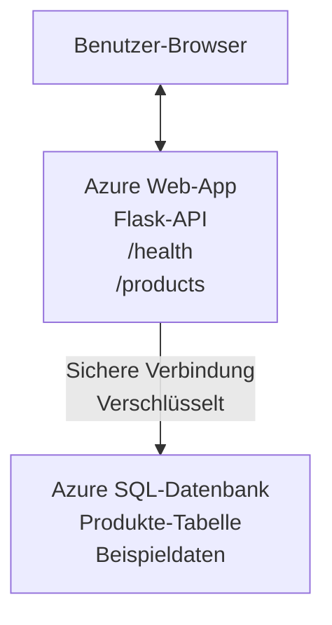

# Bereitstellen einer Microsoft SQL-Datenbank und Web-App mit AZD

⏱️ **Geschätzte Zeit**: 20-30 Minuten | 💰 **Geschätzte Kosten**: ~$15-25/Monat | ⭐ **Komplexität**: Mittel

Dieses **vollständige, funktionierende Beispiel** zeigt, wie Sie die [Azure Developer CLI (azd)](https://learn.microsoft.com/azure/developer/azure-developer-cli/) verwenden, um eine Python Flask-Webanwendung mit einer Microsoft SQL-Datenbank in Azure bereitzustellen. Sämtlicher Code ist enthalten und getestet—keine externen Abhängigkeiten erforderlich.

## Was Sie lernen werden

Durch das Abschließen dieses Beispiels werden Sie:
- Eine mehrschichtige Anwendung (Web-App + Datenbank) mit Infrastructure-as-Code bereitstellen
- Sichere Datenbankverbindungen konfigurieren, ohne Geheimnisse zu hardcodieren
- Die Anwendungsintegrität mit Application Insights überwachen
- Azure-Ressourcen effizient mit der AZD-CLI verwalten
- Den Azure-Best-Practices für Sicherheit, Kostenoptimierung und Observability folgen

## Szenarioübersicht
- **Web App**: Python Flask REST-API mit Datenbankanbindung
- **Datenbank**: Azure SQL-Datenbank mit Beispieldaten
- **Infrastruktur**: Bereitgestellt mit Bicep (modulare, wiederverwendbare Vorlagen)
- **Bereitstellung**: Voll automatisiert mit `azd`-Befehlen
- **Überwachung**: Application Insights für Logs und Telemetrie

## Voraussetzungen

### Erforderliche Tools

Bevor Sie beginnen, vergewissern Sie sich, dass Sie diese Tools installiert haben:

1. **[Azure CLI](https://learn.microsoft.com/cli/azure/install-azure-cli)** (Version 2.50.0 oder höher)
   ```sh
   az --version
   # Erwartete Ausgabe: azure-cli 2.50.0 oder höher
   ```

2. **[Azure Developer CLI (azd)](https://learn.microsoft.com/azure/developer/azure-developer-cli/install-azd)** (Version 1.0.0 oder höher)
   ```sh
   azd version
   # Erwartete Ausgabe: azd-Version 1.0.0 oder höher
   ```

3. **[Python 3.8+](https://www.python.org/downloads/)** (für lokale Entwicklung)
   ```sh
   python --version
   # Erwartete Ausgabe: Python 3.8 oder höher
   ```

4. **[Docker](https://www.docker.com/get-started)** (optional, für lokale containerisierte Entwicklung)
   ```sh
   docker --version
   # Erwartete Ausgabe: Docker-Version 20.10 oder höher
   ```

### Azure-Anforderungen

- Ein aktives **Azure-Abonnement** ([kostenloses Konto erstellen](https://azure.microsoft.com/free/))
- Berechtigungen zum Erstellen von Ressourcen in Ihrem Abonnement
- **Owner** oder **Contributor** Rolle auf dem Abonnement oder der Ressourcengruppe

### Vorausgesetztes Wissen

Dies ist ein Beispiel auf **mittlerem Niveau**. Sie sollten vertraut sein mit:
- Grundlegenden Befehlszeilenoperationen
- Grundlegenden Cloud-Konzepten (Ressourcen, Ressourcengruppen)
- Grundlegendem Verständnis von Webanwendungen und Datenbanken

**Neu bei AZD?** Beginnen Sie zuerst mit der [Einstiegsanleitung](../../docs/chapter-01-foundation/azd-basics.md).

## Architektur

Dieses Beispiel stellt eine zweistufige Architektur mit einer Webanwendung und einer SQL-Datenbank bereit:



**Bereitstellung von Ressourcen:**
- **Resource Group**: Container für alle Ressourcen
- **App Service Plan**: Linux-basiertes Hosting (B1-Tier zur Kosteneffizienz)
- **Web App**: Python 3.11-Laufzeit mit Flask-Anwendung
- **SQL Server**: Verwalteter Datenbankserver mit mindestens TLS 1.2
- **SQL Database**: Basic-Tier (2GB, geeignet für Entwicklung/Tests)
- **Application Insights**: Überwachung und Protokollierung
- **Log Analytics Workspace**: Zentralisierte Protokollspeicherung

**Analogie**: Denken Sie daran wie an ein Restaurant (Web-App) mit einer Lagertruhe (Datenbank). Kunden bestellen vom Menü (API-Endpunkte), und die Küche (Flask-App) holt Zutaten (Daten) aus der Truhe. Der Restaurantmanager (Application Insights) verfolgt alles, was passiert.

## Ordnerstruktur

Alle Dateien sind in diesem Beispiel enthalten—keine externen Abhängigkeiten erforderlich:

```
examples/database-app/
│
├── README.md                    # This file
├── azure.yaml                   # AZD configuration file
├── .env.sample                  # Sample environment variables
├── .gitignore                   # Git ignore patterns
│
├── infra/                       # Infrastructure as Code (Bicep)
│   ├── main.bicep              # Main orchestration template
│   ├── abbreviations.json      # Azure naming conventions
│   └── resources/              # Modular resource templates
│       ├── sql-server.bicep    # SQL Server configuration
│       ├── sql-database.bicep  # Database configuration
│       ├── app-service-plan.bicep  # Hosting plan
│       ├── app-insights.bicep  # Monitoring setup
│       └── web-app.bicep       # Web application
│
└── src/
    └── web/                    # Application source code
        ├── app.py              # Flask REST API
        ├── requirements.txt    # Python dependencies
        └── Dockerfile          # Container definition
```

**Funktion jeder Datei:**
- **azure.yaml**: Teilt AZD mit, was und wo bereitgestellt werden soll
- **infra/main.bicep**: Orchestriert alle Azure-Ressourcen
- **infra/resources/*.bicep**: Einzelne Ressourcendefinitionen (modular zur Wiederverwendung)
- **src/web/app.py**: Flask-Anwendung mit Datenbanklogik
- **requirements.txt**: Python-Paketabhängigkeiten
- **Dockerfile**: Containerisierungsanweisungen für die Bereitstellung

## Schnellstart (Schritt-für-Schritt)

### Schritt 1: Klonen und Navigieren

```sh
git clone https://github.com/microsoft/AZD-for-beginners.git
cd AZD-for-beginners/examples/database-app
```

**✓ Erfolgskontrolle**: Vergewissern Sie sich, dass Sie `azure.yaml` und den Ordner `infra/` sehen:
```sh
ls
# Erwartet: README.md, azure.yaml, infra/, src/
```

### Schritt 2: Bei Azure authentifizieren

```sh
azd auth login
```

Dies öffnet Ihren Browser zur Azure-Authentifizierung. Melden Sie sich mit Ihren Azure-Anmeldedaten an.

**✓ Erfolgskontrolle**: Sie sollten Folgendes sehen:
```
Logged in to Azure.
```

### Schritt 3: Umgebung initialisieren

```sh
azd init
```

**Was passiert**: AZD erstellt eine lokale Konfiguration für Ihre Bereitstellung.

**Eingabeaufforderungen, die Sie sehen werden**:
- **Environment name**: Geben Sie einen kurzen Namen ein (z. B. `dev`, `myapp`)
- **Azure subscription**: Wählen Sie Ihr Abonnement aus der Liste aus
- **Azure location**: Wählen Sie eine Region (z. B. `eastus`, `westeurope`)

**✓ Erfolgskontrolle**: Sie sollten Folgendes sehen:
```
SUCCESS: New project initialized!
```

### Schritt 4: Azure-Ressourcen bereitstellen

```sh
azd provision
```

**Was passiert**: AZD stellt die gesamte Infrastruktur bereit (dauert 5-8 Minuten):
1. Erstellt die Ressourcengruppe
2. Erstellt SQL-Server und Datenbank
3. Erstellt App Service Plan
4. Erstellt Web App
5. Erstellt Application Insights
6. Konfiguriert Netzwerk und Sicherheit

**Sie werden gefragt nach**:
- **SQL admin username**: Geben Sie einen Benutzernamen ein (z. B. `sqladmin`)
- **SQL admin password**: Geben Sie ein starkes Passwort ein (bewahren Sie dieses auf!)

**✓ Erfolgskontrolle**: Sie sollten Folgendes sehen:
```
SUCCESS: Your application was provisioned in Azure in X minutes Y seconds.
You can view the resources created under the resource group rg-<env-name> in Azure Portal:
https://portal.azure.com/#@/resource/subscriptions/.../resourceGroups/rg-<env-name>
```

**⏱️ Zeit**: 5-8 Minuten

### Schritt 5: Anwendung bereitstellen

```sh
azd deploy
```

**Was passiert**: AZD baut und deployt Ihre Flask-Anwendung:
1. Verpackt die Python-Anwendung
2. Baut das Docker-Container-Image
3. Schiebt es zur Azure Web App
4. Initialisiert die Datenbank mit Beispieldaten
5. Startet die Anwendung

**✓ Erfolgskontrolle**: Sie sollten Folgendes sehen:
```
SUCCESS: Your application was deployed to Azure in X minutes Y seconds.
You can view the resources created under the resource group rg-<env-name> in Azure Portal:
https://portal.azure.com/#@/resource/subscriptions/.../resourceGroups/rg-<env-name>
```

**⏱️ Zeit**: 3-5 Minuten

### Schritt 6: Anwendung im Browser öffnen

```sh
azd browse
```

Dies öffnet Ihre bereitgestellte Web-App im Browser unter `https://app-<unique-id>.azurewebsites.net`

**✓ Erfolgskontrolle**: Sie sollten JSON-Ausgabe sehen:
```json
{
  "message": "Welcome to the Database App API",
  "endpoints": {
    "/": "This help message",
    "/health": "Health check endpoint",
    "/products": "List all products",
    "/products/<id>": "Get product by ID"
  }
}
```

### Schritt 7: API-Endpunkte testen

**Health-Check** (Datenbankverbindung überprüfen):
```sh
curl https://app-<your-id>.azurewebsites.net/health
```

**Erwartete Antwort**:
```json
{
  "status": "healthy",
  "database": "connected"
}
```

**Produkte auflisten** (Beispieldaten):
```sh
curl https://app-<your-id>.azurewebsites.net/products
```

**Erwartete Antwort**:
```json
[
  {
    "id": 1,
    "name": "Laptop",
    "description": "High-performance laptop",
    "price": 1299.99,
    "created_at": "2025-11-19T10:30:00"
  },
  ...
]
```

**Einzelnes Produkt abrufen**:
```sh
curl https://app-<your-id>.azurewebsites.net/products/1
```

**✓ Erfolgskontrolle**: Alle Endpunkte geben JSON-Daten ohne Fehler zurück.

---

**🎉 Herzlichen Glückwunsch!** Sie haben erfolgreich eine Webanwendung mit einer Datenbank in Azure mit AZD bereitgestellt.

## Detaillierter Konfigurationsüberblick

### Umgebungsvariablen

Geheimnisse werden sicher über die App Service-Konfiguration verwaltet—**niemals im Quellcode hardcodieren**.

**Wird automatisch von AZD konfiguriert**:
- `SQL_CONNECTION_STRING`: Datenbankverbindung mit verschlüsselten Anmeldeinformationen
- `APPLICATIONINSIGHTS_CONNECTION_STRING`: Telemetrie-Endpunkt für Monitoring
- `SCM_DO_BUILD_DURING_DEPLOYMENT`: Aktiviert die automatische Installation von Abhängigkeiten

**Wo Geheimnisse gespeichert werden**:
1. Während `azd provision` geben Sie SQL-Anmeldedaten über sichere Eingabeaufforderungen ein
2. AZD speichert diese in Ihrer lokalen `.azure/<env-name>/.env`-Datei (git-ignored)
3. AZD injiziert sie in die App Service-Konfiguration in Azure (verschlüsselt im Ruhezustand)
4. Die Anwendung liest sie zur Laufzeit über `os.getenv()`

### Lokale Entwicklung

Für lokale Tests erstellen Sie eine `.env`-Datei aus der Vorlage:

```sh
cp .env.sample .env
# Bearbeiten Sie die .env-Datei mit Ihrer lokalen Datenbankverbindung
```

**Lokaler Entwicklungsablauf**:
```sh
# Abhängigkeiten installieren
cd src/web
pip install -r requirements.txt

# Umgebungsvariablen setzen
export SQL_CONNECTION_STRING="your-local-connection-string"

# Anwendung ausführen
python app.py
```

**Lokal testen**:
```sh
curl http://localhost:8000/health
# Erwartet: {"status": "gesund", "database": "verbunden"}
```

### Infrastruktur als Code

Alle Azure-Ressourcen sind in **Bicep-Vorlagen** (`infra/`-Ordner) definiert:

- **Modulares Design**: Jeder Ressourcentyp hat seine eigene Datei zur Wiederverwendbarkeit
- **Parametrisierbar**: Passen Sie SKUs, Regionen und Namenskonventionen an
- **Bewährte Praktiken**: Folgt Azure-Namensstandards und Sicherheits-Defaults
- **Versioniert**: Infrastrukturänderungen werden in Git nachverfolgt

**Beispiel zur Anpassung**:
Um das Datenbank-Tier zu ändern, bearbeiten Sie `infra/resources/sql-database.bicep`:
```bicep
sku: {
  name: 'Standard'  // Changed from 'Basic'
  tier: 'Standard'
  capacity: 10
}
```

## Bewährte Sicherheitspraktiken

Dieses Beispiel folgt den Azure-Sicherheits-Best-Practices:

### 1. Keine Geheimnisse im Quellcode
- ✅ Zugangsdaten in der App Service-Konfiguration gespeichert (verschlüsselt)
- ✅ `.env`-Dateien über `.gitignore` vom Git ausgeschlossen
- ✅ Geheimnisse werden während der Bereitstellung über sichere Parameter übergeben

### 2. Verschlüsselte Verbindungen
- ✅ Mindestens TLS 1.2 für den SQL-Server
- ✅ HTTPS-only für die Web-App durchgesetzt
- ✅ Datenbankverbindungen verwenden verschlüsselte Kanäle

### 3. Netzwerksicherheit
- ✅ SQL-Server-Firewall so konfiguriert, dass nur Azure-Dienste zugelassen werden
- ✅ Öffentlicher Netzwerkzugriff eingeschränkt (kann weiter mit Private Endpoints gesichert werden)
- ✅ FTPS auf der Web-App deaktiviert

### 4. Authentifizierung & Autorisierung
- ⚠️ **Aktuell**: SQL-Authentifizierung (Benutzername/Passwort)
- ✅ **Empfehlung für Produktion**: Verwenden Sie Azure Managed Identity für passwortlose Authentifizierung

**Zum Umstieg auf Managed Identity** (für Produktion):
1. Aktivieren Sie Managed Identity auf der Web App
2. Gewähren Sie der Identity SQL-Berechtigungen
3. Aktualisieren Sie die Verbindungszeichenfolge zur Nutzung der Managed Identity
4. Entfernen Sie die passwortbasierte Authentifizierung

### 5. Prüfung & Compliance
- ✅ Application Insights protokolliert alle Anfragen und Fehler
- ✅ SQL-Datenbank-Auditing aktiviert (kann für Compliance konfiguriert werden)
- ✅ Alle Ressourcen getaggt zur Governance

**Sicherheits-Checkliste vor der Produktion**:
- [ ] Azure Defender für SQL aktivieren
- [ ] Private Endpoints für die SQL-Datenbank konfigurieren
- [ ] Web Application Firewall (WAF) aktivieren
- [ ] Azure Key Vault für Secret Rotation implementieren
- [ ] Azure AD-Authentifizierung konfigurieren
- [ ] Diagnostisches Logging für alle Ressourcen aktivieren

## Kostenoptimierung

**Geschätzte monatliche Kosten** (Stand November 2025):

| Ressource | SKU/Tier | Geschätzte Kosten |
|----------|----------|----------------|
| App Service Plan | B1 (Basic) | ~$13/Monat |
| SQL Database | Basic (2GB) | ~$5/Monat |
| Application Insights | Pay-as-you-go | ~$2/Monat (geringer Traffic) |
| **Gesamt** | | **~$20/Monat** |

**💡 Spar-Tipps**:

1. **Kostenlose Stufe zum Lernen verwenden**:
   - App Service: F1-Tier (kostenlos, begrenzte Stunden)
   - SQL Database: Azure SQL Database serverless verwenden
   - Application Insights: 5GB/Monat kostenlose Ingestion

2. **Ressourcen stoppen, wenn sie nicht verwendet werden**:
   ```sh
   # Web-App stoppen (Datenbank verursacht weiterhin Kosten)
   az webapp stop --name <app-name> --resource-group <rg-name>
   
   # Bei Bedarf neu starten
   az webapp start --name <app-name> --resource-group <rg-name>
   ```

3. **Alles nach dem Testen löschen**:
   ```sh
   azd down
   ```
   Dies entfernt ALLE Ressourcen und stoppt die Kosten.

4. **Development- vs. Production-SKUs**:
   - **Entwicklung**: Basic-Tier (im Beispiel verwendet)
   - **Produktion**: Standard/Premium-Tier mit Redundanz

**Kostenüberwachung**:
- Kosten in [Azure Cost Management](https://portal.azure.com/#view/Microsoft_Azure_CostManagement) anzeigen
- Kostenwarnungen einrichten, um Überraschungen zu vermeiden
- Markieren Sie alle Ressourcen mit `azd-env-name` zur Nachverfolgung

**Alternative zur kostenlosen Stufe**:
Für Lernzwecke können Sie `infra/resources/app-service-plan.bicep` anpassen:
```bicep
sku: {
  name: 'F1'  // Free tier
  tier: 'Free'
}
```
**Hinweis**: Die kostenlose Stufe hat Einschränkungen (60 Min./Tag CPU, kein Always-On).

## Überwachung und Beobachtbarkeit

### Integration von Application Insights

Dieses Beispiel enthält **Application Insights** für umfassendes Monitoring:

**Was überwacht wird**:
- ✅ HTTP-Anfragen (Latenz, Statuscodes, Endpunkte)
- ✅ Anwendungsfehler und Ausnahmen
- ✅ Benutzerdefinierte Logs aus der Flask-App
- ✅ Datenbankverbindungszustand
- ✅ Leistungskennzahlen (CPU, Arbeitsspeicher)

**Auf Application Insights zugreifen**:
1. Öffnen Sie das [Azure-Portal](https://portal.azure.com)
2. Navigieren Sie zu Ihrer Ressourcengruppe (`rg-<env-name>`)
3. Klicken Sie auf die Application Insights-Ressource (`appi-<unique-id>`)

**Nützliche Abfragen** (Application Insights → Logs):

**Alle Anfragen anzeigen**:
```kusto
requests
| where timestamp > ago(1h)
| order by timestamp desc
| project timestamp, name, url, resultCode, duration
```

**Fehler finden**:
```kusto
exceptions
| where timestamp > ago(24h)
| order by timestamp desc
| project timestamp, type, outerMessage, operation_Name
```

**Health-Endpoint prüfen**:
```kusto
requests
| where name contains "health"
| summarize count() by resultCode, bin(timestamp, 1h)
```

### SQL-Datenbank-Auditing

**SQL-Datenbank-Auditing ist aktiviert**, um zu verfolgen:
- Datenbankzugriffsmuster
- Fehlgeschlagene Anmeldeversuche
- Schemaänderungen
- Datenzugriffe (für Compliance)

**Auf Audit-Logs zugreifen**:
1. Azure-Portal → SQL-Datenbank → Auditing
2. Protokolle im Log Analytics-Arbeitsbereich anzeigen

### Echtzeitüberwachung

**Live-Metriken anzeigen**:
1. Application Insights → Live Metrics
2. Sehen Sie Anfragen, Fehler und Performance in Echtzeit

**Alerts einrichten**:
Erstellen Sie Alerts für kritische Ereignisse:
- HTTP 500-Fehler > 5 in 5 Minuten
- Datenbankverbindungsfehler
- Hohe Antwortzeiten (>2 Sekunden)

**Beispiel: Erstellen eines Alerts**:
```sh
az monitor metrics alert create \
  --name "High-Response-Time" \
  --resource-group <rg-name> \
  --scopes <app-insights-resource-id> \
  --condition "avg requests/duration > 2000" \
  --description "Alert when response time exceeds 2 seconds"
```

## Fehlerbehebung
### Häufige Probleme und Lösungen

#### 1. `azd provision` schlägt fehl mit "Location not available"

**Symptom**:
```
Error: The subscription is not registered for the resource type 'components' in the location 'centralus'.
```

**Lösung**:
Wählen Sie eine andere Azure-Region oder registrieren Sie den Resource-Provider:
```sh
az provider register --namespace Microsoft.Insights
```

#### 2. SQL-Verbindung schlägt während der Bereitstellung fehl

**Symptom**:
```
pyodbc.OperationalError: ('08001', '[08001] [Microsoft][ODBC Driver 18 for SQL Server]TCP Provider...')
```

**Lösung**:
- Vergewissern Sie sich, dass die SQL-Server-Firewall Azure-Dienste zulässt (wird automatisch konfiguriert)
- Prüfen Sie, ob das SQL-Admin-Passwort während `azd provision` korrekt eingegeben wurde
- Stellen Sie sicher, dass der SQL-Server vollständig bereitgestellt ist (kann 2-3 Minuten dauern)

**Verbindung überprüfen**:
```sh
# Gehen Sie im Azure-Portal zu SQL-Datenbank → Abfrage-Editor
# Versuchen Sie, sich mit Ihren Anmeldeinformationen zu verbinden
```

#### 3. Web-App zeigt "Application Error"

**Symptom**:
Der Browser zeigt eine generische Fehlerseite an.

**Lösung**:
Überprüfen Sie die Anwendungsprotokolle:
```sh
# Letzte Protokolle anzeigen
az webapp log tail --name <app-name> --resource-group <rg-name>
```

**Häufige Ursachen**:
- Fehlende Umgebungsvariablen (überprüfen Sie App Service → Konfiguration)
- Installation von Python-Paketen fehlgeschlagen (überprüfen Sie die Bereitstellungsprotokolle)
- Fehler bei der Datenbankinitialisierung (überprüfen Sie die SQL-Konnektivität)

#### 4. `azd deploy` schlägt fehl mit "Build Error"

**Symptom**:
```
Error: Failed to build project
```

**Lösung**:
- Stellen Sie sicher, dass `requirements.txt` keine Syntaxfehler enthält
- Überprüfen Sie, dass Python 3.11 in `infra/resources/web-app.bicep` angegeben ist
- Stellen Sie sicher, dass das Dockerfile das richtige Basis-Image verwendet

**Lokal debuggen**:
```sh
cd src/web
docker build -t test-app .
docker run -p 8000:8000 test-app
```

#### 5. "Unauthorized" beim Ausführen von AZD-Befehlen

**Symptom**:
```
ERROR: (Unauthorized) The client '<id>' with object id '<id>' does not have authorization
```

**Lösung**:
Erneut bei Azure authentifizieren:
```sh
azd auth login
az login
```

Stellen Sie sicher, dass Sie die richtigen Berechtigungen (Rolle "Contributor") für das Abonnement haben.

#### 6. Hohe Datenbankkosten

**Symptom**:
Unerwartete Azure-Rechnung.

**Lösung**:
- Prüfen Sie, ob Sie vergessen haben, `azd down` nach dem Testen auszuführen
- Überprüfen Sie, ob die SQL-Datenbank die Stufe Basic verwendet (nicht Premium)
- Analysieren Sie die Kosten in Azure Cost Management
- Richten Sie Kostenwarnungen ein

### Hilfe erhalten

**Alle AZD-Umgebungsvariablen anzeigen**:
```sh
azd env get-values
```

**Bereitstellungsstatus prüfen**:
```sh
az webapp show --name <app-name> --resource-group <rg-name> --query state
```

**Auf Anwendungsprotokolle zugreifen**:
```sh
az webapp log download --name <app-name> --resource-group <rg-name> --log-file app-logs.zip
```

**Mehr Hilfe benötigt?**
- [AZD-Fehlerbehebungsleitfaden](../../docs/chapter-07-troubleshooting/common-issues.md)
- [Azure App Service Fehlerbehebung](https://learn.microsoft.com/azure/app-service/troubleshoot-diagnostic-logs)
- [Azure SQL Fehlerbehebung](https://learn.microsoft.com/azure/azure-sql/database/troubleshoot-common-errors-issues)

## Praktische Übungen

### Übung 1: Überprüfen Sie Ihre Bereitstellung (Anfänger)

**Ziel**: Bestätigen Sie, dass alle Ressourcen bereitgestellt wurden und die Anwendung funktioniert.

**Schritte**:
1. Listen Sie alle Ressourcen in Ihrer Ressourcengruppe auf:
   ```sh
   az resource list --resource-group rg-<env-name> --output table
   ```
   **Erwartet**: 6-7 Ressourcen (Web App, SQL Server, SQL Database, App Service Plan, Application Insights, Log Analytics)

2. Testen Sie alle API-Endpunkte:
   ```sh
   curl https://app-<your-id>.azurewebsites.net/
   curl https://app-<your-id>.azurewebsites.net/health
   curl https://app-<your-id>.azurewebsites.net/products
   curl https://app-<your-id>.azurewebsites.net/products/1
   ```
   **Erwartet**: Alle liefern gültiges JSON ohne Fehler

3. Überprüfen Sie Application Insights:
   - Navigieren Sie zu Application Insights im Azure-Portal
   - Gehen Sie zu "Live Metrics"
   - Aktualisieren Sie Ihren Browser auf der Web-App
   **Erwartet**: Sie sehen Anfragen in Echtzeit

**Erfolgskriterien**: Alle 6-7 Ressourcen existieren, alle Endpunkte liefern Daten, Live Metrics zeigt Aktivität.

---

### Übung 2: Einen neuen API-Endpunkt hinzufügen (Fortgeschritten)

**Ziel**: Erweitern Sie die Flask-Anwendung um einen neuen Endpunkt.

**Startcode**: Aktuelle Endpunkte in `src/web/app.py`

**Schritte**:
1. Bearbeiten Sie `src/web/app.py` und fügen Sie nach der Funktion `get_product()` einen neuen Endpunkt hinzu:
   ```python
   @app.route('/products/search/<keyword>')
   def search_products(keyword):
       """Search products by name or description."""
       try:
           conn = get_db_connection()
           cursor = conn.cursor()
           cursor.execute(
               "SELECT id, name, description, price, created_at FROM products WHERE name LIKE ? OR description LIKE ?",
               (f'%{keyword}%', f'%{keyword}%')
           )
           
           products = []
           for row in cursor.fetchall():
               products.append({
                   'id': row[0],
                   'name': row[1],
                   'description': row[2],
                   'price': float(row[3]) if row[3] else None,
                   'created_at': row[4].isoformat() if row[4] else None
               })
           
           cursor.close()
           conn.close()
           
           logger.info(f"Search for '{keyword}' returned {len(products)} results")
           return jsonify(products), 200
           
       except Exception as e:
           logger.error(f"Error searching products: {str(e)}")
           return jsonify({'error': str(e)}), 500
   ```

2. Stellen Sie die aktualisierte Anwendung bereit:
   ```sh
   azd deploy
   ```

3. Testen Sie den neuen Endpunkt:
   ```sh
   curl https://app-<your-id>.azurewebsites.net/products/search/laptop
   ```
   **Erwartet**: Gibt Produkte zurück, die "laptop" entsprechen

**Erfolgskriterien**: Der neue Endpunkt funktioniert, liefert gefilterte Ergebnisse und erscheint in den Application Insights-Protokollen.

---

### Übung 3: Monitoring und Warnungen hinzufügen (Experte)

**Ziel**: Richten Sie proaktives Monitoring mit Warnungen ein.

**Schritte**:
1. Erstellen Sie eine Warnung für HTTP-500-Fehler:
   ```sh
   # Application Insights-Ressourcen-ID abrufen
   AI_ID=$(az monitor app-insights component show \
     --app appi-<your-id> \
     --resource-group rg-<env-name> \
     --query id -o tsv)
   
   # Alarm erstellen
   az monitor metrics alert create \
     --name "High-Error-Rate" \
     --resource-group rg-<env-name> \
     --scopes $AI_ID \
     --condition "count requests/failed > 5" \
     --window-size 5m \
     --evaluation-frequency 1m \
     --description "Alert when >5 failed requests in 5 minutes"
   ```

2. Lösen Sie die Warnung aus, indem Sie Fehler verursachen:
   ```sh
   # Ein nicht existierendes Produkt anfordern
   for i in {1..10}; do curl https://app-<your-id>.azurewebsites.net/products/999; done
   ```

3. Überprüfen Sie, ob die Warnung ausgelöst wurde:
   - Azure-Portal → Alerts → Alert Rules
   - Überprüfen Sie Ihre E-Mails (falls konfiguriert)

**Erfolgskriterien**: Die Alarmregel ist erstellt, löst bei Fehlern aus und Benachrichtigungen werden empfangen.

---

### Übung 4: Änderungen am Datenbankschema (Fortgeschritten)

**Ziel**: Fügen Sie eine neue Tabelle hinzu und passen Sie die Anwendung an, damit sie diese verwendet.

**Schritte**:
1. Verbinden Sie sich über den Query Editor im Azure-Portal mit der SQL-Datenbank

2. Erstellen Sie eine neue `categories`-Tabelle:
   ```sql
   CREATE TABLE categories (
       id INT PRIMARY KEY IDENTITY(1,1),
       name NVARCHAR(50) NOT NULL,
       description NVARCHAR(200)
   );
   
   INSERT INTO categories (name, description) VALUES
   ('Electronics', 'Electronic devices and accessories'),
   ('Office Supplies', 'Office equipment and supplies');
   
   -- Add category to products table
   ALTER TABLE products ADD category_id INT;
   UPDATE products SET category_id = 1; -- Set all to Electronics
   ```

3. Aktualisieren Sie `src/web/app.py`, um Kategorieninformationen in den Antworten einzuschließen

4. Bereitstellen und testen

**Erfolgskriterien**: Die neue Tabelle existiert, Produkte zeigen Kategorieninformationen an und die Anwendung funktioniert weiterhin.

---

### Übung 5: Caching implementieren (Experte)

**Ziel**: Fügen Sie Azure Redis Cache hinzu, um die Leistung zu verbessern.

**Schritte**:
1. Fügen Sie Redis Cache zu `infra/main.bicep` hinzu
2. Aktualisieren Sie `src/web/app.py`, um Produktabfragen zwischenzuspeichern
3. Messen Sie die Leistungsverbesserung mit Application Insights
4. Vergleichen Sie die Antwortzeiten vor/nach dem Caching

**Erfolgskriterien**: Redis ist bereitgestellt, das Caching funktioniert, die Antwortzeiten verbessern sich um >50%.

**Tipp**: Beginnen Sie mit der [Azure Cache for Redis documentation](https://learn.microsoft.com/azure/azure-cache-for-redis/).

---

## Bereinigung

Um fortlaufende Kosten zu vermeiden, löschen Sie alle Ressourcen, wenn Sie fertig sind:

```sh
azd down
```

**Bestätigungsabfrage**:
```
? Total resources to delete: 7, are you sure you want to continue? (y/N)
```

Geben Sie `y` ein, um zu bestätigen.

**✓ Erfolgskontrolle**: 
- Alle Ressourcen wurden aus dem Azure-Portal gelöscht
- Keine fortlaufenden Kosten
- Lokaler Ordner `.azure/<env-name>` kann gelöscht werden

**Alternative** (Infrastruktur beibehalten, Daten löschen):
```sh
# Nur die Ressourcengruppe löschen (AZD-Konfiguration behalten)
az group delete --name rg-<env-name> --yes
```
## Mehr erfahren

### Verwandte Dokumentation
- [Azure Developer CLI Documentation](https://learn.microsoft.com/azure/developer/azure-developer-cli/)
- [Azure SQL Database Documentation](https://learn.microsoft.com/azure/azure-sql/database/)
- [Azure App Service Documentation](https://learn.microsoft.com/azure/app-service/)
- [Application Insights Documentation](https://learn.microsoft.com/azure/azure-monitor/app/app-insights-overview)
- [Bicep Language Reference](https://learn.microsoft.com/azure/azure-resource-manager/bicep/)

### Nächste Schritte in diesem Kurs
- **[Container-Apps-Beispiel](../../../../examples/container-app)**: Deployen Sie Microservices mit Azure Container Apps
- **[AI-Integrationsleitfaden](../../../../docs/ai-foundry)**: Fügen Sie Ihrer App KI-Funktionen hinzu
- **[Bereitstellungs-Best Practices](../../docs/chapter-04-infrastructure/deployment-guide.md)**: Produktionsbereitstellungs-Muster

### Fortgeschrittene Themen
- **Verwaltete Identität**: Entfernen Sie Passwörter und verwenden Sie Azure AD-Authentifizierung
- **Private Endpunkte**: Sichern Sie Datenbankverbindungen innerhalb eines virtuellen Netzwerks
- **CI/CD-Integration**: Automatisieren Sie Bereitstellungen mit GitHub Actions oder Azure DevOps
- **Mehrere Umgebungen**: Richten Sie Dev-, Staging- und Produktionsumgebungen ein
- **Datenbankmigrationen**: Verwenden Sie Alembic oder Entity Framework für Schema-Versionierung

### Vergleich mit anderen Ansätzen

**AZD vs. ARM Templates**:
- ✅ AZD: Höhere Abstraktionsebene, einfachere Befehle
- ⚠️ ARM: Ausführlicher, feinere Kontrolle

**AZD vs. Terraform**:
- ✅ AZD: Azure-nativ, integriert mit Azure-Diensten
- ⚠️ Terraform: Multi-Cloud-Unterstützung, größeres Ökosystem

**AZD vs. Azure Portal**:
- ✅ AZD: Wiederholbar, versionierbar, automatisierbar
- ⚠️ Portal: Manuelle Klicks, schwer reproduzierbar

Denken Sie an AZD als: Docker Compose für Azure—vereinfachte Konfiguration für komplexe Bereitstellungen.

---

## Häufig gestellte Fragen

**Q: Kann ich eine andere Programmiersprache verwenden?**  
A: Ja! Ersetzen Sie `src/web/` durch Node.js, C#, Go oder eine beliebige Sprache. Aktualisieren Sie `azure.yaml` und Bicep entsprechend.

**Q: Wie füge ich weitere Datenbanken hinzu?**  
A: Fügen Sie ein weiteres SQL Database-Modul in `infra/main.bicep` hinzu oder verwenden Sie PostgreSQL/MySQL von den Azure-Datenbankdiensten.

**Q: Kann ich dies für die Produktion verwenden?**  
A: Dies ist ein Ausgangspunkt. Für die Produktion fügen Sie hinzu: verwaltete Identität, private Endpunkte, Redundanz, Backup-Strategie, WAF und erweitertes Monitoring.

**Q: Was ist, wenn ich Container anstelle einer Code-Bereitstellung verwenden möchte?**  
A: Sehen Sie sich das [Container-Apps-Beispiel](../../../../examples/container-app) an, das durchgehend Docker-Container verwendet.

**Q: Wie verbinde ich mich von meinem lokalen Rechner mit der Datenbank?**  
A: Fügen Sie Ihre IP zur SQL-Server-Firewall hinzu:
```sh
az sql server firewall-rule create \
  --resource-group rg-<env-name> \
  --server sql-<unique-id> \
  --name AllowMyIP \
  --start-ip-address <your-ip> \
  --end-ip-address <your-ip>
```

**Q: Kann ich eine vorhandene Datenbank anstelle einer neuen verwenden?**  
A: Ja, ändern Sie `infra/main.bicep`, um auf einen vorhandenen SQL-Server zu verweisen, und aktualisieren Sie die Verbindungsstring-Parameter.

---

> **Hinweis:** Dieses Beispiel demonstriert bewährte Verfahren für die Bereitstellung einer Web-App mit einer Datenbank mithilfe von AZD. Es enthält funktionierenden Code, umfassende Dokumentation und praktische Übungen zur Vertiefung des Lernens. Für Produktionsbereitstellungen überprüfen Sie Sicherheit, Skalierung, Compliance und Kostenanforderungen Ihrer Organisation.

**📚 Kursnavigation:**
- ← Vorherige: [Container-Apps-Beispiel](../../../../examples/container-app)
- → Nächste: [AI-Integrationsleitfaden](../../../../docs/ai-foundry)
- 🏠 [Kursübersicht](../../README.md)

---

<!-- CO-OP TRANSLATOR DISCLAIMER START -->
Haftungsausschluss:
Dieses Dokument wurde mithilfe des KI-Übersetzungsdienstes [Co-op Translator](https://github.com/Azure/co-op-translator) übersetzt. Obwohl wir uns um Genauigkeit bemühen, beachten Sie bitte, dass automatisierte Übersetzungen Fehler oder Ungenauigkeiten enthalten können. Das Originaldokument in seiner Ausgangssprache ist als maßgebliche Quelle zu betrachten. Für kritische Informationen wird eine professionelle menschliche Übersetzung empfohlen. Wir übernehmen keine Haftung für Missverständnisse oder Fehlinterpretationen, die aus der Verwendung dieser Übersetzung entstehen.
<!-- CO-OP TRANSLATOR DISCLAIMER END -->