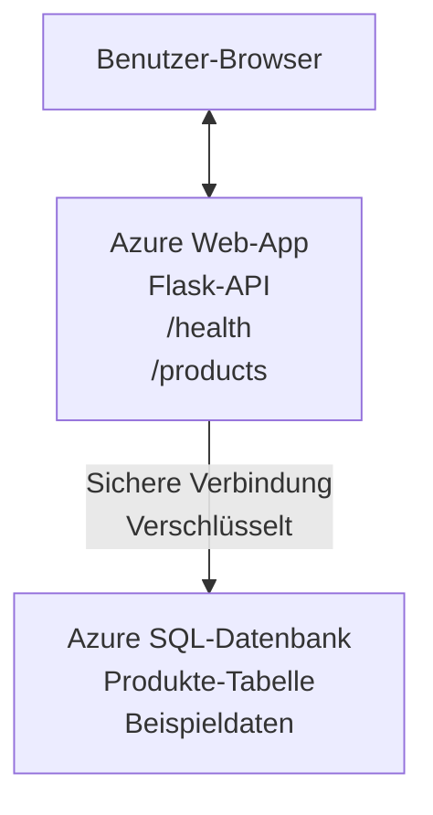

# Bereitstellen einer Microsoft SQL-Datenbank und Web-App mit AZD

⏱️ **Geschätzte Zeit**: 20-30 Minuten | 💰 **Geschätzte Kosten**: ~$15-25/month | ⭐ **Komplexität**: Mittel

Dieses **komplette, funktionierende Beispiel** zeigt, wie man die [Azure Developer CLI (azd)](https://learn.microsoft.com/azure/developer/azure-developer-cli/) verwendet, um eine Python-Flask-Webanwendung mit einer Microsoft SQL-Datenbank in Azure bereitzustellen. Sämtlicher Code ist enthalten und getestet — keine externen Abhängigkeiten erforderlich.

## Was Sie lernen werden

Indem Sie dieses Beispiel durcharbeiten, werden Sie:
- Eine mehrschichtige Anwendung (Web-App + Datenbank) mit Infrastructure-as-Code bereitstellen
- Sichere Datenbankverbindungen konfigurieren, ohne Geheimnisse hart zu codieren
- Die Anwendungsintegrität mit Application Insights überwachen
- Azure-Ressourcen effizient mit der AZD-CLI verwalten
- Azure-Best-Practices für Sicherheit, Kostenoptimierung und Observability befolgen

## Szenarioübersicht
- **Web App**: Python-Flask-REST-API mit Datenbankanbindung
- **Datenbank**: Azure SQL-Datenbank mit Beispieldaten
- **Infrastruktur**: Bereitgestellt mit Bicep (modular, wiederverwendbare Vorlagen)
- **Bereitstellung**: Voll automatisiert mit `azd`-Befehlen
- **Überwachung**: Application Insights für Logs und Telemetrie

## Voraussetzungen

### Erforderliche Tools

Bevor Sie beginnen, vergewissern Sie sich, dass Sie diese Tools installiert haben:

1. **[Azure CLI](https://learn.microsoft.com/cli/azure/install-azure-cli)** (Version 2.50.0 oder höher)
   ```sh
   az --version
   # Erwartete Ausgabe: azure-cli 2.50.0 oder höher
   ```

2. **[Azure Developer CLI (azd)](https://learn.microsoft.com/azure/developer/azure-developer-cli/install-azd)** (Version 1.0.0 oder höher)
   ```sh
   azd version
   # Erwartete Ausgabe: azd Version 1.0.0 oder höher
   ```

3. **[Python 3.8+](https://www.python.org/downloads/)** (für die lokale Entwicklung)
   ```sh
   python --version
   # Erwartete Ausgabe: Python 3.8 oder höher
   ```

4. **[Docker](https://www.docker.com/get-started)** (optional, für lokale containerisierte Entwicklung)
   ```sh
   docker --version
   # Erwartete Ausgabe: Docker-Version 20.10 oder höher
   ```

### Azure-Anforderungen

- Ein aktives **Azure-Abonnement** ([erstelle ein kostenloses Konto](https://azure.microsoft.com/free/))
- Berechtigungen zum Erstellen von Ressourcen in Ihrem Abonnement
- **Owner** oder **Contributor**-Rolle auf dem Abonnement oder der Ressourcengruppe

### Vorkenntnisse

Dies ist ein Beispiel auf **mittlerem Niveau**. Sie sollten vertraut sein mit:
- Grundlegende Befehlszeilenoperationen
- Grundlegende Cloud-Konzepte (Ressourcen, Ressourcengruppen)
- Grundlegendes Verständnis von Webanwendungen und Datenbanken

**Neu bei AZD?** Beginnen Sie zuerst mit dem [Erste Schritte](../../docs/chapter-01-foundation/azd-basics.md).

## Architektur

Dieses Beispiel stellt eine Zwei-Schichten-Architektur mit einer Webanwendung und einer SQL-Datenbank bereit:



**Ressourcenbereitstellung:**
- **Ressourcengruppe**: Container für alle Ressourcen
- **App Service Plan**: Linux-basierte Hosting-Umgebung (B1-Tarif für Kosteneffizienz)
- **Web App**: Python 3.11-Runtime mit Flask-Anwendung
- **SQL Server**: Verwalteter Datenbankserver mit mindestens TLS 1.2
- **SQL Database**: Basic-Tarif (2 GB, geeignet für Entwicklung/Tests)
- **Application Insights**: Überwachung und Protokollierung
- **Log Analytics Workspace**: Zentraler Speicher für Protokolle

**Analogie**: Stellen Sie sich das wie ein Restaurant (Web-App) mit einem Kühlraum (Datenbank) vor. Kunden bestellen vom Menü (API-Endpunkte), und die Küche (Flask-App) holt Zutaten (Daten) aus dem Kühlraum. Der Restaurantleiter (Application Insights) verfolgt alles, was passiert.

## Ordnerstruktur

Alle Dateien sind in diesem Beispiel enthalten — keine externen Abhängigkeiten erforderlich:

```
examples/database-app/
│
├── README.md                    # This file
├── azure.yaml                   # AZD configuration file
├── .env.sample                  # Sample environment variables
├── .gitignore                   # Git ignore patterns
│
├── infra/                       # Infrastructure as Code (Bicep)
│   ├── main.bicep              # Main orchestration template
│   ├── abbreviations.json      # Azure naming conventions
│   └── resources/              # Modular resource templates
│       ├── sql-server.bicep    # SQL Server configuration
│       ├── sql-database.bicep  # Database configuration
│       ├── app-service-plan.bicep  # Hosting plan
│       ├── app-insights.bicep  # Monitoring setup
│       └── web-app.bicep       # Web application
│
└── src/
    └── web/                    # Application source code
        ├── app.py              # Flask REST API
        ├── requirements.txt    # Python dependencies
        └── Dockerfile          # Container definition
```

**Was jede Datei macht:**
- **azure.yaml**: Teilt AZD mit, was und wo bereitgestellt werden soll
- **infra/main.bicep**: Orchestriert alle Azure-Ressourcen
- **infra/resources/*.bicep**: Einzelne Ressourcendefinitionen (modular zur Wiederverwendung)
- **src/web/app.py**: Flask-Anwendung mit Datenbanklogik
- **requirements.txt**: Python-Paketabhängigkeiten
- **Dockerfile**: Containerisierungsanweisungen für die Bereitstellung

## Schnellstart (Schritt für Schritt)

### Schritt 1: Klonen und Navigieren

```sh
git clone https://github.com/microsoft/AZD-for-beginners.git
cd AZD-for-beginners/examples/database-app
```

**✓ Erfolgskontrolle**: Überprüfen Sie, ob Sie `azure.yaml` und den Ordner `infra/` sehen:
```sh
ls
# Erwartet: README.md, azure.yaml, infra/, src/
```

### Schritt 2: Bei Azure authentifizieren

```sh
azd auth login
```

Dadurch wird Ihr Browser zur Azure-Authentifizierung geöffnet. Melden Sie sich mit Ihren Azure-Anmeldedaten an.

**✓ Erfolgskontrolle**: Sie sollten Folgendes sehen:
```
Logged in to Azure.
```

### Schritt 3: Die Umgebung initialisieren

```sh
azd init
```

**Was passiert**: AZD erstellt eine lokale Konfiguration für Ihre Bereitstellung.

**Eingabeaufforderungen, die Sie sehen werden**:
- **Environment name**: Geben Sie einen kurzen Namen ein (z. B. `dev`, `myapp`)
- **Azure subscription**: Wählen Sie Ihr Abonnement aus der Liste aus
- **Azure location**: Wählen Sie eine Region (z. B. `eastus`, `westeurope`)

**✓ Erfolgskontrolle**: Sie sollten Folgendes sehen:
```
SUCCESS: New project initialized!
```

### Schritt 4: Azure-Ressourcen bereitstellen

```sh
azd provision
```

**Was passiert**: AZD stellt die gesamte Infrastruktur bereit (dauert 5-8 Minuten):
1. Erstellt eine Ressourcengruppe
2. Erstellt SQL Server und Datenbank
3. Erstellt App Service Plan
4. Erstellt Web App
5. Erstellt Application Insights
6. Konfiguriert Netzwerk und Sicherheit

**Sie werden aufgefordert, folgende Angaben zu machen**:
- **SQL admin username**: Geben Sie einen Benutzernamen ein (z. B. `sqladmin`)
- **SQL admin password**: Geben Sie ein starkes Passwort ein (speichern Sie es!)

**✓ Erfolgskontrolle**: Sie sollten Folgendes sehen:
```
SUCCESS: Your application was provisioned in Azure in X minutes Y seconds.
You can view the resources created under the resource group rg-<env-name> in Azure Portal:
https://portal.azure.com/#@/resource/subscriptions/.../resourceGroups/rg-<env-name>
```

**⏱️ Zeit**: 5-8 Minuten

### Schritt 5: Die Anwendung bereitstellen

```sh
azd deploy
```

**Was passiert**: AZD erstellt und stellt Ihre Flask-Anwendung bereit:
1. Paketiert die Python-Anwendung
2. Baut das Docker-Image
3. Überträgt es in die Azure Web App
4. Initialisiert die Datenbank mit Beispieldaten
5. Startet die Anwendung

**✓ Erfolgskontrolle**: Sie sollten Folgendes sehen:
```
SUCCESS: Your application was deployed to Azure in X minutes Y seconds.
You can view the resources created under the resource group rg-<env-name> in Azure Portal:
https://portal.azure.com/#@/resource/subscriptions/.../resourceGroups/rg-<env-name>
```

**⏱️ Zeit**: 3-5 Minuten

### Schritt 6: Die Anwendung im Browser öffnen

```sh
azd browse
```

Dies öffnet Ihre bereitgestellte Web-App im Browser unter `https://app-<unique-id>.azurewebsites.net`

**✓ Erfolgskontrolle**: Sie sollten JSON-Ausgabe sehen:
```json
{
  "message": "Welcome to the Database App API",
  "endpoints": {
    "/": "This help message",
    "/health": "Health check endpoint",
    "/products": "List all products",
    "/products/<id>": "Get product by ID"
  }
}
```

### Schritt 7: Die API-Endpunkte testen

**Health Check** (Datenbankverbindung prüfen):
```sh
curl https://app-<your-id>.azurewebsites.net/health
```

**Erwartete Antwort**:
```json
{
  "status": "healthy",
  "database": "connected"
}
```

**Produkte auflisten** (Beispieldaten):
```sh
curl https://app-<your-id>.azurewebsites.net/products
```

**Erwartete Antwort**:
```json
[
  {
    "id": 1,
    "name": "Laptop",
    "description": "High-performance laptop",
    "price": 1299.99,
    "created_at": "2025-11-19T10:30:00"
  },
  ...
]
```

**Einzelnes Produkt abrufen**:
```sh
curl https://app-<your-id>.azurewebsites.net/products/1
```

**✓ Erfolgskontrolle**: Alle Endpunkte geben JSON-Daten ohne Fehler zurück.

---

**🎉 Herzlichen Glückwunsch!** Sie haben erfolgreich eine Webanwendung mit einer Datenbank mithilfe von AZD in Azure bereitgestellt.

## Detaillierte Konfiguration

### Umgebungsvariablen

Geheimnisse werden sicher über die Konfiguration des Azure App Service verwaltet — **niemals im Quellcode hartkodiert**.

**Automatisch von AZD konfiguriert**:
- `SQL_CONNECTION_STRING`: Datenbankverbindung mit verschlüsselten Zugangsdaten
- `APPLICATIONINSIGHTS_CONNECTION_STRING`: Endpunkt für Monitoring-Telemetrie
- `SCM_DO_BUILD_DURING_DEPLOYMENT`: Ermöglicht automatische Installation von Abhängigkeiten

**Wo Geheimnisse gespeichert werden**:
1. Während `azd provision` geben Sie SQL-Anmeldeinformationen über sichere Eingabeaufforderungen ein
2. AZD speichert diese in Ihrer lokalen `.azure/<env-name>/.env`-Datei (git-ignoriert)
3. AZD injiziert sie in die Konfiguration des Azure App Service (verschlüsselt im Ruhezustand)
4. Die Anwendung liest sie zur Laufzeit über `os.getenv()`

### Lokale Entwicklung

Für lokale Tests erstellen Sie eine `.env`-Datei aus der Vorlage:

```sh
cp .env.sample .env
# Bearbeite die .env-Datei mit deiner lokalen Datenbankverbindung
```

**Workflow für lokale Entwicklung**:
```sh
# Abhängigkeiten installieren
cd src/web
pip install -r requirements.txt

# Umgebungsvariablen setzen
export SQL_CONNECTION_STRING="your-local-connection-string"

# Anwendung ausführen
python app.py
```

**Lokal testen**:
```sh
curl http://localhost:8000/health
# Erwartet: {"status": "healthy", "database": "connected"}
```

### Infrastruktur als Code

Alle Azure-Ressourcen sind in **Bicep-Vorlagen** (`infra/`-Ordner) definiert:

- **Modulares Design**: Jeder Ressourcentyp hat eine eigene Datei zur Wiederverwendbarkeit
- **Parametrisiert**: Passen Sie SKUs, Regionen und Namenskonventionen an
- **Best Practices**: Folgt Azure-Namensstandards und Sicherheitsstandards
- **Versionskontrolle**: Infrastrukturänderungen werden in Git nachverfolgt

**Beispiel zur Anpassung**:
Um den Datenbanktarif zu ändern, bearbeiten Sie `infra/resources/sql-database.bicep`:
```bicep
sku: {
  name: 'Standard'  // Changed from 'Basic'
  tier: 'Standard'
  capacity: 10
}
```

## Sicherheits-Best Practices

Dieses Beispiel folgt den Azure-Sicherheits-Best Practices:

### 1. **No Secrets in Source Code**
- ✅ Anmeldeinformationen in der Konfiguration des Azure App Service gespeichert (verschlüsselt)
- ✅ `.env`-Dateien von Git über `.gitignore` ausgeschlossen
- ✅ Geheimnisse werden während der Bereitstellung über sichere Parameter übergeben

### 2. **Verschlüsselte Verbindungen**
- ✅ Mindestens TLS 1.2 für SQL Server
- ✅ Nur HTTPS für Web App erzwungen
- ✅ Datenbankverbindungen verwenden verschlüsselte Kanäle

### 3. **Netzwerksicherheit**
- ✅ SQL Server-Firewall so konfiguriert, dass nur Azure-Dienste zugelassen werden
- ✅ Öffentlicher Netzwerkzugriff eingeschränkt (kann weiter mit Private Endpoints gesperrt werden)
- ✅ FTPS für Web App deaktiviert

### 4. **Authentifizierung & Autorisierung**
- ⚠️ **Aktuell**: SQL-Authentifizierung (Benutzername/Passwort)
- ✅ **Empfehlung für Produktion**: Verwenden Sie Azure Managed Identity für passwortlose Authentifizierung

**Zum Upgrade auf Managed Identity** (für Produktion):
1. Aktivieren Sie Managed Identity für die Web App
2. Gewähren Sie der Identität SQL-Berechtigungen
3. Aktualisieren Sie die Verbindungszeichenfolge zur Nutzung der Managed Identity
4. Entfernen Sie passwortbasierte Authentifizierung

### 5. **Prüfung & Compliance**
- ✅ Application Insights protokolliert alle Anfragen und Fehler
- ✅ SQL-Datenbank-Auditing aktiviert (kann für Compliance konfiguriert werden)
- ✅ Alle Ressourcen für Governance getaggt

**Sicherheits-Checkliste vor dem Produktivbetrieb**:
- [ ] Azure Defender für SQL aktivieren
- [ ] Private Endpoints für SQL-Datenbank konfigurieren
- [ ] Web Application Firewall (WAF) aktivieren
- [ ] Azure Key Vault für Secret-Rotation implementieren
- [ ] Microsoft Entra ID-Authentifizierung konfigurieren
- [ ] Diagnostische Protokollierung für alle Ressourcen aktivieren

## Kostenoptimierung

**Geschätzte monatliche Kosten** (Stand November 2025):

| Ressource | SKU/Tarif | Geschätzte Kosten |
|----------|----------|----------------|
| App Service Plan | B1 (Basic) | ~$13/month |
| SQL Database | Basic (2GB) | ~$5/month |
| Application Insights | Pay-as-you-go | ~$2/month (geringer Traffic) |
| **Gesamt** | | **~$20/month** |

**💡 Spartipps**:

1. **Kostenlose Tarife zum Lernen verwenden**:
   - App Service: F1-Tarif (kostenlos, begrenzte Stunden)
   - SQL Database: Verwenden Sie Azure SQL Database serverless
   - Application Insights: 5 GB/Monat kostenlose Ingestion

2. **Ressourcen bei Nichtgebrauch stoppen**:
   ```sh
   # Web-App stoppen (für die Datenbank fallen weiterhin Kosten an)
   az webapp stop --name <app-name> --resource-group <rg-name>
   
   # Bei Bedarf neu starten
   az webapp start --name <app-name> --resource-group <rg-name>
   ```

3. **Alles nach dem Testen löschen**:
   ```sh
   azd down
   ```
   Dies entfernt ALLE Ressourcen und stoppt die Kosten.

4. **Entwicklung vs. Produktion SKUs**:
   - **Entwicklung**: Basic-Tarif (in diesem Beispiel verwendet)
   - **Produktion**: Standard/Premium-Tarif mit Redundanz

**Kostenüberwachung**:
- Sehen Sie Kosten in [Azure Cost Management](https://portal.azure.com/#view/Microsoft_Azure_CostManagement) an
- Richten Sie Kostenwarnungen ein, um Überraschungen zu vermeiden
- Taggen Sie alle Ressourcen mit `azd-env-name` zur Nachverfolgung

**Alternative im kostenlosen Tarif**:
Für Lernzwecke können Sie `infra/resources/app-service-plan.bicep` ändern:
```bicep
sku: {
  name: 'F1'  // Free tier
  tier: 'Free'
}
```
**Hinweis**: Der kostenlose Tarif hat Einschränkungen (60 Min./Tag CPU, kein Always-On).

## Überwachung & Beobachtbarkeit

### Integration von Application Insights

Dieses Beispiel enthält **Application Insights** für umfassendes Monitoring:

**Was überwacht wird**:
- ✅ HTTP-Anfragen (Latenz, Statuscodes, Endpunkte)
- ✅ Anwendungsfehler und Ausnahmen
- ✅ Benutzerdefinierte Logs aus der Flask-App
- ✅ Gesundheit der Datenbankverbindung
- ✅ Performance-Metriken (CPU, Arbeitsspeicher)

**Auf Application Insights zugreifen**:
1. Öffnen Sie das [Azure-Portal](https://portal.azure.com)
2. Navigieren Sie zu Ihrer Ressourcengruppe (`rg-<env-name>`)
3. Klicken Sie auf die Application Insights-Ressource (`appi-<unique-id>`)

**Nützliche Abfragen** (Application Insights → Logs):

**Alle Anfragen anzeigen**:
```kusto
requests
| where timestamp > ago(1h)
| order by timestamp desc
| project timestamp, name, url, resultCode, duration
```

**Fehler finden**:
```kusto
exceptions
| where timestamp > ago(24h)
| order by timestamp desc
| project timestamp, type, outerMessage, operation_Name
```

**Health-Endpunkt überprüfen**:
```kusto
requests
| where name contains "health"
| summarize count() by resultCode, bin(timestamp, 1h)
```

### SQL-Datenbank-Auditing

**SQL-Datenbank-Auditing ist aktiviert** , um zu verfolgen:
- Zugriffsmuster auf die Datenbank
- Fehlgeschlagene Anmeldeversuche
- Schemaänderungen
- Datenzugriffe (für Compliance)

**Audit-Logs aufrufen**:
1. Azure-Portal → SQL-Datenbank → Auditing
2. Anzeigen der Logs im Log Analytics Workspace

### Echtzeitüberwachung

**Live-Metriken anzeigen**:
1. Application Insights → Live Metrics
2. Sehen Sie Anfragen, Fehler und Performance in Echtzeit

**Warnungen einrichten**:
Erstellen Sie Warnungen für kritische Ereignisse:
- HTTP-500-Fehler > 5 in 5 Minuten
- Datenbankverbindungsfehler
- Hohe Antwortzeiten (> 2 Sekunden)

**Beispiel: Warnung erstellen**:
```sh
az monitor metrics alert create \
  --name "High-Response-Time" \
  --resource-group <rg-name> \
  --scopes <app-insights-resource-id> \
  --condition "avg requests/duration > 2000" \
  --description "Alert when response time exceeds 2 seconds"
```

## Fehlerbehebung
### Häufige Probleme und Lösungen

#### 1. `azd provision` schlägt fehl mit "Location not available"

**Symptom**:
```
Error: The subscription is not registered for the resource type 'components' in the location 'centralus'.
```

**Lösung**:
Wählen Sie eine andere Azure-Region oder registrieren Sie den Resource Provider:
```sh
az provider register --namespace Microsoft.Insights
```

#### 2. SQL-Verbindung schlägt während der Bereitstellung fehl

**Symptom**:
```
pyodbc.OperationalError: ('08001', '[08001] [Microsoft][ODBC Driver 18 for SQL Server]TCP Provider...')
```

**Lösung**:
- Stellen Sie sicher, dass die SQL Server-Firewall Azure-Dienste zulässt (wird automatisch konfiguriert)
- Prüfen Sie, ob das SQL-Administratorpasswort während `azd provision` korrekt eingegeben wurde
- Stellen Sie sicher, dass der SQL Server vollständig bereitgestellt ist (kann 2-3 Minuten dauern)

**Verbindung überprüfen**:
```sh
# Im Azure-Portal zu SQL-Datenbank → Abfrage-Editor gehen
# Versuchen Sie, sich mit Ihren Anmeldedaten zu verbinden
```

#### 3. Web-App zeigt "Application Error"

**Symptom**:
Der Browser zeigt eine allgemeine Fehlerseite.

**Lösung**:
Überprüfen Sie die Anwendungsprotokolle:
```sh
# Letzte Protokolle anzeigen
az webapp log tail --name <app-name> --resource-group <rg-name>
```

**Häufige Ursachen**:
- Fehlende Umgebungsvariablen (prüfen Sie App Service → Configuration)
- Installation von Python-Paketen fehlgeschlagen (prüfen Sie die Bereitstellungsprotokolle)
- Fehler bei der Datenbankinitialisierung (prüfen Sie die SQL-Konnektivität)

#### 4. `azd deploy` schlägt fehl mit "Build Error"

**Symptom**:
```
Error: Failed to build project
```

**Lösung**:
- Stellen Sie sicher, dass `requirements.txt` keine Syntaxfehler enthält
- Überprüfen Sie, dass Python 3.11 in `infra/resources/web-app.bicep` angegeben ist
- Stellen Sie sicher, dass das Dockerfile das richtige Basis-Image verwendet

**Lokal debuggen**:
```sh
cd src/web
docker build -t test-app .
docker run -p 8000:8000 test-app
```

#### 5. "Unauthorized" beim Ausführen von AZD-Befehlen

**Symptom**:
```
ERROR: (Unauthorized) The client '<id>' with object id '<id>' does not have authorization
```

**Lösung**:
Erneut bei Azure authentifizieren:
```sh
# Erforderlich für AZD-Workflows
azd auth login

# Optional, wenn Sie auch Azure-CLI-Befehle direkt verwenden
az login
```

Überprüfen Sie, ob Sie die richtigen Berechtigungen (Rolle: Contributor) für die Subscription haben.

#### 6. Hohe Datenbankkosten

**Symptom**:
Unerwartete Azure-Rechnung.

**Lösung**:
- Prüfen Sie, ob Sie vergessen haben, nach dem Testen `azd down` auszuführen
- Stellen Sie sicher, dass die SQL-Datenbank den Basic-Tarif verwendet (nicht Premium)
- Überprüfen Sie die Kosten in Azure Cost Management
- Richten Sie Kostenwarnungen ein

### Hilfe erhalten

**Alle AZD-Umgebungsvariablen anzeigen**:
```sh
azd env get-values
```

**Bereitstellungsstatus prüfen**:
```sh
az webapp show --name <app-name> --resource-group <rg-name> --query state
```

**Auf Anwendungsprotokolle zugreifen**:
```sh
az webapp log download --name <app-name> --resource-group <rg-name> --log-file app-logs.zip
```

**Benötigen Sie weitere Hilfe?**
- [AZD-Fehlersuche](../../docs/chapter-07-troubleshooting/common-issues.md)
- [Azure App Service – Fehlerbehebung](https://learn.microsoft.com/azure/app-service/troubleshoot-diagnostic-logs)
- [Azure SQL – Fehlerbehebung](https://learn.microsoft.com/azure/azure-sql/database/troubleshoot-common-errors-issues)

## Praktische Übungen

### Übung 1: Überprüfen Sie Ihre Bereitstellung (Anfänger)

**Ziel**: Bestätigen, dass alle Ressourcen bereitgestellt sind und die Anwendung funktioniert.

**Schritte**:
1. Alle Ressourcen in Ihrer Ressourcengruppe auflisten:
   ```sh
   az resource list --resource-group rg-<env-name> --output table
   ```
   **Erwartet**: 6-7 Ressourcen (Web App, SQL Server, SQL-Datenbank, App Service Plan, Application Insights, Log Analytics)

2. Testen Sie alle API-Endpunkte:
   ```sh
   curl https://app-<your-id>.azurewebsites.net/
   curl https://app-<your-id>.azurewebsites.net/health
   curl https://app-<your-id>.azurewebsites.net/products
   curl https://app-<your-id>.azurewebsites.net/products/1
   ```
   **Erwartet**: Alle geben gültiges JSON ohne Fehler zurück

3. Application Insights prüfen:
   - Navigieren Sie zu Application Insights im Azure-Portal
   - Gehen Sie zu "Live Metrics"
   - Aktualisieren Sie Ihren Browser auf der Web-App
   **Erwartet**: Anfragen erscheinen in Echtzeit

**Erfolgskriterien**: Alle 6-7 Ressourcen existieren, alle Endpunkte liefern Daten, Live Metrics zeigt Aktivität.

---

### Übung 2: Einen neuen API-Endpunkt hinzufügen (Mittelstufe)

**Ziel**: Die Flask-Anwendung um einen neuen Endpunkt erweitern.

**Starter-Code**: Aktuelle Endpunkte in `src/web/app.py`

**Schritte**:
1. Bearbeiten Sie `src/web/app.py` und fügen Sie nach der Funktion `get_product()` einen neuen Endpunkt hinzu:
   ```python
   @app.route('/products/search/<keyword>')
   def search_products(keyword):
       """Search products by name or description."""
       try:
           conn = get_db_connection()
           cursor = conn.cursor()
           cursor.execute(
               "SELECT id, name, description, price, created_at FROM products WHERE name LIKE ? OR description LIKE ?",
               (f'%{keyword}%', f'%{keyword}%')
           )
           
           products = []
           for row in cursor.fetchall():
               products.append({
                   'id': row[0],
                   'name': row[1],
                   'description': row[2],
                   'price': float(row[3]) if row[3] else None,
                   'created_at': row[4].isoformat() if row[4] else None
               })
           
           cursor.close()
           conn.close()
           
           logger.info(f"Search for '{keyword}' returned {len(products)} results")
           return jsonify(products), 200
           
       except Exception as e:
           logger.error(f"Error searching products: {str(e)}")
           return jsonify({'error': str(e)}), 500
   ```

2. Stellen Sie die aktualisierte Anwendung bereit:
   ```sh
   azd deploy
   ```

3. Testen Sie den neuen Endpunkt:
   ```sh
   curl https://app-<your-id>.azurewebsites.net/products/search/laptop
   ```
   **Erwartet**: Gibt Produkte zurück, die "laptop" entsprechen

**Erfolgskriterien**: Neuer Endpunkt funktioniert, gibt gefilterte Ergebnisse zurück, erscheint in den Application Insights-Protokollen.

---

### Übung 3: Überwachung und Warnungen hinzufügen (Fortgeschritten)

**Ziel**: Proaktive Überwachung mit Warnungen einrichten.

**Schritte**:
1. Erstellen Sie eine Warnung für HTTP-500-Fehler:
   ```sh
   # Application Insights-Ressourcen-ID abrufen
   AI_ID=$(az monitor app-insights component show \
     --app appi-<your-id> \
     --resource-group rg-<env-name> \
     --query id -o tsv)
   
   # Warnung erstellen
   az monitor metrics alert create \
     --name "High-Error-Rate" \
     --resource-group rg-<env-name> \
     --scopes $AI_ID \
     --condition "count requests/failed > 5" \
     --window-size 5m \
     --evaluation-frequency 1m \
     --description "Alert when >5 failed requests in 5 minutes"
   ```

2. Lösen Sie die Warnung durch Herbeiführen von Fehlern aus:
   ```sh
   # Anfrage für ein nicht vorhandenes Produkt
   for i in {1..10}; do curl https://app-<your-id>.azurewebsites.net/products/999; done
   ```

3. Prüfen Sie, ob die Warnung ausgelöst wurde:
   - Azure-Portal → Alerts → Alert Rules
   - Überprüfen Sie Ihre E-Mails (falls konfiguriert)

**Erfolgskriterien**: Warnregel ist erstellt, löst bei Fehlern aus, Benachrichtigungen werden empfangen.

---

### Übung 4: Änderungen am Datenbankschema (Fortgeschritten)

**Ziel**: Eine neue Tabelle hinzufügen und die Anwendung anpassen, damit sie diese verwendet.

**Schritte**:
1. Verbinden Sie sich mit der SQL-Datenbank über den Query Editor im Azure-Portal

2. Erstellen Sie eine neue `categories` Tabelle:
   ```sql
   CREATE TABLE categories (
       id INT PRIMARY KEY IDENTITY(1,1),
       name NVARCHAR(50) NOT NULL,
       description NVARCHAR(200)
   );
   
   INSERT INTO categories (name, description) VALUES
   ('Electronics', 'Electronic devices and accessories'),
   ('Office Supplies', 'Office equipment and supplies');
   
   -- Add category to products table
   ALTER TABLE products ADD category_id INT;
   UPDATE products SET category_id = 1; -- Set all to Electronics
   ```

3. Aktualisieren Sie `src/web/app.py`, um Kategorieninformationen in den Antworten einzubinden

4. Bereitstellen und testen

**Erfolgskriterien**: Die neue Tabelle existiert, Produkte zeigen Kategorieinformationen, die Anwendung funktioniert weiterhin.

---

### Übung 5: Caching implementieren (Experte)

**Ziel**: Azure Redis Cache hinzufügen, um die Leistung zu verbessern.

**Schritte**:
1. Fügen Sie Redis Cache zu `infra/main.bicep` hinzu
2. Aktualisieren Sie `src/web/app.py`, um Produktabfragen zwischenzuspeichern
3. Messen Sie die Leistungsverbesserung mit Application Insights
4. Vergleichen Sie Antwortzeiten vor/nach dem Caching

**Erfolgskriterien**: Redis ist bereitgestellt, Caching funktioniert, die Antwortzeiten verbessern sich um >50%.

**Tipp**: Beginnen Sie mit der [Dokumentation zu Azure Cache for Redis](https://learn.microsoft.com/azure/azure-cache-for-redis/).

---

## Aufräumen

Um fortlaufende Kosten zu vermeiden, löschen Sie alle Ressourcen, wenn Sie fertig sind:

```sh
azd down
```

**Bestätigungsaufforderung**:
```
? Total resources to delete: 7, are you sure you want to continue? (y/N)
```

Geben Sie `y` ein, um zu bestätigen.

**✓ Erfolgsprüfung**: 
- Alle Ressourcen wurden aus dem Azure-Portal gelöscht
- Keine fortlaufenden Kosten
- Lokaler Ordner `.azure/<env-name>` kann gelöscht werden

**Alternative** (Infrastruktur behalten, Daten löschen):
```sh
# Nur die Ressourcengruppe löschen (AZD-Konfiguration behalten)
az group delete --name rg-<env-name> --yes
```
## Mehr erfahren

### Verwandte Dokumentation
- [Azure Developer CLI Dokumentation](https://learn.microsoft.com/azure/developer/azure-developer-cli/)
- [Azure SQL Database Dokumentation](https://learn.microsoft.com/azure/azure-sql/database/)
- [Azure App Service Dokumentation](https://learn.microsoft.com/azure/app-service/)
- [Application Insights Dokumentation](https://learn.microsoft.com/azure/azure-monitor/app/app-insights-overview)
- [Bicep-Sprachreferenz](https://learn.microsoft.com/azure/azure-resource-manager/bicep/)

### Nächste Schritte in diesem Kurs
- **[Container Apps-Beispiel](../../../../examples/container-app)**: Microservices mit Azure Container Apps bereitstellen
- **[KI-Integrationsleitfaden](../../../../docs/ai-foundry)**: Fügen Sie Ihrer App KI-Funktionen hinzu
- **[Bereitstellungs-Best Practices](../../docs/chapter-04-infrastructure/deployment-guide.md)**: Muster für Produktionsbereitstellungen

### Erweiterte Themen
- **Managed Identity**: Kennwörter entfernen und Microsoft Entra ID-Authentifizierung verwenden
- **Private Endpoints**: Datenbankverbindungen innerhalb eines virtuellen Netzwerks sichern
- **CI/CD-Integration**: Automatisieren Sie Bereitstellungen mit GitHub Actions oder Azure DevOps
- **Mehrere Umgebungen**: Richten Sie Entwicklungs-, Staging- und Produktionsumgebungen ein
- **Datenbankmigrationen**: Verwenden Sie Alembic oder Entity Framework für Schema-Versionierung

### Vergleich mit anderen Ansätzen

**AZD vs. ARM-Vorlagen**:
- ✅ AZD: Höhere Abstraktionsebene, einfachere Befehle
- ⚠️ ARM: Ausführlicher, feinere Kontrolle

**AZD vs. Terraform**:
- ✅ AZD: Azure-nativ, integriert mit Azure-Diensten
- ⚠️ Terraform: Multi-Cloud-Unterstützung, größeres Ökosystem

**AZD vs. Azure-Portal**:
- ✅ AZD: Wiederholbar, versionskontrolliert, automatisierbar
- ⚠️ Portal: Manuelle Klicks, schwer reproduzierbar

**Betrachten Sie AZD als**: Docker Compose für Azure—vereinfachte Konfiguration für komplexe Bereitstellungen.

---

## Häufig gestellte Fragen

**Q: Kann ich eine andere Programmiersprache verwenden?**  
A: Ja! Ersetzen Sie `src/web/` durch Node.js, C#, Go oder eine beliebige andere Sprache. Aktualisieren Sie `azure.yaml` und Bicep entsprechend.

**Q: Wie füge ich weitere Datenbanken hinzu?**  
A: Fügen Sie ein weiteres SQL-Datenbank-Modul in `infra/main.bicep` hinzu oder verwenden Sie PostgreSQL/MySQL aus den Azure-Datenbankdiensten.

**Q: Kann ich dies für die Produktion verwenden?**  
A: Dies ist ein Ausgangspunkt. Für den Produktionseinsatz fügen Sie hinzu: Managed Identity, Private Endpoints, Redundanz, Backup-Strategie, WAF und erweiterte Überwachung.

**Q: Was ist, wenn ich Container statt Code-Bereitstellung verwenden möchte?**  
A: Sehen Sie sich das [Container Apps-Beispiel](../../../../examples/container-app) an, das durchgehend Docker-Container verwendet.

**Q: Wie verbinde ich mich von meinem lokalen Rechner mit der Datenbank?**  
A: Fügen Sie Ihre IP zur SQL Server-Firewall hinzu:
```sh
az sql server firewall-rule create \
  --resource-group rg-<env-name> \
  --server sql-<unique-id> \
  --name AllowMyIP \
  --start-ip-address <your-ip> \
  --end-ip-address <your-ip>
```

**Q: Kann ich eine vorhandene Datenbank anstelle einer neuen verwenden?**  
A: Ja, ändern Sie `infra/main.bicep`, um auf einen vorhandenen SQL Server zu verweisen, und aktualisieren Sie die Verbindungszeichenfolgenparameter.

---

> **Hinweis:** Dieses Beispiel zeigt Best Practices für die Bereitstellung einer Webanwendung mit einer Datenbank mithilfe von AZD. Es enthält funktionsfähigen Code, umfassende Dokumentation und praktische Übungen zur Vertiefung des Lernens. Für Produktionsbereitstellungen überprüfen Sie Sicherheits-, Skalierungs-, Compliance- und Kostenanforderungen, die für Ihre Organisation spezifisch sind.

**📚 Kursnavigation:**
- ← Vorherige: [Container Apps-Beispiel](../../../../examples/container-app)
- → Nächste: [KI-Integrationsleitfaden](../../../../docs/ai-foundry)
- 🏠 [Kursstartseite](../../README.md)

---

<!-- CO-OP TRANSLATOR DISCLAIMER START -->
**Haftungsausschluss**:
Dieses Dokument wurde mit dem KI-Übersetzungsdienst [Co-op Translator](https://github.com/Azure/co-op-translator) übersetzt. Obwohl wir uns um Genauigkeit bemühen, beachten Sie bitte, dass automatisierte Übersetzungen Fehler oder Ungenauigkeiten enthalten können. Das Originaldokument in seiner Ursprungssprache gilt als maßgebliche Quelle. Bei kritischen Informationen wird eine professionelle menschliche Übersetzung empfohlen. Wir übernehmen keine Haftung für Missverständnisse oder Fehlinterpretationen, die aus der Verwendung dieser Übersetzung entstehen.
<!-- CO-OP TRANSLATOR DISCLAIMER END -->