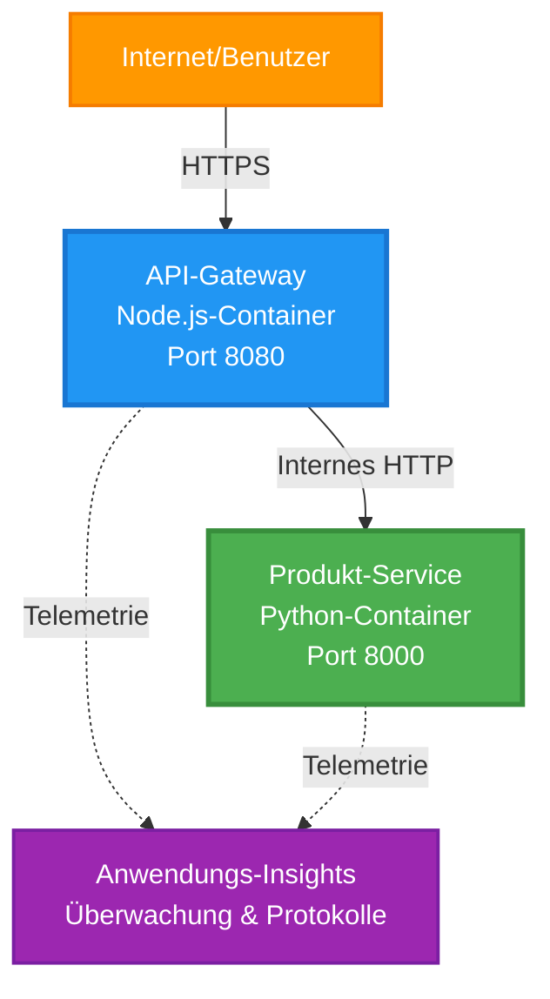
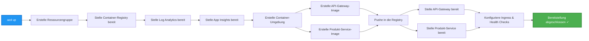
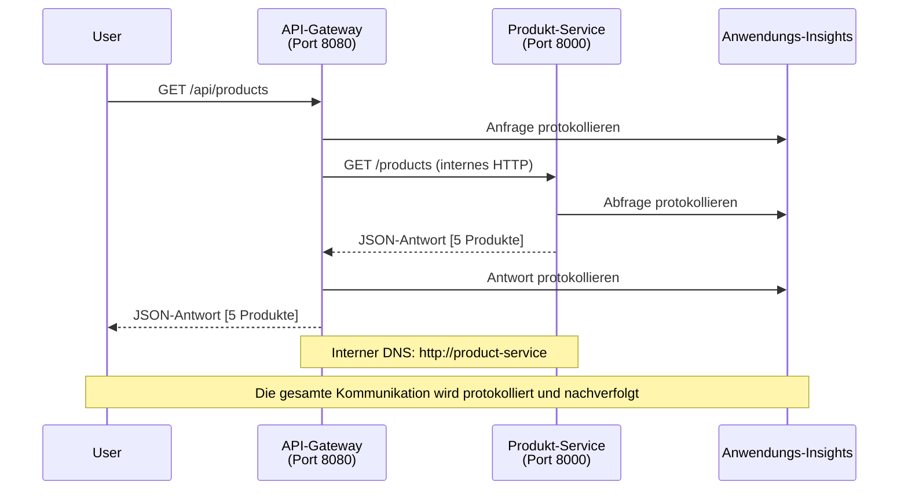

# Microservices Architecture - Container App Example

⏱️ **Geschätzte Zeit**: 25-35 Minuten | 💰 **Geschätzte Kosten**: ~$50-100/Monat | ⭐ **Komplexität**: Erweitert

**📚 Lernpfad:**
- ← Vorheriges: [Einfaches Flask-API](../../../../examples/container-app/simple-flask-api) - Grundlagen zu einzelnen Containern
- 🎯 **Sie sind hier**: Microservices-Architektur (2-Service-Grundlage)
- → Nächstes: [KI-Integration](../../../../docs/ai-foundry) - Fügen Sie Ihren Diensten Intelligenz hinzu
- 🏠 [Kurs-Startseite](../../README.md)

---

Eine **vereinfachte, aber funktionale** Microservices-Architektur, bereitgestellt in Azure Container Apps mithilfe der AZD CLI. Dieses Beispiel demonstriert Service-zu-Service-Kommunikation, Container-Orchestrierung und Monitoring mit einem praktischen 2-Service-Setup.

> **📚 Lernansatz**: Dieses Beispiel beginnt mit einer minimalen 2-Service-Architektur (API Gateway + Backend-Service), die Sie tatsächlich bereitstellen und von der Sie lernen können. Nachdem Sie diese Grundlage beherrschen, geben wir Hinweise zur Erweiterung zu einem vollständigen Microservices-Ökosystem.

## Was Sie lernen werden

Durch das Abschließen dieses Beispiels werden Sie:
- Mehrere Container in Azure Container Apps bereitstellen
- Service-zu-Service-Kommunikation mit internem Netzwerk implementieren
- Skalierung und Health Checks anhand der Umgebung konfigurieren
- Verteilte Anwendungen mit Application Insights überwachen
- Deployment-Patterns und Best Practices für Microservices verstehen
- Lernen, wie man schrittweise von einfachen zu komplexen Architekturen erweitert

## Architektur

### Phase 1: Was wir bauen (in diesem Beispiel enthalten)


**Komponentendetails:**

| Komponente | Zweck | Zugriff | Ressourcen |
|-----------|---------|--------|-----------|
| **API Gateway** | Leitet externe Anfragen an Backend-Dienste weiter | Öffentlich (HTTPS) | 1 vCPU, 2GB RAM, 2-20 Replikate |
| **Product Service** | Verwaltet Produktkatalog mit In-Memory-Daten | Nur intern | 0.5 vCPU, 1GB RAM, 1-10 Replikate |
| **Application Insights** | Zentralisiertes Logging und verteiltes Tracing | Azure Portal | 1-2 GB/Monat Datenerfassung |

**Warum einfach anfangen?**
- ✅ Schnell bereitstellen und verstehen (25-35 Minuten)
- ✅ Kernmuster von Microservices ohne Komplexität lernen
- ✅ Funktionierender Code, den Sie ändern und ausprobieren können
- ✅ Niedrigere Kosten zum Lernen (~$50-100/Monat vs $300-1400/Monat)
- ✅ Vertrauen aufbauen, bevor Datenbanken und Message Queues hinzugefügt werden

**Analogie**: Stellen Sie sich vor, Sie lernen Autofahren. Sie beginnen mit einem leeren Parkplatz (2 Services), meistern die Grundlagen und arbeiten sich dann in den Stadtverkehr vor (5+ Services mit Datenbanken).

### Phase 2: Zukünftige Erweiterung (Referenzarchitektur)

Sobald Sie die 2-Service-Architektur beherrschen, können Sie erweitern zu:


Siehe Abschnitt "Expansion Guide" am Ende für Schritt-für-Schritt-Anleitungen.

## Enthaltene Features

✅ **Service Discovery**: Automatische DNS-basierte Erkennung zwischen Containern  
✅ **Lastverteilung**: Eingebaute Lastverteilung über Replikate  
✅ **Auto-Skalierung**: Unabhängige Skalierung pro Service basierend auf HTTP-Anfragen  
✅ **Health Monitoring**: Liveness- und Readiness-Probes für beide Services  
✅ **Verteiltes Logging**: Zentralisiertes Logging mit Application Insights  
✅ **Internes Networking**: Sichere Service-zu-Service-Kommunikation  
✅ **Container-Orchestrierung**: Automatische Bereitstellung und Skalierung  
✅ **Zero-Downtime-Updates**: Rolling Updates mit Revision-Management  

## Voraussetzungen

### Erforderliche Tools

Bevor Sie beginnen, vergewissern Sie sich, dass Sie diese Tools installiert haben:

1. **[Azure Developer CLI (azd)](https://learn.microsoft.com/azure/developer/azure-developer-cli/install-azd)** (Version 1.0.0 oder höher)
   ```bash
   azd version
   # Erwartete Ausgabe: azd Version 1.0.0 oder höher
   ```

2. **[Azure CLI](https://learn.microsoft.com/cli/azure/install-azure-cli)** (Version 2.50.0 oder höher)
   ```bash
   az --version
   # Erwartete Ausgabe: azure-cli 2.50.0 oder höher
   ```

3. **[Docker](https://www.docker.com/get-started)** (für lokale Entwicklung/Tests - optional)
   ```bash
   docker --version
   # Erwartete Ausgabe: Docker-Version 20.10 oder höher
   ```

### Überprüfen Sie Ihre Einrichtung

Führen Sie diese Befehle aus, um zu bestätigen, dass Sie bereit sind:

```bash
# Überprüfen Sie die Azure Developer CLI
azd version
# ✅ Erwartet: azd-Version 1.0.0 oder höher

# Überprüfen Sie die Azure CLI
az --version
# ✅ Erwartet: azure-cli 2.50.0 oder höher

# Überprüfen Sie Docker (optional)
docker --version
# ✅ Erwartet: Docker-Version 20.10 oder höher
```

**Erfolgskriterien**: Alle Befehle geben Versionsnummern zurück, die den Mindestanforderungen entsprechen oder diese übertreffen.

### Azure-Anforderungen

- Ein aktives **Azure-Abonnement** ([erstelle ein kostenloses Konto](https://azure.microsoft.com/free/))
- Berechtigungen zum Erstellen von Ressourcen in Ihrem Abonnement
- **Rolle 'Contributor'** auf dem Abonnement oder der Ressourcengruppe

### Kenntnisse

Dies ist ein **Beispiel auf fortgeschrittenem Level**. Sie sollten:
- Das [Simple Flask API example](../../../../examples/container-app/simple-flask-api) abgeschlossen haben
- Grundlegendes Verständnis von Microservices-Architektur besitzen
- Vertrautheit mit REST-APIs und HTTP haben
- Verständnis von Container-Konzepten

**Neu bei Container Apps?** Beginnen Sie zuerst mit dem [Simple Flask API example](../../../../examples/container-app/simple-flask-api), um die Grundlagen zu lernen.

## Schnellstart (Schritt für Schritt)

### Schritt 1: Klonen und navigieren

```bash
git clone https://github.com/microsoft/AZD-for-beginners.git
cd AZD-for-beginners/examples/microservices
```

**✓ Erfolgsprüfung**: Überprüfen Sie, ob Sie `azure.yaml` sehen:
```bash
ls
# Erwartet: README.md, azure.yaml, infra/, src/
```

### Schritt 2: Bei Azure authentifizieren

```bash
azd auth login
```

Dies öffnet Ihren Browser zur Azure-Authentifizierung. Melden Sie sich mit Ihren Azure-Anmeldedaten an.

**✓ Erfolgsprüfung**: Sie sollten sehen:
```
Logged in to Azure.
```

### Schritt 3: Umgebung initialisieren

```bash
azd init
```

**Eingabeaufforderungen, die Sie sehen werden**:
- **Umgebungsname**: Geben Sie einen kurzen Namen ein (z. B. `microservices-dev`)
- **Azure subscription**: Wählen Sie Ihr Abonnement
- **Azure location**: Wählen Sie eine Region (z. B. `eastus`, `westeurope`)

**✓ Erfolgsprüfung**: Sie sollten sehen:
```
SUCCESS: New project initialized!
```

### Schritt 4: Infrastruktur und Dienste bereitstellen

```bash
azd up
```

**Was passiert** (dauert 8-12 Minuten):


**✓ Erfolgsprüfung**: Sie sollten sehen:
```
SUCCESS: Your application was deployed to Azure in X minutes Y seconds.
Endpoint: https://api-gateway-<unique-id>.azurecontainerapps.io
```

**⏱️ Zeit**: 8-12 Minuten

### Schritt 5: Bereitstellung testen

```bash
# Hole den Gateway-Endpunkt
GATEWAY_URL=$(azd env get-values | grep API_GATEWAY_URL | cut -d '=' -f2 | tr -d '"')

# API-Gateway-Gesundheit testen
curl $GATEWAY_URL/health
```

**✅ Erwartete Ausgabe:**
```json
{
  "status": "healthy",
  "service": "api-gateway",
  "timestamp": "2025-11-19T10:30:00Z"
}
```

**Produktservice über Gateway testen**:
```bash
# Produkte auflisten
curl $GATEWAY_URL/api/products
```

**✅ Erwartete Ausgabe:**
```json
[
  {"id":1,"name":"Laptop","price":999.99,"stock":50},
  {"id":2,"name":"Mouse","price":29.99,"stock":200},
  {"id":3,"name":"Keyboard","price":79.99,"stock":150}
]
```

**✓ Erfolgsprüfung**: Beide Endpunkte geben JSON-Daten ohne Fehler zurück.

---

**🎉 Herzlichen Glückwunsch!** Sie haben eine Microservices-Architektur in Azure bereitgestellt!

## Projektstruktur

Alle Implementierungsdateien sind enthalten—dies ist ein vollständiges, funktionierendes Beispiel:

```
microservices/
│
├── README.md                         # This file
├── azure.yaml                        # AZD configuration
├── .gitignore                        # Git ignore patterns
│
├── infra/                           # Infrastructure as Code (Bicep)
│   ├── main.bicep                   # Main orchestration
│   ├── abbreviations.json           # Naming conventions
│   ├── core/                        # Shared infrastructure
│   │   ├── container-apps-environment.bicep  # Container environment + registry
│   │   └── monitor.bicep            # Application Insights + Log Analytics
│   └── app/                         # Service definitions
│       ├── api-gateway.bicep        # API Gateway container app
│       └── product-service.bicep    # Product Service container app
│
└── src/                             # Application source code
    ├── api-gateway/                 # Node.js API Gateway
    │   ├── app.js                   # Express server with routing
    │   ├── package.json             # Node dependencies
    │   └── Dockerfile               # Container definition
    └── product-service/             # Python Product Service
        ├── main.py                  # Flask API with product data
        ├── requirements.txt         # Python dependencies
        └── Dockerfile               # Container definition
```

**Was jede Komponente macht:**

**Infrastructure (infra/)**:
- `main.bicep`: Orchestriert alle Azure-Ressourcen und deren Abhängigkeiten
- `core/container-apps-environment.bicep`: Erstellt die Container Apps-Umgebung und Azure Container Registry
- `core/monitor.bicep`: Richtet Application Insights für verteiltes Logging ein
- `app/*.bicep`: Einzelne Container-App-Definitionen mit Skalierung und Gesundheitsprüfungen

**API Gateway (src/api-gateway/)**:
- Öffentlich zugänglicher Service, der Anfragen an Backend-Dienste weiterleitet
- Implementiert Logging, Fehlerbehandlung und Request-Forwarding
- Demonstriert Service-zu-Service HTTP-Kommunikation

**Product Service (src/product-service/)**:
- Interner Service mit Produktkatalog (In-Memory der Einfachheit halber)
- REST-API mit Health Checks
- Beispiel für ein Backend-Microservice-Pattern

## Diensteübersicht

### API Gateway (Node.js/Express)

**Port**: 8080  
**Zugriff**: Öffentlich (externes Ingress)  
**Zweck**: Leitet eingehende Anfragen an die passenden Backend-Dienste weiter  

**Endpunkte**:
- `GET /` - Service-Informationen
- `GET /health` - Health-Check-Endpunkt
- `GET /api/products` - Weiterleitung an Product Service (alle auflisten)
- `GET /api/products/:id` - Weiterleitung an Product Service (nach ID abrufen)

**Wesentliche Funktionen**:
- Request-Routing mit axios
- Zentralisiertes Logging
- Fehlerbehandlung und Timeout-Management
- Service Discovery über Umgebungsvariablen
- Integration mit Application Insights

**Code-Highlight** (`src/api-gateway/app.js`):
```javascript
// Interne Service-Kommunikation
app.get('/api/products', async (req, res) => {
  const response = await axios.get(`${PRODUCT_SERVICE_URL}/products`, {
    timeout: 5000
  });
  res.json(response.data);
});
```

### Product Service (Python/Flask)

**Port**: 8000  
**Zugriff**: Nur intern (kein externes Ingress)  
**Zweck**: Verwaltet den Produktkatalog mit In-Memory-Daten  

**Endpunkte**:
- `GET /` - Service-Informationen
- `GET /health` - Health-Check-Endpunkt
- `GET /products` - Alle Produkte auflisten
- `GET /products/<id>` - Produkt nach ID abrufen

**Wesentliche Funktionen**:
- RESTful API mit Flask
- In-Memory-Produktstore (einfach, keine Datenbank erforderlich)
- Health-Monitoring mit Probes
- Strukturiertes Logging
- Integration mit Application Insights

**Datenmodell**:
```python
{
  "id": 1,
  "name": "Laptop",
  "description": "High-performance laptop",
  "price": 999.99,
  "stock": 50
}
```

**Warum nur intern?**
Der Product Service ist nicht öffentlich zugänglich. Alle Anfragen müssen über das API Gateway laufen, das bietet:
- Sicherheit: Kontrollierter Zugangspunkt
- Flexibilität: Backend kann geändert werden, ohne Clients zu beeinträchtigen
- Monitoring: Zentralisiertes Request-Logging

## Verständnis der Service-Kommunikation

### Wie Dienste miteinander kommunizieren


In diesem Beispiel kommuniziert das API Gateway mit dem Product Service über **interne HTTP-Aufrufe**:

```javascript
// API-Gateway (src/api-gateway/app.js)
const PRODUCT_SERVICE_URL = process.env.PRODUCT_SERVICE_URL;

// Interne HTTP-Anfrage durchführen
const response = await axios.get(`${PRODUCT_SERVICE_URL}/products`);
```

**Wesentliche Punkte**:

1. **DNS-basierte Erkennung**: Container Apps stellt automatisch DNS für interne Dienste bereit
   - Product Service FQDN: `product-service.internal.<environment>.azurecontainerapps.io`
   - Vereinfacht als: `http://product-service` (Container Apps löst dies auf)

2. **Keine öffentliche Exposition**: Product Service hat `external: false` in Bicep
   - Nur innerhalb der Container Apps-Umgebung erreichbar
   - Nicht vom Internet zugänglich

3. **Umgebungsvariablen**: Service-URLs werden zur Bereitstellungszeit injiziert
   - Bicep übergibt das interne FQDN an das Gateway
   - Keine hartcodierten URLs im Anwendungscode

**Analogie**: Stellen Sie sich das wie Büroräume vor. Das API Gateway ist die Rezeption (öffentlich), und der Product Service ist ein Büroraum (nur intern). Besucher müssen über die Rezeption gehen, um ein Büro zu erreichen.

## Bereitstellungsoptionen

### Vollständige Bereitstellung (empfohlen)

```bash
# Infrastruktur und beide Dienste bereitstellen
azd up
```

Dies stellt bereit:
1. Container Apps-Umgebung
2. Application Insights
3. Container Registry
4. API Gateway-Container
5. Product Service-Container

**Zeit**: 8-12 Minuten

### Einzelnen Dienst bereitstellen

```bash
# Nur einen Dienst bereitstellen (nach dem initialen azd up)
azd deploy api-gateway

# Oder den Produktdienst bereitstellen
azd deploy product-service
```

**Anwendungsfall**: Wenn Sie Code in einem Dienst aktualisiert haben und nur diesen Dienst neu bereitstellen möchten.

### Konfiguration aktualisieren

```bash
# Skalierungsparameter ändern
azd env set GATEWAY_MAX_REPLICAS 30

# Mit neuer Konfiguration neu bereitstellen
azd up
```

## Konfiguration

### Skalierungskonfiguration

Beide Dienste sind in ihren Bicep-Dateien mit HTTP-basierter Auto-Skalierung konfiguriert:

**API Gateway**:
- Minimale Replikate: 2 (immer mindestens 2 zur Gewährleistung der Verfügbarkeit)
- Maximale Replikate: 20
- Skalierungs-Trigger: 50 gleichzeitige Anfragen pro Replikat

**Product Service**:
- Minimale Replikate: 1 (kann bei Bedarf auf null skalieren)
- Maximale Replikate: 10
- Skalierungs-Trigger: 100 gleichzeitige Anfragen pro Replikat

**Skalierung anpassen** (in `infra/app/*.bicep`):
```bicep
scale: {
  minReplicas: 1
  maxReplicas: 10
  rules: [
    {
      name: 'http-scale-rule'
      http: {
        metadata: {
          concurrentRequests: '100'  // Adjust this
        }
      }
    }
  ]
}
```

### Ressourcenzuweisung

**API Gateway**:
- CPU: 1.0 vCPU
- Arbeitsspeicher: 2 GiB
- Grund: Verarbeitet gesamten externen Traffic

**Product Service**:
- CPU: 0.5 vCPU
- Arbeitsspeicher: 1 GiB
- Grund: Leichte In-Memory-Operationen

### Gesundheitsprüfungen

Beide Dienste enthalten Liveness- und Readiness-Probes:

```bicep
probes: [
  {
    type: 'Liveness'
    httpGet: {
      path: '/health'
      port: 8080
    }
    initialDelaySeconds: 10
    periodSeconds: 30
  }
  {
    type: 'Readiness'
    httpGet: {
      path: '/health'
      port: 8080
    }
    initialDelaySeconds: 5
    periodSeconds: 10
  }
]
```

**Was das bedeutet**:
- **Liveness**: Wenn der Health-Check fehlschlägt, startet Container Apps den Container neu
- **Readiness**: Wenn nicht bereit, leitet Container Apps keinen Verkehr an dieses Replikat weiter

## Monitoring & Observability

### Dienstprotokolle anzeigen

```bash
# Protokolle mit azd monitor anzeigen
azd monitor --logs

# Oder verwenden Sie die Azure CLI für bestimmte Container-Apps:
# Protokolle vom API-Gateway streamen
az containerapp logs show --name api-gateway --resource-group $RG_NAME --follow

# Neueste Protokolle des Produktdienstes anzeigen
az containerapp logs show --name product-service --resource-group $RG_NAME --tail 100
```

**Erwartete Ausgabe**:
```
[api-gateway] API Gateway listening on port 8080
[api-gateway] Product Service URL: http://product-service
[api-gateway] GET /api/products 200 - 45ms
[product-service] Retrieved 5 products
```

### Application Insights-Abfragen

Greifen Sie auf Application Insights im Azure-Portal zu und führen Sie dann diese Abfragen aus:

**Langsame Anfragen finden**:
```kusto
requests
| where timestamp > ago(1h)
| where duration > 1000  // Requests taking >1 second
| summarize count() by name, cloud_RoleName
| order by count_ desc
```

**Service-zu-Service-Aufrufe verfolgen**:
```kusto
dependencies
| where timestamp > ago(1h)
| where type == "Http"
| project timestamp, name, target, duration, success
| order by timestamp desc
```

**Fehlerrate nach Dienst**:
```kusto
exceptions
| where timestamp > ago(24h)
| summarize errorCount = count() by cloud_RoleName, type
| order by errorCount desc
```

**Anfrageaufkommen über die Zeit**:
```kusto
requests
| where timestamp > ago(1h)
| summarize requestCount = count() by bin(timestamp, 5m), cloud_RoleName
| render timechart
```

### Zugriff auf Überwachungs-Dashboard

```bash
# Details von Application Insights abrufen
azd env get-values | grep APPLICATIONINSIGHTS

# Überwachung im Azure-Portal öffnen
az monitor app-insights component show \
  --app $(azd env get-values | grep APPLICATIONINSIGHTS_CONNECTION_STRING | cut -d '=' -f2) \
  --resource-group $(azd env get-values | grep AZURE_RESOURCE_GROUP | cut -d '=' -f2) \
  --query "appId" -o tsv
```

### Live-Metriken

1. Navigieren Sie zu Application Insights im Azure-Portal
2. Klicken Sie auf "Live Metrics"
3. Sehen Sie Echtzeit-Anfragen, Fehler und Performance
4. Testen Sie, indem Sie ausführen: `curl $(azd env get-values | grep API_GATEWAY_URL | cut -d '=' -f2 | tr -d '"')/api/products`

## Praktische Übungen

### Übung 1: Neuen Produkt-Endpunkt hinzufügen ⭐ (Einfach)

**Ziel**: Einen POST-Endpunkt hinzufügen, um neue Produkte zu erstellen

**Ausgangspunkt**: `src/product-service/main.py`

**Schritte**:

1. Fügen Sie diesen Endpunkt nach der Funktion `get_product` in `main.py` hinzu:

```python
@app.route('/products', methods=['POST'])
def create_product():
    """Create a new product"""
    data = request.get_json()
    
    # Erforderliche Felder validieren
    if not data or 'name' not in data or 'price' not in data:
        return jsonify({'error': 'Missing required fields: name, price'}), 400
    
    new_id = max(p['id'] for p in products) + 1
    new_product = {
        'id': new_id,
        'name': data['name'],
        'description': data.get('description', ''),
        'price': float(data['price']),
        'stock': int(data.get('stock', 0))
    }
    products.append(new_product)
    logger.info(f"Created product {new_id}")
    return jsonify(new_product), 201
```

2. Fügen Sie eine POST-Route zum API Gateway (`src/api-gateway/app.js`) hinzu:

```javascript
// Füge dies nach der GET /api/products-Route hinzu
app.post('/api/products', async (req, res) => {
  try {
    console.log(`Forwarding POST request to ${PRODUCT_SERVICE_URL}/products`);
    const response = await axios.post(`${PRODUCT_SERVICE_URL}/products`, req.body, {
      timeout: 5000
    });
    res.status(201).json(response.data);
  } catch (error) {
    console.error('Error calling product service:', error.message);
    res.status(503).json({
      error: 'Product service unavailable',
      message: error.message
    });
  }
});
```

3. Beide Services neu bereitstellen:

```bash
azd deploy product-service
azd deploy api-gateway
```

4. Teste den neuen Endpunkt:

```bash
GATEWAY_URL=$(azd env get-values | grep API_GATEWAY_URL | cut -d '=' -f2 | tr -d '"')

# Ein neues Produkt erstellen
curl -X POST $GATEWAY_URL/api/products \
  -H "Content-Type: application/json" \
  -d '{"name":"USB Cable","price":9.99,"stock":500}'
```

**✅ Erwartete Ausgabe:**
```json
{"id":6,"name":"USB Cable","description":"","price":9.99,"stock":500}
```

5. Überprüfe, dass er in der Liste erscheint:

```bash
curl $GATEWAY_URL/api/products
# Sollte jetzt 6 Produkte anzeigen, einschließlich des neuen USB-Kabels
```

**Erfolgskriterien**:
- ✅ POST-Anfrage gibt HTTP 201 zurück
- ✅ Neues Produkt erscheint in der GET /api/products-Liste
- ✅ Produkt hat eine automatisch inkrementierte ID

**Zeit**: 10-15 Minuten

---

### Übung 2: Autoscaling-Regeln anpassen ⭐⭐ (Mittel)

**Ziel**: Product Service so ändern, dass es aggressiver skaliert

**Starting Point**: `infra/app/product-service.bicep`

**Schritte**:

1. Öffne `infra/app/product-service.bicep` und finde den `scale`-Block (etwa Zeile 95)

2. Ändere von:
```bicep
scale: {
  minReplicas: 1
  maxReplicas: 10
  rules: [
    {
      name: 'http-scale-rule'
      http: {
        metadata: {
          concurrentRequests: '100'  // OLD
        }
      }
    }
  ]
}
```

Zu:
```bicep
scale: {
  minReplicas: 2  // Always have 2 running
  maxReplicas: 20  // Allow more scaling
  rules: [
    {
      name: 'http-scale-rule'
      http: {
        metadata: {
          concurrentRequests: '20'  // Scale at lower threshold
        }
      }
    }
  ]
}
```

3. Infrastruktur neu bereitstellen:

```bash
azd up
```

4. Neue Skalierungskonfiguration überprüfen:

```bash
az containerapp show \
  --name $(azd env get-values | grep PRODUCT_SERVICE | head -1 | cut -d '/' -f5) \
  --resource-group $(azd env get-values | grep AZURE_RESOURCE_GROUP | cut -d '=' -f2 | tr -d '"') \
  --query "properties.template.scale" -o json
```

**✅ Erwartete Ausgabe:**
```json
{
  "minReplicas": 2,
  "maxReplicas": 20,
  "rules": [...]
}
```

5. Autoscaling unter Last testen:

```bash
# Erzeuge gleichzeitige Anfragen
for i in {1..500}; do curl $GATEWAY_URL/api/products & done

# Beobachte die Skalierung mit der Azure CLI
az containerapp logs show --name product-service --resource-group $RG_NAME --follow
# Achte auf: Skalierungsereignisse von Container Apps
```

**Erfolgskriterien**:
- ✅ Product Service läuft immer mit mindestens 2 Replikaten
- ✅ Unter Last skaliert es auf mehr als 2 Replikate
- ✅ Azure-Portal zeigt die neuen Skalierungsregeln

**Zeit**: 15-20 Minuten

---

### Übung 3: Benutzerdefinierte Monitoring-Abfrage hinzufügen ⭐⭐ (Mittel)

**Ziel**: Eine benutzerdefinierte Application Insights-Abfrage erstellen, um die Leistung der Product-API zu verfolgen

**Schritte**:

1. Navigiere zu Application Insights im Azure-Portal:
   - Gehe zum Azure-Portal
   - Finde deine Ressourcengruppe (rg-microservices-*)
   - Klicke auf die Application Insights-Ressource

2. Klicke im linken Menü auf "Logs"

3. Erstelle diese Abfrage:

```kusto
requests
| where timestamp > ago(1h)
| where name contains "products"
| summarize 
    RequestCount = count(),
    AvgDuration = avg(duration),
    P95Duration = percentile(duration, 95),
    SuccessRate = 100.0 * countif(success == true) / count()
  by bin(timestamp, 5m)
| render timechart
```

4. Klicke auf "Run", um die Abfrage auszuführen

5. Speichere die Abfrage:
   - Klicke auf "Save"
   - Name: "Product API Performance"
   - Kategorie: "Performance"

6. Erzeuge Testtraffic:

```bash
for i in {1..100}; do curl $GATEWAY_URL/api/products; sleep 1; done
```

7. Aktualisiere die Abfrage, um Daten zu sehen

**✅ Erwartete Ausgabe:**
- Diagramm, das die Anzahl der Anfragen über die Zeit zeigt
- Durchschnittliche Dauer < 500 ms
- Erfolgsrate = 100%
- Zeitspannen von 5 Minuten

**Erfolgskriterien**:
- ✅ Abfrage zeigt 100+ Anfragen
- ✅ Erfolgsrate ist 100%
- ✅ Durchschnittliche Dauer < 500 ms
- ✅ Diagramm zeigt 5-Minuten-Zeitspannen

**Lernergebnis**: Verstehen, wie man die Service-Leistung mit benutzerdefinierten Abfragen überwacht

**Zeit**: 10-15 Minuten

---

### Übung 4: Retry-Logik implementieren ⭐⭐⭐ (Fortgeschritten)

**Ziel**: Retry-Logik zum API Gateway hinzufügen, wenn der Product Service vorübergehend nicht verfügbar ist

**Starting Point**: `src/api-gateway/app.js`

**Schritte**:

1. Installiere die Retry-Bibliothek:

```bash
cd src/api-gateway
npm install axios-retry --save
cd ../..
```

2. Aktualisiere `src/api-gateway/app.js` (hinzufügen nach dem axios-Import):

```javascript
const axiosRetry = require('axios-retry');

// Wiederholungslogik konfigurieren
axiosRetry(axios, {
  retries: 3,
  retryDelay: (retryCount) => {
    return retryCount * 1000; // 1s, 2s, 3s
  },
  retryCondition: (error) => {
    // Bei Netzwerkfehlern oder 5xx-Antworten erneut versuchen
    return axiosRetry.isNetworkOrIdempotentRequestError(error) ||
           (error.response && error.response.status >= 500);
  }
});

console.log('Retry logic configured: 3 retries with exponential backoff');
```

3. API Gateway neu bereitstellen:

```bash
azd deploy api-gateway
```

4. Teste das Retry-Verhalten, indem du einen Serviceausfall simulierst:

```bash
# Skaliere den Produktdienst auf 0 (Ausfall simulieren)
az containerapp update \
  --name $(azd env get-values | grep PRODUCT_SERVICE | head -1 | cut -d '/' -f5) \
  --resource-group $(azd env get-values | grep AZURE_RESOURCE_GROUP | cut -d '=' -f2 | tr -d '"') \
  --min-replicas 0 \
  --max-replicas 0

# Versuche, auf Produkte zuzugreifen (wird 3-mal wiederholt)
time curl -v $GATEWAY_URL/api/products
# Beobachte: Antwort dauert ~6 Sekunden (1s + 2s + 3s bei den Wiederholungen)

# Stelle den Produktdienst wieder her
az containerapp update \
  --name $(azd env get-values | grep PRODUCT_SERVICE | head -1 | cut -d '/' -f5) \
  --resource-group $(azd env get-values | grep AZURE_RESOURCE_GROUP | cut -d '=' -f2 | tr -d '"') \
  --min-replicas 1 \
  --max-replicas 10
```

5. Retry-Logs anzeigen:

```bash
az containerapp logs show --name api-gateway --resource-group $RG_NAME --tail 50
# Suche nach: Meldungen zu Wiederholungsversuchen
```

**✅ Erwartetes Verhalten:**
- Anfragen werden 3-mal wiederholt, bevor sie fehlschlagen
- Jede Wiederholung wartet länger (1s, 2s, 3s)
- Erfolgreiche Anfragen nach dem Neustart des Dienstes
- Logs zeigen Retry-Versuche

**Erfolgskriterien**:
- ✅ Anfragen werden 3-mal wiederholt, bevor sie fehlschlagen
- ✅ Jede Wiederholung wartet länger (exponentielles Backoff)
- ✅ Erfolgreiche Anfragen nach dem Neustart des Dienstes
- ✅ Logs zeigen Retry-Versuche

**Lernergebnis**: Verständnis für Resilienzmuster in Microservices (Circuit Breaker, Retries, Timeouts)

**Zeit**: 20-25 Minuten

---

## Wissens-Checkpoint

Nachdem du dieses Beispiel abgeschlossen hast, überprüfe dein Verständnis:

### 1. Service-Kommunikation ✓

Teste dein Wissen:
- [ ] Kannst du erklären, wie das API Gateway den Product Service entdeckt? (DNS-basierte Service-Erkennung)
- [ ] Was passiert, wenn der Product Service ausgefallen ist? (Gateway gibt 503-Fehler zurück)
- [ ] Wie würdest du einen dritten Service hinzufügen? (Neue Bicep-Datei erstellen, zu main.bicep hinzufügen, src-Ordner erstellen)

**Praktische Überprüfung:**
```bash
# Dienstausfall simulieren
az containerapp update --name <product-service-name> --min-replicas 0 --max-replicas 0
curl $GATEWAY_URL/api/products
# ✅ Erwartet: 503 Dienst nicht verfügbar

# Dienst wiederherstellen
az containerapp update --name <product-service-name> --min-replicas 1 --max-replicas 10
```

### 2. Monitoring & Beobachtbarkeit ✓

Teste dein Wissen:
- [ ] Wo siehst du verteilte Logs? (Application Insights im Azure-Portal)
- [ ] Wie verfolgst du langsame Anfragen? (Kusto-Abfrage: `requests | where duration > 1000`)
- [ ] Kannst du identifizieren, welcher Service einen Fehler verursacht hat? (Überprüfe das Feld `cloud_RoleName` in den Logs)

**Praktische Überprüfung:**
```bash
# Generiere eine Simulation langsamer Anfragen
curl "$GATEWAY_URL/api/products?delay=2000"

# Abfrage von Application Insights nach langsamen Anfragen
# Navigiere zum Azure-Portal → Application Insights → Protokolle
# Ausführen: requests | where duration > 1000 | project timestamp, name, duration, cloud_RoleName
```

### 3. Skalierung & Leistung ✓

Teste dein Wissen:
- [ ] Was löst Autoscaling aus? (HTTP gleichzeitige Anfragen-Regeln: 50 für das Gateway, 100 für Product)
- [ ] Wie viele Replikate laufen jetzt? (Prüfe mit `az containerapp revision list`)
- [ ] Wie würdest du den Product Service auf 5 Replikate skalieren? (minReplicas in Bicep aktualisieren)

**Praktische Überprüfung:**
```bash
# Erzeuge Last, um die automatische Skalierung zu testen
for i in {1..1000}; do curl $GATEWAY_URL/api/products & done

# Beobachte mit der Azure CLI, wie die Anzahl der Replikate steigt
az containerapp logs show --name api-gateway --resource-group $RG_NAME --follow
# ✅ Erwartet: Skalierungsereignisse in den Logs sehen
```

**Erfolgskriterien**: Du kannst alle Fragen beantworten und mit praktischen Befehlen verifizieren.

---

## Kostenanalyse

### Geschätzte monatliche Kosten (für dieses 2-Service-Beispiel)

| Ressource | Konfiguration | Geschätzte Kosten |
|----------|--------------|----------------|
| API Gateway | 2-20 Replikate, 1 vCPU, 2GB RAM | $30-150 |
| Product Service | 1-10 Replikate, 0.5 vCPU, 1GB RAM | $15-75 |
| Container Registry | Basisstufe | $5 |
| Application Insights | 1-2 GB/Monat | $5-10 |
| Log Analytics | 1 GB/Monat | $3 |
| **Gesamt** | | **$58-243/Monat** |

### Kostenaufteilung nach Nutzung

**Geringer Traffic** (Tests/Lernen): ~ $60/Monat
- API Gateway: 2 Replikate × 24/7 = $30
- Product Service: 1 Replikat × 24/7 = $15
- Monitoring + Registry = $13

**Moderater Traffic** (kleine Produktion): ~ $120/Monat
- API Gateway: 5 durchschnittliche Replikate = $75
- Product Service: 3 durchschnittliche Replikate = $45
- Monitoring + Registry = $13

**Hoher Traffic** (belastete Perioden): ~ $240/Monat
- API Gateway: 15 durchschnittliche Replikate = $225
- Product Service: 8 durchschnittliche Replikate = $120
- Monitoring + Registry = $13

### Tipps zur Kostenoptimierung

1. **Auf Null skalieren für die Entwicklung**:
   ```bicep
   scale: {
     minReplicas: 0  // Save $30-40/month when not in use
     maxReplicas: 10
   }
   ```

2. **Verwende den Consumption-Plan für Cosmos DB** (wenn du es hinzufügst):
   - Bezahle nur für das, was du nutzt
   - Keine Mindestgebühr

3. **Application Insights-Sampling einstellen**:
   ```javascript
   appInsights.defaultClient.config.samplingPercentage = 50; // 50 % der Anfragen stichprobenartig auswählen
   ```

4. **Aufräumen, wenn nicht benötigt**:
   ```bash
   azd down --force --purge
   ```

### Kostenlose Tarifoptionen

Für Lernen/Tests, erwäge:
- ✅ Nutze Azure-Guthaben ($200 für die ersten 30 Tage bei neuen Konten)
- ✅ Halte die Replikate auf ein Minimum (spart ~50 % der Kosten)
- ✅ Lösche nach Tests (keine laufenden Kosten)
- ✅ Auf Null skalieren zwischen Lernsessions

**Beispiel**: Dieses Beispiel 2 Stunden/Tag × 30 Tage ausführen = ~ $5/Monat statt $60/Monat

---

## Schnellreferenz zur Fehlerbehebung

### Problem: `azd up` schlägt fehl mit "Subscription not found"

**Lösung**:
```bash
# Erneut anmelden mit explizitem Abonnement
az account set --subscription <your-subscription-id>
azd env set AZURE_SUBSCRIPTION_ID <your-subscription-id>
azd up
```

### Problem: API Gateway gibt 503 "Product service unavailable" zurück

**Diagnose**:
```bash
# Produktdienstprotokolle mit der Azure CLI prüfen
az containerapp logs show --name product-service --resource-group $RG_NAME --tail 50

# Gesundheit des Produktdienstes prüfen
az containerapp show \
  --name $(azd env get-values | grep PRODUCT_SERVICE | head -1 | cut -d '/' -f5) \
  --resource-group $(azd env get-values | grep AZURE_RESOURCE_GROUP | cut -d '=' -f2 | tr -d '"') \
  --query "properties.runningStatus"
```

**Häufige Ursachen**:
1. Product Service ist nicht gestartet (prüfe die Logs auf Python-Fehler)
2. Health-Check schlägt fehl (prüfe, ob der `/health`-Endpunkt funktioniert)
3. Container-Image-Build fehlgeschlagen (prüfe das Registry auf das Image)

### Problem: Autoscaling funktioniert nicht

**Diagnose**:
```bash
# Aktuelle Anzahl der Replikate prüfen
az containerapp revision list \
  --name $(azd env get-values | grep API_GATEWAY | head -1 | cut -d '/' -f5) \
  --resource-group $(azd env get-values | grep AZURE_RESOURCE_GROUP | cut -d '=' -f2 | tr -d '"') \
  --query "[].properties.replicas"

# Last erzeugen, um zu testen
for i in {1..1000}; do curl $GATEWAY_URL/api/products & done

# Skalierungsereignisse mit der Azure CLI beobachten
az containerapp logs show --name api-gateway --resource-group $RG_NAME --follow | grep -i scale
```

**Häufige Ursachen**:
1. Last nicht hoch genug, um die Skalierungsregel auszulösen (benötigt >50 gleichzeitige Anfragen)
2. Max. Replikate bereits erreicht (prüfe die Bicep-Konfiguration)
3. Skalierungsregel in Bicep falsch konfiguriert (prüfe den concurrentRequests-Wert)

### Problem: Application Insights zeigt keine Logs an

**Diagnose**:
```bash
# Überprüfen, ob die Verbindungszeichenfolge gesetzt ist
azd env get-values | grep APPLICATIONINSIGHTS

# Prüfen, ob Dienste Telemetrie senden
az monitor app-insights component show \
  --app $(azd env get-values | grep APPLICATIONINSIGHTS_NAME | cut -d '=' -f2 | tr -d '"') \
  --resource-group $(azd env get-values | grep AZURE_RESOURCE_GROUP | cut -d '=' -f2 | tr -d '"') \
  --query "properties.InstrumentationKey"
```

**Häufige Ursachen**:
1. Connection-String wurde nicht an den Container übergeben (prüfe Umgebungsvariablen)
2. Application Insights SDK nicht konfiguriert (prüfe die Imports im Code)
3. Firewall blockiert Telemetrie (selten, prüfe Netzwerksregeln)

### Problem: Docker-Build schlägt lokal fehl

**Diagnose**:
```bash
# Test des API-Gateway-Builds
cd src/api-gateway
docker build -t test-gateway .

# Test des Product-Service-Builds
cd ../product-service
docker build -t test-product .
```

**Häufige Ursachen**:
1. Fehlende Abhängigkeiten in package.json/requirements.txt
2. Dockerfile-Syntaxfehler
3. Netzwerkprobleme beim Herunterladen von Abhängigkeiten

**Immer noch Probleme?** Siehe [Common Issues Guide](../../docs/chapter-07-troubleshooting/common-issues.md) oder [Azure Container Apps Troubleshooting](https://learn.microsoft.com/azure/container-apps/troubleshooting)

---

## Aufräumen

Um laufende Gebühren zu vermeiden, lösche alle Ressourcen:

```bash
azd down --force --purge
```

**Bestätigungsaufforderung**:
```
? Total resources to delete: 6, are you sure you want to continue? (y/N)
```

Gib `y` ein, um zu bestätigen.

**Was gelöscht wird**:
- Container Apps-Umgebung
- Beide Container Apps (gateway & product service)
- Container-Registry
- Application Insights
- Log Analytics Workspace
- Ressourcengruppe

**✓ Überprüfung des Aufräumens**:
```bash
az group list --query "[?starts_with(name,'rg-microservices')]" --output table
```

Sollte leer sein.

---

## Erweiterungsleitfaden: Von 2 auf 5+ Services

Sobald du diese 2-Service-Architektur gemeistert hast, so kannst du erweitern:

### Phase 1: Datenbank-Persistenz hinzufügen (nächster Schritt)

**Füge Cosmos DB für den Product Service hinzu**:

1. Erstelle `infra/core/cosmos.bicep`:
   ```bicep
   resource cosmosAccount 'Microsoft.DocumentDB/databaseAccounts@2023-04-15' = {
     name: name
     location: location
     kind: 'GlobalDocumentDB'
     properties: {
       databaseAccountOfferType: 'Standard'
       consistencyPolicy: { defaultConsistencyLevel: 'Session' }
       locations: [{ locationName: location, failoverPriority: 0 }]
     }
   }
   ```

2. Aktualisiere den Product Service, um das Azure Cosmos DB Python SDK statt im Speicher zu verwenden

3. Geschätzte zusätzliche Kosten: ~ $25/Monat (serverless)

### Phase 2: Dritten Service hinzufügen (Order Management)

**Order Service erstellen**:

1. Neuer Ordner: `src/order-service/` (Python/Node.js/C#)
2. Neue Bicep: `infra/app/order-service.bicep`
3. Aktualisiere das API Gateway, um `/api/orders` zu routen
4. Füge eine Azure SQL-Datenbank für die Order-Persistenz hinzu

**Architektur wird**:
```
API Gateway → Product Service (Cosmos DB)
           → Order Service (Azure SQL)
```

### Phase 3: Asynchrone Kommunikation hinzufügen (Service Bus)

**Ereignisgesteuerte Architektur implementieren**:

1. Azure Service Bus hinzufügen: `infra/core/servicebus.bicep`
2. Product Service veröffentlicht "ProductCreated"-Events
3. Order Service abonniert Produkt-Events
4. Füge einen Notification Service hinzu, um Events zu verarbeiten

**Muster**: Request/Response (HTTP) + Event-Driven (Service Bus)

### Phase 4: Benutzer-Authentifizierung hinzufügen

**User Service implementieren**:

1. Erstelle `src/user-service/` (Go/Node.js)
2. Füge Azure AD B2C oder benutzerdefinierte JWT-Authentifizierung hinzu
3. API Gateway validiert Tokens vor dem Routing
4. Services prüfen Benutzerberechtigungen

### Phase 5: Produktionsreife

**Füge diese Komponenten hinzu**:
- ✅ Azure Front Door (globales Load Balancing)
- ✅ Azure Key Vault (Geheimnisverwaltung)
- ✅ Azure Monitor Workbooks (benutzerdefinierte Dashboards)
- ✅ CI/CD-Pipeline (GitHub Actions)
- ✅ Blue-Green-Deployments
- ✅ Managed Identity für alle Services

**Gesamtkosten für Produktionsarchitektur**: ~ $300-1.400/Monat

---

## Mehr erfahren

### Relevante Dokumentation
- [Azure Container Apps - Dokumentation](https://learn.microsoft.com/azure/container-apps/)
- [Microservices Architektur-Leitfaden](https://learn.microsoft.com/azure/architecture/guide/architecture-styles/microservices)
- [Application Insights für verteiltes Tracing](https://learn.microsoft.com/azure/azure-monitor/app/distributed-tracing)
- [Azure Developer CLI - Dokumentation](https://learn.microsoft.com/azure/developer/azure-developer-cli/)

### Nächste Schritte in diesem Kurs
- ← Zurück: [Simple Flask API](../../../../examples/container-app/simple-flask-api) – Einsteiger-Ein-Container-Beispiel
- → Weiter: [AI Integration Guide](../../../../docs/ai-foundry) – KI-Funktionalität hinzufügen
- 🏠 [Kursstartseite](../../README.md)

### Vergleich: Wann was verwenden

| Funktion | Einzelcontainer | Microservices (Dieses) | Kubernetes (AKS) |
|---------|-----------------|---------------------|------------------|
| **Anwendungsfall** | Einfache Apps | Komplexe Apps | Enterprise-Apps |
| **Skalierbarkeit** | Einzelner Service | Skalierung pro Service | Maximale Flexibilität |
| **Komplexität** | Niedrig | Mittel | Hoch |
| **Teamgröße** | 1–3 Entwickler | 3–10 Entwickler | 10+ Entwickler |
| **Kosten** | ~ $15-50/Monat | ~ $60-250/Monat | ~ $150-500/Monat |
| **Bereitstellungszeit** | 5–10 Minuten | 8-12 Minuten | 15-30 Minuten |
| **Am besten für** | MVPs, Prototypen | Produktionsanwendungen | Multi-Cloud, erweiterte Netzwerkfunktionen |

**Empfehlung**: Beginnen Sie mit Container Apps (dieses Beispiel), wechseln Sie zu AKS nur, wenn Sie Kubernetes-spezifische Funktionen benötigen.

---

## Häufig gestellte Fragen

**F: Warum nur 2 Dienste anstelle von 5+?**  
A: Lernorientierte Reihenfolge. Beherrschen Sie die Grundlagen (Kommunikation zwischen Diensten, Monitoring, Skalierung) mit einem einfachen Beispiel, bevor Sie Komplexität hinzufügen. Die Muster, die Sie hier lernen, lassen sich auf Architekturen mit 100 Diensten anwenden.

**F: Kann ich selbst weitere Dienste hinzufügen?**  
A: Absolut! Folgen Sie dem oben stehenden Erweiterungsleitfaden. Jeder neue Dienst folgt dem gleichen Muster: Erstellen Sie einen src-Ordner, erstellen Sie eine Bicep-Datei, aktualisieren Sie azure.yaml, bereitstellen.

**F: Ist das produktionsbereit?**  
A: Es ist eine solide Grundlage. Für den Produktivbetrieb fügen Sie hinzu: Managed Identity, Key Vault, persistente Datenbanken, CI/CD-Pipeline, Monitoring-Alarme und eine Backup-Strategie.

**F: Warum nicht Dapr oder ein anderes Service Mesh verwenden?**  
A: Halten Sie es zum Lernen einfach. Sobald Sie das native Container Apps-Netzwerk verstanden haben, können Sie Dapr für erweiterte Szenarien einsetzen (Zustandsverwaltung, Pub/Sub, Bindings).

**F: Wie debugge ich lokal?**  
A: Führen Sie die Dienste lokal mit Docker aus:
```bash
cd src/api-gateway
docker build -t local-gateway .
docker run -p 8080:8080 -e PRODUCT_SERVICE_URL=http://localhost:8000 local-gateway
```

**F: Kann ich verschiedene Programmiersprachen verwenden?**  
A: Ja! Dieses Beispiel zeigt Node.js (Gateway) + Python (Produktdienst). Sie können beliebige Sprachen mischen, die in Containern laufen: C#, Go, Java, Ruby, PHP usw.

**F: Was ist, wenn ich keine Azure-Guthaben habe?**  
A: Nutzen Sie das kostenlose Azure-Angebot (neue Konten erhalten in den ersten 30 Tagen $200 Guthaben) oder stellen Sie für kurze Testzeiträume bereit und löschen Sie sofort. Dieses Beispiel kostet ca. $2/Tag.

**F: Worin unterscheidet sich das von Azure Kubernetes Service (AKS)?**  
A: Container Apps ist einfacher (keine Kubernetes-Kenntnisse erforderlich), aber weniger flexibel. AKS gibt Ihnen volle Kubernetes-Kontrolle, erfordert jedoch mehr Fachwissen. Beginnen Sie mit Container Apps und wechseln Sie ggf. zu AKS.

**F: Kann ich dies mit bestehenden Azure-Diensten verwenden?**  
A: Ja! Sie können sich mit vorhandenen Datenbanken, Storage Accounts, Service Bus usw. verbinden. Aktualisieren Sie die Bicep-Dateien, um auf vorhandene Ressourcen zu verweisen, anstatt neue zu erstellen.

---

> **🎓 Lernpfad-Zusammenfassung**: Sie haben gelernt, eine Multi-Service-Architektur mit automatischer Skalierung, internem Netzwerk, zentralisiertem Monitoring und produktionsbereiten Mustern bereitzustellen. Diese Grundlage bereitet Sie auf komplexe verteilte Systeme und unternehmensweite Microservices-Architekturen vor.

**📚 Kursnavigation:**
- ← Vorherige: [Einfache Flask-API](../../../../examples/container-app/simple-flask-api)
- → Nächste: [Datenbank-Integrationsbeispiel](../../../../database-app)
- 🏠 [Kursstartseite](../../README.md)
- 📖 [Best Practices für Container Apps](../../docs/chapter-04-infrastructure/deployment-guide.md)

---

**✨ Herzlichen Glückwunsch!** Sie haben das Microservices-Beispiel abgeschlossen. Sie wissen nun, wie Sie verteilte Anwendungen auf Azure Container Apps erstellen, bereitstellen und überwachen. Bereit, KI-Funktionen hinzuzufügen? Schauen Sie sich den [Leitfaden zur KI-Integration](../../../../docs/ai-foundry) an!

---

<!-- CO-OP TRANSLATOR DISCLAIMER START -->
Haftungsausschluss:
Dieses Dokument wurde mithilfe des KI-Übersetzungsdienstes Co-op Translator (https://github.com/Azure/co-op-translator) übersetzt. Obwohl wir uns um Genauigkeit bemühen, beachten Sie bitte, dass automatisierte Übersetzungen Fehler oder Ungenauigkeiten enthalten können. Das ursprüngliche Dokument in seiner Originalsprache ist als maßgebliche Quelle zu betrachten. Für kritische Inhalte wird eine professionelle menschliche Übersetzung empfohlen. Wir übernehmen keine Haftung für Missverständnisse oder Fehlinterpretationen, die aus der Verwendung dieser Übersetzung entstehen.
<!-- CO-OP TRANSLATOR DISCLAIMER END -->