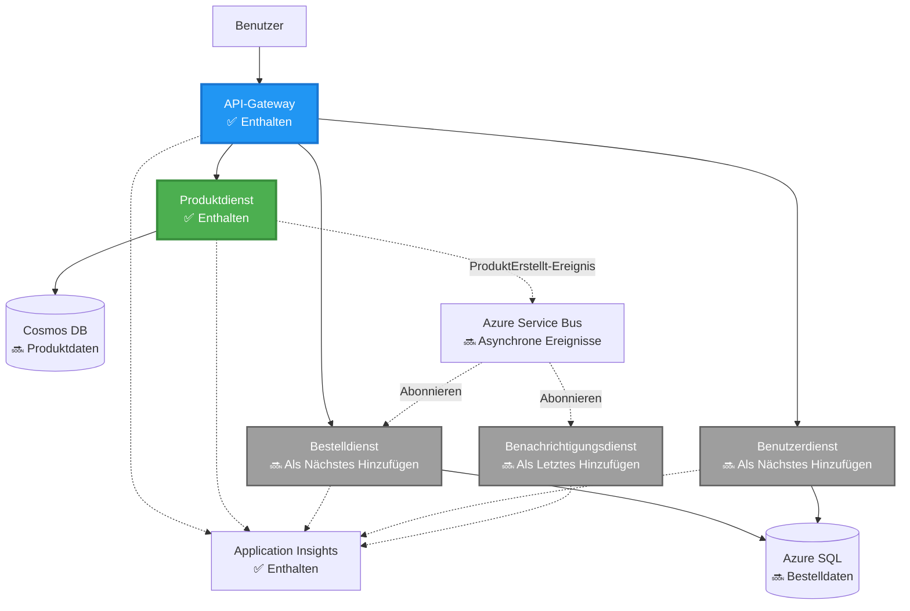
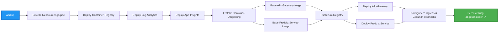
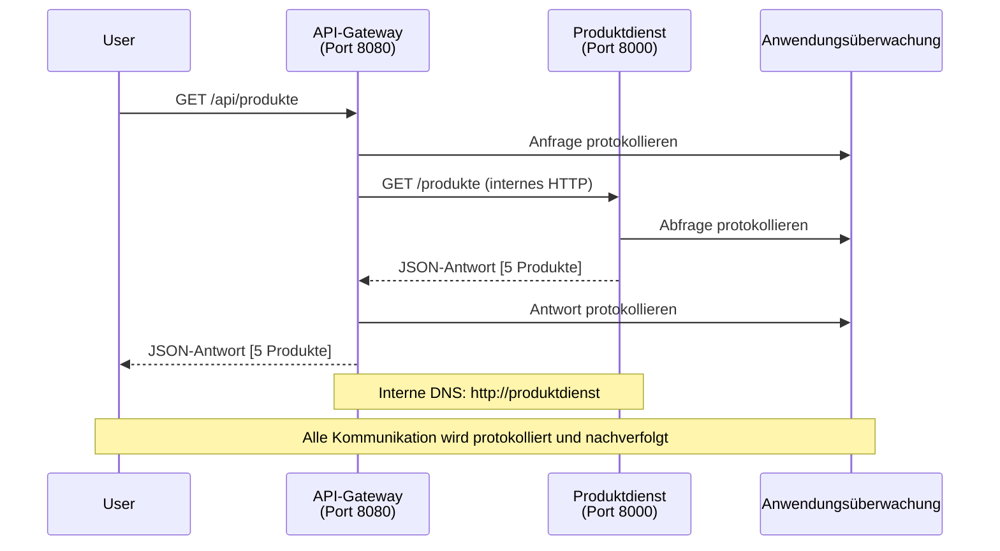

# Microservices-Architektur - Beispiel einer Container-App

⏱️ **Geschätzte Zeit**: 25-35 Minuten | 💰 **Geschätzte Kosten**: ~50-100 $/Monat | ⭐ **Schwierigkeitsgrad**: Fortgeschritten

**📚 Lernpfad:**
- ← Vorher: [Einfache Flask-API](../../../../examples/container-app/simple-flask-api) - Grundlagen eines einzelnen Containers
- 🎯 **Hier bist du**: Microservices-Architektur (2-Service-Grundlage)
- → Weiter: [KI-Integration](../../../../docs/ai-foundry) - Intelligenz zu deinen Diensten hinzufügen
- 🏠 [Kursübersicht](../../README.md)

---

Eine **vereinfachte, aber funktionale** Microservices-Architektur, die mit dem AZD CLI in Azure Container Apps bereitgestellt wird. Dieses Beispiel zeigt die Kommunikation zwischen Diensten, Container-Orchestrierung und Überwachung mit einer praktischen 2-Service-Konfiguration.

> **📚 Lernansatz**: Dieses Beispiel beginnt mit einer minimalen 2-Service-Architektur (API-Gateway + Backend-Service), die du tatsächlich bereitstellen und davon lernen kannst. Nachdem du diese Grundlage gemeistert hast, geben wir dir Anleitungen zur Erweiterung zu einem vollständigen Microservices-Ökosystem.

## Was du lernen wirst

Durch den Abschluss dieses Beispiels wirst du:
- Mehrere Container in Azure Container Apps bereitstellen
- Service-zu-Service-Kommunikation mit interner Vernetzung implementieren
- Skalierung und Gesundheitsprüfungen basierend auf der Umgebung konfigurieren
- Verteilte Anwendungen mit Application Insights überwachen
- Microservices-Bereitstellungsmuster und Best Practices verstehen
- Schrittweise Erweiterung von einfachen zu komplexen Architekturen lernen

## Architektur

### Phase 1: Was wir bauen (in diesem Beispiel enthalten)


**Komponenten-Details:**

| Komponente | Zweck | Zugriff | Ressourcen |
|------------|-------|---------|------------|
| **API-Gateway** | Leitet externe Anfragen an Backend-Dienste weiter | Öffentlich (HTTPS) | 1 vCPU, 2GB RAM, 2-20 Replikate |
| **Produkt-Service** | Verwalten des Produktkatalogs mit In-Memory-Daten | Nur intern | 0,5 vCPU, 1GB RAM, 1-10 Replikate |
| **Application Insights** | Zentralisiertes Logging und verteiltes Tracing | Azure-Portal | 1-2 GB/Monat Datenaufnahme |

**Warum einfach starten?**
- ✅ Schnell bereitstellen und verstehen (25-35 Minuten)
- ✅ Kernmuster von Microservices ohne Komplexität lernen
- ✅ Funktionierender Code, den du anpassen und ausprobieren kannst
- ✅ Geringere Lernkosten (~50-100 $/Monat vs. 300-1400 $/Monat)
- ✅ Selbstvertrauen aufbauen, bevor Datenbanken und Nachrichtenwarteschlangen hinzugefügt werden

**Analogie**: Stell dir vor, du lernst Autofahren. Du beginnst auf einem leeren Parkplatz (2 Dienste), beherrschst die Grundlagen und gehst dann in den Stadtverkehr (5+ Dienste mit Datenbanken).

### Phase 2: Zukünftige Erweiterung (Referenzarchitektur)

Sobald du die 2-Service-Architektur beherrschst, kannst du erweitern auf:


Siehe Abschnitt "Erweiterungsanleitung" am Ende für schrittweise Anweisungen.

## Enthaltene Funktionen

✅ **Service Discovery**: Automatische DNS-basierte Erkennung zwischen Containern  
✅ **Load Balancing**: Eingebautes Load Balancing über Replikate hinweg  
✅ **Auto-Scaling**: Unabhängige Skalierung pro Dienst basierend auf HTTP-Anfragen  
✅ **Gesundheitsüberwachung**: Liveness- und Readiness-Probes für beide Dienste  
✅ **Verteiltes Logging**: Zentralisiertes Logging mit Application Insights  
✅ **Interne Vernetzung**: Sichere Service-zu-Service-Kommunikation  
✅ **Container-Orchestrierung**: Automatische Bereitstellung und Skalierung  
✅ **Updates ohne Ausfallzeit**: Rolling Updates mit Revisionsmanagement  

## Voraussetzungen

### Erforderliche Tools

Bevor du beginnst, überprüfe, ob diese Tools installiert sind:

1. **[Azure Developer CLI (azd)](https://learn.microsoft.com/azure/developer/azure-developer-cli/install-azd)** (Version 1.0.0 oder höher)
   ```bash
   azd version
   # Erwartete Ausgabe: azd Version 1.0.0 oder höher
   ```

2. **[Azure CLI](https://learn.microsoft.com/cli/azure/install-azure-cli)** (Version 2.50.0 oder höher)
   ```bash
   az --version
   # Erwartete Ausgabe: azure-cli 2.50.0 oder höher
   ```

3. **[Docker](https://www.docker.com/get-started)** (für lokale Entwicklung/Tests - optional)
   ```bash
   docker --version
   # Erwartete Ausgabe: Docker-Version 20.10 oder höher
   ```

### Überprüfe deine Einrichtung

Führe diese Befehle aus, um sicherzustellen, dass du bereit bist:

```bash
# Überprüfen Sie Azure Developer CLI
azd version
# ✅ Erwartet: azd Version 1.0.0 oder höher

# Überprüfen Sie Azure CLI
az --version
# ✅ Erwartet: azure-cli 2.50.0 oder höher

# Überprüfen Sie Docker (optional)
docker --version
# ✅ Erwartet: Docker Version 20.10 oder höher
```

**Erfolgskriterien**: Alle Befehle geben Versionsnummern zurück, die den Mindestanforderungen entsprechen oder diese übertreffen.

### Azure-Anforderungen

- Ein aktives **Azure-Abonnement** ([kostenloses Konto erstellen](https://azure.microsoft.com/free/))
- Berechtigungen zum Erstellen von Ressourcen in deinem Abonnement
- **Contributor**-Rolle im Abonnement oder in der Ressourcengruppe

### Wissensvoraussetzungen

Dies ist ein Beispiel auf **fortgeschrittenem Niveau**. Du solltest:
- Das [einfache Flask-API-Beispiel](../../../../examples/container-app/simple-flask-api) abgeschlossen haben
- Grundlegendes Verständnis der Microservices-Architektur besitzen
- Mit REST-APIs und HTTP vertraut sein
- Grundkenntnisse über Container-Konzepte haben

**Neu bei Container-Apps?** Beginne zuerst mit dem [einfachen Flask-API-Beispiel](../../../../examples/container-app/simple-flask-api), um die Grundlagen zu lernen.

## Schnellstart (Schritt-für-Schritt)

### Schritt 1: Klonen und Navigieren

```bash
git clone https://github.com/microsoft/AZD-for-beginners.git
cd AZD-for-beginners/examples/microservices
```

**✓ Erfolgskontrolle**: Überprüfe, ob du `azure.yaml` siehst:
```bash
ls
# Erwartet: README.md, azure.yaml, infra/, src/
```

### Schritt 2: Authentifizieren mit Azure

```bash
azd auth login
```

Dies öffnet deinen Browser zur Azure-Authentifizierung. Melde dich mit deinen Azure-Zugangsdaten an.

**✓ Erfolgskontrolle**: Du solltest Folgendes sehen:
```
Logged in to Azure.
```

### Schritt 3: Umgebung initialisieren

```bash
azd init
```

**Eingabeaufforderungen, die du siehst**:
- **Umgebungsname**: Gib einen kurzen Namen ein (z. B. `microservices-dev`)
- **Azure-Abonnement**: Wähle dein Abonnement aus
- **Azure-Standort**: Wähle eine Region (z. B. `eastus`, `westeurope`)

**✓ Erfolgskontrolle**: Du solltest Folgendes sehen:
```
SUCCESS: New project initialized!
```

### Schritt 4: Infrastruktur und Dienste bereitstellen

```bash
azd up
```

**Was passiert** (dauert 8-12 Minuten):


**✓ Erfolgskontrolle**: Du solltest Folgendes sehen:
```
SUCCESS: Your application was deployed to Azure in X minutes Y seconds.
Endpoint: https://api-gateway-<unique-id>.azurecontainerapps.io
```

**⏱️ Zeit**: 8-12 Minuten

### Schritt 5: Bereitstellung testen

```bash
# Abrufen des Gateway-Endpunkts
GATEWAY_URL=$(azd env get-values | grep API_GATEWAY_URL | cut -d '=' -f2 | tr -d '"')

# Testen der API-Gateway-Gesundheit
curl $GATEWAY_URL/health
```

**✅ Erwartete Ausgabe:**
```json
{
  "status": "healthy",
  "service": "api-gateway",
  "timestamp": "2025-11-19T10:30:00Z"
}
```

**Produkt-Service über Gateway testen**:
```bash
# Produkte auflisten
curl $GATEWAY_URL/api/products
```

**✅ Erwartete Ausgabe:**
```json
[
  {"id":1,"name":"Laptop","price":999.99,"stock":50},
  {"id":2,"name":"Mouse","price":29.99,"stock":200},
  {"id":3,"name":"Keyboard","price":79.99,"stock":150}
]
```

**✓ Erfolgskontrolle**: Beide Endpunkte geben JSON-Daten ohne Fehler zurück.

---

**🎉 Glückwunsch!** Du hast eine Microservices-Architektur in Azure bereitgestellt!

## Projektstruktur

Alle Implementierungsdateien sind enthalten – dies ist ein vollständiges, funktionierendes Beispiel:

```
microservices/
│
├── README.md                         # This file
├── azure.yaml                        # AZD configuration
├── .gitignore                        # Git ignore patterns
│
├── infra/                           # Infrastructure as Code (Bicep)
│   ├── main.bicep                   # Main orchestration
│   ├── abbreviations.json           # Naming conventions
│   ├── core/                        # Shared infrastructure
│   │   ├── container-apps-environment.bicep  # Container environment + registry
│   │   └── monitor.bicep            # Application Insights + Log Analytics
│   └── app/                         # Service definitions
│       ├── api-gateway.bicep        # API Gateway container app
│       └── product-service.bicep    # Product Service container app
│
└── src/                             # Application source code
    ├── api-gateway/                 # Node.js API Gateway
    │   ├── app.js                   # Express server with routing
    │   ├── package.json             # Node dependencies
    │   └── Dockerfile               # Container definition
    └── product-service/             # Python Product Service
        ├── main.py                  # Flask API with product data
        ├── requirements.txt         # Python dependencies
        └── Dockerfile               # Container definition
```

**Was jede Komponente macht:**

**Infrastruktur (infra/)**:
- `main.bicep`: Orchestriert alle Azure-Ressourcen und deren Abhängigkeiten
- `core/container-apps-environment.bicep`: Erstellt die Container-Apps-Umgebung und Azure Container Registry
- `core/monitor.bicep`: Richtet Application Insights für verteiltes Logging ein
- `app/*.bicep`: Einzelne Container-App-Definitionen mit Skalierung und Gesundheitsprüfungen

**API-Gateway (src/api-gateway/)**:
- Öffentlich zugänglicher Dienst, der Anfragen an Backend-Dienste weiterleitet
- Implementiert Logging, Fehlerbehandlung und Anfragenweiterleitung
- Zeigt Service-zu-Service-HTTP-Kommunikation

**Produkt-Service (src/product-service/)**:
- Interner Dienst mit Produktkatalog (aus Einfachheitsgründen in Memory)
- REST-API mit Gesundheitsprüfungen
- Beispiel für ein Backend-Microservice-Muster

## Diensteübersicht

### API-Gateway (Node.js/Express)

**Port**: 8080  
**Zugriff**: Öffentlich (externer Ingress)  
**Zweck**: Leitet eingehende Anfragen an die entsprechenden Backend-Dienste weiter  

**Endpunkte**:
- `GET /` - Dienstinformationen
- `GET /health` - Gesundheitsprüfungs-Endpunkt
- `GET /api/products` - Weiterleitung an Produkt-Service (alle auflisten)
- `GET /api/products/:id` - Weiterleitung an Produkt-Service (nach ID abrufen)

**Hauptmerkmale**:
- Anfragenweiterleitung mit axios
- Zentralisiertes Logging
- Fehlerbehandlung und Timeout-Management
- Service-Erkennung über Umgebungsvariablen
- Integration von Application Insights

**Code-Highlight** (`src/api-gateway/app.js`):
```javascript
// Interne Dienstkommunikation
app.get('/api/products', async (req, res) => {
  const response = await axios.get(`${PRODUCT_SERVICE_URL}/products`, {
    timeout: 5000
  });
  res.json(response.data);
});
```

### Produkt-Service (Python/Flask)

**Port**: 8000  
**Zugriff**: Nur intern (kein externer Ingress)  
**Zweck**: Verwalten des Produktkatalogs mit In-Memory-Daten  

**Endpunkte**:
- `GET /` - Dienstinformationen
- `GET /health` - Gesundheitsprüfungs-Endpunkt
- `GET /products` - Alle Produkte auflisten
- `GET /products/<id>` - Produkt nach ID abrufen

**Hauptmerkmale**:
- RESTful API mit Flask
- In-Memory-Produktstore (einfach, keine Datenbank erforderlich)
- Gesundheitsüberwachung mit Probes
- Strukturiertes Logging
- Integration von Application Insights

**Datenmodell**:
```python
{
  "id": 1,
  "name": "Laptop",
  "description": "High-performance laptop",
  "price": 999.99,
  "stock": 50
}
```

**Warum nur intern?**
Der Produkt-Service ist nicht öffentlich zugänglich. Alle Anfragen müssen über das API-Gateway erfolgen, das Folgendes bietet:
- Sicherheit: Kontrollierter Zugangspunkt
- Flexibilität: Backend kann geändert werden, ohne die Clients zu beeinflussen
- Überwachung: Zentralisiertes Anfragen-Logging

## Verständnis der Service-Kommunikation

### Wie Dienste miteinander kommunizieren


In diesem Beispiel kommuniziert das API-Gateway mit dem Produkt-Service über **interne HTTP-Aufrufe**:

```javascript
// API-Gateway (src/api-gateway/app.js)
const PRODUCT_SERVICE_URL = process.env.PRODUCT_SERVICE_URL;

// Interne HTTP-Anfrage stellen
const response = await axios.get(`${PRODUCT_SERVICE_URL}/products`);
```

**Wichtige Punkte**:

1. **DNS-basierte Erkennung**: Container-Apps bieten automatisch DNS für interne Dienste
   - Produkt-Service FQDN: `product-service.internal.<environment>.azurecontainerapps.io`
   - Vereinfacht als: `http://product-service` (Container-Apps löst dies auf)

2. **Keine öffentliche Exposition**: Produkt-Service hat `external: false` in Bicep
   - Nur innerhalb der Container-Apps-Umgebung zugänglich
   - Kann nicht aus dem Internet erreicht werden

3. **Umgebungsvariablen**: Service-URLs werden zur Bereitstellungszeit injiziert
   - Bicep übergibt den internen FQDN an das Gateway
   - Keine fest codierten URLs im Anwendungscode

**Analogie**: Stell dir das wie Büroräume vor. Das API-Gateway ist der Empfang (öffentlich zugänglich), und der Produkt-Service ist ein Büroraum (nur intern). Besucher müssen über den Empfang gehen, um ein Büro zu erreichen.
3. Beide Dienste erneut bereitstellen:

```bash
azd deploy product-service
azd deploy api-gateway
```

4. Den neuen Endpunkt testen:

```bash
GATEWAY_URL=$(azd env get-values | grep API_GATEWAY_URL | cut -d '=' -f2 | tr -d '"')

# Erstelle ein neues Produkt
curl -X POST $GATEWAY_URL/api/products \
  -H "Content-Type: application/json" \
  -d '{"name":"USB Cable","price":9.99,"stock":500}'
```

**✅ Erwartete Ausgabe:**
```json
{"id":6,"name":"USB Cable","description":"","price":9.99,"stock":500}
```

5. Überprüfen, ob er in der Liste erscheint:

```bash
curl $GATEWAY_URL/api/products
# Sollte jetzt 6 Produkte anzeigen, einschließlich des neuen USB-Kabels
```

**Erfolgskriterien**:
- ✅ POST-Anfrage gibt HTTP 201 zurück
- ✅ Neues Produkt erscheint in der GET /api/products-Liste
- ✅ Produkt hat eine automatisch inkrementierte ID

**Zeit**: 10-15 Minuten

---

### Übung 2: Autoscaling-Regeln ändern ⭐⭐ (Mittel)

**Ziel**: Produktdienst soll aggressiver skalieren

**Ausgangspunkt**: `infra/app/product-service.bicep`

**Schritte**:

1. Öffne `infra/app/product-service.bicep` und finde den `scale`-Block (ca. Zeile 95)

2. Ändere von:
```bicep
scale: {
  minReplicas: 1
  maxReplicas: 10
  rules: [
    {
      name: 'http-scale-rule'
      http: {
        metadata: {
          concurrentRequests: '100'  // OLD
        }
      }
    }
  ]
}
```

Zu:
```bicep
scale: {
  minReplicas: 2  // Always have 2 running
  maxReplicas: 20  // Allow more scaling
  rules: [
    {
      name: 'http-scale-rule'
      http: {
        metadata: {
          concurrentRequests: '20'  // Scale at lower threshold
        }
      }
    }
  ]
}
```

3. Infrastruktur erneut bereitstellen:

```bash
azd up
```

4. Neue Skalierungskonfiguration überprüfen:

```bash
az containerapp show \
  --name $(azd env get-values | grep PRODUCT_SERVICE | head -1 | cut -d '/' -f5) \
  --resource-group $(azd env get-values | grep AZURE_RESOURCE_GROUP | cut -d '=' -f2 | tr -d '"') \
  --query "properties.template.scale" -o json
```

**✅ Erwartete Ausgabe:**
```json
{
  "minReplicas": 2,
  "maxReplicas": 20,
  "rules": [...]
}
```

5. Autoscaling unter Last testen:

```bash
# Generiere gleichzeitige Anfragen
for i in {1..500}; do curl $GATEWAY_URL/api/products & done

# Beobachte das Skalieren
azd logs product-service --follow
# Suche nach: Skalierungsereignisse von Container-Apps
```

**Erfolgskriterien**:
- ✅ Produktdienst läuft immer mit mindestens 2 Replikaten
- ✅ Unter Last skaliert er auf mehr als 2 Replikate
- ✅ Azure-Portal zeigt neue Skalierungsregeln

**Zeit**: 15-20 Minuten

---

### Übung 3: Benutzerdefinierte Monitoring-Abfrage hinzufügen ⭐⭐ (Mittel)

**Ziel**: Eine benutzerdefinierte Application Insights-Abfrage erstellen, um die Leistung der Produkt-API zu überwachen

**Schritte**:

1. Navigiere zu Application Insights im Azure-Portal:
   - Gehe zum Azure-Portal
   - Finde deine Ressourcengruppe (rg-microservices-*)
   - Klicke auf die Application Insights-Ressource

2. Klicke im linken Menü auf "Logs"

3. Erstelle diese Abfrage:

```kusto
requests
| where timestamp > ago(1h)
| where name contains "products"
| summarize 
    RequestCount = count(),
    AvgDuration = avg(duration),
    P95Duration = percentile(duration, 95),
    SuccessRate = 100.0 * countif(success == true) / count()
  by bin(timestamp, 5m)
| render timechart
```

4. Klicke auf "Run", um die Abfrage auszuführen

5. Abfrage speichern:
   - Klicke auf "Save"
   - Name: "Product API Performance"
   - Kategorie: "Performance"

6. Testverkehr generieren:

```bash
for i in {1..100}; do curl $GATEWAY_URL/api/products; sleep 1; done
```

7. Abfrage aktualisieren, um Daten zu sehen

**✅ Erwartete Ausgabe:**
- Diagramm zeigt Anfragenanzahl über die Zeit
- Durchschnittliche Dauer < 500ms
- Erfolgsrate = 100%
- Zeitintervalle von 5 Minuten

**Erfolgskriterien**:
- ✅ Abfrage zeigt 100+ Anfragen
- ✅ Erfolgsrate ist 100%
- ✅ Durchschnittliche Dauer < 500ms
- ✅ Diagramm zeigt 5-Minuten-Zeitintervalle

**Lernziel**: Verstehen, wie man die Leistung eines Dienstes mit benutzerdefinierten Abfragen überwacht

**Zeit**: 10-15 Minuten

---

### Übung 4: Retry-Logik implementieren ⭐⭐⭐ (Fortgeschritten)

**Ziel**: Retry-Logik zum API-Gateway hinzufügen, wenn der Produktdienst vorübergehend nicht verfügbar ist

**Ausgangspunkt**: `src/api-gateway/app.js`

**Schritte**:

1. Retry-Bibliothek installieren:

```bash
cd src/api-gateway
npm install axios-retry --save
cd ../..
```

2. `src/api-gateway/app.js` aktualisieren (nach dem axios-Import hinzufügen):

```javascript
const axiosRetry = require('axios-retry');

// Konfiguriere Wiederholungslogik
axiosRetry(axios, {
  retries: 3,
  retryDelay: (retryCount) => {
    return retryCount * 1000; // 1s, 2s, 3s
  },
  retryCondition: (error) => {
    // Wiederholen bei Netzwerkfehlern oder 5xx-Antworten
    return axiosRetry.isNetworkOrIdempotentRequestError(error) ||
           (error.response && error.response.status >= 500);
  }
});

console.log('Retry logic configured: 3 retries with exponential backoff');
```

3. API-Gateway erneut bereitstellen:

```bash
azd deploy api-gateway
```

4. Retry-Verhalten testen, indem ein Dienstausfall simuliert wird:

```bash
# Produktdienst auf 0 skalieren (Fehler simulieren)
az containerapp update \
  --name $(azd env get-values | grep PRODUCT_SERVICE | head -1 | cut -d '/' -f5) \
  --resource-group $(azd env get-values | grep AZURE_RESOURCE_GROUP | cut -d '=' -f2 | tr -d '"') \
  --min-replicas 0 \
  --max-replicas 0

# Versuchen, auf Produkte zuzugreifen (wird 3 Mal erneut versuchen)
time curl -v $GATEWAY_URL/api/products
# Beobachten: Antwort dauert ~6 Sekunden (1s + 2s + 3s Wiederholungen)

# Produktdienst wiederherstellen
az containerapp update \
  --name $(azd env get-values | grep PRODUCT_SERVICE | head -1 | cut -d '/' -f5) \
  --resource-group $(azd env get-values | grep AZURE_RESOURCE_GROUP | cut -d '=' -f2 | tr -d '"') \
  --min-replicas 1 \
  --max-replicas 10
```

5. Retry-Logs anzeigen:

```bash
azd logs api-gateway --tail 50
# Suchen Sie nach: Wiederholungsversuch-Nachrichten
```

**✅ Erwartetes Verhalten:**
- Anfragen werden 3 Mal erneut versucht, bevor sie fehlschlagen
- Jeder Retry wartet länger (1s, 2s, 3s)
- Erfolgreiche Anfragen nach Neustart des Dienstes
- Logs zeigen Retry-Versuche

**Erfolgskriterien**:
- ✅ Anfragen werden 3 Mal erneut versucht, bevor sie fehlschlagen
- ✅ Jeder Retry wartet länger (exponentielles Backoff)
- ✅ Erfolgreiche Anfragen nach Neustart des Dienstes
- ✅ Logs zeigen Retry-Versuche

**Lernziel**: Resilienz-Muster in Microservices verstehen (Circuit Breaker, Retries, Timeouts)

**Zeit**: 20-25 Minuten

---

## Wissensüberprüfung

Nach Abschluss dieses Beispiels überprüfe dein Verständnis:

### 1. Dienstkommunikation ✓

Teste dein Wissen:
- [ ] Kannst du erklären, wie das API-Gateway den Produktdienst entdeckt? (DNS-basierte Dienstentdeckung)
- [ ] Was passiert, wenn der Produktdienst ausfällt? (Gateway gibt 503-Fehler zurück)
- [ ] Wie würdest du einen dritten Dienst hinzufügen? (Neue Bicep-Datei erstellen, zu main.bicep hinzufügen, src-Ordner erstellen)

**Praktische Überprüfung:**
```bash
# Dienstfehler simulieren
az containerapp update --name <product-service-name> --min-replicas 0 --max-replicas 0
curl $GATEWAY_URL/api/products
# ✅ Erwartet: 503 Dienst nicht verfügbar

# Dienst wiederherstellen
az containerapp update --name <product-service-name> --min-replicas 1 --max-replicas 10
```

### 2. Monitoring & Beobachtbarkeit ✓

Teste dein Wissen:
- [ ] Wo siehst du verteilte Logs? (Application Insights im Azure-Portal)
- [ ] Wie verfolgst du langsame Anfragen? (Kusto-Abfrage: `requests | where duration > 1000`)
- [ ] Kannst du identifizieren, welcher Dienst einen Fehler verursacht hat? (Überprüfe das Feld `cloud_RoleName` in den Logs)

**Praktische Überprüfung:**
```bash
# Generieren Sie eine langsame Anfrage-Simulation
curl "$GATEWAY_URL/api/products?delay=2000"

# Abfragen von Application Insights für langsame Anfragen
# Navigieren Sie zu Azure Portal → Application Insights → Logs
# Ausführen: requests | where duration > 1000 | project timestamp, name, duration, cloud_RoleName
```

### 3. Skalierung & Leistung ✓

Teste dein Wissen:
- [ ] Was löst Autoscaling aus? (HTTP-Regeln für gleichzeitige Anfragen: 50 für Gateway, 100 für Produkt)
- [ ] Wie viele Replikate laufen derzeit? (Überprüfe mit `az containerapp revision list`)
- [ ] Wie würdest du den Produktdienst auf 5 Replikate skalieren? (minReplicas in Bicep aktualisieren)

**Praktische Überprüfung:**
```bash
# Last erzeugen, um die automatische Skalierung zu testen
for i in {1..1000}; do curl $GATEWAY_URL/api/products & done

# Beobachten, wie die Replikate zunehmen
azd logs api-gateway --follow
# ✅ Erwartet: Skalierungsereignisse in den Logs sehen
```

**Erfolgskriterien**: Du kannst alle Fragen beantworten und mit praktischen Befehlen überprüfen.

---

## Kostenanalyse

### Geschätzte monatliche Kosten (für dieses 2-Dienst-Beispiel)

| Ressource | Konfiguration | Geschätzte Kosten |
|-----------|---------------|-------------------|
| API-Gateway | 2-20 Replikate, 1 vCPU, 2GB RAM | $30-150 |
| Produktdienst | 1-10 Replikate, 0.5 vCPU, 1GB RAM | $15-75 |
| Container-Registry | Basis-Tarif | $5 |
| Application Insights | 1-2 GB/Monat | $5-10 |
| Log Analytics | 1 GB/Monat | $3 |
| **Gesamt** | | **$58-243/Monat** |

### Kostenaufteilung nach Nutzung

**Leichter Traffic** (Testen/Lernen): ~60 $/Monat
- API-Gateway: 2 Replikate × 24/7 = $30
- Produktdienst: 1 Replikat × 24/7 = $15
- Monitoring + Registry = $13

**Moderater Traffic** (kleine Produktion): ~120 $/Monat
- API-Gateway: 5 durchschnittliche Replikate = $75
- Produktdienst: 3 durchschnittliche Replikate = $45
- Monitoring + Registry = $13

**Hoher Traffic** (starke Auslastung): ~240 $/Monat
- API-Gateway: 15 durchschnittliche Replikate = $225
- Produktdienst: 8 durchschnittliche Replikate = $120
- Monitoring + Registry = $13

### Tipps zur Kostenoptimierung

1. **Für Entwicklung auf Null skalieren**:
   ```bicep
   scale: {
     minReplicas: 0  // Save $30-40/month when not in use
     maxReplicas: 10
   }
   ```

2. **Verwende den Verbrauchsplan für Cosmos DB** (wenn du ihn hinzufügst):
   - Bezahle nur für das, was du nutzt
   - Keine Mindestgebühr

3. **Application Insights Sampling einstellen**:
   ```javascript
   appInsights.defaultClient.config.samplingPercentage = 50; // Stichprobe von 50% der Anfragen
   ```

4. **Bereinige, wenn nicht benötigt**:
   ```bash
   azd down --force --purge
   ```

### Optionen für kostenlose Nutzung

Für Lernen/Testen, erwäge:
- ✅ Nutze Azure-Guthaben ($200 für die ersten 30 Tage bei neuen Konten)
- ✅ Halte die Replikate auf Minimum (spart ~50 % der Kosten)
- ✅ Lösche nach dem Testen (keine laufenden Gebühren)
- ✅ Skaliere zwischen Lernsitzungen auf Null

**Beispiel**: Dieses Beispiel 2 Stunden/Tag × 30 Tage ausführen = ~5 $/Monat statt 60 $/Monat

---

## Schnellreferenz für Fehlerbehebung

### Problem: `azd up` schlägt fehl mit "Subscription not found"

**Lösung**:
```bash
# Erneut mit explizitem Abonnement anmelden
az account set --subscription <your-subscription-id>
azd env set AZURE_SUBSCRIPTION_ID <your-subscription-id>
azd up
```

### Problem: API-Gateway gibt 503 "Produktdienst nicht verfügbar" zurück

**Diagnose**:
```bash
# Überprüfen Sie die Protokolle des Produktdienstes
azd logs product-service --tail 50

# Überprüfen Sie die Gesundheit des Produktdienstes
az containerapp show \
  --name $(azd env get-values | grep PRODUCT_SERVICE | head -1 | cut -d '/' -f5) \
  --resource-group $(azd env get-values | grep AZURE_RESOURCE_GROUP | cut -d '=' -f2 | tr -d '"') \
  --query "properties.runningStatus"
```

**Häufige Ursachen**:
1. Produktdienst ist nicht gestartet (Logs auf Python-Fehler überprüfen)
2. Health-Check schlägt fehl (überprüfe, ob `/health`-Endpunkt funktioniert)
3. Container-Image-Build fehlgeschlagen (Registry auf Image überprüfen)

### Problem: Autoscaling funktioniert nicht

**Diagnose**:
```bash
# Überprüfen Sie die aktuelle Replikanzahl
az containerapp revision list \
  --name $(azd env get-values | grep API_GATEWAY | head -1 | cut -d '/' -f5) \
  --resource-group $(azd env get-values | grep AZURE_RESOURCE_GROUP | cut -d '=' -f2 | tr -d '"') \
  --query "[].properties.replicas"

# Last generieren, um zu testen
for i in {1..1000}; do curl $GATEWAY_URL/api/products & done

# Skalierungsereignisse beobachten
azd logs api-gateway --follow | grep -i scale
```

**Häufige Ursachen**:
1. Last nicht hoch genug, um Skalierungsregel auszulösen (mehr als 50 gleichzeitige Anfragen erforderlich)
2. Maximale Replikate bereits erreicht (Bicep-Konfiguration überprüfen)
3. Skalierungsregel in Bicep falsch konfiguriert (Wert für concurrentRequests überprüfen)

### Problem: Application Insights zeigt keine Logs

**Diagnose**:
```bash
# Überprüfen, ob die Verbindungszeichenfolge festgelegt ist
azd env get-values | grep APPLICATIONINSIGHTS

# Überprüfen, ob Dienste Telemetrie senden
az monitor app-insights component show \
  --app $(azd env get-values | grep APPLICATIONINSIGHTS_NAME | cut -d '=' -f2 | tr -d '"') \
  --resource-group $(azd env get-values | grep AZURE_RESOURCE_GROUP | cut -d '=' -f2 | tr -d '"') \
  --query "properties.InstrumentationKey"
```

**Häufige Ursachen**:
1. Verbindungszeichenfolge nicht an Container übergeben (Umgebungsvariablen überprüfen)
2. Application Insights SDK nicht konfiguriert (Imports im Code überprüfen)
3. Firewall blockiert Telemetrie (selten, Netzwerkrichtlinien überprüfen)

### Problem: Docker-Build schlägt lokal fehl

**Diagnose**:
```bash
# Testen Sie den API-Gateway-Build
cd src/api-gateway
docker build -t test-gateway .

# Testen Sie den Produkt-Service-Build
cd ../product-service
docker build -t test-product .
```

**Häufige Ursachen**:
1. Fehlende Abhängigkeiten in package.json/requirements.txt
2. Syntaxfehler in Dockerfile
3. Netzwerkprobleme beim Herunterladen von Abhängigkeiten

**Immer noch Probleme?** Siehe [Leitfaden für häufige Probleme](../../docs/troubleshooting/common-issues.md) oder [Azure Container Apps Fehlerbehebung](https://learn.microsoft.com/azure/container-apps/troubleshooting)

---

## Bereinigung

Um laufende Kosten zu vermeiden, lösche alle Ressourcen:

```bash
azd down --force --purge
```

**Bestätigungsaufforderung**:
```
? Total resources to delete: 6, are you sure you want to continue? (y/N)
```

Gib `y` ein, um zu bestätigen.

**Was wird gelöscht**:
- Container Apps Umgebung
- Beide Container Apps (Gateway & Produktdienst)
- Container-Registry
- Application Insights
- Log Analytics Workspace
- Ressourcengruppe

**✓ Bereinigung überprüfen**:
```bash
az group list --query "[?starts_with(name,'rg-microservices')]" --output table
```

Sollte leer zurückgeben.

---

## Erweiterungsleitfaden: Von 2 auf 5+ Dienste

Sobald du diese 2-Dienst-Architektur gemeistert hast, kannst du sie erweitern:

### Phase 1: Datenbankpersistenz hinzufügen (nächster Schritt)

**Cosmos DB für Produktdienst hinzufügen**:

1. Erstelle `infra/core/cosmos.bicep`:
   ```bicep
   resource cosmosAccount 'Microsoft.DocumentDB/databaseAccounts@2023-04-15' = {
     name: name
     location: location
     kind: 'GlobalDocumentDB'
     properties: {
       databaseAccountOfferType: 'Standard'
       consistencyPolicy: { defaultConsistencyLevel: 'Session' }
       locations: [{ locationName: location, failoverPriority: 0 }]
     }
   }
   ```

2. Aktualisiere den Produktdienst, um das Azure Cosmos DB Python SDK anstelle von In-Memory-Daten zu verwenden

3. Geschätzte zusätzliche Kosten: ~25 $/Monat (serverlos)

### Phase 2: Dritten Dienst hinzufügen (Bestellverwaltung)

**Bestelldienst erstellen**:

1. Neuer Ordner: `src/order-service/` (Python/Node.js/C#)
2. Neue Bicep-Datei: `infra/app/order-service.bicep`
3. API-Gateway aktualisieren, um `/api/orders` zu routen
4. Azure SQL-Datenbank für Bestellpersistenz hinzufügen

**Architektur wird**:
```
API Gateway → Product Service (Cosmos DB)
           → Order Service (Azure SQL)
```

### Phase 3: Asynchrone Kommunikation hinzufügen (Service Bus)

**Ereignisgesteuerte Architektur implementieren**:

1. Azure Service Bus hinzufügen: `infra/core/servicebus.bicep`
2. Produktdienst veröffentlicht "ProductCreated"-Ereignisse
3. Bestelldienst abonniert Produktereignisse
4. Benachrichtigungsdienst hinzufügen, um Ereignisse zu verarbeiten

**Muster**: Anfrage/Antwort (HTTP) + Ereignisgesteuert (Service Bus)

### Phase 4: Benutzerauthentifizierung hinzufügen

**Benutzerdienst implementieren**:

1. Erstelle `src/user-service/` (Go/Node.js)
2. Azure AD B2C oder benutzerdefinierte JWT-Authentifizierung hinzufügen
3. API-Gateway validiert Tokens vor dem Routing
4. Dienste überprüfen Benutzerberechtigungen

### Phase 5: Produktionsreife

**Diese Komponenten hinzufügen**:
- ✅ Azure Front Door (globales Load Balancing)
- ✅ Azure Key Vault (Geheimnisverwaltung)
- ✅ Azure Monitor Workbooks (benutzerdefinierte Dashboards)
- ✅ CI/CD-Pipeline (GitHub Actions)
- ✅ Blue-Green-Deployments
- ✅ Verwaltete Identität für alle Dienste

**Kosten für vollständige Produktionsarchitektur**: ~300-1.400 $/Monat

---

## Mehr erfahren

### Verwandte Dokumentation
- [Azure Container Apps Dokumentation](https://learn.microsoft.com/azure/container-apps/)
- [Leitfaden zur Microservices-Architektur](https://learn.microsoft.com/azure/architecture/guide/architecture-styles/microservices)
- [Application Insights für verteiltes Tracing](https://learn.microsoft.com/azure/azure-monitor/app/distributed-tracing)
- [Azure Developer CLI Dokumentation](https://learn.microsoft.com/azure/developer/azure-developer-cli/)

### Nächste Schritte in diesem Kurs
- ← Vorher: [Einfaches Flask-API](../../../../examples/container-app/simple-flask-api) - Anfängerbeispiel mit einem Container
- → Weiter: [AI-Integrationsleitfaden](../../../../docs/ai-foundry) - KI-Funktionen hinzufügen
- 🏠 [Kursübersicht](../../README.md)

### Vergleich: Wann sollte man was verwenden?

| Funktion | Einzelcontainer | Microservices (dieses) | Kubernetes (AKS) |
|----------|----------------|------------------------|------------------|
| **Anwendungsfall** | Einfache Apps | Komplexe Apps | Unternehmens-Apps |
| **Skalierbarkeit** | Einzelner Dienst | Skalierung pro Dienst | Maximale Flexibilität |
| **Komplexität** | Niedrig | Mittel | Hoch |
| **Teamgröße** | 1-3 Entwickler | 3-10 Entwickler | 10+ Entwickler |
| **Kosten** | ~15-50 $/Monat | ~60-250 $/Monat | ~150-500 $/Monat |
| **Bereitstellungszeit** | 5-10 Minuten | 8-12 Minuten | 15-30 Minuten |
| **Am besten geeignet für** | MVPs, Prototypen | Produktionsanwendungen | Multi-Cloud, erweiterte Netzwerke |

**Empfehlung**: Beginnen Sie mit Container Apps (dieses Beispiel) und wechseln Sie zu AKS, nur wenn Sie Kubernetes-spezifische Funktionen benötigen.

---

## Häufig gestellte Fragen

**F: Warum nur 2 Dienste statt 5+?**  
A: Pädagogische Progression. Beherrschen Sie die Grundlagen (Dienstkommunikation, Überwachung, Skalierung) mit einem einfachen Beispiel, bevor Sie Komplexität hinzufügen. Die hier erlernten Muster gelten auch für Architekturen mit 100 Diensten.

**F: Kann ich selbst weitere Dienste hinzufügen?**  
A: Absolut! Folgen Sie der oben genannten Erweiterungsanleitung. Jeder neue Dienst folgt demselben Muster: Erstellen Sie einen src-Ordner, erstellen Sie eine Bicep-Datei, aktualisieren Sie azure.yaml und führen Sie die Bereitstellung durch.

**F: Ist das produktionsreif?**  
A: Es ist eine solide Grundlage. Für die Produktion fügen Sie hinzu: verwaltete Identität, Key Vault, persistente Datenbanken, CI/CD-Pipeline, Überwachungswarnungen und Backup-Strategie.

**F: Warum nicht Dapr oder ein anderes Service Mesh verwenden?**  
A: Halten Sie es einfach zum Lernen. Sobald Sie das native Networking von Container Apps verstehen, können Sie Dapr für erweiterte Szenarien (Zustandsverwaltung, Pub/Sub, Bindungen) hinzufügen.

**F: Wie debugge ich lokal?**  
A: Führen Sie Dienste lokal mit Docker aus:  
```bash
cd src/api-gateway
docker build -t local-gateway .
docker run -p 8080:8080 -e PRODUCT_SERVICE_URL=http://localhost:8000 local-gateway
```
  
**F: Kann ich verschiedene Programmiersprachen verwenden?**  
A: Ja! Dieses Beispiel zeigt Node.js (Gateway) + Python (Produktdienst). Sie können beliebige Sprachen mischen, die in Containern laufen: C#, Go, Java, Ruby, PHP usw.

**F: Was, wenn ich keine Azure-Guthaben habe?**  
A: Nutzen Sie die kostenlose Azure-Stufe (neue Konten erhalten in den ersten 30 Tagen $200 Guthaben) oder führen Sie kurze Tests durch und löschen Sie die Ressourcen sofort. Dieses Beispiel kostet ca. $2/Tag.

**F: Wie unterscheidet sich das von Azure Kubernetes Service (AKS)?**  
A: Container Apps sind einfacher (keine Kubernetes-Kenntnisse erforderlich), aber weniger flexibel. AKS bietet Ihnen die volle Kontrolle über Kubernetes, erfordert jedoch mehr Fachwissen. Beginnen Sie mit Container Apps und wechseln Sie zu AKS, wenn nötig.

**F: Kann ich dies mit bestehenden Azure-Diensten verwenden?**  
A: Ja! Sie können sich mit bestehenden Datenbanken, Speicherkonten, Service Bus usw. verbinden. Aktualisieren Sie die Bicep-Dateien, um auf bestehende Ressourcen zu verweisen, anstatt neue zu erstellen.

---

> **🎓 Zusammenfassung des Lernpfads**: Sie haben gelernt, eine Multi-Service-Architektur mit automatischer Skalierung, internem Networking, zentralisierter Überwachung und produktionsreifen Mustern bereitzustellen. Diese Grundlage bereitet Sie auf komplexe verteilte Systeme und Unternehmens-Microservices-Architekturen vor.

**📚 Kursnavigation:**
- ← Vorherige: [Einfaches Flask-API](../../../../examples/container-app/simple-flask-api)
- → Nächste: [Beispiel für Datenbankintegration](../../../../database-app)
- 🏠 [Kursübersicht](../../README.md)
- 📖 [Best Practices für Container Apps](../../docs/deployment/deployment-guide.md)

---

**✨ Herzlichen Glückwunsch!** Sie haben das Microservices-Beispiel abgeschlossen. Sie verstehen nun, wie man verteilte Anwendungen auf Azure Container Apps erstellt, bereitstellt und überwacht. Bereit, KI-Funktionen hinzuzufügen? Schauen Sie sich den [Leitfaden zur KI-Integration](../../../../docs/ai-foundry) an!

---

<!-- CO-OP TRANSLATOR DISCLAIMER START -->
**Haftungsausschluss**:  
Dieses Dokument wurde mit dem KI-Übersetzungsdienst [Co-op Translator](https://github.com/Azure/co-op-translator) übersetzt. Obwohl wir uns um Genauigkeit bemühen, beachten Sie bitte, dass automatisierte Übersetzungen Fehler oder Ungenauigkeiten enthalten können. Das Originaldokument in seiner ursprünglichen Sprache sollte als maßgebliche Quelle betrachtet werden. Für kritische Informationen wird eine professionelle menschliche Übersetzung empfohlen. Wir übernehmen keine Haftung für Missverständnisse oder Fehlinterpretationen, die sich aus der Nutzung dieser Übersetzung ergeben.
<!-- CO-OP TRANSLATOR DISCLAIMER END -->