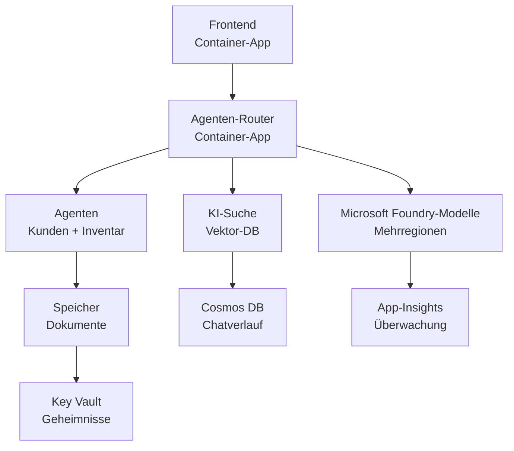

# Retail Multi-Agent Solution - Infrastructure Template

**Kapitel 5: Produktionsbereitstellungspaket**
- **📚 Kursübersicht**: [AZD For Beginners](../../README.md)
- **📖 Zugehöriges Kapitel**: [Kapitel 5: Multi-Agent AI Solutions](../../README.md#-chapter-5-multi-agent-ai-solutions-advanced)
- **📝 Szenario-Anleitung**: [Komplette Architektur](../retail-scenario.md)
- **🎯 Schnellbereitstellung**: [One-Click Deployment](../../../../examples/retail-multiagent-arm-template)

> **⚠️ NUR INFRASTRUKTURVORLAGE**  
> Diese ARM-Vorlage stellt **Azure-Ressourcen** für ein Multi-Agenten-System bereit.  
>  
> **Was bereitgestellt wird (15–25 Minuten):**
> - ✅ Microsoft Foundry Models (gpt-4.1, gpt-4.1-mini, Embeddings in 3 Regionen)
> - ✅ AI Search Service (leer, bereit zur Indexerstellung)
> - ✅ Container Apps (Platzhalter-Images, bereit für Ihren Code)
> - ✅ Storage, Cosmos DB, Key Vault, Application Insights
>  
> **Was NICHT enthalten ist (benötigt Entwicklung):**
> - ❌ Agent-Implementierungscode (Customer Agent, Inventory Agent)
> - ❌ Routing-Logik und API-Endpunkte
> - ❌ Frontend-Chat-UI
> - ❌ Suchindex-Schemata und Datenpipelines
> - ❌ **Geschätzter Entwicklungsaufwand: 80–120 Stunden**
>  
> **Verwenden Sie diese Vorlage, wenn:**
> - ✅ Sie Azure-Infrastruktur für ein Multi-Agenten-Projekt bereitstellen möchten
> - ✅ Sie die Agent-Implementierung separat entwickeln möchten
> - ✅ Sie eine produktionsbereite Infrastruktur-Basis benötigen
>  
> **Nicht verwenden, wenn:**
> - ❌ Sie sofort eine funktionierende Multi-Agenten-Demo erwarten
> - ❌ Sie vollständige Anwendungsbeispiele suchen

## Übersicht

Dieses Verzeichnis enthält eine umfassende Azure Resource Manager (ARM)-Vorlage zur Bereitstellung des **Infrastruktur-Fundaments** eines Multi-Agenten-Kundensupportsystems. Die Vorlage stellt alle notwendigen Azure-Dienste bereit, korrekt konfiguriert und miteinander verbunden, bereit für Ihre Anwendungsentwicklung.

**Nach der Bereitstellung haben Sie:** Produktionsbereite Azure-Infrastruktur  
**Um das System zu vervollständigen, benötigen Sie:** Agenten-Code, Frontend-UI und Datenkonfiguration (siehe [Architecture Guide](../retail-scenario.md))

## 🎯 Was bereitgestellt wird

### Kerninfrastruktur (Status nach Bereitstellung)

✅ **Microsoft Foundry Models Services** (Bereit für API-Aufrufe)
  - Primäre Region: gpt-4.1 Deployment (20K TPM Kapazität)
  - Sekundäre Region: gpt-4.1-mini Deployment (10K TPM Kapazität)
  - Tertiäre Region: Text-Embeddings-Modell (30K TPM Kapazität)
  - Evaluierungsregion: gpt-4.1 Grader-Modell (15K TPM Kapazität)
  - **Status:** Voll funktionsfähig - kann sofort API-Aufrufe ausführen

✅ **Azure AI Search** (Leer - bereit zur Konfiguration)
  - Vektor-Suchfunktionalität aktiviert
  - Standard-Tier mit 1 Partition, 1 Replica
  - **Status:** Dienst läuft, benötigt jedoch Indexerstellung
  - **Erforderliche Aktion:** Erstellen Sie einen Suchindex mit Ihrem Schema

✅ **Azure Storage Account** (Leer - bereit für Uploads)
  - Blob-Container: `documents`, `uploads`
  - Sichere Konfiguration (nur HTTPS, kein öffentlicher Zugriff)
  - **Status:** Bereit zum Empfang von Dateien
  - **Erforderliche Aktion:** Laden Sie Ihre Produktdaten und Dokumente hoch

⚠️ **Container Apps Environment** (Platzhalter-Images bereitgestellt)
  - Agent-Router-App (nginx Default-Image)
  - Frontend-App (nginx Default-Image)
  - Auto-Scaling konfiguriert (0–10 Instanzen)
  - **Status:** Platzhalter-Container laufen
  - **Erforderliche Aktion:** Erstellen und deployen Sie Ihre Agent-Anwendungen

✅ **Azure Cosmos DB** (Leer - bereit für Daten)
  - Datenbank und Container vorab konfiguriert
  - Optimiert für latenzarme Operationen
  - TTL aktiviert für automatische Bereinigung
  - **Status:** Bereit zur Speicherung von Chat-Verläufen

✅ **Azure Key Vault** (Optional - bereit für Geheimnisse)
  - Soft Delete aktiviert
  - RBAC für Managed Identities konfiguriert
  - **Status:** Bereit zur Speicherung von API-Schlüsseln und Verbindungszeichenfolgen

✅ **Application Insights** (Optional - Monitoring aktiv)
  - Mit Log Analytics Workspace verbunden
  - Benutzerdefinierte Metriken und Alerts konfiguriert
  - **Status:** Bereit, Telemetrie von Ihren Apps zu empfangen

✅ **Document Intelligence** (Bereit für API-Aufrufe)
  - S0-Tier für Produktions-Workloads
  - **Status:** Bereit zur Verarbeitung hochgeladener Dokumente

✅ **Bing Search API** (Bereit für API-Aufrufe)
  - S1-Tier für Echtzeitsuchen
  - **Status:** Bereit für Web-Suchanfragen

### Bereitstellungsmodi

| Mode | OpenAI Capacity | Container Instances | Search Tier | Storage Redundancy | Best For |
|------|-----------------|---------------------|-------------|-------------------|----------|
| **Minimal** | 10K-20K TPM | 0-2 replicas | Basic | LRS (Local) | Dev/Test, Lernen, Proof-of-Concept |
| **Standard** | 30K-60K TPM | 2-5 replicas | Standard | ZRS (Zone) | Produktion, moderater Verkehr (<10K Benutzer) |
| **Premium** | 80K-150K TPM | 5-10 replicas, zone-redundant | Premium | GRS (Geo) | Enterprise, hoher Verkehr (>10K Benutzer), 99.99% SLA |

**Kostenauswirkung:**
- **Minimal → Standard:** ~4x Kostenanstieg (100–370 USD/Monat → 420–1.450 USD/Monat)
- **Standard → Premium:** ~3x Kostenanstieg (420–1.450 USD/Monat → 1.150–3.500 USD/Monat)
- **Auswahl basierend auf:** Erwarteter Last, SLA-Anforderungen, Budgeteinschränkungen

**Kapazitätsplanung:**
- **TPM (Tokens Per Minute):** Gesamt über alle Modell-Deployments
- **Container-Instanzen:** Auto-Scaling-Bereich (Min–Max Replikate)
- **Search Tier:** Beeinflusst Abfrageleistung und Indexgrößenlimits

## 📋 Voraussetzungen

### Erforderliche Tools
1. **Azure CLI** (Version 2.50.0 oder höher)
   ```bash
   az --version  # Version prüfen
   az login      # Authentifizieren
   ```

2. **Aktives Azure-Abonnement** mit Owner- oder Contributor-Zugriff
   ```bash
   az account show  # Abonnement überprüfen
   ```

### Erforderliche Azure-Quoten

Überprüfen Sie vor der Bereitstellung ausreichende Quoten in Ihren Zielregionen:

```bash
# Überprüfen Sie die Verfügbarkeit von Microsoft Foundry-Modellen in Ihrer Region
az cognitiveservices account list-skus \
  --kind OpenAI \
  --location eastus2

# Überprüfen Sie das OpenAI-Kontingent (Beispiel für gpt-4.1)
az cognitiveservices usage list \
  --location eastus2 \
  --query "[?name.value=='OpenAI.Standard.gpt-4.1']"

# Überprüfen Sie das Kontingent für Container-Apps
az provider show \
  --namespace Microsoft.App \
  --query "resourceTypes[?resourceType=='managedEnvironments'].locations"
```

**Mindestanforderungen an Quoten:**
- **Microsoft Foundry Models:** 3–4 Modell-Deployments über Regionen
  - gpt-4.1: 20K TPM (Tokens pro Minute)
  - gpt-4.1-mini: 10K TPM
  - text-embedding-ada-002: 30K TPM
  - **Hinweis:** gpt-4.1 kann in einigen Regionen eine Warteliste haben - prüfen Sie die [model availability](https://learn.microsoft.com/azure/ai-services/openai/concepts/models)
- **Container Apps:** Managed Environment + 2–10 Container-Instanzen
- **AI Search:** Standard-Tier (Basic unzureichend für Vektor-Suche)
- **Cosmos DB:** Standard Provisioned Throughput

**Wenn die Quote nicht ausreicht:**
1. Gehen Sie ins Azure-Portal → Quotas → Erhöhung anfordern
2. Oder verwenden Sie die Azure CLI:
   ```bash
   az support tickets create \
     --ticket-name "OpenAI-Quota-Increase" \
     --severity "minimal" \
     --description "Request quota increase for Microsoft Foundry Models gpt-4.1 in eastus2"
   ```
3. Ziehen Sie alternative Regionen mit Verfügbarkeit in Betracht

## 🚀 Schnellbereitstellung

### Option 1: Mit Azure CLI

```bash
# Vorlagendateien klonen oder herunterladen
git clone <repository-url>
cd examples/retail-multiagent-arm-template

# Das Bereitstellungsskript ausführbar machen
chmod +x deploy.sh

# Mit Standardeinstellungen bereitstellen
./deploy.sh -g myResourceGroup

# Für die Produktion mit Premium-Funktionen bereitstellen
./deploy.sh -g myProdRG -e prod -m premium -l eastus2
```

### Option 2: Über das Azure-Portal

[](https://portal.azure.com/#create/Microsoft.Template/uri/https%3A%2F%2Fraw.githubusercontent.com%2Fmicrosoft%2Fazd-for-beginners%2Fmain%2Fexamples%2Fretail-multiagent-arm-template%2Fazuredeploy.json)

### Option 3: Direkte Nutzung der Azure CLI

```bash
# Ressourcengruppe erstellen
az group create --name myResourceGroup --location eastus2

# Vorlage bereitstellen
az deployment group create \
  --resource-group myResourceGroup \
  --template-file azuredeploy.json \
  --parameters azuredeploy.parameters.json
```

## ⏱️ Bereitstellungszeitplan

### Was Sie erwarten können

| Phase | Dauer | What Happens |
|-------|----------|--------------||
| **Template Validation** | 30-60 seconds | Azure validiert die ARM-Template-Syntax und Parameter |
| **Resource Group Setup** | 10-20 seconds | Erstellt die Resource Group (falls erforderlich) |
| **OpenAI Provisioning** | 5-8 minutes | Erstellt 3–4 OpenAI-Konten und deployed Modelle |
| **Container Apps** | 3-5 minutes | Erstellt Environment und deployed Platzhalter-Container |
| **Search & Storage** | 2-4 minutes | Stellt AI Search Service und Storage Accounts bereit |
| **Cosmos DB** | 2-3 minutes | Erstellt Datenbank und konfiguriert Container |
| **Monitoring Setup** | 2-3 minutes | Richtet Application Insights und Log Analytics ein |
| **RBAC Configuration** | 1-2 minutes | Konfiguriert Managed Identities und Berechtigungen |
| **Total Deployment** | **15-25 minutes** | Vollständige Infrastruktur bereit |

**Nach der Bereitstellung:**
- ✅ **Infrastruktur bereit:** Alle Azure-Dienste bereitgestellt und laufen
- ⏱️ **Anwendungsentwicklung:** 80–120 Stunden (Ihre Verantwortung)
- ⏱️ **Index-Konfiguration:** 15–30 Minuten (erfordert Ihr Schema)
- ⏱️ **Daten-Upload:** Abhängig von der Datensatzgröße
- ⏱️ **Tests & Validierung:** 2–4 Stunden

---

## ✅ Überprüfen des Bereitstellungserfolgs

### Schritt 1: Überprüfen der Ressourcenbereitstellung (2 Minuten)

```bash
# Überprüfen Sie, dass alle Ressourcen erfolgreich bereitgestellt wurden
az resource list \
  --resource-group myResourceGroup \
  --query "[?provisioningState!='Succeeded'].{Name:name, Status:provisioningState, Type:type}" \
  --output table
```

**Erwartet:** Leere Tabelle (alle Ressourcen zeigen den Status "Succeeded")

### Schritt 2: Überprüfen der Microsoft Foundry Models Deployments (3 Minuten)

```bash
# Alle OpenAI-Konten auflisten
az cognitiveservices account list \
  --resource-group myResourceGroup \
  --query "[?kind=='OpenAI'].{Name:name, Location:location, Status:properties.provisioningState}" \
  --output table

# Modellbereitstellungen für die primäre Region prüfen
OPENAI_NAME=$(az cognitiveservices account list \
  --resource-group myResourceGroup \
  --query "[?kind=='OpenAI'] | [0].name" -o tsv)

az cognitiveservices account deployment list \
  --name $OPENAI_NAME \
  --resource-group myResourceGroup \
  --output table
```

**Erwartet:** 
- 3–4 OpenAI-Konten (primär, sekundär, tertiär, Evaluierungsregionen)
- 1–2 Modell-Deployments pro Konto (gpt-4.1, gpt-4.1-mini, text-embedding-ada-002)

### Schritt 3: Testen der Infrastruktur-Endpunkte (5 Minuten)

```bash
# Container-App-URLs abrufen
az containerapp list \
  --resource-group myResourceGroup \
  --query "[].{Name:name, URL:properties.configuration.ingress.fqdn, Status:properties.runningStatus}" \
  --output table

# Router-Endpunkt testen (Platzhalterbild wird antworten)
ROUTER_URL=$(az containerapp show \
  --name retail-router \
  --resource-group myResourceGroup \
  --query "properties.configuration.ingress.fqdn" -o tsv)

echo "Testing: https://$ROUTER_URL"
curl -I https://$ROUTER_URL || echo "Container running (placeholder image - expected)"
```

**Erwartet:** 
- Container Apps zeigen den Status "Running"
- Platzhalter-nginx antwortet mit HTTP 200 oder 404 (noch kein Anwendungs-Code)

### Schritt 4: Überprüfen des Microsoft Foundry Models API-Zugriffs (3 Minuten)

```bash
# OpenAI-Endpunkt und Schlüssel abrufen
OPENAI_ENDPOINT=$(az cognitiveservices account show \
  --name $OPENAI_NAME \
  --resource-group myResourceGroup \
  --query "properties.endpoint" -o tsv)

OPENAI_KEY=$(az cognitiveservices account keys list \
  --name $OPENAI_NAME \
  --resource-group myResourceGroup \
  --query "key1" -o tsv)

# gpt-4.1-Bereitstellung testen
curl "${OPENAI_ENDPOINT}openai/deployments/gpt-4.1/chat/completions?api-version=2024-08-01-preview" \
  -H "Content-Type: application/json" \
  -H "api-key: $OPENAI_KEY" \
  -d '{
    "messages": [{"role": "user", "content": "Say hello"}],
    "max_tokens": 10
  }'
```

**Erwartet:** JSON-Antwort mit Chat-Completion (bestätigt, dass OpenAI funktionsfähig ist)

### Was funktioniert vs. Was nicht

**✅ Funktioniert nach der Bereitstellung:**
- Microsoft Foundry Models deployed und akzeptieren API-Aufrufe
- AI Search Service läuft (leer, noch keine Indizes)
- Container Apps laufen (Platzhalter-nginx-Images)
- Storage Accounts zugänglich und bereit für Uploads
- Cosmos DB bereit für Datenoperationen
- Application Insights sammelt Infrastruktur-Telemetrie
- Key Vault bereit für Secret-Speicherung

**❌ Noch nicht funktionsfähig (benötigt Entwicklung):**
- Agent-Endpunkte (kein Anwendungs-Code deployed)
- Chat-Funktionalität (benötigt Frontend + Backend-Implementierung)
- Suchanfragen (kein Suchindex erstellt)
- Dokumentenverarbeitungspipeline (keine Daten hochgeladen)
- Benutzerdefinierte Telemetrie (benötigt Applikationsinstrumentierung)

**Nächste Schritte:** Siehe [Post-Deployment Configuration](../../../../examples/retail-multiagent-arm-template) zur Entwicklung und Bereitstellung Ihrer Anwendung

---

## ⚙️ Konfigurationsoptionen

### Template-Parameter

| Parameter | Type | Default | Description |
|-----------|------|---------|-------------|
| `projectName` | string | "retail" | Präfix für alle Ressourcennamen |
| `location` | string | Resource group location | Primäre Bereitstellungsregion |
| `secondaryLocation` | string | "westus2" | Sekundäre Region für Multi-Region-Bereitstellung |
| `tertiaryLocation` | string | "francecentral" | Region für Embeddings-Modell |
| `environmentName` | string | "dev" | Umgebungsbezeichnung (dev/staging/prod) |
| `deploymentMode` | string | "standard" | Bereitstellungskonfiguration (minimal/standard/premium) |
| `enableMultiRegion` | bool | true | Multi-Region-Bereitstellung aktivieren |
| `enableMonitoring` | bool | true | Application Insights und Protokollierung aktivieren |
| `enableSecurity` | bool | true | Key Vault und erweiterte Sicherheit aktivieren |

### Parameter anpassen

Bearbeiten Sie `azuredeploy.parameters.json`:

```json
{
  "$schema": "https://schema.management.azure.com/schemas/2019-04-01/deploymentParameters.json#",
  "contentVersion": "1.0.0.0",
  "parameters": {
    "projectName": {
      "value": "mycompany"
    },
    "environmentName": {
      "value": "prod"
    },
    "deploymentMode": {
      "value": "premium"
    },
    "location": {
      "value": "eastus2"
    }
  }
}
```

## 🏗️ Architekturübersicht


## 📖 Verwendung des Bereitstellungsskripts

Das `deploy.sh`-Skript bietet eine interaktive Bereitstellungserfahrung:

```bash
# Hilfe anzeigen
./deploy.sh --help

# Grundlegende Bereitstellung
./deploy.sh -g myResourceGroup

# Fortgeschrittene Bereitstellung mit benutzerdefinierten Einstellungen
./deploy.sh \
  -g myProductionRG \
  -p companyname \
  -e prod \
  -m premium \
  -l eastus2

# Entwicklungsbereitstellung ohne Multi-Region
./deploy.sh \
  -g myDevRG \
  -e dev \
  -m minimal \
  --no-multi-region \
  --no-security
```

### Skript-Funktionen

- ✅ **Prerequisites validation** (Azure CLI, Login-Status, Template-Dateien)
- ✅ **Resource Group Management** (erstellt, falls nicht vorhanden)
- ✅ **Template-Validierung** vor der Bereitstellung
- ✅ **Fortschrittsüberwachung** mit farbiger Ausgabe
- ✅ **Bereitstellungs-Outputs** Anzeige
- ✅ **Post-Deployment-Anleitungen**

## 📊 Überwachung der Bereitstellung

### Überprüfen des Bereitstellungsstatus

```bash
# Bereitstellungen auflisten
az deployment group list --resource-group myResourceGroup --output table

# Bereitstellungsdetails abrufen
az deployment group show \
  --resource-group myResourceGroup \
  --name retail-deployment-YYYYMMDD-HHMMSS

# Fortschritt der Bereitstellung überwachen
az deployment group create \
  --resource-group myResourceGroup \
  --template-file azuredeploy.json \
  --parameters azuredeploy.parameters.json \
  --verbose
```

### Bereitstellungs-Outputs

Nach erfolgreicher Bereitstellung sind folgende Outputs verfügbar:

- **Frontend-URL**: Öffentlicher Endpunkt für die Weboberfläche
- **Router-URL**: API-Endpunkt für den Agent-Router
- **OpenAI-Endpunkte**: Primäre und sekundäre OpenAI-Service-Endpunkte
- **Search-Service**: Azure AI Search Service Endpunkt
- **Storage Account**: Name des Storage-Accounts für Dokumente
- **Key Vault**: Name des Key Vaults (falls aktiviert)
- **Application Insights**: Name des Monitoring-Dienstes (falls aktiviert)

## 🔧 Nach der Bereitstellung: Nächste Schritte
> **📝 Wichtig:** Die Infrastruktur ist bereitgestellt, aber Sie müssen die Anwendungslogik entwickeln und bereitstellen.

### Phase 1: Entwicklung der Agenten-Anwendungen (Ihre Verantwortung)

Die ARM-Vorlage erstellt **leere Container-Apps** mit Platzhalter-nginx-Images. Sie müssen:

**Erforderliche Entwicklung:**
1. **Agent-Implementierung** (30-40 Stunden)
   - Kundenservice-Agent mit gpt-4.1-Integration
   - Bestands-Agent mit gpt-4.1-mini-Integration
   - Routing-Logik für Agenten

2. **Frontend-Entwicklung** (20-30 Stunden)
   - Chatoberfläche UI (React/Vue/Angular)
   - Datei-Upload-Funktionalität
   - Darstellung und Formatierung von Antworten

3. **Backend-Services** (12-16 Stunden)
   - FastAPI- oder Express-Router
   - Authentifizierungs-Middleware
   - Telemetrie-Integration

Siehe: [Kompletter Architekturleitfaden](../retail-scenario.md) für detaillierte Implementierungsmuster und Codebeispiele

### Phase 2: Konfigurieren des AI-Suchindex (15-30 Minuten)

Erstellen Sie einen Suchindex, der Ihrem Datenmodell entspricht:

```bash
# Details des Suchdienstes abrufen
SEARCH_NAME=$(az search service list \
  --resource-group myResourceGroup \
  --query "[0].name" -o tsv)

SEARCH_KEY=$(az search admin-key show \
  --service-name $SEARCH_NAME \
  --resource-group myResourceGroup \
  --query "primaryKey" -o tsv)

# Index mit deinem Schema erstellen (Beispiel)
curl -X POST "https://${SEARCH_NAME}.search.windows.net/indexes?api-version=2023-11-01" \
  -H "Content-Type: application/json" \
  -H "api-key: ${SEARCH_KEY}" \
  -d '{
    "name": "products",
    "fields": [
      {"name": "id", "type": "Edm.String", "key": true},
      {"name": "title", "type": "Edm.String", "searchable": true},
      {"name": "content", "type": "Edm.String", "searchable": true},
      {"name": "category", "type": "Edm.String", "filterable": true},
      {"name": "content_vector", "type": "Collection(Edm.Single)", 
       "searchable": true, "dimensions": 1536, "vectorSearchProfile": "default"}
    ],
    "vectorSearch": {
      "algorithms": [{"name": "default", "kind": "hnsw"}],
      "profiles": [{"name": "default", "algorithm": "default"}]
    }
  }'
```

**Ressourcen:**
- [Schema-Design für AI-Suchindex](https://learn.microsoft.com/azure/search/search-what-is-an-index)
- [Vektorsuchkonfiguration](https://learn.microsoft.com/azure/search/vector-search-how-to-create-index)

### Phase 3: Laden Sie Ihre Daten hoch (Zeit variiert)

Sobald Sie Produktdaten und Dokumente haben:

```bash
# Details des Speicherkontos abrufen
STORAGE_NAME=$(az storage account list \
  --resource-group myResourceGroup \
  --query "[0].name" -o tsv)

STORAGE_KEY=$(az storage account keys list \
  --account-name $STORAGE_NAME \
  --resource-group myResourceGroup \
  --query "[0].value" -o tsv)

# Ihre Dokumente hochladen
az storage blob upload-batch \
  --destination documents \
  --source /path/to/your/product/docs \
  --account-name $STORAGE_NAME \
  --account-key $STORAGE_KEY

# Beispiel: Einzelne Datei hochladen
az storage blob upload \
  --container-name documents \
  --name "product-manual.pdf" \
  --file /path/to/product-manual.pdf \
  --account-name $STORAGE_NAME \
  --account-key $STORAGE_KEY
```

### Phase 4: Erstellen und Bereitstellen Ihrer Anwendungen (8-12 Stunden)

Sobald Sie Ihren Agentencode entwickelt haben:

```bash
# 1. Erstellen Sie ein Azure Container Registry (falls erforderlich)
az acr create \
  --name myregistry \
  --resource-group myResourceGroup \
  --sku Basic

# 2. Agent-Router-Image erstellen und pushen
docker build -t myregistry.azurecr.io/agent-router:v1 /path/to/your/router/code
az acr login --name myregistry
docker push myregistry.azurecr.io/agent-router:v1

# 3. Frontend-Image erstellen und pushen
docker build -t myregistry.azurecr.io/frontend:v1 /path/to/your/frontend/code
docker push myregistry.azurecr.io/frontend:v1

# 4. Container Apps mit Ihren Images aktualisieren
az containerapp update \
  --name retail-router \
  --resource-group myResourceGroup \
  --image myregistry.azurecr.io/agent-router:v1

az containerapp update \
  --name retail-frontend \
  --resource-group myResourceGroup \
  --image myregistry.azurecr.io/frontend:v1

# 5. Umgebungsvariablen konfigurieren
az containerapp update \
  --name retail-router \
  --resource-group myResourceGroup \
  --set-env-vars \
    OPENAI_ENDPOINT=secretref:openai-endpoint \
    OPENAI_KEY=secretref:openai-key \
    SEARCH_ENDPOINT=secretref:search-endpoint \
    SEARCH_KEY=secretref:search-key
```

### Phase 5: Testen Ihrer Anwendung (2-4 Stunden)

```bash
# Rufen Sie Ihre Anwendungs-URL ab
ROUTER_URL=$(az containerapp show \
  --name retail-router \
  --resource-group myResourceGroup \
  --query "properties.configuration.ingress.fqdn" -o tsv)

# Testen Sie den Agenten-Endpunkt (sobald Ihr Code bereitgestellt ist)
curl -X POST "https://${ROUTER_URL}/chat" \
  -H "Content-Type: application/json" \
  -d '{
    "message": "Hello, I need help with my order",
    "agent": "customer"
  }'

# Überprüfen Sie die Anwendungsprotokolle
az containerapp logs show \
  --name retail-router \
  --resource-group myResourceGroup \
  --follow
```

### Implementierungsressourcen

**Architektur & Design:**
- 📖 [Kompletter Architekturleitfaden](../retail-scenario.md) - Detaillierte Implementierungsmuster
- 📖 [Designmuster für Multi-Agenten](https://learn.microsoft.com/azure/architecture/ai-ml/guide/multi-agent-systems)

**Codebeispiele:**
- 🔗 [Microsoft Foundry Models Chat-Beispiel](https://github.com/Azure-Samples/azure-search-openai-demo) - RAG-Muster
- 🔗 [Semantic Kernel](https://github.com/microsoft/semantic-kernel) - Agenten-Framework (C#)
- 🔗 [LangChain Azure](https://github.com/langchain-ai/langchain) - Agenten-Orchestrierung (Python)
- 🔗 [AutoGen](https://github.com/microsoft/autogen) - Multi-Agenten-Konversationen

**Geschätzter Gesamtaufwand:**
- Bereitstellung der Infrastruktur: 15-25 Minuten (✅ Abgeschlossen)
- Anwendungsentwicklung: 80-120 Stunden (🔨 Ihre Arbeit)
- Testen und Optimierung: 15-25 Stunden (🔨 Ihre Arbeit)

## 🛠️ Fehlerbehebung

### Häufige Probleme

#### 1. Kontingent für Microsoft Foundry Models überschritten

```bash
# Aktuelle Kontingentauslastung prüfen
az cognitiveservices usage list --location eastus2

# Kontingenterhöhung anfordern
az support tickets create \
  --ticket-name "OpenAI-Quota-Increase" \
  --severity "minimal" \
  --description "Request quota increase for Microsoft Foundry Models in region X"
```

#### 2. Bereitstellung der Container-Apps fehlgeschlagen

```bash
# Protokolle der Container-App prüfen
az containerapp logs show \
  --name retail-router \
  --resource-group myResourceGroup \
  --follow

# Container-App neu starten
az containerapp revision restart \
  --name retail-router \
  --resource-group myResourceGroup
```

#### 3. Initialisierung des Suchdienstes

```bash
# Überprüfen Sie den Status des Suchdienstes
az search service show \
  --name <search-service-name> \
  --resource-group myResourceGroup

# Testen Sie die Konnektivität des Suchdienstes
curl -X GET "https://<search-service-name>.search.windows.net/indexes?api-version=2023-11-01" \
  -H "api-key: <search-admin-key>"
```

### Bereitstellungsüberprüfung

```bash
# Überprüfen, ob alle Ressourcen erstellt wurden
az resource list \
  --resource-group myResourceGroup \
  --output table

# Gesundheit der Ressourcen prüfen
az resource list \
  --resource-group myResourceGroup \
  --query "[?provisioningState!='Succeeded'].{Name:name, Status:provisioningState, Type:type}" \
  --output table
```

## 🔐 Sicherheitsüberlegungen

### Schlüsselverwaltung
- Alle Geheimnisse werden im Azure Key Vault gespeichert (wenn aktiviert)
- Container-Apps verwenden verwaltete Identität für die Authentifizierung
- Speicherkonten haben sichere Standardeinstellungen (nur HTTPS, kein öffentlicher Blob-Zugriff)

### Netzwerksicherheit
- Container-Apps verwenden nach Möglichkeit internes Netzwerk
- Suchdienst ist mit der Option für private Endpunkte konfiguriert
- Cosmos DB ist mit minimal erforderlichen Berechtigungen konfiguriert

### RBAC-Konfiguration
```bash
# Erforderliche Rollen für die verwaltete Identität zuweisen
az role assignment create \
  --assignee <container-app-managed-identity> \
  --role "Cognitive Services OpenAI User" \
  --scope <openai-resource-id>
```

## 💰 Kostenoptimierung

### Kostenschätzungen (monatlich, USD)

| Modus | OpenAI | Container Apps | Suche | Speicher | Gesamt (gesch.) |
|------|--------|----------------|--------|---------|------------|
| Minimal | $50-200 | $20-50 | $25-100 | $5-20 | $100-370 |
| Standard | $200-800 | $100-300 | $100-300 | $20-50 | $420-1450 |
| Premium | $500-2000 | $300-800 | $300-600 | $50-100 | $1150-3500 |

### Kostenüberwachung

```bash
# Budgetwarnungen einrichten
az consumption budget create \
  --account-name <subscription-id> \
  --budget-name "retail-budget" \
  --amount 500 \
  --time-grain Monthly \
  --start-date 2024-01-01 \
  --end-date 2024-12-31
```

## 🔄 Updates und Wartung

### Vorlagen-Aktualisierungen
- Verwenden Sie Versionskontrolle für die ARM-Template-Dateien
- Testen Sie Änderungen zuerst in der Entwicklungsumgebung
- Verwenden Sie für Updates den inkrementellen Bereitstellungsmodus

### Ressourcen-Updates
```bash
# Mit neuen Parametern aktualisieren
az deployment group create \
  --resource-group myResourceGroup \
  --template-file azuredeploy.json \
  --parameters azuredeploy.parameters.json \
  --mode Incremental
```

### Backup und Wiederherstellung
- Automatische Sicherung für Cosmos DB aktiviert
- Soft Delete für Key Vault aktiviert
- Revisionen der Container-App werden zur Rücksetzung beibehalten

## 📞 Support

- **Vorlagenprobleme**: [GitHub Issues](https://github.com/microsoft/azd-for-beginners/issues)
- **Azure-Support**: [Azure Support Portal](https://portal.azure.com/#blade/Microsoft_Azure_Support/HelpAndSupportBlade)
- **Community**: [Azure AI Discord](https://discord.gg/microsoft-azure)

---

**⚡ Bereit, Ihre Multi-Agenten-Lösung bereitzustellen?**

Starten Sie mit: `./deploy.sh -g myResourceGroup`

---

<!-- CO-OP TRANSLATOR DISCLAIMER START -->
Haftungsausschluss:
Dieses Dokument wurde mit dem KI-Übersetzungsdienst [Co-op Translator](https://github.com/Azure/co-op-translator) übersetzt. Obwohl wir um Genauigkeit bemüht sind, beachten Sie bitte, dass automatisierte Übersetzungen Fehler oder Ungenauigkeiten enthalten können. Das Originaldokument in seiner Ausgangssprache ist als maßgebliche Quelle zu betrachten. Für kritische Informationen wird eine professionelle Übersetzung durch einen qualifizierten Übersetzer empfohlen. Wir haften nicht für Missverständnisse oder Fehlinterpretationen, die sich aus der Verwendung dieser Übersetzung ergeben.
<!-- CO-OP TRANSLATOR DISCLAIMER END -->