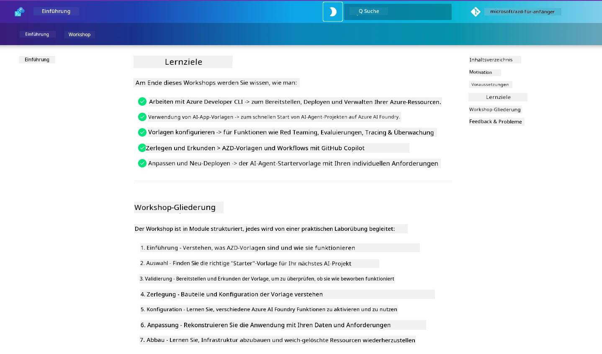

<div align="center">
  <div style="background: linear-gradient(135deg, #0078d4, #106ebe); border-radius: 10px; padding: 20px; margin: 20px 0; box-shadow: 0 4px 15px rgba(0, 120, 212, 0.3); border: 2px solid #005a9e;">
    <h2 style="color: white; margin: 0; font-size: 24px; text-shadow: 1px 1px 2px rgba(0,0,0,0.3);">
      🎯 AZD für KI-Entwickler-Workshop
    </h2>
    <p style="color: white; margin: 10px 0 0 0; font-size: 16px; text-shadow: 1px 1px 2px rgba(0,0,0,0.3);">
      <strong>Ein praxisorientierter Workshop zum Erstellen von KI-Anwendungen mit dem Azure Developer CLI.</strong><br>
      Schließe 7 Module ab, um AZD-Vorlagen und KI-Bereitstellungs-Workflows zu beherrschen.
    </p>
    <div style="margin-top: 15px;">
      <span style="background: rgba(255,255,255,0.2); padding: 5px 10px; border-radius: 15px; color: white; font-size: 14px;">
        📅 Zuletzt aktualisiert: Februar 2026
      </span>
    </div>
  </div>
</div>

# AZD für KI-Entwickler-Workshop

Willkommen zum praxisorientierten Workshop zum Erlernen des Azure Developer CLI (AZD) mit Schwerpunkt auf der Bereitstellung von KI-Anwendungen. Dieser Workshop hilft dir, ein praktisches Verständnis für AZD-Vorlagen in 3 Schritten zu erlangen:

1. **Discovery** - finde die Vorlage, die zu dir passt.
1. **Deployment** - bereitstellen und validieren, dass sie funktioniert
1. **Customization** - anpassen und iterieren, damit sie dir gehört!

Im Verlauf dieses Workshops wirst du auch mit den wichtigsten Entwicklerwerkzeugen und Workflows vertraut gemacht, damit du deine End-to-End-Entwicklungsreise optimieren kannst.

<br/>

## Browserbasierte Anleitung

Die Workshop-Lektionen sind in Markdown. Du kannst sie direkt in GitHub durchsuchen – oder eine browserbasierte Vorschau starten, wie im Screenshot unten gezeigt.



Um diese Option zu nutzen - fork das Repository in dein Profil und starte GitHub Codespaces. Sobald das VS Code-Terminal aktiv ist, gib diesen Befehl ein:

```bash title="" linenums="0"
mkdocs serve > /dev/null 2>&1 &
```

In wenigen Sekunden siehst du ein Popup-Dialogfeld. Wähle die Option `Open in browser`. Die webbasierte Anleitung wird nun in einem neuen Browser-Tab geöffnet. Einige Vorteile dieser Vorschau:

1. **Eingebaute Suche** - finde Schlüsselwörter oder Lektionen schnell.
1. **Kopier-Symbol** - fahre über Codeblöcke, um diese Option zu sehen
1. **Theme-Umschalter** - wechsle zwischen dunkel- und hellem Theme
1. **Hilfe erhalten** - klicke auf das Discord-Symbol in der Fußzeile, um beizutreten!

<br/>

## Workshop-Übersicht

**Dauer:** 3–4 Stunden  
**Niveau:** Anfänger bis Fortgeschrittene  
**Voraussetzungen:** Vertrautheit mit Azure, KI-Konzepten, VS Code und Kommandozeilentools.

Dies ist ein praxisorientierter Workshop, bei dem du durch Tun lernst. Nachdem du die Übungen abgeschlossen hast, empfehlen wir, die AZD For Beginners-Kurrikulum zu überprüfen, um deine Lernreise in Richtung Sicherheits- und Produktivitätsbest Practices fortzusetzen.

| Time| Module  | Objective |
|:---|:---|:---|
| 15 mins | [Introduction](docs/instructions/0-Introduction.md) | Die Bühne setzen, die Ziele verstehen |
| 30 mins | [Select AI Template](docs/instructions/1-Select-AI-Template.md) | Optionen erkunden und eine Starter-Vorlage wählen | 
| 30 mins | [Validate AI Template](docs/instructions/2-Validate-AI-Template.md) | Standardlösung in Azure bereitstellen |
| 30 mins | [Deconstruct AI Template](docs/instructions/3-Deconstruct-AI-Template.md) | Struktur und Konfiguration erkunden |
| 30 mins | [Configure AI Template](docs/instructions/4-Configure-AI-Template.md) | Verfügbare Features aktivieren und ausprobieren |
| 30 mins | [Customize AI Template](docs/instructions/5-Customize-AI-Template.md) | Die Vorlage an deine Bedürfnisse anpassen |
| 30 mins | [Teardown Infrastructure](docs/instructions/6-Teardown-Infrastructure.md) | Aufräumen und Ressourcen freigeben |
| 15 mins | [Wrap-Up & Next Steps](docs/instructions/7-Wrap-up.md) | Lernressourcen, Workshop-Herausforderung |

<br/>

## Was du lernen wirst

Betrachte die AZD-Vorlage als Sandbox, um verschiedene Fähigkeiten und Werkzeuge für die End-to-End-Entwicklung auf Microsoft Foundry zu erkunden. Am Ende dieses Workshops solltest du ein intuitives Verständnis für die verschiedenen Werkzeuge und Konzepte in diesem Kontext haben.

| Concept  | Objective |
|:---|:---|
| **Azure Developer CLI** | Verstehen der Befehle und Workflows des Tools |
| **AZD Templates**| Verstehen der Projektstruktur und Konfiguration |
| **Azure AI Agent**| Provisionierung & Bereitstellung eines Microsoft Foundry-Projekts |
| **Azure AI Search**| Kontext-Engineering mit Agenten ermöglichen |
| **Observability**| Tracing, Monitoring und Auswertungen erkunden |
| **Red Teaming**| Adversariale Tests und Gegenmaßnahmen erkunden |

<br/>

## Aufbau des Workshops

Der Workshop ist so strukturiert, dass er dich von der Vorlagensuche über die Bereitstellung, Dekonstruktion und Anpassung führt - unter Verwendung des offiziellen [Getting Started with AI Agents](https://github.com/Azure-Samples/get-started-with-ai-agents) Starter-Templates als Grundlage.

### [Module 1: Select AI Template](docs/instructions/1-Select-AI-Template.md) (30 mins)

- Was sind KI-Vorlagen?
- Wo finde ich KI-Vorlagen?
- Wie kann ich mit dem Aufbau von KI-Agenten beginnen?
- **Lab**: Quickstart mit GitHub Codespaces

### [Module 2: Validate AI Template](docs/instructions/2-Validate-AI-Template.md) (30 mins)

- Was ist die Architektur der KI-Vorlage?
- Was ist der AZD-Entwicklungs-Workflow?
- Wie kann ich Hilfe zur AZD-Entwicklung erhalten?
- **Lab**: AI Agents-Vorlage bereitstellen & validieren

### [Module 3: Deconstruct AI Template](docs/instructions/3-Deconstruct-AI-Template.md) (30 mins)

- Erkunde deine Umgebung in `.azure/` 
- Erkunde deine Ressourcenkonfiguration in `infra/` 
- Erkunde deine AZD-Konfiguration in `azure.yaml`s
- **Lab**: Umgebungsvariablen ändern & neu bereitstellen

### [Module 4: Configure AI Template](docs/instructions/4-Configure-AI-Template.md) (30 mins)
- Erkunden: Retrieval-Augmented-Generation
- Erkunden: Agent Evaluation & Red Teaming
- Erkunden: Tracing & Monitoring
- **Lab**: AI-Agent + Beobachtbarkeit erkunden 

### [Module 5: Customize AI Template](docs/instructions/5-Customize-AI-Template.md) (30 mins)
- Definieren: PRD mit Szenarienanforderungen
- Konfigurieren: Umgebungsvariablen für AZD
- Implementieren: Lifecycle-Hooks für zusätzliche Aufgaben
- **Lab**: Vorlage für mein Szenario anpassen

### [Module 6: Teardown Infrastructure](docs/instructions/6-Teardown-Infrastructure.md) (30 mins)
- Rückblick: Was sind AZD-Vorlagen?
- Rückblick: Warum Azure Developer CLI verwenden?
- Nächste Schritte: Probiere eine andere Vorlage aus!
- **Lab**: Infrastruktur deprovisionieren & aufräumen

<br/>

## Workshop-Herausforderung

Möchtest du dich selbst mehr herausfordern? Hier sind einige Projektvorschläge – oder teile uns deine Ideen mit!!

| Project | Description |
|:---|:---|
|1. **Zerlege eine komplexe KI-Vorlage** | Verwende den Workflow und die Werkzeuge, die wir skizziert haben, und schau, ob du eine andere KI-Lösungs-Vorlage bereitstellen, validieren und anpassen kannst. _Was hast du gelernt?_|
|2. **Passe sie an dein Szenario an**  | Versuche, ein PRD (Product Requirements Document) für ein anderes Szenario zu schreiben. Verwende dann GitHub Copilot in deinem Template-Repo im Agent Model – und bitte es, einen Anpassungs-Workflow für dich zu generieren. _Was hast du gelernt? Wie könntest du diese Vorschläge verbessern?_|
| | |

## Hast du Feedback?

1. Erstelle ein Issue in diesem Repo – markiere es zur besseren Übersicht mit `Workshop`.
1. Tritt dem Microsoft Foundry Discord bei – vernetze dich mit deinen Kolleg:innen!


| | | 
|:---|:---|
| **📚 Course Home**| [AZD For Beginners](../README.md)|
| **📖 Documentation** | [Get started with AI templates](https://learn.microsoft.com/en-us/azure/ai-foundry/how-to/develop/ai-template-get-started)|
| **🛠️AI Templates** | [Microsoft Foundry Templates](https://ai.azure.com/templates) |
|**🚀 Next Steps** | [Begin Workshop](../../../workshop) |
| | |

<br/>

---

**Navigation:** [Main Course](../README.md) | [Introduction](docs/instructions/0-Introduction.md) | [Module 1: Select Template](docs/instructions/1-Select-AI-Template.md)

**Bereit, mit AZD KI-Anwendungen zu entwickeln?**

[Workshop beginnen: Einführung →](docs/instructions/0-Introduction.md)

---

<!-- CO-OP TRANSLATOR DISCLAIMER START -->
Haftungsausschluss:
Dieses Dokument wurde mithilfe des KI-Übersetzungsdienstes Co-op Translator (https://github.com/Azure/co-op-translator) übersetzt. Obwohl wir uns um Genauigkeit bemühen, beachten Sie bitte, dass automatisierte Übersetzungen Fehler oder Ungenauigkeiten enthalten können. Das Originaldokument in seiner Ausgangssprache ist als maßgebliche Quelle zu betrachten. Für kritische Informationen wird eine professionelle menschliche Übersetzung empfohlen. Wir übernehmen keine Haftung für Missverständnisse oder Fehlinterpretationen, die aus der Verwendung dieser Übersetzung entstehen.
<!-- CO-OP TRANSLATOR DISCLAIMER END -->